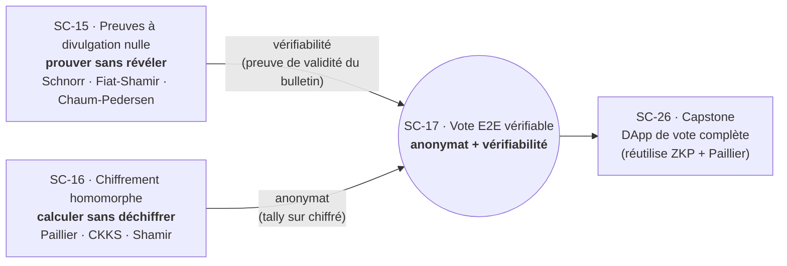

# 04-Privacy-Cryptography - Preuves Zero-Knowledge, Chiffrement Homomorphe et Vote Vérifiable

**Navigation** : [Sommaire de la série](../README.md) | [<< SC-14 Formal Verification](../03-Foundry-Testing/SC-14-Formal-Verification.ipynb) | [SC-18 Vyper >>](../05-Alternative-Chains/SC-18-Vyper.ipynb)

Cette quatrieme sous-série (SC-15 a SC-17) explore la cryptographie avancée au service de la confidentialite sur blockchain : les **preuves a divulgation nulle** (Zero-Knowledge Proofs), le **chiffrement homomorphe** (calcul sur données chiffrees), et le **vote électronique de bout en bout vérifiable** (E2E). Ces notebooks implementent les protocoles cryptographiques pour de vrai en Python (`pycryptodome`, `phe`, `tenseal`), avec la crypto Paillier et Schnorr reelement executee dans les outputs committes.

---

## Notebooks

| # | Notebook | Durée | Contenu |
|---|----------|-------|---------|
| 15 | [SC-15-Zero-Knowledge-Proofs](SC-15-Zero-Knowledge-Proofs.ipynb) | 60 min | ZKP, protocole de Schnorr from scratch, Fiat-Shamir, Sigma protocols, Chaum-Pedersen |
| 16 | [SC-16-Homomorphic-Encryption](SC-16-Homomorphic-Encryption.ipynb) | 50 min | Chiffrement homomorphe (PHE/SHE/FHE), Paillier (`phe`), CKKS (`tenseal`), partage de secrets de Shamir |
| 17 | [SC-17-E2E-Vérifiable-Voting](SC-17-E2E-Verifiable-Voting.ipynb) | 45 min | Paradoxe du vote électronique, vote a la main (Paillier + ZKP), bulletin board, ElectionGuard |

**Total** : 3 notebooks, ~2h35.

SC-17 ne présente pas une primitive de plus : il **assemble** les preuves à divulgation nulle (SC-15) et le chiffrement homomorphe (SC-16) pour résoudre le paradoxe du vote électronique — concilier **anonymat** et **vérifiabilité**. Ce diagramme en fait la synthèse : chaque primitive assure l'une des deux propriétés opposées du paradoxe, et le capstone SC-26 les réutilisera toutes deux.

---

## Parcours d'apprentissage

### Étape 1 : Preuves Zero-Knowledge (SC-15, 60 min)

Les **preuves a divulgation nulle** : prouver la connaissance d'un secret sans le reveler. Implémentation from scratch du **protocole de Schnorr** (preuve de connaissance d'un logarithme discret), transformation de **Fiat-Shamir** (rendre un protocole interactif non-interactif via oracle aleatoire), et exploration des **Sigma protocols** avec le protocole de **Chaum-Pedersen**. Crypto `pycryptodome` réelle dans les outputs.

### Étape 2 : Chiffrement homomorphe (SC-16, 50 min)

Le calcul sur données chiffrees : trois variantes (**PHE** partiellement homomorphe, **SHE** partiellement, **FHE** complètement). Schéma de **Paillier** (additivement homomorphe) avec `phe`, schéma **CKKS** pour l'arithmetique approchee avec `tenseal`, et **calcul multipartite sécurisé** (MPC) via le partage de secrets de **Shamir**. Paillier et Shamir sont exécutés réellement ; CKKS/TenSEAL depend d'une installation optionnelle.

### Étape 3 : Vote vérifiable (SC-17, 45 min)

Le **paradoxe du vote électronique** : concilier **anonymat** et **vérifiabilité**. Construction d'un système de vote a la main combinant **Paillier + ZKP**, implémentation d'un **bulletin board** publiquement vérifiable, et découverte d'**ElectionGuard** (Microsoft), l'état de l'art en vote E2E vérifiable. Le tally (3+2+2=7) est corroboré dans les outputs ; la partie ElectionGuard est disclosed comme simulation conceptuelle.

---

## Prérequis

### Par notebook

| Notebook | Fondations requises | Dépendances |
|----------|---------------------|-------------|
| SC-15 Zero-Knowledge-Proofs | Arithmetique modulaire de base ; Python | `pycryptodome` (nombres premiers), `hashlib` (stdlib) |
| SC-16 Homomorphic-Encryption | Python ; notions de crypto | `phe` (python-paillier), `tenseal` (optionnel), `mpyc` (optionnel) |
| SC-17 E2E-Vérifiable-Voting | [SC-15](SC-15-Zero-Knowledge-Proofs.ipynb) + [SC-16](SC-16-Homomorphic-Encryption.ipynb) complètes | `phe`, `pycryptodome`, `electionguard` (optionnel SOTA) |

### Configuration requise

- **Python 3.10+** avec :
  - `pip install pycryptodome` (SC-15 grands nombres premiers, SC-17)
  - `pip install phe` (SC-16 Paillier, SC-17)
  - `pip install tenseal` (SC-16 CKKS — **optionnel**, depend d'une toolchain C++ ; sans lui, la partie CKKS tourne en repli disclose)
  - `pip install mpyc` (SC-16 MPC — optionnel)
  - `pip install electionguard` (SC-17 SOTA — optionnel)
- Aucune blockchain, aucun faucet nécessaire : la crypto tourne en Python pur.

---

## Ponts inter-séries

| Série | Lien | Relation |
|-------|------|----------|
| [SmartContracts (parent)](../README.md) | Vue d'ensemble | Contexte, parcours global, glossaire |
| [03-Foundry-Testing](../03-Foundry-Testing/SC-12-Foundry-Testing.ipynb) | Predecesseur | SC-12..14 (tests Foundry, fuzzing, vérification formelle) |
| [05-Alternative-Chains](../05-Alternative-Chains/SC-18-Vyper.ipynb) | Suite | SC-18..22 (Vyper, XRP, Bitcoin, Move, Solana) |
| [06-Real-World](../06-Real-World/SC-23-Cross-Chain.ipynb) | Capstone | SC-23..26 mobilisent ZKP + chiffrement homomorphe (projet final) |

---

## Points de vigilance (dépendances cryptographiques)

- **Paillier + Schnorr exécutés réellement** (SC-15, SC-16, SC-17) : les outputs committes refletent une vraie exécution crypto `phe`/`pycryptodome`. Les parametres (clés, challenges, reponses) sont authentiques.
- **CKKS / TenSEAL (SC-16) optionnel** : si `tenseal` n'est pas installe, la section CKKS tourne en repli honnêtement disclose (message `TenSEAL non installe`), avec des plages d'erreur illustrees. Audit #3164 a vérifie que les nombres measures au-dessus de ce repli sont honnêtement documentés (PR #3382).
- **ElectionGuard (SC-17)** : la partie SOTA est disclose comme **simulation conceptuelle** (ElectionGuard requiert un setup lourd) ; le vote a la main Paillier+ZKP est lui réellement exécute.
- **ZKP interactif vs non-interactif** : SC-15 implémente les deux formes ; vérifier que la transformation Fiat-Shamir produit bien un proof non-transferable.

---

## Ressources

- **Schnorr, C.-P. (1991)** -- "Efficient Signature Génération by Smart Cards", *Journal of Cryptology* 4(3). Protocole de Schnorr.
- **Fiat, A., & Shamir, A. (1987)** -- "How To Prove Yourself: Practical Solutions to Identification and Signature Problems", *CRYPTO 1986*, LNCS 263. Transformation Fiat-Shamir.
- **Chaum, D., & Pedersen, T. (1993)** -- "Wallet Databases with Observers", *CRYPTO 1992*. Protocole Chaum-Pedersen.
- **Paillier, P. (1999)** -- "Public-Key Cryptosystems Based on Composite Degree Residuosity Classes", *EUROCRYPT 1999*. Schéma de Paillier (additivement homomorphe).
- **Shamir, A. (1979)** -- "How to Share a Secret", *Communications of the ACM* 22(11). Partage de secrets.
- **ElectionGuard** (Microsoft, 2019) -- specification du vote E2E vérifiable. github.com/microsoft/electionguard.
- Voir aussi les références transversales dans le [README parent de la série](../README.md).

---

## Conclusion / Prochaines étapes

### Ce que vous avez appris

Cette quatrième sous-série explore la **cryptographie avancée au service de la confidentialité** sur blockchain. L'arc pédagogique attaque un par un les paradoxes qui rendent la vie privée difficile sur une chaîne publique :

- **Les preuves à divulgation nulle** (SC-15) — prouver la connaissance d'un secret sans le révéler. Implémentation from scratch du **protocole de Schnorr** (preuve de connaissance d'un logarithme discret), transformation de **Fiat-Shamir** (rendre un protocole interactif non-interactif via oracle aléatoire), et **Sigma protocols** avec **Chaum-Pedersen**.
- **Le chiffrement homomorphe** (SC-16) — le calcul sur données chiffrées : variantes PHE/SHE/FHE, schéma de **Paillier** (additivement homomorphe) avec `phe`, schéma **CKKS** pour l'arithmétique approchée, et calcul multipartite sécurisé via le partage de secrets de **Shamir**. Paillier et Shamir sont exécutés réellement.
- **Le vote vérifiable de bout en bout** (SC-17) — le **paradoxe du vote électronique** : concilier **anonymat** et **vérifiabilité**. Construction d'un système de vote combinant Paillier + ZKP, implémentation d'un bulletin board publiquement vérifiable, et découverte d'**ElectionGuard** (Microsoft), l'état de l'art.

La crypto `pycryptodome` et `phe` est réellement exécutée dans les outputs committés (Paillier, Schnorr, Shamir) ; les dépendances optionnelles (CKKS/TenSEAL, ElectionGuard) tournent en repli honnêtement disclosed.

### Prochaines étapes

- **Quitter la EVM** : la suite est [05-Alternative-Chains](../05-Alternative-Chains/README.md) (SC-18 à SC-22), qui élargit le horizon à Vyper, XRP, Bitcoin, Move et Solana.
- **Le capstone** : [06-Real-World / SC-26](../06-Real-World/SC-26-Final-Project.ipynb) réutilisera directement ZKP (SC-15) et Paillier (SC-16) dans une DApp de vote complète — ces primitives prennent tout leur sens assemblées.
- **La série dans son ensemble** : le [sommaire SmartContracts](../README.md) cartographie les six sous-séries — celle-ci est le socle cryptographique.

### Le fil rouge

La cryptographie de confidentialité propose un changement de regard sur la transparence : ne plus opposer **confidentialité** et **vérifiabilité** comme un compromis, mais les **réconcilier par la cryptographie**. Les preuves à divulgation nulle (prouver sans révéler), le chiffrement homomorphe (calculer sans déchiffrer) et le vote E2E (anonymat + vérifiabilité) sont trois variations du même idéal : faire confiance à la **preuve mathématique** plutôt qu'à l'**autorité** — un idéal particulièrement précieux sur une chaîne publique où chaque transaction est, par défaut, transparente.
