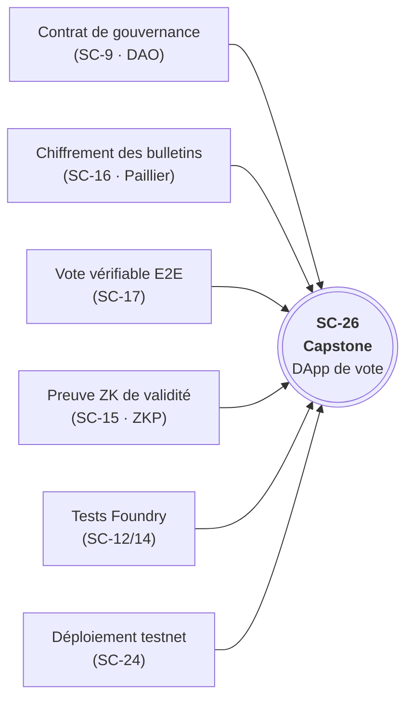

# 06-Real-World - SmartContracts en Production

**Navigation** : [Sommaire de la série](../README.md) | [<< SC-22 Solana & Anchor](../05-Alternative-Chains/SC-22-Solana-Anchor.ipynb)

La dernière sous-série SmartContracts (SC-23 a SC-26) fait le passage de la théorie au déploiement réel. On quitte le bac a sable `anvil` local pour affronter des réseaux publics : testnets Ethereum/XRP, mainnets L2 (Base, Polygon), ponts cross-chain Chainlink CCIP, et un projet capstone qui combine vote, chiffrement homomorphique, preuve ZKP et tests Foundry.

Ces notebooks supposent que les clés API et private keys sont lues depuis l'environnement (`.env`, `os.getenv`) -- ils ne s'exécutent pas end-to-end sans configuration externe (faucet testnet, clé Infura/Alchemy, ETH sur L2). Les outputs committes documentent honnêtement ce qui se passe quand la configuration est absente (messages `DEPLOYER_PRIVATE_KEY non configure`, simulations conceptuelles disclosees), et ce qui a réellement tourne quand elle est présente.

---

## Notebooks

| # | Notebook | Durée | Contenu |
|---|----------|-------|---------|
| 23 | [SC-23-Cross-Chain](SC-23-Cross-Chain.ipynb) | ~45 min | Interoperabilite, Chainlink CCIP, bridge simple, sécurité cross-chain |
| 24 | [SC-24-Testnet-Deploy](SC-24-Testnet-Deploy.ipynb) | ~50 min | Sepolia via Alchemy/Infura, faucet, déploiement + interaction testnet, XRP Testnet via xrpl-py |
| 25 | [SC-25-Mainnet-Deploy](SC-25-Mainnet-Deploy.ipynb) | ~40 min | Choix L2 (Base/Polygon/Arbitrum), estimation de cout, déploiement mainnet, checklist sécurité, vérification explorateur |
| 26 | [SC-26-Final-Project](SC-26-Final-Project.ipynb) | ~90 min | Capstone : vote Solidity + chiffrement Paillier + preuve ZKP + déploiement anvil/testnet + tests Foundry |

Le capstone SC-26 ne présente pas un concept nouveau : il **assemble les briques acquises** dans les sous-séries précédentes en une DApp de vote complète. Ce diagramme en fait la synthèse — chaque brique pointe vers son notebook d'origine :

---

## Parcours d'apprentissage

### Phase 1 : Interoperabilite (SC-23, ~45 min)

Pourquoi deplacer un actif ou un message d'une chaîne a l'autre, comment Chainlink CCIP fait transituer des données on-chain de maniere vérifiable, et ou se cachent les attaques cross-chain (reentrancy de bridge, message spoofing). Le notebook reste en mode source-as-strings (les contrats CCIP sont lus comme texte pédagogique, non déployés).

### Phase 2 : Deploiement public (SC-24 + SC-25, ~1h30)

Le coeur metier de la sous-série. SC-24 déployé sur Sepolia (Ethereum testnet) et envoie des transactions sur le XRP Testnet ; SC-25 monte en gamme vers un mainnet L2 (Base, chain_id 8453) ou un déploiement coute quelques centimes. Les deux notebooks couvrent le cycle complet : connexion RPC, wallet, gas, broadcast, vérification.

> **Cout réel** : SC-25 sur Base/Polygon coute ~$0.01-0.50 par déploiement, contre des dizaines de dollars sur Ethereum L1. C'est le motif pédagogique des L2 : même sécurité (settlement L1), cout divisé par 100-1000x.

### Phase 3 : Capstone (SC-26, ~90 min)

SC-26 assemble toute la série (SC-0..25) en une DApp de vote complète : smart contract de gouvernance (cf SC-9), chiffrement homomorphique des bulletins via Paillier (cf SC-16-17), preuve zero-knowledge de validite du bulletin (cf SC-15), déploiement sur anvil puis testnet (cf SC-24), tests Foundry (cf SC-12-14). C'est le notebook de cloture -- il suppose tous les autres acquis.

---

## Prérequis

### Par notebook

| Notebook | Prérequis | Dépendances |
|----------|-----------|-------------|
| SC-23 Cross-Chain | SC-3..SC-8 (Solidity), notions de bridges | Compte testnet Sepolia |
| SC-24 Testnet-Deploy | SC-2 (Setup web3.py), SC-3 (Solidity Basics) | `web3 py-solc-x xrpl-py python-dotenv` + clé API Alchemy/Infura |
| SC-25 Mainnet-Deploy | SC-24 complète | `web3 py-solc-x python-dotenv` + ETH sur Base/Polygon (~$0.01-0.50) |
| SC-26 Final-Project | SC-0..25 (toute la série), en particulier SC-9/SC-15/SC-16-17/SC-24 | Foundry (forge, anvil), web3, pycryptodome |

### Configuration requise

Ces notebooks ne s'exécutent pas sans configuration externe. Variables d'environnement attendues (via `.env`, jamais inline dans le code) :

- `ALCHEMY_API_KEY` ou `INFURA_API_KEY` -- endpoint RPC Sepolia/Base
- `DEPLOYER_PRIVATE_KEY` -- wallet de déploiement (testnet ou L2 mainnet)
- XRP Testnet : wallet + seed generes via faucet XRP

Sans ces variables, les notebooks tournent en mode degrade et les outputs committes le documentent (messages `non configure`, `Interaction non disponible`).

---

## Ponts inter-séries

| Série | Lien | Relation |
|-------|------|----------|
| [05-Alternative-Chains](../05-Alternative-Chains/SC-22-Solana-Anchor.ipynb) | Precedent | Solana, Move, Vyper, XRP -- les blockchains abordees dans SC-24/25 |
| [03-Foundry-Testing](../03-Foundry-Testing/) | Tests | SC-26 capstone utilise forge/anvil |
| [04-Privacy-Cryptography](../04-Privacy-Cryptography/) | Crypto | SC-26 réutilise Paillier (SC-16-17) et ZKP (SC-15) |
| [SmartContracts parent](../README.md) | Vue d'ensemble | Progression complète SC-0..SC-26 |

---

## Points de vigilance (déploiement réel)

- **Jamais de clé privée dans le code** : `os.getenv("DEPLOYER_PRIVATE_KEY")` sans valeur par defaut. Un secret inline = leak (cf `.claude/rules/secrets-hygiene.md`).
- **Testnet avant mainnet** : SC-24 (Sepolia, gratuit) systematiquement avant SC-25 (Base/Polygon, payant).
- **Gas est un cout réel sur mainnet** : SC-25 sur L2 reste bon marche, mais un déploiement foire multiplie le cout. La checklist de SC-25 (audit, vérification explorateur, proxy pattern) existe pour ca.
- **Verification de contrat** : après déploiement mainnet, publier le source code sur l'explorateur (Basescan, Polygonscan) pour transparence et interaction depuis le front-end.

---

## Ressources

- [Chainlink CCIP Docs](https://docs.chain.link/ccip) -- cross-chain messaging (SC-23)
- [Sepolia Faucet](https://sepoliafaucet.com/) -- testnet ETH gratuit (SC-24)
- [XRP Ledger Testnet](https://xrpl.org/xrp-test-net-faucets.html) -- faucet XRP (SC-24)
- [Base / Polygon docs](https://docs.base.org/) -- L2 mainnet deployment (SC-25)
- [Basescan](https://basescan.org/) / [Polygonscan](https://polygonscan.com/) -- vérification de contrat (SC-25)

Voir aussi les [Ressources Externes du README parent](../README.md#ressources-externes) pour les références academiques transversales (Foundry Book, OpenZeppelin, ElectionGuard).

---

## Conclusion / Prochaines étapes

### Ce que vous avez appris

Cette dernière sous-série fait le **passage de la théorie au déploiement réel**. L'arc pédagogique quitte le bac à sable `anvil` local pour affronter des réseaux publics, et assemble toute la série dans un capstone :

- **L'interopérabilité cross-chain** (SC-23) — pourquoi déplacer un actif ou un message d'une chaîne à l'autre, comment Chainlink CCIP fait transiter des données on-chain de manière vérifiable, et où se cachent les attaques (reentrancy de bridge, message spoofing).
- **Le déploiement public** (SC-24, SC-25) — le cœur métier : déployer sur Sepolia (testnet Ethereum) et transiger sur le XRP Testnet (SC-24), puis monter en gamme vers un mainnet L2 (Base, chain_id 8453) où un déploiement coûte quelques centimes (SC-25). Le cycle complet : connexion RPC, wallet, gas, broadcast, vérification.
- **Le capstone** (SC-26) — la DApp de vote qui assemble toute la série : smart contract de gouvernance (cf SC-9), chiffrement homomorphe des bulletins via Paillier (cf SC-16/17), preuve zero-knowledge de validité (cf SC-15), déploiement anvil puis testnet (cf SC-24), tests Foundry (cf SC-12/14).

Ces notebooks supposent des clés API et private keys lues depuis l'environnement — les outputs committés documentent honnêtement ce qui se passe quand la configuration est absente, et ce qui a réellement tourné quand elle est présente.

### Prochaines étapes

- **Le retour aux fondamentaux** : après ce capstone, la série est complète. Le meilleur approfondissement est de reprendre un notebook fondateur ([SC-0](../00-Foundations/SC-0-Cypherpunk-Origins.ipynb) ou [SC-3](../01-Solidity-Foundation/SC-3-Solidity-Basics.ipynb)) — les primitives et la syntaxe se comprennent autrement une fois qu'on a déployé et sécurisé un système réel.
- **Au-delà des smart contracts** : [SymbolicAI/Lean](../../Lean/README.md) prolonge l'idéal de vérification (cf SC-14) vers la preuve mathématique ; [GameTheory/SocialChoice](../../../GameTheory/SocialChoice/README.md) approfondit les fondations théoriques du vote (cf SC-9/SC-17, capstone SC-26).
- **La série dans son ensemble** : le [sommaire SmartContracts](../README.md) cartographie les six sous-séries — celle-ci clôt le parcours SC-0 → SC-26.

### Le fil rouge

Les smart contracts en production proposent un changement de regard sur le déploiement : ne plus opposer **théorie** et **pratique**, mais comprendre qu'un protocole n'est vraiment éprouvé qu'**exposé au monde réel** (gas coûteux, adversaires, immutabilité). Le passage testnet → mainnet L2, la discipline du secret (`os.getenv`, jamais inline) et le capstone qui assemble vote, chiffrement homomorphe et preuve ZKP ne sont pas des exercices accessoires : ils sont la *validation* de tout ce que les cinq sous-séries précédentes ont construit. La leçon transversale : un smart contract n'est jamais « fini » tant qu'il n'a pas survécu au contact d'un réseau public — et c'est précisément cette épreuve qui transforme une démonstration pédagogique en un système digne de confiance.
