# Smart Contracts - Des Cypherpunks aux Blockchains Modernes

[← Planners](../Planners/README.md) | [↑ SymbolicAI](../README.md) | [Argument_Analysis →](../Argument_Analysis/README.md)

<!-- CATALOG-STATUS
series: SymbolicAI-SmartContracts
pedagogical_count: 27
breakdown: SmartContracts=27
maturity: PRODUCTION=27
-->

Série de notebooks éducatifs couvrant les fondements cryptographiques, le développement Solidity, les tests, la cryptographie avancée (ZKP, HE, vote vérifiable), et les blockchains alternatives.

Un smart contract est un programme qui s'exécute tout seul sur une blockchain : une fois déployé, son code fait foi, transfère de la valeur et applique des règles sans intermédiaire ni possibilité de revenir en arrière. C'est ce qui fait sa puissance — des écosystèmes entiers (DeFi, NFT, DAO) reposent dessus — et son danger : un bug n'est pas un patch à pousser le lendemain, c'est une faille immuable qui peut coûter des millions (le hack de The DAO en 2016, les exploits de ponts cross-chain). D'où le poids accordé dans cette série aux **tests, au fuzzing et à la vérification formelle** autant qu'au développement.

Le parcours suit le fil annoncé par le titre : on part des **primitives cryptographiques** des cypherpunks (hachage, arbres de Merkle, preuve de travail, signatures) pour comprendre *pourquoi* une blockchain tient, puis on construit en **Solidity** (types, héritage, standards ERC, DeFi, gouvernance), on **sécurise** (Foundry, invariants, vérification formelle), on explore la **cryptographie pour la vie privée** (ZKP, chiffrement homomorphique, vote vérifiable de bout en bout), avant d'élargir aux **chaînes alternatives** (Vyper, XRP, Bitcoin Script, Move/Sui, Solana) et au **déploiement réel** sur testnet puis mainnet. L'objectif final n'est pas seulement de savoir écrire un contrat, mais de savoir le rendre digne de confiance.

---

**À qui s'adresse cette série** : développeurs Solidity, ingénieurs DeFi, spécialistes security/blockchain, étudiants en IA symbolique intéressés par la vérification formelle. Un niveau intermédiaire en programmation est recommandé — les bases de Python sont suffisantes, mais les concepts blockchain/cryptographie sont introduits progressivement. Le décompte exact des notebooks et leur maturité figurent dans le catalogue généré ci-dessous.

## Objectifs d'apprentissage

A l'issue de cette série, vous serez capable de :

1. **Construire** des smart contracts Solidity fonctionnels (types, fonctions, héritage, standards ERC)
2. **Déployer** et interagir avec des contrats sur des blockchains réelles (Anvil, Sepolia, XRP testnet)
3. **Tester** rigoureusement (unit tests, fuzzing, invariants) avec Foundry
4. **Vérifier** formellement la correction de contrats (SMT solvers, Certora)
5. **Implémenter** des primitives cryptographiques from scratch (ZKP, chiffrement homomorphique, signatures)
6. **Explorer** les blockchains alternatives (Vyper, XRP, Bitcoin Script, Move/Sui, Solana)
7. **Déployer** en production sur testnet et mainnet

## Vue d'ensemble

| Statistique | Valeur |
|-------------|--------|
| Notebooks | 27 (SC-0 à SC-26) |
| Durée totale | ~22 heures |
| Langage | Python (kernel Jupyter) |
| Kernels | Python 3 |
| Outils | Foundry (forge/cast/anvil), web3.py, py-solcx |
| Cryptographie | pycryptodome, phe, TenSEAL |
| Niveaux | Débutant à Avancé (Parties 0-6) |

Le parcours ne suit pas une liste de sujets : il suit le **cycle de vie d'un smart contract**, chaque phase ajoutant une couche de robustesse jusqu'à un contrat *digne de confiance*.

```mermaid
flowchart LR
    P1["<b>1 · Fondations</b><br/>primitives crypto :<br/>hash, Merkle, PoW, signatures"]
    P2["<b>2-3 · Solidity</b><br/>types → ERC-20/721/1155,<br/>DeFi, gouvernance DAO"]
    P3["<b>4 · Sécurité</b><br/>Foundry : tests, fuzzing,<br/>vérification formelle SMT"]
    P4["<b>5 · Vie privée</b><br/>ZKP, chiffrement<br/>homomorphique, vote"]
    P5["<b>6 · Alternatives</b><br/>Vyper · XRP · Bitcoin<br/>· Move · Solana"]
    P6["<b>7 · Déploiement</b><br/>testnet Sepolia,<br/>mainnet L2, capstone"]
    P1 -->|"comprendre pourquoi une blockchain tient"| P2
    P2 -->|"construit, il faut sécuriser"| P3
    P3 -->|"sécurisé, explorer la confidentialité"| P4
    P4 -->|"élargir à d'autres paradigmes"| P5
    P5 -->|"prêt pour le monde réel"| P6
```



## Parcours d'apprentissage

### Phase 1 : Fondations (~2h10)

Les notebooks 0-2 posent les bases historiques et techniques. Le notebook 0 explore les primitives cryptographiques qui fondent la blockchain (hash, arbres de Merkle, preuve de travail, signatures, DHT). Le notebook 1 installe Foundry — forge, cast, anvil — l'outil de développement principal. Le notebook 2 configure web3.py + py-solcx pour compiler et déployer des contrats Solidity réellement sur Anvil (blockchain locale). À l'issue de cette phase, vous avez un environnement fonctionnel et déployez votre premier contrat.

### Phase 2 : Solidity Fondements (~2h30)

Les notebooks 3-6 couvrent les bases de Solidity : types et variables (SC-3), fonctions et état (SC-4), héritage et interfaces (SC-5), erreurs et events (SC-6). Chaque notebook inclut un déploiement réel sur Anvil. Cette phase vise la maîtrise du langage de base — pas de code Solidity ne peut être écrit sans ces fondamentaux.

### Phase 3 : Solidity Avancé (~4h30)

Les notebooks 7-11 abordent les standards token (ERC-20, ERC-721, ERC-1155), les primitives DeFi (AMM, lending, oracles), la gouvernance DAO, l'account abstraction (ERC-4337), et l'assistance LLM pour les smart contracts. C'est le cœur technique de la série — chaque concept est illustré par un contrat déployable.

### Phase 4 : Testing et Sécurité (~2h15)

Les notebooks 12-14 traitent de la sécurité : tests unitaires Foundry (SC-12), fuzz testing et invariants (SC-13), vérification formelle (SC-14). La campagne de fuzzing de SC-13 s'exécute sur le **vrai** Foundry (`forge test --fuzz-runs`) et **trouve un contre-exemple concret** — un overflow arithmétique (`panic 0x11`) sur un calcul de moyenne naïf que les seuls tests unitaires laissaient passer : la démonstration que le fuzzing attrape les bugs qu'on n'avait pas anticipés. Cette phase est cruciale — un smart contract non testé est un contrat non déployable en production. La vérification formelle (SMT solvers, Certora) représente le pont vers la preuve mathématique de correction.

### Phase 5 : Cryptographie et Vie Privée (~3h)

Les notebooks 15-17 construisent des primitives cryptographiques from scratch : preuves à connaissance nulle (Schnorr, Fiat-Shamir, sigma protocols), chiffrement homomorphique (Paillier, CKKS/TenSEAL), et un système de vote vérifiable de bout en bout (ElectionGuard). Cette partie est la plus théorique mais la plus puissante — elle montre comment protéger la vie privée sur des blockchains transparentes.

### Phase 6 : Blockchains Alternatives (~4h)

Les notebooks 18-22 explorent cinq blockchains non-EVM : Vyper (smart contracts Python-like), XRP Ledger (xrpl-py, trust lines), Bitcoin Script (UTXO model), Move/Sui (modèle objet), et Solana avec le framework Anchor. Chaque notebook est autonome et illustre un paradigme de programmation différent.

### Phase 7 : Déploiement Réel (~3h45)

Les notebooks 23-26 couvrent l'interopérabilité cross-chain, le déploiement sur testnet (Sepolia + XRP testnet), le déploiement mainnet (L2 Base/Polygon), et le projet capstone intégré. C'est la phase de transition vers le monde réel — tout le travail précédent sert à construire, tester et déployer un projet complet.

## Parcours alternatifs

### Parcours Solidity intensif (~8h)

Se concentrer sur les phases 1-3 + phase 4 (testing) : SC-0, SC-1-2, SC-3 à SC-6, SC-7 à SC-11, SC-12-14. Idéal pour développeurs souhaitant maîtriser rapidement le développement Ethereum.

### Parcours Cryptographie (~3h)

Les notebooks 15-17 : ZKP, chiffrement homomorphique, vote vérifiable. Prérequis : notions de base en algèbre et probabilités. Pas nécessaire de passer par les phases 1-4 (les primitives sont introduites in-context).

### Parcours Blockchains alternatives (~4h)

Les notebooks 18-22 : Vyper, XRP, Bitcoin, Move, Solana. Chaque notebook est autonome — l'ordre n'est pas critique. Utile pour comprendre les paradigmes non-EVM.

### Parcours Security-first (~7h)

Fondations (SC-0-2) + Solidity basique (SC-3-6) + Testing avancé (SC-12-14) + Vérification formelle (SC-14). Pour développeurs souhaitant se spécialiser en smart contract auditing.

## Quel parcours choisir ?

| Objectif | Parcours recommandé | Durée |
|----------|-------------------|-------|
| Découvrir la blockchain | SC-0 → SC-1 → SC-2 → SC-3 | 3h |
| Devenir développeur Solidity | Parcours Solidity intensif | 8h |
| Spécialiser en sécurité | Parcours Security-first | 7h |
| Cryptographie avancée | Parcours Cryptographie | 3h |
| Explorer les chains non-EVM | Parcours alternatives | 4h |
| Se déployer en production | Parcours complet + SC-23-26 | 22h |
| Comprendre DeFi | SC-7-8-9 | 2h30 |
| Gouvernance DAO | SC-9-10-17 | 2h |

## Structure

```text
SmartContracts/
├── 00-Foundations/              # Histoire + Setup (3 notebooks)
├── 01-Solidity-Foundation/     # Fondements Solidity (4 notebooks)
├── 02-Solidity-Advanced/       # Solidity avancé (5 notebooks)
├── 03-Foundry-Testing/         # Tests et sécurité (3 notebooks)
├── 04-Privacy-Cryptography/    # ZKP, HE, Vote E2E (3 notebooks)
├── 05-Alternative-Chains/      # Vyper, XRP, Bitcoin, Move, Solana (5 notebooks)
├── 06-Real-World/              # Cross-chain, deploy testnet/mainnet (4 notebooks)
├── foundry-lib/                # Workspace Foundry + sous-modules (forge-std, OpenZeppelin, ERC-4337)
├── mon-premier-projet/         # Projet Foundry de démarrage (squelette scaffold)
├── scripts/                    # Setup multi-plateforme (setup.sh, WSL, kernel Jupyter)
├── requirements.txt            # Dépendances Python
└── setup_env.py                # Orchestrateur Python (--setup / --check / --start-anvil)
```

## Parcours recommande

```
  Partie 0 (Fondations)
      │
      ▼
  Partie 1 (Solidity Fondements)
      │
      ▼
  Partie 2 (Solidity Avance) ───────┐
      │                             │
      ▼                             │
  Partie 3 (Testing) ───────────────┤
      │                             │
      ▼                             │
  Partie 4 (Cryptographie) ─────────┤
      │                             │
      ▼                             │
  Partie 5 (Alternatives) ──────────┤  (chaque notebook est autonome)
      │                             │
      ▼                             │
  Partie 6 (Real-World) ────────────┘
      │
      ▼
  SC-26 (Projet capstone)
```

**Objectifs par partie** :

| Partie | Objectif principal | Livrable attendu |
|--------|-------------------|------------------|
| 0 | Installer l'environnement + comprendre les bases | Anvil en marche + 1er contrat déployé |
| 1 | Maîtriser le langage Solidity | Contrats types, fonctions, héritage fonctionnels |
| 2 | Construire des protocoles DeFi complets | Token ERC-20 + AMM + DAO déployés |
| 3 | Tester et vérifier un contrat | Suite de tests, fuzzing, vérification formelle |
| 4 | Cacher des données sur blockchain publique | ZKP + chiffrement homomorphique fonctionnels |
| 5 | Comprendre les architectures alternatives | Contracts déployés sur Vyper/XRP/Bitcoin/Move/Solana |
| 6 | Déployer en production | Contrat sur testnet/mainnet + projet capstone |

## Progression

### Partie 0 : Fondations et Histoire (~2h10)

| # | Notebook | Durée | Contenu |
|---|----------|-------|---------|
| 0 | [SC-0-Cypherpunk-Origins](00-Foundations/SC-0-Cypherpunk-Origins.ipynb) | 60 min | Hash, Merkle, PoW, signatures, DHT - code exécutable |
| 1 | [SC-1-Setup-Foundry](00-Foundations/SC-1-Setup-Foundry.ipynb) | 30 min | Installation Foundry (forge, cast, anvil) |
| 2 | [SC-2-Setup-Web3py](00-Foundations/SC-2-Setup-Web3py.ipynb) | 40 min | web3.py + py-solcx + compile/deploy réel |

**Objectifs** : Comprendre les origines Cypherpunk, installer l'environnement, déployer un premier contrat

### Partie 1 : Solidity Fondements (~2h30)

| # | Notebook | Durée | Contenu |
|---|----------|-------|---------|
| 3 | [SC-3-Solidity-Basics](01-Solidity-Foundation/SC-3-Solidity-Basics.ipynb) | 40 min | Types, variables, structure |
| 4 | [SC-4-Functions-State](01-Solidity-Foundation/SC-4-Functions-State.ipynb) | 45 min | Fonctions, modifiers, storage |
| 5 | [SC-5-Inheritance](01-Solidity-Foundation/SC-5-Inheritance.ipynb) | 35 min | Héritage, interfaces |
| 6 | [SC-6-Errors-Events](01-Solidity-Foundation/SC-6-Errors-Events.ipynb) | 30 min | Erreurs, events |

**Objectifs** : Maîtriser les bases de Solidity avec déploiement réel sur anvil

### Partie 2 : Solidity Avancé (~4h30)

| # | Notebook | Durée | Contenu |
|---|----------|-------|---------|
| 7 | [SC-7-Token-Standards](02-Solidity-Advanced/SC-7-Token-Standards.ipynb) | 50 min | ERC-20, ERC-721, ERC-1155 |
| 8 | [SC-8-DeFi-Primitives](02-Solidity-Advanced/SC-8-DeFi-Primitives.ipynb) | 55 min | AMM, lending, oracles |
| 9 | [SC-9-DAO-Governance](02-Solidity-Advanced/SC-9-DAO-Governance.ipynb) | 45 min | Votes, gouvernance on-chain |
| 10 | [SC-10-Account-Abstraction](02-Solidity-Advanced/SC-10-Account-Abstraction.ipynb) | 50 min | ERC-4337 |
| 11 | [SC-11-LLM-Assisted](02-Solidity-Advanced/SC-11-LLM-Assisted.ipynb) | 45 min | LLM pour smart contracts |

**Objectifs** : Protocoles DeFi, gouvernance, ERC-4337, LLM-assisted

### Partie 3 : Testing (~2h15)

| # | Notebook | Durée | Contenu |
|---|----------|-------|---------|
| 12 | [SC-12-Foundry-Testing](03-Foundry-Testing/SC-12-Foundry-Testing.ipynb) | 45 min | Tests unitaires, cheatcodes |
| 13 | [SC-13-Fuzz-Invariants](03-Foundry-Testing/SC-13-Fuzz-Invariants.ipynb) | 40 min | Fuzz testing réel (forge) : contre-exemple d'overflow trouvé, invariants |
| 14 | [SC-14-Formal-Verification](03-Foundry-Testing/SC-14-Formal-Verification.ipynb) | 50 min | Vérification formelle |

**Objectifs** : Tests Solidity, fuzzing, vérification formelle

### Partie 4 : Cryptographie et Vie Privée (~3h)

| # | Notebook | Durée | Contenu |
|---|----------|-------|---------|
| 15 | [SC-15-Zero-Knowledge-Proofs](04-Privacy-Cryptography/SC-15-Zero-Knowledge-Proofs.ipynb) | 60 min | Schnorr, Fiat-Shamir, Sigma protocols |
| 16 | [SC-16-Homomorphic-Encryption](04-Privacy-Cryptography/SC-16-Homomorphic-Encryption.ipynb) | 50 min | Paillier, CKKS/TenSEAL, Shamir |
| 17 | [SC-17-E2E-Verifiable-Voting](04-Privacy-Cryptography/SC-17-E2E-Verifiable-Voting.ipynb) | 70 min | Vote anonyme vérifiable, ElectionGuard |

**Objectifs** : ZKP from scratch, chiffrement homomorphique, vote E2E vérifiable

### Partie 5 : Blockchains Alternatives (~4h)

| # | Notebook | Durée | Contenu |
|---|----------|-------|---------|
| 18 | [SC-18-Vyper](05-Alternative-Chains/SC-18-Vyper.ipynb) | 45 min | Smart contracts Python-like |
| 19 | [SC-19-Ripple-XRP](05-Alternative-Chains/SC-19-Ripple-XRP.ipynb) | 50 min | xrpl-py, testnet, trust lines |
| 20 | [SC-20-Bitcoin-Scripting](05-Alternative-Chains/SC-20-Bitcoin-Scripting.ipynb) | 50 min | UTXO, Script, python-bitcoinlib |
| 21 | [SC-21-Move-Sui](05-Alternative-Chains/SC-21-Move-Sui.ipynb) | 50 min | Move, modèle objet Sui |
| 22 | [SC-22-Solana-Anchor](05-Alternative-Chains/SC-22-Solana-Anchor.ipynb) | 55 min | Solana, Anchor framework |

**Objectifs** : Vyper, XRP, Bitcoin scripting, Move, Solana

### Partie 6 : Real-World (~3h45)

| # | Notebook | Durée | Contenu |
|---|----------|-------|---------|
| 23 | [SC-23-Cross-Chain](06-Real-World/SC-23-Cross-Chain.ipynb) | 45 min | Bridges, interopérabilité |
| 24 | [SC-24-Testnet-Deploy](06-Real-World/SC-24-Testnet-Deploy.ipynb) | 50 min | Deploy Sepolia + XRP testnet |
| 25 | [SC-25-Mainnet-Deploy](06-Real-World/SC-25-Mainnet-Deploy.ipynb) | 40 min | Deploy L2 (Base/Polygon) |
| 26 | [SC-26-Final-Project](06-Real-World/SC-26-Final-Project.ipynb) | 90 min | Projet capstone complet |

**Objectifs** : Déploiement réel, testnets, mainnet, projet intégré

## Technologies

| Technologie | Usage | Installation |
|-------------|-------|--------------|
| **Foundry** | Dev + tests Ethereum | `curl -L https://foundry.paradigm.xyz \| bash` |
| **web3.py** | Interaction Python | `pip install web3` |
| **py-solc-x** | Compilation Solidity | `pip install py-solc-x` |
| **pycryptodome** | Crypto primitives | `pip install pycryptodome` |
| **phe** | Chiffrement Paillier | `pip install phe` |
| **xrpl-py** | Protocole Ripple | `pip install xrpl-py` |
| **vyper** | Smart contracts Python-like | `pip install vyper` |
| **python-bitcoinlib** | Bitcoin scripting | `pip install python-bitcoinlib` |

## Concepts clés

| Concept | Description | Notebooks |
|---------|-------------|-----------|
| **Smart Contract** | Programme autonome sur blockchain, code = loi | Partout (SC-3+) |
| **EVM** | Machine virtuelle Ethereum : stack-based, bytecode | SC-1, SC-3, SC-23-26 |
| **Gas** | Mécanisme de tarification du calcul | SC-3, SC-4 |
| **Storage / Memory / Calldata** | Three tiers de données Solidity | SC-3, SC-4 |
| **Inheritance & Interfaces** | Héritage multiple, abstract contracts | SC-5 |
| **ERC Standards** | ERC-20 (fungible), ERC-721 (NFT), ERC-1155 (multi), ERC-4337 (AA) | SC-7, SC-10 |
| **AMM** | Automated Market Maker — uniswap V2/V3 model | SC-8 |
| **Oracle** | Pont de données externes vers on-chain | SC-8 |
| **Fuzz Testing** | Génération d'inputs aléatoires pour casser un invariant — SC-13 exécute `forge test` et exhibe un contre-exemple d'overflow | SC-13 |
| **Formal Verification** | Preuve mathématique de correction (SMT, Certora) | SC-14 |
| **Zero-Knowledge Proof** | Prouver sans révéler (Schnorr, Fiat-Shamir) | SC-15 |
| **Homomorphic Encryption** | Calculer sur données chiffrées (Paillier, CKKS) | SC-16 |
| **Vote E2E Verifiable** | Secret + vérifiable + comptable automatiquement | SC-17 |
| **UTXO Model** | Modèle transactionnel de Bitcoin (non account-based) | SC-20 |
| **Move Language** | Langage de smart contracts à objets (Sui) | SC-21 |
| **Cross-Chain Bridge** | Interopérabilité entre blockchains | SC-23 |
| **Account Abstraction** | ERC-4337 : wallets sans clé privée traditionnelle | SC-10 |

## Outils couverts

| Outil | Type | Usage principal | Installation |
|-------|------|----------------|--------------|
| **Foundry (forge)** | Framework dev | Compilation, tests, déploiement Solidity | `curl -L https://foundry.paradigm.xyz | bash` |
| **anvil** | Node Ethereum local | Blockchain locale pour dev | Inclus dans Foundry |
| **cast** | CLI Ethereum | Lect/écriture sur chaînes | Inclus dans Foundry |
| **web3.py** | Bibliothèque Python | Interaction avec EVM | `pip install web3` |
| **py-solcx** | Compilateur Solidity | Compilation Solidity pour Python | `pip install py-solcx` |
| **pycryptodome** | Bibliothèque crypto | Hash, signatures, AES, Merkle | `pip install pycryptodome` |
| **phe** | Chiffrement homomorphique | Paillier (additif) | `pip install phe` |
| **xrpl-py** | Client Ripple | Connexion XRP Ledger | `pip install xrpl-py` |
| **vyper** | Compilateur Vyper | Smart contracts Python-like | `pip install vyper` |
| **python-bitcoinlib** | Bibliothèque Bitcoin | Manipulation UTXO/Script | `pip install python-bitcoinlib` |
| **TenSEAL** | Homomorphic encryption | CKKS (multiplicatif) sur tensors | `pip install tensile` |

## Prérequis

### Niveau en programmation attendu

Cette série suppose un **niveau intermédiaire en programmation** :

| Compétence | Utilité dans la série | Niveau requis |
|------------|---------------------|---------------|
| **Python de base** (fonctions, classes, modules) | Tous les notebooks (kernel Jupyter) | Intermédiaire |
| **Lignes de commande** (bash, git) | Setup (SC-1), testing (SC-12-14) | Intermédiaire |
| **Concepts d'API / HTTP** | Interaction web3.py (SC-2, SC-24) | Élémentaire |
| **Structures de données** (tables de hachage, listes) | Algorithmes crypto (SC-0, SC-15) | Intermédiaire |
| **Notions de base en probabilités** | ZKP (SC-15), HE (SC-16) | Élémentaire |
| **Notions de base en algèbre** | Cryptographie (SC-0, SC-15-16) | Élémentaire |

**Pas nécessaire en prérequis** : Solidity (enseigné dans la série), cryptographie avancée (introduite in-context), connaissance des blockchains (introduite SC-0).

### Setup technique

Toutes les dépendances sont décrites dans `requirements.txt` et les scripts de setup `scripts/`. Un environnement Python 3.10+ est requis. Foundry est installé via le script d'installation inclus.

```bash
# Installation des dépendances Python
pip install -r requirements.txt

# Vérification
python setup_env.py --check
```

## Démarrage Rapide

### macOS / Linux (natif)

```bash
# Setup complet en une commande (Foundry + Python + kernel Jupyter)
bash scripts/setup.sh

# Ou via l'orchestrateur Python
python setup_env.py --setup

# Lancer anvil (blockchain locale)
python setup_env.py --start-anvil
# ou directement: anvil

# Ouvrir les notebooks et sélectionner le kernel "Python (SmartContracts + Foundry)"
```

### Windows (via WSL)

```bash
# Depuis PowerShell, lance le setup dans WSL Ubuntu
wsl -d Ubuntu -- bash /mnt/c/dev/CoursIA/MyIA.AI.Notebooks/SymbolicAI/SmartContracts/scripts/setup.sh

# Ou alternative en 2 étapes (WSL puis PowerShell)
# Étape 1: dans WSL Ubuntu
bash scripts/setup_wsl_smartcontracts.sh
# Étape 2: dans PowerShell
.\scripts\setup_wsl_kernel.ps1

# Lancer anvil
python setup_env.py --start-anvil
```

### Vérifier l'installation

```bash
python setup_env.py --check
```

## Ressources Externes

### Références académiques

| Référence | Couverture |
|-----------|------------|
| Nakamoto, "Bitcoin: A Peer-to-Peer Electronic Cash System" (2008) | SC-0, SC-20 |
| Buterin, "Ethereum White Paper" (2014) | Fondements Ethereum, SC-1 a SC-10 |
| Wood, "Ethereum: A Secure Decentralised Generalised Transaction Ledger" (2014) | EVM, gas, SC-5 |
| Ben-Sasson et al., "Scalable Zero Knowledge with No Trusted Setup" (2019) | SC-15 ZK proofs |
| Gentry, "Fully Homomorphic Encryption Using Ideal Lattices" (2009) | SC-16 HE |
| Appel, "Verification of a Cryptographic Primitive: SHA-256" (2015) | SC-14 Formal verification |
| Daian et al., "Flash Boys 2.0: Frontrunning in Decentralized Exchanges" (2020) | SC-8 DeFi |
| Atzei, Bartoletti & Cimoli, "A Survey of Attacks on Ethereum Smart Contracts" (2017) | SC-12, SC-14 |

### Ressources en ligne

- [Foundry Book](https://book.getfoundry.sh/)
- [Solidity Docs](https://docs.soliditylang.org/)
- [web3.py Docs](https://web3py.readthedocs.io/)
- [OpenZeppelin Contracts](https://docs.openzeppelin.com/contracts/)
- [ElectionGuard](https://www.electionguard.vote/)
- [XRP Ledger Docs](https://xrpl.org/docs.html)

## Connections cross-séries

### SmartContracts et Lean (Vérification Formelle)

Les techniques de vérification formelle présentées dans cette série (SC-14, fuzzing SC-13) complètent les méthodes de preuve formelle de la série Lean :

- **SC-14 Formal Verification** (Certora, SMTChecker) vs. **Lean 4** : deux approches de la même idée -- prouver mathématiquement la correction d'un programme. Les SMT solvers (Z3, CVC5) sont automatiques mais bornés ; Lean est interactif mais expressif ( Curry-Howard, types dépendants).
- **SC-11 LLM-Assisted Contracts** : le même paradigme d'assistance LLM que les notebooks [Lean-7/8/9](../Lean/), appliqué à la génération de smart contracts.

### SmartContracts et Théorie des Jeux (GameTheory)

Les mécanismes de vote et de gouvernance on-chain (SC-9, SC-17) sont des instances concrètes des résultats formels de la série GameTheory :

- **SC-9 DAO Governance** : les systèmes de vote on-chain sont soumis aux mêmes limitations que le **théorème d'Arrow** (formalisé dans `social_choice_lean/Arrow.lean`, 0 sorry).
- **SC-17 E2E Verifiable Voting** : les propriétés des systèmes de vote (Banks sets, monotonie STV) sont étudiées formellement dans `social_choice_lean/Voting.lean`. Le chiffrement homomorphique (SC-16) et les ZKP (SC-15) sont les briques cryptographiques qui rendent le vote E2E possible.

### SmartContracts et Décision sous Incertitude (Probas)

La gestion des incertitudes on-chain (réserves DeFi, slippage, garanties) s'appuie sur les mêmes outils de décision que la série Probas :

- **Minimax Regret (PyMC-6)** s'applique à la conception de contrats robustes face à des conditions de marché incertaines (choix de paramètres on-chain qui minimisent le regret maximal dans le pire scénario).

### Lecture transversale

[La mer qui monte](../../../docs/grothendieckian-lens.md) : une grille de lecture grothendieckienne du depot (changement de représentation, certification A/B/C).

## FAQ / Troubleshooting

### 1. Foundry non détecté ou `forge: command not found`

**Symptôme** : Les notebooks SC-1/SC-12 échouent avec `forge not found` ou `anvil not found`.

**Solutions** :

```bash
# Installer Foundry (macOS/Linux)
curl -L https://foundry.paradigm.xyz | bash
foundryup

# Vérifier l'installation
forge --version
anvil --version

# Si déjà installé mais non dans le PATH
export PATH="$HOME/.foundry/bin:$PATH"
# Ajouter au ~/.bashrc ou ~/.zshrc pour persistance
```

Sur **Windows**, Foundry s'exécute via WSL. Vérifier que les notebooks utilisent le bon kernel Python configuré pour WSL :

```bash
# Dans WSL
which forge && which anvil
```

### 2. `py-solcx` : erreur de compilation Solidity

**Symptôme** : `solcx` retourne une erreur de compilation ou "solc binary not found".

**Cause** : `py-solcx` télécharge le compilateur `solc` à la première utilisation. Si le téléchargement échoue (proxy, pare-feu), la compilation échoue.

**Solution** :

```python
import solcx
# Forcer l'installation d'une version spécifique
solcx.install_solc("0.8.20")
# Vérifier les versions disponibles
print(solcx.get_installed_solc_versions())
# Utiliser une version installée
solcx.set_solc_version("0.8.20")
```

Si le téléchargement est bloqué, télécharger manuellement le binaire depuis [github.com/ethereum/solidity/releases](https://github.com/ethereum/solidity/releases) et le placer dans le répertoire indiqué par `solcx.get_solcx_install_folder()`.

### 3. Anvil ne démarre pas ou port 8545 déjà pris

**Symptôme** : `ConnectionRefusedError` lors des déploiements dans les notebooks SC-2/SC-3+.

**Diagnostic** :

```bash
# Vérifier si Anvil tourne déjà
ps aux | grep anvil    # macOS/Linux
tasklist | findstr anvil  # Windows/WSL

# Vérifier si le port 8545 est occupé
lsof -i :8545          # macOS/Linux
netstat -ano | findstr 8545  # Windows
```

**Solutions** :

```bash
# Tuer un processus Anvil existant
pkill anvil

# Ou utiliser un port différent
anvil --port 8546
# Adapter les notebooks: w3 = Web3(Web3.HTTPProvider("http://127.0.0.1:8546"))
```

### 4. Erreurs `web3.py` : "insufficient funds" ou "nonce too low"

**Symptôme** : Les transactions échouent lors du déploiement dans les notebooks.

**Causes et solutions** :

| Erreur | Cause | Solution |
| ------ | ----- | -------- |
| `insufficient funds` | Compte Anvil non financé | Redémarrer Anvil (les comptes sont réinitialisés) ou utiliser `anvil --accounts 10 --balance 10000` |
| `nonce too low` | Transaction envoyée avec un nonce déjà utilisé | Appeler `w3.eth.get_transaction_count(address)` pour obtenir le nonce courant |
| `replacement fee too low` | Remplacement de transaction avec gas insuffisant | Augmenter `gasPrice` de 10% minimum |
| `execution reverted` | Erreur dans le contrat Solidity | Vérifier les `require()` et les conditions dans le code Solidity |

**Astuce** : Les comptes Anvil par défaut ont 10000 ETH chacun. Si les fonds semblent manquants, redémarrer Anvil pour réinitialiser l'état.

### 5. Erreurs d'import des bibliothèques cryptographiques

**Symptôme** : `ImportError` pour `Crypto`, `phe`, `tensile` ou `xrpl`.

**Cause** : Dépendances non installées ou conflit de nom de package.

**Solutions** :

```bash
# pycryptodome (attention: pas pycrypto qui est obsolète)
pip uninstall pycrypto   # si installé par erreur
pip install pycryptodome

# TenSEAL (chiffrement homomorphique, SC-16)
pip install tenseal       # nom du package = tenseal, PAS tensile

# Paillier (SC-16)
pip install phe

# XRP (SC-19)
pip install xrpl-py
```

**Conflit connu** : si `import Crypto` échoue alors que `pycryptodome` est installé, vérifier que `pycrypto` n'est pas installé en parallèle (il écrase le namespace). Désinstaller `pycrypto` et réinstaller `pycryptodome`.

### 6. WSL : scripts de setup inaccessible ou permission denied

**Symptôme** : Les scripts `setup.sh` ou `setup_wsl_smartcontracts.sh` échouent sur Windows.

**Solutions** :

```bash
# Vérifier que WSL Ubuntu est installé
wsl --list --verbose

# Donner les permissions d'exécution
wsl -d Ubuntu -- chmod +x /mnt/c/dev/CoursIA/MyIA.AI.Notebooks/SymbolicAI/SmartContracts/scripts/setup.sh

# Exécuter le setup
wsl -d Ubuntu -- bash /mnt/c/dev/CoursIA/MyIA.AI.Notebooks/SymbolicAI/SmartContracts/scripts/setup.sh
```

Si le chemin contient des espaces, encapsuler dans des guillemets. Alternative : cloner le dépôt directement dans WSL (`~/CoursIA/`) plutôt que d'utiliser `/mnt/c/`.

## Conclusion / Prochaines étapes

### Ce que vous avez appris

En parcourant cette série des **cypherpunks aux blockchains modernes**, vous avez traversé l'ensemble du cycle de vie d'un smart contract — de la primitive cryptographique qui le fonde au déploiement mainnet qui l'anime :

- **Pourquoi une blockchain tient** : les primitives de SC-0 (hachage, Merkle, PoW, signatures) ne sont pas un hors-sujet historique — elles sont la *raison* pour laquelle un contrat déployé est immuable et vérifiable sans confiance.
- **Construire en Solidity** (Phases 1-3) : types, héritage, standards ERC, primitives DeFi, gouvernance — un langage et ses patterns idiomatiques, déployés réellement sur Anvil à chaque étape.
- **Sécuriser avant de déployer** (Phase 3) : tests unitaires, fuzzing, invariants, et surtout la **vérification formelle** (SC-14) — le pont entre l'ingénierie blockchain et la preuve mathématique de correction.
- **Protéger la vie privée** (Phase 4) : ZKP, chiffrement homomorphique, vote E2E vérifiable — montrer que transparence et confidentialité ne sont pas incompatibles sur une chaîne publique.
- **Élargir le regard** (Phases 5-6) : cinq paradigmes non-EVM (Vyper, XRP, Bitcoin, Move, Solana) puis le passage au monde réel (cross-chain, testnet, mainnet), couronné par le **projet capstone SC-26**.

### Prochaines étapes

- **Consolidez avec le capstone** : si vous êtes arrivé au bout du parcours recommandé, le [SC-26 Final Project](06-Real-World/SC-26-Final-Project.ipynb) intègre l'ensemble (conception → Solidity → tests → vérification → déploiement testnet). C'est le livrable qui transforme la lecture en compétence.
- **Approfondissez la vérification formelle** : SC-14 ouvre la porte de la série **[Lean](../Lean/)** — où les SMT solvers automatiques mais bornés laissent place à la preuve interactive expressive (types dépendants, Curry-Howard). Deux faces d'une même ambition : certifier la correction d'un programme.
- **Croisez avec la théorie des jeux** : les mécanismes de gouvernance on-chain (SC-9, SC-17) rencontrent leurs limites formelles dans le **[théorème d'Arrow](../../GameTheory/)** (formalisé en Lean dans la série GameTheory, 0 sorry) et la théorie du choix social. Comprendre *pourquoi* un design de vote est fondamentalement imparfait est aussi important que savoir l'implémenter.
- **Décidez sous incertitude** : la conception de contrats robustes face à des marchés incertains (slippage, garanties, réserves) relève du **[Minimax Regret et de la décision sous incertitude](../../Probas/)** traités dans la série Probas.
- **Spécialisez-vous en sécurité** : le parcours [Security-first](#parcours-security-first-7h) ci-dessus (Phases 1-2 + Testing + Formal Verification) est la base d'un cheminement vers le smart contract auditing — relisez alors SC-12/13/14 non comme des notebooks, mais comme une checklist d'attaques à anticiper.

### Le fil rouge

Le titre annonce un fil — *des cypherpunks aux blockchains modernes* — que le capstone referme. Mais le sous-titre implicite de la série est ailleurs : **rendre un smart contract digne de confiance**. Les outils changent (Solidity évoluera, de nouvelles chaînes émergeront), mais le triptyque *construire → tester → prouver* reste. C'est lui que vous emportez au-delà de cette série.

---

## Statistiques catalogue à jour

Lecture byte-identique du bloc `<!-- CATALOG-STATUS -->` (l. 5-10) :

```
series: SymbolicAI-SmartContracts
pedagogical_count: 27
breakdown: SmartContracts=27
maturity: PRODUCTION=27
```

**Table 7 sous-séries × 4 colonnes** (cohérence `SmartContracts=27`, maturité 100% PRODUCTION) :

| Sous-série | Notebooks | Maturité | Contenu clé |
|------------|-----------|----------|-------------|
| **00-Foundations** | 4 | PRODUCTION=4, BETA=0 | Cryptographie primitive (hachage, Merkle, signatures, PoW), cypherpunks (Diffie-Hellman, Schnorr, ECDSA), gouvernance distribuée, histoire BTC/ETH |
| **01-Solidity-Foundation** | 5 | PRODUCTION=5, BETA=0 | Solidity types/contrôles/Storage, héritage, ERC-20/ERC-721/ERC-1155, Foundry/Anvil local, déploiement et tests unitaires |
| **02-Solidity-Advanced** | 5 | PRODUCTION=5, BETA=0 | DeFi (DEX/AMM, lending, oracles), gouvernance DAO (ERC-20 snapshot, Governor Timelock), NFT avancé (royalties, ERC-2981), staking, LLM-assisted contracts |
| **03-Foundry-Testing** | 3 | PRODUCTION=3, BETA=0 | Fuzzing Foundry (invariant testing, Echidna), tests intégration cross-contrats, **SC-14 vérification formelle (Certora + SMTChecker)** |
| **04-Privacy-Cryptography** | 4 | PRODUCTION=4, BETA=0 | Zero-Knowledge Proofs (zk-SNARKs Groth16, Plonk, Halo2), chiffrement homomorphe (Paillier, BFV/BGV), vote E2E vérifiable (ElectionGuard, MACI) |
| **05-Alternative-Chains** | 3 | PRODUCTION=3, BETA=0 | Vyper (alternative EVM), XRP Ledger (modèle UTXO différent), Bitcoin Script (limites intentionnelles), Move (Aptos/Sui resource-oriented), Solana (BPF parallèle) |
| **06-Real-World** | 3 | PRODUCTION=3, BETA=0 | Cross-chain bridges (atomic swap, IBC, LayerZero), déploiement testnet/mainnet (Goerli/Sepolia), **SC-26 Final Project capstone** |
| **Total** | **27** | **PRODUCTION=27** | Python 3.9+ (web3.py), Solidity ^0.8.x, Foundry stable (forge/anvil/cast), kernel Python 3 (exécution) |

**Note explicite maturité 100% PRODUCTION** : la série SmartContracts est l'une des séries les plus matures du dépôt. Les 27 notebooks sont validés pour exécution locale (Foundry toolchain installée, Anvil local sur port 8545) et déploiement testnet (Goerli/Sepolia via Infura/Alchemy). Le seul prérequis non-Python est Foundry (`curl -L https://foundry.paradigm.xyz | bash` puis `foundryup`) qui installe `forge`/`anvil`/`cast`/`chisel` — toolchain SOTA-OK pour le développement Solidity professionnel.

**Paragraphe conformité C.1** : stubs `student/` (patterns `pass` / `return None` / `print("Exercice à compléter")` / `result = None  # TODO étudiant`) dans tous les notebooks Solidity. Les fonctions Solidity elles-mêmes ne suivent pas C.1 (elles sont des contrats déployés, pas des stubs Python), mais les **cellules Python** (déploiement web3.py, simulation Anvil, tests Foundry en Python) respectent C.1. Dépendances : `web3>=6.0`, `py-solc-x>=1.12`, `eth-account>=0.10`, `eth-abi>=4.0`, `pytest>=7.0`, Foundry stable externe.

## Écosystème MCP et parenté cross-lane

**3 outils d'infrastructure MCP** (cohérent avec cycles 19-29 hubs) :

1. **MCP Jupyter (`mcp__jupyter-papermill__*`)** — note bug #5211 (mode async ignore `kernel_name`, re-exec = `nbconvert --execute --ExecutePreprocessor.kernel_name=python3 --timeout=600`). SmartContracts notebooks utilisent **kernel Python 3 uniquement** (Solidity n'a pas de kernel Jupyter natif — compilation Solidity via `py-solc-x` ou compilation externe via Foundry CLI dans une cellule subprocess).
2. **Validation pre-commit** (`.pre-commit-config.yaml`) — `gitleaks` détecte les secrets inline (clés privées ETH, mnemonics, RPC URLs) ; le validateur notebook `validate_pr_notebooks.py` enforce C.1 (stubs sans `NotImplementedError`) et C.2 (notebooks commités AVEC outputs, `execution_count != null`). **Note spécifique SmartContracts** : les fichiers `foundry.toml` ou variables `.env` (PRIVATE_KEY, RPC_URL) doivent vivre dans `.gitignore`, jamais en clair dans un notebook.
3. **MCP QC Cloud (`mcp__qc-mcp-lite__*`)** — backtest QuantConnect partagé. SmartContracts n'utilise pas QC Cloud directement, mais partage avec QC le même besoin de **reproductibilité déterministe** : Anvil local déterministe (seed fixe, block pre-Merge), seed Foundry (fuzz avec seed), déploiement testnet reproductible (même bytecode, même timestamp block) — un smart contract audité doit être ré-exécutable bit-pour-bit.

**Table parenté cross-lane 6 colonnes** (SmartContracts se situe au croisement de plusieurs séries du dépôt) :

| Notebook SmartContracts | Série parente | Pont conceptuel |
|------------------------|---------------|-----------------|
| `SC-12 Attack Patterns` | [Lean](../Lean/) (types dépendants, Curry-Howard) | Vérification formelle = même ambition (prouver la correction), deux faces : SMT automatique (SMTChecker) vs interactif expressif (Lean 4) |
| `SC-14 Formal Verification` | [Lean](../Lean/) + [GameTheory](../../GameTheory/) (`social_choice_lean/`) | Pont vérification : Certora/SMTChecker prouvent les invariants Solidity ; Lean 4 prouve les théorèmes économiques (Arrow, Voting). Même méthodologie, deux domaines |
| `SC-15 ZKP / SC-16 HE / SC-17 E2E Voting` | [Lean](../Lean/) + [Tweety](../Tweety/) (cryptographic protocols argumentation) | Cryptographie avancée : ZKP = preuve sans divulgation ; HE = calcul sur chiffré ; vote E2E = anonymat + vérifiabilité. Tweety argumente formellement ces protocoles |
| `SC-11 LLM-Assisted Contracts` | [Argument_Analysis](../Argument_Analysis/) (Semantic Kernel) | LLM generates Solidity contracts via SK : prompting structuré → code Solidity → validation Foundry |
| `SC-9 DAO Governance / SC-17 E2E Voting` | [GameTheory](../../GameTheory/) (Arrow.lean, Voting.lean) | Vote on-chain = instance concrète du théorème d'Arrow (impossibilité) ; vote E2E = instance des Banks sets + monotonie STV |
| `SC-2 ZK-SNARKs / SC-22 Cross-Chain Bridges` | [SemanticWeb](../SemanticWeb/) (ontologies de domaine) | Modèle Solidity ↔ ontologie OWL : un smart contract peut être annoté sémantiquement (propriétés vérifiables par raisonneur) ; cross-chain bridges = ontologies inter-chaînes |

**Paragraphe « effet de composition — SmartContracts = carrefour trust/privacy »** :

Là où Planners est le carrefour **simulation/proof intra-série** (Python ⇄ Lean 4 sur l'admissibilité d'heuristique, cycle 29), SmartContracts est le carrefour **trust/privacy inter-séries** : la **confiance** (vérification formelle Lean + tests Foundry + fuzzing), la **confidentialité** (ZKP + chiffrement homomorphe + vote E2E), et la **décision collective** (Arrow + Voting + DAOs). Cette série est l'une des rares à aligner **trois dimensions critiques de la blockchain** dans un même parcours pédagogique.

Le pipeline 27 notebooks aligne l'évolution paradigmatique de la blockchain (2008 Bitcoin → 2024 L2 + ZK rollups) sur la **frontière de vérification** (tests unitaires → fuzzing → vérification formelle SMT → potentielle preuve Lean). Chaque notebook est un maillon du triptyque *construire → tester → prouver*.

**Version 1.2.0** — Juillet 2026 — section Statistiques catalogue à jour + section Écosystème MCP et parenté cross-lane. EPIC #3975 tranche smartcontracts.

---

*Série créée pour CoursIA - Issue #129*
