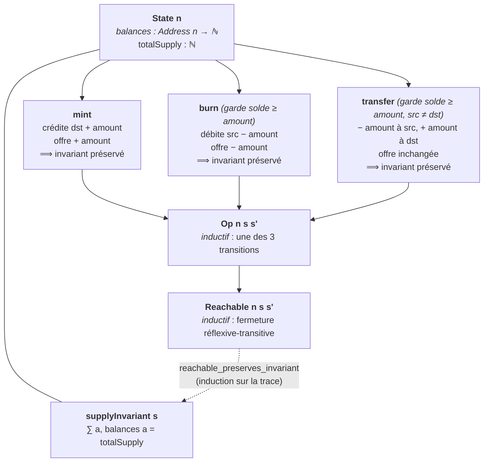
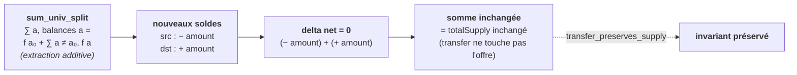

# `erc20_lean` — Conservation de l'invariant d'un jeton ERC-20 en Lean 4

Mini-projet Lean 4 (avec [Mathlib](https://github.com/leanprover-community/mathlib4))
formalisant l'**invariant de conservation fondateur d'un jeton fongible ERC-20** :
la somme des soldes de toutes les adresses égale l'offre totale, et cet invariant
est préservé par chaque opération standard (`transfer`, `mint`, `burn`).

> **Issue** : [#4047](https://github.com/jsboige/CoursIA/issues/4047) —
> **Roadmap** : [#4038](https://github.com/jsboige/CoursIA/issues/4038).

---

## Motivation pédagogique : méthodes formelles × blockchain

Le standard ERC-20 (Ethereum Request for Comments 20) est le contrat de jeton
fongible le plus répandu de la blockchain. Son invariant de conservation
(`Σ balances = totalSupply`) est la garantie que **les tokens ne sont ni créés ni
détruits** par les transferts — un bug le brisant serait une faille critique
(« impression illimitée de tokens »).

Ce projet démontre la valeur de la **preuve formelle** sur du code « réel » que
les étudiants reconnaissent : on prouve mécaniquement, à l'aide de Lean 4, que
l'invariant tient pour toute exécution atteignable. C'est un cas d'école du lien
méthodes formelles × blockchain, et le **premier lake Lean de la série
SmartContract**.

Le notebook compagnon
[`SC-7-Token-Standards.ipynb`](../02-Solidity-Advanced/SC-7-Token-Standards.ipynb)
présente le standard ERC-20 en Solidity, à mettre en regard de la vérification
formelle effectuée ici. Le câblage du notebook revient au propriétaire de la
série SmartContract.

## Approche : machine à états finie

*La machine à états — l'état porte l'invariant `supplyInvariant`, et trois transitions gardées le préservent ; toute trace atteignable l'hérite par induction :*



Plutôt que de modéliser un langage de contrat complet (gaz, stockage Merkle,
reentrancy), on isole le **cœur mathématique** de la conservation : une machine à
états finie dont l'invariant est `Σ balances = totalSupply`, et trois transitions
gardées.

- les adresses sont un type fini `Fin n` (`n` détenteurs potentiels) ;
- les soldes sont une fonction `Address → ℕ` ;
- l'invariant `Σ balances = totalSupply` est préservé par `transfer` (déplacement
  neutre), et modifié symétriquement par `mint`/`burn` (frappe/brûlage) qui
  créditent/débitent soldes et offre du même montant.

## Modèle

| Concept | Formalisation |
|---|---|
| Adresses | `Address n := Fin n` (type fini, `Fintype`) |
| État du jeton | `State n` : `balances : Address n → ℕ`, `totalSupply : ℕ` |
| Invariant | `supplyInvariant s := ∑ a, s.balances a = s.totalSupply` |
| Frapper | `mint s to amount` : crédite `to`, augmente l'offre |
| Brûler | `burn s from amount` : débite `from` (garde solde suffisant), diminue l'offre |
| Transférer | `transfer s from to amount` : déplace `amount` de `from` vers `to`, offre inchangée |
| Opération atteignable | `Op n s s'` (inductif : l'une des 3 transitions) |

L'ingrédient technique clé est l'**extraction additive** d'un point d'une somme
finie (`∑ a ∈ s, f a = f a₀ + ∑ a ∈ s \ {a₀}, f a`), qui évite de distribuer la
soustraction tronquée de `ℕ` sur la somme.

*Mécanisme de `transfer_preserves_supply` (0 `sorry`) — extraire `src` puis `dst` de la somme des nouveaux soldes, le delta net s'annule :*



## Modules

- [`ERC20/State.lean`](ERC20/State.lean) — `Address`, `State`, `supplyInvariant`.
- [`ERC20/Ops.lean`](ERC20/Ops.lean) — `mint`, `burn`, `transfer` (transitions gardées).
- [`ERC20/Invariant.lean`](ERC20/Invariant.lean) — théorèmes de préservation.

## Théorèmes phares

```lean
theorem mint_preserves_supply     : supplyInvariant s → supplyInvariant (mint s dst amount)
theorem burn_preserves_supply     : s.balances src ≥ amount → supplyInvariant s →
                                    supplyInvariant (burn s src amount)
theorem transfer_preserves_supply : s.balances src ≥ amount → src ≠ dst →
                                    supplyInvariant s → supplyInvariant (transfer s src dst amount)
theorem transfer_no_underflow     : s.balances src ≥ amount →
                                    (transfer s src dst amount).balances src = s.balances src - amount
theorem reachable_preserves_invariant : supplyInvariant s → Reachable n s s' → supplyInvariant s'
```

Les paramètres `src`/`dst` (source/destination) substituent les noms ERC-20
usuels `from`/`to`, qui sont des mots-clés réservés en Lean 4.

**Preuve de `transfer_preserves_supply`** (0 `sorry`) : on extrait `from` puis
`to` de la somme des nouveaux soldes (extraction additive), et on montre que le
delta net `(− amount à from) + (+ amount à to) = 0` — la somme est inchangée,
comme l'offre totale (`transfer` ne touche pas `totalSupply`).

## Construction

```bash
lake exe cache get   # récupère les .olean de Mathlib (v4.31.0-rc1)
lake build ERC20     # build de la librairie
```

Prérequis : [elan](https://github.com/leanprover/elan) (toolchain
`leanprover/lean4:v4.31.0-rc1`, voir `lean-toolchain`).

## État et suite

Ce livrable (#4047 phase 1) couvre :

- [x] Scaffolding du lake (lakefile, toolchain, `.gitignore`)
- [x] Modèle (`State`, `supplyInvariant`)
- [x] Transitions gardées (`mint`, `burn`, `transfer`)
- [x] **Préservation de l'invariant par les 3 ops — 0 `sorry`** (critère de sortie #4047)
- [x] `transfer_no_underflow` (garde ⇒ pas d'underflow)
- [x] `reachable_preserves_invariant` (induction sur la trace)

Phases suivantes (suivi #4047) :

- [ ] Modélisation des `allowance`/`approve` (transfert délégué, ERC-20 étendu)
- [ ] Préserver l'invariant sous une sémantique de gaz/reentrancy
- [ ] Paire notebook compagnon (SC-7 côte-à-côte Solidity/Lean)

## Références

- F. Vogelsteller, V. Buterin, *ERC-20 Token Standard*, Ethereum EIP-20, 2015.
- V. Buterin, *Ethereum: A Next-Generation Smart Contract and Decentralized
  Application Platform*, Ethereum White Paper, 2014.
- K. Bhargavan et al., *Formal Verification of Smart Contracts*, WPCE 2016.
- Notebook compagnon : [`SC-7-Token-Standards.ipynb`](../02-Solidity-Advanced/SC-7-Token-Standards.ipynb).
