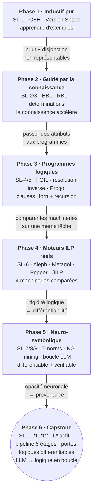

# SymbolicLearning - Apprentissage Symbolique

[← Argument_Analysis](../Argument_Analysis/README.md) | [↑ SymbolicAI](../README.md) | [SMT →](../SMT/README.md)

<!-- CATALOG-STATUS
series: SymbolicAI-SymbolicLearning
pedagogical_count: 12
breakdown: SymbolicLearning=12
maturity: PRODUCTION=12
-->

Comment un agent peut-il apprendre à partir de connaissances existantes plutôt que de données brutes ? Cette série explore l'apprentissage symbolique tel que décrit dans le chapitre 19 d'AIMA (Russell & Norvig), depuis l'apprentissage inductif pur (CBH, Version Space) jusqu'aux méthodes guidées par la connaissance (EBL, RBL).

Le premier notebook pose les bases : représentation d'hypothèses comme conjonctions de contraintes, algorithmes Current-Best-Hypothesis et Candidate Elimination (Version Space), et leurs limites face au bruit et aux concepts disjonctifs. Le second notebook montre comment la connaissance du domaine accélère l'apprentissage : l'apprentissage basé sur les explications (EBL) compile les théories en heuristiques opérationnelles, et l'apprentissage basé sur la pertinence (RBL) identifie les attributs déterminant via les déterminations. Le troisième notebook approfondit le RBL avec le treillis des déterminations, l'algorithme MINIMAL-CONSISTENT-DET et une comparaison avec sklearn. Le quatrième notebook couvre la programmation logique inductive (ILP) : l'algorithme FOIL (top-down), les opérateurs de résolution inverse (bottom-up) et la connexion avec les knowledge graphs, jusqu'à l'ILP moderne (Popper, Learning From Failures). SL-5 reprend et mène à terme la voie bottom-up esquissée en SL-4 (LGG de Plotkin, theta-subsomption, clause bottom par entailment inverse et recherche à la Progol), faisant directement suite à FOIL. SL-6 met quatre moteurs ILP *réels* face à face — Aleph, Metagol, Popper et ∂ILP (Lernd) — sur une même tâche récursive (`ancestor/2`), pour comparer leurs machineries (entailment inverse, MIL, Learning From Failures, gradient différentiable). Les notebooks SL-7 à SL-9 ouvrent ensuite vers des méthodes contemporaines : SL-7 introduit le neuro-symbolique (T-norms différentiables, Logic Tensor Networks, DeepProbLog) ; SL-8 outille la découverte de règles sur knowledge graphs réels avec rdflib et AMIE rule mining ; SL-9 boucle LLM et vérification symbolique pour fiabiliser le raisonnement formel guidé par modèles de langage. Enfin, deux notebooks concluent la série : SL-10 change de paradigme avec l'apprentissage *actif* (l'algorithme L* d'Angluin interroge un oracle au lieu de subir un échantillon, et apprend des automates finis avec garanties de minimalité) ; SL-11 est le capstone qui assemble toute la série en un pipeline neuro-symbolique de bout en bout — du texte brut aux faits découverts, avec un LLM réel (Gemini 3.5 Flash) aux deux extrémités et le symbolique comme colonne vertébrale. SL-12, ajouté à la série, explore un autre registre du neuro-symbolique : les *réseaux de portes logiques differentiables* (difflogic, Petersen NeurIPS 2022) — un modèle qui apprend des combinaisons de portes logiques par descente de gradient, puis se discretise en un circuit 100% booleen, interpretable-par-construction et ultra-rapide a l'inference.

**À qui s'adresse cette série** : étudiants en IA, informaticiens intéressés par le raisonnement symbolique, et chercheurs en apprentissage automatique souhaitant comprendre les approches non-statistiques. Les notebooks (~11h20 total) ne nécessitent que Python 3.10+ standard library, sauf SL-3 (scikit-learn + numpy pour la comparaison RBL / information mutuelle), SL-6 (moteurs ILP réels : SWI-Prolog, Popper, Lernd) et SL-8 (rdflib pour les knowledge graphs) ; SL-9 et SL-11 acceptent une clé OpenRouter optionnelle (fichier `.env`) pour des appels LLM réels, avec un simulateur déterministe en repli. Une familiarité avec la logique propositionnelle suffit pour SL-1 à SL-6 et SL-10 ; SL-7, SL-9 et SL-11 supposent une intuition des réseaux de neurones et des LLMs. Ils constituent un complément théorique aux séries [Tweety](../Tweety/README.md) (argumentation computationnelle), [SemanticWeb](../SemanticWeb/README.md) (représentation de connaissances) et [ML](../../ML/README.md) (apprentissage statistique - contraste avec l'inductif symbolique).

## Pourquoi cette série

L'apprentissage symbolique représente la contrepartie théorique du machine learning statistique. Tandis que les méthodes modernes (deep learning, ensembles d'arbres) excellent à extraire des patterns de grandes masses de données, elles souffrent de trois limites fondamentales que l'approche symbolique adresse directement :

- **Peu de données disponibles** : les méthodes symboliques comme Candidate Elimination ou FOIL apprennent à partir de quelques exemples, voire d'un seul (EBL). Quand la collecte de données est coûteuse ou impossible (diagnostic médical rare, validation formelle), l'induction pure ne fonctionne pas.
- **Interprétabilité requise** : une règle logique `IF temperature > 38 AND toux THEN infection` est compréhensible par un humain. Un réseau de neurones de 100M de paramètres ne l'est pas. Pour les applications critiques ou réglementées (médecine, finance, justice), l'interprétabilité n'est pas un luxe — c'est une exigence.
- **Intégration avec la connaissance existante** : les méthodes symboliques combinent examples ET théorie du domaine. EBL compile un exemple prouvé en une règle opérationnelle générale ; RBL identifie les attributs déterminants via des contraintes formelles. Aucune méthode statistique ne peut exploiter cette connaissance a priori de la même façon.

Cette série montre que les deux approches ne s'opposent pas — elles se **complémentent**. La phase finale (SL-7 à SL-9) explore explicitement cette intégration : T-norms différentiables pour rendre la logique compatible avec l'entraînement neuronal, rule mining sur knowledge graphs réels, et boucles de vérification symbolique pour fiabiliser les sorties LLM.

## Objectifs d'apprentissage

À l'issue de cette série, vous serez capable de :

1. **Implémenter** les algorithmes d'apprentissage inductif de base (CBH, Candidate Elimination, Version Space)
2. **Compiler** des preuves en heuristiques opérationnelles via EBL, et **identifier** les attributs déterminants via RBL et les déterminations
3. **Construire** le treillis des déterminations et appliquer MINIMAL-CONSISTENT-DET pour la sélection guidée d'attributs
4. **Apprendre** des règles logiques (clauses Horn) à partir d'exemples avec FOIL et la résolution inverse
5. **Construire** la chaîne bottom-up de l'ILP : LGG de Plotkin, theta-subsomption, clause bottom et recherche de clause à la Progol
6. **Comparer** quatre moteurs ILP modernes réels — Aleph (entailment inverse), Metagol (MIL), Popper (LFF) et ∂ILP (différentiable) — sur une même tâche récursive
7. **Intégrer** logique et apprentissage neuronal via T-norms, Logique Tensorielle, et DeepProbLog
8. **Extraire** des règles de knowledge graphs réels avec rdflib et AMIE, et **effectuer** la complétion de graphes
9. **Concevoir** une boucle LLM-symbolique : extraction de règles IF-THEN depuis du texte, vérification de cohérence formelle, feedback pour l'amélioration
10. **Implémenter** l'algorithme L* d'Angluin : table d'observation, requêtes d'appartenance et d'équivalence, apprentissage actif d'automates minimaux
11. **Assembler** un pipeline neuro-symbolique complet : extraction LLM, oracle de validation type, mining de règles, chaînage avant avec provenance, et confrontation LLM vs KG

## Vue d'ensemble

| Statistique | Valeur |
|-------------|--------|
| Notebooks | 12 |
| Exercices (table de pioche) | 46 |
| Kernel | Python 3 |
| Durée estimée | ~680 min |
| Prérequis | Python 3.10+ (standard library + sklearn pour SL-3/SL-4, rdflib pour SL-8, difflogic+torch pour SL-12, clé OpenRouter optionnelle pour SL-9/SL-11) |

## Parcours d'apprentissage

Le parcours progresse en six phases où **chacune répond à une limite de la précédente** — le bruit motive le recours à la connaissance, la rigidité logique motive la différentiabilité, l'opacité motive la provenance (thèse détaillée en conclusion) :



### Phase 1 : Fondations inductives (SL-1, ~50 min)

Le parcours commence par l'apprentissage inductif pur : un agent doit découvrir une règle cachée à partir d'exemples. SL-1 présente les algorithmes fondamentaux — Current-Best-Hypothesis (ajuste une seule hypothèse incrémentalement) et Candidate Elimination (maintient l'ensemble complet des hypothèses consistantes, le "Version Space"). Vous expérimentez leurs limites face au bruit et aux concepts disjonctifs, ce qui motive naturellement les approches plus riches introduites ensuite.

### Phase 2 : Apprentissage basé sur la connaissance (SL-2 a SL-3, ~95 min)

La deuxième phase introduit l'idée centrale que **la connaissance accélère l'apprentissage**. EBL (SL-2) montre comment compiler un exemple prouvé en une règle opérationnelle générale, en quatre étapes : expliquer, variabiliser, extraire, simplifier. RBL (introduit en SL-2, approfondi en SL-3) explore une autre facette : identifier les attributs qui déterminent vraiment la cible via le formalisme des déterminations et le treillis des sous-ensembles d'attributs. La comparaison avec sklearn (information mutuelle) montre quand la connaissance du domaine bat la statistique brute.

### Phase 3 : Programmation logique inductive (SL-4 a SL-5, ~115 min)

SL-4 fait le pont entre apprentissage automatique et intelligence artificielle symbolique classique en couvrant l'ILP : apprentissage de programmes logiques (clauses Horn) à partir d'exemples. L'algorithme FOIL (top-down) et la résolution inverse (bottom-up) sont implémentés de zéro, puis appliqués aux knowledge graphs — avec extraction de règles AMIE et requêtes SPARQL CONSTRUCT. La section finale confronte le FOIL artisanal à l'ILP moderne : **Popper** (Learning From Failures) retrouve le programme récursif `ancestor` optimal sur les mêmes données, démontre l'apport de la récursion par ablation, et le programme appris est vérifié indépendamment en SWI-Prolog. SL-5 reprend la promesse bottom-up esquissée en SL-4 et la mène à terme : LGG de Plotkin, theta-subsomption, clause bottom par entailment inverse, et recherche de clause à la Progol qui retrouve la définition de `grandfather/2` parmi 56 candidats.

### Phase 4 : Moteurs ILP modernes (SL-6, ~65 min)

Après avoir construit FOIL et Progol *de zéro*, SL-6 met quatre moteurs ILP **réels** face à face sur une même tâche récursive (`ancestor/2`, la clôture transitive de `parent`) : **Aleph** (entailment inverse, la lignée Progol), **Metagol** (Meta-Interpretive Learning, avec invention de prédicats), **Popper** (Learning From Failures) et **∂ILP** (ILP différentiable via Lernd). Chaque moteur apprend le même concept par une machinerie différente — recherche symbolique exacte, métarègles, contraintes ASP, descente de gradient — ce qui rend visibles leurs forces et leurs angles morts (sensibilité à la direction des modes, invention de prédicats, tolérance au bruit). Le ∂ILP différentiable amorce naturellement la phase neuro-symbolique suivante.

### Phase 5 : Intégration neuro-symbolique (SL-7 à SL-9, ~160 min)

Cette phase explore les méthodes contemporaines à l'intersection du symbolique et du connexionniste. SL-7 introduit les T-norms différentiables, les prédicats neuronaux et les Logics Tensor Networks qui rendent la logique opérationnelle dans un gradient descent. SL-8 passe à l'échelle avec le rule mining réel sur des knowledge graphs construits avec rdflib (AMIE, complétion de graphes). SL-9 ferme la boucle avec LLMs : extraction de règles depuis du texte naturel, vérification symbolique des sorties, et boucles de rétroaction pour fiabiliser le raisonnement.

### Phase 6 : Apprentissage actif et capstone (SL-10 à SL-12, ~195 min)

Trois notebooks concluent la série. SL-10 inverse le rapport de l'apprenant aux données : au lieu de subir un échantillon, L* d'Angluin *choisit* ses questions (requêtes d'appartenance et d'équivalence à un oracle MAT) et apprend des automates finis déterministes prouvablement minimaux — le cadre théorique (Myhill-Nerode, fermeture et cohérence de la table d'observation) est implémenté et vérifié de zéro. SL-11 est le capstone : un pipeline neuro-symbolique en 6 étages (extraction LLM -> oracle de validation -> knowledge graph -> mining de règles -> chainage avant avec provenance -> confrontation LLM vs KG) exécute avec de vrais appels Gemini 3.5 Flash, ou chaque étage mobilise un notebook antérieur de la série — y compris une leçon d'architecture découverte dans les sorties réelles : le chaînage avant peut violer les contraintes que l'oracle impose en amont. SL-12 explore un autre angle du neuro-symbolique : les *réseaux de portes logiques differentiables* (difflogic, Petersen NeurIPS 2022) apprennent des combinaisons de portes logiques par descente de gradient, puis se discretisent en un circuit 100% booleen, interpretable-par-construction et ultra-rapide a l'inference.

### Parcours alternatifs

#### Parcours rapide (SL-1 + SL-7 + SL-9 + SL-11, ~4h)

Pour ceux qui veulent saisir l'essence sans suivre toute la progression : les fondements inductifs (SL-1), l'intégration neuro-symbolique (SL-7), la vérification LLM (SL-9) et le capstone qui assemble le tout (SL-11). Donne une vue d'ensemble du spectre, de l'inductif pur au pipeline neuro-symbolique complet.

#### Parcours ILP approfondi (SL-1 a SL-6, ~325 min)

Pour les étudiants en logique et IA symbolique : suivre les six premiers notebooks dans l'ordre — de Candidate Elimination a FOIL, puis SL-5 qui mène le bottom-up a terme (LGG, theta-subsomption, clause bottom et Progol), et SL-6 qui confronte quatre moteurs ILP réels (Aleph, Metagol, Popper, ∂ILP) sur une même tâche récursive.

#### Parcours théorie des langages (SL-1 + SL-10, ~110 min)

Pour les étudiants en informatique théorique : le cadre inductif général (SL-1), puis l'apprentissage actif d'automates avec ses garanties formelles (SL-10) — requêtes, Myhill-Nerode, minimalité, bornes PAC de l'oracle d'equivalence échantillonne.

#### Parcours knowledge graphs (SL-2, SL-3, SL-4, SL-8, ~220 min)

Pour les professionnels du web sémantique et des données structurees : EBL, RBL, FOIL sur clauses Horn, puis application directe sur des knowledge graphs réels avec rdflib et AMIE. Presuppose une familiarité avec RDF/SPARQL.

## Seance de restitution : la table de pioche (46 exercices)

Modalite de la séance : chaque groupe choisit **un exercice** dans la table ci-dessous, le prépare, et le présente en séance. Resoudre l'exercice est le minimum attendu ; chaque exercice est assorti d'une **question-twist** (détaillée dans la cellule « Defi présentation » du notebook correspondant) qui fait partie intégrante de la présentation. Premier arrive, premier servi : annoncez votre choix pour éviter les doublons.

| # | Notebook | Exercice | Question-twist (en bref) |
|---|----------|----------|--------------------------|
| 1 | [SL-1](SL-1-LogicalLearning.ipynb) | Ex. 1 — CBH avec ordre personnalise | Deux ordres d'exemples, deux hypothèses finales : pourquoi, a accuracy égale ? |
| 2 | [SL-1](SL-1-LogicalLearning.ipynb) | Ex. 2 — Version Space sur sous-ensemble | Qu'est-ce qui rend un exemple *informatif* (frontières S et G) ? |
| 3 | [SL-1](SL-1-LogicalLearning.ipynb) | Ex. 3 — Règles avec couverture | Compacite vs hypothèse AIMA : quel biais (rasoir d'Occam) préfère l'une a l'autre ? |
| 4 | [SL-1](SL-1-LogicalLearning.ipynb) | Ex. 4 — Réflexion sur le biais conjonctif | Un domaine où ce biais est idéal, un où il est catastrophique (no free lunch) |
| 5 | [SL-1](SL-1-LogicalLearning.ipynb) | Ex. 5 — La consistance sans Occam (aima) | Echantillonner les graines ne prouve pas la minimalité : quel algorithme exact le ferait ? |
| 6 | [SL-2](SL-2-KnowledgeBasedLearning.ipynb) | Ex. 1 — EBL differentiation symbolique | Exhiber une variabilisation trop agressive qui produit une règle compilee fausse |
| 7 | [SL-2](SL-2-KnowledgeBasedLearning.ipynb) | Ex. 2 — Filtrage des règles (opérationnalité) | Deux distributions de requêtes qui inversent le classement d'utilite des règles |
| 8 | [SL-2](SL-2-KnowledgeBasedLearning.ipynb) | Ex. 3 — Speedup EBL | Le *utility problem* (Minton 1990) : pourquoi apprendre plus finit par ralentir |
| 9 | [SL-3](SL-3-RelevanceLearning.ipynb) | Ex. 1 — Déterminations meteo | Une observation bruitee : quelle détermination minimale survit ? |
| 10 | [SL-3](SL-3-RelevanceLearning.ipynb) | Ex. 2 — RBL vs sélection aleatoire | Trouver le point de croisement ou la sélection statistique bat le RBL |
| 11 | [SL-3](SL-3-RelevanceLearning.ipynb) | Ex. 3 — Sélecteur hybride | Quelles garanties votre hybride hérite-t-il vraiment ? Contre-exemple construit |
| 12 | [SL-4](SL-4-InductiveLogicProgramming.ipynb) | Ex. 1 — `sibling` avec FOIL | Le rôle du biais de langage : que se passe-t-il sans le littéral `X != Y` ? |
| 13 | [SL-4](SL-4-InductiveLogicProgramming.ipynb) | Ex. 2 — Opérateur W | Généralisation consistante mais fausse : pourquoi le bottom-up y est expose |
| 14 | [SL-4](SL-4-InductiveLogicProgramming.ipynb) | Ex. 3 — Règles sur mini-KG | Monde clos vs PCA (cf SL-8) : quelle confiance est la bonne pour VOTRE KG ? |
| 15 | [SL-4](SL-4-InductiveLogicProgramming.ipynb) | Ex. 4 — `grandparent` avec Popper | Sans négatif arrière-grand-parent, quel programme plus court devient consistant ? |
| 16 | [SL-5](SL-5-InverseResolution.ipynb) | Ex. 1 — Apprendre `grandmother/2` | Pourquoi `grandparent/2` (sans sexe) est *plus facile* — rôle des négatifs |
| 17 | [SL-5](SL-5-InverseResolution.ipynb) | Ex. 2 — Profondeur de la clause bottom | Croissance de la clause bottom avec la profondeur ; la cible reste-t-elle dans le treillis ? |
| 18 | [SL-5](SL-5-InverseResolution.ipynb) | Ex. 3 — Tolérance au bruit | Le score `p - n - L` comme argument MDL : quand préfère-t-il une clause imparfaite ? |
| 19 | [SL-5](SL-5-InverseResolution.ipynb) | Ex. 4 — Reduction de Plotkin | Subsomption vs implication : le cas des clauses récursives ou elles divergent |
| 20 | [SL-5](SL-5-InverseResolution.ipynb) | Ex. 5 — Aleph face au bruit | Memoriser l'exception, sur-généraliser ou payer L dans f : trois frontières face au même bruit |
| 21 | [SL-6](SL-6-ModernILP.ipynb) | Ex. 1 — Direction de mode (Aleph) | Pourquoi `(+,-)` apprend et `(+,+)` échoue : ce que la direction des modes change pour l'entailment inverse |
| 22 | [SL-6](SL-6-ModernILP.ipynb) | Ex. 2 — `grandparent` non récursif | Cible a 2 sauts sans clôture : quel biais (max_clauses, pas de récursion) suffit, et l'invention de prédicats sert-elle encore ? |
| 23 | [SL-6](SL-6-ModernILP.ipynb) | Ex. 3 — Robustesse au bruit (∂ILP vs symbolique) | Un faux positif injecte : ∂ILP degrade sa confiance, Popper exact n'a pas de notion de bruit — a quel prix chacun ? |
| 24 | [SL-7](SL-7-NeuroSymbolic.ipynb) | Ex. 2 — LTN frere/oncle | Retirer les axiomes négatifs : pourquoi une LTN a besoin de négatifs explicites |
| 25 | [SL-7](SL-7-NeuroSymbolic.ipynb) | Ex. 3 — Règle transitive `ancestor` | Le modèle trivial « vrai partout » sature la règle : qu'est-ce qui l'évite ? |
| 26 | [SL-7](SL-7-NeuroSymbolic.ipynb) | Ex. 4 — T-norm de Lukasiewicz | Gradients exactement nuls : qu'est-ce qu'une sémantique floue *apprenable* ? |
| 27 | [SL-7](SL-7-NeuroSymbolic.ipynb) | Ex. 5 — Ablation de l'axiome 4 (LTNtorch) | Le négatif difficile (Marie, Pierre) est-il indispensable ? Contraste avec clingo (SL-8) |
| 28 | [SL-8](SL-8-KnowledgeGraphs-ILP.ipynb) | Ex. 1 — Nouvelle relation au KG | Règles redondantes (même extension, syntaxe différente) : comment AMIE les évite |
| 29 | [SL-8](SL-8-KnowledgeGraphs-ILP.ipynb) | Ex. 2 — PCA confidence | Construire un mini-KG ou la PCA confidence est trompeuse |
| 30 | [SL-8](SL-8-KnowledgeGraphs-ILP.ipynb) | Ex. 3 — Règles a 3 atomes | Explosion combinatoire : pourquoi AMIE impose des règles fermées, a quel prix |
| 31 | [SL-8](SL-8-KnowledgeGraphs-ILP.ipynb) | Ex. 4 — Reparation minimale (clingo) | Les reparations optimales sont ex-aequo : départager par des poids de confiance |
| 32 | [SL-9](SL-9-LLM-SymbolicLearning.ipynb) | Ex. 1 — Prompt personnalise | Changer de modèle LLM : que garantit vraiment l'oracle symbolique ? |
| 33 | [SL-9](SL-9-LLM-SymbolicLearning.ipynb) | Ex. 2 — Prompt direct vs CoT | Validation oracle vs plausibilite du texte : les deux métriques peuvent diverger |
| 34 | [SL-9](SL-9-LLM-SymbolicLearning.ipynb) | Ex. 3 — Detection d'hallucinations | Le detecteur suppose un monde clos : que devient-il en monde ouvert (cf SL-8) ? |
| 35 | [SL-9](SL-9-LLM-SymbolicLearning.ipynb) | Ex. 4 — Taux d'hallucination du vrai LLM | Maximiser le taux de validation ou le nombre de règles validees par appel ? |
| 36 | [SL-10](SL-10-ActiveAutomataLearning.ipynb) | Ex. 1 — Le langage « contient abb » | Certificat de minimalité : un suffixe distinguant pour chaque paire d'états (Myhill-Nerode) |
| 37 | [SL-10](SL-10-ActiveAutomataLearning.ipynb) | Ex. 2 — Fiabilité de l'EQ échantillonnée | Relier le taux de réussite empirique à la borne PAC ; construire une distribution adverse |
| 38 | [SL-10](SL-10-ActiveAutomataLearning.ipynb) | Ex. 3 — Contre-exemples : prefixes vs suffixes | Le pire cas qui fait exploser la table d'observation (Rivest-Schapire) |
| 39 | [SL-10](SL-10-ActiveAutomataLearning.ipynb) | Ex. 4 — Oracle bruite | Reparer L* par vote majoritaire : surcout en requêtes et probabilité residuelle d'erreur |
| 40 | [SL-11](SL-11-Capstone-NeuroSymbolic.ipynb) | Ex. 1 — Etendre le schéma (`marie_avec`) | Le mineur redecouvre la symetrie injectee par l'oracle : règle ou tautologie ? |
| 41 | [SL-11](SL-11-Capstone-NeuroSymbolic.ipynb) | Ex. 2 — Politique de conflit a sources | *Truth discovery* : estimer la fiabilité des sources en même temps que les faits |
| 42 | [SL-11](SL-11-Capstone-NeuroSymbolic.ipynb) | Ex. 3 — Le bon seuil n'existe pas | Vraie et fausse règle a confiance égale (0.67) : quel signal au-dela du seuil ? |
| 43 | [SL-11](SL-11-Capstone-NeuroSymbolic.ipynb) | Ex. 4 — Empoisonnement bout-en-bout | Classer les defenses par étage du pipeline ; ou s'arrete la provenance ? |
| 44 | [SL-12](SL-12-DifferentiableLogicGateNetworks.ipynb) | Ex. 1 — Variation de profondeur | Trade-off capacité vs sur-apprentissage : combien de couches pour quel régime ? |
| 45 | [SL-12](SL-12-DifferentiableLogicGateNetworks.ipynb) | Ex. 2 — Porte favorite d'un neurone isole | Quelle porte (AND/NAND/XOR) l'apprentissage favorise-t-il pour MNIST ? |
| 46 | [SL-12](SL-12-DifferentiableLogicGateNetworks.ipynb) | Ex. 3 — Robustesse au bruit pixel | La discretisation booleenne aide-t-elle face au bruit vs un MLP équivalent ? |

Note : dans SL-7, le premier exercice de la numérotation interne est un exemple guide ; les exercices à piocher sont Ex. 2 à Ex. 5.

## Notebooks

| # | Notebook | Contenu | Durée |
|---|----------|---------|-------|
| 1 | [SL-1 - Apprentissage Logique](SL-1-LogicalLearning.ipynb) | CBH, Version Space, Candidate Elimination | 50 min |
| 2 | [SL-2 - Apprentissage et Connaissance](SL-2-KnowledgeBasedLearning.ipynb) | EBL, introduction au RBL (déterminations) | 45 min |
| 3 | [SL-3 - Apprentissage Basé sur la Pertinence](SL-3-RelevanceLearning.ipynb) | Treillis des déterminations, MINIMAL-CONSISTENT-DET, RBL vs sklearn | 50 min |
| 4 | [SL-4 - Programmation Logique Inductive](SL-4-InductiveLogicProgramming.ipynb) | FOIL, résolution inverse, clauses Horn, knowledge graphs, Popper (LFF) | 55 min |
| 5 | [SL-5 - Résolution Inverse et Progol](SL-5-InverseResolution.ipynb) | LGG de Plotkin, theta-subsomption, clause bottom, recherche Progol | 60 min |
| 6 | [SL-6 - Moteurs ILP modernes](SL-6-ModernILP.ipynb) | Aleph, Metagol, Popper, ∂ILP (Lernd) sur `ancestor/2` (moteurs réels) | 65 min |
| 7 | [SL-7 - Intégration Neuro-Symbolique](SL-7-NeuroSymbolic.ipynb) | T-norms, prédicats neuronaux, LTN, DeepProbLog | 55 min |
| 8 | [SL-8 - ILP Moderne et Knowledge Graphs](SL-8-KnowledgeGraphs-ILP.ipynb) | rdflib, AMIE rule mining, complétion KG, ASP avec clingo | 55 min |
| 9 | [SL-9 - LLMs et Apprentissage Symbolique](SL-9-LLM-SymbolicLearning.ipynb) | Prompting, extraction de règles, vérification symbolique (Gemini 3.5 Flash optionnel) | 50 min |
| 10 | [SL-10 - Apprentissage Actif d'Automates](SL-10-ActiveAutomataLearning.ipynb) | L* d'Angluin, table d'observation, requêtes MQ/EQ, Myhill-Nerode | 60 min |
| 11 | [SL-11 - Capstone Neuro-Symbolique](SL-11-Capstone-NeuroSymbolic.ipynb) | Pipeline 6 étages : extraction LLM, oracle, KG, mining, inférence avec provenance, QA | 90 min |
| 12 | [SL-12 - Réseaux de Portes Logiques Différentiables](SL-12-DifferentiableLogicGateNetworks.ipynb) | difflogic (Petersen NeurIPS 2022) : portes logiques apprises par descente de gradient, discrétisation en circuit booléen, inférence ultra-rapide | 45 min |

## Contenu détaillé

### SL-1-LogicalLearning.ipynb

| Section | Contenu |
|---------|---------|
| Domaine restaurant | Attributs, exemples AIMA, hypothèses comme conjonctions |
| Consistance | Faux positifs/négatifs, vérification d'hypothèses |
| Généralisation/Spécialisation | Opérations fondamentales, hiérarchie de généralité |
| CBH | Algorithme Current-Best-Hypothesis (AIMA Fig 19.2) |
| Version Space | Candidate Elimination, G-set et S-set (AIMA Fig 19.3) |
| Prédiction | Stratégies unanime, conservateur, majority |
| Limites | Sensibilité au bruit, incapacité à représenter les disjonctions |

### SL-2-KnowledgeBasedLearning.ipynb

| Section | Contenu |
|---------|---------|
| Cadre général | Contrainte d'entraînement, EBL vs RBL vs KBIL |
| EBL - Principe | Exemple de Zog, 4 étapes (expliquer, variabiliser, extraire, simplifier) |
| EBL - Arithmétique | Simplification d'expressions, arbre de preuve |
| EBL - Implémentation | Classe ArithmeticEBL complète |
| EBL - Efficacité | Opérationalité vs généralité, prolifération de règles |
| RBL - Introduction | Déterminations, vérification fonctionnelle, réduction d'espace (approfondi dans SL-3) |

> **Parité .NET** : [SL-2-KnowledgeBasedLearning-Csharp.ipynb](SL-2-KnowledgeBasedLearning-Csharp.ipynb) est le jumeau C# (.NET Interactive) — EBL (chaînage avant + unification, arbre de preuve, variabilisation) et RBL (vérification de détermination) implémentés from-scratch, sans lib ML. Marathon parité .NET ⇄ Python (#4956).

### SL-3-RelevanceLearning.ipynb

| Section | Contenu |
|---------|---------|
| Déterminations | Formalisme, monotonie, minimalité, `check_determination()` |
| Treillis des déterminations | `build_determination_lattice()`, visualisation ASCII, up-set |
| MINIMAL-CONSISTENT-DET | Implémentation détaillée, données moléculaires, cas d'échec disjonctif (restaurant) |
| Sélection guidée | RBL vs sklearn (information mutuelle), comparaison |
| Analyse PAC | Réduction exponentielle, bornes d'échantillonnage |
| Web Sémantique | Parallel RBL <-> OWL (FunctionalProperty, hasKey) |

### SL-4-InductiveLogicProgramming.ipynb

| Section | Contenu |
|---------|---------|
| Clauses Horn | Représentation, `Literal`, `HornClause`, unification |
| FOIL | Algorithme top-down, gain FOIL, littéraux candidats |
| FOIL pas-à-pas | Trace détaillée sur le problème ancestor |
| Résolution inverse | Opérateurs V (absorption) et W (identification) |
| Knowledge Graphs | Règles AMIE, triples RDF, SPARQL CONSTRUCT |
| Popper (Learning From Failures) | Programme récursif optimal, ablation sans récursion, vérification SWI-Prolog (kernel Linux/WSL) |
| Exercices | sibling, opérateur W, règles sur KG |

### SL-5-InverseResolution.ipynb

| Section | Contenu |
|---------|---------|
| Clauses et couverture | `covers()` par backtracking, validation de la cible `grandfather/2` |
| LGG de Plotkin | Anti-unification, généralisation la moins générale, sur-spécialisation |
| Theta-subsomption | `subsumes()` par skolemisation, le treillis de généralité |
| Clause bottom | Saturation bornée, entailment inverse, variabilisation |
| Recherche Progol | Sous-ensembles connectés du corps de bottom, score `f = p - L`, consistance dure |
| Cover-set | Boucle d'apprentissage de théorie complète |

### SL-6-ModernILP.ipynb

| Section | Contenu |
|---------|---------|
| Quatre paradigmes | Tableau comparatif : entailment inverse, MIL, LFF, ILP différentiable |
| Tâche partagée | KB `parent`/`ancestor`, clôture transitive, positifs/négatifs monde clos |
| Aleph | Entailment inverse via `janus_swi` (SWI-Prolog), modes et déterminations |
| Metagol | Meta-Interpretive Learning, métarègles, invention de prédicats (`metagol.pl` vendore, BSD-3) |
| Popper | Learning From Failures, biais déclaratif, sous-processus kernel Linux |
| dILP (Lernd) | ILP différentiable, descente de gradient, tolérance au bruit (env conda dédié, GPL-3.0) |
| Synthèse | Quatre machineries pour un même concept ; forces et angles morts |
| Exercices | Direction de mode (Aleph), `grandparent` non récursif, robustesse au bruit (dILP) |

### SL-7-NeuroSymbolic.ipynb

| Section | Contenu |
|---------|---------|
| T-norms / T-conorms | Opérateurs logiques différentiables |
| Prédicats neuronaux | Fonctions P(x) -> [0,1] apprises |
| LTN | Logique Tensorielle simplifiée |
| Raisonnement guidé | Règles logiques guidant l'entraînement neuronal |
| DeepProbLog | Programmation logique probabiliste + prédicats neuronaux |

### SL-8-KnowledgeGraphs-ILP.ipynb

| Section | Contenu |
|---------|---------|
| Knowledge Graphs | Construction avec rdflib |
| AMIE rule mining | Découverte de règles de Horn sur KG |
| Complétion | Inférence de nouveaux triples |
| ASP avec clingo | Validation croisée de la complétion, récursion (`ancestorOf`), contraintes d'intégrité (pont série Tweety) |

### SL-9-LLM-SymbolicLearning.ipynb

| Section | Contenu |
|---------|---------|
| LLMs et raisonnement | Forces et limites pour le raisonnement symbolique |
| Parseur de règles | Extraction de règles IF-THEN depuis du texte |
| Vérification symbolique | Cohérence formelle des sorties LLM |
| Boucle LLM-Symbolique | Génération + vérification + feedback |

### SL-10-ActiveAutomataLearning.ipynb

| Section | Contenu |
|---------|---------|
| Apprentissage actif | Passif vs actif, le cadre MAT (Minimally Adequate Teacher) |
| DFA | Représentation, exécution, langage du mot « se termine par a » |
| Table d'observation | Prefixes S, suffixes E, fermeture et cohérence |
| L* | Algorithme complet d'Angluin (1987), construction de l'hypothèse |
| Contre-exemples | Traitement, raffinement, convergence vers le DFA minimal |
| Oracle échantillonné | Équivalence approchée par tirage, lien PAC |
| Théorie | Myhill-Nerode, minimalité, bornes sur le nombre de requêtes |

### SL-11-Capstone-NeuroSymbolic.ipynb

| Section | Contenu |
|---------|---------|
| Corpus | Saga « Atelier Verne » : 13 énoncés, 2 pieges factuels |
| Étage 1 - Extraction | LLM (Gemini 3.5 Flash) ou simulateur : texte -> triples candidats |
| Étage 2 - Oracle | Validation typée + contraintes fonctionnelles (cf SL-8) |
| Étage 3 - KG | Knowledge graph valide (cf SL-7) |
| Étage 4 - Mining | AMIE-lite : découverte de règles avec confiance standard (cf SL-4/SL-7) |
| Étage 5 - Inférence | Chainage avant avec provenance ; le dérivé peut violer l'oracle (lecon d'architecture) |
| Étage 6 - QA | Question 2 sauts : réponse KG (dérivation citée) vs réponse LLM seule |

### SL-12-DifferentiableLogicGateNetworks.ipynb

| Section | Contenu |
|---------|---------|
| Motivation | Registre **discret** du neuro-symbolique (vs SL-7 continu) : neurone = porte logique binaire apprise parmi 16 |
| Prise en main | `LogicLayer(in, out)`, `GroupSum(k, tau)`, choix device/implementation |
| Entraînement MNIST 20x20 | Précision : ~85-92% (référence GPU, 5000 iters) ; le notebook exécute une config CPU réduite (N_ITERS=2000) -> ~79% |
| Inspection | Distribution des 16 portes apprises par les neurones |
| `CompiledLogicNet` | Export C compilé, ~1M images/s sur 1 core CPU (RECOVERABLE-MACHINE, gcc) |
| Note historique | Remplace la veille `Neurosymbolic-EML/` (atome NAND continu, parité-3 dégénéré) — voir `_archives/2026-07-04-Neurosymbolic-EML-precurseur-SL12/` |

**Référence** : Petersen et al., *Deep Differentiable Logic Gate Networks*, NeurIPS 2022 ([arXiv 2210.08277](https://arxiv.org/abs/2210.08277)).

## Concepts clés

| Concept | Explication | Notebook |
|---------|-------------|----------|
| **Hypothèse FOL** | Conjonction de contraintes sur les attributs | SL-1 |
| **Version Space** | Ensemble de toutes les hypothèses consistantes | SL-1 |
| **CBH** | Maintient une seule hypothèse ajustée incrémentalement | SL-1 |
| **EBL** | Extrait une règle générale d'un seul exemple par déduction | SL-2 |
| **RBL** | Identifie les attributs pertinents via les déterminations | SL-2 |
| **Détermination** | Relation fonctionnelle entre attributs | SL-2, SL-3 |
| **KBIL** | Apprentissage inductif guidé par la connaissance | SL-2 |
| **Treillis des déterminations** | Ensemble partiellement ordonné des sous-ensembles d'attributs | SL-3 |
| **MINIMAL-CONSISTENT-DET** | Trouve la détermination minimale par taille croissante | SL-3 |
| **FOIL** | Apprentissage top-down de clauses Horn | SL-4 |
| **Résolution inverse** | Apprentissage bottom-up par opérateurs V et W | SL-4 |
| **Clause Horn** | Règle logique avec au plus un littéral positif | SL-4 |
| **Unification** | Trouve une substitution rendant deux termes égaux | SL-4 |
| **ILP** | Apprentissage de programmes logiques a partir d'exemples | SL-4 |
| **Learning From Failures (Popper)** | ILP moderne : recherche de programme optimal par contraintes (clingo + Prolog) | SL-4 |
| **LGG** | Généralisation la moins générale de deux clauses (Plotkin) | SL-5 |
| **Theta-subsomption** | Ordre de généralité décidable entre clauses (∃θ : Cθ ⊆ D) | SL-5 |
| **Clause bottom** | Clause la plus spécifique couvrant un exemple (entailment inverse) | SL-5 |
| **Progol** | Recherche de clause guidée par la clause bottom | SL-5 |
| **Aleph** | Entailment inverse, l'implémentation de référence de Progol (SWI-Prolog) | SL-6 |
| **Metagol (MIL)** | Apprentissage meta-interpretatif : métarègles + invention de prédicats | SL-6 |
| **dILP** | ILP différentiable : règles pondérées apprises par descente de gradient | SL-6 |
| **T-norm** | Généralisation différentiable de AND | SL-7 |
| **DeepProbLog** | Programmation logique probabiliste + prédicats neuronaux | SL-7 |
| **Knowledge Graph** | Graphe orienté de triples (sujet, prédicat, objet) | SL-8 |
| **AMIE** | Rule mining sur knowledge graphs incomplets | SL-8 |
| **LLM-Symbolique** | Boucle de rétroaction LLM + vérification formelle | SL-9 |
| **Apprentissage actif** | L'apprenant choisit ses questions au lieu de subir un échantillon | SL-10 |
| **MAT** | Minimally Adequate Teacher : oracle d'appartenance + équivalence | SL-10 |
| **Table d'observation** | Structure (S, E, T) fermée et cohérente dont on lit un DFA | SL-10 |
| **Myhill-Nerode** | Classes d'équivalence de suffixes = états du DFA minimal | SL-10 |
| **Provenance** | Trace de dérivation attachée à chaque fait inféré | SL-11 |
| **Pipeline neuro-symbolique** | LLM aux extrémités, validation et inférence symboliques au centre | SL-11 |

## Prérequis

### Connaissances requises

- Python de base (fonctions, classes, tuples, dictionnaires)
- Logique propositionnelle (conjonctions, prédicats)
- Notions d'apprentissage supervisé (classification binaire)

### Environnement Python

Aucune dépendance externe pour SL-1, SL-2, SL-5, SL-7 et SL-10 (bibliothèque standard Python 3.10+ uniquement). SL-3 utilise `scikit-learn` et `numpy` pour la comparaison avec la sélection statistique. SL-8 utilise `rdflib` et `clingo` (module Python officiel Potassco, installé silencieusement par le notebook — même moteur ASP que le binaire utilisé par la série Tweety via `scripts/install_clingo.py`). SL-8 et SL-10 utilisent `python-dotenv` et `openai` pour les appels LLM optionnels via OpenRouter (Gemini 3.5 Flash) : copiez `.env.example` vers `.env` et renseignez `OPENROUTER_API_KEY` ; sans clé, un simulateur déterministe prend le relais et le notebook s'exécute intégralement.

SL-4 est en bibliothèque standard pour l'essentiel, mais sa section finale **Popper** requiert un environnement Unix : Popper utilise `signal.SIGALRM`, absent de Windows — le notebook s'exécute donc sur un kernel Python **Linux** (kernel `python3-wsl` via WSL sous Windows, kernel natif sous Linux/macOS). Dépendances de la section (installées silencieusement par le notebook) : SWI-Prolog >= 9.1.12 (`ppa:swi-prolog/stable`), `popper-ilp` épinglé à **v4.4.0** (la 5.0 exige Python >= 3.14), `janus_swi`, `clingo`, `setuptools < 81`. Si Popper est indisponible, les cellules de la section l'indiquent et se sautent proprement — le reste du notebook tourne sur n'importe quel kernel Python.

SL-6 (Moteurs ILP modernes) partage l'exigence kernel **Linux/WSL** : Aleph et Metagol s'exécutent via `janus_swi` sur SWI-Prolog (Metagol est fourni dans `vendor/metagol/`, licence BSD-3), Popper en sous-processus, et ∂ILP via un environnement conda dédié `lernd-dilp` (TensorFlow, licence GPL-3.0 — *importé* uniquement, jamais vendore). Chaque moteur indisponible se signale proprement (drapeau `HAS_*`) sans interrompre le notebook.

## FAQ / Troubleshooting

### `rdflib` ne s'installe pas ou plantage à l'exécution

SL-7 dépend de `rdflib` pour manipuler les knowledge graphs RDF. Si l'installation échoue :

```bash
pip install rdflib
```

Si rdflib plante avec une erreur de compilateur C sur les parsers RDF/XML : installez `lxml` comme fallback `pip install lxml`, ou utilisez un environnement conda (`conda install -c conda-forge rdflib`).

### `scikit-learn` : version incompatible avec Python 3.10+

SL-3 utilise `scikit-learn` pour la comparaison information mutuelle vs déterminations. Si vous avez une erreur lors de l'import :

```bash
pip install -U scikit-learn numpy
```

Les versions >= 1.3 de scikit-learn sont compatibles avec Python 3.10-3.12.

### `MemoryError` sur le treillis des déterminations (SL-3)

Le treillis des déterminations croît exponentiellement avec le nombre d'attributs. Si vous travaillez avec des datasets > 50 attributs :

- Limitez l'analyse aux 20-30 attributs les plus informatifs en premier
- Utilisez `check_determination()` pour filtrer avant de construire le treillis complet
- Le notebook inclut un paramètre `max_attributes` pour contrôler cette taille

### Jupyter / kernels Python

- Si le kernel Python n'apparaît pas : `python -m ipykernel install --user --name python3 --display-name "Python 3"`
- Si Papermill ne tourne pas les notebooks : `pip install papermill`
- En cas de conflit de sortie entre cellules : redémarrez le kernel avant exécution complète

## Ressources

### Références

- Russell & Norvig, *Artificial Intelligence: A Modern Approach*, 3e/4e éd., Chapitre 19
- Tom Mitchell, *Machine Learning*, Chapitres 2 (Concept Learning) et 11 (EBL)
- [AIMA Python Code](https://github.com/aimacode/aima-python) - Implémentations de référence

## Structure des fichiers

```
SymbolicLearning/
├── SL-1-LogicalLearning.ipynb              # CBH, Version Space
├── SL-2-KnowledgeBasedLearning.ipynb        # EBL, RBL
├── SL-2-KnowledgeBasedLearning-Csharp.ipynb # Jumeau C# (.NET Interactive) — EBL + RBL, parité #4956
├── SL-3-RelevanceLearning.ipynb             # Treillis, MINIMAL-CONSISTENT-DET, RBL vs sklearn
├── SL-4-InductiveLogicProgramming.ipynb     # FOIL, résolution inverse, knowledge graphs
├── SL-5-InverseResolution.ipynb             # LGG, theta-subsomption, clause bottom, Progol
├── SL-6-ModernILP.ipynb                     # Aleph, Metagol, Popper, dILP (Lernd) — moteurs réels
├── SL-7-NeuroSymbolic.ipynb                 # T-norms, LTN, DeepProbLog
├── SL-8-KnowledgeGraphs-ILP.ipynb           # rdflib, AMIE rule mining
├── SL-9-LLM-SymbolicLearning.ipynb          # LLMs + vérification symbolique (Gemini 3.5 Flash optionnel)
├── SL-10-ActiveAutomataLearning.ipynb        # L* d'Angluin, apprentissage actif d'automates
├── SL-11-Capstone-NeuroSymbolic.ipynb       # Capstone : pipeline neuro-symbolique 6 étages
├── .env.example                             # Modèle de configuration LLM (OpenRouter)
├── requirements.txt                         # Dépendances optionnelles
├── référence/
│   ├── AIMA_Ch19_Knowledge_in_Learning.md   # Notes de référence
│   └── aima_knowledge.py                     # AIMA Ch.19 (CBH, Version Space, MINIMAL-CONSISTENT-DET) — vendored aima-python
└── README.md                                # Cette documentation
```

## Statistiques catalogue à jour

Lecture du bloc `CATALOG-STATUS` (lignes 5-10, byte-identique à `origin/main`) :

```
series: SymbolicAI-SymbolicLearning
pedagogical_count: 12
breakdown: SymbolicLearning=12
maturity: PRODUCTION=12
```

**Table 6 phases × 4 colonnes** (cohérence CATALOG-STATUS `SymbolicLearning=12`, maturité 100 % PRODUCTION) :

| Phase | Notebooks | Maturité | Contenu clé |
|-------|-----------|----------|-------------|
| **Phase 1 — Fondations inductives** | 1 (SL-1) | PRODUCTION=1 | Current-Best-Hypothesis, Version Space, Candidate Elimination (AIMA chapitre 19) ; limites face au bruit et aux disjonctions |
| **Phase 2 — Guidé par la connaissance** | 2 (SL-2, SL-3) | PRODUCTION=2 | EBL (Explanation-Based Learning, 4 étapes : expliquer, variabiliser, extraire, simplifier) ; RBL (Relevance-Based Learning) + treillis des déterminations + MINIMAL-CONSISTENT-DET ; comparaison RBL vs sklearn (information mutuelle) |
| **Phase 3 — Programmes logiques (ILP)** | 2 (SL-4, SL-5) | PRODUCTION=2 | FOIL top-down + opérateurs V/W de la résolution inverse ; LGG de Plotkin, θ-subsomption, clause bottom par entailment inverse, recherche à la Progol ; pont vers knowledge graphs (AMIE, SPARQL CONSTRUCT) |
| **Phase 4 — Moteurs ILP modernes** | 1 (SL-6) | PRODUCTION=1 | Quatre moteurs réels face à face sur `ancestor/2` : Aleph (entailment inverse), Metagol (MIL, invent. prédicats), Popper (LFF, v4.4.0 épinglé), ∂ILP Lernd (différentiable, env conda `lernd-dilp` GPL-3.0 importé) |
| **Phase 5 — Neuro-symbolique** | 3 (SL-7, SL-8, SL-9) | PRODUCTION=3 | T-norms différentiables, LTN, DeepProbLog ; rdflib + AMIE rule mining + complétion KG + ASP clingo ; boucle LLM-symbolique d'extraction et vérification (Gemini 3.5 Flash optionnel via OpenRouter) |
| **Phase 6 — Actif + capstone** | 3 (SL-10, SL-11, SL-12) | PRODUCTION=3 | L* d'Angluin (table d'observation, requêtes MQ/EQ, Myhill-Nerode, bornes PAC) ; capstone pipeline neuro-symbolique 6 étages avec LLM réel + provenance ; réseaux de portes logiques différentiables (difflogic, Petersen NeurIPS 2022) |
| **Total** | **12** | **PRODUCTION=12** | Python 3.10+ stdlib (sauf SL-3 sklearn+rdflib, SL-4/SL-6 SWI-Prolog+Popper kernel Linux/WSL, SL-7 rdflib, SL-9/SL-11 OpenRouter optionnel) |

**Note explicite maturité 100 % PRODUCTION** : la série SymbolicLearning est l'une des rares séries du dépôt à être livrée complète en PRODUCTION sur 12 notebooks — du fait de la nature mathématiquement définie des algorithmes (AIMA chapitre 19 a des implémentations de référence stables : `aima_knowledge.py` vendored dans `référence/`) et du choix de comparer 4 moteurs ILP **réels** (SL-6) plutôt que de réimplémenter. Les notebooks s'exécutent localement avec Python 3.10+ stdlib pour SL-1/2/5/7/10, `scikit-learn`+`numpy` pour SL-3, `rdflib`+`clingo` pour SL-8, et `SWI-Prolog >= 9.1.12`+`janus_swi`+`popper-ilp==4.4.0` pour SL-4/SL-6 via kernel Linux/WSL.

**Conformité C.1** (stubs sans `raise NotImplementedError`) : tous les notebooks respectent la convention notebook 2026-04-26 — patterns de stub corrects (`pass` / `print("Exercice a completer")` / `return None` / `result = None  # TODO etudiant`). La table de pioche de 46 exercices (section dédiée) couvre les angles de chaque algorithme : biais conjonctif de CBH, utility problem de Minton (EBL), borne PAC de l'oracle d'équivalence (L*), seuil de confiance pour les règles AMIE, etc. Dépendances : `requirements.txt` (scikit-learn, numpy, rdflib, clingo, python-dotenv, openai, janus_swi, setuptools < 81) + SWI-Prolog >= 9.1.12 externe (kernel Linux/WSL pour SL-4/SL-6) + conda env `lernd-dilp` (TensorFlow) pour ∂ILP. Vendored : `métagol/` (BSD-3), `aima_knowledge.py` (MIT AIMA).

**Posture EPITA-IS / Argumentum** : la série SymbolicLearning n'a **pas** de port EPITA-IS Argumentum (contrairement à Argument_Analysis qui aligne 15 PRs MERGED upstream-verbatim byte-equal — voir EPIC #4960 Argumentum). C'est une série 100 % originale du dépôt, ancrée sur AIMA chapitre 19, avec choix assumé d'**inclure** la table de pioche de 46 exercices en pied de README (vs un décompte minimal) — le README fait 460 lignes, dense, cohérent avec la densité mathématique de la série.

## Écosystème MCP et parenté cross-lane

Trois outils d'infrastructure MCP (cohérent avec cycles 19-31) :

1. **MCP Jupyter (`mcp__jupyter-papermill__*`)** — note bug #5211 (mode async ignore `kernel_name`, re-exec = `nbconvert --execute --ExecutePreprocessor.kernel_name=python3 --timeout=600`). SymbolicLearning notebooks utilisent majoritairement **kernel Python 3** (SL-1/2/3/5/7/8/9/10) ; SL-4 et SL-6 requièrent **kernel Linux/WSL** pour SWI-Prolog+Popper+Aleph+Metagol (Popper utilise `signal.SIGALRM` absent de Windows). Chaque notebook déclare son kernel en cellule metadata, et les sections indisponibles se signalent par drapeau `HAS_*` sans interrompre l'exécution.
2. **Validation pre-commit** (`.pre-commit-config.yaml`) — `gitleaks` détecte les secrets inline ; le validateur notebook `validate_pr_notebooks.py` enforce C.1 (stubs sans `NotImplementedError`) et C.2 (notebooks commités AVEC outputs, `execution_count != null`). **Note spécifique SymbolicLearning** : les clés API LLM (`OPENROUTER_API_KEY`) vivent dans `.env` (jamais en clair dans un notebook), avec `.env.example` documenté ; sans clé, un **simulateur déterministe** prend le relais dans SL-9 et SL-11 (le notebook s'exécute intégralement, doctrine anti-théâtre : « pas de sortie maquée, pas de fallback qui prétend être un appel LLM »).
3. **MCP QC Cloud (`mcp__qc-mcp-lite__*`)** — backtest QuantConnect partagé. SymbolicLearning n'utilise pas QC Cloud directement, mais partage avec QC la même rigueur méthodologique : **reproductibilité déterministe** (graines fixées pour les générateurs pseudo-aléatoires dans les splits train/test de SL-3, **bornes PAC documentées** pour L* d'Angluin dans SL-10), **pas de résultat maquée** (les 46 exercices de la table de pioche ont des *questions-twist* qui forcent l'étudiant à dévier du cas nominal). C'est la version **académique** de la doctrine « un résultat non vérifié n'est pas un résultat ».

**Table parenté cross-lane 12 lignes × 6 colonnes** (SymbolicLearning se situe au croisement de plusieurs séries du dépôt — c'est l'une des séries les plus parentées) :

| Notebook SymbolicLearning | Série parente | Pont conceptuel |
|--------------------------|---------------|-----------------|
| `SL-1 CBH/Version Space` | [Tweety](../Tweety/) (logique propositionnelle) + [Lean](../Lean/) (formalisation AIMA) | Les hypothèses = conjonctions de littéraux (PL) ; Candidate Elimination peut être formalisé en Lean via `Finset` pour borner le Version Space |
| `SL-2 EBL` | [Lean](../Lean/) + [Planners](../Planners/) | L'arbre de preuve EBL **est** une tactique de preuve Lean (compiler une preuve en règle opérationnelle) ; analogue aux heuristiques de planification compilées |
| `SL-3 déterminations` | [SemanticWeb](../SemanticWeb/) (RDFS/OWL) | RBL ↔ OWL FunctionalProperty + hasKey : parallèle direct, exposé dans la section "Web Sémantique" du notebook |
| `SL-4 FOIL + KG + Popper` | [SemanticWeb](../SemanticWeb/) + [Tweety](../Tweety/) | AMIE rule mining sur triples RDF (SPARQL CONSTRUCT) ↔ FOIL sur clauses Horn ; Popper (LFF) ↔ ASP clingo (Tweety argument frameworks) |
| `SL-5 Inverse Resolution + Progol` | [Tweety](../Tweety/) | θ-subsomption = subsomption logique ; entailment inverse = inverse de la résolution ; la clause bottom est un objet mathématique Tweety-nature |
| `SL-6 4 moteurs ILP` | [Tweety](../Tweety/) + [Planners](../Planners/) + [ML](../../ML/) | Metagol (MIL, invention de prédicats) ↔ Tweety ASP ; ∂ILP différentiable ↔ heuristic learning planners ; Popper ↔ clingo ASP |
| `SL-7 Neuro-symbolique` | [Tweety](../Tweety/) (logique floue / pondérée) + [ML](../../ML/) (réseaux neuronaux) | T-norms différentiables = logique floue ; LTN = logique tensorielle = pont Tweety pondéré ⇄ MLP |
| `SL-8 KG mining + clingo` | [SemanticWeb](../SemanticWeb/) + [Tweety](../Tweety/) | rdflib ↔ SemanticWeb OWL ; AMIE rule mining ↔ SemanticWeb RDFS ; clingo ASP ↔ Tweety (même binaire via `scripts/install_clingo.py`) |
| `SL-9 LLM-Symbolique` | [Argument_Analysis](../Argument_Analysis/) + [GenAI](../../GenAI/) | Boucle LLM + vérification = doctrine anti-théâtre Argument_Analysis (sentinelle `fabricated_true`) ; prompts LLM ↔ GenAI prompting structuré |
| `SL-10 L* Angluin` | [Tweety](../Tweety/) (logique temporelle / automates) + [Lean](../Lean/) | Myhill-Nerode = théorème formalisable en Lean ; L* sur automates finis ↔ Tweety LTL/CTL (vérification de modèles) |
| `SL-11 Capstone 6 étages` | [Argument_Analysis](../Argument_Analysis/) + [SemanticWeb](../SemanticWeb/) + [Tweety](../Tweety/) + [GenAI](../../GenAI/) | Pipeline bout-en-bout : LLM (GenAI) → extraction → oracle (Tweety ASP) → KG (SemanticWeb) → mining (AMIE = SymbolicLearning) → inférence avec provenance (Argument_Analysis Restitution_3_Actes pattern) |
| `SL-12 Portes logiques différentiables` | [ML](../../ML/) (réseaux de neurones) + [GenAI](../../GenAI/) | difflogic (Petersen NeurIPS 2022) = registre **discret** du neuro-symbolique : neurone = porte logique binaire apprise parmi 16, puis discrétisée en circuit booléen interprétable (vs SL-7 continu) |

**Paragraphe « effet de composition — SymbolicLearning = carrefour spectre-apprentissage inter-paradigmes »** :

Là où Argument_Analysis (cycle 31) déploie le **carrefour informel/formel anti-théâtre inter-couches** (lecture LLM ⇄ Tweety/Lean), SmartContracts (cycle 30) le **carrefour trust/privacy inter-séries** (confiance ⇄ confidentialité ⇄ décision collective), Planners (cycle 29) la **dualité simulation/proof intra-série** (Python ⇄ Lean sur l'admissibilité d'heuristique), SemanticWeb (cycle 28) le **carrefour données structurées** (standards W3C + GraphRAG anti-hallucination), **SymbolicLearning déploie le carrefour spectre-apprentissage inter-paradigmes** : c'est la **seule série du dépôt à aligner quatre paradigmes d'apprentissage** (inductif pur → guidé par la connaissance → ILP → neuro-symbolique) dans un **parcours en spirale 6 phases** où **chaque phase répond à une limite de la précédente** :

- Phase 1 (CBH/Version Space) **limite** : sensible au bruit, ne représente pas la disjonction
- → Phase 2 (EBL/RBL) **réponse** : la connaissance du domaine accélère (peu de données + interprétabilité)
- → Phase 3 (FOIL/Inverse Resolution/Progol) **réponse** : passer des attributs aux programmes logiques (clauses Horn + récursion)
- → Phase 4 (4 moteurs ILP) **réponse** : comparer les machineries sur une même tâche récursive (`ancestor/2`) — Aleph, Metagol, Popper, ∂ILP
- → Phase 5 (T-norms/KG mining/LLM boucle) **réponse** : rigidité logique → différentiabilité + vérifiabilité
- → Phase 6 (L* + capstone) **réponse** : opacité neuronale → provenance + apprentissage actif

Le **capstone SL-11** est l'un des rares pipelines neuro-symboliques bout-en-bout du dépôt (avec vrais appels LLM Gemini 3.5 Flash, oracle de validation symbolique Tweety-nature, KG SemanticWeb-nature, mining AMIE SymbolicLearning-nature, inférence avec provenance Argument_Analysis-nature, confrontation LLM vs KG). C'est la **convergence opérationnelle** des cinq phases précédentes en une boucle où le LLM et la logique se corrigent mutuellement.

**Doctrine symétrique — AIMA chapitre 19 + EPITA-IS Argumentum** : SymbolicLearning est ancrée sur AIMA chapitre 19 (Russell & Norvig, 3e/4e éd.) avec `aima_knowledge.py` vendored (référence MIT) — la cohérence algorithmique est garantie par les implémentations canoniques. Aucune série ne peut à elle seule aligner les 4 paradigmes d'apprentissage en 6 phases — c'est la **particularité structurelle** de SymbolicLearning dans le dépôt.

## Cross-séries Bridges

| Série | Lien | Connection |
|-------|------|-------------|
| [Tweety](../Tweety/README.md) | Argumentation | Les logiques formelles de Tweety (propositionnelle, FOL) sont le fondement des hypothèses symboliques |
| [SemanticWeb](../SemanticWeb/README.md) | Représentation de connaissances | RDFS/OWL formalisent les déterminations et les hiérarchies de généralité |
| [Planners](../Planners/README.md) | Planification | EBL compile les théories en règles opérationnelles, similaire aux heuristiques de planification |
| [Lean](../Lean/README.md) | Preuves formelles | L'arbre de preuve EBL est analogue aux arbres de preuve Lean 4 |
| Lecture transversale | [La mer qui monte](../../../docs/grothendieckian-lens.md) | Grille de lecture grothendieckienne du depot : changement de représentation, certification A/B/C |

**Version 1.2.0** — Juillet 2026 — section Statistiques catalogue à jour + section Écosystème MCP et parenté cross-lane. EPIC #3975 tranche symboliclearning.

## Conclusion / Prochaines étapes

### Ce que vous avez appris

Cette série traverse le **spectre complet** de l'apprentissage, du pur-inductif au pur-neuro-symbolique — un arc qu'aucune autre série du dépôt ne couvre dans son entièreté. Vous avez vu les deux extrémités et le point d'équilibre :

- **Phase 1-2 — apprendre avec peu de données et beaucoup de connaissance** : CBH, Candidate Elimination, Version Space (SL-1) puis EBL (compiler une preuve en règle opérationnelle) et RBL (identifier les attributs déterminants via le treillis des déterminations, SL-2/SL-3). Quand la collecte de données est coûteuse ou impossible, la *connaissance du domaine* bat la statistique brute.
- **Phase 3 — apprendre des programmes logiques** : FOIL (top-down), résolution inverse et ses opérateurs V/W (bottom-up), LGG de Plotkin, θ-subsomption, clause bottom, recherche à la Progol (SL-4/SL-5) — jusqu'à l'ILP moderne avec **Popper** (Learning From Failures) qui retrouve le programme récursif optimal et le fait vérifier en SWI-Prolog.
- **Phase 4 — comparer les moteurs ILP réels** : quatre machineries face à face sur `ancestor/2` — Aleph (entailment inverse), Metagol (MIL), Popper (Learning From Failures) et ∂ILP (différentiable) (SL-6), pour voir où chaque paradigme gagne ou échoue.
- **Phase 5 — réconcilier le symbolique et le connexionniste** : T-norms différentiables, Logics Tensor Networks, DeepProbLog (SL-7) ; rule mining sur knowledge graphs réels avec rdflib + AMIE (SL-8) ; boucle LLM-symbolique d'extraction et vérification (SL-9).
- **Phase 6 — apprentissage actif, capstone et portes logiques** : L* d'Angluin (SL-10), le **capstone SL-11** qui assemble un pipeline neuro-symbolique complet — LLM aux extrémités, validation et inférence symboliques au centre, avec provenance — et les réseaux de portes logiques différentiables (SL-12, difflogic) comme registre discret du neuro-symbolique.

La thèse de la série, posée dès l'introduction et démontrée par le capstone : data-driven et knowledge-driven **ne s'opposent pas, ils se complètent**. Chaque phase est une réponse à une limite de la précédente — le bruit motive la connaissance, la rigidité logique motive la différentiabilité, l'opacité motive la provenance.

### Prochaines étapes

- **Approfondir les fondations formelles** : [Tweety](../Tweety/) (logique propositionnelle, FOL, argumentation — le langage dans lequel les hypothèses symboliques sont exprimées) et [Lean](../Lean/) (la preuve EBL y devient une tactique, la clause bottom un objet mathématique). SL-4/SL-5 y trouvent leur ancrage rigoureux.
- **Passer à l'échelle sur le web de données** : [SemanticWeb](../SemanticWeb/) (RDFS/OWL formalisent les déterminations et les hiérarchies de généralité que RBL exploite) — naturellement après SL-7 (knowledge graphs + AMIE).
- **Décider sous incertitude** : la logique apprise produit des règles certaines ; [Probas](../../Probas/) (Infer.NET) et [GameTheory](../../GameTheory/) traitent le cas où la certitude n'est pas atteignable — le complément probabiliste du capstone SL-11.
- **Du capstone à la production** : reprenez le pipeline SL-11 et remplacez l'oracle de validation par une vérification Lean ou une cohérence Tweety — c'est le pont naturel vers une IA générative ancrée sur du vérifiable.
- Relisez la **table de pioche** (46 exercices) et la **Lecture transversale** ci-dessus : elles recoupent les cinq phases sous des angles différents (grothendieckien : changement de représentation, certification A/B/C).

### Le fil rouge

L'apprentissage symbolique est l'art de **réussir là où les données seules échouent** — non pas en ignorant la connaissance, mais en l'écrivant explicitement, en l'induisant des exemples, puis en la réconciliant avec le connexionnisme. Le geste profond de la série : transformer une théorie du domaine (une détermination, une preuve, une ontologie) en un programme qui apprend — et prouver, au capstone, que l'on peut tenir les deux bouts, LLM et logique, dans une même boucle où chacun corrige l'autre.
