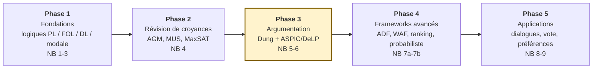
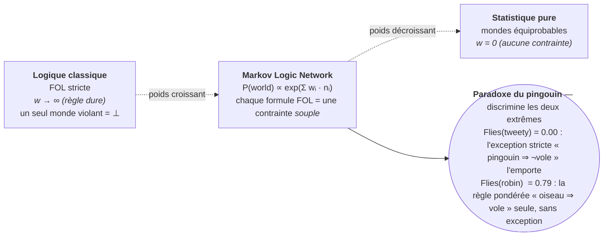
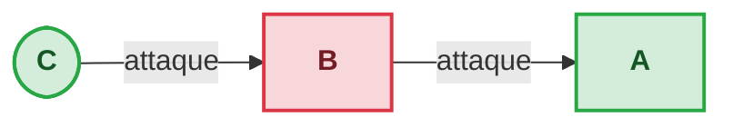

# TweetyProject - Série de Notebooks Jupyter

[↑ SymbolicAI](../README.md) | [SemanticWeb →](../SemanticWeb/README.md)

<!-- CATALOG-STATUS
series: SymbolicAI-Tweety
pedagogical_count: 11
breakdown: Tweety=11
maturity: PRODUCTION=10, BETA=1
-->

Série complète de notebooks pour explorer [TweetyProject](https://tweetyproject.org/), une bibliothèque Java pour l'intelligence artificielle symbolique. Le décompte exact des notebooks et leur maturité figurent dans le catalogue généré ci-dessous ; la série cible la version **Tweety 1.30**.

## Série en quelques mots

**À qui s'adresse cette série** : étudiants en IA, chercheurs en argumentation computationnelle, développeurs intéressés par le raisonnement formel, et tout curieux souhaitant comprendre les bases mathématiques derrière le raisonnement explicite. Aucun prérequis en logique formelle n'est supposé : les concepts sont introduits progressivement, des opérateurs propositionnels de base jusqu'aux sémantiques d'argumentation les plus avancées.

## Présentation

TweetyProject est une collection de bibliothèques Java couvrant plusieurs domaines :

- **Logiques formelles** : Propositionnelle, Premier ordre, Modale, Description, QBF
- **Argumentation computationnelle** : Dung, ASPIC+, DeLP, ABA, ADF
- **Révision de croyances** : AGM, Mesures d'incohérence, MUS/MCS
- **Agents et dialogues** : Multi-agents, Protocoles argumentatifs
- **Préférences et vote** : Ordres de préférence, Agrégation

Les notebooks utilisent **JPype** pour intégrer Java dans Python, permettant un apprentissage interactif.

À l'heure des modèles statistiques et des LLMs, pourquoi étudier ces logiques symboliques ? Parce qu'elles apportent ce que l'apprentissage seul ne garantit pas : un raisonnement **explicite, vérifiable et explicable**. L'argumentation computationnelle (cadres de Dung, ASPIC+, ABA) modélise la façon dont des agents confrontent des arguments, gèrent les contradictions et aboutissent à des conclusions justifiées — avec des applications en raisonnement juridique, en aide à la décision, en négociation multi-agents, et de plus en plus comme couche de contrôle au-dessus des LLMs (détecter les incohérences, structurer un débat). La révision de croyances (AGM) formalise comment un agent rationnel met à jour ses connaissances face à une information nouvelle ou contradictoire. L'intérêt de TweetyProject est de réunir tous ces formalismes sous un même toit : on expérimente d'une logique à l'autre sans avoir à réimplémenter chaque solveur.

## Symbolique vs. Statistique

Pour comprendre où se positionne cette série, voici une comparaison entre les approches symbolique et statistique de l'IA :

| Aspect | IA Symbolique (TweetyProject) | IA Statistique (ML/LLMs) |
|--------|-------------------------------|--------------------------|
| **Représentation** | Logiques formelles (PL, FOL, DL) | Vecteurs embeddings, poids neuronaux |
| **Raisonnement** | Déduction formelle, vérification | Inférence probabiliste, approximation |
| **Vérifiabilité** | Preuves mathématiques, solveurs | Benchmarks empiriques, statistiques |
| **Explicabilité** | Chaînes de raisonnement lisibles | Boîte noire, attention maps |
| **Incohérence** | Détection MUS/MCS, SAT solver | Gradient instability, divergence |
| **Force** | Garanties de correction | Adaptabilité, généralisation |
| **Limite** | Complexe à grande échelle | Manque de garanties formelles |

Cette série ne propose pas de choisir l'un ou l'autre, mais de **comprendre les deux**. L'intersection est d'ailleurs le front actif de la recherche : argumentation pour contrôler les LLMs, logiques neuronales, vérification formelle de modèles génératifs.

## Vue d'ensemble

| Statistique | Valeur |
|-------------|--------|
| Notebooks | 12 |
| Cellules totales | ~400 |
| Durée estimée | ~6h (tutorat) |
| Kernel | Python 3 (JPype/Java) |
| Version Tweety | 1.30 recommandée |
| Solveurs externes | Clingo, SPASS, EProver, Z3, PySAT |
| JARs Java | 42 (39 modules Tweety 1.30 + 3 deps externes) |

## Parcours d'apprentissage



Le cœur de la série est la **Phase 3** (argumentation, surlignée) — les fondations logiques et la révision de croyances y mènent, les frameworks avancés et les applications en découlent. Le détail de chaque phase suit.

### Phase 1 : Fondations (Notebooks 1-3, ~1.5h)

La série débute avec le notebook 1 (Setup) qui configure toute l'environnement : téléchargement automatique du JDK Zulu, des 39 JARs des modules TweetyProject 1.30 (plus 3 dépendances externes), et des outils externes (Clingo pour ASP, SPASS pour la logique modale, EProver pour le premier ordre). Une fois la JVM initialisée via JPype, le notebook 2 plonge dans les logiques fondamentales : la logique propositionnelle avec les opérateurs booléens, la satisfaisabilité (SAT) via pySAT, et la logique du premier ordre avec la construction de signatures et le raisonnement avec EProver. Le notebook 3 étend ces fondations aux logiques de Description (DL) pour les ontologies, la logique modale (nécessité/possibilité) pour le raisonnement sur les mondes possibles, les formules booléennes quantifiées (QBF), et la logique conditionnelle pour le raisonnement defeasible. À l'issue de cette phase, vous maîtrisez les outils de base du raisonnement formel.

### Phase 2 : Révision de Croyances (Notebook 4, ~45 min)

Ce notebook unique introduit la gestion de l'incohérence dans les systèmes intelligents. Plutôt que d'échouer face à des connaissances contradictoires, un système rationnel doit identifier les sources de conflit (MUS - Minimal Unsatisfiable Subsets), mesurer l'incohérence (scores et indices), et réélaborer ses croyances (révision AGM). Les outils pratiques incluent MaxSAT pour l'optimisation sous contraintes et le raisonnement multi-agents avec CrMas. C'est un pont entre les logiques pures et les systèmes multi-agents.

### Phase 3 : Argumentation — De l'abstrait au structuré (Notebooks 5-6, ~2h)

Les notebooks 5 et 6 constituent le cœur de la série. Le notebook 5 introduit l'argumentation abstraite de Dung (1995) : un cadre où des arguments s'attaquent mutuellement sans regarder leur contenu interne. On y explore les sémantiques classiques (grounded, preferred, stable, semi-stable), la sémantique CF2 pour les cycles, et les nouveautés 1.30 (équivalence de frameworks, explications, raisonnement causal). Le notebook 6 monte d'un cran de granularité avec l'argumentation structurée : ASPIC+ (arguments construits à partir de règles defeasibles), DeLP (logique defeasible programmée), ABA (argumentation par hypothèse), et l'Answer Set Programming (ASP) via Clingo. La comparaison entre ces cadres montre que chacun offre un compromis différent entre expressivité et calculabilité.

### Phase 4 : Frameworks avances et probabilistes (Notebooks 7a-7b, ~1h)

Le notebook 7a explore les extensions du cadre de Dung : ADF (Abstract Dialectical Frameworks, où les arguments peuvent avoir plusieurs preconditions), les frameworks bipolaires (support + attaque), les WAF (Weighted Argument Frameworks avec attaques pondérées), les SAF (Social Argumentation Frameworks), les SetAF (attaques collectives), et les frameworks étendus (attaques récursives sur des attaques). Le notebook 7b aborde deux axes différents : les sémantiques de classement (ranking) qui assignent un niveau de crédibilité à chaque argument plutôt que des extensions binaires, et l'argumentation probabiliste où les arguments portent des probabilités.

### Phase 5 : Applications multi-agents (Notebooks 8-9, ~1h)

La série se conclut par deux notebooks applicatifs. Le notebook 8 modélise les dialogues argumentatifs entre agents : protocoles d'échange, jeux grounded, et loteries argumentatives. Le notebook 9 traite des préférences et de la théorie du vote : ordres de préférence, règles d'agrégation (Borda, Condorcet, Copeland), et leur connexion avec l'argumentation. C'est la passerelle vers la théorie des jeux et le choix social.

### Parcours alternatifs

#### Parcours logique (focus fondations, ~2h)

Pour ceux qui souhaitent une base solide en logiques formelles avant l'argumentation :

1. **Setup** (1) → **Logiques de base** (2) → **Logiques avancées** (3) → **Révision** (4)
2. Puis choisir : **Argumentation abstraite** (5) pour la théorie pure, ou **Applications** (8-9) pour les cas d'usage

#### Parcours argumentation intensive (focus 5-7b, ~3.5h)

Pour les étudiants en argumentation computationnelle, aller droit au but :

1. **Setup rapide** (1) : ne garder que la partie configuration JVM
2. **Logiques de base** (2) : section PL uniquement, skip FOL si déjà connu
3. **Argumentation abstraite** (5) : Dung + sémantiques
4. **Argumentation structurée** (6) : ASPIC+ et DeLP
5. **Frameworks avancés** (7a) : ADF + bipolarité
6. **Ranking et probabiliste** (7b) : sémantiques de classement

#### Parcours applications (focus 8-9, ~1h)

Pour les praticiens intéressés par les applications multi-agents :

1. **Setup** (1) + **Logiques de base** (2) : juste pour l'environnement
2. **Argumentation abstraite** (5) : sémantiques de Dung essentielles
3. **Dialogues multi-agents** (8) : protocoles et jeux grounded
4. **Préférences et vote** (9) : théorie du vote et agrégation

## Structure

| # | Notebook | Thème | Durée |
|---|----------|-------|-------|
| **Fondations** |
| 1 | [Tweety-1-Setup](Tweety-1-Setup.ipynb) | Configuration JVM, JARs, outils externes | 20 min |
| 2 | [Tweety-2-Basic-Logics](Tweety-2-Basic-Logics.ipynb) | Logique Propositionnelle et FOL | 45 min |
| 3 | [Tweety-3-Advanced-Logics](Tweety-3-Advanced-Logics.ipynb) | DL, Modale, QBF, Conditionnelle | 40 min |
| **Révision de Croyances** |
| 4 | [Tweety-4-Belief-Revision](Tweety-4-Belief-Revision.ipynb) | CrMas, MUS, MaxSAT, Mesures d'incohérence | 50 min |
| **Argumentation** |
| 5 | [Tweety-5-Abstract-Argumentation](Tweety-5-Abstract-Argumentation.ipynb) | Dung AF, Sémantiques, CF2, Génération | 55 min |
| 5b | [Tweety-5b-Lean-Argumentation](Tweety-5b-Lean-Argumentation.ipynb) | Companion **natif** (kernel Lean) : preuve formelle 0-sorry de Dung dans le lake `argumentation_lean` (grounded = point fixe Knaster–Tarski), `#check` + `#print axioms` in-kernel (UNLOCK c.127, jonction Mathlib #2611) | 45 min |
| 6 | [Tweety-6-Structured-Argumentation](Tweety-6-Structured-Argumentation.ipynb) | ASPIC+, DeLP, ABA, ASP | 60 min |
| 7a | [Tweety-7a-Extended-Frameworks](Tweety-7a-Extended-Frameworks.ipynb) | ADF, Bipolar, WAF, SAF, SetAF, Extended | 50 min |
| 7b | [Tweety-7b-Ranking-Probabilistic](Tweety-7b-Ranking-Probabilistic.ipynb) | Ranking Semantics, Probabiliste | 40 min |
| **Applications** |
| 8 | [Tweety-8-Agent-Dialogues](Tweety-8-Agent-Dialogues.ipynb) | Agents, Dialogues argumentatifs, Loteries | 35 min |
| 9 | [Tweety-9-Preferences](Tweety-9-Preferences.ipynb) | Préférences, Théorie du vote | 30 min |
| **Synthèse** |
| 10 | [Tweety-10-MLN](Tweety-10-MLN.ipynb) | Markov Logic Networks (FOL pondérée) | 50 min |

**Durée totale estimée** : ~7.5 heures

## En quoi chaque notebook est unique

Chaque notebook introduit un concept ou cadre théorique spécifique. Le tableau ci-dessous résume en une ligne l'apport pédagogique de chacun :

| # | Notebook | Concept clé enseigné |
|---|----------|---------------------|
| 1 | Setup | Boucle configuration : JVM → JPype → JARs → solveurs externes |
| 2 | Basic Logics | SAT solving en pratique (pySAT) + formalisme FOL avec EProver |
| 3 | Advanced Logics | Ontologies OWL (DL) + raisonnement modale (SPASS) + QBF |
| 4 | Belief Revision | Identification de conflits (MUS) + révision AGM + MaxSAT |
| 5 | Abstract Argumentation | Sémantiques de Dung (grounded/stable/CF2) + frameworks aléatoires |
| 6 | Structured Argumentation | Comparaison ASPIC+/DeLP/ABA/ASP — le cadre idéal selon le domaine |
| 7a | Extended Frameworks | Au-delà de Dung : ADF, bipolarité, attaques pondérées et collectives |
| 7b | Ranking & Probabilistic | Classement graduel des arguments + incertitude sur les arguments |
| 8 | Agent Dialogues | Protocoles d'échange entre agents + négociation argumentative |
| 9 | Preferences | Agrégation de préférences (Borda, Condorcet) + théorie du vote |
| 10 | MLN | Pont symbolique/statistique : FOL + poids, marginales, exceptions (pingouin) |

## Le pont symbolique/statistique (notebook 10 — MLN)

Le notebook 10 introduit les **Markov Logic Networks**, qui font varier le « degré de logique » d'une formule via son poids `w`. À une extrémité (`w → ∞`), on retrouve la **logique classique** (un seul monde violant rend la base inconsistante) ; à l'autre (`w = 0`), la **statistique pure** (tous les mondes équiprobables). Le **paradoxe du pingouin** illustre comment ce spectre résout des cas qu'aucune des deux extrêmes ne sait traiter seule :



## Quick Start

```bash
# 1. Installer les packages Python
pip install jpype1 requests tqdm clingo z3-solver python-sat

# 2. Ouvrir le notebook de setup (auto-télécharge JDK + JARs)
jupyter notebook Tweety-1-Setup.ipynb

# 3. Exécuter toutes les cellules, puis passer à Tweety-2
```

JDK 17 et les 42 JARs (39 modules TweetyProject 1.30 + 3 dépendances externes : args4j, commons-math, sat4j) sont téléchargés automatiquement par le notebook de setup. Aucune installation système requise.

## Prérequis

### Niveau mathématique attendu

Cette série suppose une **maîtrise de base en logique et raisonnement** :

| Concept | Utilisation dans la série | Notes de révision |
|---------|--------------------------|-------------------|
| Logique propositionnelle (ET, OU, NON, →) | Notebook 2 (PL), 5+ (argumentation) | Tables de vérité, DNF/CNF, satisfaisabilité |
| Logique du premier ordre (quantificateurs) | Notebook 2 (FOL), 3 (DL) | ∀, ∃, variables, prédicats |
| Graphes (nœuds, arêtes) | Notebook 5 (Dung AF), 7a (SetAF) | Chemins, cycles, orientés |
| Ensembles (inclusion, union, intersection) | Partout (extensions, bases) | Ensembles finis, parties |
| Raisonnement par récurrence | Notebook 3 (DL), 5 (sémantiques) | Principe de récurrence bien-fondée |

**Inutile de maîtriser** : théorie de la preuve formelle, complexité computationnelle avancée (la complexité des sémantiques de Dung est expliquée en contexte). Les concepts logiques sont introduits progressivement dans chaque notebook.

### Prérequis techniques

#### Python et dépendances

```bash
pip install jpype1 requests tqdm clingo z3-solver python-sat
```

#### Java/JVM

- **JDK 17+** — telechargé automatiquement (Zulu) par le notebook de setup
- **JPype** — bridge Python ↔ Java (charge automatiquement les JARs)

#### Outils externes (optionnels mais recommandés)

| Outil | Usage | Installation |
|-------|-------|--------------|
| **Clingo 5.4+** | ASP (Answer Set Programming) | `download_tweety_tools.py --clingo` |
| **SPASS** | Logique modale | Binaire inclus ou auto-download Linux |
| **EProver** | FOL haute performance | Installation manuelle ou dossier inclus |
| **Z3** | SMT solver, MARCO | `pip install z3-solver` |
| **PySAT** | SAT/MaxSAT moderne | `pip install python-sat` |

## Architecture

```
Tweety/
├── Tweety-1-Setup.ipynb          # Configuration
├── Tweety-2-Basic-Logics.ipynb   # PL + FOL
├── Tweety-3-Advanced-Logics.ipynb # DL, ML, QBF, CL
├── Tweety-4-Belief-Revision.ipynb # Revision de croyances
├── Tweety-5-Abstract-Argumentation.ipynb
├── Tweety-6-Structured-Argumentation.ipynb
├── Tweety-7a-Extended-Frameworks.ipynb
├── Tweety-7b-Ranking-Probabilistic.ipynb
├── Tweety-8-Agent-Dialogues.ipynb
├── Tweety-9-Preferences.ipynb
├── libs/                          # JARs Tweety (42 : 39 modules 1.30 + 3 deps)
├── resources/                     # Fichiers d'exemples (.txt, .aba, .aspic)
├── ext_tools/                     # Outils externes (Clingo, SPASS, EProver)
├── jdk-17-portable/              # JDK Zulu (telecharge auto)
├── scripts/
│   ├── download_tweety_tools.py  # Script de téléchargement des dépendances
│   ├── verify_all_tweety.py      # Script de validation
│   └── validate_syntax.py        # Validation syntaxe Python
└── README.md                      # Ce fichier
```

## Outils Externes

### Script de téléchargement automatisé

Un script autonome est disponible pour télécharger toutes les dépendances :

```bash
cd MyIA.AI.Notebooks/SymbolicAI/Tweety

# Télécharger tout (JARs, ressources, outils)
python scripts/download_tweety_tools.py --all

# Télécharger uniquement les JARs
python scripts/download_tweety_tools.py --jars

# Télécharger uniquement les ressources
python scripts/download_tweety_tools.py --resources

# Télécharger Clingo (ASP solver)
python scripts/download_tweety_tools.py --clingo

# Voir toutes les options
python scripts/download_tweety_tools.py --help
```

### Liste des dépendances

| Outil | Usage | Téléchargement Auto | Versionné Git |
|-------|-------|---------------------|---------------|
| **Clingo** | ASP (Answer Set Programming) | Oui (Win/Linux) | Oui (binaire Windows) |
| **SPASS** | Logique Modale | Oui (Linux) | Oui (binaire + docs Windows) |
| **EProver** | FOL haute performance | Non | Oui (installation complète) |
| **Z3** | SMT solver, MARCO | `pip install z3-solver` | N/A (package Python) |
| **PySAT** | SAT/MaxSAT moderne | `pip install python-sat` | N/A (package Python) |
| **Native SAT** | Bibliothèques SAT JNI | Oui | Oui (DLLs Minisat, Lingeling) |
| **JDK 17** | JVM pour JPype | Oui (Zulu) | Non (trop volumineux) |
| **JARs Tweety** | Bibliothèques Java | Oui (Maven Central) | Non (trop volumineux) |
| **Resources** | Fichiers exemples | Oui (GitHub) | Non (fichiers de données) |

### Notes d'installation

#### Clingo

- Télécharge automatiquement pour Windows et Linux
- Version 5.4.0 depuis GitHub releases (potassco/clingo)
- Si déjà installé dans le PATH, utilise la version système

#### SPASS (Windows)

- Le téléchargement automatique n'est PAS disponible sur Windows (l'installeur ne peut pas être automatisé)
- **Deux options** :

  1. Utiliser le binaire déjà inclus dans le dépôt Git (`ext_tools/spass/SPASS.exe`)
  2. Installation manuelle :
     - Télécharger depuis <https://www.spass-prover.org/download/binaries/>
     - Exécuter l'installeur `spass30windows.exe`
     - Copier `SPASS.exe` et le dossier `SPASS-3.0/` vers `ext_tools/spass/`

#### SPASS (Linux)

- Télécharge automatiquement (version 64-bit ou 32-bit selon l'architecture)

#### EProver

- Doit être installé manuellement : <https://eprover.org/>
- L'installation complète est déjà incluse dans `../ext_tools/EProver/`
- Contient tous les utilitaires : eprover, eground, enormalizer, etc.

#### Bibliothèques natives SAT

- DLLs Windows (Minisat, Lingeling, Picosat) pour Tweety JNI
- Téléchargeables automatiquement ou déjà incluses dans `libs/native/`

## Limitations Connues (Tweety 1.28/1.29)

| Limitation | Impact | Contournement |
|------------|--------|---------------|
| **CrMas/InformationObject** | Section révision multi-agents échoue | API refactorisée, classe supprimée |
| **SimpleMlReasoner** | Bloque indéfiniment | Utiliser SPASS externe |
| **AF Learning** | ClassCastException | Bug interne, section désactivée |
| **ADF natif SAT** | Raisonnement ADF incomplet | Nécessite solveur SAT natif (non JPype) |
| **FOL avec égalité** | Heap space sur grandes requêtes | Utiliser EProver externe |

## Modules TweetyProject Couverts

### Logiques (Notebooks 2-3)

| Module | Description | Notebook |
|--------|-------------|----------|
| `logics.pl` | Logique Propositionnelle | 2 |
| `logics.fol` | Logique du Premier Ordre | 2 |
| `logics.dl` | Logique de Description | 3 |
| `logics.ml` | Logique Modale | 3 |
| `logics.qbf` | Quantified Boolean Formulas | 3 |
| `logics.cl` | Logique Conditionnelle | 3 |
| `logics.mln` | Markov Logic Networks (FOL pondérée) | 10 |

### Révision de Croyances (Notebook 4)

| Module | Description |
|--------|-------------|
| `beliefdynamics` | Opérateurs de révision AGM |
| `logics.pl.analysis` | Mesures d'incohérence |
| `logics.pl.sat` | MUS, MaxSAT |

### Argumentation (Notebooks 5-7)

| Module | Description | Notebook |
|--------|-------------|----------|
| `arg.dung` | Frameworks de Dung | 5 |
| `arg.aspic` | ASPIC+ | 6 |
| `arg.delp` | Defeasible Logic Programming | 6 |
| `arg.aba` | Assumption-Based Argumentation | 6 |
| `lp.asp` | Answer Set Programming | 6 |
| `arg.adf` | Abstract Dialectical Frameworks | 7a |
| `arg.bipolar` | Frameworks Bipolaires | 7a |
| `arg.weighted` | Frameworks Pondérés | 7a |
| `arg.social` | Argumentation Sociale | 7a |
| `arg.setaf` | Attaques Collectives | 7a |
| `arg.extended` | Attaques Récursives | 7a |
| `arg.rankings` | Sémantiques de Classement | 7b |
| `arg.prob` | Argumentation Probabiliste | 7b |

### Agents et Préférences (Notebooks 8-9)

| Module | Description | Notebook |
|--------|-------------|----------|
| `agents` | Framework agents de base | 8 |
| `agents.dialogues` | Dialogues argumentatifs | 8 |
| `agents.dialogues.oppmodels` | Jeux grounded (ArguingAgent) | 8 |
| `agents.dialogues.lotteries` | Loteries argumentatives | 8 |
| `preferences` | Ordres de préférence, agrégation | 9 |

## Concepts clés

| Concept | Description |
|---------|-------------|
| **Logique Propositionnelle** | Operateurs booléens, DNF, satisfaisabilité (SAT) |
| **Logique du Premier Ordre** | Quantificateurs (∀, ∃), prédicats, fonctions |
| **Logique de Description** | Ontologies, TBox/ABox, sous-typage, OWL |
| **Logique Modale** | Nécessité (□) et possibilité (◇), mondes possibles |
| **Argumentation de Dung** | Frameworks abstraits, attaques, sémantiques (grounded, stable) |
| **Argumentation structurée** | Arguments construits à partir de prémisses et règles |
| **Révision AGM** | Mise à jour rationnelle de croyances face à l'information contradictoire |
| **MUS/MCS** | Sous-ensembles insatisfaisables/maximaux — identifier les conflits |
| **Answer Set Programming** | Programmation par modèles (ASP) via Clingo |
| **Agrégation de préférences** | Borda, Condorcet, Copeland — combiner des opinions |

## Domaines d'application

| Domaine | Notebooks | Exemple concret |
|---------|-----------|----------------|
| **Juridique** | 5, 6, 8 | Argumentation légale, débats en cour, preuve par argument |
| **Aide à la décision** | 4, 9 | Diagnostic médical, planification de ressources, vote |
| **Multi-agents** | 8 | Négociation automatique, protocoles de dialogue |
| **Ontologies** | 3 | Représentations de connaissances, OWL, Web sémantique |
| **Vérification formelle** | 2, 3, 4 | SAT/SMT solving, proof checking, model checking |
| **LLM control** | 5, 6, 7b | Détection d'incohérences, structuration de débats, argumentation probabiliste |

### Exemples concrets

Derrière chaque cadre de la série se cache une application réelle ou un problème de recherche actif :

- **L'argumentation de Dung** (notebook 5) est le fondement mathématique de nombreux systèmes d'aide à la décision juridique : des arguments se confrontent, les sémantiques déterminent quels arguments sont "acceptables", et le résultat guide la conclusion. C'est aussi la base des frameworks d'explicabilité des LLMs — détecter les incohérences entre réponses d'un modèle.
- **ASPIC+ et DeLP** (notebook 6) modélisent des débats où les arguments ont une structure interne : prémisses, règles defeasibles, et priorités. Applications en aide à la décision médicale, en gestion de conflits de règles, et en vérification de contrats.
- **La révision de croyances AGM** (notebook 4) formalise comment un système rationnel met à jour ses connaissances quand une information contradictoire arrive. Applications en intégration de données, diagnostic de bases de connaissance, et fusion de sources d'information.
- **Les frameworks étendus** (notebook 7a) généralisent Dung pour capturer des situations réelles où des arguments ont plusieurs preconditions (ADF), où des attaques ont des poids variés (WAF), ou des groupes d'arguments attaquent collectivement (SetAF).
- **La théorie du vote** (notebook 9) est au cœur des systèmes de recommandation collective, de l'agrégation de préférences en intelligence artificielle, et des mécanismes d'incitation (mechanism design).

#### Un framework de Dung, visualisé

L'argumentation abstraite de Dung (notebook 5) se réduit à un **graphe orienté** : des nœuds (les arguments) et des flèches (les attaques). La question n'est pas « l'argument est-il vrai ? » mais **« survive-t-il aux attaques ? »** — c'est ce que calculent les sémantiques. Exemple minimal :



**Extension grounded** : `C` n'est attaqué par personne → **accepté** ; `B` est attaqué par l'accepté `C` → **rejeté** ; `A` n'est attaqué que par le rejeté `B` → **accepté**. D'où `{A, C}`. La règle se tient en une phrase : *un argument est acceptable si tous ses attaquants sont eux-mêmes défaits*. Les sémantiques preferred/stable, les cycles (CF2) et le raisonnement causal du notebook 5 raffinent ce même calcul.

## Installation

### Packages Python requis

```bash
pip install jpype1 requests tqdm clingo z3-solver python-sat
```

### Vérification de l'environnement

```bash
# Lancer le notebook de setup
jupyter notebook Tweety-1-Setup.ipynb
# Exécuter toutes les cellules — il télécharge JDK, JARs, outils externes

# Ou utiliser le script de validation
cd scripts
python verify_all_tweety.py --quick
```

JDK 17 et les 42 JARs (39 modules TweetyProject 1.30 + 3 dépendances externes : args4j, commons-math, sat4j) sont téléchargés automatiquement par le notebook de setup. Aucune installation système requise.

## Validation des Notebooks

### Script de vérification

```bash
cd MyIA.AI.Notebooks/SymbolicAI/Tweety/scripts

# Vérification structurelle rapide
python verify_all_tweety.py --quick

# Vérification environnement
python verify_all_tweety.py --check-env

# Analyse des sorties existantes
python verify_all_tweety.py --analyze-outputs --verbose

# Exécution complète (lent)
python verify_all_tweety.py --execute --verbose

# Notebook spécifique
python verify_all_tweety.py --notebook Tweety-2 --analyze-outputs
```

### Options disponibles

| Option | Description |
|--------|-------------|
| `--quick` | Validation structure uniquement |
| `--check-env` | Vérifier JDK, JARs, outils |
| `--analyze-outputs` | Analyser sorties existantes |
| `--execute` | Exécution Papermill complète |
| `--cell-by-cell` | Exécution cellule par cellule |
| `--execute-missing` | Exécuter cellules sans output |
| `--clean-errors` | Nettoyer sorties en erreur |
| `--verbose` | Sortie détaillée |
| `--json` | Format JSON (CI/CD) |

## FAQ / Troubleshooting

### `JPypeError` ou JVM déjà démarrée

Tweety utilise JPype pour intégrer la JVM. Si un notebook signale que la JVM est déjà démarrée, c'est que le notebook précédent ne l'a pas arrêtée proprement. Relancer Jupyter et exécuter depuis le notebook 1.

### Clingo non trouvé

Si `clingo` n'est pas dans le PATH, utiliser le script de téléchargement :

```bash
python scripts/download_tweety_tools.py --clingo
```

Le binaire Windows sera téléchargé dans `ext_tools/`.

### EProver ne répond pas ou heap space

EProver peut bloquer sur des formules FOL complexes avec égalité. La solution est d'utiliser un solveur plus léger ou de réduire la taille de la base de connaissances. Voir la section "Limitations connues" ci-dessus.

### Erreur de chargement d'un JAR Tweety

Vérifier que la version Tweety dans `Tweety-1-Setup.ipynb` correspond à la version téléchargée. La version recommandée est 1.30. Pour changer de version, modifier la variable `TWEETY_VERSION` puis relancer le notebook 1.

### `ClassCastException` en argumentation

Le notebook 5 signale un bug connu (AF Learning — ClassCastException). La section correspondante est désactivée. Suivre les autres sections sans problème.

### JPype lent au premier appel

Le premier appel à un module Java déclenche le chargement de la JVM et des classes Tweety. Attendez 5-10 secondes avant la première réponse. Les appels suivants sont rapides.

### Comment passer d'un notebook à l'autre ?

Chaque notebook présuppose la configuration faite dans Tweety-1-Setup (JDK, JARs, JVM). Une fois le notebook 1 exécuté, les notebooks 2-9 peuvent être exécutés dans l'ordre logique de la série. Les outils externes (Clingo, SPASS, EProver) sont configurés par le notebook 1.

## Versions TweetyProject

| Version | Date | Nouveautés |
|---------|------|------------|
| **1.28** | Janvier 2025 | arg.caf, k-admissibility, API refactoring |
| **1.29** | Juillet 2025 | arg.eaf (Epistemic AF), graph rendering |
| **1.30** | Janvier 2026 | causal reasoning, arg.explanations, equivalence checking |

La version est configurable dans `Tweety-1-Setup.ipynb` (variable `TWEETY_VERSION`). La version 1.30 est recommandée — elle inclut les sémantiques de causalité, les explications en argumentation, et le checking d'équivalence de frameworks.

## Ressources

### Références académiques

| Référence | Couverture |
|-----------|------------|
| Dung, "On the Acceptability of Arguments" (1995) | Notebook 5, sémantiques de Dung |
| Modgil & Prakken, "The ASPIC+ Framework" (2014) | Notebook 6, argumentation structurée |
| Alchourron, Gardenfors & Makinson, "On the Logic of Theory Change" (1985) | Notebook 4, révision AGM |
| Enderton, *A Mathematical Introduction to Logic* (2001) | Notebooks 2-3, logiques formelles |
| Besnard & Hunter, *Elements of Argumentation* (2008) | Notebooks 5-7, théorie argumentation |
| Brewka, Eiter & Truszczynski, "Answer Set Programming at a Glance" (2011) | Notebook 6, ASP/Clingo |
| Russell & Norvig, *AIMA* 4e éd., ch. 7-8 | Cadre général logique et SAT |
| Gärdenfors & Makinson (1988) | Notebook 4, enracinement épistémique (caractérisation AGM) |
| Caminada (2006); Modgil & Caminada (2009) | Notebook 5, labellings trivalués (in/out/undec) |
| Baroni et al. (2005) | Notebook 5, sémantique CF2 (cycles impairs) |
| García & Simari, "Defeasible Logic Programming" (2004) | Notebook 6, DeLP |
| Brewka & Woltran, "Abstract Dialectical Frameworks" (2010) | Notebook 7a, ADF |
| Cayrol & Lagasquie-Schiex (2005) | Notebook 7a, frameworks bipolaires (BAF) |
| Bonzon, Delobelle, Konieczny & Maudet (2016) | Notebook 7b, sémantiques de classement |
| Arrow, "Social Choice and Individual Values" (1951) | Notebook 9, théorème d'impossibilité (choix social) |

### Ressources en ligne

- **TweetyProject** : https://tweetyproject.org/
- **Documentation API** : https://tweetyproject.org/api/
- **GitHub** : https://github.com/TweetyProjectTeam/TweetyProject
- **JPype** : https://jpype.readthedocs.io/

## Ponts avec les autres séries

| Série | Connection | Détails |
|-------|------------|---------|
| **[Argument_Analysis](../Argument_Analysis/)** | Argumentation agentique | Utilise Tweety comme backend Java pour le raisonnement argumentatif. Les sémantiques de Dung (notebook 5) sont directement appliquées dans l'analyse de textes. |
| **[Lean](../Lean/)** | Vérification formelle | Les logiques propositionnelles et FOL (notebooks 2-3) correspondent aux tactiques de preuve Lean. Les SAT solvers de Tweety complètent la vérification Lean. |
| **[SmartContracts](../SmartContracts/)** | Méthodes formelles | La vérification formelle SC-14 (Certora/SMTChecker) utilise les mêmes solveurs SAT/SMT. La logique propositionnelle de Tweety est la base des invariants Solidity. |
| **[SemanticWeb](../SemanticWeb/)** | Logique de Description / OWL | La logique de Description (Tweety-3) est le fondement du raisonnement OWL : les ontologies OWL DL (SW-6/SW-7) utilisent les mêmes solveurs DL que Tweety. |
| **[GameTheory](../../GameTheory/)** | Théorie du vote | Le notebook 9 (Préférences/Vote) couvre les concepts de choix social formalisés dans `social_choice_lean/` (Arrow, Sen, Voting). |
| **[Planners](../Planners/)** | Planification argumentative | Les dialogues argumentatifs (notebook 8) peuvent être modélisés comme des problèmes de planification PDDL. |
| Lecture transversale | [La mer qui monte](../../../docs/grothendieckian-lens.md) | Grille de lecture grothendieckienne du dépôt : changement de représentation, certification A/B/C |

## Conclusion / Prochaines étapes

### Ce que vous avez appris

Tweety est l'outil où **le raisonnement devient explicite et vérifiable** — le contre-pied des approches purement statistiques. En parcourant cette série, vous êtes allé du connecteur booléen au débat multi-agent :

- **Les logiques classiques** (notebooks 1-4) : propositionnelle, du premier ordre, modale, de description. Vous avez vu qu'un même énoncé se *décide* mécaniquement — un SAT solver tranche, un reasoner DL classe, sans intuition.
- **L'argumentation** (notebooks 5-7b) : la contribution la plus originale de Tweety. Les *frameworks* de Dung, ASPIC+, ABA, ADF, l'argumentation bipolaire et probabiliste — chaque modèle définit non pas « quelle conclusion est vraie » mais « quel argument résiste à l'attaque ». C'est une logique du *débat*, pas de la vérité.
- **Les applications** (notebooks 8-9) : dialogues multi-agents, révision de croyances AGM, préférences et vote. La boucle se ferme — du raisonnement individuel à la délibération collective.

### Prochaines étapes

- **Appliquez l'argumentation à du texte réel** : la série **[Argument_Analysis](../Argument_Analysis/)** utilise Tweety comme backend pour analyser des argumentations naturelles — c'est le terrain où les sémantiques de Dung rencontrent du langage humain.
- **Certifiez** : les SAT/SMT solvers de Tweety et la vérification formelle partagent le même socle. La série **[Lean](../Lean/)** pousse la logique jusqu'à la preuve de programmes ; **[SmartContracts](../SmartContracts/)** (SC-14) l'applique aux invariants Solidity.
- **Reliez aux ontologies** : la logique de description de Tweety-3 est le moteur de raisonnement OWL. La série **[SemanticWeb](../SemanticWeb/)** (SW-6/SW-7) en fait le cœur des graphes de connaissances.
- **Élargissez au choix social** : le notebook 9 (vote, préférences) est la porte d'entrée vers la théorie du choix social formalisée en Lean dans la série **[GameTheory](../../GameTheory/)** (Arrow, Sen, Voting).
- Les six ponts détaillés ci-dessus (`## Ponts avec les autres séries`) cartographient l'ensemble de ces connexions ; la [Lecture transversale](../../../docs/grothendieckian-lens.md) les relie au fil rouge du dépôt.

### Le fil rouge

Le pitch de Tweety tient en un mot : **explicabilité**. Là où un LLM produit une réponse, Tweety produit un *argument* — une chaîne de raisonnement inspectable, attaquable, défendable. Les logiques changent (propositionnelle, FOL, modale, DL), les *frameworks* changent (Dung, ASPIC+, ABA), mais l'exigence reste — *raisonner de façon transparente, pas opaquement*. C'est elle que vous emportez au-delà de cette série, et c'est ce qui fait de l'IA symbolique un garde-fou naturel pour l'IA générative.

---

## Licence

Les notebooks sont distribués sous licence MIT.
TweetyProject est sous licence LGPL 3.0.
