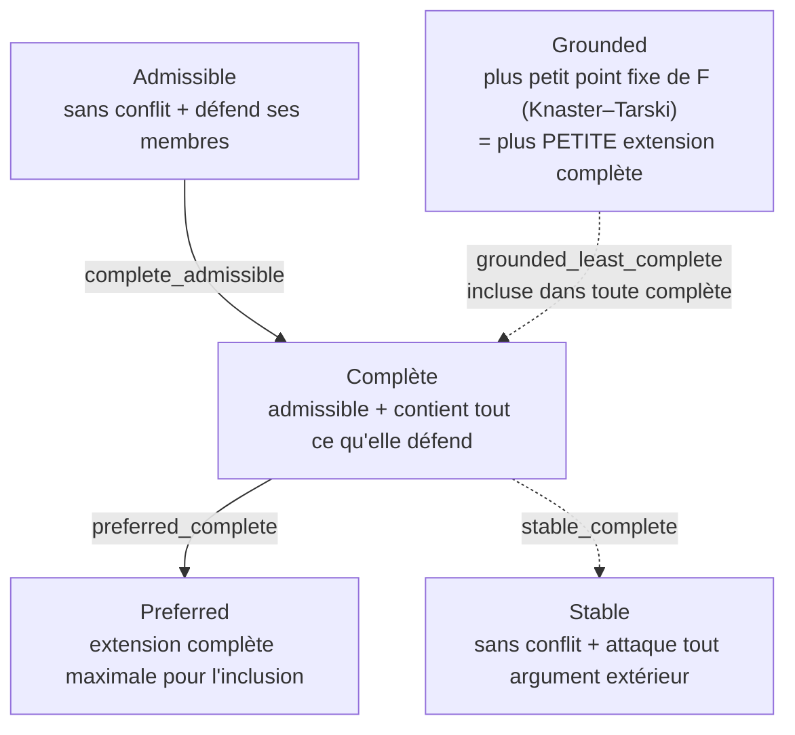
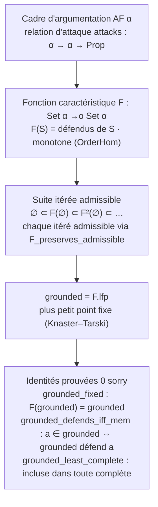

# argumentation_lean — Théorie de l'argumentation abstraite de Dung (Lean 4)

Lake Lean 4 (Mathlib) à la racine de la série **Tweety**, formalisant la
**sémantique de l'argumentation abstraite de Dung (1995)** : cadres d'argumentation,
les cinq extensions canoniques (admissible, complète, grounded, preferred, stable),
le **Fundamental Lemma** et le **théorème de point fixe** (extension grounded = plus
petit point fixe de la fonction caractéristique, Knaster–Tarski).

C'est le **cœur formel de la série Tweety** et un pont direct vers l'**Epic
Argumentum #2137**. La théorie de Dung est *exactement* de la théorie du point fixe
sur treillis fini — Mathlib fournit `CompleteLattice (Set α)`, `OrderHom.lfp`/`gfp`
et Knaster–Tarski clé en main, sur lesquels la sémantique se mappe presque
littéralement. Voir l'issue #4046 (roadmap Lean #4038).

## Statut

- **Toolchain** : `leanprover/lean4:v4.31.0-rc1` + Mathlib4 (`v4.31.0-rc1`)
- **Sorry** : **0** sur tout le module. Fundamental Lemma de Dung, identités de
  point fixe du grounded, plus-petite-complétude, hiérarchie des sémantiques et
  le lemme-clé `F_preserves_admissible` sont entièrement prouvés.
- **Jalon OPEN documenté (non sorry-backed)** : la preuve que le `grounded` est
  lui-même une extension complète (stabilisation finie de la suite itérée) — voir
  ci-dessous.
- **Build** : `lake build Argumentation` (dépend de Mathlib4)

## Ce qui est formalisé

Un **cadre d'argumentation abstraite** (Dung) est un type d'arguments `α` muni d'une
relation d'attaque `attacks : α → α → Prop`. Les **extensions** caractérisent les
ensembles d'arguments rationnellement acceptables selon cinq critères décroissants
en exigence :

| Sémantique | Définition |
|------------|-----------|
| **Admissible** | sans conflat + défend ses membres |
| **Complète** | admissible + contient tout ce qu'elle défend |
| **Grounded** | le plus petit point fixe de la fonction caractéristique `F` |
| **Preferred** | une extension complète maximale pour l'inclusion |
| **Stable** | sans conflat + attaque tout argument extérieur |

La **fonction caractéristique** `F(S) = { a | S défend a }` est un `OrderHom`
monotone sur le treillis complet `(Set α, ⊆)` ; l'extension grounded en est le plus
petit point fixe `F.lfp` (Knaster–Tarski).

*Hiérarchie des cinq sémantiques de Dung — emboîtées par exigence décroissante
(`Stable ⇒ Preferred ⇒ Complete ⇒ Admissible`), avec le `grounded` = plus petite
extension complète :*



### Prouvé (0 sorry)

- **Fundamental Lemma de Dung** (`Fundamental.lean`) : si `S` est admissible et
  défend `a`, alors `S ∪ {a}` est admissible ; si `S` défend `a` et `b`, alors
  `S ∪ {a}` défend encore `b`. Raisonnement du premier ordre (conflat par analyse
  2×2 + monotonie de la défense).
- **Identités de point fixe du grounded** (`Grounded.lean`) :
  - `grounded_fixed` : `F(grounded) = grounded` (c'est un point fixe).
  - `grounded_defends_iff_mem` : `a ∈ grounded ⇔ grounded défend a`.
  - `grounded_least_complete` : toute extension complète contient `grounded`
    (le grounded est la **plus petite** extension complète).
- **Hiérarchie des sémantiques** (`Extensions.lean`) :
  `Stable ⇒ Preferred ⇒ Complete ⇒ Admissible` (sans sorry).
- **Lemme-clé de Dung** `F_preserves_admissible` : la fonction caractéristique
  préserve l'admissibilité (`Admissible S ⇒ Admissible (F S)`).

*Le mécanisme de point fixe — comment l'extension grounded émerge de la fonction
caractéristique `F` (monotone sur le treillis complet `(Set α, ⊆)`) par itération
vers son plus petit point fixe (Knaster–Tarski, clé en main dans Mathlib via
`OrderHom.lfp`) :*



### Jalon OPEN (documenté, non sorry-backed)

La preuve que le `grounded` est **lui-même** une extension complète (donc sans
conflat) est le résultat substantiel de Dung (Proposition 11). Pour un cadre fini,
elle requiert la **stabilisation finie** de la suite itérée
`∅ ⊂ F(∅) ⊂ F²(∅) ⊂ …` vers le `lfp` — chaque itéré est admissible via
`F_preserves_admissible`, et la chaîne se stabilise en au plus `|α|` étapes. Cette
connexion *itération finie ↔ `lfp`* est **délibérément non énoncée comme un
`sorry`** : la bibliothèque reste entièrement `sorry`-free. Le résultat est documenté
comme le jalon naturel suivant (non requis par les critères de sortie de #4046).

## Modules

| Fichier | sorry | Contenu |
|---------|-------|---------|
| `Argumentation/Basic.lean` | 0 | `AF α` (relation d'attaque), `conflictFree`, `defends`, `defendedBy`, monotonie de la défense, lemmes de non-attaque interne. |
| `Argumentation/Characteristic.lean` | 0 | Fonction caractéristique `F : Set α →o Set α` (monotone). |
| `Argumentation/Extensions.lean` | 0 | `Admissible`, `Complete`, `grounded = F.lfp`, `Preferred`, `Stable` + hiérarchie (`stable_complete`, `preferred_complete`, `complete_admissible`). |
| `Argumentation/Fundamental.lean` | 0 | **Fundamental Lemma de Dung** (i) + (ii), preuve sans sorry. |
| `Argumentation/Grounded.lean` | 0 | `grounded_fixed`, `grounded_defends_iff_mem`, `grounded_least_complete`, `F_preserves_admissible` (+ `F_preserves_conflictFree`). |
| `Argumentation.lean` | 0 | Imports parapluie + doc de statut. |

## Build

```bash
# Depuis ce répertoire (WSL requis)
lake build Argumentation
# Dépend de Mathlib4 — le premier build est lourd, les builds suivants utilisent le cache
```

## Notebook compagnon

[`Tweety-5-Abstract-Argumentation.ipynb`](../Tweety-5-Abstract-Argumentation.ipynb)
— présentation pédagogique Python (tweety) des cadres de Dung et de leurs
extensions, dont cette formalisation est le pendant prouvé. Paire Lean + Python
côte à côte.

## Référence

P. M. Dung, *On the Acceptability of Arguments and its Fundamental Role in
Nonmonotonic Reasoning, Logic Programming and n-Person Games*, Artificial
Intelligence 77 (1995), 321–357.

## Voir aussi

- **Issue #4046** — création du lake (roadmap Lean #4038)
- **`SymbolicAI/Tweety/`** — série argumentation (cadres de Dung, Tweety Python)
- **Epic Argumentum #2137**
- **Epic #2651** — audit README/structure (série Lean)
