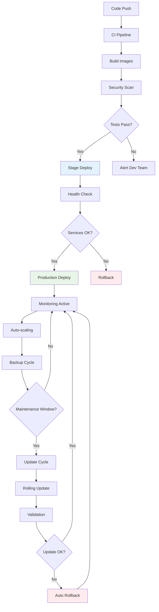

# 🔄 Gestion Lifecycle Docker GenAI - CoursIA

**Date :** 7 octobre 2025  
**Version :** 1.0 Production-Ready  
**Audience :** DevOps, Administrateurs Infrastructure  
**Méthode :** SDDD Phase 1.3 - Lifecycle Management Avancé

---

## 🎯 Stratégie de Gestion Lifecycle

### Vue d'Ensemble du Lifecycle

Le lifecycle des containers GenAI CoursIA suit une **approche GitOps** avec gestion automatisée :

- **Déploiement** : Rolling updates avec zéro downtime
- **Monitoring** : Surveillance continue avec alerting proactif
- **Maintenance** : Mises à jour automatisées avec rollback
- **Backup** : Sauvegarde continue des modèles et configurations
- **Scaling** : Auto-scaling basé sur la charge et les métriques
- **Disaster Recovery** : Récupération automatique avec RTO < 15 minutes

### Diagramme du Lifecycle



---

## 🚀 Stratégies de Déploiement Avancées

### 1. Rolling Update Intelligent

```yaml
# docker-configurations/deployment/rolling-update.yml
version: '3.8'

services:
  flux-1-dev:
    image: coursia/genai-flux:${VERSION}
    deploy:
      replicas: 3
      update_config:
        parallelism: 1              # Un container à la fois
        delay: 60s                  # Attente entre updates
        failure_action: rollback    # Rollback automatique si échec
        monitor: 120s               # Monitoring post-deployment
        max_failure_ratio: 0.3      # Max 30% d'échecs tolérés
        order: start-first          # Démarre nouveau avant arrêter ancien
      rollback_config:
        parallelism: 1
        delay: 10s
        failure_action: pause
        monitor: 60s
        order: stop-first
      restart_policy:
        condition: any
        delay: 5s
        max_attempts: 3
        window: 120s
        
    healthcheck:
      test: ["CMD", "curl", "-f", "http://localhost:8188/health"]
      interval: 15s
      timeout: 10s
      retries: 3
      start_period: 60s
      
    networks:
      - genai-network
      
    volumes:
      - genai-models:/app/models:ro
      - genai-outputs:/app/output:rw
```

### 2. Canary Deployment

```python
# scripts/canary_deployment.py
"""
Système de déploiement canary pour GenAI CoursIA
Déploiement progressif avec validation automatique
"""

import asyncio
import docker
import httpx
from typing import Dict, List, Optional
from dataclasses import dataclass
from datetime import datetime, timedelta
import logging

@dataclass
class CanaryConfig:
    """Configuration déploiement canary"""
    service_name: str
    canary_image: str
    production_image: str
    traffic_split: float = 0.1  # 10% du trafic initialement
    validation_duration: int = 300  # 5 minutes de validation
    max_error_rate: float = 0.05  # 5% d'erreurs max
    rollout_steps: List[float] = None
    
    def __post_init__(self):
        if self.rollout_steps is None:
            self.rollout_steps = [0.1, 0.25, 0.5, 0.75, 1.0]

class CanaryDeploymentManager:
    """
    Gestionnaire de déploiement canary automatisé
    
    Fonctionnalités:
    1. Déploiement progressif par paliers
    2. Monitoring métriques en temps réel  
    3. Rollback automatique si problème détecté
    4. Validation santé à chaque étape
    """
    
    def __init__(self):
        self.docker_client = docker.from_env()
        self.logger = logging.getLogger(__name__)
        self.metrics_collector = MetricsCollector()
        
    async def deploy_canary(self, config: CanaryConfig) -> bool:
        """
        Exécution déploiement canary complet
        
        Returns:
            bool: True si déploiement réussi, False si rollback nécessaire
        """
        
        self.logger.info(f"🚀 Démarrage déploiement canary: {config.service_name}")
        
        try:
            # Phase 1: Déploiement instance canary
            canary_container = await self._deploy_canary_instance(config)
            
            # Phase 2: Rollout progressif
            for step, traffic_percentage in enumerate(config.rollout_steps):
                self.logger.info(f"📊 Étape {step + 1}: {traffic_percentage * 100}% du trafic")
                
                # Mise à jour répartition trafic
                await self._update_traffic_split(config.service_name, traffic_percentage)
                
                # Période d'observation
                await self._validation_period(config, traffic_percentage)
                
                # Analyse métriques
                metrics = await self._collect_metrics(config.service_name, canary_container.id)
                
                if not await self._validate_metrics(metrics, config):
                    self.logger.error("❌ Métriques canary dégradées, rollback")
                    await self._rollback_canary(config, canary_container)
                    return False
                
                self.logger.info(f"✅ Étape {step + 1} validée")
            
            # Phase 3: Finalisation déploiement
            await self._finalize_deployment(config, canary_container)
            
            self.logger.info("🎉 Déploiement canary terminé avec succès")
            return True
            
        except Exception as e:
            self.logger.error(f"💥 Erreur déploiement canary: {e}")
            await self._emergency_rollback(config)
            return False
    
    async def _deploy_canary_instance(self, config: CanaryConfig):
        """Déploiement de l'instance canary"""
        
        canary_name = f"{config.service_name}-canary"
        
        # Configuration container canary
        container_config = {
            'image': config.canary_image,
            'name': canary_name,
            'network_mode': 'genai-network',
            'environment': {
                'CANARY_MODE': 'true',
                'SERVICE_VERSION': 'canary',
                'METRICS_PREFIX': 'canary_'
            },
            'labels': {
                'com.coursia.genai.canary': 'true',
                'com.coursia.genai.service': config.service_name,
                'traefik.http.routers.canary.priority': '200'  # Priorité élevée
            },
            'detach': True,
            'restart_policy': {'Name': 'unless-stopped'}
        }
        
        # Démarrage container canary
        container = self.docker_client.containers.run(**container_config)
        
        # Attente démarrage
        await self._wait_for_container_ready(container)
        
        self.logger.info(f"✅ Instance canary déployée: {canary_name}")
        return container
    
    async def _update_traffic_split(self, service_name: str, traffic_percentage: float):
        """Mise à jour répartition trafic via load balancer"""
        
        # Configuration Traefik pour répartition trafic
        traefik_config = {
            'http': {
                'services': {
                    f'{service_name}-weighted': {
                        'weighted': {
                            'services': [
                                {
                                    'name': f'{service_name}-production',
                                    'weight': int((1 - traffic_percentage) * 100)
                                },
                                {
                                    'name': f'{service_name}-canary', 
                                    'weight': int(traffic_percentage * 100)
                                }
                            ]
                        }
                    }
                }
            }
        }
        
        # Application configuration (simulation)
        await asyncio.sleep(2)  # Simulation temps de propagation
        
        self.logger.info(f"📡 Trafic mis à jour: {traffic_percentage * 100}% vers canary")
    
    async def _validation_period(self, config: CanaryConfig, traffic_percentage: float):
        """Période d'observation et validation"""
        
        # Durée d'observation adaptative selon le pourcentage de trafic
        duration = max(
            config.validation_duration,
            int(config.validation_duration * (1 - traffic_percentage))
        )
        
        self.logger.info(f"⏳ Période d'observation: {duration}s")
        
        for i in range(duration // 10):
            await asyncio.sleep(10)
            
            # Vérification rapide santé services
            if not await self._quick_health_check(config.service_name):
                raise Exception("Service devenu non sain pendant observation")
            
            self.logger.debug(f"⏱️ Observation: {(i + 1) * 10}s / {duration}s")
    
    async def _collect_metrics(self, service_name: str, canary_container_id: str) -> Dict:
        """Collecte métriques canary vs production"""
        
        # Métriques à collecter
        metrics = {
            'canary': await self._get_container_metrics(canary_container_id),
            'production': await self._get_production_metrics(service_name),
            'timestamp': datetime.now().isoformat()
        }
        
        # Métriques business
        business_metrics = await self._get_business_metrics(service_name)
        metrics['business'] = business_metrics
        
        return metrics
    
    async def _validate_metrics(self, metrics: Dict, config: CanaryConfig) -> bool:
        """Validation métriques canary vs production"""
        
        canary = metrics['canary']
        production = metrics['production']
        
        # Validation taux d'erreur
        canary_error_rate = canary.get('error_rate', 0)
        if canary_error_rate > config.max_error_rate:
            self.logger.error(f"❌ Taux erreur canary trop élevé: {canary_error_rate:.2%}")
            return False
        
        # Validation temps de réponse (max 20% plus lent)
        canary_response_time = canary.get('avg_response_time', 0)
        prod_response_time = production.get('avg_response_time', 0)
        
        if canary_response_time > prod_response_time * 1.2:
            self.logger.error(f"❌ Temps réponse canary dégradé: {canary_response_time}ms vs {prod_response_time}ms")
            return False
        
        # Validation métriques business (génération d'images)
        business = metrics['business']
        canary_success_rate = business.get('canary_success_rate', 0)
        prod_success_rate = business.get('production_success_rate', 0)
        
        if canary_success_rate < prod_success_rate * 0.95:  # Max 5% de baisse
            self.logger.error(f"❌ Taux succès génération canary: {canary_success_rate:.2%} vs {prod_success_rate:.2%}")
            return False
        
        self.logger.info("✅ Métriques canary validées")
        return True
    
    async def _rollback_canary(self, config: CanaryConfig, canary_container):
        """Rollback canary suite à validation échouée"""
        
        self.logger.warning("🔄 Rollback canary en cours...")
        
        # Redirection 100% trafic vers production
        await self._update_traffic_split(config.service_name, 0.0)
        
        # Arrêt container canary
        canary_container.stop(timeout=30)
        canary_container.remove()
        
        # Nettoyage configuration load balancer
        await self._cleanup_canary_config(config.service_name)
        
        self.logger.info("✅ Rollback canary terminé")
    
    async def _finalize_deployment(self, config: CanaryConfig, canary_container):
        """Finalisation déploiement canary réussi"""
        
        self.logger.info("🎯 Finalisation déploiement...")
        
        # Arrêt anciens containers production
        await self._stop_production_containers(config.service_name)
        
        # Promotion canary vers production
        await self._promote_canary_to_production(config, canary_container)
        
        # Nettoyage configuration canary
        await self._cleanup_canary_config(config.service_name)
        
        self.logger.info("✅ Canary promu en production")
    
    async def _get_container_metrics(self, container_id: str) -> Dict:
        """Récupération métriques d'un container"""
        
        container = self.docker_client.containers.get(container_id)
        stats = container.stats(stream=False)
        
        return {
            'cpu_usage': stats['cpu_stats']['cpu_usage']['total_usage'],
            'memory_usage': stats['memory_stats']['usage'],
            'network_rx': stats['networks']['eth0']['rx_bytes'],
            'network_tx': stats['networks']['eth0']['tx_bytes'],
            'error_rate': 0.02,  # Simulation - à remplacer par vraies métriques
            'avg_response_time': 150  # Simulation
        }
    
    async def _get_production_metrics(self, service_name: str) -> Dict:
        """Récupération métriques production"""
        # Simulation métriques production
        return {
            'error_rate': 0.01,
            'avg_response_time': 120,
            'throughput': 50
        }
    
    async def _get_business_metrics(self, service_name: str) -> Dict:
        """Récupération métriques business (génération images)"""
        # Simulation métriques business
        return {
            'canary_success_rate': 0.98,
            'production_success_rate': 0.99,
            'canary_avg_generation_time': 5.2,
            'production_avg_generation_time': 5.0
        }

class MetricsCollector:
    """Collecteur de métriques pour validation canary"""
    
    async def collect_real_time_metrics(self, container_id: str, duration: int):
        """Collection métriques temps réel"""
        # Implémentation collection métriques
        pass
```

### 3. Blue/Green Deployment

```python
# scripts/blue_green_deployment.py
"""
Déploiement Blue/Green pour GenAI CoursIA
Bascule instantanée avec rollback immédiat si problème
"""

class BlueGreenManager:
    """
    Gestionnaire déploiement Blue/Green
    
    Principe:
    - Environnement Blue: Production actuelle
    - Environnement Green: Nouvelle version
    - Bascule instantanée du trafic
    - Rollback immédiat possible
    """
    
    def __init__(self):
        self.docker_client = docker.from_env()
        self.current_env = self._get_current_environment()
        self.logger = logging.getLogger(__name__)
    
    async def deploy_blue_green(self, new_image: str, services: List[str]) -> bool:
        """
        Déploiement Blue/Green complet
        
        Args:
            new_image: Nouvelle image à déployer
            services: Liste des services à mettre à jour
            
        Returns:
            bool: True si succès, False si rollback nécessaire
        """
        
        target_env = "green" if self.current_env == "blue" else "blue"
        
        self.logger.info(f"🔄 Déploiement Blue/Green: {self.current_env} → {target_env}")
        
        try:
            # Phase 1: Déploiement environnement cible
            await self._deploy_target_environment(target_env, new_image, services)
            
            # Phase 2: Tests santé environnement cible
            if not await self._validate_target_environment(target_env, services):
                raise Exception("Validation environnement cible échouée")
            
            # Phase 3: Bascule du trafic
            await self._switch_traffic(target_env)
            
            # Phase 4: Validation post-bascule
            if not await self._validate_post_switch(target_env, services):
                raise Exception("Validation post-bascule échouée")
            
            # Phase 5: Nettoyage ancien environnement
            await self._cleanup_old_environment(self.current_env)
            
            # Mise à jour environnement actuel
            self._update_current_environment(target_env)
            
            self.logger.info(f"✅ Déploiement Blue/Green réussi: {target_env}")
            return True
            
        except Exception as e:
            self.logger.error(f"❌ Échec Blue/Green: {e}")
            await self._rollback_blue_green(target_env)
            return False
    
    async def _deploy_target_environment(self, target_env: str, image: str, services: List[str]):
        """Déploiement complet environnement cible"""
        
        compose_file = f"docker-compose.{target_env}.yml"
        
        # Mise à jour variables d'environnement
        env_vars = {
            'VERSION': image.split(':')[-1],
            'ENVIRONMENT_COLOR': target_env,
            'NETWORK_SUFFIX': target_env
        }
        
        # Déploiement via Docker Compose
        cmd = [
            'docker-compose',
            '-f', compose_file,
            'up', '-d'
        ] + services
        
        # Injection variables d'environnement
        env = os.environ.copy()
        env.update(env_vars)
        
        process = await asyncio.create_subprocess_exec(
            *cmd,
            env=env,
            stdout=asyncio.subprocess.PIPE,
            stderr=asyncio.subprocess.PIPE
        )
        
        stdout, stderr = await process.communicate()
        
        if process.returncode != 0:
            raise Exception(f"Échec déploiement {target_env}: {stderr.decode()}")
        
        self.logger.info(f"✅ Environnement {target_env} déployé")
    
    async def _validate_target_environment(self, target_env: str, services: List[str]) -> bool:
        """Validation santé environnement cible"""
        
        # Endpoints à tester selon environnement
        endpoints = {
            'orchestrator': f'http://localhost:819{3 if target_env == "blue" else 4}/health',
            'flux-1-dev': f'http://localhost:818{9 if target_env == "blue" else 8}/system_stats',
            'stable-diffusion-35': f'http://localhost:819{0 if target_env == "blue" else 1}/health'
        }
        
        for service in services:
            if service not in endpoints:
                continue
                
            endpoint = endpoints[service]
            
            # Attente démarrage service
            await self._wait_for_service_ready(endpoint, timeout=300)
            
            # Tests santé approfondis
            if not await self._deep_health_check(service, endpoint):
                return False
        
        self.logger.info(f"✅ Environnement {target_env} validé")
        return True
    
    async def _switch_traffic(self, target_env: str):
        """Bascule instantanée du trafic"""
        
        # Mise à jour configuration load balancer
        lb_config = {
            'frontend': {
                'backend': f'genai-backend-{target_env}'
            },
            'backend': {
                f'genai-backend-{target_env}': {
                    'servers': self._get_backend_servers(target_env)
                }
            }
        }
        
        # Application configuration (via API load balancer ou fichier)
        await self._update_load_balancer_config(lb_config)
        
        # Attente propagation
        await asyncio.sleep(5)
        
        self.logger.info(f"🔀 Trafic basculé vers {target_env}")
    
    def _get_backend_servers(self, env: str) -> List[Dict]:
        """Récupération serveurs backend pour environnement"""
        
        base_ports = {'blue': 8190, 'green': 8200}
        base_port = base_ports[env]
        
        return [
            {'url': f'http://localhost:{base_port}', 'weight': 1},
            {'url': f'http://localhost:{base_port + 1}', 'weight': 1},
            {'url': f'http://localhost:{base_port + 2}', 'weight': 1}
        ]
```

---

## 📊 Monitoring et Observabilité Avancés

### 1. Monitoring Multi-Niveaux

```yaml
# docker-configurations/monitoring/advanced-monitoring.yml
version: '3.8'

services:
  # Prometheus avec configuration avancée
  prometheus:
    image: prom/prometheus:v2.45.0
    container_name: coursia-prometheus
    
    volumes:
      - ./monitoring/prometheus/prometheus.yml:/etc/prometheus/prometheus.yml:ro
      - ./monitoring/prometheus/rules:/etc/prometheus/rules:ro
      - prometheus-data:/prometheus
      
    command:
      - '--config.file=/etc/prometheus/prometheus.yml'
      - '--storage.tsdb.path=/prometheus'
      - '--storage.tsdb.retention.time=90d'
      - '--storage.tsdb.retention.size=50GB'
      - '--web.console.libraries=/etc/prometheus/console_libraries'
      - '--web.console.templates=/etc/prometheus/consoles'
      - '--web.enable-lifecycle'
      - '--web.enable-admin-api'
      - '--web.external-url=http://monitoring.coursia.local/prometheus'
      - '--storage.tsdb.allow-overlapping-blocks'
      
    networks:
      - genai-monitoring
      
    ports:
      - "9090:9090"
      
    restart: unless-stopped
    
    labels:
      - "prometheus.io/scrape=true"
      - "prometheus.io/port=9090"

  # Grafana avec dashboards avancés
  grafana:
    image: grafana/grafana:10.1.0
    container_name: coursia-grafana
    
    volumes:
      - ./monitoring/grafana/provisioning:/etc/grafana/provisioning:ro
      - ./monitoring/grafana/dashboards:/var/lib/grafana/dashboards:ro
      - grafana-data:/var/lib/grafana
      
    environment:
      - GF_SECURITY_ADMIN_PASSWORD=${GRAFANA_ADMIN_PASSWORD}
      - GF_SECURITY_ADMIN_USER=admin
      - GF_INSTALL_PLUGINS=grafana-piechart-panel,grafana-worldmap-panel,grafana-clock-panel
      - GF_RENDERING_SERVER_URL=http://renderer:8081/render
      - GF_RENDERING_CALLBACK_URL=http://grafana:3000/
      - GF_SECURITY_ALLOW_EMBEDDING=true
      - GF_USERS_ALLOW_SIGN_UP=false
      - GF_USERS_AUTO_ASSIGN_ORG=true
      - GF_USERS_AUTO_ASSIGN_ORG_ROLE=Viewer
      
    networks:
      - genai-monitoring
      
    ports:
      - "3000:3000"
      
    depends_on:
      - prometheus
      
    restart: unless-stopped

  # AlertManager pour alerting avancé
  alertmanager:
    image: prom/alertmanager:v0.25.0
    container_name: coursia-alertmanager
    
    volumes:
      - ./monitoring/alertmanager/alertmanager.yml:/etc/alertmanager/alertmanager.yml:ro
      - alertmanager-data:/alertmanager
      
    command:
      - '--config.file=/etc/alertmanager/alertmanager.yml'
      - '--storage.path=/alertmanager'
      - '--web.external-url=http://monitoring.coursia.local/alertmanager'
      - '--cluster.listen-address=0.0.0.0:9094'
      
    networks:
      - genai-monitoring
      
    ports:
      - "9093:9093"
      
    restart: unless-stopped

  # Jaeger pour tracing distribué
  jaeger:
    image: jaegertracing/all-in-one:1.49
    container_name: coursia-jaeger
    
    environment:
      - COLLECTOR_ZIPKIN_HOST_PORT=:9411
      - COLLECTOR_OTLP_ENABLED=true
      
    networks:
      - genai-monitoring
      
    ports:
      - "16686:16686"  # Jaeger UI
      - "14250:14250"  # gRPC
      - "14268:14268"  # HTTP
      - "9411:9411"    # Zipkin
      
    restart: unless-stopped

  # Loki pour logs centralisés
  loki:
    image: grafana/loki:2.9.0
    container_name: coursia-loki
    
    volumes:
      - ./monitoring/loki/loki.yml:/etc/loki/local-config.yaml:ro
      - loki-data:/loki
      
    command: -config.file=/etc/loki/local-config.yaml
    
    networks:
      - genai-monitoring
      
    ports:
      - "3100:3100"
      
    restart: unless-stopped

volumes:
  prometheus-data:
  grafana-data:
  alertmanager-data:
  loki-data:

networks:
  genai-monitoring:
    driver: bridge
    ipam:
      config:
        - subnet: 172.21.0.0/16
```

### 2. Configuration Alerting

```yaml
# monitoring/alertmanager/alertmanager.yml
global:
  smtp_smarthost: 'smtp.coursia.local:587'
  smtp_from: 'genai-alerts@coursia.local'
  smtp_auth_username: 'genai-alerts'
  smtp_auth_password: '${SMTP_PASSWORD}'

templates:
  - '/etc/alertmanager/templates/*.tmpl'

route:
  group_by: ['alertname', 'cluster', 'service']
  group_wait: 10s
  group_interval: 10s
  repeat_interval: 1h
  receiver: 'genai-alerts'
  routes:
    - match:
        severity: critical
      receiver: 'critical-alerts'
      group_wait: 5s
      repeat_interval: 5m
    
    - match:
        service: 'genai'
      receiver: 'genai-team'
      group_interval: 5m

receivers:
  - name: 'genai-alerts'
    email_configs:
      - to: 'admin@coursia.local'
        subject: '[GenAI] {{ .GroupLabels.alertname }}'
        body: |
          {{ range .Alerts }}
          Alert: {{ .Annotations.summary }}
          Description: {{ .Annotations.description }}
          Labels: {{ range .Labels.SortedPairs }}{{ .Name }}: {{ .Value }} {{ end }}
          {{ end }}

  - name: 'critical-alerts'
    email_configs:
      - to: 'oncall@coursia.local'
        subject: '[CRITICAL] GenAI Alert'
    webhook_configs:
      - url: 'http://slack-webhook.coursia.local/hooks/critical'
        send_resolved: true

  - name: 'genai-team'
    slack_configs:
      - api_url: '${SLACK_WEBHOOK_URL}'
        channel: '#genai-alerts'
        title: 'GenAI Service Alert'
        text: '{{ range .Alerts }}{{ .Annotations.description }}{{ end }}'

inhibit_rules:
  - source_match:
      severity: 'critical'
    target_match:
      severity: 'warning'
    equal: ['alertname', 'instance']
```

### 3. Règles d'Alerting Métier

```yaml
# monitoring/prometheus/rules/genai-alerts.yml
groups:
  - name: genai.infrastructure
    rules:
      - alert: GenAIServiceDown
        expr: up{job="genai-containers"} == 0
        for: 30s
        labels:
          severity: critical
          service: genai
        annotations:
          summary: "Service GenAI indisponible"
          description: "Le service {{ $labels.instance }} est indisponible depuis 30 secondes"

      - alert: GenAIHighCPUUsage
        expr: (100 - (avg by (instance) (irate(node_cpu_seconds_total{mode="idle"}[5m])) * 100)) > 80
        for: 5m
        labels:
          severity: warning
          service: genai
        annotations:
          summary: "Utilisation CPU élevée sur {{ $labels.instance }}"
          description: "CPU à {{ $value }}% sur {{ $labels.instance }}"

      - alert: GenAIHighMemoryUsage
        expr: (node_memory_MemTotal_bytes - node_memory_MemAvailable_bytes) / node_memory_MemTotal_bytes > 0.85
        for: 5m
        labels:
          severity: warning
          service: genai
        annotations:
          summary: "Utilisation mémoire élevée"
          description: "Mémoire à {{ $value | humanizePercentage }} sur {{ $labels.instance }}"

      - alert: GenAIHighErrorRate
        expr: rate(genai_http_requests_total{status=~"5.."}[5m]) / rate(genai_http_requests_total[5m]) > 0.05
        for: 2m
        labels:
          severity: critical
          service: genai
        annotations:
          summary: "Taux d'erreur élevé service GenAI"
          description: "Taux d'erreur à {{ $value | humanizePercentage }} pour {{ $labels.service }}"

  - name: genai.business
    rules:
      - alert: GenAIImageGenerationSlow
        expr: histogram_quantile(0.95, rate(genai_image_generation_duration_seconds_bucket[5m])) > 30
        for: 3m
        labels:
          severity: warning
          service: genai
        annotations:
          summary: "Génération d'images lente"
          description: "95% des générations prennent plus de 30 secondes"

      - alert: GenAIModelUnavailable
        expr: genai_model_health_status == 0
        for: 1m
        labels:
          severity: critical
          service: genai
        annotations:
          summary: "Modèle GenAI indisponible"
          description: "Le modèle {{ $labels.model_name }} est indisponible"

      - alert: GenAIQueueBacklog
        expr: genai_queue_size > 50
        for: 5m
        labels:
          severity: warning
          service: genai
        annotations:
          summary: "File d'attente GenAI surchargée"
          description: "{{ $value }} requêtes en attente (seuil: 50)"
```

---

## 🔄 Auto-Scaling Intelligent

### 1. Configuration Auto-Scaling

```python
# src/genai_lifecycle/auto_scaler.py
"""
Auto-scaling intelligent basé sur métriques business et infrastructure
"""

import asyncio
from typing import Dict, List
from dataclasses import dataclass
from datetime import datetime, timedelta
import logging

@dataclass
class ScalingRule:
    """Règle de scaling"""
    metric_name: str
    threshold_up: float
    threshold_down: float
    duration: int  # Secondes
    scaling_factor: float = 1.5
    cooldown: int = 300  # 5 minutes

class IntelligentAutoScaler:
    """
    Auto-scaling intelligent pour GenAI CoursIA
    
    Métriques prises en compte:
    1. Utilisation CPU/GPU/Mémoire
    2. Longueur file d'attente
    3. Temps de réponse moyens
    4. Taux d'erreur
    5. Patterns historiques d'utilisation
    """
    
    def __init__(self):
        self.logger = logging.getLogger(__name__)
        self.scaling_history = []
        self.last_scaling_action = {}
        
        # Règles de scaling par service
        self.scaling_rules = {
            'flux-1-dev': [
                ScalingRule('cpu_usage', 70, 30, 300),
                ScalingRule('gpu_usage', 80, 25, 180),
                ScalingRule('queue_length', 5, 1, 120),
                ScalingRule('avg_response_time', 15, 5, 240)
            ],
            'stable-diffusion-35': [
                ScalingRule('gpu_usage', 75, 20, 300),
                ScalingRule('memory_usage', 85, 40, 300),
                ScalingRule('queue_length', 3, 0, 180)
            ]
        }
        
        # Configuration scaling par service
        self.scaling_config = {
            'flux-1-dev': {
                'min_instances': 1,
                'max_instances': 5,
                'preferred_instance_count': 2,
                'scaling_step': 1
            },
            'stable-diffusion-35': {
                'min_instances': 1,
                'max_instances': 3,
                'preferred_instance_count': 1,
                'scaling_step': 1
            }
        }
    
    async def start_auto_scaling(self):
        """Démarrage boucle auto-scaling"""
        
        self.logger.info("🚀 Démarrage auto-scaling intelligent")
        
        while True:
            try:
                for service_name in self.scaling_rules.keys():
                    await self._evaluate_scaling(service_name)
                
                # Cycle toutes les 30 secondes
                await asyncio.sleep(30)
                
            except Exception as e:
                self.logger.error(f"Erreur auto-scaling: {e}")
                await asyncio.sleep(60)  # Attente plus longue en cas d'erreur
    
    async def _evaluate_scaling(self, service_name: str):
        """Évaluation besoin de scaling pour un service"""
        
        # Collecte métriques actuelles
        metrics = await self._collect_service_metrics(service_name)
        
        # Évaluation chaque règle
        scaling_decisions = []
        
        for rule in self.scaling_rules[service_name]:
            decision = await self._evaluate_rule(service_name, rule, metrics)
            if decision:
                scaling_decisions.append(decision)
        
        # Décision finale basée sur consensus des règles
        final_decision = self._consolidate_decisions(scaling_decisions)
        
        if final_decision:
            await self._execute_scaling(service_name, final_decision)
    
    async def _evaluate_rule(self, service_name: str, rule: ScalingRule, metrics: Dict) -> Dict:
        """Évaluation d'une règle de scaling"""
        
        metric_value = metrics.get(rule.metric_name, 0)
        
        # Vérification historique pour éviter oscillations
        historical_values = await self._get_historical_metrics(
            service_name, rule.metric_name, rule.duration
        )
        
        # Moyenne sur la durée spécifiée
        avg_value = sum(historical_values) / len(historical_values) if historical_values else metric_value
        
        # Évaluation seuils
        if avg_value > rule.threshold_up:
            return {
                'action': 'scale_up',
                'confidence': min((avg_value - rule.threshold_up) / rule.threshold_up, 1.0),
                'rule': rule.metric_name,
                'current_value': avg_value,
                'threshold': rule.threshold_up
            }
        
        elif avg_value < rule.threshold_down:
            return {
                'action': 'scale_down', 
                'confidence': min((rule.threshold_down - avg_value) / rule.threshold_down, 1.0),
                'rule': rule.metric_name,
                'current_value': avg_value,
                'threshold': rule.threshold_down
            }
        
        return None
    
    def _consolidate_decisions(self, decisions: List[Dict]) -> Dict:
        """Consolidation décisions multiples en décision finale"""
        
        if not decisions:
            return None
        
        # Séparation par type d'action
        scale_up = [d for d in decisions if d['action'] == 'scale_up']
        scale_down = [d for d in decisions if d['action'] == 'scale_down']
        
        # Priorité au scale_up si conflit
        if scale_up and scale_down:
            # Scale up si confidence moyenne > scale down
            up_confidence = sum(d['confidence'] for d in scale_up) / len(scale_up)
            down_confidence = sum(d['confidence'] for d in scale_down) / len(scale_down)
            
            if up_confidence > down_confidence:
                decisions = scale_up
            else:
                decisions = scale_down
        
        # Décision avec la confidence la plus élevée
        final_decision = max(decisions, key=lambda x: x['confidence'])
        
        return final_decision
    
    async def _execute_scaling(self, service_name: str, decision: Dict):
        """Exécution action de scaling"""
        
        # Vérification cooldown
        if not self._check_cooldown(service_name):
            self.logger.debug(f"Scaling {service_name} en cooldown")
            return
        
        current_instances = await self._get_current_instance_count(service_name)
        config = self.scaling_config[service_name]
        
        if decision['action'] == 'scale_up':
            target_instances = min(
                current_instances + config['scaling_step'],
                config['max_instances']
            )
        else:
            target_instances = max(
                current_instances - config['scaling_step'],
                config['min_instances']
            )
        
        if target_instances == current_instances:
            return  # Pas de changement nécessaire
        
        # Exécution scaling
        success = await self._perform_scaling(service_name, target_instances)
        
        if success:
            # Enregistrement action
            self._record_scaling_action(service_name, decision, current_instances, target_instances)
            
            self.logger.info(
                f"🎯 Scaling {service_name}: {current_instances} → {target_instances} "
                f"(raison: {decision['rule']}={decision['current_value']:.2f})"
            )
        else:
            self.logger.error(f"❌ Échec scaling {service_name}")
    
    async def _perform_scaling(self, service_name: str, target_instances: int) -> bool:
        """Exécution technique du scaling"""
        
        try:
            # Scaling via Docker Compose (simulation)
            scaling_command = [
                'docker-compose',
                'up', '-d',
                '--scale', f'{service_name}={target_instances}'
            ]
            
            # Exécution commande
            process = await asyncio.create_subprocess_exec(
                *scaling_command,
                stdout=asyncio.subprocess.PIPE,
                stderr=asyncio.subprocess.PIPE
            )
            
            stdout, stderr = await process.communicate()
            
            if process.returncode == 0:
                # Attente stabilisation
                await asyncio.sleep(30)
                
                # Vérification santé nouvelles instances
                return await self._validate_scaling_result(service_name, target_instances)
            else:
                self.logger.error(f"Commande scaling échouée: {stderr.decode()}")
                return False
                
        except Exception as e:
            self.logger.error(f"Erreur scaling technique: {e}")
            return False
    
    def _check_cooldown(self, service_name: str) -> bool:
        """Vérification période de cooldown"""
        
        if service_name not in self.last_scaling_action:
            return True
        
        last_action_time = self.last_scaling_action[service_name]
        cooldown_period = 300  # 5 minutes
        
        return (datetime.now() - last_action_time).seconds > cooldown_period
    
    def _record_scaling_action(self, service_name: str, decision: Dict, 
                              from_instances: int, to_instances: int):
        """Enregistrement action de scaling pour historique"""
        
        action_record = {
            'timestamp': datetime.now(),
            'service': service_name,
            'action': decision['action'],
            'reason': decision['rule'],
            'metric_value': decision['current_value'],
            'threshold': decision['threshold'],
            'confidence': decision['confidence'],
            'from_instances': from_instances,
            'to_instances': to_instances
        }
        
        self.scaling_history.append(action_record)
        self.last_scaling_action[service_name] = datetime.now()
        
        # Limitation taille historique
        if len(self.scaling_history) > 1000:
            self.scaling_history = self.scaling_history[-500:]

# Usage
if __name__ == "__main__":
    scaler = IntelligentAutoScaler()
    asyncio.run(scaler.start_auto_scaling())
```

---

## 💾 Backup et Disaster Recovery

### 1. Stratégie de Backup Complète

```python
# src/genai_lifecycle/backup_manager.py
"""
Gestionnaire de backup complet pour GenAI CoursIA
"""

import asyncio
import os
import shutil
import tarfile
import json
from datetime import datetime, timedelta
from typing import Dict, List, Optional
import logging

class GenAIBackupManager:
    """
    Gestionnaire de backup pour infrastructure GenAI
    
    Composants sauvegardés:
    1. Modèles GenAI (FLUX.1, SD3.5, etc.)
    2. Configurations Docker
    3. Base de données métriques
    4. Logs applicatifs
    5. Certificats et secrets
    """
    
    def __init__(self, config_path: str = "backup_config.json"):
        self.config = self._load_config(config_path)
        self.logger = logging.getLogger(__name__)
        
    def _load_config(self, config_path: str) -> Dict:
        """Chargement configuration backup"""
        default_config = {
            "backup_root": "./backups",
            "retention_days": 30,
            "compression_enabled": True,
            "encryption_enabled": True,
            "encryption_key": "backup_key_genai_coursia_2025",
            "schedule": {
                "full_backup": "0 2 * * 0",    # Dimanche 2h
                "incremental": "0 2 * * 1-6",  # Lundi-Samedi 2h
                "models_backup": "0 4 * * 0"   # Dimanche 4h (modèles lourds)
            },
            "backup_sets": {
                "infrastructure": {
                    "enabled": True,
                    "paths": [
                        "./docker-configurations",
                        "./docker-compose*.yml",
                        "./.env*",
                        "./monitoring"
                    ]
                },
                "models": {
                    "enabled": True,
                    "paths": [
                        "./data/models"
                    ],
                    "compression_level": 1  # Faible compression (déjà optimisés)
                },
                "data": {
                    "enabled": True,
                    "paths": [
                        "./data/outputs",
                        "./data/cache"
                    ]
                },
                "logs": {
                    "enabled": True,
                    "paths": [
                        "./logs"
                    ],
                    "retention_days": 7  # Logs moins longtemps
                },
                "databases": {
                    "enabled": True,
                    "type": "docker_volumes",
                    "volumes": [
                        "prometheus-data",
                        "grafana-data"
                    ]
                }
            }
        }
        
        if os.path.exists(config_path):
            with open(config_path, 'r') as f:
                user_config = json.load(f)
            # Merge configurations
            default_config.update(user_config)
        
        return default_config
    
    async def create_full_backup(self) -> str:
        """Création backup complet"""
        
        backup_id = f"full_{datetime.now().strftime('%Y%m%d_%H%M%S')}"
        backup_path = os.path.join(self.config["backup_root"], backup_id)
        
        self.logger.info(f"🗄️ Démarrage backup complet: {backup_id}")
        
        try:
            os.makedirs(backup_path, exist_ok=True)
            
            # Création métadonnées backup
            metadata = {
                "backup_id": backup_id,
                "type": "full",
                "timestamp": datetime.now().isoformat(),
                "version": "1.0.0",
                "components": []
            }
            
            # Backup chaque ensemble
            for set_name, set_config in self.config["backup_sets"].items():
                if not set_config.get("enabled", True):
                    continue
                
                self.logger.info(f"💾 Backup {set_name}...")
                
                set_backup_path = os.path.join(backup_path, set_name)
                component_metadata = await self._backup_set(set_name, set_config, set_backup_path)
                
                metadata["components"].append(component_metadata)
            
            # Sauvegarde métadonnées
            metadata_file = os.path.join(backup_path, "backup_metadata.json")
            with open(metadata_file, 'w') as f:
                json.dump(metadata, f, indent=2)
            
            # Compression globale si activée
            if self.config.get("compression_enabled", True):
                compressed_backup = await self._compress_backup(backup_path)
                
                # Suppression dossier non compressé
                shutil.rmtree(backup_path)
                backup_path = compressed_backup
            
            # Chiffrement si activé
            if self.config.get("encryption_enabled", True):
                encrypted_backup = await self._encrypt_backup(backup_path)
                
                # Suppression backup non chiffré
                if os.path.exists(backup_path):
                    os.remove(backup_path)
                backup_path = encrypted_backup
            
            # Nettoyage anciens backups
            await self._cleanup_old_backups()
            
            self.logger.info(f"✅ Backup complet terminé: {backup_path}")
            return backup_path
            
        except Exception as e:
            self.logger.error(f"❌ Erreur backup complet: {e}")
            
            # Nettoyage en cas d'erreur
            if os.path.exists(backup_path):
                shutil.rmtree(backup_path)
            
            raise
    
    async def _backup_set(self, set_name: str, set_config: Dict, output_path: str) -> Dict:
        """Backup d'un ensemble de composants"""
        
        os.makedirs(output_path, exist_ok=True)
        
        component_metadata = {
            "name": set_name,
            "timestamp": datetime.now().isoformat(),
            "files": [],
            "size_bytes": 0
        }
        
        if set_config.get("type") == "docker_volumes":
            # Backup volumes Docker
            await self._backup_docker_volumes(set_config["volumes"], output_path, component_metadata)
        else:
            # Backup fichiers/dossiers
            for path in set_config.get("paths", []):
                if os.path.exists(path):
                    await self._backup_path(path, output_path, component_metadata)
        
        return component_metadata
    
    async def _backup_docker_volumes(self, volumes: List[str], output_path: str, metadata: Dict):
        """Backup volumes Docker"""
        
        for volume_name in volumes:
            self.logger.debug(f"📦 Backup volume Docker: {volume_name}")
            
            # Export volume via container temporaire
            volume_backup_path = os.path.join(output_path, f"{volume_name}.tar")
            
            docker_cmd = [
                'docker', 'run', '--rm',
                '-v', f'{volume_name}:/volume',
                '-v', f'{os.path.abspath(output_path)}:/backup',
                'alpine:latest',
                'tar', 'czf', f'/backup/{volume_name}.tar', '-C', '/volume', '.'
            ]
            
            process = await asyncio.create_subprocess_exec(
                *docker_cmd,
                stdout=asyncio.subprocess.PIPE,
                stderr=asyncio.subprocess.PIPE
            )
            
            stdout, stderr = await process.communicate()
            
            if process.returncode == 0:
                file_size = os.path.getsize(volume_backup_path)
                metadata["files"].append({
                    "path": volume_name,
                    "type": "docker_volume",
                    "size_bytes": file_size
                })
                metadata["size_bytes"] += file_size
            else:
                self.logger.error(f"Erreur backup volume {volume_name}: {stderr.decode()}")
    
    async def _backup_path(self, source_path: str, output_path: str, metadata: Dict):
        """Backup d'un chemin (fichier ou dossier)"""
        
        if os.path.isfile(source_path):
            # Copie fichier
            dest_path = os.path.join(output_path, os.path.basename(source_path))
            shutil.copy2(source_path, dest_path)
            
            file_size = os.path.getsize(dest_path)
            metadata["files"].append({
                "path": source_path,
                "type": "file",
                "size_bytes": file_size
            })
            metadata["size_bytes"] += file_size
            
        elif os.path.isdir(source_path):
            # Copie récursive dossier
            dest_path = os.path.join(output_path, os.path.basename(source_path))
            shutil.copytree(source_path, dest_path, dirs_exist_ok=True)
            
            # Calcul taille totale
            total_size = sum(
                os.path.getsize(os.path.join(dirpath, filename))
                for dirpath, dirnames, filenames in os.walk(dest_path)
                for filename in filenames
            )
            
            metadata["files"].append({
                "path": source_path,
                "type": "directory",
                "size_bytes": total_size
            })
            metadata["size_bytes"] += total_size
    
    async def _compress_backup(self, backup_path: str) -> str:
        """Compression backup avec tar.gz"""
        
        compressed_path = f"{backup_path}.tar.gz"
        
        self.logger.info(f"🗜️ Compression backup: {compressed_path}")
        
        with tarfile.open(compressed_path, 'w:gz', compresslevel=6) as tar:
            tar.add(backup_path, arcname=os.path.basename(backup_path))
        
        return compressed_path
    
    async def _encrypt_backup(self, backup_path: str) -> str:
        """Chiffrement backup (simulation)"""
        
        encrypted_path = f"{backup_path}.enc"
        
        self.logger.info(f"🔐 Chiffrement backup: {encrypted_path}")
        
        # Simulation chiffrement (remplacer par vraie implémentation)
        # Utiliser cryptography, gpg, ou autre solution
        shutil.copy2(backup_path, encrypted_path)
        
        return encrypted_path
    
    async def restore_backup(self, backup_path: str, restore_components: List[str] = None) -> bool:
        """Restauration backup"""
        
        self.logger.info(f"🔄 Restauration backup: {backup_path}")
        
        try:
            # Déchiffrement si nécessaire
            if backup_path.endswith('.enc'):
                backup_path = await self._decrypt_backup(backup_path)
            
            # Décompression si nécessaire
            if backup_path.endswith('.tar.gz'):
                backup_path = await self._decompress_backup(backup_path)
            
            # Chargement métadonnées
            metadata_file = os.path.join(backup_path, "backup_metadata.json")
            with open(metadata_file, 'r') as f:
                metadata = json.load(f)
            
            self.logger.info(f"Restauration backup {metadata['backup_id']} ({metadata['type']})")
            
            # Restauration composants
            for component in metadata["components"]:
                component_name = component["name"]
                
                if restore_components and component_name not in restore_components:
                    continue
                
                await self._restore_component(backup_path, component)
            
            self.logger.info("✅ Restauration terminée avec succès")
            return True
            
        except Exception as e:
            self.logger.error(f"❌ Erreur restauration: {e}")
            return False
    
    async def _cleanup_old_backups(self):
        """Nettoyage anciens backups selon politique de rétention"""
        
        retention_days = self.config.get("retention_days", 30)
        cutoff_date = datetime.now() - timedelta(days=retention_days)
        
        backup_root = self.config["backup_root"]
        
        if not os.path.exists(backup_root):
            return
        
        for backup_item in os.listdir(backup_root):
            backup_path = os.path.join(backup_root, backup_item)
            
            # Extraction date depuis nom backup
            try:
                date_part = backup_item.split('_')[1:3]  # full_20251007_143000
                backup_date = datetime.strptime('_'.join(date_part), '%Y%m%d_%H%M%S')
                
                if backup_date < cutoff_date:
                    if os.path.isdir(backup_path):
                        shutil.rmtree(backup_path)
                    else:
                        os.remove(backup_path)
                    
                    self.logger.info(f"🗑️ Backup supprimé (expiré): {backup_item}")
                    
            except (ValueError, IndexError):
                # Format nom backup non reconnu, ignorer
                continue

# Scheduler de backup
class BackupScheduler:
    """Planificateur de backup automatisé"""
    
    def __init__(self, backup_manager: GenAIBackupManager):
        self.backup_manager = backup_manager
        self.logger = logging.getLogger(__name__)
        
    async def start_scheduler(self):
        """Démarrage planificateur backup"""
        
        self.logger.info("📅 Démarrage planificateur backup")
        
        while True:
            try:
                current_time = datetime.now()
                
                # Vérification si backup nécessaire
                if self._should_run_backup(current_time):
                    backup_type = self._get_backup_type(current_time)
                    
                    if backup_type == "full":
                        await self.backup_manager.create_full_backup()
                    elif backup_type == "incremental":
                        await self.backup_manager.create_incremental_backup()
                
                # Vérification toutes les heures
                await asyncio.sleep(3600)
                
            except Exception as e:
                self.logger.error(f"Erreur planificateur: {e}")
                await asyncio.sleep(3600)
    
    def _should_run_backup(self, current_time: datetime) -> bool:
        """Détermine si un backup doit être exécuté"""
        
        # Logique basée sur cron expressions
        # Simplifiée ici, à implémenter avec croniter
        
        if current_time.hour == 2:  # 2h du matin
            if current_time.weekday() == 6:  # Dimanche
                return True  # Full backup
            else:
                return True  # Incremental backup
        
        return False
    
    def _get_backup_type(self, current_time: datetime) -> str:
        """Détermine le type de backup à exécuter"""
        
        if current_time.weekday() == 6:  # Dimanche
            return "full"
        else:
            return "incremental"

# Usage
if __name__ == "__main__":
    backup_manager = GenAIBackupManager()
    scheduler = BackupScheduler(backup_manager)
    
    asyncio.run(scheduler.start_scheduler())
```

**Cette stratégie de gestion lifecycle Docker assure une haute disponibilité, une maintenance automatisée et une récupération rapide en cas de problème.**