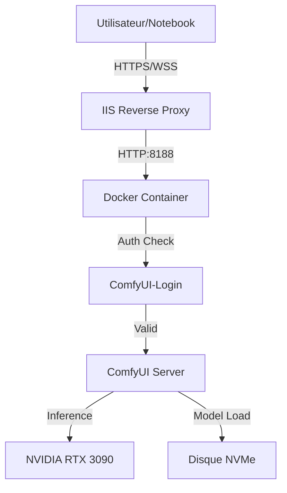

# 🎨 Architecture Écosystème GenAI Images CoursIA

**Date :** 10 Décembre 2025  
**Phase :** 30 - Validation et Sanctuarisation  
**Méthode :** SDDD (Semantic-Documentation-Driven-Design)

---

## 🎯 Vue d'Ensemble Architecture

### Stratégie d'Intégration

L'infrastructure GenAI Images repose sur une approche hybride et modulaire :
1.  **Infrastructure Locale Robuste** : Dockerisation complète des services (ComfyUI, Qwen, Forge).
2.  **Authentification Unifiée** : Sécurisation via ComfyUI-Login et gestion centralisée des tokens.
3.  **Orchestration MCP** : Pilotage via Jupyter et Papermill pour l'automatisation pédagogique.

---

## 🏗️ Architecture Modulaire Complète

### 1. Structure Organisationnelle

```
MyIA.AI.Notebooks/GenAI/
├── 00-GenAI-Environment/           # Infrastructure & Setup
│   ├── 00-1-Environment-Setup.ipynb
│   ├── 00-2-Docker-Services-Management.ipynb
│   ├── 00-3-API-Endpoints-Configuration.ipynb
│   ├── 00-4-Environment-Validation.ipynb
│   └── 00-5-ComfyUI-Local-Test.ipynb
├── 01-Images-Foundation/           # Modèles de base
│   ├── 01-1-OpenAI-DALL-E-3.ipynb
│   ├── 01-2-GPT-5-Image-Generation.ipynb
│   ├── 01-3-Basic-Image-Operations.ipynb
│   ├── 01-4-Forge-SD-XL-Turbo.ipynb
│   └── 01-5-Qwen-Image-Edit.ipynb
├── 02-Images-Advanced/             # Techniques avancées
│   ├── 02-1-Qwen-Image-Edit-2509.ipynb
│   ├── 02-2-FLUX-1-Advanced-Generation.ipynb
│   └── 02-3-Stable-Diffusion-3-5.ipynb
├── 03-Images-Orchestration/        # Multi-modèles
│   ├── 03-1-Multi-Model-Comparison.ipynb
│   ├── 03-2-Workflow-Orchestration.ipynb
│   └── 03-3-Performance-Optimization.ipynb
├── 04-Images-Applications/         # Cas d'usage
│   ├── 04-1-Educational-Content-Generation.ipynb
│   ├── 04-2-Creative-Workflows.ipynb
│   └── 04-3-Production-Integration.ipynb
└── docker-configurations/          # Infrastructure conteneurs
    ├── services/
    │   ├── comfyui-qwen/           # Service Principal
    │   ├── forge-turbo/            # Service Rapide (Chantier)
    │   └── orchestrator/           # Orchestrateur (Futur)
```

### 2. Architecture Technique

#### 2.1. Flux de Données


#### 2.2. Sécurité et Authentification
- **Source de Vérité** : `.secrets/comfyui_auth_tokens.conf`
- **Mécanisme** : Bearer Token (Raw) -> Hash (Bcrypt)
- **Propagation** : Script `manage-genai.ps1 -Action Sync`
- **Isolation** : Conteneurs Docker avec réseau interne

---

## Infrastructure Production (Consolide Phase 42)

### Inventaire des Conteneurs

| Service | Conteneur | Moteurs IA | Port | GPU ID | Authentification |
|---------|-----------|------------|------|--------|------------------|
| **ComfyUI Qwen** | `comfyui-qwen` | Qwen2-VL (Edit), Z-Image Turbo (Lumina-Next) | 8188 | 0 (RTX 3090) | Hybride: Web (User/Pass) + API (Bearer Token) |
| **Forge Turbo** | `forge-turbo` | SDXL Turbo | 17861 | 1 (RTX 3090) | Basic: Gradio Auth |

### Custom Nodes Critiques (ComfyUI-Qwen)

- `ComfyUI-Login` : Securisation acces
- `ComfyUI-Lumina-Next-SFT-DiffusersWrapper` : Moteur Z-Image Turbo
- `ComfyUI_QwenImageWanBridge` : Wrapper Qwen

### Correction Importante

Le modele installe est **Qwen2-VL** (Vision-Language), pas "Qwen3". Implementation native via `comfy_extras/nodes_qwen.py` (Node `TextEncodeQwenImageEdit`).

---

## Specifications Docker Detaillees

### 1. ComfyUI-Qwen Container (Production)

```yaml
# docker-configurations/services/comfyui-qwen/docker-compose.yml
services:
  comfyui-qwen:
    image: pytorch/pytorch:2.4.0-cuda12.4-cudnn9-runtime
    ports:
      - "8188:8188"
    volumes:
      - ./workspace:/workspace
      - ./.secrets:/workspace/ComfyUI/login/secrets:ro
    environment:
      - NVIDIA_VISIBLE_DEVICES=all
      - CLI_ARGS=--listen 0.0.0.0 --port 8188
    deploy:
      resources:
        reservations:
          devices:
            - driver: nvidia
              count: all
              capabilities: [gpu]
```

### 2. Forge-Turbo Container (Expérimental)

```yaml
# docker-configurations/services/forge-turbo/docker-compose.yml
services:
  forge-turbo:
    image: pytorch/pytorch:2.1.2-cuda12.1-cudnn8-runtime
    ports:
      - "7860:7860"
    environment:
      - NVIDIA_VISIBLE_DEVICES=all
```

---

## 🔧 Outils de Gestion

### Script Unifié `manage-genai.ps1`

Ce script PowerShell centralise toutes les opérations de maintenance :

| Action | Description | Script Core (Python) |
|--------|-------------|----------------------|
| `Deploy` | Déploiement infrastructure | `deploy_comfyui_auth.py` |
| `Diagnose` | Diagnostic complet | `diagnose_comfyui_auth.py` |
| `Validate` | Validation fonctionnelle | `validate_comfyui_auth.py` |
| `Sync` | Synchronisation tokens | `sync_comfyui_credentials.py` |
| `Cleanup` | Nettoyage ressources | `cleanup_comfyui_auth.py` |

---

## 📚 Références

### Documents Clés
- [Guide de Déploiement](deployment-guide.md)
- [Guide Utilisateur](user-guide.md)
- [Synthèse Phase 30](../suivis/genai-image/SYNTHESE_FINALE_PHASE_30_EXHAUSTIVITE.md)

### Historique
- **Phase 1-8** : Initialisation Docker
- **Phase 11** : Déploiement Standalone
- **Phase 12A** : Production IIS/SSL
- **Phase 30** : Sanctuarisation Docker & Validation

---

*Architecture validée et maintenue par l'équipe CoursIA GenAI.*
