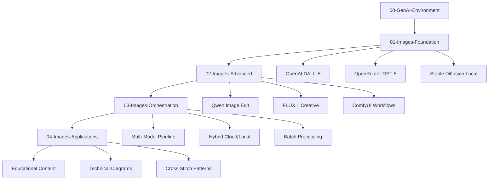

# 🎨 Architecture Écosystème GenAI Images CoursIA

**Date :** 7 octobre 2025  
**Méthode :** SDDD (Semantic-Documentation-Driven-Design) avec Double Grounding  
**Mission :** Phase 1.2 - Architecture Technique Complète

---

## 🎯 Vue d'Ensemble Architecture

### Stratégie d'Intégration SDDD

**PRÉSERVATION TOTALE :** L'infrastructure MCP existante est **exceptionnellement mature** avec :
- ExecutionManager asynchrone (timeouts illimités 600s+)
- Architecture subprocess isolation production-ready
- Papermill-CoursIA avec patterns industriels validés
- 22+ outils MCP opérationnels

**EXTENSION CONTRÔLÉE :** Nouveaux modules GenAI s'intègrent dans cette architecture éprouvée.

---

## 🏗️ Architecture Modulaire Complète

### 1. Structure Organisationnelle

```
MyIA.AI.Notebooks/GenAI/
├── 00-GenAI-Environment/           # Infrastructure & Setup
│   ├── GenAI-Environment-Setup.ipynb
│   ├── GenAI-Docker-Validation.ipynb
│   └── GenAI-Endpoints-Test.ipynb
├── 01-Images-Foundation/           # Modèles de base
│   ├── OpenAI-DALLE-Intro.ipynb
│   ├── OpenRouter-GPT5-Vision.ipynb
│   └── Stable-Diffusion-3.5-Local.ipynb
├── 02-Images-Advanced/             # Techniques avancées
│   ├── Qwen-Image-Edit-2509.ipynb
│   ├── FLUX-1-Creative-Workflows.ipynb
│   └── ComfyUI-Integration.ipynb
├── 03-Images-Orchestration/        # Multi-modèles
│   ├── Multi-Model-Pipeline.ipynb
│   ├── Hybrid-Cloud-Local.ipynb
│   └── Batch-Generation-Manager.ipynb
├── 04-Images-Applications/         # Cas d'usage
│   ├── Educational-Content-Generator.ipynb
│   ├── Technical-Diagrams-AI.ipynb
│   └── img2img_cross_stitch_pattern_maker.ipynb  # PRÉSERVÉ
├── docker-configurations/          # Infrastructure conteneurs
│   ├── flux-1-dev/
│   ├── stable-diffusion-3.5/
│   ├── comfyui-workflows/
│   └── shared-configs/
└── templates-automation/           # Templates et scripts
    ├── notebook-generators/
    ├── endpoint-configurations/
    └── validation-scripts/
```

### 2. Architecture des Interfaces

#### 2.1. Interface MCP Unifiée
```python
class GenAIImageManager:
    """
    Gestionnaire unifié pour tous les endpoints GenAI Images
    Intégré dans l'ExecutionManager MCP existant
    """
    def __init__(self):
        self.openrouter_client = OpenRouterClient()  # GPT-5, Qwen
        self.docker_orchestrator = DockerOrchestrator()  # FLUX, SD3.5
        self.hybrid_scheduler = HybridScheduler()
        
    async def generate_image(self, prompt, model="auto", **kwargs):
        """Génération d'image avec sélection automatique du modèle optimal"""
        
    async def edit_image(self, image_path, instructions, model="qwen-edit"):
        """Édition d'image avec Qwen-Image-Edit-2509"""
        
    async def create_workflow(self, steps, orchestration="parallel"):
        """Orchestration de workflows multi-modèles"""
```

#### 2.2. Interface Docker Standardisée
```python
class DockerModelWrapper:
    """
    Wrapper standardisé pour tous les modèles Docker
    Compatible avec l'architecture subprocess MCP existante
    """
    def __init__(self, model_name, container_config):
        self.container = DockerContainer(model_name, container_config)
        self.health_checker = HealthChecker()
        self.resource_monitor = ResourceMonitor()
        
    async def start_model(self):
        """Démarrage avec health checks et monitoring"""
        
    async def generate(self, request):
        """Interface unifiée pour tous les modèles"""
        
    async def stop_model(self):
        """Arrêt propre avec cleanup ressources"""
```

---

## 🐳 Spécifications Docker Détaillées

### 1. FLUX.1-dev Container

```yaml
# docker-configurations/flux-1-dev/docker-compose.yml
version: '3.8'
services:
  flux-1-dev:
    image: "ghcr.io/comfyanonymous/comfyui:latest-cu124"
    ports:
      - "8189:8188"
    volumes:
      - "./models:/app/models"
      - "./custom_nodes:/app/custom_nodes"  
      - "./workflows:/app/workflows"
    environment:
      - CUDA_VISIBLE_DEVICES=0
      - PYTHONPATH=/app
    deploy:
      resources:
        reservations:
          devices:
            - driver: nvidia
              count: 1
              capabilities: [gpu]
        limits:
          memory: 12G
```

#### Configuration Modèle FLUX
```python
# docker-configurations/flux-1-dev/model-config.py
FLUX_CONFIG = {
    "model_path": "/app/models/flux1-dev.safetensors",
    "vae_path": "/app/models/ae.safetensors", 
    "clip_path": "/app/models/clip_l.safetensors",
    "scheduler": "euler",
    "steps": 20,
    "cfg_scale": 7.5,
    "resolution": {
        "default": "1024x1024",
        "supported": ["512x512", "1024x1024", "1536x1536"]
    }
}
```

### 2. Stable Diffusion 3.5 Container

```yaml
# docker-configurations/stable-diffusion-3.5/docker-compose.yml
version: '3.8'
services:
  sd35-large:
    image: "huggingface/diffusers:latest"
    ports:
      - "8190:8000"
    volumes:
      - "./models:/models"
      - "./cache:/cache"
    environment:
      - MODEL_NAME=stabilityai/stable-diffusion-3.5-large
      - CACHE_DIR=/cache
      - TORCH_COMPILE=1
    deploy:
      resources:
        limits:
          memory: 24G
        reservations:
          devices:
            - driver: nvidia
              count: 1
              capabilities: [gpu]
```

### 3. ComfyUI Workflows Container

```yaml
# docker-configurations/comfyui-workflows/docker-compose.yml
version: '3.8'
services:
  comfyui-workflows:
    image: "comfyanonymous/comfyui:latest"
    ports:
      - "8191:8188"
    volumes:
      - "./custom_workflows:/app/web/workflows"
      - "./models:/app/models"
      - "./outputs:/app/output"
    environment:
      - COMFYUI_ARGS=--enable-cors-header
      - WORKFLOW_AUTO_SAVE=true
```

---

## ⚡ Architecture Hybride Cloud/Local

### 1. Stratégie de Routage Intelligent

```python
class HybridScheduler:
    """
    Routeur intelligent cloud/local basé sur :
    - Disponibilité des ressources locales
    - Complexité de la requête  
    - Latence requise
    - Coût optimal
    """
    
    ROUTING_RULES = {
        "simple_generation": {
            "preferred": "openrouter",  # GPT-5 via OpenRouter
            "fallback": "flux_local",
            "timeout": 30
        },
        "complex_editing": {
            "preferred": "qwen_openrouter",  # Qwen-Image-Edit-2509
            "fallback": "sd35_local",
            "timeout": 120
        },
        "batch_processing": {
            "preferred": "local_docker",  # Containers locaux
            "fallback": "none",
            "timeout": 3600
        },
        "creative_workflows": {
            "preferred": "comfyui_local",
            "fallback": "flux_local", 
            "timeout": 600
        }
    }
```

### 2. Configuration OpenRouter

```python
# Configuration endpoints OpenRouter prioritaires
OPENROUTER_MODELS = {
    "gpt-5": {
        "endpoint": "openai/gpt-5",
        "capabilities": ["vision", "generation", "analysis"],
        "cost_per_1k": 0.02,
        "max_tokens": 4096
    },
    "qwen-image-edit": {
        "endpoint": "qwen/qwen-image-edit-2509", 
        "capabilities": ["image_editing", "inpainting", "style_transfer"],
        "cost_per_image": 0.01,
        "supported_formats": ["png", "jpg", "webp"]
    }
}
```

---

## 🔧 Architecture de Configuration

### 1. Configuration .env Modulaire

```bash
# .env.genai-images (nouveau fichier)

# === OpenRouter Configuration ===
OPENROUTER_API_KEY=sk-or-...
OPENROUTER_BASE_URL=https://openrouter.ai/api/v1
OPENROUTER_DEFAULT_MODEL=openai/gpt-5

# === Docker Models Configuration === 
DOCKER_FLUX_ENDPOINT=http://localhost:8189
DOCKER_SD35_ENDPOINT=http://localhost:8190  
DOCKER_COMFYUI_ENDPOINT=http://localhost:8191

# === Hybrid Scheduler Settings ===
GENAI_PREFERRED_STRATEGY=hybrid
GENAI_LOCAL_PRIORITY=true
GENAI_MAX_CONCURRENT_DOCKER=3
GENAI_TIMEOUT_DEFAULT=300

# === Resource Limits ===
GENAI_MEMORY_LIMIT_GB=16
GENAI_GPU_MEMORY_LIMIT_GB=12
GENAI_MAX_BATCH_SIZE=4

# === Monitoring & Logging ===
GENAI_ENABLE_METRICS=true
GENAI_LOG_LEVEL=INFO
GENAI_METRICS_ENDPOINT=http://localhost:8192
```

### 2. Templates de Configuration Automatisés

```python
# templates-automation/config-generator.py
class ConfigGenerator:
    """
    Génération automatique de configurations selon l'environnement
    """
    
    def generate_environment_config(self, env_type="development"):
        """
        env_type: development, staging, production, educational
        """
        configs = {
            "development": {
                "docker_memory_limit": "8G",
                "concurrent_models": 2,
                "enable_all_models": True
            },
            "educational": {
                "docker_memory_limit": "4G", 
                "concurrent_models": 1,
                "priority_models": ["gpt-5", "flux-local"]
            },
            "production": {
                "docker_memory_limit": "24G",
                "concurrent_models": 4,
                "enable_monitoring": True,
                "backup_endpoints": True
            }
        }
```

---

## 🔗 Intégration avec Infrastructure MCP Existante

### 1. Extension des Outils MCP

```python
# Nouveaux outils MCP à ajouter au serveur jupyter-papermill-mcp-server
MCP_GENAI_TOOLS = [
    "generate_image",           # Génération d'image avec sélection automatique
    "edit_image",              # Édition avec Qwen-Image-Edit-2509
    "start_docker_model",      # Démarrage containers Docker
    "stop_docker_model",       # Arrêt containers Docker  
    "list_available_models",   # Liste des modèles disponibles
    "get_model_status",        # Statut modèles (cloud + local)
    "create_image_workflow",   # Création workflows multi-étapes
    "execute_batch_generation",# Génération en lot
    "validate_genai_setup",    # Validation configuration complète
    "monitor_resource_usage"   # Monitoring ressources temps réel
]
```

### 2. Compatibilité ExecutionManager

```python
# Extension de l'ExecutionManager async existant
class GenAIExecutionManager(ExecutionManager):
    """
    Extension de l'ExecutionManager MCP pour GenAI Images
    Préserve toute l'architecture async/subprocess existante
    """
    
    def __init__(self):
        super().__init__()
        self.genai_manager = GenAIImageManager()
        self.docker_orchestrator = DockerOrchestrator()
        
    async def execute_genai_notebook(self, notebook_path, genai_config):
        """
        Exécution notebook GenAI avec gestion des containers Docker
        Compatible avec l'architecture subprocess existante
        """
        # 1. Démarrage containers nécessaires
        await self.docker_orchestrator.ensure_models_running(genai_config.required_models)
        
        # 2. Injection variables d'environnement GenAI
        env_vars = self.genai_manager.get_environment_variables()
        
        # 3. Exécution via ExecutionManager existant (subprocess)
        return await self.start_notebook_async(
            notebook_path,
            env_overrides=env_vars,
            timeout_seconds=genai_config.timeout or 600
        )
```

---

## 🎓 Architecture Pédagogique

### 1. Progression d'Apprentissage



### 2. Templates Notebook Standardisés

```python
# templates-automation/notebook-generators/base-template.py
NOTEBOOK_TEMPLATE = {
    "metadata": {
        "kernelspec": {
            "display_name": "Python (CoursIA-GenAI)",
            "language": "python", 
            "name": "coursia-genai"
        }
    },
    "cells": [
        {
            "cell_type": "markdown",
            "source": ["# {notebook_title}\n\n**Module:** {module_name}\n**Niveau:** {difficulty_level}"]
        },
        {
            "cell_type": "code", 
            "metadata": {"tags": ["parameters"]},
            "source": ["# Parameters for Papermill\ntopic = 'Default topic'\nskip_widgets = False"]
        },
        {
            "cell_type": "code",
            "source": ["# Environment Setup\n%load_ext autoreload\n%autoreload 2\n\nfrom coursia_genai import GenAIImageManager"]
        }
    ]
}
```

---

## 🚀 Plan d'Implémentation

### Phase 1 : Infrastructure (Semaines 1-2)
1. ✅ **Architecture documentée** (ce document)
2. **Containers Docker** : FLUX, SD3.5, ComfyUI
3. **Configuration .env** : Variables d'environnement GenAI
4. **Extension MCP** : 10 nouveaux outils

### Phase 2 : Modèles Fondamentaux (Semaines 3-4) 
1. **OpenRouter Integration** : GPT-5, Qwen-Image-Edit-2509
2. **Notebooks Foundation** : 3 notebooks de base
3. **Templates Automatisés** : Génération structure
4. **Validation Setup** : Tests d'environnement

### Phase 3 : Orchestration Avancée (Semaines 5-6)
1. **Hybrid Scheduler** : Routage intelligent cloud/local
2. **Multi-Model Workflows** : Pipelines complexes
3. **Batch Processing** : Génération en lot
4. **Monitoring** : Métriques temps réel

### Phase 4 : Applications Pédagogiques (Semaines 7-8)
1. **Educational Content Generator** : Contenu automatisé
2. **Technical Diagrams AI** : Diagrammes techniques
3. **Migration Pattern** : `img2img_cross_stitch_pattern_maker.ipynb`
4. **Documentation Complète** : Guides utilisateur

---

## 🎯 Avantages Architecturaux

### 1. Compatibilité Totale
- ✅ **Infrastructure MCP préservée** : ExecutionManager, subprocess, timeout illimité
- ✅ **Patterns existants** : Papermill, variables .env, structure modulaire
- ✅ **Notebooks existants** : `img2img_cross_stitch_pattern_maker.ipynb` intégré

### 2. Scalabilité Professionnelle
- ✅ **Hybrid Cloud/Local** : Optimal coût/performance
- ✅ **Docker Orchestration** : Gestion ressources automatisée
- ✅ **Monitoring Intégré** : Observabilité complète

### 3. Excellence Pédagogique
- ✅ **Progression structurée** : 4 niveaux de complexité
- ✅ **Templates automatisés** : Génération notebooks facile
- ✅ **Documentation exhaustive** : Guides step-by-step

---

## 📚 Références SDDD

### Documents Analysés
- `27-RESOLUTION-FINALE-NOTEBOOK-MAKER-SUJET-COMPLEXE.md` : Architecture MCP async
- `29-ARCHITECTURE-ASYNC-EXECUTIONMANAGER-RESOLUTION-TIMEOUTS.md` : ExecutionManager
- `26-RESOLUTION-DEFINITIVE-MCP-NUGET-SOLUTION-RETROUVEE.md` : Subprocess isolation
- `README_MCP_MAINTENANCE.md` : Infrastructure maintenance
- `img2img_cross_stitch_pattern_maker.ipynb` : GenAI existant

### Contraintes Respectées
- **PRÉSERVATION** : Infrastructure MCP (22 outils, ExecutionManager async)
- **EXTENSION** : Architecture widgets/batch, subprocess isolation  
- **INTÉGRATION** : Patterns CoursIA (nommage, structure, documentation)

---

*Architecture conçue avec SDDD Triple Grounding - Prête pour implémentation Phase 2*