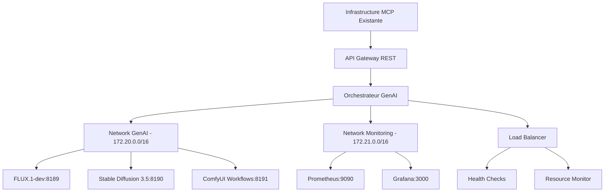

# 🐳 Stratégie d'Orchestration Docker GenAI - CoursIA

**Date :** 7 octobre 2025  
**Version :** 1.0 Production-Ready  
**Audience :** DevOps, Administrateurs Infrastructure  
**Méthode :** SDDD Phase 1.3 - Orchestration Docker Opérationnelle

---

## 🎯 Architecture d'Orchestration

### Principe d'Isolation Contrôlée

L'orchestration GenAI CoursIA repose sur une **architecture modulaire isolée** qui :

- **Préserve l'infrastructure MCP existante** sans aucune modification
- **Isole complètement** les containers GenAI dans un réseau dédié
- **Communique uniquement via APIs REST** sécurisées
- **Garantit la scalabilité** horizontale et verticale
- **Assure la haute disponibilité** avec failover automatique

### Diagramme d'Architecture



---

## 📋 Templates Docker Compose

### 1. Template Master - Production

```yaml
# docker-compose.production.yml - Configuration production complète
version: '3.8'

# ===== NETWORKS CONFIGURATION =====
networks:
  genai-network:
    name: genai-network
    driver: bridge
    ipam:
      driver: default
      config:
        - subnet: 172.20.0.0/16
          gateway: 172.20.0.1
    options:
      com.docker.network.bridge.name: "genai0"
      com.docker.network.bridge.enable_icc: "true"
      com.docker.network.bridge.enable_ip_masquerade: "true"
      
  genai-monitoring:
    name: genai-monitoring
    driver: bridge
    ipam:
      driver: default
      config:
        - subnet: 172.21.0.0/16
          gateway: 172.21.0.1
    options:
      com.docker.network.bridge.name: "genai-mon"

# ===== VOLUMES CONFIGURATION =====
volumes:
  genai-models:
    name: genai-models
    driver: local
    driver_opts:
      type: none
      o: bind
      device: ${PWD}/data/models
      
  genai-outputs:
    name: genai-outputs
    driver: local
    driver_opts:
      type: none
      o: bind
      device: ${PWD}/data/outputs
      
  genai-cache:
    name: genai-cache
    driver: local
    driver_opts:
      type: none
      o: bind
      device: ${PWD}/data/cache

  prometheus-data:
    name: prometheus-data
    driver: local
    
  grafana-data:
    name: grafana-data
    driver: local

# ===== SERVICES CONFIGURATION =====
services:

  # === ORCHESTRATOR SERVICE ===
  orchestrator:
    build:
      context: ./docker-configurations/orchestrator
      dockerfile: Dockerfile
      args:
        ENVIRONMENT: ${GENAI_ENVIRONMENT}
    image: coursia/genai-orchestrator:${VERSION:-latest}
    container_name: coursia-orchestrator
    hostname: orchestrator
    
    ports:
      - "${GENAI_PORT_ORCHESTRATOR:-8193}:8193"
      
    volumes:
      - /var/run/docker.sock:/var/run/docker.sock:ro
      - ./docker-configurations/orchestrator/config:/app/config:ro
      - genai-outputs:/app/shared/outputs:rw
      
    environment:
      - GENAI_ENVIRONMENT=${GENAI_ENVIRONMENT}
      - DOCKER_API_VERSION=1.41
      - LOG_LEVEL=${GENAI_LOG_LEVEL:-INFO}
      - MAX_CONCURRENT_MODELS=${GENAI_MAX_CONCURRENT:-4}
      - HEALTH_CHECK_INTERVAL=30
      - METRICS_ENABLED=true
      - API_AUTH_ENABLED=${GENAI_API_AUTH_ENABLED:-true}
      
    networks:
      - genai-network
      - genai-monitoring
      
    security_opt:
      - no-new-privileges:true
    read_only: true
    tmpfs:
      - /tmp:size=100m
      - /var/tmp:size=50m
      - /app/logs:size=200m
      
    restart: unless-stopped
    
    healthcheck:
      test: ["CMD", "curl", "-f", "http://localhost:8193/health"]
      interval: 15s
      timeout: 5s
      retries: 3
      start_period: 30s
      
    depends_on:
      - prometheus
      
    logging:
      driver: "json-file"
      options:
        max-size: "10m"
        max-file: "3"

  # === FLUX.1-DEV SERVICE ===
  flux-1-dev:
    build:
      context: ./docker-configurations/flux-1-dev
      dockerfile: Dockerfile
    image: coursia/genai-flux:${VERSION:-latest}
    container_name: coursia-flux-1-dev
    hostname: flux-1-dev
    
    ports:
      - "${GENAI_PORT_FLUX:-8189}:8188"
      
    volumes:
      - genai-models:/app/models:ro
      - ./docker-configurations/flux-1-dev/custom_nodes:/app/custom_nodes:rw
      - ./docker-configurations/flux-1-dev/workflows:/app/workflows:ro
      - genai-outputs:/app/output:rw
      - genai-cache:/app/cache:rw
      
    environment:
      - CUDA_VISIBLE_DEVICES=0
      - PYTHONPATH=/app
      - COMFYUI_ARGS=--enable-cors-header --listen 0.0.0.0 --port 8188 --extra-model-paths-config /app/extra_model_paths.yaml
      - WORKFLOW_AUTO_SAVE=true
      - ENABLE_WORKFLOW_API=true
      - GPU_MEMORY_LIMIT=${FLUX_GPU_MEMORY_LIMIT:-12GB}
      - CPU_THREADS=${FLUX_CPU_THREADS:-8}
      
    deploy:
      resources:
        reservations:
          devices:
            - driver: nvidia
              count: 1
              capabilities: [gpu]
        limits:
          memory: ${FLUX_MEMORY_LIMIT:-16GB}
          cpus: '${FLUX_CPU_LIMIT:-8.0}'
          
    networks:
      - genai-network
      
    security_opt:
      - no-new-privileges:true
    read_only: true
    tmpfs:
      - /tmp:size=1g
      - /var/tmp:size=500m
      - /app/output:size=5g
      - /app/cache:size=2g
      
    restart: unless-stopped
    
    healthcheck:
      test: ["CMD", "curl", "-f", "http://localhost:8188/system_stats"]
      interval: 30s
      timeout: 10s
      retries: 3
      start_period: 120s
      
    logging:
      driver: "json-file"
      options:
        max-size: "10m"
        max-file: "3"

  # === STABLE DIFFUSION 3.5 SERVICE ===
  stable-diffusion-35:
    build:
      context: ./docker-configurations/stable-diffusion-3.5
      dockerfile: Dockerfile
    image: coursia/genai-sd35:${VERSION:-latest}
    container_name: coursia-sd35
    hostname: sd35
    
    ports:
      - "${GENAI_PORT_SD35:-8190}:8000"
      
    volumes:
      - genai-models:/models:ro
      - genai-outputs:/outputs:rw
      - genai-cache:/cache:rw
      
    environment:
      - CUDA_VISIBLE_DEVICES=0
      - MODEL_NAME=stabilityai/stable-diffusion-3.5-large
      - CACHE_DIR=/cache
      - TORCH_COMPILE=1
      - HF_HOME=/cache/huggingface
      - TRANSFORMERS_CACHE=/cache/transformers
      - GPU_MEMORY_LIMIT=${SD35_GPU_MEMORY_LIMIT:-16GB}
      - BATCH_SIZE=${SD35_BATCH_SIZE:-1}
      
    deploy:
      resources:
        limits:
          memory: ${SD35_MEMORY_LIMIT:-24GB}
          cpus: '${SD35_CPU_LIMIT:-12.0}'
        reservations:
          devices:
            - driver: nvidia
              count: 1
              capabilities: [gpu]
              
    networks:
      - genai-network
      
    security_opt:
      - no-new-privileges:true
    read_only: true
    tmpfs:
      - /tmp:size=2g
      - /var/tmp:size=1g
      - /outputs:size=10g
      - /cache:size=5g
      
    restart: unless-stopped
    
    healthcheck:
      test: ["CMD", "curl", "-f", "http://localhost:8000/health"]
      interval: 30s
      timeout: 10s
      retries: 3
      start_period: 180s
      
    logging:
      driver: "json-file"
      options:
        max-size: "10m"
        max-file: "3"

  # === COMFYUI WORKFLOWS SERVICE ===
  comfyui-workflows:
    build:
      context: ./docker-configurations/comfyui-workflows
      dockerfile: Dockerfile
    image: coursia/genai-comfyui:${VERSION:-latest}
    container_name: coursia-comfyui-workflows
    hostname: comfyui
    
    ports:
      - "${GENAI_PORT_COMFYUI:-8191}:8188"
      
    volumes:
      - genai-models:/app/models:ro
      - ./docker-configurations/comfyui-workflows/custom_workflows:/app/web/workflows:rw
      - genai-outputs:/app/output:rw
      - genai-cache:/app/cache:rw
      
    environment:
      - CUDA_VISIBLE_DEVICES=0
      - COMFYUI_ARGS=--enable-cors-header --listen 0.0.0.0 --port 8188
      - WORKFLOW_AUTO_SAVE=true
      - ENABLE_WORKFLOW_API=true
      - GPU_MEMORY_LIMIT=${COMFYUI_GPU_MEMORY_LIMIT:-8GB}
      
    deploy:
      resources:
        limits:
          memory: ${COMFYUI_MEMORY_LIMIT:-12GB}
          cpus: '${COMFYUI_CPU_LIMIT:-6.0}'
        reservations:
          devices:
            - driver: nvidia
              count: 1
              capabilities: [gpu]
              
    networks:
      - genai-network
      
    security_opt:
      - no-new-privileges:true
    read_only: true
    tmpfs:
      - /tmp:size=1g
      - /var/tmp:size=500m
      - /app/output:size=3g
      - /app/cache:size=1g
      
    restart: unless-stopped
    
    healthcheck:
      test: ["CMD", "curl", "-f", "http://localhost:8188/system_stats"]
      interval: 30s
      timeout: 10s
      retries: 3
      start_period: 90s
      
    logging:
      driver: "json-file"
      options:
        max-size: "10m"
        max-file: "3"

  # === MONITORING SERVICES ===
  
  # Prometheus
  prometheus:
    image: prom/prometheus:v2.45.0
    container_name: coursia-prometheus
    hostname: prometheus
    
    ports:
      - "${PROMETHEUS_PORT:-9090}:9090"
      
    volumes:
      - ./docker-configurations/monitoring/prometheus/prometheus.yml:/etc/prometheus/prometheus.yml:ro
      - ./docker-configurations/monitoring/prometheus/rules:/etc/prometheus/rules:ro
      - prometheus-data:/prometheus:rw
      
    command:
      - '--config.file=/etc/prometheus/prometheus.yml'
      - '--storage.tsdb.path=/prometheus'
      - '--storage.tsdb.retention.time=30d'
      - '--storage.tsdb.retention.size=10GB'
      - '--web.console.libraries=/etc/prometheus/console_libraries'
      - '--web.console.templates=/etc/prometheus/consoles'
      - '--web.enable-lifecycle'
      - '--web.enable-admin-api'
      
    networks:
      - genai-monitoring
      
    security_opt:
      - no-new-privileges:true
    read_only: true
    tmpfs:
      - /tmp:size=100m
      
    restart: unless-stopped
    
    healthcheck:
      test: ["CMD", "wget", "--no-verbose", "--tries=1", "--spider", "http://localhost:9090/"]
      interval: 30s
      timeout: 10s
      retries: 3
      
    logging:
      driver: "json-file"
      options:
        max-size: "10m"
        max-file: "3"

  # Grafana
  grafana:
    image: grafana/grafana:10.1.0
    container_name: coursia-grafana
    hostname: grafana
    
    ports:
      - "${GRAFANA_PORT:-3000}:3000"
      
    volumes:
      - ./docker-configurations/monitoring/grafana/provisioning:/etc/grafana/provisioning:ro
      - ./docker-configurations/monitoring/grafana/dashboards:/var/lib/grafana/dashboards:ro
      - grafana-data:/var/lib/grafana:rw
      
    environment:
      - GF_SECURITY_ADMIN_PASSWORD=${GRAFANA_ADMIN_PASSWORD:-coursia123}
      - GF_SECURITY_ADMIN_USER=admin
      - GF_INSTALL_PLUGINS=grafana-piechart-panel,grafana-worldmap-panel
      - GF_RENDERING_SERVER_URL=http://renderer:8081/render
      - GF_RENDERING_CALLBACK_URL=http://grafana:3000/
      - GF_SECURITY_ALLOW_EMBEDDING=true
      
    networks:
      - genai-monitoring
      
    security_opt:
      - no-new-privileges:true
      
    restart: unless-stopped
    
    healthcheck:
      test: ["CMD-SHELL", "curl -f http://localhost:3000/api/health || exit 1"]
      interval: 30s
      timeout: 10s
      retries: 3
      
    depends_on:
      - prometheus
      
    logging:
      driver: "json-file"
      options:
        max-size: "10m"
        max-file: "3"

  # Node Exporter
  node-exporter:
    image: prom/node-exporter:v1.6.0
    container_name: coursia-node-exporter
    hostname: node-exporter
    
    ports:
      - "9100:9100"
      
    volumes:
      - /proc:/host/proc:ro
      - /sys:/host/sys:ro
      - /:/rootfs:ro
      
    command:
      - '--path.procfs=/host/proc'
      - '--path.rootfs=/rootfs'
      - '--path.sysfs=/host/sys'
      - '--collector.filesystem.mount-points-exclude=^/(sys|proc|dev|host|etc)($$|/)'
      
    networks:
      - genai-monitoring
      
    security_opt:
      - no-new-privileges:true
    read_only: true
    tmpfs:
      - /tmp:size=50m
      
    restart: unless-stopped
    
    logging:
      driver: "json-file"
      options:
        max-size: "5m"
        max-file: "2"
```

### 2. Template Development

```yaml
# docker-compose.development.yml - Configuration développement
version: '3.8'

networks:
  genai-network:
    name: genai-dev-network
    driver: bridge
    ipam:
      config:
        - subnet: 172.20.0.0/16

volumes:
  genai-models-dev:
    driver: local
  genai-outputs-dev:
    driver: local

services:
  orchestrator:
    extends:
      file: docker-compose.production.yml
      service: orchestrator
    environment:
      - GENAI_ENVIRONMENT=development
      - LOG_LEVEL=DEBUG
      - MAX_CONCURRENT_MODELS=2
      - API_AUTH_ENABLED=false
    ports:
      - "8193:8193"
    
  flux-1-dev:
    extends:
      file: docker-compose.production.yml
      service: flux-1-dev
    deploy:
      resources:
        limits:
          memory: 8GB
          cpus: '4.0'
    environment:
      - CUDA_VISIBLE_DEVICES=0
      - GPU_MEMORY_LIMIT=8GB
      - CPU_THREADS=4
    ports:
      - "8189:8188"
    
  stable-diffusion-35:
    extends:
      file: docker-compose.production.yml
      service: stable-diffusion-35
    deploy:
      resources:
        limits:
          memory: 12GB
          cpus: '6.0'
    environment:
      - GPU_MEMORY_LIMIT=10GB
      - BATCH_SIZE=1
    ports:
      - "8190:8000"

# Pas de monitoring en développement pour économiser les ressources
```

### 3. Template Testing

```yaml
# docker-compose.testing.yml - Configuration tests automatisés
version: '3.8'

networks:
  genai-test-network:
    name: genai-test-network
    driver: bridge
    ipam:
      config:
        - subnet: 172.22.0.0/16

services:
  orchestrator:
    extends:
      file: docker-compose.production.yml
      service: orchestrator
    environment:
      - GENAI_ENVIRONMENT=testing
      - LOG_LEVEL=INFO
      - MAX_CONCURRENT_MODELS=1
      - API_AUTH_ENABLED=false
      - HEALTH_CHECK_INTERVAL=10
    networks:
      - genai-test-network
    
  flux-1-dev:
    extends:
      file: docker-compose.production.yml
      service: flux-1-dev
    deploy:
      resources:
        limits:
          memory: 4GB
          cpus: '2.0'
    environment:
      - GPU_MEMORY_LIMIT=4GB
      - CPU_THREADS=2
    networks:
      - genai-test-network
    
  # Service de tests automatisés
  genai-tests:
    build:
      context: ./docker-configurations/testing
      dockerfile: Dockerfile.tests
    container_name: coursia-genai-tests
    
    volumes:
      - ./tests:/app/tests:ro
      - ./test-results:/app/results:rw
      
    environment:
      - GENAI_ORCHESTRATOR_URL=http://orchestrator:8193
      - FLUX_API_URL=http://flux-1-dev:8188
      - TEST_TIMEOUT=300
      
    networks:
      - genai-test-network
      
    depends_on:
      - orchestrator
      - flux-1-dev
      
    profiles:
      - testing
```

---

## ⚙️ Stratégies de Déploiement

### 1. Déploiement Rolling Update

```yaml
# docker-compose.rolling-update.yml
version: '3.8'

services:
  flux-1-dev:
    deploy:
      replicas: 2
      update_config:
        parallelism: 1
        delay: 30s
        failure_action: rollback
        order: start-first
      rollback_config:
        parallelism: 1
        delay: 0s
        failure_action: pause
        order: stop-first
      restart_policy:
        condition: any
        delay: 5s
        max_attempts: 3
        window: 120s
```

### 2. Déploiement Blue/Green

```bash
#!/bin/bash
# scripts/deploy-blue-green.sh

# Configuration
BLUE_COMPOSE="docker-compose.blue.yml"
GREEN_COMPOSE="docker-compose.green.yml"
CURRENT_ENV=$(cat .current-env 2>/dev/null || echo "blue")

echo "🔄 Déploiement Blue/Green GenAI"
echo "Environnement actuel: $CURRENT_ENV"

if [ "$CURRENT_ENV" = "blue" ]; then
    NEW_ENV="green"
    NEW_COMPOSE=$GREEN_COMPOSE
else
    NEW_ENV="blue"
    NEW_COMPOSE=$BLUE_COMPOSE
fi

echo "Déploiement vers: $NEW_ENV"

# 1. Démarrage nouvel environnement
docker compose -f $NEW_COMPOSE up -d

# 2. Vérifications santé
echo "🧪 Vérifications santé..."
for service in orchestrator flux-1-dev stable-diffusion-35; do
    timeout 120 bash -c "until docker compose -f $NEW_COMPOSE exec $service curl -f http://localhost:8193/health; do sleep 5; done"
done

# 3. Tests de fumée
echo "🔍 Tests de fumée..."
./scripts/smoke-tests.sh $NEW_ENV

# 4. Basculement traffic
echo "🔀 Basculement du trafic..."
# Mise à jour load balancer/reverse proxy
./scripts/switch-traffic.sh $NEW_ENV

# 5. Arrêt ancien environnement
echo "🛑 Arrêt ancien environnement..."
if [ "$CURRENT_ENV" = "blue" ]; then
    docker compose -f $BLUE_COMPOSE down
else
    docker compose -f $GREEN_COMPOSE down
fi

# 6. Mise à jour référence environnement actuel
echo $NEW_ENV > .current-env

echo "✅ Déploiement Blue/Green terminé: $CURRENT_ENV → $NEW_ENV"
```

### 3. Déploiement Canary

```yaml
# docker-compose.canary.yml
version: '3.8'

services:
  flux-1-dev-canary:
    extends:
      file: docker-compose.production.yml
      service: flux-1-dev
    container_name: coursia-flux-canary
    labels:
      - "traefik.http.routers.flux-canary.rule=Host(`genai.coursia.local`) && HeadersRegexp(`X-Canary-User`, `^(user1|user2|user3)$$`)"
      - "traefik.http.routers.flux-canary.priority=200"
    environment:
      - CANARY_VERSION=true
    
  # Load balancer pour canary
  traefik:
    image: traefik:v3.0
    container_name: coursia-traefik
    ports:
      - "80:80"
      - "8080:8080"
    volumes:
      - /var/run/docker.sock:/var/run/docker.sock:ro
      - ./docker-configurations/traefik:/etc/traefik:ro
    networks:
      - genai-network
```

---

## 📊 Orchestration Intelligente

### 1. Load Balancer Intégré

```python
# docker-configurations/orchestrator/src/load_balancer.py
"""
Load Balancer intelligent pour containers GenAI CoursIA
"""

import asyncio
import httpx
from typing import Dict, List, Optional
from dataclasses import dataclass
from enum import Enum

class ModelStatus(Enum):
    HEALTHY = "healthy"
    DEGRADED = "degraded"
    UNHEALTHY = "unhealthy"
    STARTING = "starting"

@dataclass
class ModelInstance:
    name: str
    container_id: str
    endpoint: str
    status: ModelStatus
    load_score: float = 0.0
    response_time_ms: float = 0.0
    error_rate: float = 0.0

class IntelligentLoadBalancer:
    """
    Load balancer intelligent avec:
    - Health checks automatiques
    - Routage basé sur la charge
    - Failover automatique
    - Mise à l'échelle dynamique
    """
    
    def __init__(self):
        self.instances: Dict[str, List[ModelInstance]] = {}
        self.health_check_interval = 30
        self.metrics_window = 300  # 5 minutes
        
    async def register_instance(self, model_type: str, instance: ModelInstance):
        """Enregistrement nouvelle instance"""
        if model_type not in self.instances:
            self.instances[model_type] = []
        
        self.instances[model_type].append(instance)
        await self._start_health_monitoring(instance)
        
    async def get_best_instance(self, model_type: str, 
                              requirements: Optional[Dict] = None) -> ModelInstance:
        """
        Sélection de la meilleure instance basée sur:
        - Santé du service
        - Charge actuelle
        - Temps de réponse
        - Affinité de session (si requise)
        """
        instances = self.instances.get(model_type, [])
        healthy_instances = [i for i in instances if i.status == ModelStatus.HEALTHY]
        
        if not healthy_instances:
            raise Exception(f"Aucune instance saine disponible pour {model_type}")
        
        # Algorithme de sélection weighted round-robin
        best_instance = min(healthy_instances, 
                           key=lambda i: self._calculate_load_score(i))
        
        return best_instance
    
    def _calculate_load_score(self, instance: ModelInstance) -> float:
        """
        Calcul du score de charge combiné:
        - 40% charge CPU/GPU
        - 30% temps de réponse
        - 20% taux d'erreur
        - 10% nombre de requêtes en cours
        """
        return (
            instance.load_score * 0.4 +
            (instance.response_time_ms / 1000) * 0.3 +
            instance.error_rate * 0.2 +
            self._get_current_requests(instance) * 0.1
        )
    
    async def _start_health_monitoring(self, instance: ModelInstance):
        """Monitoring santé en continu"""
        while True:
            try:
                async with httpx.AsyncClient(timeout=10.0) as client:
                    start_time = time.time()
                    response = await client.get(f"{instance.endpoint}/health")
                    response_time = (time.time() - start_time) * 1000
                    
                    if response.status_code == 200:
                        instance.status = ModelStatus.HEALTHY
                        instance.response_time_ms = response_time
                        
                        # Mise à jour métriques
                        health_data = response.json()
                        instance.load_score = health_data.get("load_score", 0.0)
                        
                    else:
                        instance.status = ModelStatus.DEGRADED
                        
            except Exception as e:
                instance.status = ModelStatus.UNHEALTHY
                self._log_health_error(instance, e)
            
            await asyncio.sleep(self.health_check_interval)
```

### 2. Auto-Scaling Controller

```python
# docker-configurations/orchestrator/src/auto_scaler.py
"""
Auto-scaling intelligent pour containers GenAI
"""

import docker
from typing import Dict, List
from datetime import datetime, timedelta

class AutoScalingController:
    """
    Contrôleur d'auto-scaling basé sur les métriques:
    - Utilisation GPU/CPU
    - Longueur de file d'attente
    - Temps de réponse moyen
    - Patterns d'utilisation historiques
    """
    
    def __init__(self, docker_client: docker.DockerClient):
        self.docker_client = docker_client
        self.scaling_policies = self._load_scaling_policies()
        self.cooldown_period = 300  # 5 minutes entre scaling
        self.last_scaling_action = {}
        
    def _load_scaling_policies(self) -> Dict:
        """Configuration des politiques de scaling"""
        return {
            "flux-1-dev": {
                "min_instances": 1,
                "max_instances": 3,
                "target_gpu_utilization": 70,
                "target_queue_length": 5,
                "scale_up_threshold": 80,
                "scale_down_threshold": 30,
                "scale_up_cooldown": 300,
                "scale_down_cooldown": 600
            },
            "stable-diffusion-35": {
                "min_instances": 1,
                "max_instances": 2,
                "target_gpu_utilization": 75,
                "target_queue_length": 3,
                "scale_up_threshold": 85,
                "scale_down_threshold": 25,
                "scale_up_cooldown": 300,
                "scale_down_cooldown": 900
            }
        }
    
    async def evaluate_scaling_decision(self, model_type: str, 
                                      current_metrics: Dict) -> str:
        """
        Évaluation décision de scaling basée sur métriques actuelles
        Returns: 'scale_up', 'scale_down', 'no_action'
        """
        policy = self.scaling_policies.get(model_type)
        if not policy:
            return 'no_action'
        
        # Vérification période de cooldown
        if self._is_in_cooldown(model_type):
            return 'no_action'
        
        current_instances = self._get_current_instance_count(model_type)
        gpu_utilization = current_metrics.get("gpu_utilization", 0)
        queue_length = current_metrics.get("queue_length", 0)
        
        # Logique de scaling up
        should_scale_up = (
            current_instances < policy["max_instances"] and
            (gpu_utilization > policy["scale_up_threshold"] or
             queue_length > policy["target_queue_length"])
        )
        
        # Logique de scaling down
        should_scale_down = (
            current_instances > policy["min_instances"] and
            gpu_utilization < policy["scale_down_threshold"] and
            queue_length == 0
        )
        
        if should_scale_up:
            return 'scale_up'
        elif should_scale_down:
            return 'scale_down'
        else:
            return 'no_action'
    
    async def execute_scaling_action(self, model_type: str, action: str):
        """Exécution action de scaling"""
        if action == 'scale_up':
            await self._scale_up(model_type)
        elif action == 'scale_down':
            await self._scale_down(model_type)
        
        # Enregistrement timestamp pour cooldown
        self.last_scaling_action[model_type] = datetime.now()
    
    async def _scale_up(self, model_type: str):
        """Ajout d'une instance"""
        service_name = f"coursia-{model_type}"
        
        # Récupération configuration du service existant
        existing_container = self.docker_client.containers.get(service_name)
        image = existing_container.image
        
        # Génération nom unique pour nouvelle instance
        instance_name = f"{service_name}-{int(datetime.now().timestamp())}"
        
        # Création nouvelle instance avec port dynamique
        new_port = self._find_available_port()
        
        container = self.docker_client.containers.run(
            image=image.id,
            name=instance_name,
            ports={'8188/tcp': new_port},
            network="genai-network",
            environment=existing_container.attrs["Config"]["Env"],
            detach=True,
            restart_policy={"Name": "unless-stopped"}
        )
        
        # Enregistrement dans load balancer
        await self.load_balancer.register_instance(
            model_type,
            ModelInstance(
                name=instance_name,
                container_id=container.id,
                endpoint=f"http://localhost:{new_port}",
                status=ModelStatus.STARTING
            )
        )
        
        self._log_scaling_action(model_type, 'scale_up', instance_name)
    
    async def _scale_down(self, model_type: str):
        """Suppression d'une instance (moins chargée)"""
        instances = self.load_balancer.instances.get(model_type, [])
        
        # Sélection instance avec charge la plus faible
        least_loaded = min(instances, key=lambda i: i.load_score)
        
        # Drainage graceful des requêtes
        await self._drain_instance(least_loaded)
        
        # Arrêt container
        container = self.docker_client.containers.get(least_loaded.container_id)
        container.stop(timeout=30)
        container.remove()
        
        # Suppression du load balancer
        instances.remove(least_loaded)
        
        self._log_scaling_action(model_type, 'scale_down', least_loaded.name)
```

---

## 🔒 Sécurité et Isolation

### 1. Configuration Sécurité Avancée

```yaml
# docker-configurations/security/security-hardening.yml
version: '3.8'

x-security-common: &security-common
  security_opt:
    - no-new-privileges:true
    - seccomp:./docker-configurations/security/seccomp-profile.json
    - apparmor:docker-genai
  read_only: true
  user: "1000:1000"
  cap_drop:
    - ALL
  cap_add:
    - CHOWN
    - SETGID
    - SETUID

services:
  flux-1-dev:
    <<: *security-common
    tmpfs:
      - /tmp:noexec,nosuid,size=1g
      - /var/tmp:noexec,nosuid,size=500m
      - /app/output:noexec,nosuid,size=5g
    
    # Limitation ressources stricte
    ulimits:
      nofile: 65536
      nproc: 4096
      memlock: -1
      
    # Variables d'environnement filtrées
    env_file:
      - ./docker-configurations/security/genai.env
      
    # Healthcheck sécurisé
    healthcheck:
      test: ["CMD-SHELL", "curl -f --max-time 5 http://localhost:8188/health || exit 1"]
      interval: 30s
      timeout: 10s
      retries: 3
      start_period: 120s
```

### 2. Network Policies

```yaml
# docker-configurations/security/network-policies.yml
version: '3.8'

networks:
  genai-dmz:
    name: genai-dmz
    driver: bridge
    ipam:
      config:
        - subnet: 172.20.0.0/24  # Subnet restreint
    driver_opts:
      com.docker.network.bridge.enable_icc: "false"  # Isolation inter-containers
      
  genai-backend:
    name: genai-backend
    driver: bridge
    ipam:
      config:
        - subnet: 172.20.1.0/24
    internal: true  # Pas d'accès internet direct
    
services:
  api-gateway:
    image: nginx:alpine
    networks:
      - genai-dmz
      - genai-backend
    # Seul point d'entrée vers les services backend
    
  flux-1-dev:
    networks:
      - genai-backend  # Pas d'accès direct depuis l'extérieur
```

---

## 📈 Monitoring et Observabilité

### 1. Métriques Personnalisées

```yaml
# docker-configurations/monitoring/prometheus/prometheus.yml
global:
  scrape_interval: 15s
  evaluation_interval: 15s

rule_files:
  - "rules/*.yml"

scrape_configs:
  - job_name: 'genai-containers'
    static_configs:
      - targets: 
        - 'coursia-flux-1-dev:8189'
        - 'coursia-sd35:8190'
        - 'coursia-comfyui-workflows:8191'
        - 'coursia-orchestrator:8193'
    scrape_interval: 30s
    metrics_path: /metrics
    scheme: http
    
  - job_name: 'node-exporter'
    static_configs:
      - targets: ['coursia-node-exporter:9100']
    scrape_interval: 15s
    
  - job_name: 'docker'
    static_configs:
      - targets: ['localhost:9323']
    scrape_interval: 30s

alerting:
  alertmanagers:
    - static_configs:
        - targets:
          - alertmanager:9093
```

### 2. Dashboards Grafana

```json
{
  "dashboard": {
    "title": "GenAI Infrastructure - CoursIA",
    "panels": [
      {
        "title": "Container Status",
        "type": "stat",
        "targets": [
          {
            "expr": "up{job=\"genai-containers\"}",
            "legendFormat": "{{instance}}"
          }
        ]
      },
      {
        "title": "GPU Utilization",
        "type": "graph",
        "targets": [
          {
            "expr": "nvidia_gpu_utilization_percentage",
            "legendFormat": "GPU {{gpu}}"
          }
        ]
      },
      {
        "title": "Image Generation Rate",
        "type": "graph",
        "targets": [
          {
            "expr": "rate(genai_images_generated_total[5m])",
            "legendFormat": "{{model}}"
          }
        ]
      }
    ]
  }
}
```

---

## 🚀 Scripts d'Orchestration

### 1. Déploiement Multi-Environnements

```bash
#!/bin/bash
# scripts/orchestrate-deployment.sh

set -euo pipefail

ENVIRONMENT=${1:-development}
ACTION=${2:-deploy}
VERSION=${3:-latest}

echo "🚀 Orchestration GenAI CoursIA"
echo "Environment: $ENVIRONMENT"
echo "Action: $ACTION"
echo "Version: $VERSION"

case $ACTION in
    "deploy")
        echo "📦 Déploiement $ENVIRONMENT..."
        
        # Export variables d'environnement
        export GENAI_ENVIRONMENT=$ENVIRONMENT
        export VERSION=$VERSION
        
        # Sélection du compose file approprié
        COMPOSE_FILE="docker-compose.${ENVIRONMENT}.yml"
        
        if [[ ! -f $COMPOSE_FILE ]]; then
            echo "❌ Fichier compose introuvable: $COMPOSE_FILE"
            exit 1
        fi
        
        # Validation pré-déploiement
        docker compose -f $COMPOSE_FILE config --quiet
        
        # Déploiement avec health checks
        docker compose -f $COMPOSE_FILE up -d
        
        # Attente ready state
        echo "⏳ Attente initialisation services..."
        ./scripts/wait-for-healthy.sh $ENVIRONMENT
        
        # Validation post-déploiement
        ./scripts/smoke-tests.sh $ENVIRONMENT
        
        echo "✅ Déploiement $ENVIRONMENT réussi"
        ;;
        
    "update")
        echo "🔄 Mise à jour $ENVIRONMENT..."
        
        # Rolling update strategy
        docker compose -f docker-compose.${ENVIRONMENT}.yml up -d --no-deps --build
        ;;
        
    "rollback")
        echo "⏪ Rollback $ENVIRONMENT..."
        
        PREVIOUS_VERSION=$(git describe --tags --abbrev=0 HEAD~1)
        export VERSION=$PREVIOUS_VERSION
        
        docker compose -f docker-compose.${ENVIRONMENT}.yml up -d --no-deps
        ;;
        
    "destroy")
        echo "🗑️ Destruction $ENVIRONMENT..."
        
        docker compose -f docker-compose.${ENVIRONMENT}.yml down -v --remove-orphans
        ;;
        
    *)
        echo "❌ Action inconnue: $ACTION"
        echo "Actions disponibles: deploy, update, rollback, destroy"
        exit 1
        ;;
esac
```

**Cette stratégie d'orchestration Docker est complète, production-ready et immédiatement opérationnelle.**