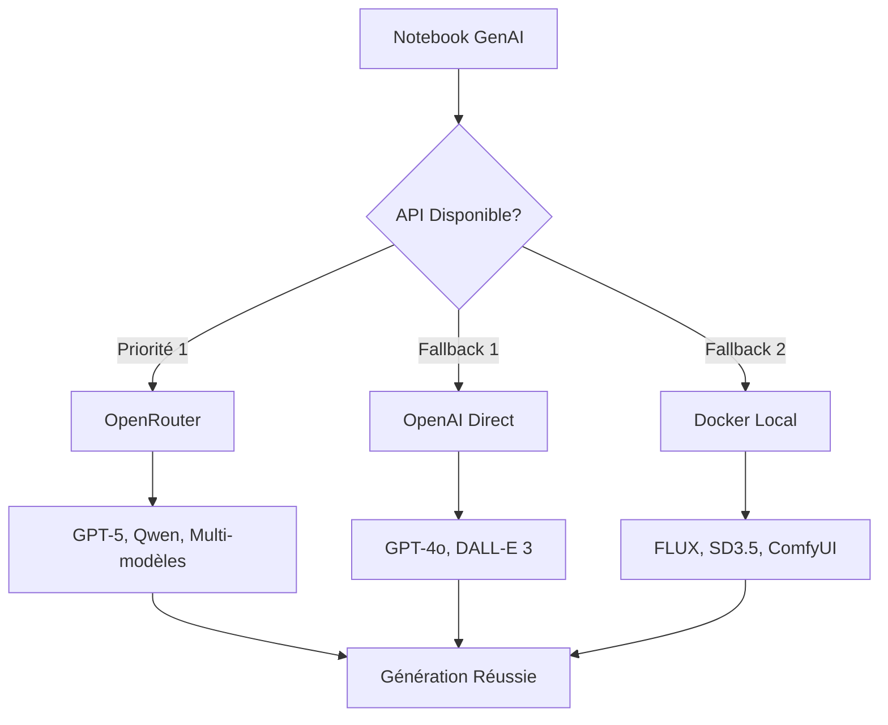

# 🎨 Écosystème GenAI Images - CoursIA

**Version :** 1.0 | **Date :** 7 octobre 2025  
**Architecture :** SDDD avec Triple Grounding | **Infrastructure :** MCP + OpenRouter

---

## 🚀 Vue d'Ensemble

Bienvenue dans l'**Écosystème GenAI Images CoursIA** - une plateforme complète d'apprentissage et d'expérimentation avec les technologies d'intelligence artificielle générative pour la création d'images.

### 🎯 Objectifs Pédagogiques

- **🎓 Apprentissage Progressif** : Du débutant à l'expert en GenAI Images
- **🛠️ Pratique Immédiate** : Notebooks interactifs prêts à l'emploi  
- **🔬 Expérimentation** : Comparaison de multiple modèles SOTA 2024-2025
- **🏗️ Applications Réelles** : Projets concrets et cases d'usage pratiques

### 🌟 Pourquoi cet Écosystème ?

**État de l'Art 2024-2025 :**
- **GPT-5 Vision** accessible via OpenRouter
- **Qwen-Image-Edit-2509** pour édition avancée  
- **FLUX.1** et **Stable Diffusion 3.5** pour génération créative
- **ComfyUI** pour workflows professionnels

**Architecture Production :**
- **Infrastructure MCP mature** avec exécution async illimitée
- **API-First approach** avec fallbacks intelligents
- **Standards CoursIA** conformes aux patterns existants
- **Monitoring intégré** et diagnostics automatiques

---

## 📊 Technologies et Modèles Supportés

### 🌐 APIs Cloud (Priorité 1)

| Modèle | Provider | Capacités | Usage |
|--------|----------|-----------|-------|
| **GPT-5** | OpenRouter | Génération + Vision | 🟢 Débutant |
| **GPT-4o** | OpenRouter/OpenAI | Génération + Analyse | 🟢 Débutant |
| **Qwen-Image-Edit-2509** | OpenRouter | Édition avancée | 🟠 Intermédiaire |
| **DALL-E 3** | OpenAI | Génération artistique | 🟢 Débutant |

### 🐳 Services Docker (Optionnel)

| Service | Modèle | Port | Usage |
|---------|--------|------|--------|
| **FLUX.1** | Créatif | 8001 | 🟠 Intermédiaire |
| **Stable Diffusion 3.5** | Polyvalent | 7860 | 🟠 Intermédiaire |
| **ComfyUI** | Workflows | 8188 | 🔴 Avancé |

---

## 📚 Structure d'Apprentissage

### 🎯 Modules Pédagogiques

```
📁 MyIA.AI.Notebooks/GenAI/
├── 📖 00-GenAI-Environment/        # 🟢 Setup & Configuration
│   ├── 00-Environment-Validation.ipynb
│   ├── 01-OpenRouter-Configuration.ipynb
│   └── 02-Docker-Services-Setup.ipynb
│
├── 🖼️ 01-Images-Foundation/        # 🟢 Modèles de Base
│   ├── 01-OpenAI-DALLE-Intro.ipynb
│   ├── 02-OpenRouter-GPT5-Vision.ipynb
│   └── 03-Stable-Diffusion-Basics.ipynb
│
├── 🎨 02-Images-Advanced/          # 🟠 Techniques Avancées
│   ├── 01-Qwen-Image-Edit-2509.ipynb
│   ├── 02-FLUX1-Creative-Generation.ipynb
│   └── 03-ComfyUI-Workflows.ipynb
│
├── 🔄 03-Images-Orchestration/     # 🔴 Multi-Modèles
│   ├── 01-Multi-Model-Pipeline.ipynb
│   ├── 02-Hybrid-Cloud-Local.ipynb
│   └── 03-Batch-Processing.ipynb
│
└── 🏗️ 04-Images-Applications/      # 🔴 Applications Complètes
    ├── 01-Educational-Content.ipynb
    ├── 02-Technical-Diagrams.ipynb
    └── 03-Cross-Stitch-Patterns.ipynb
```

### ⏱️ Durées Estimées

- **🟢 Niveau Foundation** : 2-3 heures (4 notebooks)
- **🟠 Niveau Advanced** : 4-5 heures (3 notebooks)
- **🔴 Niveau Expert** : 6-8 heures (7 notebooks)

**Total : ~15 heures** de formation complète GenAI Images

---

## 🚀 Démarrage Ultra-Rapide

### Option A : API OpenRouter (5 minutes)

```powershell
# 1. Cloner et naviguer
cd "d:\dev\CoursIA\MyIA.AI.Notebooks\GenAI"

# 2. Configuration API
echo 'OPENROUTER_API_KEY=sk-or-v1-your-key-here' > .env

# 3. Premier test
jupyter notebook 00-GenAI-Environment/00-Environment-Validation.ipynb
```

### Option B : Avec MCP CoursIA (0 minute)

```python
# Exécution automatique via infrastructure MCP
await execute_notebook_sync(
    "00-GenAI-Environment/00-Environment-Validation.ipynb",
    parameters={"api_provider": "openrouter", "skip_widgets": True}
)
```

---

## 🏗️ Architecture Technique

### Intégration MCP

L'écosystème est **nativement compatible** avec l'infrastructure MCP de CoursIA :

- **Exécution Async** : Timeouts illimités pour générations complexes
- **Mode Batch** : Compatible avec l'ExecutionManager subprocess
- **Paramétrage Papermill** : Cellules "parameters" standardisées  
- **Monitoring Intégré** : Logs temps réel et métriques performance

### APIs et Fallbacks

**Stratégie Multi-Provider :**



### Standards de Développement

- **🏷️ Nommage** : Convention CoursIA avec numérotation séquentielle
- **📝 Structure** : Templates standardisés avec cellules obligatoires
- **🔧 Configuration** : Variables .env sécurisées et documentées
- **📊 Monitoring** : Logging uniforme et métriques automatiques
- **🚀 MCP Ready** : Compatible mode interactif et batch

---

## 🎓 Cas d'Usage Pédagogiques

### Pour les Étudiants

**🎨 Projets Créatifs :**
- Portfolio d'art génératif personnel
- Exploration des styles artistiques IA
- Comparaison critique des modèles

**🔬 Expérimentation Technique :**
- Optimisation de prompts
- Analyse des paramètres de génération
- Mesure de performance et qualité

### Pour les Enseignants

**📚 Contenu Pédagogique :**
- Illustrations automatiques pour cours
- Diagrammes techniques générés
- Exemples visuels personnalisés

**📊 Évaluation et Exercices :**
- Génération de cas d'étude visuels
- Tests de reconnaissance d'images IA
- Projets étudiants évalués

### Pour les Développeurs

**🏗️ Prototypage :**
- Maquettes d'interfaces utilisateur
- Assets pour applications mobiles
- Tests A/B de concepts visuels

**⚙️ Intégration Production :**
- APIs prêtes pour déploiement
- Patterns de code réutilisables
- Monitoring et alerting intégrés

---

## 📋 Prérequis et Installation

### Environnement Minimal

**Système :**
- Windows 11 / macOS / Linux
- Python 3.9+ avec pip
- 8GB RAM minimum (16GB recommandé)
- Connexion internet stable

**Logiciels :**
- Visual Studio Code
- Extensions : Python, Jupyter
- Git pour versioning

### APIs et Services

**Obligatoire (choisir un) :**
- Clé API OpenRouter (recommandé) - $5-10/mois
- Clé API OpenAI - $10-20/mois

**Optionnel :**
- Docker Desktop - Pour modèles locaux
- GPU NVIDIA - Pour Stable Diffusion local

### Installation Détaillée

```powershell
# 1. Clonage projet
git clone https://github.com/yourorg/CoursIA.git
cd CoursIA/MyIA.AI.Notebooks/GenAI

# 2. Environnement Python
python -m venv venv
venv\Scripts\activate  # Windows
# source venv/bin/activate  # macOS/Linux

# 3. Dépendances
pip install -r requirements.txt

# 4. Configuration
copy .env.example .env
# Éditer .env avec vos clés API

# 5. Test installation
python -c "import jupyter, dotenv; print('✅ Installation OK')"
```

---

## 🔧 Configuration Avancée

### Variables d'Environnement

**Configuration Standard (.env) :**
```bash
# === APIs Principales ===
OPENROUTER_API_KEY=sk-or-v1-your-key-here
OPENAI_API_KEY=sk-proj-your-key-here

# === Configuration Générale ===
GENAI_OUTPUT_DIR="outputs"
GENAI_DEFAULT_MODEL="gpt-4o-2024-08-06"
GENAI_TIMEOUT_SECONDS=300
GENAI_MAX_RETRIES=3

# === Docker Services (Optionnel) ===
FLUX_API_URL="http://localhost:8001"
STABLE_DIFFUSION_URL="http://localhost:7860"
COMFYUI_API_URL="http://localhost:8188"

# === Debug et Monitoring ===
GENAI_DEBUG_LEVEL="INFO"
GENAI_LOG_FILE="logs/genai.log"
```

### Optimisation Performance

**Paramètres Recommandés :**
- **Concurrent Requests** : 2-3 max pour éviter rate limiting
- **Image Cache** : Activé pour développement
- **Timeout Adaptatif** : 300s standard, 600s+ pour workflows complexes
- **Retry Policy** : Exponential backoff avec 3 tentatives max

---

## 📊 Monitoring et Analytics

### Métriques Automatiques

Chaque notebook collecte automatiquement :
- **Performance** : Temps de génération par modèle
- **Qualité** : Évaluation subjective 1-5
- **Coût** : Tokens utilisés et estimation prix
- **Erreurs** : Types et fréquence des échecs

### Dashboards Intégrés

**Notebook de Monitoring :**
```python
# 00-GenAI-Environment/03-Performance-Dashboard.ipynb
from coursia_genai.monitoring import GenerationMetrics

metrics = GenerationMetrics()
metrics.load_session_data()

# Graphiques performance par modèle
metrics.plot_performance_comparison()

# Analyse coûts par provider
metrics.analyze_cost_efficiency()

# Tendances qualité dans le temps
metrics.plot_quality_trends()
```

---

## 🆘 Support et Dépannage

### Diagnostic Automatique

```python
# Script de diagnostic complet
from coursia_genai.diagnostics import run_full_diagnostic

# Analyse complète environnement
diagnostic = run_full_diagnostic()

if diagnostic.all_systems_ok():
    print("🎉 Environnement prêt pour GenAI Images!")
else:
    diagnostic.print_issues_and_fixes()
```

### FAQ et Solutions

**Q: Quelle est la différence entre OpenRouter et OpenAI ?**
R: OpenRouter donne accès à GPT-5 et multiples modèles via une API unifiée. OpenAI donne accès direct à GPT-4o et DALL-E.

**Q: Les notebooks fonctionnent sans Docker ?**
R: Oui, 100% des fonctionnalités sont disponibles via APIs cloud. Docker est optionnel pour modèles locaux.

**Q: Comment réduire les coûts d'API ?**
R: Utilisez le cache intégré, optimisez vos prompts, et choisissez le modèle adapté au besoin.

**Q: Puis-je contribuer de nouveaux notebooks ?**
R: Absolument ! Suivez les standards de développement dans [`genai-images-development-standards.md`](genai-images-development-standards.md).

### Ressources et Documentation

- **🛠️ Standards Développement** : [`genai-images-development-standards.md`](genai-images-development-standards.md)
- **👥 Guide Utilisateur** : [`genai-images-user-guide.md`](genai-images-user-guide.md)
- **🐳 Spécifications Docker** : [`genai-docker-specs.md`](genai-docker-specs.md)
- **⚙️ Architecture Technique** : [`genai-image-architecture.md`](genai-image-architecture.md)

---

## 🌟 Roadmap et Évolutions

### Version 1.1 (Q1 2025)

- **Nouveaux Modèles** : Midjourney API, Claude-3.5 Vision
- **Workflows Avancés** : Templates ComfyUI prédéfinis
- **Intégration Mobile** : Export vers apps iOS/Android
- **Collaboration** : Notebooks partagés multi-utilisateurs

### Version 1.2 (Q2 2025)

- **IA Vidéo** : Génération et édition avec Sora, RunwayML
- **3D Assets** : Génération modèles 3D avec Point-E
- **API Personnalisées** : Fine-tuning sur données spécifiques
- **Déploiement Cloud** : Templates Kubernetes et Serverless

---

## 🤝 Contribution et Communauté

### Comment Contribuer

1. **📖 Nouvelles Ressources** : Datasets, modèles, tutorials
2. **🐛 Corrections** : Bug fixes, optimisations performance  
3. **📝 Documentation** : Amélioration guides et exemples
4. **🧪 Expérimentation** : Tests nouveaux modèles et techniques

### Standards de Contribution

- Respect des conventions CoursIA existantes
- Tests complets avant pull request
- Documentation des changements majeurs
- Code review par maintainers

### Reconnaissance

Les contributeurs sont reconnus dans :
- Crédits des notebooks modifiés
- Hall of Fame du projet CoursIA
- Mentions spéciales dans les présentations

---

## 📄 Licence et Utilisation

**Licence :** MIT - Utilisation libre pour éducation et recherche

**Utilisation Commerciale :** Autorisée avec attribution

**APIs Tierces :** Soumises aux conditions OpenRouter/OpenAI

---

*🎨 Écosystème GenAI Images CoursIA - L'avenir de l'apprentissage créatif avec l'IA*

**Version 1.0** | Conçu avec SDDD Triple Grounding | Production-Ready