# 🔐 Configurations Environnement GenAI - CoursIA

**Date :** 7 octobre 2025  
**Version :** 1.0 Production-Ready  
**Audience :** DevOps, Administrateurs Sécurité  
**Méthode :** SDDD Phase 1.3 - Configuration Sécurisée Production

---

## 🎯 Stratégie de Configuration Multi-Environnements

### Architecture de Configuration

L'écosystème GenAI CoursIA utilise une **stratégie de configuration hiérarchique** :

- **Configuration de base** : Paramètres communs à tous les environnements
- **Configuration spécifique** : Surcharges par environnement (dev/prod/test)
- **Configuration sécurisée** : Variables sensibles chiffrées et isolées
- **Configuration runtime** : Paramètres injectés au démarrage

### Diagramme de Configuration

```mermaid
graph TD
    A[Configuration Base] --> B[.env.base]
    
    B --> C[Développement]
    B --> D[Production] 
    B --> E[Testing]
    
    C --> F[.env.development]
    D --> G[.env.production]
    E --> H[.env.testing]
    
    F --> I[Docker Compose Dev]
    G --> J[Docker Compose Prod]
    H --> K[Docker Compose Test]
    
    L[Secrets Manager] --> G
    M[Local Secrets] --> F
    N[Test Fixtures] --> H
    
    style G fill:#ffebee
    style L fill:#e8f5e8
```



---

## 📋 Configuration de Base

### `.env.base` - Template Principal

```bash
# ===================================================================
# CONFIGURATION BASE GENAI COURSIA
# Template pour tous les environnements
# Version: 1.0.0 - Date: 2025-10-07
# ===================================================================

# ===== METADATA =====
GENAI_VERSION=1.0.0
CONFIG_GENERATED_DATE=2025-10-07T23:45:00Z
CONFIG_SCHEMA_VERSION=1.0

# ===== CORE INFRASTRUCTURE =====
GENAI_ENVIRONMENT=${GENAI_ENVIRONMENT:-development}
PROJECT_NAME=coursia-genai
PROJECT_ROOT=/app

# ===== NETWORK CONFIGURATION =====
# Réseau isolé pour containers GenAI
GENAI_NETWORK_NAME=genai-network
GENAI_NETWORK_SUBNET=172.20.0.0/16
GENAI_NETWORK_GATEWAY=172.20.0.1

# Réseau monitoring séparé
GENAI_MONITORING_NETWORK=genai-monitoring
GENAI_MONITORING_SUBNET=172.21.0.0/16

# ===== SERVICE PORTS =====
# Ports principaux services GenAI
GENAI_PORT_ORCHESTRATOR=8193
GENAI_PORT_FLUX_DEV=8189
GENAI_PORT_SD35=8190
GENAI_PORT_COMFYUI=8191

# Ports monitoring
PROMETHEUS_PORT=9090
GRAFANA_PORT=3000
NODE_EXPORTER_PORT=9100

# Ports intégration
GENAI_INTEGRATION_PORT=8194
HEALTH_DASHBOARD_PORT=8195

# ===== DOCKER CONFIGURATION =====
# Configuration Docker générale
DOCKER_API_VERSION=1.41
COMPOSE_PROJECT_NAME=coursia-genai
COMPOSE_FILE_VERSION=3.8

# Restart policies
RESTART_POLICY=unless-stopped
RESTART_POLICY_MONITORING=no

# ===== LOGGING CONFIGURATION =====
# Configuration logging centralisée
LOG_DRIVER=json-file
LOG_MAX_SIZE=10m
LOG_MAX_FILES=3

# Niveaux de logging
LOG_LEVEL=${LOG_LEVEL:-INFO}
VERBOSE_LOGGING=${VERBOSE_LOGGING:-false}
DEBUG_MODE=${DEBUG_MODE:-false}

# ===== SECURITY BASELINE =====
# Configuration sécurité de base
SECURITY_ENABLED=true
NO_NEW_PRIVILEGES=true
READ_ONLY_ROOT=true
DROP_ALL_CAPABILITIES=true

# ===== HEALTH CHECK CONFIGURATION =====
# Health checks pour tous les services
HEALTH_CHECK_ENABLED=true
HEALTH_CHECK_INTERVAL=30s
HEALTH_CHECK_TIMEOUT=10s
HEALTH_CHECK_RETRIES=3
HEALTH_CHECK_START_PERIOD=60s

# ===== BACKUP CONFIGURATION =====
# Configuration backup/restore
BACKUP_ENABLED=true
BACKUP_RETENTION_DAYS=30
BACKUP_SCHEDULE=0 2 * * *
BACKUP_ENCRYPTION_ENABLED=true

# ===== PERFORMANCE BASELINE =====
# Configuration performance de base
MAX_CONCURRENT_REQUESTS=10
REQUEST_TIMEOUT_SECONDS=300
CONNECTION_POOL_SIZE=20

# ===== INTEGRATION SETTINGS =====
# Intégration MCP CoursIA
MCP_INTEGRATION_ENABLED=true
ZERO_REGRESSION_MODE=true
CLASSIC_EXECUTOR_PRESERVED=true
COMPATIBILITY_LAYER_ENABLED=true

# ===== FALLBACK CONFIGURATION =====
# Stratégie de fallback cloud
FALLBACK_ENABLED=true
FALLBACK_STRATEGY=cloud_first
CLOUD_PROVIDER=openrouter

# ===== MONITORING BASELINE =====
# Configuration monitoring de base
METRICS_ENABLED=true
PROMETHEUS_RETENTION_TIME=30d
PROMETHEUS_RETENTION_SIZE=10GB
GRAFANA_PROVISIONING_ENABLED=true

# ===== TEMPLATE VARIABLES =====
# Variables à surcharger par environnement
RESOURCE_PROFILE=${RESOURCE_PROFILE:-standard}
SCALING_ENABLED=${SCALING_ENABLED:-false}
HIGH_AVAILABILITY=${HIGH_AVAILABILITY:-false}

# ===== DEVELOPMENT HELPERS =====
# Outils pour développement (désactivés en production)
DEV_TOOLS_ENABLED=${DEV_TOOLS_ENABLED:-false}
JUPYTER_ENABLED=${JUPYTER_ENABLED:-false}
DEBUG_PORTS_EXPOSED=${DEBUG_PORTS_EXPOSED:-false}

# ===== PLACEHOLDER SECRETS =====
# IMPORTANT: Ces valeurs doivent être surchargées par environnement
GENAI_API_KEY=CHANGEME_GENAI_API_KEY
OPENROUTER_API_KEY=CHANGEME_OPENROUTER_API_KEY
GRAFANA_ADMIN_PASSWORD=CHANGEME_GRAFANA_PASSWORD
INTEGRATION_API_SECRET=CHANGEME_INTEGRATION_SECRET

# ===== SERVICE URLS =====
# URLs de base pour services (surchargées par environnement)
ORCHESTRATOR_URL=http://localhost:${GENAI_PORT_ORCHESTRATOR}
PROMETHEUS_URL=http://localhost:${PROMETHEUS_PORT}
GRAFANA_URL=http://localhost:${GRAFANA_PORT}
```

---

## 🛠️ Configuration Développement

### `.env.development` - Environnement de Développement

```bash
# ===================================================================
# CONFIGURATION DÉVELOPPEMENT GENAI COURSIA
# Environnement optimisé pour développement et debug
# ===================================================================

# Chargement configuration de base
include .env.base

# ===== ENVIRONMENT OVERRIDE =====
GENAI_ENVIRONMENT=development
CONFIG_PROFILE=development

# ===== DEVELOPMENT SETTINGS =====
DEBUG_MODE=true
VERBOSE_LOGGING=true
LOG_LEVEL=DEBUG
DEV_TOOLS_ENABLED=true

# ===== RESOURCE LIMITS (DÉVELOPPEMENT) =====
# Limits réduites pour développement local
RESOURCE_PROFILE=light

# FLUX.1-dev - Configuration développement
FLUX_MEMORY_LIMIT=6GB
FLUX_CPU_LIMIT=4.0
FLUX_GPU_MEMORY_LIMIT=4GB
FLUX_CPU_THREADS=4
FLUX_BATCH_SIZE=1

# Stable Diffusion 3.5 - Configuration développement
SD35_MEMORY_LIMIT=8GB
SD35_CPU_LIMIT=6.0
SD35_GPU_MEMORY_LIMIT=6GB
SD35_BATCH_SIZE=1
SD35_PRECISION=fp16

# ComfyUI - Configuration développement
COMFYUI_MEMORY_LIMIT=4GB
COMFYUI_CPU_LIMIT=3.0
COMFYUI_GPU_MEMORY_LIMIT=3GB

# Orchestrator - Configuration développement
ORCHESTRATOR_MEMORY_LIMIT=2GB
ORCHESTRATOR_CPU_LIMIT=2.0
MAX_CONCURRENT_MODELS=2

# ===== DEVELOPMENT NETWORKING =====
# Exposition ports pour debug
DEBUG_PORTS_EXPOSED=true

# Ports debug supplémentaires
FLUX_DEBUG_PORT=8289
SD35_DEBUG_PORT=8290
COMFYUI_DEBUG_PORT=8291

# ===== SECURITY (DÉVELOPPEMENT) =====
# Sécurité relâchée pour faciliter le développement
GENAI_API_AUTH_ENABLED=false
CORS_ENABLED=true
CORS_ALLOW_ALL_ORIGINS=true

# ===== MONITORING (DÉVELOPPEMENT) =====
# Monitoring simplifié
PROMETHEUS_RETENTION_TIME=7d
PROMETHEUS_RETENTION_SIZE=2GB
GRAFANA_ALLOW_SIGN_UP=true
GRAFANA_ANONYMOUS_ACCESS=true

# ===== DEVELOPMENT SECRETS =====
# Secrets de développement (NON-PRODUCTION)
GENAI_API_KEY=dev_genai_key_coursia_2025
GRAFANA_ADMIN_PASSWORD=dev123
INTEGRATION_API_SECRET=dev_integration_secret

# OpenRouter - Utilise la vraie clé depuis MyIA.AI.Notebooks/GenAI/.env
OPENROUTER_API_KEY=${OPENROUTER_API_KEY}

# ===== DEVELOPMENT TOOLS =====
# Outils activés pour développement
JUPYTER_ENABLED=true
JUPYTER_PORT=8888
JUPYTER_TOKEN=coursia-dev

# Hot reload pour développement
HOT_RELOAD_ENABLED=true
VOLUME_MOUNTS_ENABLED=true

# ===== FALLBACK CONFIGURATION =====
# Fallback immédiat vers cloud en développement
FALLBACK_STRATEGY=cloud_immediate
FALLBACK_TIMEOUT_SECONDS=10

# ===== DEVELOPMENT DATABASE =====
# Base de données développement
DB_HOST=localhost
DB_PORT=5432
DB_NAME=coursia_genai_dev
DB_USER=dev_user
DB_PASSWORD=dev_password

# ===== DEVELOPMENT CACHE =====
# Cache local pour développement
REDIS_HOST=localhost
REDIS_PORT=6379
REDIS_DB=0
REDIS_PASSWORD=

# ===== DEVELOPMENT TESTING =====
# Configuration tests automatisés
TESTING_ENABLED=true
MOCK_SERVICES_ENABLED=true
TEST_DATA_GENERATION=true

# ===== DEVELOPMENT PERFORMANCE =====
# Performance optimisée pour feedback rapide
STARTUP_TIMEOUT_SECONDS=60
GENERATION_TIMEOUT_SECONDS=120
MAX_QUEUE_SIZE=5

# ===== DEVELOPMENT PATHS =====
# Chemins locaux pour développement
MODELS_PATH=./data/models
OUTPUT_PATH=./data/outputs
CACHE_PATH=./data/cache
LOGS_PATH=./logs

# Chemins de développement
DEV_NOTEBOOKS_PATH=./notebooks/dev
DEV_SCRIPTS_PATH=./scripts/dev
DEV_CONFIGS_PATH=./configs/dev
```

---

## 🏭 Configuration Production

### `.env.production` - Environnement de Production

```bash
# ===================================================================
# CONFIGURATION PRODUCTION GENAI COURSIA
# Environnement optimisé pour performance et sécurité production
# ===================================================================

# Chargement configuration de base
include .env.base

# ===== ENVIRONMENT OVERRIDE =====
GENAI_ENVIRONMENT=production
CONFIG_PROFILE=production

# ===== PRODUCTION SETTINGS =====
DEBUG_MODE=false
VERBOSE_LOGGING=false
LOG_LEVEL=INFO
DEV_TOOLS_ENABLED=false

# ===== RESOURCE LIMITS (PRODUCTION) =====
# Limits maximales pour production
RESOURCE_PROFILE=performance

# FLUX.1-dev - Configuration production
FLUX_MEMORY_LIMIT=16GB
FLUX_CPU_LIMIT=8.0
FLUX_GPU_MEMORY_LIMIT=12GB
FLUX_CPU_THREADS=8
FLUX_BATCH_SIZE=2
FLUX_PRECISION=fp16
FLUX_OPTIMIZATION_LEVEL=O2

# Stable Diffusion 3.5 - Configuration production
SD35_MEMORY_LIMIT=24GB
SD35_CPU_LIMIT=12.0
SD35_GPU_MEMORY_LIMIT=16GB
SD35_BATCH_SIZE=4
SD35_PRECISION=fp16
SD35_COMPILE_MODE=max_autotune

# ComfyUI - Configuration production
COMFYUI_MEMORY_LIMIT=12GB
COMFYUI_CPU_LIMIT=6.0
COMFYUI_GPU_MEMORY_LIMIT=8GB
COMFYUI_WORKFLOW_CACHE_ENABLED=true

# Orchestrator - Configuration production
ORCHESTRATOR_MEMORY_LIMIT=4GB
ORCHESTRATOR_CPU_LIMIT=4.0
MAX_CONCURRENT_MODELS=4
ORCHESTRATOR_REPLICAS=2

# ===== PRODUCTION SECURITY =====
# Sécurité maximale
GENAI_API_AUTH_ENABLED=true
API_RATE_LIMITING_ENABLED=true
API_RATE_LIMIT_PER_MINUTE=100

# CORS restrictif
CORS_ENABLED=true
CORS_ALLOWED_ORIGINS=https://coursia.local,https://genai.coursia.local
CORS_ALLOW_CREDENTIALS=true

# Chiffrement
ENCRYPTION_ENABLED=true
TLS_ENABLED=true
TLS_MIN_VERSION=1.2

# ===== PRODUCTION NETWORKING =====
# Pas d'exposition ports debug
DEBUG_PORTS_EXPOSED=false

# Load balancer configuration
LOAD_BALANCER_ENABLED=true
LOAD_BALANCER_ALGORITHM=round_robin
HEALTH_CHECK_ENABLED=true

# ===== HIGH AVAILABILITY =====
# Configuration haute disponibilité
HIGH_AVAILABILITY=true
SCALING_ENABLED=true
AUTO_SCALING_ENABLED=true

# Scaling thresholds
SCALE_UP_CPU_THRESHOLD=70
SCALE_DOWN_CPU_THRESHOLD=30
SCALE_UP_MEMORY_THRESHOLD=80
MIN_REPLICAS=2
MAX_REPLICAS=5

# ===== PRODUCTION MONITORING =====
# Monitoring complet
METRICS_ENABLED=true
PROMETHEUS_RETENTION_TIME=90d
PROMETHEUS_RETENTION_SIZE=50GB

# Alerting
ALERTING_ENABLED=true
ALERT_WEBHOOK_URL=${ALERT_WEBHOOK_URL}
ALERT_SEVERITY_THRESHOLD=warning

# ===== PRODUCTION SECRETS =====
# ATTENTION: Ces valeurs doivent être injectées via secrets manager
# Ne jamais commiter les vraies valeurs!

# API Keys (injectées par CI/CD)
GENAI_API_KEY=${GENAI_API_KEY_PROD}
OPENROUTER_API_KEY=${OPENROUTER_API_KEY_PROD}
INTEGRATION_API_SECRET=${INTEGRATION_API_SECRET_PROD}

# Mots de passe (injectés par CI/CD)
GRAFANA_ADMIN_PASSWORD=${GRAFANA_ADMIN_PASSWORD_PROD}
DB_PASSWORD=${DB_PASSWORD_PROD}
REDIS_PASSWORD=${REDIS_PASSWORD_PROD}

# Certificats TLS (injectés par CI/CD)
TLS_CERT_PATH=/secrets/tls/cert.pem
TLS_KEY_PATH=/secrets/tls/key.pem
TLS_CA_PATH=/secrets/tls/ca.pem

# ===== PRODUCTION DATABASE =====
# Base de données production (cluster)
DB_HOST=${DB_HOST_PROD}
DB_PORT=5432
DB_NAME=coursia_genai_prod
DB_USER=genai_prod_user
DB_PASSWORD=${DB_PASSWORD_PROD}
DB_SSL_MODE=require
DB_CONNECTION_POOL_SIZE=50
DB_CONNECTION_TIMEOUT=30

# ===== PRODUCTION CACHE =====
# Redis cluster production
REDIS_CLUSTER_ENABLED=true
REDIS_HOST=${REDIS_CLUSTER_ENDPOINT}
REDIS_PORT=6379
REDIS_PASSWORD=${REDIS_PASSWORD_PROD}
REDIS_TLS_ENABLED=true
REDIS_CONNECTION_POOL_SIZE=20

# ===== PRODUCTION BACKUP =====
# Backup automatisé production
BACKUP_ENABLED=true
BACKUP_STRATEGY=incremental
BACKUP_SCHEDULE=0 2 * * *
BACKUP_RETENTION_DAYS=90
BACKUP_COMPRESSION_ENABLED=true
BACKUP_ENCRYPTION_KEY=${BACKUP_ENCRYPTION_KEY_PROD}

# Backup destinations
BACKUP_PRIMARY_STORAGE=${S3_BACKUP_BUCKET}
BACKUP_SECONDARY_STORAGE=${AZURE_BACKUP_CONTAINER}
BACKUP_OFFSITE_ENABLED=true

# ===== PRODUCTION PERFORMANCE =====
# Performance optimisée
STARTUP_TIMEOUT_SECONDS=180
GENERATION_TIMEOUT_SECONDS=600
MAX_QUEUE_SIZE=50
QUEUE_PROCESSING_BATCH_SIZE=10

# Connection pools
HTTP_CONNECTION_POOL_SIZE=100
ASYNC_WORKER_THREADS=20

# ===== PRODUCTION PATHS =====
# Chemins de stockage production (volumes persistants)
MODELS_PATH=/data/models
OUTPUT_PATH=/data/outputs
CACHE_PATH=/data/cache
LOGS_PATH=/logs
BACKUP_PATH=/backups

# ===== COMPLIANCE =====
# Configuration conformité
AUDIT_LOGGING_ENABLED=true
GDPR_COMPLIANCE_ENABLED=true
DATA_RETENTION_POLICY_DAYS=365
PII_SCRUBBING_ENABLED=true

# ===== DISASTER RECOVERY =====
# Configuration disaster recovery
DR_ENABLED=true
REPLICATION_ENABLED=true
FAILOVER_AUTOMATIC=true
RTO_MINUTES=15
RPO_MINUTES=5

# ===== PRODUCTION LIMITS =====
# Limites système production
MAX_UPLOAD_SIZE_MB=100
MAX_CONCURRENT_USERS=1000
MAX_DAILY_GENERATIONS=10000
RATE_LIMIT_BURST_SIZE=20
```

---

## 🧪 Configuration Testing

### `.env.testing` - Environnement de Tests

```bash
# ===================================================================
# CONFIGURATION TESTING GENAI COURSIA  
# Environnement optimisé pour tests automatisés et CI/CD
# ===================================================================

# Chargement configuration de base
include .env.base

# ===== ENVIRONMENT OVERRIDE =====
GENAI_ENVIRONMENT=testing
CONFIG_PROFILE=testing

# ===== TESTING SETTINGS =====
DEBUG_MODE=false
VERBOSE_LOGGING=true
LOG_LEVEL=INFO
DEV_TOOLS_ENABLED=false

# ===== RESOURCE LIMITS (TESTING) =====
# Limits minimales pour tests rapides
RESOURCE_PROFILE=minimal

# FLUX.1-dev - Configuration test
FLUX_MEMORY_LIMIT=4GB
FLUX_CPU_LIMIT=2.0
FLUX_GPU_MEMORY_LIMIT=2GB
FLUX_CPU_THREADS=2
FLUX_BATCH_SIZE=1

# Stable Diffusion 3.5 - Configuration test
SD35_MEMORY_LIMIT=6GB
SD35_CPU_LIMIT=4.0
SD35_GPU_MEMORY_LIMIT=4GB
SD35_BATCH_SIZE=1

# ComfyUI - Configuration test
COMFYUI_MEMORY_LIMIT=3GB
COMFYUI_CPU_LIMIT=2.0
COMFYUI_GPU_MEMORY_LIMIT=2GB

# Orchestrator - Configuration test
ORCHESTRATOR_MEMORY_LIMIT=1GB
ORCHESTRATOR_CPU_LIMIT=1.0
MAX_CONCURRENT_MODELS=1

# ===== TESTING SECURITY =====
# Sécurité basique pour tests
GENAI_API_AUTH_ENABLED=false
CORS_ENABLED=true
CORS_ALLOW_ALL_ORIGINS=true

# ===== TESTING SECRETS =====
# Secrets de test (non-sensibles)
GENAI_API_KEY=test_genai_key_coursia
GRAFANA_ADMIN_PASSWORD=test123
INTEGRATION_API_SECRET=test_integration_secret
OPENROUTER_API_KEY=test_openrouter_key

# ===== TESTING DATABASE =====
# Base de données en mémoire pour tests
DB_HOST=localhost
DB_PORT=5433
DB_NAME=coursia_genai_test
DB_USER=test_user
DB_PASSWORD=test_password

# ===== TESTING PERFORMANCE =====
# Timeouts réduits pour tests rapides
STARTUP_TIMEOUT_SECONDS=30
GENERATION_TIMEOUT_SECONDS=60
MAX_QUEUE_SIZE=3

# ===== TESTING MONITORING =====
# Monitoring désactivé pour tests
METRICS_ENABLED=false
PROMETHEUS_RETENTION_TIME=1d
PROMETHEUS_RETENTION_SIZE=100MB

# ===== TESTING PATHS =====
# Chemins temporaires pour tests
MODELS_PATH=./tests/fixtures/models
OUTPUT_PATH=./tests/outputs
CACHE_PATH=./tests/cache
LOGS_PATH=./tests/logs

# ===== CI/CD SETTINGS =====
# Configuration CI/CD
CI_MODE=true
PARALLEL_TESTS_ENABLED=true
TEST_COVERAGE_ENABLED=true
ARTIFACT_COLLECTION_ENABLED=true

# Test matrix
TEST_MATRIX_PYTHON_VERSIONS=3.9,3.10,3.11
TEST_MATRIX_DOCKER_VERSIONS=20.10,23.0
TEST_MATRIX_OS=ubuntu-20.04,ubuntu-22.04

# ===== MOCK SETTINGS =====
# Services mockés pour tests
MOCK_SERVICES_ENABLED=true
MOCK_GENAI_MODELS=true
MOCK_CLOUD_APIS=true
MOCK_EXTERNAL_SERVICES=true
```

---

## 🛡️ Gestion des Secrets

### Secrets Manager Integration

```python
# src/genai_config/secrets_manager.py
"""
Gestionnaire de secrets sécurisé pour GenAI CoursIA
Support multiple backends: HashiCorp Vault, Azure Key Vault, AWS Secrets Manager
"""

import os
import json
import base64
from typing import Dict, Any, Optional
from abc import ABC, abstractmethod
from dataclasses import dataclass
import logging

@dataclass
class SecretConfig:
    """Configuration pour un secret"""
    key: str
    path: str
    required: bool = True
    default: Optional[str] = None
    encrypted: bool = True

class SecretsBackend(ABC):
    """Interface pour backends de secrets"""
    
    @abstractmethod
    async def get_secret(self, path: str) -> Optional[str]:
        """Récupération d'un secret"""
        pass
    
    @abstractmethod
    async def set_secret(self, path: str, value: str) -> bool:
        """Définition d'un secret"""
        pass

class LocalSecretsBackend(SecretsBackend):
    """Backend local pour développement"""
    
    def __init__(self, secrets_file: str = ".secrets.local"):
        self.secrets_file = secrets_file
        self.secrets = self._load_secrets()
    
    def _load_secrets(self) -> Dict[str, str]:
        """Chargement secrets depuis fichier local"""
        if os.path.exists(self.secrets_file):
            with open(self.secrets_file, 'r') as f:
                return json.load(f)
        return {}
    
    async def get_secret(self, path: str) -> Optional[str]:
        return self.secrets.get(path)
    
    async def set_secret(self, path: str, value: str) -> bool:
        self.secrets[path] = value
        with open(self.secrets_file, 'w') as f:
            json.dump(self.secrets, f, indent=2)
        return True

class EnvironmentSecretsBackend(SecretsBackend):
    """Backend variables d'environnement"""
    
    async def get_secret(self, path: str) -> Optional[str]:
        return os.getenv(path)
    
    async def set_secret(self, path: str, value: str) -> bool:
        os.environ[path] = value
        return True

class GenAISecretsManager:
    """
    Gestionnaire centralisé des secrets GenAI
    
    Hiérarchie de résolution:
    1. Variables d'environnement injectées
    2. Secrets manager backend (Vault, etc.)  
    3. Fichier .env.secrets chiffré
    4. Valeurs par défaut
    """
    
    def __init__(self, environment: str = "development"):
        self.environment = environment
        self.logger = logging.getLogger(__name__)
        self.backend = self._initialize_backend()
        
        # Configuration des secrets requis
        self.secret_configs = {
            'genai_api_key': SecretConfig(
                key='GENAI_API_KEY',
                path='genai/api_key',
                required=True
            ),
            'openrouter_api_key': SecretConfig(
                key='OPENROUTER_API_KEY', 
                path='apis/openrouter_key',
                required=True
            ),
            'grafana_admin_password': SecretConfig(
                key='GRAFANA_ADMIN_PASSWORD',
                path='monitoring/grafana_password',
                required=True,
                default='change_me_123!'
            ),
            'integration_api_secret': SecretConfig(
                key='INTEGRATION_API_SECRET',
                path='integration/api_secret', 
                required=True
            ),
            'db_password': SecretConfig(
                key='DB_PASSWORD',
                path='database/password',
                required=False if environment == 'development' else True,
                default='dev_password' if environment == 'development' else None
            ),
            'backup_encryption_key': SecretConfig(
                key='BACKUP_ENCRYPTION_KEY',
                path='backup/encryption_key',
                required=True if environment == 'production' else False
            )
        }
    
    def _initialize_backend(self) -> SecretsBackend:
        """Initialisation backend selon environnement"""
        
        if self.environment == 'production':
            # En production: utiliser Vault ou équivalent
            vault_url = os.getenv('VAULT_URL')
            if vault_url:
                return self._create_vault_backend(vault_url)
        
        elif self.environment == 'development':
            # En développement: fichier local
            return LocalSecretsBackend()
        
        # Fallback: variables d'environnement
        return EnvironmentSecretsBackend()
    
    async def load_secrets(self) -> Dict[str, str]:
        """Chargement de tous les secrets requis"""
        
        secrets = {}
        
        for secret_name, config in self.secret_configs.items():
            try:
                # Tentative récupération secret
                secret_value = await self.backend.get_secret(config.path)
                
                if secret_value:
                    secrets[config.key] = secret_value
                    self.logger.debug(f"Secret chargé: {config.key}")
                
                elif config.default:
                    secrets[config.key] = config.default
                    self.logger.warning(f"Utilisation valeur par défaut pour: {config.key}")
                
                elif config.required:
                    raise ValueError(f"Secret requis manquant: {config.key}")
                
            except Exception as e:
                if config.required:
                    raise Exception(f"Erreur chargement secret {config.key}: {e}")
                else:
                    self.logger.warning(f"Secret optionnel non disponible {config.key}: {e}")
        
        return secrets
    
    async def generate_env_file(self, output_path: str):
        """Génération fichier .env avec secrets"""
        
        secrets = await self.load_secrets()
        
        # Chargement template de base
        base_env_path = f".env.{self.environment}"
        if os.path.exists(base_env_path):
            with open(base_env_path, 'r') as f:
                base_content = f.read()
        else:
            base_content = ""
        
        # Injection secrets
        env_content = base_content
        
        for key, value in secrets.items():
            # Remplacement des placeholders CHANGEME_*
            placeholder = f"CHANGEME_{key.split('_', 1)[-1].upper()}"
            if placeholder in env_content:
                env_content = env_content.replace(f"{key}={placeholder}", f"{key}={value}")
            else:
                # Ajout secret si pas présent
                env_content += f"\n{key}={value}"
        
        # Sauvegarde fichier final
        with open(output_path, 'w') as f:
            f.write(env_content)
        
        self.logger.info(f"Fichier .env généré: {output_path}")
        
        # Sécurisation permissions
        os.chmod(output_path, 0o600)
    
    def _create_vault_backend(self, vault_url: str):
        """Création backend Vault (production)"""
        # Implémentation Vault à compléter selon besoins
        return EnvironmentSecretsBackend()  # Fallback temporaire

# ===== SCRIPT D'INITIALISATION =====

async def initialize_secrets(environment: str, output_dir: str = "."):
    """Script d'initialisation des secrets pour un environnement"""
    
    manager = GenAISecretsManager(environment)
    
    # Génération fichier .env final
    env_output = os.path.join(output_dir, f".env.{environment}.secrets")
    await manager.generate_env_file(env_output)
    
    print(f"✅ Secrets initialisés pour environnement: {environment}")
    print(f"📁 Fichier généré: {env_output}")
    
    # Validation secrets
    secrets = await manager.load_secrets()
    missing_secrets = [k for k, v in manager.secret_configs.items() 
                      if v.required and v.key not in secrets]
    
    if missing_secrets:
        print(f"⚠️ Secrets manquants: {missing_secrets}")
        return False
    
    print(f"🔐 {len(secrets)} secrets chargés avec succès")
    return True

if __name__ == "__main__":
    import asyncio
    import sys
    
    environment = sys.argv[1] if len(sys.argv) > 1 else "development"
    asyncio.run(initialize_secrets(environment))
```

---

## 📝 Script de Configuration

### Générateur de Configuration Automatique

```powershell
# scripts/generate-genai-config.ps1

<#
.SYNOPSIS
Générateur de configuration GenAI pour tous les environnements

.DESCRIPTION
Script automatisé qui:
1. Génère les fichiers .env pour chaque environnement
2. Injecte les secrets depuis le gestionnaire sécurisé
3. Valide la configuration générée
4. Applique les permissions de sécurité

.PARAMETER Environment
Environnement cible: development, production, testing, all

.PARAMETER SecretsSource
Source des secrets: local, vault, env, file

.PARAMETER ValidateOnly
Mode validation uniquement sans génération

.EXAMPLE
.\generate-genai-config.ps1 -Environment production -SecretsSource vault

.EXAMPLE  
.\generate-genai-config.ps1 -Environment all -ValidateOnly
#>

[CmdletBinding()]
param(
    [Parameter(Mandatory=$false)]
    [ValidateSet("development", "production", "testing", "all")]
    [string]$Environment = "development",
    
    [Parameter(Mandatory=$false)]
    [ValidateSet("local", "vault", "env", "file")]
    [string]$SecretsSource = "local",
    
    [switch]$ValidateOnly,
    [switch]$Force,
    [switch]$Backup
)

$ErrorActionPreference = "Stop"

# Configuration
$CONFIG_DIR = "."
$TEMPLATES_DIR = "docs/templates"
$SECRETS_DIR = ".secrets"

Write-Host "🔧 Génération Configuration GenAI CoursIA" -ForegroundColor Cyan
Write-Host "Environnement: $Environment" -ForegroundColor Green
Write-Host "Source secrets: $SecretsSource" -ForegroundColor Green

function New-ConfigurationFile {
    [CmdletBinding()]
    param(
        [string]$Environment,
        [string]$SecretsSource
    )
    
    Write-Host "📝 Génération configuration: $Environment" -ForegroundColor Yellow
    
    # Chemin fichier template
    $templatePath = Join-Path $TEMPLATES_DIR ".env.$Environment.template"
    
    # Si pas de template spécifique, utiliser le template de base
    if (-not (Test-Path $templatePath)) {
        Write-Host "⚠️ Template $Environment non trouvé, utilisation base" -ForegroundColor Yellow
        $templatePath = Join-Path $TEMPLATES_DIR ".env.base"
    }
    
    # Lecture template
    if (Test-Path $templatePath) {
        $templateContent = Get-Content $templatePath -Raw
    } else {
        # Template de base minimal si aucun fichier
        $templateContent = Get-BaseTemplate -Environment $Environment
    }
    
    # Injection secrets
    $configContent = Invoke-SecretsInjection -Template $templateContent -Environment $Environment -Source $SecretsSource
    
    # Chemin fichier de sortie
    $outputPath = Join-Path $CONFIG_DIR ".env.$Environment"
    
    # Backup si demandé
    if ($Backup -and (Test-Path $outputPath)) {
        $backupPath = "$outputPath.backup.$(Get-Date -Format 'yyyyMMdd_HHmmss')"
        Copy-Item $outputPath $backupPath
        Write-Host "💾 Backup: $backupPath" -ForegroundColor Gray
    }
    
    # Écriture configuration
    Set-Content -Path $outputPath -Value $configContent -Encoding UTF8
    
    # Sécurisation permissions (Windows)
    $acl = Get-Acl $outputPath
    $acl.SetAccessRuleProtection($true, $false)
    $accessRule = New-Object System.Security.AccessControl.FileSystemAccessRule($env:USERNAME, "FullControl", "Allow")
    $acl.SetAccessRule($accessRule)
    Set-Acl -Path $outputPath -AclObject $acl
    
    Write-Host "✅ Configuration générée: $outputPath" -ForegroundColor Green
    
    return $outputPath
}

function Invoke-SecretsInjection {
    [CmdletBinding()]
    param(
        [string]$Template,
        [string]$Environment,
        [string]$Source
    )
    
    $content = $Template
    
    # Secrets mapping selon environnement
    $secretsMap = Get-SecretsMapping -Environment $Environment -Source $Source
    
    foreach ($secret in $secretsMap.GetEnumerator()) {
        $placeholder = $secret.Key
        $value = $secret.Value
        
        # Remplacement placeholder
        $content = $content -replace $placeholder, $value
        
        Write-Host "🔐 Secret injecté: $placeholder" -ForegroundColor DarkGreen
    }
    
    return $content
}

function Get-SecretsMapping {
    [CmdletBinding()]
    param(
        [string]$Environment,
        [string]$Source
    )
    
    $secrets = @{}
    
    switch ($Source) {
        "local" {
            $secrets = Get-LocalSecrets -Environment $Environment
        }
        "vault" {
            $secrets = Get-VaultSecrets -Environment $Environment
        }
        "env" {
            $secrets = Get-EnvironmentSecrets -Environment $Environment
        }
        "file" {
            $secrets = Get-FileSecrets -Environment $Environment
        }
    }
    
    return $secrets
}

function Get-LocalSecrets {
    [CmdletBinding()]
    param([string]$Environment)
    
    $secrets = @{
        'CHANGEME_GENAI_API_KEY' = "genai_local_key_$(Get-Random)"
        'CHANGEME_GRAFANA_PASSWORD' = "grafana_$(Get-Random -Minimum 1000 -Maximum 9999)"
        'CHANGEME_INTEGRATION_SECRET' = "integration_secret_$(Get-Date -Format 'yyyyMMdd')"
    }
    
    # Récupération OpenRouter depuis .env existant
    $openRouterEnv = "MyIA.AI.Notebooks/GenAI/.env"
    if (Test-Path $openRouterEnv) {
        $openRouterContent = Get-Content $openRouterEnv
        $openRouterKey = ($openRouterContent | Where-Object { $_ -match "OPENROUTER_API_KEY=" }) -replace "OPENROUTER_API_KEY=", ""
        
        if ($openRouterKey) {
            $secrets['CHANGEME_OPENROUTER_API_KEY'] = $openRouterKey
        }
    }
    
    # Secrets spécifiques environnement
    switch ($Environment) {
        "development" {
            $secrets['CHANGEME_GRAFANA_PASSWORD'] = "dev123"
        }
        "production" {
            # En production, forcer l'utilisation de secrets sécurisés
            $secrets['CHANGEME_GENAI_API_KEY'] = "PRODUCTION_REQUIRES_VAULT_INJECTION"
            $secrets['CHANGEME_GRAFANA_PASSWORD'] = "PRODUCTION_REQUIRES_VAULT_INJECTION"
        }
        "testing" {
            $secrets['CHANGEME_GRAFANA_PASSWORD'] = "test123"
            $secrets['CHANGEME_GENAI_API_KEY'] = "test_key"
        }
    }
    
    return $secrets
}

function Get-VaultSecrets {
    [CmdletBinding()]
    param([string]$Environment)
    
    # Simulation intégration Vault
    Write-Host "🔐 Récupération secrets depuis Vault..." -ForegroundColor Cyan
    
    # À implémenter avec vraie intégration Vault
    return @{
        'CHANGEME_GENAI_API_KEY' = "vault_genai_key_secure"
        'CHANGEME_OPENROUTER_API_KEY' = "vault_openrouter_key_secure"  
        'CHANGEME_GRAFANA_PASSWORD' = "vault_grafana_password_secure"
        'CHANGEME_INTEGRATION_SECRET' = "vault_integration_secret_secure"
    }
}

function Get-EnvironmentSecrets {
    [CmdletBinding()]
    param([string]$Environment)
    
    return @{
        'CHANGEME_GENAI_API_KEY' = $env:GENAI_API_KEY_PROD
        'CHANGEME_OPENROUTER_API_KEY' = $env:OPENROUTER_API_KEY_PROD
        'CHANGEME_GRAFANA_PASSWORD' = $env:GRAFANA_ADMIN_PASSWORD_PROD
        'CHANGEME_INTEGRATION_SECRET' = $env:INTEGRATION_API_SECRET_PROD
    }
}

function Get-FileSecrets {
    [CmdletBinding()]
    param([string]$Environment)
    
    $secretsFile = Join-Path $SECRETS_DIR "$Environment.secrets.json"
    
    if (Test-Path $secretsFile) {
        $secretsJson = Get-Content $secretsFile | ConvertFrom-Json
        return $secretsJson
    }
    
    return @{}
}

function Get-BaseTemplate {
    [CmdletBinding()]
    param([string]$Environment)
    
    # Template de base minimal
    return @"
# ===== GENAI COURSIA CONFIGURATION =====
GENAI_ENVIRONMENT=$Environment
GENAI_VERSION=1.0.0

# ===== PORTS =====
GENAI_PORT_ORCHESTRATOR=8193
GENAI_PORT_FLUX_DEV=8189
GENAI_PORT_SD35=8190
GENAI_PORT_COMFYUI=8191

# ===== SECRETS =====
GENAI_API_KEY=CHANGEME_GENAI_API_KEY
OPENROUTER_API_KEY=CHANGEME_OPENROUTER_API_KEY
GRAFANA_ADMIN_PASSWORD=CHANGEME_GRAFANA_PASSWORD
INTEGRATION_API_SECRET=CHANGEME_INTEGRATION_SECRET

# ===== RESOURCE LIMITS =====
FLUX_MEMORY_LIMIT=8GB
SD35_MEMORY_LIMIT=12GB
COMFYUI_MEMORY_LIMIT=6GB
"@
}

function Test-Configuration {
    [CmdletBinding()]
    param([string]$ConfigPath)
    
    Write-Host "🧪 Validation configuration: $ConfigPath" -ForegroundColor Yellow
    
    if (-not (Test-Path $ConfigPath)) {
        Write-Host "❌ Fichier configuration introuvable" -ForegroundColor Red
        return $false
    }
    
    $configContent = Get-Content $ConfigPath
    
    # Vérifications de base
    $checks = @(
        @{ Name = "GENAI_ENVIRONMENT défini"; Pattern = "GENAI_ENVIRONMENT=" },
        @{ Name = "Ports configurés"; Pattern = "GENAI_PORT_.*=\d+" },
        @{ Name = "Pas de placeholder CHANGEME"; Pattern = "CHANGEME_"; Expect = $false }
    )
    
    $allPassed = $true
    
    foreach ($check in $checks) {
        $pattern = $check.Pattern
        $expectFound = $check.Expect -ne $false
        
        $found = $configContent | Select-String $pattern
        $passed = ($found -and $expectFound) -or (-not $found -and -not $expectFound)
        
        if ($passed) {
            Write-Host "✅ $($check.Name)" -ForegroundColor Green
        } else {
            Write-Host "❌ $($check.Name)" -ForegroundColor Red
            $allPassed = $false
        }
    }
    
    return $allPassed
}

# ===== EXECUTION PRINCIPALE =====

try {
    if ($Environment -eq "all") {
        $environments = @("development", "production", "testing")
    } else {
        $environments = @($Environment)
    }
    
    $results = @()
    
    foreach ($env in $environments) {
        if ($ValidateOnly) {
            $configPath = Join-Path $CONFIG_DIR ".env.$env"
            $valid = Test-Configuration -ConfigPath $configPath
            $results += @{ Environment = $env; Valid = $valid }
        } else {
            $configPath = New-ConfigurationFile -Environment $env -SecretsSource $SecretsSource
            $valid = Test-Configuration -ConfigPath $configPath
            $results += @{ Environment = $env; Path = $configPath; Valid = $valid }
        }
    }
    
    # Résumé
    Write-Host "`n📋 RÉSUMÉ GÉNÉRATION CONFIGURATION" -ForegroundColor Cyan
    Write-Host "═══════════════════════════════════" -ForegroundColor Cyan
    
    foreach ($result in $results) {
        $status = if ($result.Valid) { "✅ VALIDE" } else { "❌ ERREUR" }
        $color = if ($result.Valid) { "Green" } else { "Red" }
        
        Write-Host "$($result.Environment): $status" -ForegroundColor $color
        
        if ($result.Path) {
            Write-Host "  📁 $($result.Path)" -ForegroundColor Gray
        }
    }
    
    $validCount = ($results | Where-Object { $_.Valid }).Count
    $totalCount = $results.Count
    
    if ($validCount -eq $totalCount) {
        Write-Host "`n🎉 Toutes les configurations sont valides!" -ForegroundColor Green
        exit 0
    } else {
        Write-Host "`n⚠️ $($totalCount - $validCount) configuration(s) en erreur" -ForegroundColor Yellow
        exit 1
    }
    
} catch {
    Write-Host "`n💥 ERREUR: $_" -ForegroundColor Red
    exit 1
}
```

**Cette stratégie de configuration multi-environnements garantit la sécurité, la flexibilité et la maintenabilité de l'infrastructure GenAI CoursIA.**