# 🧪 Tests Infrastructure GenAI - CoursIA

**Date :** 8 octobre 2025  
**Version :** 1.0 Production-Ready  
**Audience :** DevOps, QA, Développeurs  
**Méthode :** SDDD Phase 1.3 - Validation Infrastructure Complète

---

## 🎯 Stratégie de Tests

### Vue d'Ensemble

L'infrastructure GenAI CoursIA nécessite une **stratégie de tests multicouches** pour garantir :

1. **🔒 Zéro Régression** - Notebooks existants continuent de fonctionner
2. **🐳 Fiabilité Docker** - Containers démarrent et communiquent correctement  
3. **🌐 Intégration API** - Services GenAI répondent aux spécifications
4. **⚡ Performance** - Temps de réponse acceptables sous charge
5. **🛡️ Sécurité** - Isolation et gestion des secrets

### Architecture Tests

```mermaid
flowchart TD
    A[Tests Infrastructure] --> B[Tests Unitaires]
    A --> C[Tests Intégration]
    A --> D[Tests E2E]
    A --> E[Tests Performance]
    A --> F[Tests Sécurité]
    
    B --> B1[Services Individuels]
    B --> B2[Utilitaires GenAI]
    B --> B3[Configuration]
    
    C --> C1[Docker Compose]
    C --> C2[API Services]
    C --> C3[MCP Compatibility]
    
    D --> D1[Workflow Complet]
    D --> D2[Notebooks GenAI]
    D --> D3[Fallback Cloud]
    
    E --> E1[Charge CPU/Mémoire]
    E --> E2[Temps Réponse]
    E --> E3[Concurrent Users]
    
    F --> F1[Isolation Network]
    F --> F2[Secrets Management]
    F --> F3[API Authentication]
    
    style A fill:#e3f2fd
    style B fill:#e8f5e8
    style C fill:#fff3e0
    style D fill:#f3e5f5
    style E fill:#ffebee
    style F fill:#fce4ec
```



---

## 🔧 Tests Unitaires

### **Framework de Tests Python**

```python
# tests/test_genai_services.py

import pytest
import asyncio
import json
import os
from pathlib import Path
import requests
from unittest.mock import Mock, patch, AsyncMock
import sys

# Ajout chemin projet
sys.path.append(str(Path(__file__).parent.parent / "MyIA.AI.Notebooks/GenAI/utils"))

from genai_helpers import GenAIConfig, GenAIClient, ImageUtils

class TestGenAIConfig:
    """Tests pour la configuration GenAI"""
    
    def setup_method(self):
        """Setup avant chaque test"""
        self.test_config_path = Path("tests/fixtures/configs")
        self.test_config_path.mkdir(parents=True, exist_ok=True)
        
        # Configuration test
        model_config = {
            "models": {
                "flux1-dev": {
                    "type": "diffusion",
                    "provider": "local",
                    "endpoint": "http://localhost:8189",
                    "parameters": {"max_resolution": "1024x1024"}
                }
            }
        }
        
        with open(self.test_config_path / "model_configs.json", 'w') as f:
            json.dump(model_config, f)
        
        api_config = {
            "endpoints": {
                "flux1": {"base_url": "http://localhost:8189"}
            },
            "timeouts": {"total": 330}
        }
        
        with open(self.test_config_path / "api_endpoints.json", 'w') as f:
            json.dump(api_config, f)
    
    def test_config_loading(self):
        """Test chargement configuration"""
        config = GenAIConfig(str(self.test_config_path))
        
        assert config.model_config is not None
        assert config.api_config is not None
        assert "flux1-dev" in config.model_config['models']
    
    def test_environment_variables(self):
        """Test variables d'environnement"""
        with patch.dict(os.environ, {
            'GENAI_MODE': 'test',
            'GENAI_DEBUG': 'true',
            'OPENROUTER_API_KEY': 'test_key'
        }):
            config = GenAIConfig(str(self.test_config_path))
            
            assert config.genai_mode == 'test'
            assert config.debug is True
            assert config.openrouter_key == 'test_key'
    
    def teardown_method(self):
        """Nettoyage après test"""
        import shutil
        if self.test_config_path.exists():
            shutil.rmtree(self.test_config_path)

class TestGenAIClient:
    """Tests pour le client GenAI unifié"""
    
    def setup_method(self):
        """Setup client de test"""
        self.mock_config = Mock()
        self.mock_config.model_config = {
            'models': {
                'flux1-dev': {
                    'provider': 'local',
                    'endpoint': 'http://localhost:8189',
                    'parameters': {'guidance_scale': 3.5}
                }
            }
        }
        self.mock_config.api_config = {
            'timeouts': {'total': 300}
        }
        self.mock_config.debug = False
        
        self.client = GenAIClient(self.mock_config)
    
    @pytest.mark.asyncio
    async def test_generate_image_local_success(self):
        """Test génération locale réussie"""
        mock_response = Mock()
        mock_response.json.return_value = {
            'image': 'base64_image_data',
            'metadata': {'steps': 20},
            'generation_time': 15.5
        }
        mock_response.raise_for_status.return_value = None
        
        with patch.object(self.client.session, 'post', return_value=mock_response):
            result = await self.client.generate_image("test prompt", "flux1-dev")
            
            assert result['image_data'] == 'base64_image_data'
            assert result['model_used'] == 'flux1-dev'
            assert result['provider'] == 'local'
            assert result['generation_time'] == 15.5
    
    @pytest.mark.asyncio
    async def test_generate_image_fallback_cloud(self):
        """Test fallback vers cloud"""
        self.mock_config.model_config['models']['flux1-dev']['fallback'] = 'openrouter'
        self.mock_config.openrouter_key = 'test_key'
        
        # Mock échec local
        with patch.object(self.client.session, 'post', side_effect=requests.RequestException("Local failed")):
            # Mock succès cloud
            cloud_response = Mock()
            cloud_response.json.return_value = {
                'image': 'cloud_image_data',
                'generation_time': 8.2
            }
            cloud_response.raise_for_status.return_value = None
            
            with patch.object(self.client, '_generate_cloud', return_value={
                'image_data': 'cloud_image_data',
                'model_used': 'flux1-dev',
                'provider': 'openrouter',
                'generation_time': 8.2
            }):
                result = await self.client.generate_image("test prompt", "flux1-dev")
                
                assert result['provider'] == 'openrouter'
                assert result['image_data'] == 'cloud_image_data'

class TestImageUtils:
    """Tests pour utilitaires d'images"""
    
    def setup_method(self):
        """Setup données test"""
        # Image test 1x1 pixel rouge en base64
        self.test_base64 = "iVBORw0KGgoAAAANSUhEUgAAAAEAAAABCAYAAAAfFcSJAAAADUlEQVR42mP8/5+hHgAHggJ/PchI7wAAAABJRU5ErkJggg=="
        self.test_output_dir = Path("tests/outputs")
        self.test_output_dir.mkdir(parents=True, exist_ok=True)
    
    def test_base64_to_image(self):
        """Test conversion base64 vers PIL Image"""
        image = ImageUtils.base64_to_image(self.test_base64)
        
        assert image.size == (1, 1)
        assert image.mode in ['RGB', 'RGBA']
    
    def test_image_to_base64(self):
        """Test conversion PIL Image vers base64"""
        image = ImageUtils.base64_to_image(self.test_base64)
        base64_result = ImageUtils.image_to_base64(image)
        
        assert isinstance(base64_result, str)
        assert len(base64_result) > 0
    
    def test_save_image_with_metadata(self):
        """Test sauvegarde avec métadonnées"""
        image = ImageUtils.base64_to_image(self.test_base64)
        metadata = {"prompt": "test", "model": "flux1-dev"}
        
        output_path = self.test_output_dir / "test_save.png"
        saved_path = ImageUtils.save_image(image, str(output_path), metadata)
        
        assert Path(saved_path).exists()
        
        # Vérification métadonnées
        metadata_path = Path(saved_path).with_suffix('.json')
        assert metadata_path.exists()
        
        with open(metadata_path) as f:
            saved_metadata = json.load(f)
        
        assert saved_metadata['prompt'] == 'test'
        assert saved_metadata['model'] == 'flux1-dev'
    
    def teardown_method(self):
        """Nettoyage"""
        import shutil
        if self.test_output_dir.exists():
            shutil.rmtree(self.test_output_dir)

# Configuration pytest
pytest_plugins = []

def pytest_configure(config):
    """Configuration pytest"""
    config.addinivalue_line("markers", "slow: marque tests lents")
    config.addinivalue_line("markers", "integration: marque tests d'intégration")
    config.addinivalue_line("markers", "docker: marque tests Docker")
```

### **Tests Configuration et Environment**

```python
# tests/test_configuration.py

import pytest
import os
import json
from pathlib import Path
from unittest.mock import patch, mock_open

class TestEnvironmentConfiguration:
    """Tests pour configuration environnement"""
    
    def test_env_file_loading(self):
        """Test chargement fichier .env"""
        env_content = """
GENAI_MODE=production
OPENROUTER_API_KEY=sk-test-key
FLUX_MEMORY_LIMIT=12GB
"""
        
        with patch("builtins.open", mock_open(read_data=env_content)):
            # Simulation chargement .env
            lines = env_content.strip().split('\n')
            env_vars = {}
            
            for line in lines:
                if '=' in line:
                    key, value = line.split('=', 1)
                    env_vars[key] = value
            
            assert env_vars['GENAI_MODE'] == 'production'
            assert env_vars['OPENROUTER_API_KEY'] == 'sk-test-key'
            assert env_vars['FLUX_MEMORY_LIMIT'] == '12GB'
    
    def test_docker_compose_validation(self):
        """Test validation docker-compose.yml"""
        compose_content = {
            'version': '3.8',
            'services': {
                'orchestrator': {
                    'image': 'coursia/genai-orchestrator',
                    'ports': ['8193:8193']
                }
            }
        }
        
        # Validation structure
        assert 'version' in compose_content
        assert 'services' in compose_content
        assert 'orchestrator' in compose_content['services']
        
        # Validation service
        orchestrator = compose_content['services']['orchestrator']
        assert 'image' in orchestrator
        assert 'ports' in orchestrator

class TestModelConfiguration:
    """Tests configuration modèles"""
    
    def setup_method(self):
        """Setup config test"""
        self.model_config = {
            "models": {
                "flux1-dev": {
                    "type": "diffusion",
                    "provider": "local",
                    "endpoint": "http://localhost:8189",
                    "fallback": "openrouter",
                    "parameters": {
                        "max_resolution": "1024x1024",
                        "default_steps": 20
                    }
                }
            }
        }
    
    def test_model_validation(self):
        """Test validation configuration modèle"""
        flux_config = self.model_config['models']['flux1-dev']
        
        # Champs requis
        required_fields = ['type', 'provider', 'endpoint']
        for field in required_fields:
            assert field in flux_config
        
        # Types corrects
        assert flux_config['type'] in ['diffusion', 'language', 'multimodal']
        assert flux_config['provider'] in ['local', 'openrouter']
        assert flux_config['endpoint'].startswith('http')
        
        # Paramètres
        params = flux_config['parameters']
        assert 'max_resolution' in params
        assert 'default_steps' in params
        assert isinstance(params['default_steps'], int)
    
    def test_fallback_strategy(self):
        """Test stratégie de fallback"""
        flux_config = self.model_config['models']['flux1-dev']
        
        assert 'fallback' in flux_config
        assert flux_config['fallback'] in ['openrouter', None]
        
        # Si fallback openrouter, vérifier compatibilité
        if flux_config['fallback'] == 'openrouter':
            # Devrait avoir paramètres adaptables
            assert 'parameters' in flux_config
```

---

## 🐳 Tests Intégration Docker

### **Script de Tests Docker Compose**

```python
# tests/test_docker_integration.py

import pytest
import docker
import time
import requests
from pathlib import Path
import subprocess
import json

@pytest.fixture(scope="session")
def docker_client():
    """Client Docker pour tests"""
    return docker.from_env()

@pytest.fixture(scope="session") 
def genai_services(docker_client):
    """Démarrage services GenAI pour tests"""
    
    # Chemin docker-compose
    compose_file = Path("docker-compose.genai.test.yml")
    
    if not compose_file.exists():
        pytest.skip("Fichier docker-compose de test non trouvé")
    
    # Démarrage services
    subprocess.run([
        "docker-compose", 
        "-f", str(compose_file),
        "up", "-d", "--build"
    ], check=True)
    
    # Attente démarrage
    time.sleep(60)
    
    yield
    
    # Nettoyage
    subprocess.run([
        "docker-compose",
        "-f", str(compose_file), 
        "down", "-v"
    ])

class TestDockerServices:
    """Tests services Docker GenAI"""
    
    @pytest.mark.docker
    def test_containers_running(self, docker_client, genai_services):
        """Test containers démarrés"""
        
        expected_containers = [
            'coursia-orchestrator',
            'coursia-flux-1-dev', 
            'coursia-sd35',
            'coursia-redis'
        ]
        
        running_containers = [c.name for c in docker_client.containers.list()]
        
        for container_name in expected_containers:
            assert container_name in running_containers, f"Container {container_name} non démarré"
    
    @pytest.mark.docker  
    def test_container_health(self, docker_client, genai_services):
        """Test santé containers"""
        
        container = docker_client.containers.get('coursia-orchestrator')
        
        # Vérification état
        assert container.status == 'running'
        
        # Vérification health check si configuré
        if container.attrs['Config'].get('Healthcheck'):
            health = container.attrs['State']['Health']['Status']
            assert health == 'healthy', f"Container unhealthy: {health}"
    
    @pytest.mark.docker
    def test_network_connectivity(self, genai_services):
        """Test connectivité réseau entre containers"""
        
        # Test depuis orchestrator vers flux1
        result = subprocess.run([
            "docker", "exec", "coursia-orchestrator",
            "curl", "-f", "http://172.20.0.11:8189/system_stats"
        ], capture_output=True, text=True)
        
        assert result.returncode == 0, f"Connectivité échouée: {result.stderr}"
    
    @pytest.mark.docker
    def test_volumes_mounting(self, docker_client, genai_services):
        """Test montage volumes"""
        
        container = docker_client.containers.get('coursia-flux-1-dev')
        mounts = container.attrs['Mounts']
        
        # Vérification volumes critiques
        volume_names = [mount['Name'] for mount in mounts if 'Name' in mount]
        
        assert any('genai-models' in name for name in volume_names), "Volume models non monté"
        assert any('genai-outputs' in name for name in volume_names), "Volume outputs non monté"

class TestAPIIntegration:
    """Tests intégration APIs"""
    
    @pytest.mark.integration
    def test_orchestrator_health(self, genai_services):
        """Test endpoint santé orchestrator"""
        
        response = requests.get('http://localhost:8193/health', timeout=10)
        
        assert response.status_code == 200
        
        health_data = response.json()
        assert health_data['status'] == 'healthy'
        assert 'services' in health_data
    
    @pytest.mark.integration
    def test_flux1_system_stats(self, genai_services):
        """Test stats FLUX.1"""
        
        response = requests.get('http://localhost:8189/system_stats', timeout=15)
        
        assert response.status_code == 200
        
        stats = response.json()
        assert 'memory_usage' in stats
        assert 'model_loaded' in stats
    
    @pytest.mark.integration
    @pytest.mark.slow
    def test_image_generation_workflow(self, genai_services):
        """Test workflow génération complète"""
        
        # Payload génération
        payload = {
            'prompt': 'Simple test image for integration test',
            'width': 256,
            'height': 256,
            'steps': 10,
            'model': 'flux1-dev'
        }
        
        # Génération via orchestrator
        response = requests.post(
            'http://localhost:8193/generate',
            json=payload,
            timeout=120
        )
        
        assert response.status_code == 200
        
        result = response.json()
        assert 'image_data' in result
        assert 'model_used' in result
        assert result['model_used'] == 'flux1-dev'
        
        # Vérification image valide
        import base64
        from PIL import Image
        from io import BytesIO
        
        try:
            image_data = base64.b64decode(result['image_data'])
            image = Image.open(BytesIO(image_data))
            assert image.size == (256, 256)
        except Exception as e:
            pytest.fail(f"Image invalide: {e}")
```

### **Tests Performance et Charge**

```python
# tests/test_performance.py

import pytest
import asyncio
import aiohttp
import time
from concurrent.futures import ThreadPoolExecutor, as_completed
import statistics

class TestPerformanceGenAI:
    """Tests performance infrastructure GenAI"""
    
    @pytest.mark.slow
    @pytest.mark.integration
    def test_concurrent_generation(self, genai_services):
        """Test génération concurrente"""
        
        def generate_image(session_id):
            """Génération single"""
            payload = {
                'prompt': f'Test concurrent image {session_id}',
                'width': 512,
                'height': 512,
                'steps': 10
            }
            
            start_time = time.time()
            
            try:
                import requests
                response = requests.post(
                    'http://localhost:8193/generate',
                    json=payload,
                    timeout=180
                )
                
                end_time = time.time()
                
                return {
                    'session_id': session_id,
                    'success': response.status_code == 200,
                    'response_time': end_time - start_time,
                    'status_code': response.status_code
                }
                
            except Exception as e:
                return {
                    'session_id': session_id,
                    'success': False,
                    'error': str(e),
                    'response_time': time.time() - start_time
                }
        
        # Test avec 3 requêtes concurrentes
        concurrent_requests = 3
        
        with ThreadPoolExecutor(max_workers=concurrent_requests) as executor:
            futures = [
                executor.submit(generate_image, i) 
                for i in range(concurrent_requests)
            ]
            
            results = []
            for future in as_completed(futures):
                results.append(future.result())
        
        # Analyse résultats
        successful = [r for r in results if r['success']]
        failed = [r for r in results if not r['success']]
        
        assert len(successful) >= 2, f"Trop d'échecs: {len(failed)}/{concurrent_requests}"
        
        # Stats performance
        if successful:
            response_times = [r['response_time'] for r in successful]
            avg_time = statistics.mean(response_times)
            max_time = max(response_times)
            
            print(f"Performance concurrente:")
            print(f"  Succès: {len(successful)}/{concurrent_requests}")
            print(f"  Temps moyen: {avg_time:.1f}s")
            print(f"  Temps max: {max_time:.1f}s")
            
            # Seuils acceptables
            assert avg_time < 120, f"Temps moyen trop élevé: {avg_time}s"
            assert max_time < 180, f"Temps max trop élevé: {max_time}s"
    
    @pytest.mark.integration
    def test_memory_usage(self, genai_services):
        """Test consommation mémoire"""
        
        import docker
        client = docker.from_env()
        
        # Stats avant génération
        container = client.containers.get('coursia-flux-1-dev')
        stats_before = container.stats(stream=False)
        
        memory_before = stats_before['memory_stats']['usage']
        
        # Génération test
        import requests
        payload = {
            'prompt': 'Memory test image',
            'width': 1024,
            'height': 1024,
            'steps': 20
        }
        
        response = requests.post(
            'http://localhost:8189/generate',
            json=payload,
            timeout=120
        )
        
        assert response.status_code == 200
        
        # Stats après génération  
        time.sleep(5)  # Attendre stabilisation
        stats_after = container.stats(stream=False)
        memory_after = stats_after['memory_stats']['usage']
        
        memory_increase = memory_after - memory_before
        memory_increase_mb = memory_increase / (1024 * 1024)
        
        print(f"Augmentation mémoire: {memory_increase_mb:.1f}MB")
        
        # Seuil acceptable (dépend des limites configurées)
        assert memory_increase_mb < 2000, f"Fuite mémoire suspectée: +{memory_increase_mb:.1f}MB"
    
    @pytest.mark.integration
    def test_api_response_time(self, genai_services):
        """Test temps réponse endpoints légers"""
        
        import requests
        
        endpoints = [
            ('http://localhost:8193/health', 5.0),
            ('http://localhost:8189/system_stats', 10.0),
            ('http://localhost:8190/health', 5.0)
        ]
        
        for endpoint, max_time in endpoints:
            start_time = time.time()
            
            try:
                response = requests.get(endpoint, timeout=max_time)
                end_time = time.time()
                
                response_time = end_time - start_time
                
                assert response.status_code == 200, f"Erreur {endpoint}: {response.status_code}"
                assert response_time < max_time, f"Trop lent {endpoint}: {response_time:.1f}s > {max_time}s"
                
                print(f"✅ {endpoint}: {response_time:.2f}s")
                
            except requests.RequestException as e:
                pytest.fail(f"Erreur connexion {endpoint}: {e}")
```

---

## 🔗 Tests Compatibilité MCP

### **Tests de Non-Régression**

```python
# tests/test_mcp_compatibility.py

import pytest
import os
import sys
from pathlib import Path
import nbformat
from nbconvert.preprocessors import ExecutePreprocessor
import tempfile
import shutil

class TestMCPCompatibility:
    """Tests compatibilité MCP existant"""
    
    def setup_method(self):
        """Setup environnement test"""
        self.original_notebooks_path = Path("MyIA.AI.Notebooks")
        self.test_notebooks_path = Path("tests/notebooks_backup")
        
        # Backup notebooks critiques
        if not self.test_notebooks_path.exists():
            self.test_notebooks_path.mkdir(parents=True)
    
    @pytest.mark.integration
    def test_classic_notebook_execution(self):
        """Test notebook classique non impacté"""
        
        # Notebook test simple
        classic_notebook = {
            "cells": [
                {
                    "cell_type": "code",
                    "execution_count": None,
                    "metadata": {},
                    "outputs": [],
                    "source": [
                        "# Test notebook classique\n",
                        "import sys\n", 
                        "print('Python version:', sys.version)\n",
                        "result = 2 + 2\n",
                        "print('Result:', result)\n",
                        "assert result == 4"
                    ]
                }
            ],
            "metadata": {
                "kernelspec": {
                    "display_name": "Python 3",
                    "language": "python",
                    "name": "python3"
                }
            },
            "nbformat": 4,
            "nbformat_minor": 4
        }
        
        # Exécution via ExecutePreprocessor (simulant MCP)
        with tempfile.NamedTemporaryFile(mode='w', suffix='.ipynb', delete=False) as f:
            nbformat.write(nbformat.v4.new_notebook(cells=classic_notebook['cells']), f)
            notebook_path = f.name
        
        try:
            # Lecture et exécution
            with open(notebook_path) as f:
                nb = nbformat.read(f, as_version=4)
            
            ep = ExecutePreprocessor(timeout=60, kernel_name='python3')
            ep.preprocess(nb, {'metadata': {'path': os.path.dirname(notebook_path)}})
            
            # Vérification outputs
            code_cell = nb.cells[0]
            assert len(code_cell.outputs) > 0, "Aucun output généré"
            
            # Vérification contenu output
            output_texts = []
            for output in code_cell.outputs:
                if output.output_type == 'stream':
                    output_texts.append(output.text)
            
            full_output = ''.join(output_texts)
            assert 'Python version:' in full_output
            assert 'Result: 4' in full_output
            
        finally:
            os.unlink(notebook_path)
    
    @pytest.mark.integration
    def test_genai_notebook_detection(self):
        """Test détection notebook GenAI"""
        
        # Notebook GenAI avec metadata
        genai_notebook = {
            "cells": [
                {
                    "cell_type": "code",
                    "execution_count": None,
                    "metadata": {},
                    "outputs": [],
                    "source": [
                        "from utils.genai_helpers import quick_generate\n",
                        "result = quick_generate('test prompt')"
                    ]
                }
            ],
            "metadata": {
                "genai": {
                    "enabled": True,
                    "level": "foundation"
                },
                "kernelspec": {
                    "display_name": "Python 3",
                    "name": "python3"
                }
            },
            "nbformat": 4,
            "nbformat_minor": 4
        }
        
        # Test détection
        nb = nbformat.v4.new_notebook()
        nb.metadata = genai_notebook['metadata']
        
        # Fonction détection (simulée depuis compatibility_layer)
        def detect_genai_notebook(notebook):
            """Détection notebook GenAI"""
            if 'genai' in notebook.metadata:
                return notebook.metadata['genai'].get('enabled', False)
            
            # Analyse contenu cellules
            for cell in notebook.cells:
                if cell.cell_type == 'code':
                    source = ''.join(cell.source) if isinstance(cell.source, list) else cell.source
                    if 'genai_helpers' in source or 'quick_generate' in source:
                        return True
            
            return False
        
        nb.cells = [nbformat.v4.new_code_cell(genai_notebook['cells'][0]['source'])]
        
        assert detect_genai_notebook(nb) is True, "Détection GenAI échouée"
    
    @pytest.mark.integration
    def test_semantic_kernel_compatibility(self):
        """Test compatibilité SemanticKernel existant"""
        
        # Notebook SemanticKernel type
        sk_notebook = {
            "cells": [
                {
                    "cell_type": "code",
                    "execution_count": None,
                    "metadata": {},
                    "outputs": [],
                    "source": [
                        "import semantic_kernel as sk\n",
                        "from semantic_kernel.connectors.ai.open_ai import AzureChatCompletion\n",
                        "\n",
                        "# Configuration kernel\n",
                        "kernel = sk.Kernel()\n",
                        "print('SemanticKernel initialized')"
                    ]
                }
            ],
            "metadata": {
                "kernelspec": {
                    "display_name": "Python 3",
                    "name": "python3"
                }
            }
        }
        
        # Test que ce notebook reste dans MCP classique
        nb = nbformat.v4.new_notebook()
        nb.cells = [nbformat.v4.new_code_cell(sk_notebook['cells'][0]['source'])]
        nb.metadata = sk_notebook['metadata']
        
        def should_use_classic_mcp(notebook):
            """Détermine si utiliser MCP classique"""
            
            # Vérification métadonnées explicites  
            if notebook.metadata.get('genai', {}).get('enabled'):
                return False
                
            # Analyse imports pour SemanticKernel
            for cell in notebook.cells:
                if cell.cell_type == 'code':
                    source = ''.join(cell.source) if isinstance(cell.source, list) else cell.source
                    if 'semantic_kernel' in source:
                        return True  # SemanticKernel = MCP classique
                        
            return True  # Par défaut MCP classique
        
        assert should_use_classic_mcp(nb) is True, "SemanticKernel devrait utiliser MCP classique"

class TestCompatibilityLayer:
    """Tests de la couche de compatibilité"""
    
    def test_routing_logic(self):
        """Test logique de routage"""
        
        # Simulation CompatibilityLayer
        class MockCompatibilityLayer:
            def __init__(self):
                self.classic_executor = "ClassicMCPExecutor"
                self.genai_executor = "GenAIOrchestrator"
            
            def route_execution(self, notebook_path, metadata=None):
                """Routage basé sur métadonnées et contenu"""
                
                # Métadonnées explicites
                if metadata and metadata.get('genai', {}).get('enabled'):
                    return self.genai_executor
                
                # Analyse nom fichier (convention)
                if 'genai' in str(notebook_path).lower():
                    return self.genai_executor
                
                # Par défaut: MCP classique (sécurité)
                return self.classic_executor
        
        layer = MockCompatibilityLayer()
        
        # Tests routage
        test_cases = [
            ("notebooks/classic_analysis.ipynb", None, "ClassicMCPExecutor"),
            ("notebooks/genai_generation.ipynb", None, "GenAIOrchestrator"), 
            ("notebooks/test.ipynb", {"genai": {"enabled": True}}, "GenAIOrchestrator"),
            ("notebooks/test.ipynb", {"genai": {"enabled": False}}, "ClassicMCPExecutor"),
            ("notebooks/SemanticKernel_demo.ipynb", None, "ClassicMCPExecutor")
        ]
        
        for notebook_path, metadata, expected in test_cases:
            result = layer.route_execution(notebook_path, metadata)
            assert result == expected, f"Routage incorrect pour {notebook_path}: {result} != {expected}"
```

---

## 🚀 Script de Tests Complet

### **Orchestrateur de Tests**

```powershell
# scripts/run-genai-tests.ps1

<#
.SYNOPSIS
Orchestrateur complet des tests infrastructure GenAI

.DESCRIPTION
Exécute tous les tests de validation :
- Tests unitaires
- Tests d'intégration Docker
- Tests de compatibilité MCP
- Tests de performance
- Génération rapport complet

.PARAMETER TestType
Type de tests à exécuter (unit, integration, performance, all)

.PARAMETER GenerateReport
Génère un rapport HTML détaillé

.PARAMETER CleanupAfter
Nettoie l'environnement après tests
#>

[CmdletBinding()]
param(
    [ValidateSet("unit", "integration", "performance", "compatibility", "all")]
    [string]$TestType = "all",
    
    [switch]$GenerateReport,
    [switch]$CleanupAfter,
    [switch]$Verbose
)

$ErrorActionPreference = "Continue"
if ($Verbose) { $VerbosePreference = "Continue" }

Write-Host "🧪 Tests Infrastructure GenAI CoursIA" -ForegroundColor Cyan
Write-Host "Type: $TestType" -ForegroundColor Green
Write-Host "Timestamp: $(Get-Date)" -ForegroundColor Gray

# Configuration
$TEST_DIR = "tests"
$REPORT_DIR = "test-reports"
$TIMESTAMP = Get-Date -Format "yyyyMMdd_HHmmss"
$REPORT_FILE = "$REPORT_DIR/genai-tests-$TIMESTAMP.html"

# Création répertoires
@($TEST_DIR, $REPORT_DIR) | ForEach-Object {
    if (-not (Test-Path $_)) {
        New-Item -Path $_ -ItemType Directory -Force | Out-Null
    }
}

# Structure rapport
$testResults = @{
    timestamp = Get-Date
    test_type = $TestType
    summary = @{
        total = 0
        passed = 0
        failed = 0
        skipped = 0
    }
    details = @()
    environment = @{}
    recommendations = @()
}

function Write-TestSection {
    [CmdletBinding()]
    param([string]$Title, [string]$Color = "Yellow")
    
    Write-Host "`n" + "="*60 -ForegroundColor $Color
    Write-Host "  $Title" -ForegroundColor $Color  
    Write-Host "="*60 -ForegroundColor $Color
}

function Invoke-TestSuite {
    [CmdletBinding()]
    param(
        [string]$SuiteName,
        [string]$TestPattern,
        [string]$Description
    )
    
    Write-Host "`n🔍 $SuiteName" -ForegroundColor Cyan
    Write-Host "Description: $Description" -ForegroundColor Gray
    
    try {
        # Exécution pytest avec pattern
        $pytestCmd = "python -m pytest $TestPattern -v --tb=short --json-report --json-report-file=test-reports/$SuiteName-report.json"
        
        Write-Verbose "Commande: $pytestCmd"
        
        $result = Invoke-Expression $pytestCmd
        $exitCode = $LASTEXITCODE
        
        if ($exitCode -eq 0) {
            Write-Host "✅ $SuiteName: SUCCÈS" -ForegroundColor Green
            $status = "PASSED"
        } else {
            Write-Host "❌ $SuiteName: ÉCHECS DÉTECTÉS" -ForegroundColor Red
            $status = "FAILED"
        }
        
        # Lecture rapport JSON si disponible
        $jsonReport = "test-reports/$SuiteName-report.json"
        if (Test-Path $jsonReport) {
            $reportData = Get-Content $jsonReport | ConvertFrom-Json
            
            $testResults.summary.total += $reportData.summary.total
            $testResults.summary.passed += $reportData.summary.passed
            $testResults.summary.failed += $reportData.summary.failed
            $testResults.summary.skipped += $reportData.summary.skipped
        }
        
        $testResults.details += @{
            suite = $SuiteName
            status = $status
            exit_code = $exitCode
            timestamp = Get-Date
        }
        
        return $exitCode -eq 0
        
    } catch {
        Write-Host "❌ Erreur exécution $SuiteName : $_" -ForegroundColor Red
        
        $testResults.details += @{
            suite = $SuiteName
            status = "ERROR"
            error = $_.Exception.Message
            timestamp = Get-Date
        }
        
        return $false
    }
}

# === COLLECTE INFO ENVIRONNEMENT ===
Write-TestSection "ENVIRONNEMENT TEST"

try {
    # Python et packages
    $pythonVersion = python --version 2>$null
    $pipList = pip list 2>$null | Out-String
    
    # Docker
    $dockerVersion = docker --version 2>$null
    $dockerCompose = docker-compose --version 2>$null
    
    $testResults.environment = @{
        python_version = $pythonVersion
        docker_version = $dockerVersion
        docker_compose_version = $dockerCompose
        packages_count = ($pipList -split "`n").Count
    }
    
    Write-Host "✅ Python: $pythonVersion" -ForegroundColor Green
    Write-Host "✅ Docker: $dockerVersion" -ForegroundColor Green
    Write-Host "✅ Docker Compose: $dockerCompose" -ForegroundColor Green
    
} catch {
    Write-Host "⚠️ Erreur collecte environnement: $_" -ForegroundColor Yellow
}

# === EXÉCUTION TESTS ===

$allTestsPassed = $true

if ($TestType -in @("unit", "all")) {
    Write-TestSection "TESTS UNITAIRES"
    $result = Invoke-TestSuite -SuiteName "unit" -TestPattern "tests/test_genai_services.py tests/test_configuration.py" -Description "Tests unitaires composants GenAI"
    $allTestsPassed = $allTestsPassed -and $result
}

if ($TestType -in @("integration", "all")) {
    Write-TestSection "TESTS INTÉGRATION"
    
    # Vérification Docker disponible
    $dockerRunning = docker info 2>$null
    if ($LASTEXITCODE -eq 0) {
        $result = Invoke-TestSuite -SuiteName "integration" -TestPattern "tests/test_docker_integration.py" -Description "Tests intégration Docker et APIs"
        $allTestsPassed = $allTestsPassed -and $result
    } else {
        Write-Host "⚠️ Docker non disponible, skip tests intégration" -ForegroundColor Yellow
        $testResults.details += @{
            suite = "integration"
            status = "SKIPPED"
            reason = "Docker non disponible"
        }
    }
}

if ($TestType -in @("compatibility", "all")) {
    Write-TestSection "TESTS COMPATIBILITÉ"
    $result = Invoke-TestSuite -SuiteName "compatibility" -TestPattern "tests/test_mcp_compatibility.py" -Description "Tests compatibilité MCP existant"
    $allTestsPassed = $allTestsPassed -and $result
}

if ($TestType -in @("performance", "all")) {
    Write-TestSection "TESTS PERFORMANCE"
    
    # Tests performance seulement si services disponibles
    $orchestratorHealth = curl -s "http://localhost:8193/health" 2>$null
    if ($LASTEXITCODE -eq 0) {
        $result = Invoke-TestSuite -SuiteName "performance" -TestPattern "tests/test_performance.py -m 'not slow'" -Description "Tests performance infrastructure"
        $allTestsPassed = $allTestsPassed -and $result
    } else {
        Write-Host "⚠️ Services GenAI non disponibles, skip tests performance" -ForegroundColor Yellow
        $testResults.details += @{
            suite = "performance"
            status = "SKIPPED"
            reason = "Services non disponibles"
        }
    }
}

# === RÉSUMÉ FINAL ===
Write-TestSection "RÉSUMÉ TESTS"

$successRate = if ($testResults.summary.total -gt 0) { 
    [math]::Round(($testResults.summary.passed / $testResults.summary.total) * 100, 1) 
} else { 0 }

Write-Host "📊 STATISTIQUES GLOBALES" -ForegroundColor Cyan
Write-Host "Total tests: $($testResults.summary.total)" -ForegroundColor White
Write-Host "Succès: $($testResults.summary.passed)" -ForegroundColor Green
Write-Host "Échecs: $($testResults.summary.failed)" -ForegroundColor Red
Write-Host "Ignorés: $($testResults.summary.skipped)" -ForegroundColor Yellow
Write-Host "Taux succès: $successRate%" -ForegroundColor $(if ($successRate -ge 80) { "Green" } elseif ($successRate -ge 60) { "Yellow" } else { "Red" })

# Recommandations
if ($allTestsPassed) {
    Write-Host "`n🎉 TOUS LES TESTS PASSENT" -ForegroundColor Green
    Write-Host "✅ Infrastructure GenAI prête pour déploiement" -ForegroundColor Green
    $testResults.recommendations += "Infrastructure validée pour production"
} else {
    Write-Host "`n⚠️ CERTAINS TESTS ONT ÉCHOUÉ" -ForegroundColor Yellow
    Write-Host "🔧 Vérifier les détails avant déploiement" -ForegroundColor Yellow
    $testResults.recommendations += "Corriger les tests échoués avant production"
    $testResults.recommendations += "Vérifier configuration Docker et services"
}

# === GÉNÉRATION RAPPORT ===
if ($GenerateReport) {
    Write-TestSection "GÉNÉRATION RAPPORT"
    
    $htmlReport = Generate-TestReport -Data $testResults
    Set-Content -Path $REPORT_FILE -Value $htmlReport -Encoding UTF8
    
    Write-Host "📄 Rapport généré: $REPORT_FILE" -ForegroundColor Green
    
    # Ouverture automatique
    if (Test-Path $REPORT_FILE) {
        Start-Process $REPORT_FILE
    }
}

# === NETTOYAGE ===
if ($CleanupAfter) {
    Write-Host "`n🧹 Nettoyage environnement test..." -ForegroundColor Cyan
    
    # Arrêt containers test
    docker-compose -f docker-compose.genai.test.yml down -v 2>$null
    
    # Nettoyage images/volumes test
    docker system prune -f 2>$null
    
    Write-Host "✅ Nettoyage terminé" -ForegroundColor Green
}

Write-Host "`n🏁 Tests terminés - $(Get-Date)" -ForegroundColor Cyan

# Code sortie basé sur résultats
if ($allTestsPassed) {
    exit 0
} else {
    exit 1
}

function Generate-TestReport {
    [CmdletBinding()]
    param([hashtable]$Data)
    
    $status = if ($Data.summary.failed -eq 0) { "SUCCÈS" } else { "ÉCHECS" }
    $statusColor = if ($Data.summary.failed -eq 0) { "#4caf50" } else { "#f44336" }
    $successRate = if ($Data.summary.total -gt 0) { 
        [math]::Round(($Data.summary.passed / $Data.summary.total) * 100, 1) 
    } else { 0 }
    
    return @"
<!DOCTYPE html>
<html lang="fr">
<head>
    <meta charset="UTF-8">
    <title>Tests GenAI CoursIA - $($Data.timestamp.ToString('yyyy-MM-dd HH:mm'))</title>
    <style>
        body { font-family: 'Segoe UI', sans-serif; margin: 20px; background: #f5f5f5; }
        .container { max-width: 1200px; margin: 0 auto; background: white; padding: 30px; border-radius: 8px; box-shadow: 0 2px 10px rgba(0,0,0,0.1); }
        .header { text-align: center; margin-bottom: 30px; }
        .status { font-size: 2.5em; font-weight: bold; color: $statusColor; }
        .success-rate { font-size: 3em; font-weight: bold; color: $(if ($successRate -ge 80) { "#4caf50" } elseif ($successRate -ge 60) { "#ff9800" } else { "#f44336" }); }
        .section { margin: 20px 0; padding: 20px; border-left: 4px solid #2196f3; background: #f8f9fa; }
        .test-suite { display: grid; grid-template-columns: repeat(auto-fit, minmax(250px, 1fr)); gap: 15px; }
        .suite { padding: 15px; border-radius: 5px; }
        .suite.passed { background: #e8f5e8; border-left: 4px solid #4caf50; }
        .suite.failed { background: #ffebee; border-left: 4px solid #f44336; }
        .suite.skipped { background: #fff3e0; border-left: 4px solid #ff9800; }
        .metrics { display: grid; grid-template-columns: repeat(4, 1fr); gap: 15px; text-align: center; }
        .metric { padding: 20px; background: #f8f9fa; border-radius: 5px; }
        .metric-value { font-size: 2em; font-weight: bold; }
    </style>
</head>
<body>
    <div class="container">
        <div class="header">
            <h1>🧪 Tests Infrastructure GenAI CoursIA</h1>
            <p>Généré le: $($Data.timestamp.ToString('dddd dd MMMM yyyy à HH:mm'))</p>
            <div class="status">$status</div>
            <div class="success-rate">$successRate%</div>
            <p>Taux de succès global</p>
        </div>
        
        <div class="section">
            <h3>📊 Métriques</h3>
            <div class="metrics">
                <div class="metric">
                    <div class="metric-value">$($Data.summary.total)</div>
                    <div>Tests Total</div>
                </div>
                <div class="metric">
                    <div class="metric-value" style="color: #4caf50;">$($Data.summary.passed)</div>
                    <div>Succès</div>
                </div>
                <div class="metric">
                    <div class="metric-value" style="color: #f44336;">$($Data.summary.failed)</div>
                    <div>Échecs</div>
                </div>
                <div class="metric">
                    <div class="metric-value" style="color: #ff9800;">$($Data.summary.skipped)</div>
                    <div>Ignorés</div>
                </div>
            </div>
        </div>
        
        <div class="section">
            <h3>🔧 Suites de Tests</h3>
            <div class="test-suite">
                $(foreach ($detail in $Data.details) {
                    $suiteName = $detail.suite
                    $status = $detail.status.ToLower()
                    $statusIcon = switch ($status) {
                        "passed" { "✅" }
                        "failed" { "❌" }
                        "skipped" { "⚠️" }
                        default { "❓" }
                    }
                    "<div class='suite $status'><strong>$statusIcon $suiteName</strong><br/>Status: $($detail.status)</div>"
                })
            </div>
        </div>
        
        <div class="section">
            <h3>🖥️ Environnement</h3>
            <ul>
                <li><strong>Python:</strong> $($Data.environment.python_version)</li>
                <li><strong>Docker:</strong> $($Data.environment.docker_version)</li>
                <li><strong>Docker Compose:</strong> $($Data.environment.docker_compose_version)</li>
            </ul>
        </div>
        
        $(if ($Data.recommendations.Count -gt 0) {
            "<div class='section'>
                <h3>💡 Recommandations</h3>
                <ul>$(foreach ($rec in $Data.recommendations) { "<li>$rec</li>" })</ul>
            </div>"
        })
    </div>
</body>
</html>
"@
}
```

---

## 📋 Checklist Validation Complète

### **🎯 Tests Obligatoires Pre-Production**

- [ ] **Tests Unitaires**
  - [ ] Configuration GenAI chargée correctement
  - [ ] Client API fonctionne avec mocks
  - [ ] Utilitaires images valident formats
  - [ ] Gestion erreurs robuste

- [ ] **Tests Docker**
  - [ ] Tous containers démarrent sans erreur
  - [ ] Health checks passent dans les temps
  - [ ] Réseau isolé communicant correctement
  - [ ] Volumes montés et accessibles

- [ ] **Tests API**
  - [ ] Endpoints santé répondent < 5s
  - [ ] Génération image fonctionne E2E
  - [ ] Fallback cloud automatique
  - [ ] Gestion charge 3+ requêtes concurrentes

- [ ] **Tests Compatibilité**
  - [ ] Notebooks SemanticKernel non impactés
  - [ ] Notebooks classiques routés vers MCP original
  - [ ] Notebooks GenAI routés vers orchestrateur
  - [ ] Détection type notebook fiable

- [ ] **Tests Performance**
  - [ ] Génération 512x512 < 60s local
  - [ ] Génération 1024x1024 < 120s local
  - [ ] Consommation mémoire < limites configurées
  - [ ] Pas de fuite mémoire détectée

**Ce système de tests garantit une validation complète de l'infrastructure GenAI avant déploiement en production.**