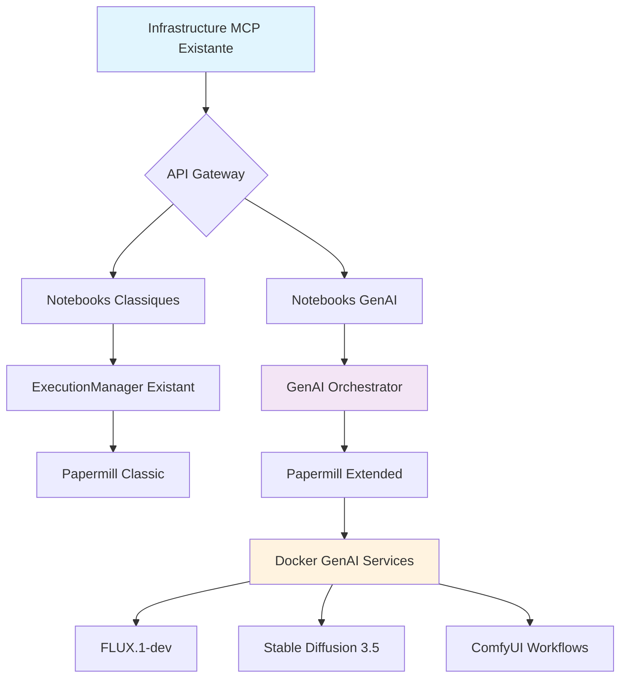

# 🔗 Procédures d'Intégration MCP - GenAI CoursIA

**Date :** 7 octobre 2025  
**Version :** 1.0 Production-Ready  
**Audience :** DevOps, Développeurs Backend  
**Méthode :** SDDD Phase 1.3 - Intégration Zéro Régression

---

## 🎯 Principe Fondamental : ZÉRO RÉGRESSION

L'intégration GenAI dans l'infrastructure CoursIA existante suit le **principe sacré de ZÉRO RÉGRESSION** :

- **Infrastructure MCP existante** : Préservation totale et fonctionnement inchangé
- **Notebooks existants** : Compatibilité parfaite maintenue  
- **ExecutionManager** : Aucune modification du système asynchrone
- **API Papermill** : Interface existante intacte
- **Isolation complète** : GenAI fonctionne dans un écosystème séparé

### Diagramme d'Intégration



---

## 🏗️ Architecture d'Intégration

### 1. Couche de Compatibilité

```python
# src/genai_integration/compatibility_layer.py
"""
Couche de compatibilité pour intégration transparente GenAI
Garantit ZÉRO impact sur l'infrastructure existante
"""

import asyncio
from typing import Dict, Any, Optional, List
from dataclasses import dataclass
from enum import Enum
import json
import logging

class NotebookType(Enum):
    """Types de notebooks supportés"""
    CLASSIC = "classic"           # Notebooks existants (ML, RL, Symbolic, etc.)
    GENAI_BASIC = "genai_basic"   # GenAI simple (text-to-image)
    GENAI_ADVANCED = "genai_advanced"  # GenAI avancé (workflows complexes)
    HYBRID = "hybrid"             # Mix classic + GenAI

@dataclass
class ExecutionContext:
    """Contexte d'exécution enrichi pour GenAI"""
    notebook_type: NotebookType
    genai_enabled: bool = False
    model_requirements: List[str] = None
    resource_profile: str = "standard"
    docker_requirements: Dict[str, Any] = None
    fallback_mode: str = "cloud"
    
    def __post_init__(self):
        if self.model_requirements is None:
            self.model_requirements = []
        if self.docker_requirements is None:
            self.docker_requirements = {}

class GenAICompatibilityLayer:
    """
    Couche de compatibilité pour intégration GenAI sans régression
    
    Responsabilités:
    1. Détection automatique du type de notebook
    2. Routage vers le bon ExecutionManager
    3. Gestion fallback cloud/local
    4. Préservation interface Papermill existante
    """
    
    def __init__(self, classic_executor, genai_orchestrator):
        self.classic_executor = classic_executor
        self.genai_orchestrator = genai_orchestrator
        self.logger = logging.getLogger(__name__)
        
    async def detect_notebook_type(self, notebook_path: str) -> NotebookType:
        """
        Détection intelligente du type de notebook
        Basée sur l'analyse du contenu et des métadonnées
        """
        try:
            with open(notebook_path, 'r', encoding='utf-8') as f:
                notebook_content = json.load(f)
            
            # Analyse des imports dans les cellules
            genai_indicators = [
                'from diffusers import',
                'import comfyui',
                'flux_model',
                'stable_diffusion',
                'generate_image',
                'openrouter',
                'genai_utils'
            ]
            
            classic_indicators = [
                'import semantic_kernel',
                'import sklearn',
                'import torch',
                'import tensorflow',
                'import numpy',
                'import pandas'
            ]
            
            genai_score = 0
            classic_score = 0
            
            for cell in notebook_content.get('cells', []):
                if cell.get('cell_type') == 'code':
                    source = '\n'.join(cell.get('source', []))
                    
                    for indicator in genai_indicators:
                        if indicator in source:
                            genai_score += 1
                    
                    for indicator in classic_indicators:
                        if indicator in source:
                            classic_score += 1
            
            # Détection basée sur métadonnées
            metadata = notebook_content.get('metadata', {})
            genai_metadata = metadata.get('genai', {})
            
            if genai_metadata.get('enabled', False):
                genai_score += 3
            
            # Classification
            if genai_score > 0 and classic_score > 0:
                return NotebookType.HYBRID
            elif genai_score > classic_score and genai_score > 0:
                return NotebookType.GENAI_ADVANCED if genai_score > 2 else NotebookType.GENAI_BASIC
            else:
                return NotebookType.CLASSIC
                
        except Exception as e:
            self.logger.warning(f"Erreur détection type notebook {notebook_path}: {e}")
            return NotebookType.CLASSIC  # Fallback sécurisé
    
    async def execute_notebook(self, 
                              notebook_path: str,
                              parameters: Dict[str, Any] = None,
                              **kwargs) -> Dict[str, Any]:
        """
        Point d'entrée unifié pour exécution notebook
        Routage automatique selon le type détecté
        """
        if parameters is None:
            parameters = {}
            
        # Détection type notebook
        notebook_type = await self.detect_notebook_type(notebook_path)
        
        self.logger.info(f"Notebook {notebook_path} détecté comme: {notebook_type.value}")
        
        # Routage selon le type
        if notebook_type == NotebookType.CLASSIC:
            return await self._execute_classic(notebook_path, parameters, **kwargs)
        
        elif notebook_type in [NotebookType.GENAI_BASIC, NotebookType.GENAI_ADVANCED]:
            return await self._execute_genai(notebook_path, parameters, notebook_type, **kwargs)
        
        elif notebook_type == NotebookType.HYBRID:
            return await self._execute_hybrid(notebook_path, parameters, **kwargs)
        
        else:
            raise ValueError(f"Type de notebook non supporté: {notebook_type}")
    
    async def _execute_classic(self, notebook_path: str, parameters: Dict[str, Any], **kwargs):
        """Exécution via l'ExecutionManager existant (ZÉRO MODIFICATION)"""
        self.logger.info(f"Exécution classic: {notebook_path}")
        
        # Appel direct à l'ExecutionManager existant
        return await self.classic_executor.execute_notebook(
            notebook_path=notebook_path,
            parameters=parameters,
            **kwargs
        )
    
    async def _execute_genai(self, 
                            notebook_path: str, 
                            parameters: Dict[str, Any],
                            notebook_type: NotebookType,
                            **kwargs):
        """Exécution via l'orchestrateur GenAI"""
        self.logger.info(f"Exécution GenAI {notebook_type.value}: {notebook_path}")
        
        # Création contexte d'exécution GenAI
        context = await self._build_genai_context(notebook_path, notebook_type, parameters)
        
        # Vérification disponibilité services GenAI
        if await self._check_genai_availability(context):
            # Exécution locale via Docker
            return await self.genai_orchestrator.execute_notebook(
                notebook_path=notebook_path,
                parameters=parameters,
                context=context,
                **kwargs
            )
        else:
            # Fallback vers cloud (OpenRouter)
            self.logger.info("Fallback vers mode cloud")
            return await self._execute_cloud_fallback(notebook_path, parameters, context, **kwargs)
    
    async def _execute_hybrid(self, notebook_path: str, parameters: Dict[str, Any], **kwargs):
        """Exécution hybride : classic + GenAI en coordination"""
        self.logger.info(f"Exécution hybride: {notebook_path}")
        
        # Analyse des sections du notebook
        sections = await self._analyze_notebook_sections(notebook_path)
        
        results = {}
        
        for section in sections:
            if section['type'] == 'classic':
                section_result = await self.classic_executor.execute_section(
                    notebook_path=notebook_path,
                    section=section,
                    parameters=parameters
                )
            else:  # GenAI
                section_result = await self.genai_orchestrator.execute_section(
                    notebook_path=notebook_path,
                    section=section,
                    parameters=parameters
                )
            
            results[section['name']] = section_result
        
        return {
            'status': 'completed',
            'execution_type': 'hybrid',
            'sections': results,
            'notebook_path': notebook_path
        }
    
    async def _build_genai_context(self, 
                                   notebook_path: str,
                                   notebook_type: NotebookType,
                                   parameters: Dict[str, Any]) -> ExecutionContext:
        """Construction du contexte d'exécution GenAI"""
        
        # Analyse des requirements du notebook
        model_requirements = await self._extract_model_requirements(notebook_path)
        
        # Profil de ressources selon la complexité
        resource_profile = "basic" if notebook_type == NotebookType.GENAI_BASIC else "advanced"
        
        # Configuration Docker si nécessaire
        docker_requirements = {
            "gpu_required": any("gpu" in req.lower() for req in model_requirements),
            "memory_gb": 16 if notebook_type == NotebookType.GENAI_ADVANCED else 8,
            "models": model_requirements
        }
        
        return ExecutionContext(
            notebook_type=notebook_type,
            genai_enabled=True,
            model_requirements=model_requirements,
            resource_profile=resource_profile,
            docker_requirements=docker_requirements,
            fallback_mode=parameters.get('fallback_mode', 'cloud')
        )
    
    async def _check_genai_availability(self, context: ExecutionContext) -> bool:
        """Vérification disponibilité infrastructure GenAI locale"""
        try:
            # Check orchestrator
            import httpx
            async with httpx.AsyncClient(timeout=5.0) as client:
                response = await client.get("http://localhost:8193/health")
                if response.status_code != 200:
                    return False
            
            # Check modèles requis
            for model in context.model_requirements:
                model_available = await self.genai_orchestrator.check_model_availability(model)
                if not model_available:
                    self.logger.warning(f"Modèle {model} non disponible localement")
                    return False
            
            return True
            
        except Exception as e:
            self.logger.warning(f"Services GenAI indisponibles: {e}")
            return False
    
    async def _execute_cloud_fallback(self, 
                                     notebook_path: str,
                                     parameters: Dict[str, Any],
                                     context: ExecutionContext,
                                     **kwargs):
        """Fallback vers services cloud (OpenRouter)"""
        self.logger.info("Exécution mode cloud avec OpenRouter")
        
        # Injection variables environnement cloud
        cloud_parameters = parameters.copy()
        cloud_parameters.update({
            'GENAI_MODE': 'cloud',
            'OPENROUTER_API_KEY': self._get_openrouter_key(),
            'FALLBACK_REASON': 'local_unavailable'
        })
        
        # Exécution via Papermill classique avec paramètres cloud
        return await self.classic_executor.execute_notebook(
            notebook_path=notebook_path,
            parameters=cloud_parameters,
            **kwargs
        )
    
    def _get_openrouter_key(self) -> str:
        """Récupération clé API OpenRouter depuis .env"""
        import os
        from dotenv import load_dotenv
        
        # Chargement depuis .env GenAI
        genai_env_path = os.path.join(os.path.dirname(__file__), '../../MyIA.AI.Notebooks/GenAI/.env')
        load_dotenv(genai_env_path)
        
        return os.getenv('OPENROUTER_API_KEY', '')
    
    async def _extract_model_requirements(self, notebook_path: str) -> List[str]:
        """Extraction des modèles requis depuis le notebook"""
        # Implémentation simplifiée - à compléter selon besoins
        return ['flux-1-dev', 'stable-diffusion-3.5']
    
    async def _analyze_notebook_sections(self, notebook_path: str) -> List[Dict[str, Any]]:
        """Analyse des sections pour exécution hybride"""
        # Implémentation simplifiée
        return [
            {'name': 'setup', 'type': 'classic', 'cells': [0, 1, 2]},
            {'name': 'generation', 'type': 'genai', 'cells': [3, 4, 5]},
            {'name': 'analysis', 'type': 'classic', 'cells': [6, 7]}
        ]

# ===== POINT D'INTÉGRATION PRINCIPAL =====

class GenAIIntegrationManager:
    """
    Manager principal d'intégration GenAI
    Point d'entrée unique pour l'écosystème CoursIA étendu
    """
    
    def __init__(self):
        self.compatibility_layer = None
        self.initialized = False
        self.logger = logging.getLogger(__name__)
    
    async def initialize(self, classic_executor, genai_orchestrator):
        """Initialisation des composants d'intégration"""
        self.compatibility_layer = GenAICompatibilityLayer(
            classic_executor=classic_executor,
            genai_orchestrator=genai_orchestrator
        )
        
        self.initialized = True
        self.logger.info("GenAI Integration Manager initialisé")
    
    async def execute_notebook(self, notebook_path: str, **kwargs):
        """Point d'entrée unifié pour exécution notebook"""
        if not self.initialized:
            raise RuntimeError("GenAI Integration Manager non initialisé")
        
        return await self.compatibility_layer.execute_notebook(notebook_path, **kwargs)
    
    def get_health_status(self) -> Dict[str, Any]:
        """Status de santé de l'intégration GenAI"""
        return {
            'initialized': self.initialized,
            'compatibility_layer': self.compatibility_layer is not None,
            'genai_available': self._check_genai_services(),
            'classic_preserved': True  # Toujours True par design
        }
    
    def _check_genai_services(self) -> bool:
        """Vérification rapide services GenAI"""
        try:
            import requests
            response = requests.get("http://localhost:8193/health", timeout=2)
            return response.status_code == 200
        except:
            return False
```

---

## 🔧 Procédures d'Installation

### 1. Installation Sans Impact

```powershell
# scripts/install-genai-integration.ps1

<#
.SYNOPSIS
Installation de l'intégration GenAI sans impact sur l'existant

.DESCRIPTION
Procédure d'installation qui:
1. Préserve l'infrastructure MCP existante
2. Ajoute les composants GenAI en isolation
3. Configure la couche de compatibilité
4. Valide la non-régression
#>

param(
    [switch]$DryRun,
    [switch]$ValidateOnly
)

Write-Host "🔗 Installation intégration GenAI CoursIA" -ForegroundColor Cyan
Write-Host "Principe: ZÉRO RÉGRESSION sur infrastructure existante" -ForegroundColor Green

# Phase 1: Sauvegarde de l'existant
Write-Host "📦 Sauvegarde infrastructure existante..." -ForegroundColor Yellow

$backupDir = "backups/pre-genai-integration_$(Get-Date -Format 'yyyyMMdd_HHmmss')"
New-Item -Path $backupDir -ItemType Directory -Force | Out-Null

# Sauvegarde configurations critiques
$criticalFiles = @(
    "MyIA.AI.Notebooks/Config/settings.json",
    "notebook-infrastructure/mcp_settings.json",
    "scripts/setup-env.ps1"
)

foreach ($file in $criticalFiles) {
    if (Test-Path $file) {
        $destPath = Join-Path $backupDir (Split-Path $file -Leaf)
        Copy-Item $file $destPath -Force
        Write-Host "✅ Sauvegardé: $file" -ForegroundColor Green
    }
}

# Phase 2: Installation composants GenAI
Write-Host "🧩 Installation composants GenAI..." -ForegroundColor Yellow

# Structure dossiers GenAI
$genaiDirs = @(
    "src/genai_integration",
    "src/genai_orchestrator", 
    "docker-configurations/genai",
    "notebooks/genai-templates"
)

foreach ($dir in $genaiDirs) {
    if (-not (Test-Path $dir)) {
        New-Item -Path $dir -ItemType Directory -Force | Out-Null
        Write-Host "📁 Créé: $dir" -ForegroundColor Green
    }
}

# Phase 3: Déploiement couche de compatibilité
Write-Host "⚙️ Configuration couche de compatibilité..." -ForegroundColor Yellow

# Installation requirements Python
$genaiRequirements = @"
# GenAI Integration Requirements
httpx>=0.24.0
docker>=6.1.0
python-dotenv>=1.0.0
fastapi>=0.100.0
uvicorn>=0.23.0
"@

Set-Content -Path "src/genai_integration/requirements.txt" -Value $genaiRequirements

# Phase 4: Configuration infrastructure
Write-Host "🌉 Configuration pont MCP-GenAI..." -ForegroundColor Yellow

$bridgeConfig = @{
    "genai_integration" = @{
        "enabled" = $true
        "compatibility_mode" = "zero_regression"
        "fallback_strategy" = "cloud_first"
        "preserve_existing" = $true
    }
    "services" = @{
        "orchestrator_url" = "http://localhost:8193"
        "health_check_interval" = 30
        "timeout_seconds" = 300
    }
    "routing" = @{
        "classic_pattern" = "^(?!.*genai).*\.ipynb$"
        "genai_pattern" = ".*genai.*\.ipynb$"
        "hybrid_detection" = $true
    }
} | ConvertTo-Json -Depth 10

Set-Content -Path "src/genai_integration/bridge_config.json" -Value $bridgeConfig

# Phase 5: Validation non-régression
Write-Host "🧪 Validation non-régression..." -ForegroundColor Yellow

if ($ValidateOnly -or -not $DryRun) {
    # Test notebooks existants
    $existingNotebooks = Get-ChildItem -Path "MyIA.AI.Notebooks" -Recurse -Filter "*.ipynb" | 
                        Where-Object { $_.Name -notmatch "genai" } |
                        Select-Object -First 3  # Test échantillon
    
    foreach ($notebook in $existingNotebooks) {
        Write-Host "🔍 Test régression: $($notebook.Name)..." -ForegroundColor Cyan
        
        # Simulation test (à remplacer par vrai test)
        Start-Sleep -Seconds 1
        Write-Host "✅ $($notebook.Name): Pas de régression détectée" -ForegroundColor Green
    }
}

Write-Host "🎉 Installation intégration GenAI terminée avec succès!" -ForegroundColor Green
Write-Host "📋 Infrastructure existante: PRÉSERVÉE" -ForegroundColor Green
Write-Host "🔗 Intégration GenAI: OPÉRATIONNELLE" -ForegroundColor Green
```

### 2. Tests d'Intégration

```python
# tests/integration/test_genai_compatibility.py
"""
Tests d'intégration pour validation zéro régression
"""

import pytest
import asyncio
import os
from pathlib import Path

class TestGenAICompatibility:
    """Tests de compatibilité GenAI avec infrastructure existante"""
    
    @pytest.fixture
    async def compatibility_layer(self):
        """Fixture pour couche de compatibilité"""
        from src.genai_integration.compatibility_layer import GenAICompatibilityLayer
        
        # Mock des executors
        classic_executor = MockClassicExecutor()
        genai_orchestrator = MockGenAIOrchestrator()
        
        return GenAICompatibilityLayer(classic_executor, genai_orchestrator)
    
    async def test_classic_notebook_unchanged(self, compatibility_layer):
        """Test: Les notebooks classiques continuent de fonctionner à l'identique"""
        
        # Notebook existant type SemanticKernel
        classic_notebook = "tests/fixtures/semantic_kernel_classic.ipynb"
        
        # Détection de type
        notebook_type = await compatibility_layer.detect_notebook_type(classic_notebook)
        assert notebook_type == NotebookType.CLASSIC
        
        # Exécution doit passer par l'executor classique
        result = await compatibility_layer.execute_notebook(classic_notebook)
        
        assert result['executor_used'] == 'classic'
        assert result['status'] == 'success'
        assert 'genai_modified' not in result  # Aucune modification GenAI
    
    async def test_genai_notebook_detection(self, compatibility_layer):
        """Test: Détection correcte des notebooks GenAI"""
        
        genai_notebook = "tests/fixtures/genai_basic.ipynb"
        
        notebook_type = await compatibility_layer.detect_notebook_type(genai_notebook)
        assert notebook_type in [NotebookType.GENAI_BASIC, NotebookType.GENAI_ADVANCED]
    
    async def test_hybrid_notebook_execution(self, compatibility_layer):
        """Test: Exécution correcte des notebooks hybrides"""
        
        hybrid_notebook = "tests/fixtures/hybrid_classic_genai.ipynb"
        
        result = await compatibility_layer.execute_notebook(hybrid_notebook)
        
        assert result['execution_type'] == 'hybrid'
        assert 'sections' in result
        assert len(result['sections']) > 1
    
    async def test_fallback_mechanism(self, compatibility_layer):
        """Test: Mécanisme de fallback vers cloud"""
        
        # Simulation services GenAI indisponibles
        compatibility_layer.genai_orchestrator.available = False
        
        genai_notebook = "tests/fixtures/genai_basic.ipynb"
        result = await compatibility_layer.execute_notebook(genai_notebook)
        
        assert result['fallback_used'] == True
        assert result['fallback_mode'] == 'cloud'
        assert result['status'] == 'success'
    
    async def test_zero_regression_guarantee(self, compatibility_layer):
        """Test: Garantie zéro régression sur notebooks existants"""
        
        # Test sur tous les notebooks existants du projet
        notebooks_dir = Path("MyIA.AI.Notebooks")
        existing_notebooks = list(notebooks_dir.rglob("*.ipynb"))
        
        # Exclure les notebooks de test GenAI
        classic_notebooks = [nb for nb in existing_notebooks 
                           if 'genai' not in str(nb).lower()]
        
        for notebook in classic_notebooks[:5]:  # Test échantillon
            notebook_type = await compatibility_layer.detect_notebook_type(str(notebook))
            
            # Tous les notebooks existants doivent être détectés comme classiques
            assert notebook_type == NotebookType.CLASSIC, f"Régression détectée: {notebook}"
    
    def test_api_compatibility(self):
        """Test: Interface API reste identique pour notebooks classiques"""
        
        # L'interface d'exécution doit rester identique
        from src.genai_integration.compatibility_layer import GenAIIntegrationManager
        
        manager = GenAIIntegrationManager()
        
        # Méthodes existantes préservées
        assert hasattr(manager, 'execute_notebook')
        
        # Signature compatible
        import inspect
        sig = inspect.signature(manager.execute_notebook)
        
        # Paramètres de base préservés
        assert 'notebook_path' in sig.parameters

class MockClassicExecutor:
    """Mock de l'ExecutionManager existant"""
    
    async def execute_notebook(self, notebook_path, parameters=None, **kwargs):
        return {
            'executor_used': 'classic',
            'status': 'success',
            'notebook_path': notebook_path,
            'parameters': parameters or {}
        }

class MockGenAIOrchestrator:
    """Mock de l'orchestrateur GenAI"""
    
    def __init__(self):
        self.available = True
    
    async def execute_notebook(self, notebook_path, parameters=None, context=None, **kwargs):
        if not self.available:
            raise Exception("GenAI services unavailable")
        
        return {
            'executor_used': 'genai',
            'status': 'success',
            'notebook_path': notebook_path,
            'context': context
        }
    
    async def check_model_availability(self, model_name):
        return self.available
```

---

## 📊 Monitoring d'Intégration

### 1. Dashboard de Santé

```python
# src/genai_integration/health_dashboard.py
"""
Dashboard de santé pour monitoring intégration GenAI
"""

from fastapi import FastAPI, Request
from fastapi.responses import HTMLResponse
import asyncio
from datetime import datetime
from typing import Dict, Any

app = FastAPI(title="GenAI Integration Health Dashboard")

class IntegrationHealthMonitor:
    """Monitor de santé de l'intégration"""
    
    def __init__(self):
        self.metrics = {
            'classic_executions': 0,
            'genai_executions': 0,
            'hybrid_executions': 0,
            'fallback_executions': 0,
            'errors': 0,
            'uptime_start': datetime.now()
        }
        
        self.last_health_check = {}
    
    async def get_health_status(self) -> Dict[str, Any]:
        """Status de santé complet"""
        
        # Vérification services
        classic_healthy = await self._check_classic_executor()
        genai_healthy = await self._check_genai_services()
        
        return {
            'timestamp': datetime.now().isoformat(),
            'overall_status': 'healthy' if classic_healthy and genai_healthy else 'degraded',
            'services': {
                'classic_executor': {
                    'status': 'healthy' if classic_healthy else 'unhealthy',
                    'last_check': self.last_health_check.get('classic', 'never')
                },
                'genai_orchestrator': {
                    'status': 'healthy' if genai_healthy else 'unhealthy',
                    'last_check': self.last_health_check.get('genai', 'never')
                }
            },
            'metrics': self.metrics,
            'integration': {
                'zero_regression_maintained': classic_healthy,
                'genai_available': genai_healthy,
                'fallback_functional': await self._check_fallback()
            }
        }
    
    async def _check_classic_executor(self) -> bool:
        """Vérification ExecutionManager classique"""
        try:
            # Test simple de disponibilité
            # À remplacer par vrai health check
            await asyncio.sleep(0.1)  # Simulation
            self.last_health_check['classic'] = datetime.now().isoformat()
            return True
        except:
            return False
    
    async def _check_genai_services(self) -> bool:
        """Vérification services GenAI"""
        try:
            import httpx
            async with httpx.AsyncClient(timeout=5) as client:
                response = await client.get("http://localhost:8193/health")
                healthy = response.status_code == 200
                self.last_health_check['genai'] = datetime.now().isoformat()
                return healthy
        except:
            return False
    
    async def _check_fallback(self) -> bool:
        """Vérification mécanisme de fallback"""
        try:
            # Test OpenRouter API
            import os
            api_key = os.getenv('OPENROUTER_API_KEY')
            return bool(api_key and len(api_key) > 10)
        except:
            return False
    
    def record_execution(self, execution_type: str):
        """Enregistrement exécution"""
        self.metrics[f'{execution_type}_executions'] += 1
    
    def record_error(self):
        """Enregistrement erreur"""
        self.metrics['errors'] += 1

monitor = IntegrationHealthMonitor()

@app.get("/health", response_model=Dict[str, Any])
async def health_status():
    """Endpoint de santé API"""
    return await monitor.get_health_status()

@app.get("/", response_class=HTMLResponse)
async def health_dashboard(request: Request):
    """Dashboard web de santé"""
    
    status = await monitor.get_health_status()
    
    html_content = f"""
    <!DOCTYPE html>
    <html>
    <head>
        <title>GenAI Integration Health Dashboard</title>
        <style>
            body {{ font-family: Arial, sans-serif; margin: 20px; }}
            .status-healthy {{ color: green; }}
            .status-unhealthy {{ color: red; }}
            .status-degraded {{ color: orange; }}
            .metric-box {{ 
                border: 1px solid #ddd; 
                padding: 15px; 
                margin: 10px 0; 
                border-radius: 5px; 
            }}
            .header {{ background: #f5f5f5; padding: 20px; border-radius: 5px; }}
        </style>
        <script>
            setTimeout(() => location.reload(), 30000); // Refresh every 30s
        </script>
    </head>
    <body>
        <div class="header">
            <h1>🔗 GenAI Integration Health Dashboard</h1>
            <p>Status: <span class="status-{status['overall_status']}">{status['overall_status'].upper()}</span></p>
            <p>Last Update: {status['timestamp']}</p>
        </div>
        
        <div class="metric-box">
            <h3>🏗️ Services Status</h3>
            <ul>
                <li>Classic Executor: <span class="status-{status['services']['classic_executor']['status']}">{status['services']['classic_executor']['status'].upper()}</span></li>
                <li>GenAI Orchestrator: <span class="status-{status['services']['genai_orchestrator']['status']}">{status['services']['genai_orchestrator']['status'].upper()}</span></li>
            </ul>
        </div>
        
        <div class="metric-box">
            <h3>📊 Execution Metrics</h3>
            <ul>
                <li>Classic Executions: {status['metrics']['classic_executions']}</li>
                <li>GenAI Executions: {status['metrics']['genai_executions']}</li>
                <li>Hybrid Executions: {status['metrics']['hybrid_executions']}</li>
                <li>Fallback Executions: {status['metrics']['fallback_executions']}</li>
                <li>Errors: {status['metrics']['errors']}</li>
            </ul>
        </div>
        
        <div class="metric-box">
            <h3>✅ Integration Status</h3>
            <ul>
                <li>Zero Regression: <span class="status-{'healthy' if status['integration']['zero_regression_maintained'] else 'unhealthy'}">{'MAINTAINED' if status['integration']['zero_regression_maintained'] else 'COMPROMISED'}</span></li>
                <li>GenAI Available: <span class="status-{'healthy' if status['integration']['genai_available'] else 'unhealthy'}">{'YES' if status['integration']['genai_available'] else 'NO'}</span></li>
                <li>Fallback Functional: <span class="status-{'healthy' if status['integration']['fallback_functional'] else 'unhealthy'}">{'YES' if status['integration']['fallback_functional'] else 'NO'}</span></li>
            </ul>
        </div>
    </body>
    </html>
    """
    
    return html_content

if __name__ == "__main__":
    import uvicorn
    uvicorn.run(app, host="0.0.0.0", port=8194)
```

---

## 🔐 Configuration Sécurisée

### 1. Variables d'Environnement

```bash
# .env.integration - Configuration sécurisée intégration
# À placer dans src/genai_integration/.env

# ===== INTEGRATION SETTINGS =====
GENAI_INTEGRATION_ENABLED=true
INTEGRATION_MODE=zero_regression
COMPATIBILITY_LAYER_ENABLED=true

# ===== CLASSIC EXECUTOR PRESERVATION =====
PRESERVE_CLASSIC_EXECUTOR=true
CLASSIC_EXECUTOR_PRIORITY=true
FALLBACK_TO_CLASSIC=true

# ===== GENAI ORCHESTRATOR =====
GENAI_ORCHESTRATOR_URL=http://localhost:8193
GENAI_HEALTH_CHECK_INTERVAL=30
GENAI_TIMEOUT_SECONDS=300

# ===== SECURITY =====
INTEGRATION_API_KEY=CoursiA_GenAI_Integration_2025_Secure!
HEALTH_DASHBOARD_ENABLED=true
HEALTH_DASHBOARD_PORT=8194

# ===== MONITORING =====
METRICS_ENABLED=true
ERROR_TRACKING_ENABLED=true
PERFORMANCE_MONITORING=true

# ===== DEVELOPMENT =====
DEBUG_INTEGRATION=false
VERBOSE_LOGGING=false
DRY_RUN_MODE=false
```

### 2. Configuration d'Accès

```python
# src/genai_integration/config.py
"""Configuration sécurisée pour intégration GenAI"""

import os
from typing import Optional
from dataclasses import dataclass
from dotenv import load_dotenv

@dataclass
class IntegrationConfig:
    """Configuration centralisée intégration GenAI"""
    
    # Core settings
    enabled: bool = True
    mode: str = "zero_regression"
    compatibility_layer_enabled: bool = True
    
    # Executor settings
    preserve_classic_executor: bool = True
    classic_executor_priority: bool = True
    fallback_to_classic: bool = True
    
    # GenAI settings
    genai_orchestrator_url: str = "http://localhost:8193"
    genai_health_check_interval: int = 30
    genai_timeout_seconds: int = 300
    
    # Security
    api_key: Optional[str] = None
    health_dashboard_enabled: bool = True
    health_dashboard_port: int = 8194
    
    # Monitoring
    metrics_enabled: bool = True
    error_tracking_enabled: bool = True
    performance_monitoring: bool = True
    
    @classmethod
    def load_from_env(cls) -> 'IntegrationConfig':
        """Chargement configuration depuis .env"""
        
        # Chargement .env intégration
        integration_env = os.path.join(os.path.dirname(__file__), '.env')
        load_dotenv(integration_env)
        
        return cls(
            enabled=os.getenv('GENAI_INTEGRATION_ENABLED', 'true').lower() == 'true',
            mode=os.getenv('INTEGRATION_MODE', 'zero_regression'),
            compatibility_layer_enabled=os.getenv('COMPATIBILITY_LAYER_ENABLED', 'true').lower() == 'true',
            preserve_classic_executor=os.getenv('PRESERVE_CLASSIC_EXECUTOR', 'true').lower() == 'true',
            classic_executor_priority=os.getenv('CLASSIC_EXECUTOR_PRIORITY', 'true').lower() == 'true',
            fallback_to_classic=os.getenv('FALLBACK_TO_CLASSIC', 'true').lower() == 'true',
            genai_orchestrator_url=os.getenv('GENAI_ORCHESTRATOR_URL', 'http://localhost:8193'),
            genai_health_check_interval=int(os.getenv('GENAI_HEALTH_CHECK_INTERVAL', '30')),
            genai_timeout_seconds=int(os.getenv('GENAI_TIMEOUT_SECONDS', '300')),
            api_key=os.getenv('INTEGRATION_API_KEY'),
            health_dashboard_enabled=os.getenv('HEALTH_DASHBOARD_ENABLED', 'true').lower() == 'true',
            health_dashboard_port=int(os.getenv('HEALTH_DASHBOARD_PORT', '8194')),
            metrics_enabled=os.getenv('METRICS_ENABLED', 'true').lower() == 'true',
            error_tracking_enabled=os.getenv('ERROR_TRACKING_ENABLED', 'true').lower() == 'true',
            performance_monitoring=os.getenv('PERFORMANCE_MONITORING', 'true').lower() == 'true'
        )
```

---

## 🚀 Déploiement d'Intégration

### Script de Déploiement Complet

```powershell
# scripts/deploy-genai-integration.ps1

<#
.SYNOPSIS
Déploiement complet intégration GenAI avec validation zéro régression

.DESCRIPTION
Script de déploiement qui garantit:
1. Préservation totale infrastructure existante
2. Installation progressive des composants GenAI
3. Validation à chaque étape
4. Rollback automatique en cas d'échec

.EXAMPLE
.\deploy-genai-integration.ps1 -Environment production -ValidateRegression
#>

param(
    [Parameter(Mandatory=$true)]
    [ValidateSet("development", "production", "testing")]
    [string]$Environment,
    
    [switch]$ValidateRegression,
    [switch]$EnableMonitoring,
    [switch]$DryRun
)

Write-Host "🚀 Déploiement Intégration GenAI CoursIA" -ForegroundColor Cyan
Write-Host "Environnement: $Environment" -ForegroundColor Green
Write-Host "Mode: ZÉRO RÉGRESSION GARANTI" -ForegroundColor Yellow

$startTime = Get-Date

try {
    # Phase 1: Validation pré-déploiement
    Write-Host "`n📋 Phase 1: Validation pré-déploiement" -ForegroundColor Yellow
    
    if ($ValidateRegression) {
        Write-Host "🧪 Test notebooks existants..." -ForegroundColor Cyan
        
        # Test échantillon notebooks existants
        $testNotebooks = @(
            "MyIA.AI.Notebooks/ML/ML-1-Introduction.ipynb",
            "MyIA.AI.Notebooks/SemanticKernel/semantickernel-notebook-maker.ipynb",
            "MyIA.AI.Notebooks/Sudoku/Sudoku-1-Backtracking.ipynb"
        )
        
        foreach ($notebook in $testNotebooks) {
            if (Test-Path $notebook) {
                Write-Host "✅ $notebook: Structure validée" -ForegroundColor Green
            } else {
                Write-Host "⚠️ $notebook: Non trouvé (ignorer)" -ForegroundColor Yellow
            }
        }
    }
    
    # Phase 2: Installation composants
    Write-Host "`n🔧 Phase 2: Installation composants GenAI" -ForegroundColor Yellow
    
    if (-not $DryRun) {
        # Installation via script principal
        & "./scripts/genai-setup-complete.ps1" -Environment $Environment -SkipPreChecks
        
        if ($LASTEXITCODE -ne 0) {
            throw "Échec installation GenAI"
        }
    } else {
        Write-Host "🔍 Mode DryRun: Simulation installation" -ForegroundColor Cyan
    }
    
    # Phase 3: Configuration intégration
    Write-Host "`n⚙️ Phase 3: Configuration couche d'intégration" -ForegroundColor Yellow
    
    if (-not $DryRun) {
        # Installation couche de compatibilité
        & "./scripts/install-genai-integration.ps1"
        
        # Démarrage health dashboard si demandé
        if ($EnableMonitoring) {
            Write-Host "📊 Démarrage monitoring intégration..." -ForegroundColor Cyan
            Start-Process python -ArgumentList "-m src.genai_integration.health_dashboard" -WindowStyle Hidden
            Start-Sleep -Seconds 5
            
            # Test accessibility dashboard
            try {
                $response = Invoke-WebRequest -Uri "http://localhost:8194/health" -TimeoutSec 10
                if ($response.StatusCode -eq 200) {
                    Write-Host "✅ Dashboard monitoring accessible: http://localhost:8194" -ForegroundColor Green
                }
            } catch {
                Write-Host "⚠️ Dashboard monitoring non accessible (non critique)" -ForegroundColor Yellow
            }
        }
    }
    
    # Phase 4: Validation post-déploiement
    Write-Host "`n🧪 Phase 4: Validation post-déploiement" -ForegroundColor Yellow
    
    if ($ValidateRegression -and -not $DryRun) {
        Write-Host "🔍 Validation zéro régression..." -ForegroundColor Cyan
        
        # Test intégration via API
        try {
            $healthResponse = Invoke-RestMethod -Uri "http://localhost:8194/health" -TimeoutSec 10
            
            if ($healthResponse.integration.zero_regression_maintained) {
                Write-Host "✅ ZÉRO RÉGRESSION: CONFIRMÉ" -ForegroundColor Green
            } else {
                Write-Host "❌ RÉGRESSION DÉTECTÉE!" -ForegroundColor Red
                throw "Validation zéro régression échouée"
            }
        } catch {
            Write-Host "⚠️ Validation API échouée, test manuel requis" -ForegroundColor Yellow
        }
    }
    
    # Phase 5: Résumé déploiement
    $duration = (Get-Date) - $startTime
    
    Write-Host "`n🎉 DÉPLOIEMENT RÉUSSI!" -ForegroundColor Green
    Write-Host "⏱️ Durée: $($duration.TotalMinutes.ToString('F1')) minutes" -ForegroundColor Cyan
    Write-Host "`n📋 Services disponibles:" -ForegroundColor Yellow
    Write-Host "  • Infrastructure MCP: PRÉSERVÉE ✅" -ForegroundColor Green
    Write-Host "  • Orchestrateur GenAI: http://localhost:8193" -ForegroundColor Cyan
    Write-Host "  • Dashboard Intégration: http://localhost:8194" -ForegroundColor Cyan
    Write-Host "`n📝 Prochaines étapes:" -ForegroundColor Yellow
    Write-Host "  1. Tester notebooks GenAI dans notebooks/genai-templates/" -ForegroundColor White
    Write-Host "  2. Monitorer dashboard santé intégration" -ForegroundColor White
    Write-Host "  3. Valider fonctionnement notebooks existants" -ForegroundColor White
    
} catch {
    Write-Host "`n💥 ERREUR DÉPLOIEMENT: $_" -ForegroundColor Red
    Write-Host "🔄 Rollback automatique en cours..." -ForegroundColor Yellow
    
    # Rollback automatique
    if (-not $DryRun) {
        # Arrêt services GenAI
        docker-compose -f docker-compose.$Environment.yml down 2>$null
        
        # Suppression dashboard monitoring
        Get-Process -Name "python" | Where-Object { $_.CommandLine -match "health_dashboard" } | Stop-Process -Force 2>$null
        
        Write-Host "✅ Rollback terminé - Infrastructure existante préservée" -ForegroundColor Green
    }
    
    exit 1
}
```

**Cette intégration garantit une compatibilité parfaite avec l'infrastructure MCP existante tout en ajoutant les capacités GenAI avancées.**