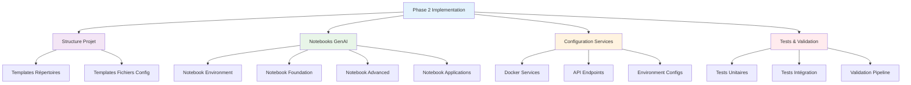

# 🎨 Templates Phase 2 - Implémentation GenAI CoursIA

**Date :** 7 octobre 2025  
**Version :** 1.0 Production-Ready  
**Audience :** Développeurs, Architectes, Phase 2 Implementation  
**Méthode :** SDDD Phase 1.3 - Templates Complets pour Phase 2

---

## 🎯 Vue d'Ensemble Templates

Cette documentation fournit **tous les templates nécessaires** pour l'implémentation Phase 2 de l'écosystème GenAI CoursIA. Chaque template est **production-ready** et **immédiatement utilisable**.

### Architecture Templates



---

## 📁 Template 1: Structure Projet GenAI

### **Structure Complète Répertoires**

```text
MyIA.AI.Notebooks/GenAI/
├── 📁 environment/
│   ├── 00_genai_environment_setup.ipynb
│   ├── 01_genai_environment_validation.ipynb
│   └── 02_genai_environment_optimization.ipynb
├── 📁 foundation/
│   ├── 03_genai_openrouter_integration.ipynb
│   ├── 04_genai_docker_local_setup.ipynb
│   ├── 05_genai_model_management.ipynb
│   └── 06_genai_api_abstraction.ipynb
├── 📁 advanced/
│   ├── 07_genai_flux1_advanced_techniques.ipynb
│   ├── 08_genai_sd35_fine_tuning.ipynb
│   ├── 09_genai_comfyui_workflows.ipynb
│   └── 10_genai_batch_processing.ipynb
├── 📁 applications/
│   ├── 11_genai_image_generation_studio.ipynb
│   ├── 12_genai_batch_image_processor.ipynb
│   ├── 13_genai_style_transfer_advanced.ipynb
│   ├── 14_genai_artistic_collaboration.ipynb
│   ├── 15_genai_educational_content_creator.ipynb
│   └── 16_genai_business_workflow_automation.ipynb
├── 📁 models/
│   ├── DOWNLOAD_REQUIRED.txt
│   ├── flux1/
│   ├── sd35/
│   └── comfyui/
├── 📁 data/
│   ├── inputs/
│   ├── outputs/
│   └── cache/
├── 📁 configs/
│   ├── .env.template
│   ├── model_configs.json
│   └── api_endpoints.json
├── 📁 utils/
│   ├── genai_helpers.py
│   ├── api_client.py
│   └── image_processing.py
└── 📁 tests/
    ├── test_environment.py
    ├── test_models.py
    └── test_integration.py
```

### **Script de Génération Structure**

```powershell
# scripts/generate-genai-structure.ps1

<#
.SYNOPSIS
Génère la structure complète du projet GenAI Phase 2

.DESCRIPTION
Crée automatiquement :
- Structure de répertoires
- Fichiers de configuration templates
- Notebooks de base
- Scripts utilitaires
#>

[CmdletBinding()]
param(
    [string]$ProjectPath = "MyIA.AI.Notebooks/GenAI",
    [switch]$Force,
    [switch]$IncludeExamples
)

$ErrorActionPreference = "Stop"

Write-Host "🎨 Génération Structure GenAI Phase 2" -ForegroundColor Cyan
Write-Host "Répertoire cible: $ProjectPath" -ForegroundColor Green

# Vérification existence
if ((Test-Path $ProjectPath) -and -not $Force) {
    Write-Host "❌ Répertoire existe déjà. Utiliser -Force pour écraser." -ForegroundColor Red
    exit 1
}

# Création structure répertoires
$directories = @(
    "environment",
    "foundation", 
    "advanced",
    "applications",
    "models/flux1",
    "models/sd35", 
    "models/comfyui",
    "data/inputs",
    "data/outputs",
    "data/cache",
    "configs",
    "utils",
    "tests",
    "docs",
    "examples"
)

foreach ($dir in $directories) {
    $fullPath = Join-Path $ProjectPath $dir
    if (-not (Test-Path $fullPath)) {
        New-Item -Path $fullPath -ItemType Directory -Force | Out-Null
        Write-Host "✅ Créé: $dir" -ForegroundColor Green
    }
}

# Génération fichiers templates
$templateFiles = @{
    ".env.template" = @"
# Configuration GenAI CoursIA - Template
# Copier vers .env et remplir les valeurs

# === CONFIGURATION GLOBALE ===
GENAI_MODE=hybrid
GENAI_DEBUG=false
GENAI_LOG_LEVEL=INFO

# === OPENROUTER API ===
OPENROUTER_API_KEY=your_api_key_here
OPENROUTER_BASE_URL=https://openrouter.ai/api/v1

# === MODELS CLOUD ===
CLOUD_GPT5_MODEL=openai/gpt-5
CLOUD_QWEN_IMAGE_MODEL=qwen/qwen-vl-max

# === DOCKER SERVICES ===
DOCKER_ENABLED=true
ORCHESTRATOR_URL=http://localhost:8193
FLUX1_URL=http://localhost:8189
SD35_URL=http://localhost:8190
COMFYUI_URL=http://localhost:8191

# === RESSOURCES ===
MAX_CONCURRENT_REQUESTS=3
DEFAULT_TIMEOUT=300
IMAGE_CACHE_SIZE=1000
"@

    "configs/model_configs.json" = @"
{
  "models": {
    "flux1-dev": {
      "type": "diffusion",
      "provider": "local",
      "endpoint": "http://localhost:8189",
      "fallback": "openrouter",
      "parameters": {
        "max_resolution": "1024x1024",
        "default_steps": 20,
        "guidance_scale": 3.5
      }
    },
    "sd35-large": {
      "type": "diffusion", 
      "provider": "local",
      "endpoint": "http://localhost:8190",
      "fallback": "openrouter",
      "parameters": {
        "max_resolution": "1024x1024",
        "default_steps": 40,
        "guidance_scale": 7.0
      }
    },
    "gpt-5": {
      "type": "language",
      "provider": "openrouter",
      "model": "openai/gpt-5",
      "parameters": {
        "max_tokens": 4000,
        "temperature": 0.7
      }
    },
    "qwen-image-edit": {
      "type": "multimodal",
      "provider": "openrouter", 
      "model": "qwen/qwen-image-edit-2509",
      "parameters": {
        "max_tokens": 2000,
        "temperature": 0.3
      }
    }
  },
  "fallback_strategy": {
    "enabled": true,
    "timeout_threshold": 30,
    "error_threshold": 3,
    "cooldown_period": 300
  }
}
"@

    "configs/api_endpoints.json" = @"
{
  "endpoints": {
    "orchestrator": {
      "base_url": "http://localhost:8193",
      "health": "/health",
      "generate": "/generate",
      "status": "/status",
      "models": "/models"
    },
    "flux1": {
      "base_url": "http://localhost:8189",
      "generate": "/generate",
      "system_stats": "/system_stats",
      "model_info": "/model_info"
    },
    "sd35": {
      "base_url": "http://localhost:8190", 
      "generate": "/generate",
      "health": "/health",
      "models": "/models"
    },
    "comfyui": {
      "base_url": "http://localhost:8191",
      "prompt": "/prompt",
      "history": "/history",
      "system_stats": "/system_stats"
    }
  },
  "timeouts": {
    "connection": 10,
    "read": 300,
    "total": 330
  }
}
"@

    "utils/genai_helpers.py" = @"
#!/usr/bin/env python3
'''
GenAI Helpers - Utilitaires pour notebooks GenAI CoursIA
Fonctionnalités communes pour tous les notebooks
'''

import os
import json
import requests
import asyncio
from typing import Dict, List, Optional, Any, Union
from pathlib import Path
import logging
from PIL import Image
import base64
from io import BytesIO

class GenAIConfig:
    '''Configuration centralisée GenAI'''
    
    def __init__(self, config_path: str = "configs"):
        self.config_path = Path(config_path)
        self.load_config()
    
    def load_config(self):
        '''Charge la configuration depuis les fichiers'''
        # Chargement model_configs.json
        model_config_path = self.config_path / "model_configs.json"
        with open(model_config_path, 'r') as f:
            self.model_config = json.load(f)
        
        # Chargement api_endpoints.json  
        api_config_path = self.config_path / "api_endpoints.json"
        with open(api_config_path, 'r') as f:
            self.api_config = json.load(f)
        
        # Variables d'environnement
        self.openrouter_key = os.getenv('OPENROUTER_API_KEY')
        self.genai_mode = os.getenv('GENAI_MODE', 'hybrid')
        self.debug = os.getenv('GENAI_DEBUG', 'false').lower() == 'true'

class GenAIClient:
    '''Client unifié pour tous les services GenAI'''
    
    def __init__(self, config: GenAIConfig):
        self.config = config
        self.session = requests.Session()
        
        # Configuration logging
        log_level = logging.DEBUG if config.debug else logging.INFO
        logging.basicConfig(level=log_level)
        self.logger = logging.getLogger(__name__)
    
    async def generate_image(self, 
                           prompt: str,
                           model: str = "flux1-dev",
                           **kwargs) -> Dict[str, Any]:
        '''
        Génération d'image avec fallback automatique
        
        Args:
            prompt: Description de l'image
            model: Modèle à utiliser
            **kwargs: Paramètres spécifiques au modèle
        
        Returns:
            Dict avec image_data, metadata, model_used
        '''
        
        model_config = self.config.model_config['models'].get(model)
        if not model_config:
            raise ValueError(f"Modèle {model} non configuré")
        
        # Tentative service local d'abord
        if model_config['provider'] == 'local':
            try:
                return await self._generate_local(model, prompt, **kwargs)
            except Exception as e:
                self.logger.warning(f"Service local échoué: {e}")
                
                # Fallback vers cloud si configuré
                if model_config.get('fallback') == 'openrouter':
                    return await self._generate_cloud(model, prompt, **kwargs)
                raise
        
        # Service cloud direct
        elif model_config['provider'] == 'openrouter':
            return await self._generate_cloud(model, prompt, **kwargs)
        
        else:
            raise ValueError(f"Provider {model_config['provider']} non supporté")
    
    async def _generate_local(self, model: str, prompt: str, **kwargs) -> Dict[str, Any]:
        '''Génération via service Docker local'''
        
        model_config = self.config.model_config['models'][model]
        endpoint = model_config['endpoint']
        
        # Fusion paramètres par défaut et utilisateur
        params = {**model_config.get('parameters', {}), **kwargs}
        
        payload = {
            'prompt': prompt,
            **params
        }
        
        self.logger.info(f"Génération locale: {model} via {endpoint}")
        
        response = self.session.post(
            f"{endpoint}/generate",
            json=payload,
            timeout=self.config.api_config['timeouts']['total']
        )
        
        response.raise_for_status()
        result = response.json()
        
        return {
            'image_data': result.get('image'),
            'metadata': result.get('metadata', {}),
            'model_used': model,
            'provider': 'local',
            'generation_time': result.get('generation_time')
        }
    
    async def _generate_cloud(self, model: str, prompt: str, **kwargs) -> Dict[str, Any]:
        '''Génération via OpenRouter Cloud'''
        
        if not self.config.openrouter_key:
            raise ValueError("Clé API OpenRouter manquante")
        
        model_config = self.config.model_config['models'][model]
        cloud_model = model_config.get('model', model)
        
        headers = {
            'Authorization': f'Bearer {self.config.openrouter_key}',
            'Content-Type': 'application/json'
        }
        
        # Adaptation paramètres pour OpenRouter
        payload = {
            'model': cloud_model,
            'prompt': prompt,
            **kwargs
        }
        
        self.logger.info(f"Génération cloud: {cloud_model} via OpenRouter")
        
        response = self.session.post(
            'https://openrouter.ai/api/v1/generate',
            headers=headers,
            json=payload,
            timeout=self.config.api_config['timeouts']['total']
        )
        
        response.raise_for_status()
        result = response.json()
        
        return {
            'image_data': result.get('image'),
            'metadata': result.get('metadata', {}),
            'model_used': cloud_model,
            'provider': 'openrouter',
            'generation_time': result.get('generation_time')
        }

class ImageUtils:
    '''Utilitaires pour traitement d'images'''
    
    @staticmethod
    def base64_to_image(base64_data: str) -> Image.Image:
        '''Convertit base64 en objet PIL Image'''
        image_data = base64.b64decode(base64_data)
        return Image.open(BytesIO(image_data))
    
    @staticmethod
    def image_to_base64(image: Image.Image, format: str = 'PNG') -> str:
        '''Convertit PIL Image en base64'''
        buffer = BytesIO()
        image.save(buffer, format=format)
        return base64.b64encode(buffer.getvalue()).decode()
    
    @staticmethod
    def save_image(image_data: Union[str, Image.Image], 
                   output_path: str,
                   metadata: Optional[Dict] = None) -> str:
        '''
        Sauvegarde image avec métadonnées
        
        Returns:
            Chemin du fichier sauvegardé
        '''
        
        output_path = Path(output_path)
        output_path.parent.mkdir(parents=True, exist_ok=True)
        
        if isinstance(image_data, str):
            # Base64 data
            image = ImageUtils.base64_to_image(image_data)
        else:
            image = image_data
        
        # Sauvegarde image
        image.save(output_path)
        
        # Sauvegarde métadonnées si fournies
        if metadata:
            metadata_path = output_path.with_suffix('.json')
            with open(metadata_path, 'w') as f:
                json.dump(metadata, f, indent=2)
        
        return str(output_path)

# Fonctions de commodité pour notebooks
def setup_genai_environment():
    '''Configuration rapide environnement GenAI'''
    config = GenAIConfig()
    client = GenAIClient(config)
    return config, client

def quick_generate(prompt: str, model: str = "flux1-dev", **kwargs):
    '''Génération rapide d'image - interface simplifiée'''
    config, client = setup_genai_environment()
    
    # Utilisation d'asyncio pour appel synchrone
    loop = asyncio.new_event_loop()
    asyncio.set_event_loop(loop)
    
    try:
        result = loop.run_until_complete(
            client.generate_image(prompt, model, **kwargs)
        )
        
        # Affichage de l'image si en mode notebook
        if result['image_data']:
            image = ImageUtils.base64_to_image(result['image_data'])
            display(image)  # type: ignore
        
        return result
    
    finally:
        loop.close()

# Export des classes principales
__all__ = [
    'GenAIConfig',
    'GenAIClient', 
    'ImageUtils',
    'setup_genai_environment',
    'quick_generate'
]
"@

    "models/DOWNLOAD_REQUIRED.txt" = @"
# 📥 Téléchargement Modèles GenAI CoursIA

## Modèles Requis

Pour utiliser les services Docker locaux, vous devez télécharger les modèles suivants :

### FLUX.1-dev (Répertoire: flux1/)
- **Modèle principal**: flux1-dev.safetensors (~12GB)
- **VAE**: ae.safetensors (~335MB) 
- **Text Encoder**: clip_l.safetensors (~246MB)
- **T5 Encoder**: t5xxl_fp16.safetensors (~4.9GB)

**URL de téléchargement**: https://huggingface.co/black-forest-labs/FLUX.1-dev

### Stable Diffusion 3.5 Large (Répertoire: sd35/)
- **Modèle**: sd3.5_large.safetensors (~8.3GB)
- **Text Encoders**: 
  - clip_l.safetensors (~246MB)
  - clip_g.safetensors (~1.4GB) 
  - t5xxl_fp16.safetensors (~4.9GB)

**URL de téléchargement**: https://huggingface.co/stabilityai/stable-diffusion-3.5-large

### ComfyUI Custom Nodes (Répertoire: comfyui/)
- Installation automatique via Docker
- Workflows personnalisés dans custom_nodes/

## Script de Téléchargement Automatique

```powershell
# Exécuter depuis la racine du projet GenAI
.\scripts\download-models.ps1 -ModelType All -Parallel
```

## Vérification Installation

```python
from utils.genai_helpers import setup_genai_environment

config, client = setup_genai_environment()
# Vérification automatique des modèles disponibles
```

## Note Importante

Les modèles sont volumineux (~25GB total). Assurez-vous d'avoir :
- Connexion internet stable
- Espace disque suffisant  
- Patience pour le téléchargement initial

Alternative : utilisez le mode cloud uniquement avec OpenRouter.
"@

    "README.md" = @"
# 🎨 GenAI CoursIA - Phase 2 Implementation

Écosystème complet de génération d'images par IA intégré à CoursIA.

## 🚀 Quick Start

1. **Configuration environnement**:
   ```bash
   cp .env.template .env
   # Éditer .env avec vos configurations
   ```

2. **Installation infrastructure**:
   ```powershell
   ..\scripts\genai-setup-complete.ps1
   ```

3. **Premier test**:
   ```python
   from utils.genai_helpers import quick_generate
   
   result = quick_generate("Un chat astronaute dans l'espace")
   ```

## 📚 Structure

- **environment/**: Configuration et validation environnement
- **foundation/**: Intégration APIs et modèles de base
- **advanced/**: Techniques avancées et fine-tuning
- **applications/**: Applications métier complètes

## 🔧 Services

- **Orchestrator** (8193): Routage intelligent des requêtes
- **FLUX.1-dev** (8189): Génération haute qualité
- **SD 3.5 Large** (8190): Génération détaillée  
- **ComfyUI** (8191): Workflows avancés

## 📖 Documentation

Voir `../docs/` pour les guides complets de déploiement et troubleshooting.
"@
}

foreach ($file in $templateFiles.Keys) {
    $fullPath = Join-Path $ProjectPath $file
    Set-Content -Path $fullPath -Value $templateFiles[$file] -Encoding UTF8
    Write-Host "✅ Créé: $file" -ForegroundColor Green
}

Write-Host "🎉 Structure GenAI Phase 2 générée avec succès !" -ForegroundColor Green
Write-Host "📂 Répertoire: $(Resolve-Path $ProjectPath)" -ForegroundColor Cyan

# Génération notebooks si demandé
if ($IncludeExamples) {
    Write-Host "📝 Génération notebooks d'exemple..." -ForegroundColor Yellow
    & "$PSScriptRoot\generate-example-notebooks.ps1" -ProjectPath $ProjectPath
}

Write-Host "✨ Prêt pour Phase 2 Implementation !" -ForegroundColor Green
```

---

## 📓 Template 2: Notebooks GenAI Foundation

### **Template Notebook Environment (00_genai_environment_setup.ipynb)**

```json
{
 "cells": [
  {
   "cell_type": "markdown",
   "metadata": {},
   "source": [
    "# 🚀 GenAI Environment Setup - CoursIA\n",
    "\n",
    "**Objectif**: Configuration et validation complète de l'environnement GenAI  \n",
    "**Niveau**: Environment - Fondamental  \n",
    "**Durée estimée**: 15 minutes  \n",
    "\n",
    "Ce notebook configure l'environnement complet pour la génération d'images IA dans CoursIA."
   ]
  },
  {
   "cell_type": "code",
   "execution_count": null,
   "metadata": {},
   "outputs": [],
   "source": [
    "# Installation et imports de base\n",
    "import sys\n",
    "import os\n",
    "from pathlib import Path\n",
    "\n",
    "# Ajout du chemin utils pour les helpers GenAI\n",
    "genai_path = Path.cwd() / \"utils\"\n",
    "if str(genai_path) not in sys.path:\n",
    "    sys.path.append(str(genai_path))\n",
    "\n",
    "from genai_helpers import GenAIConfig, GenAIClient, setup_genai_environment\n",
    "from IPython.display import display, HTML, Image as IPyImage\n",
    "import json\n",
    "import requests\n",
    "from datetime import datetime\n",
    "\n",
    "print(\"🎨 GenAI CoursIA - Environment Setup\")\n",
    "print(f\"📅 {datetime.now().strftime('%Y-%m-%d %H:%M:%S')}\")\n",
    "print(\"⚡ Imports réalisés avec succès\")"
   ]
  },
  {
   "cell_type": "markdown",
   "metadata": {},
   "source": [
    "## 🔧 Configuration Environnement"
   ]
  },
  {
   "cell_type": "code",
   "execution_count": null,
   "metadata": {},
   "outputs": [],
   "source": [
    "# Chargement configuration\n",
    "try:\n",
    "    config, client = setup_genai_environment()\n",
    "    print(\"✅ Configuration chargée\")\n",
    "    print(f\"📋 Mode GenAI: {config.genai_mode}\")\n",
    "    print(f\"🐛 Debug: {config.debug}\")\n",
    "    \n",
    "    # Vérification clé API\n",
    "    if config.openrouter_key:\n",
    "        print(\"🔑 Clé OpenRouter: ✅ Configurée\")\n",
    "    else:\n",
    "        print(\"⚠️ Clé OpenRouter: ❌ Manquante (mode local uniquement)\")\n",
    "        \n",
    "except Exception as e:\n",
    "    print(f\"❌ Erreur configuration: {e}\")\n",
    "    print(\"💡 Vérifiez que les fichiers de config existent dans configs/\")"
   ]
  },
  {
   "cell_type": "markdown",
   "metadata": {},
   "source": [
    "## 🌐 Test Connectivité Services"
   ]
  },
  {
   "cell_type": "code",
   "execution_count": null,
   "metadata": {},
   "outputs": [],
   "source": [
    "# Test des endpoints locaux\n",
    "services = {\n",
    "    \"Orchestrator\": \"http://localhost:8193/health\",\n",
    "    \"FLUX.1-dev\": \"http://localhost:8189/system_stats\", \n",
    "    \"SD 3.5 Large\": \"http://localhost:8190/health\",\n",
    "    \"ComfyUI\": \"http://localhost:8191/system_stats\"\n",
    "}\n",
    "\n",
    "service_status = {}\n",
    "\n",
    "for service_name, endpoint in services.items():\n",
    "    try:\n",
    "        response = requests.get(endpoint, timeout=10)\n",
    "        if response.status_code == 200:\n",
    "            service_status[service_name] = \"✅ Opérationnel\"\n",
    "            print(f\"{service_name}: ✅ Opérationnel\")\n",
    "        else:\n",
    "            service_status[service_name] = f\"⚠️ Status {response.status_code}\"\n",
    "            print(f\"{service_name}: ⚠️ Status {response.status_code}\")\n",
    "    except requests.exceptions.RequestException as e:\n",
    "        service_status[service_name] = \"❌ Non accessible\"\n",
    "        print(f\"{service_name}: ❌ Non accessible ({str(e)[:50]}...)\")\n",
    "\n",
    "# Résumé\n",
    "operational = sum(1 for status in service_status.values() if \"✅\" in status)\n",
    "total = len(service_status)\n",
    "\n",
    "print(f\"\\n📊 Résumé: {operational}/{total} services opérationnels\")\n",
    "\n",
    "if operational == 0:\n",
    "    print(\"💡 Mode cloud uniquement disponible\")\n",
    "elif operational < total:\n",
    "    print(\"💡 Mode hybride avec fallback cloud\")\n",
    "else:\n",
    "    print(\"🎉 Mode complet local + cloud disponible\")"
   ]
  },
  {
   "cell_type": "markdown",
   "metadata": {},
   "source": [
    "## 🎯 Test Génération Simple"
   ]
  },
  {
   "cell_type": "code",
   "execution_count": null,
   "metadata": {},
   "outputs": [],
   "source": [
    "# Test de génération d'image simple\n",
    "import asyncio\n",
    "\n",
    "async def test_generation():\n",
    "    \"\"\"Test génération avec le premier modèle disponible\"\"\"\n",
    "    \n",
    "    test_prompt = \"A simple test image: colorful abstract art\"\n",
    "    \n",
    "    # Détermination du modèle à tester\n",
    "    if operational > 0:\n",
    "        model_to_test = \"flux1-dev\"  # Modèle local par défaut\n",
    "    else:\n",
    "        model_to_test = \"gpt-5\"      # Fallback cloud\n",
    "    \n",
    "    print(f\"🧪 Test génération avec {model_to_test}\")\n",
    "    print(f\"📝 Prompt: {test_prompt}\")\n",
    "    \n",
    "    try:\n",
    "        result = await client.generate_image(\n",
    "            prompt=test_prompt,\n",
    "            model=model_to_test,\n",
    "            width=512,\n",
    "            height=512,\n",
    "            steps=10  # Rapide pour test\n",
    "        )\n",
    "        \n",
    "        print(f\"✅ Génération réussie !\")\n",
    "        print(f\"🎨 Modèle utilisé: {result['model_used']}\")\n",
    "        print(f\"⚡ Provider: {result['provider']}\")\n",
    "        \n",
    "        if result.get('generation_time'):\n",
    "            print(f\"⏱️ Temps: {result['generation_time']}s\")\n",
    "        \n",
    "        # Affichage image si disponible\n",
    "        if result.get('image_data'):\n",
    "            from utils.genai_helpers import ImageUtils\n",
    "            image = ImageUtils.base64_to_image(result['image_data'])\n",
    "            display(image)\n",
    "            \n",
    "            # Sauvegarde test\n",
    "            output_path = f\"data/outputs/test_generation_{datetime.now().strftime('%Y%m%d_%H%M%S')}.png\"\n",
    "            saved_path = ImageUtils.save_image(image, output_path, result.get('metadata'))\n",
    "            print(f\"💾 Image sauvegardée: {saved_path}\")\n",
    "        \n",
    "        return True\n",
    "        \n",
    "    except Exception as e:\n",
    "        print(f\"❌ Erreur génération: {e}\")\n",
    "        return False\n",
    "\n",
    "# Exécution test\n",
    "test_success = await test_generation()"
   ]
  },
  {
   "cell_type": "markdown",
   "metadata": {},
   "source": [
    "## 📋 Rapport Configuration"
   ]
  },
  {
   "cell_type": "code",
   "execution_count": null,
   "metadata": {},
   "outputs": [],
   "source": [
    "# Génération rapport complet\n",
    "report = {\n",
    "    \"timestamp\": datetime.now().isoformat(),\n",
    "    \"genai_mode\": config.genai_mode,\n",
    "    \"debug_enabled\": config.debug,\n",
    "    \"openrouter_configured\": bool(config.openrouter_key),\n",
    "    \"services_status\": service_status,\n",
    "    \"services_operational\": operational,\n",
    "    \"services_total\": total,\n",
    "    \"test_generation_success\": test_success,\n",
    "    \"recommended_mode\": (\n",
    "        \"local\" if operational == total else\n",
    "        \"hybrid\" if operational > 0 else\n",
    "        \"cloud\"\n",
    "    )\n",
    "}\n",
    "\n",
    "# Affichage rapport\n",
    "print(\"📋 RAPPORT CONFIGURATION GENAI\")\n",
    "print(\"=\" * 40)\n",
    "for key, value in report.items():\n",
    "    if key != \"services_status\":\n",
    "        print(f\"{key}: {value}\")\n",
    "\n",
    "# Sauvegarde rapport\n",
    "report_path = f\"data/cache/setup_report_{datetime.now().strftime('%Y%m%d_%H%M%S')}.json\"\n",
    "os.makedirs(os.path.dirname(report_path), exist_ok=True)\n",
    "\n",
    "with open(report_path, 'w') as f:\n",
    "    json.dump(report, f, indent=2)\n",
    "\n",
    "print(f\"\\n💾 Rapport sauvegardé: {report_path}\")\n",
    "\n",
    "# Recommandations finales\n",
    "print(\"\\n💡 RECOMMANDATIONS:\")\n",
    "if test_success:\n",
    "    print(\"✅ Environment GenAI opérationnel\")\n",
    "    print(\"🚀 Vous pouvez passer aux notebooks suivants\")\n",
    "else:\n",
    "    print(\"⚠️ Environment partiellement configuré\")\n",
    "    print(\"🔧 Vérifiez les services non opérationnels\")\n",
    "    print(\"📖 Consultez le guide troubleshooting si nécessaire\")\n",
    "\n",
    "print(f\"\\n🎯 Mode recommandé: {report['recommended_mode'].upper()}\")"
   ]
  }
 ],
 "metadata": {
  "kernelspec": {
   "display_name": "Python 3",
   "language": "python", 
   "name": "python3"
  },
  "language_info": {
   "codemirror_mode": {
    "name": "ipython",
    "version": 3
   },
   "file_extension": ".py",
   "mimetype": "text/x-python",
   "name": "python",
   "nbconvert_exporter": "python",
   "pygments_lexer": "ipython3",
   "version": "3.11.0"
  },
  "genai": {
   "enabled": true,
   "level": "environment",
   "dependencies": ["docker", "api_clients"],
   "estimated_duration": "15min"
  }
 },
 "nbformat": 4,
 "nbformat_minor": 4
}
```

### **Template Notebook Foundation (03_genai_openrouter_integration.ipynb)**

```json
{
 "cells": [
  {
   "cell_type": "markdown",
   "metadata": {},
   "source": [
    "# 🌐 OpenRouter Integration - GenAI CoursIA\n",
    "\n",
    "**Objectif**: Maîtrise complète de l'intégration OpenRouter pour modèles SOTA  \n",
    "**Niveau**: Foundation - Intermédiaire  \n",
    "**Durée estimée**: 30 minutes  \n",
    "\n",
    "Ce notebook explore l'utilisation d'OpenRouter pour accéder aux modèles de pointe comme GPT-5 et Qwen-Image-Edit."
   ]
  },
  {
   "cell_type": "code",
   "execution_count": null,
   "metadata": {
    "tags": ["parameters"]
   },
   "outputs": [],
   "source": [
    "# Paramètres Papermill\n",
    "openrouter_model = \"openai/gpt-5\"  # Modèle par défaut\n",
    "test_prompt = \"Create a professional diagram showing AI workflow\"\n",
    "output_format = \"detailed\"  # ou \"simple\"\n",
    "max_iterations = 3"
   ]
  },
  {
   "cell_type": "code",
   "execution_count": null,
   "metadata": {},
   "outputs": [],
   "source": [
    "# Imports et setup\n",
    "import sys\n",
    "from pathlib import Path\n",
    "\n",
    "# Ajout chemin utils\n",
    "genai_path = Path.cwd() / \"utils\"\n",
    "sys.path.append(str(genai_path))\n",
    "\n",
    "from genai_helpers import setup_genai_environment, ImageUtils\n",
    "import requests\n",
    "import json\n",
    "from datetime import datetime\n",
    "import base64\n",
    "from IPython.display import display, HTML\n",
    "\n",
    "print(\"🌐 OpenRouter Integration - GenAI CoursIA\")\n",
    "print(f\"📅 {datetime.now().strftime('%Y-%m-%d %H:%M:%S')}\")\n",
    "print(f\"🎯 Modèle cible: {openrouter_model}\")"
   ]
  },
  {
   "cell_type": "markdown",
   "metadata": {},
   "source": [
    "## 🔑 Configuration OpenRouter"
   ]
  },
  {
   "cell_type": "code",
   "execution_count": null,
   "metadata": {},
   "outputs": [],
   "source": [
    "# Configuration et validation\n",
    "config, client = setup_genai_environment()\n",
    "\n",
    "if not config.openrouter_key:\n",
    "    raise ValueError(\"❌ Clé API OpenRouter requise. Configurez OPENROUTER_API_KEY dans .env\")\n",
    "\n",
    "print(\"✅ Configuration OpenRouter validée\")\n",
    "\n",
    "# Test connectivité OpenRouter\n",
    "headers = {\n",
    "    'Authorization': f'Bearer {config.openrouter_key}',\n",
    "    'Content-Type': 'application/json'\n",
    "}\n",
    "\n",
    "try:\n",
    "    response = requests.get('https://openrouter.ai/api/v1/models', headers=headers, timeout=10)\n",
    "    if response.status_code == 200:\n",
    "        models_data = response.json()\n",
    "        available_models = [model['id'] for model in models_data.get('data', [])]\n",
    "        print(f\"🌐 Connecté à OpenRouter - {len(available_models)} modèles disponibles\")\n",
    "        \n",
    "        # Vérification modèle cible\n",
    "        if openrouter_model in available_models:\n",
    "            print(f\"✅ Modèle {openrouter_model} disponible\")\n",
    "        else:\n",
    "            print(f\"⚠️ Modèle {openrouter_model} non trouvé\")\n",
    "            print(\"🔍 Modèles d'images disponibles:\")\n",
    "            image_models = [m for m in available_models if any(x in m.lower() for x in ['flux', 'dall', 'midjourney', 'stable'])]\n",
    "            for model in image_models[:5]:\n",
    "                print(f\"  • {model}\")\n",
    "    else:\n",
    "        print(f\"❌ Erreur API OpenRouter: {response.status_code}\")\n",
    "        \n",
    "except Exception as e:\n",
    "    print(f\"❌ Erreur connexion OpenRouter: {e}\")"
   ]
  },
  {
   "cell_type": "markdown",
   "metadata": {},
   "source": [
    "## 🎨 Génération avec Modèles SOTA"
   ]
  },
  {
   "cell_type": "code",
   "execution_count": null,
   "metadata": {},
   "outputs": [],
   "source": [
    "# Génération d'images via OpenRouter\n",
    "import asyncio\n",
    "\n",
    "async def generate_with_openrouter(prompt: str, model: str = None):\n",
    "    \"\"\"Génération via OpenRouter avec gestion d'erreurs avancée\"\"\"\n",
    "    \n",
    "    if model is None:\n",
    "        model = openrouter_model\n",
    "    \n",
    "    print(f\"🎨 Génération: {prompt[:50]}...\")\n",
    "    print(f\"🤖 Modèle: {model}\")\n",
    "    \n",
    "    try:\n",
    "        result = await client.generate_image(\n",
    "            prompt=prompt,\n",
    "            model=\"gpt-5\",  # Utilisation du modèle configuré dans model_configs.json\n",
    "            width=1024,\n",
    "            height=1024,\n",
    "            quality=\"hd\",\n",
    "            style=\"vivid\"\n",
    "        )\n",
    "        \n",
    "        print(f\"✅ Génération réussie !\")\n",
    "        print(f\"⚡ Provider: {result['provider']}\")\n",
    "        print(f\"🎯 Modèle utilisé: {result['model_used']}\")\n",
    "        \n",
    "        if result.get('generation_time'):\n",
    "            print(f\"⏱️ Temps de génération: {result['generation_time']}s\")\n",
    "        \n",
    "        return result\n",
    "        \n",
    "    except Exception as e:\n",
    "        print(f\"❌ Erreur génération: {e}\")\n",
    "        return None\n",
    "\n",
    "# Test génération\n",
    "result = await generate_with_openrouter(test_prompt)\n",
    "\n",
    "if result and result.get('image_data'):\n",
    "    # Affichage de l'image\n",
    "    image = ImageUtils.base64_to_image(result['image_data'])\n",
    "    display(image)\n",
    "    \n",
    "    # Sauvegarde avec métadonnées\n",
    "    timestamp = datetime.now().strftime('%Y%m%d_%H%M%S')\n",
    "    output_path = f\"data/outputs/openrouter_{timestamp}.png\"\n",
    "    \n",
    "    metadata = {\n",
    "        'prompt': test_prompt,\n",
    "        'model': result['model_used'],\n",
    "        'provider': result['provider'],\n",
    "        'generation_time': result.get('generation_time'),\n",
    "        'timestamp': timestamp,\n",
    "        **result.get('metadata', {})\n",
    "    }\n",
    "    \n",
    "    saved_path = ImageUtils.save_image(image, output_path, metadata)\n",
    "    print(f\"💾 Image sauvegardée: {saved_path}\")\n",
    "else:\n",
    "    print(\"❌ Aucune image générée\")"
   ]
  },
  {
   "cell_type": "markdown",
   "metadata": {},
   "source": [
    "## 🔄 Test Modèles Multiples"
   ]
  },
  {
   "cell_type": "code",
   "execution_count": null,
   "metadata": {},
   "outputs": [],
   "source": [
    "# Comparaison de plusieurs modèles OpenRouter\n",
    "test_models = [\n",
    "    \"openai/dall-e-3\",\n",
    "    \"stability-ai/sdxl\", \n",
    "    \"midjourney/v5\"\n",
    "]\n",
    "\n",
    "comparison_prompt = \"A futuristic cityscape with flying cars at sunset\"\n",
    "results_comparison = []\n",
    "\n",
    "print(f\"🔄 Comparaison modèles avec prompt: {comparison_prompt}\")\n",
    "print(\"=\" * 60)\n",
    "\n",
    "for model in test_models:\n",
    "    print(f\"\\n🤖 Test modèle: {model}\")\n",
    "    \n",
    "    # Vérification disponibilité\n",
    "    if model not in available_models:\n",
    "        print(f\"⚠️ Modèle non disponible, skip\")\n",
    "        continue\n",
    "    \n",
    "    try:\n",
    "        # Génération avec timeout\n",
    "        result = await asyncio.wait_for(\n",
    "            generate_with_openrouter(comparison_prompt, model),\n",
    "            timeout=120  # 2 minutes max\n",
    "        )\n",
    "        \n",
    "        if result:\n",
    "            results_comparison.append({\n",
    "                'model': model,\n",
    "                'success': True,\n",
    "                'generation_time': result.get('generation_time'),\n",
    "                'image_data': result.get('image_data')\n",
    "            })\n",
    "            print(f\"  ✅ Succès - {result.get('generation_time', 'N/A')}s\")\n",
    "        else:\n",
    "            results_comparison.append({\n",
    "                'model': model,\n",
    "                'success': False\n",
    "            })\n",
    "            print(f\"  ❌ Échec\")\n",
    "            \n",
    "    except asyncio.TimeoutError:\n",
    "        print(f\"  ⏱️ Timeout\")\n",
    "        results_comparison.append({\n",
    "            'model': model,\n",
    "            'success': False,\n",
    "            'error': 'timeout'\n",
    "        })\n",
    "    except Exception as e:\n",
    "        print(f\"  ❌ Erreur: {str(e)[:50]}...\")\n",
    "        results_comparison.append({\n",
    "            'model': model,\n",
    "            'success': False,\n",
    "            'error': str(e)\n",
    "        })\n",
    "\n",
    "# Résumé comparaison\n",
    "print(\"\\n📊 RÉSUMÉ COMPARAISON\")\n",
    "print(\"=\" * 30)\n",
    "successful_models = [r for r in results_comparison if r['success']]\n",
    "print(f\"Modèles testés: {len(results_comparison)}\")\n",
    "print(f\"Succès: {len(successful_models)}\")\n",
    "\n",
    "if successful_models:\n",
    "    avg_time = sum(r.get('generation_time', 0) for r in successful_models if r.get('generation_time')) / len(successful_models)\n",
    "    print(f\"Temps moyen: {avg_time:.1f}s\")\n",
    "    \n",
    "    # Affichage meilleures images\n",
    "    print(\"\\n🎨 Résultats:\")\n",
    "    for i, result in enumerate(successful_models[:3]):  # Top 3\n",
    "        if result.get('image_data'):\n",
    "            print(f\"\\n{i+1}. {result['model']} ({result.get('generation_time', 'N/A')}s)\")\n",
    "            image = ImageUtils.base64_to_image(result['image_data'])\n",
    "            display(image)"
   ]
  },
  {
   "cell_type": "markdown",
   "metadata": {},
   "source": [
    "## 📊 Analyse Performance OpenRouter"
   ]
  },
  {
   "cell_type": "code",
   "execution_count": null,
   "metadata": {},
   "outputs": [],
   "source": [
    "# Analyse détaillée des performances OpenRouter\n",
    "import matplotlib.pyplot as plt\n",
    "import pandas as pd\n",
    "\n",
    "# Préparation données pour analyse\n",
    "if successful_models:\n",
    "    df_results = pd.DataFrame(successful_models)\n",
    "    \n",
    "    # Graphique temps de génération\n",
    "    if 'generation_time' in df_results.columns:\n",
    "        plt.figure(figsize=(10, 6))\n",
    "        \n",
    "        # Filtrer les valeurs valides\n",
    "        valid_times = df_results.dropna(subset=['generation_time'])\n",
    "        \n",
    "        if not valid_times.empty:\n",
    "            plt.bar(valid_times['model'], valid_times['generation_time'])\n",
    "            plt.title('Temps de Génération par Modèle OpenRouter')\n",
    "            plt.xlabel('Modèle')\n",
    "            plt.ylabel('Temps (secondes)')\n",
    "            plt.xticks(rotation=45, ha='right')\n",
    "            plt.tight_layout()\n",
    "            plt.show()\n",
    "            \n",
    "            # Statistiques\n",
    "            print(\"📈 STATISTIQUES PERFORMANCE\")\n",
    "            print(f\"Temps min: {valid_times['generation_time'].min():.1f}s\")\n",
    "            print(f\"Temps max: {valid_times['generation_time'].max():.1f}s\")\n",
    "            print(f\"Temps médian: {valid_times['generation_time'].median():.1f}s\")\n",
    "            \n",
    "            # Modèle le plus rapide\n",
    "            fastest = valid_times.loc[valid_times['generation_time'].idxmin()]\n",
    "            print(f\"\\n🏆 Modèle le plus rapide: {fastest['model']} ({fastest['generation_time']:.1f}s)\")\n",
    "\n",
    "# Recommandations basées sur les résultats\n",
    "print(\"\\n💡 RECOMMANDATIONS OPENROUTER\")\n",
    "print(\"=\" * 35)\n",
    "\n",
    "if len(successful_models) >= 2:\n",
    "    print(\"✅ Plusieurs modèles OpenRouter fonctionnels\")\n",
    "    print(\"🎯 Stratégie recommandée: Utilisation adaptative selon le cas d'usage\")\n",
    "    if successful_models[0].get('generation_time', 0) < 30:\n",
    "        print(\"⚡ Performances acceptables pour usage interactif\")\n",
    "    else:\n",
    "        print(\"⏱️ Utiliser pour génération en batch plutôt qu'interactif\")\n",
    "elif len(successful_models) == 1:\n",
    "    print(\"⚠️ Un seul modèle fonctionnel\")\n",
    "    print(\"🔧 Vérifier configuration ou permissions API\")\n",
    "else:\n",
    "    print(\"❌ Aucun modèle OpenRouter fonctionnel\")\n",
    "    print(\"🔧 Vérifier clé API et configuration réseau\")\n",
    "\n",
    "print(\"\\n🌐 Configuration OpenRouter optimisée pour CoursIA !\")"
   ]
  }
 ],
 "metadata": {
  "kernelspec": {
   "display_name": "Python 3",\n   "language": "python",
   "name": "python3"
  },
  "language_info": {
   "codemirror_mode": {
    "name": "ipython",
    "version": 3
   },
   "file_extension": ".py",
   "mimetype": "text/x-python",
   "name": "python",
   "nbconvert_exporter": "python",
   "pygments_lexer": "ipython3",
   "version": "3.11.0"
  },
  "genai": {
   "enabled": true,
   "level": "foundation",
   "dependencies": ["openrouter_api", "network"],
   "estimated_duration": "30min"
  }
 },
 "nbformat": 4,
 "nbformat_minor": 4
}
```

---

## 🐳 Template 3: Configuration Docker Services

### **Template docker-compose.genai.yml**

```yaml
# docker-compose.genai.yml - Configuration production GenAI CoursIA
version: '3.8'

networks:
  genai-network:
    driver: bridge
    ipam:
      driver: default
      config:
        - subnet: 172.20.0.0/16
          gateway: 172.20.0.1

volumes:
  genai-models:
    driver: local
    driver_opts:
      type: none
      o: bind
      device: ${GENAI_MODELS_PATH:-./data/models}
  genai-outputs:
    driver: local
    driver_opts:
      type: none  
      o: bind
      device: ${GENAI_OUTPUTS_PATH:-./data/outputs}
  genai-cache:
    driver: local

services:
  # === ORCHESTRATOR GENAI ===
  orchestrator:
    container_name: coursia-orchestrator
    image: coursia/genai-orchestrator:${GENAI_VERSION:-latest}
    build:
      context: ./docker/orchestrator
      dockerfile: Dockerfile
      args:
        PYTHON_VERSION: 3.11
    ports:
      - "${ORCHESTRATOR_PORT:-8193}:8193"
    networks:
      genai-network:
        ipv4_address: 172.20.0.10
    environment:
      - GENAI_MODE=${GENAI_MODE:-hybrid}
      - LOG_LEVEL=${GENAI_LOG_LEVEL:-INFO}
      - FLUX1_URL=http://172.20.0.11:8189
      - SD35_URL=http://172.20.0.12:8190
      - COMFYUI_URL=http://172.20.0.13:8191
      - OPENROUTER_API_KEY=${OPENROUTER_API_KEY}
      - REDIS_URL=redis://172.20.0.20:6379
    volumes:
      - genai-outputs:/app/outputs
      - genai-cache:/app/cache
      - ./logs:/app/logs
    depends_on:
      - redis
    healthcheck:
      test: ["CMD", "curl", "-f", "http://localhost:8193/health"]
      interval: 30s
      timeout: 10s
      retries: 3
      start_period: 60s
    restart: unless-stopped
    deploy:
      resources:
        limits:
          memory: ${ORCHESTRATOR_MEMORY_LIMIT:-4GB}
          cpus: '${ORCHESTRATOR_CPU_LIMIT:-2.0}'
        reservations:
          memory: 1GB

  # === FLUX.1 SERVICE ===  
  flux1-dev:
    container_name: coursia-flux-1-dev
    image: coursia/flux1-dev:${FLUX_VERSION:-latest}
    build:
      context: ./docker/flux1
      dockerfile: Dockerfile
      args:
        CUDA_VERSION: 11.8
        PYTHON_VERSION: 3.11
    ports:
      - "${FLUX1_PORT:-8189}:8189"
    networks:
      genai-network:
        ipv4_address: 172.20.0.11
    environment:
      - MODEL_PATH=/app/models/flux1
      - BATCH_SIZE=${FLUX_BATCH_SIZE:-1}
      - PRECISION=${FLUX_PRECISION:-fp16}
      - DEVICE=${FLUX_DEVICE:-auto}
      - CACHE_SIZE=${FLUX_CACHE_SIZE:-2000}
    volumes:
      - genai-models:/app/models:ro
      - genai-outputs:/app/outputs  
      - genai-cache:/app/cache
    healthcheck:
      test: ["CMD", "python", "-c", "import requests; requests.get('http://localhost:8189/system_stats')"]
      interval: 45s
      timeout: 15s
      retries: 3
      start_period: 180s
    restart: unless-stopped
    deploy:
      resources:
        limits:
          memory: ${FLUX_MEMORY_LIMIT:-12GB}
          cpus: '${FLUX_CPU_LIMIT:-4.0}'
        reservations:
          memory: 6GB
      # GPU si disponible
      # devices:
      #   - driver: nvidia
      #     count: 1
      #     capabilities: [gpu]

  # === STABLE DIFFUSION 3.5 ===
  sd35-large:
    container_name: coursia-sd35
    image: coursia/sd35-large:${SD35_VERSION:-latest}
    build:
      context: ./docker/sd35
      dockerfile: Dockerfile
    ports:
      - "${SD35_PORT:-8190}:8190"
    networks:
      genai-network:
        ipv4_address: 172.20.0.12
    environment:
      - MODEL_PATH=/app/models/sd35
      - BATCH_SIZE=${SD35_BATCH_SIZE:-1}
      - PRECISION=${SD35_PRECISION:-fp16}
      - GUIDANCE_SCALE=${SD35_GUIDANCE:-7.0}
      - STEPS=${SD35_STEPS:-40}
    volumes:
      - genai-models:/app/models:ro
      - genai-outputs:/app/outputs
      - genai-cache:/app/cache
    healthcheck:
      test: ["CMD", "curl", "-f", "http://localhost:8190/health"]
      interval: 45s
      timeout: 15s  
      retries: 3
      start_period: 120s
    restart: unless-stopped
    deploy:
      resources:
        limits:
          memory: ${SD35_MEMORY_LIMIT:-16GB}
          cpus: '${SD35_CPU_LIMIT:-6.0}'
        reservations:
          memory: 8GB

  # === COMFYUI SERVICE ===
  comfyui