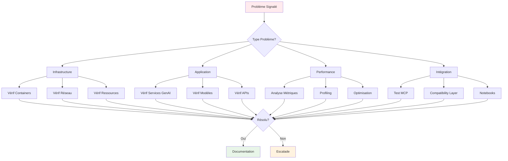

# 🔧 Guide Troubleshooting GenAI - CoursIA

**Date :** 7 octobre 2025  
**Version :** 1.0 Production-Ready  
**Audience :** Administrateurs Système, Support Technique  
**Méthode :** SDDD Phase 1.3 - Guide Résolution Problèmes Complet

---

## 🎯 Méthodologie de Troubleshooting

### Approche Systématique

Le troubleshooting GenAI CoursIA suit une **approche en couches** :

1. **🔍 Diagnostic Initial** : Identification rapide du problème
2. **📊 Collecte d'Informations** : Logs, métriques, état des services
3. **🎯 Isolation du Problème** : Identification de la couche défaillante
4. **🔧 Résolution Ciblée** : Application de la solution appropriée
5. **✅ Validation** : Confirmation de la résolution
6. **📝 Documentation** : Enregistrement pour éviter la récurrence

### Diagramme de Diagnostic



---

## 🚨 Problèmes Courants et Solutions

### 1. Problèmes Infrastructure Docker

#### **Problème : Container ne démarre pas**

**Symptômes :**
- Container en état "Exited" immédiatement
- Erreur "docker: Error response from daemon"
- Logs montrent erreurs de démarrage

**Diagnostic :**

```powershell
# Vérification état containers
docker ps -a --filter "name=coursia"

# Vérification logs détaillés
docker logs coursia-orchestrator --details --timestamps

# Vérification configuration
docker inspect coursia-orchestrator
```

**Solutions :**

```powershell
# Solution 1: Vérification ports
netstat -an | findstr "819"
# Si port occupé, modifier dans .env ou arrêter processus

# Solution 2: Vérification ressources
docker system df
docker system prune -f

# Solution 3: Reconstruction image
docker-compose build --no-cache coursia-orchestrator
docker-compose up -d coursia-orchestrator

# Solution 4: Reset complet container
docker stop coursia-orchestrator
docker rm coursia-orchestrator
docker rmi coursia/genai-orchestrator:latest
docker-compose up -d coursia-orchestrator
```

**Validation :**
```powershell
# Vérification santé
curl http://localhost:8193/health
# Attendre réponse HTTP 200
```

---

#### **Problème : Erreurs réseau entre containers**

**Symptômes :**
- Services ne peuvent pas communiquer
- Erreurs "connection refused" ou "host not found"
- Timeouts lors des appels inter-services

**Diagnostic :**

```powershell
# Vérification réseaux Docker
docker network ls | findstr "genai"

# Inspection réseau
docker network inspect genai-network

# Test connectivité interne
docker exec coursia-orchestrator ping coursia-flux-1-dev
```

**Solutions :**

```powershell
# Solution 1: Recréation réseau
docker network rm genai-network
docker-compose up -d

# Solution 2: Vérification configuration DNS
docker exec coursia-orchestrator nslookup coursia-flux-1-dev

# Solution 3: Reset configuration réseau
docker-compose down
docker system prune --networks
docker-compose up -d

# Solution 4: Vérification firewall Windows
New-NetFirewallRule -DisplayName "Docker GenAI" -Direction Inbound -Protocol TCP -LocalPort 8189,8190,8191,8193 -Action Allow
```

---

#### **Problème : Volumes Docker corrompus ou inaccessibles**

**Symptômes :**
- Erreurs "no such file or directory"
- Modèles ou données manquants
- Permissions refusées

**Diagnostic :**

```powershell
# Vérification volumes
docker volume ls | findstr "genai"
docker volume inspect genai-models

# Vérification montage
docker exec coursia-flux-1-dev ls -la /app/models
```

**Solutions :**

```powershell
# Solution 1: Recréation volumes (ATTENTION: perte de données)
docker-compose down -v
docker volume rm genai-models genai-outputs genai-cache
docker-compose up -d

# Solution 2: Correction permissions
docker exec -u root coursia-flux-1-dev chown -R 1000:1000 /app/models
docker exec -u root coursia-flux-1-dev chmod -R 755 /app/models

# Solution 3: Sauvegarde et restauration
docker run --rm -v genai-models:/volume -v ${PWD}/backup:/backup alpine tar czf /backup/models-backup.tar.gz -C /volume .
# Après correction:
docker run --rm -v genai-models:/volume -v ${PWD}/backup:/backup alpine tar xzf /backup/models-backup.tar.gz -C /volume
```

---

### 2. Problèmes Services GenAI

#### **Problème : Modèles GenAI non chargés**

**Symptômes :**
- Erreur "Model not found" ou "Model failed to load"
- Temps de démarrage très long
- Génération d'images échoue

**Diagnostic :**

```powershell
# Vérification présence modèles
docker exec coursia-flux-1-dev ls -la /app/models/
docker exec coursia-flux-1-dev du -sh /app/models/*

# Vérification logs modèles
docker logs coursia-flux-1-dev | Select-String -Pattern "model|load|error"

# Test API modèle
curl "http://localhost:8189/system_stats"
```

**Solutions :**

```powershell
# Solution 1: Téléchargement manuel modèles
# Vérifier data/models/DOWNLOAD_REQUIRED.txt pour instructions

# Solution 2: Vérification espace disque
docker exec coursia-flux-1-dev df -h /app/models

# Solution 3: Restart avec rebuild
docker-compose stop coursia-flux-1-dev
docker-compose build --no-cache coursia-flux-1-dev
docker-compose up -d coursia-flux-1-dev

# Solution 4: Test avec modèle plus petit
# Modifier .env pour utiliser modèle de développement
# FLUX_MODEL_SIZE=small
```

---

#### **Problème : API GenAI lente ou timeouts**

**Symptômes :**
- Réponses API > 30 secondes
- Erreurs 504 Gateway Timeout
- Génération d'images interrompue

**Diagnostic :**

```powershell
# Vérification charge système
docker stats coursia-flux-1-dev coursia-sd35

# Vérification GPU (si applicable)
nvidia-smi

# Test performance API
$stopwatch = [System.Diagnostics.Stopwatch]::StartNew()
curl "http://localhost:8189/health"
$stopwatch.Stop()
Write-Host "Temps réponse: $($stopwatch.ElapsedMilliseconds)ms"
```

**Solutions :**

```powershell
# Solution 1: Augmentation ressources
# Modifier .env
# FLUX_MEMORY_LIMIT=16GB
# FLUX_CPU_LIMIT=8.0
docker-compose up -d coursia-flux-1-dev

# Solution 2: Optimisation configuration
# Réduction qualité pour tests
# FLUX_BATCH_SIZE=1
# FLUX_PRECISION=fp16

# Solution 3: Fallback vers cloud
# Modifier dans notebook:
# %env GENAI_MODE=cloud
# %env FALLBACK_REASON=performance_issues
```

---

### 3. Problèmes Intégration MCP

#### **Problème : Notebooks existants cassés**

**Symptômes :**
- Erreur "Module not found" dans notebooks classiques
- Notebooks SemanticKernel ne fonctionnent plus
- Interface Papermill modifiée

**Diagnostic :**

```powershell
# Test notebook classique
jupyter nbconvert --execute MyIA.AI.Notebooks/ML/ML-1-Introduction.ipynb

# Vérification MCP classique
# Tester si l'ExecutionManager original fonctionne encore

# Vérification logs intégration
Get-Content logs/genai-integration*.log | Select-String -Pattern "error|exception"
```

**Solutions :**

```powershell
# Solution 1: Désactivation temporaire intégration GenAI
# Modifier .env
# MCP_INTEGRATION_ENABLED=false
# COMPATIBILITY_LAYER_ENABLED=false

# Solution 2: Reset vers MCP original
cd notebook-infrastructure
git checkout HEAD -- mcp_settings.json

# Solution 3: Mode compatibilité forcé
# Modifier src/genai_integration/config.py
# CLASSIC_EXECUTOR_PRIORITY=true
# FALLBACK_TO_CLASSIC=true

# Solution 4: Rollback complet intégration
./scripts/rollback-genai-integration.ps1
```

---

#### **Problème : Détection type notebook incorrecte**

**Symptômes :**
- Notebooks classiques routés vers GenAI
- Notebooks GenAI traités comme classiques
- Erreurs de compatibilité

**Diagnostic :**

```powershell
# Test détection manuelle
python -c "
from src.genai_integration.compatibility_layer import GenAICompatibilityLayer
import asyncio
async def test():
    layer = GenAICompatibilityLayer(None, None)
    type = await layer.detect_notebook_type('MyIA.AI.Notebooks/ML/ML-1-Introduction.ipynb')
    print(f'Type détecté: {type}')
asyncio.run(test())
"
```

**Solutions :**

```powershell
# Solution 1: Ajustement règles détection
# Modifier src/genai_integration/compatibility_layer.py
# Augmenter seuils de détection

# Solution 2: Metadata explicite
# Ajouter dans notebooks:
# "metadata": {"genai": {"enabled": true}}

# Solution 3: Override manuel
# Force type dans paramètres:
# notebook_type_override="classic"
```

---

### 4. Problèmes Performance

#### **Problème : Consommation mémoire excessive**

**Symptômes :**
- Système lent ou qui freeze
- Erreurs "Out of memory"
- Containers tués par OOM killer

**Diagnostic :**

```powershell
# Monitoring mémoire temps réel
docker stats --no-stream

# Vérification mémoire système
Get-Counter "\Memory\Available MBytes"

# Analyse utilisation par processus
Get-Process | Sort-Object WorkingSet -Descending | Select-Object -First 10
```

**Solutions :**

```powershell
# Solution 1: Réduction limits mémoire
# Modifier .env
# FLUX_MEMORY_LIMIT=8GB
# SD35_MEMORY_LIMIT=12GB
docker-compose up -d

# Solution 2: Nettoyage cache
docker exec coursia-flux-1-dev rm -rf /app/cache/*
docker system prune -f

# Solution 3: Mode économique
# FLUX_BATCH_SIZE=1
# COMFYUI_MEMORY_LIMIT=4GB
# ENABLE_MEMORY_OPTIMIZATION=true

# Solution 4: Scaling down
docker-compose down
docker-compose up -d orchestrator  # Services essentiels seulement
```

---

#### **Problème : Génération d'images très lente**

**Symptômes :**
- Temps génération > 5 minutes
- CPU/GPU sous-utilisés
- File d'attente accumulation

**Diagnostic :**

```powershell
# Vérification utilisation GPU
nvidia-smi -l 1

# Monitoring charge containers
docker exec coursia-flux-1-dev top

# Test génération simple
curl -X POST "http://localhost:8189/generate" -H "Content-Type: application/json" -d '{
  "prompt": "test image",
  "width": 256,
  "height": 256,
  "steps": 10
}'
```

**Solutions :**

```powershell
# Solution 1: Optimisation paramètres
# Réduction qualité pour debug
# FLUX_STEPS=10
# FLUX_SIZE=512x512

# Solution 2: Vérification pilotes GPU
nvidia-smi
# Mise à jour pilotes si nécessaire

# Solution 3: Mode CPU fallback
# CUDA_VISIBLE_DEVICES=""
# USE_CPU_ONLY=true

# Solution 4: Profiling performance
docker exec coursia-flux-1-dev python -m cProfile -o profile.stats /app/main.py
```

---

### 5. Scripts de Diagnostic Automatisé

#### **Script de Diagnostic Complet**

```powershell
# scripts/diagnose-genai-issues.ps1

<#
.SYNOPSIS
Script de diagnostic complet pour infrastructure GenAI

.DESCRIPTION
Collecte automatique d'informations pour troubleshooting :
- État des containers et services
- Métriques de performance
- Logs d'erreurs
- Configuration système
- Tests de connectivité

.PARAMETER GenerateReport
Génère un rapport HTML complet

.PARAMETER TestMode
Mode test avec validations étendues
#>

[CmdletBinding()]
param(
    [switch]$GenerateReport,
    [switch]$TestMode,
    [switch]$Verbose
)

$ErrorActionPreference = "Continue"  # Continue malgré les erreurs
if ($Verbose) { $VerbosePreference = "Continue" }

# Configuration
$REPORT_DIR = "diagnostic-reports"
$TIMESTAMP = Get-Date -Format "yyyyMMdd_HHmmss"
$REPORT_FILE = "$REPORT_DIR/genai-diagnostic-$TIMESTAMP.html"

Write-Host "🔍 Diagnostic GenAI CoursIA - Infrastructure" -ForegroundColor Cyan
Write-Host "Timestamp: $(Get-Date)" -ForegroundColor Green

# Création répertoire rapports
if ($GenerateReport -and -not (Test-Path $REPORT_DIR)) {
    New-Item -Path $REPORT_DIR -ItemType Directory -Force | Out-Null
}

# Structure rapport
$diagnosticData = @{
    Timestamp = Get-Date
    System = @{}
    Docker = @{}
    Services = @{}
    Network = @{}
    Performance = @{}
    Logs = @{}
    Issues = @()
    Recommendations = @()
}

function Write-DiagnosticSection {
    [CmdletBinding()]
    param(
        [string]$Title,
        [string]$Color = "Yellow"
    )
    Write-Host "`n═══ $Title ═══" -ForegroundColor $Color
}

function Test-ServiceHealth {
    [CmdletBinding()]
    param(
        [string]$ServiceName,
        [string]$Endpoint,
        [int]$TimeoutSeconds = 10
    )
    
    try {
        Write-Verbose "Test santé: $ServiceName -> $Endpoint"
        
        $response = Invoke-WebRequest -Uri $Endpoint -TimeoutSec $TimeoutSeconds -UseBasicParsing
        
        return @{
            Service = $ServiceName
            Status = "Healthy"
            ResponseCode = $response.StatusCode
            ResponseTime = $response.Headers.'X-Response-Time'
        }
    }
    catch {
        return @{
            Service = $ServiceName
            Status = "Unhealthy"
            Error = $_.Exception.Message
        }
    }
}

# ===== DIAGNOSTIC SYSTÈME =====
Write-DiagnosticSection "SYSTÈME"

try {
    $osInfo = Get-ComputerInfo | Select-Object WindowsProductName, WindowsVersion, TotalPhysicalMemory
    $diskInfo = Get-PSDrive C | Select-Object Used, Free, @{Name="TotalSize"; Expression={$_.Used + $_.Free}}
    
    $diagnosticData.System = @{
        OS = $osInfo
        Disk = $diskInfo
        PowerShell = $PSVersionTable.PSVersion
        DateTime = Get-Date
    }
    
    Write-Host "✅ OS: $($osInfo.WindowsProductName)" -ForegroundColor Green
    Write-Host "✅ RAM: $([math]::Round($osInfo.TotalPhysicalMemory / 1GB, 1))GB" -ForegroundColor Green
    Write-Host "✅ Disque C: $([math]::Round($diskInfo.Free / 1GB, 1))GB libre" -ForegroundColor Green
}
catch {
    Write-Host "❌ Erreur diagnostic système: $_" -ForegroundColor Red
    $diagnosticData.Issues += "Erreur collecte informations système: $_"
}

# ===== DIAGNOSTIC DOCKER =====
Write-DiagnosticSection "DOCKER"

try {
    # Version Docker
    $dockerVersion = docker --version 2>$null
    if ($LASTEXITCODE -eq 0) {
        Write-Host "✅ $dockerVersion" -ForegroundColor Green
        $diagnosticData.Docker.Version = $dockerVersion
    } else {
        Write-Host "❌ Docker non installé ou non accessible" -ForegroundColor Red
        $diagnosticData.Issues += "Docker non accessible"
    }
    
    # État containers GenAI
    $containers = docker ps -a --format "table {{.Names}}\t{{.Status}}\t{{.Ports}}" --filter "name=coursia" 2>$null
    
    if ($containers) {
        Write-Host "📦 Containers GenAI:" -ForegroundColor Cyan
        $containers | ForEach-Object { Write-Host "  $_" -ForegroundColor Gray }
        $diagnosticData.Docker.Containers = $containers
    } else {
        Write-Host "⚠️ Aucun container GenAI trouvé" -ForegroundColor Yellow
        $diagnosticData.Issues += "Aucun container GenAI détecté"
    }
    
    # Utilisation ressources Docker
    $dockerStats = docker stats --no-stream --format "table {{.Name}}\t{{.CPUPerc}}\t{{.MemUsage}}" 2>$null
    if ($dockerStats) {
        $diagnosticData.Docker.ResourceUsage = $dockerStats
        Write-Host "📊 Utilisation ressources:" -ForegroundColor Cyan
        $dockerStats | ForEach-Object { Write-Host "  $_" -ForegroundColor Gray }
    }
}
catch {
    Write-Host "❌ Erreur diagnostic Docker: $_" -ForegroundColor Red
    $diagnosticData.Issues += "Erreur Docker: $_"
}

# ===== DIAGNOSTIC SERVICES =====
Write-DiagnosticSection "SERVICES GENAI"

$services = @(
    @{ Name = "Orchestrator"; URL = "http://localhost:8193/health" },
    @{ Name = "FLUX.1-dev"; URL = "http://localhost:8189/system_stats" },
    @{ Name = "Stable Diffusion 3.5"; URL = "http://localhost:8190/health" },
    @{ Name = "ComfyUI"; URL = "http://localhost:8191/system_stats" }
)

$serviceResults = @()

foreach ($service in $services) {
    $result = Test-ServiceHealth -ServiceName $service.Name -Endpoint $service.URL
    $serviceResults += $result
    
    if ($result.Status -eq "Healthy") {
        Write-Host "✅ $($service.Name): OK ($($result.ResponseCode))" -ForegroundColor Green
    } else {
        Write-Host "❌ $($service.Name): ERREUR" -ForegroundColor Red
        Write-Host "   $($result.Error)" -ForegroundColor Red
        $diagnosticData.Issues += "Service $($service.Name) indisponible: $($result.Error)"
    }
}

$diagnosticData.Services = $serviceResults

# ===== DIAGNOSTIC RÉSEAU =====
Write-DiagnosticSection "RÉSEAU"

try {
    # Vérification ports
    $requiredPorts = @(8189, 8190, 8191, 8193, 9090, 3000)
    
    foreach ($port in $requiredPorts) {
        $portTest = Test-NetConnection -ComputerName localhost -Port $port -InformationLevel Quiet -WarningAction SilentlyContinue
        
        if ($portTest) {
            Write-Host "✅ Port $port : Accessible" -ForegroundColor Green
        } else {
            Write-Host "❌ Port $port : Non accessible" -ForegroundColor Red
            $diagnosticData.Issues += "Port $port non accessible"
        }
    }
    
    # Vérification réseaux Docker
    $dockerNetworks = docker network ls --format "{{.Name}}" 2>$null | Where-Object { $_ -match "genai" }
    
    if ($dockerNetworks) {
        Write-Host "🌐 Réseaux GenAI:" -ForegroundColor Cyan
        $dockerNetworks | ForEach-Object { Write-Host "  $_" -ForegroundColor Gray }
        $diagnosticData.Network.DockerNetworks = $dockerNetworks
    } else {
        Write-Host "⚠️ Aucun réseau GenAI trouvé" -ForegroundColor Yellow
        $diagnosticData.Issues += "Réseaux Docker GenAI manquants"
    }
}
catch {
    Write-Host "❌ Erreur diagnostic réseau: $_" -ForegroundColor Red
    $diagnosticData.Issues += "Erreur réseau: $_"
}

# ===== DIAGNOSTIC PERFORMANCE =====
Write-DiagnosticSection "PERFORMANCE"

try {
    # CPU et mémoire
    $cpuUsage = Get-Counter "\Processor(_Total)\% Processor Time" -SampleInterval 1 -MaxSamples 1
    $memUsage = Get-Counter "\Memory\Available MBytes" -SampleInterval 1 -MaxSamples 1
    
    $cpuPercent = [math]::Round($cpuUsage.CounterSamples.CookedValue, 1)
    $memAvailableMB = [math]::Round($memUsage.CounterSamples.CookedValue, 0)
    
    Write-Host "🔥 CPU: $cpuPercent%" -ForegroundColor $(if ($cpuPercent > 80) { "Red" } elseif ($cpuPercent > 60) { "Yellow" } else { "Green" })
    Write-Host "💾 Mémoire disponible: ${memAvailableMB}MB" -ForegroundColor $(if ($memAvailableMB < 2000) { "Red" } elseif ($memAvailableMB < 4000) { "Yellow" } else { "Green" })
    
    $diagnosticData.Performance = @{
        CPU = $cpuPercent
        MemoryAvailableMB = $memAvailableMB
    }
    
    # Alertes performance
    if ($cpuPercent > 80) {
        $diagnosticData.Issues += "Utilisation CPU élevée: $cpuPercent%"
    }
    if ($memAvailableMB < 2000) {
        $diagnosticData.Issues += "Mémoire disponible faible: ${memAvailableMB}MB"
    }
}
catch {
    Write-Host "❌ Erreur diagnostic performance: $_" -ForegroundColor Red
    $diagnosticData.Issues += "Erreur performance: $_"
}

# ===== DIAGNOSTIC LOGS =====
Write-DiagnosticSection "LOGS"

try {
    # Logs récents containers
    $containerLogs = @{}
    
    $genaiContainers = @("coursia-orchestrator", "coursia-flux-1-dev", "coursia-sd35")
    
    foreach ($container in $genaiContainers) {
        try {
            $logs = docker logs --tail 10 $container 2>$null
            if ($logs) {
                $containerLogs[$container] = $logs
                Write-Host "📄 $container : $($logs.Count) lignes récentes" -ForegroundColor Cyan
                
                # Recherche erreurs
                $errors = $logs | Select-String -Pattern "error|exception|failed" -CaseSensitive:$false
                if ($errors) {
                    Write-Host "   ⚠️ $($errors.Count) erreurs trouvées" -ForegroundColor Yellow
                    $diagnosticData.Issues += "$container : $($errors.Count) erreurs dans les logs"
                }
            }
        }
        catch {
            Write-Verbose "Container $container non accessible pour logs"
        }
    }
    
    $diagnosticData.Logs = $containerLogs
}
catch {
    Write-Host "❌ Erreur diagnostic logs: $_" -ForegroundColor Red
}

# ===== TESTS ÉTENDUS =====
if ($TestMode) {
    Write-DiagnosticSection "TESTS ÉTENDUS"
    
    # Test génération image simple
    try {
        Write-Host "🎨 Test génération image..." -ForegroundColor Cyan
        
        $testPayload = @{
            prompt = "simple test image"
            width = 256
            height = 256
        } | ConvertTo-Json
        
        $response = Invoke-WebRequest -Uri "http://localhost:8193/generate" -Method POST -Body $testPayload -ContentType "application/json" -TimeoutSec 60
        
        if ($response.StatusCode -eq 200) {
            Write-Host "✅ Test génération: OK" -ForegroundColor Green
        } else {
            Write-Host "⚠️ Test génération: Réponse $($response.StatusCode)" -ForegroundColor Yellow
        }
    }
    catch {
        Write-Host "❌ Test génération: ÉCHEC - $_" -ForegroundColor Red
        $diagnosticData.Issues += "Test génération d'image échoué: $_"
    }
    
    # Test intégration MCP
    try {
        Write-Host "🔗 Test intégration MCP..." -ForegroundColor Cyan
        
        if (Test-Path "src/genai_integration/health_dashboard.py") {
            $response = Invoke-WebRequest -Uri "http://localhost:8194/health" -TimeoutSec 10 -UseBasicParsing
            
            if ($response.StatusCode -eq 200) {
                Write-Host "✅ Intégration MCP: OK" -ForegroundColor Green
            }
        } else {
            Write-Host "⚠️ Intégration MCP non installée" -ForegroundColor Yellow
        }
    }
    catch {
        Write-Host "❌ Test intégration MCP: ÉCHEC - $_" -ForegroundColor Red
    }
}

# ===== RECOMMANDATIONS =====
Write-DiagnosticSection "RECOMMANDATIONS"

# Génération recommandations basées sur issues détectées
if ($diagnosticData.Issues.Count -eq 0) {
    Write-Host "🎉 Aucun problème critique détecté!" -ForegroundColor Green
    $diagnosticData.Recommendations += "Infrastructure GenAI semble opérationnelle"
} else {
    Write-Host "⚠️ $($diagnosticData.Issues.Count) problème(s) détecté(s):" -ForegroundColor Yellow
    
    foreach ($issue in $diagnosticData.Issues) {
        Write-Host "  • $issue" -ForegroundColor Red
    }
    
    # Recommandations automatiques
    if ($diagnosticData.Issues -match "Docker non accessible") {
        $diagnosticData.Recommendations += "Installer ou démarrer Docker Desktop"
    }
    
    if ($diagnosticData.Issues -match "container.*indisponible") {
        $diagnosticData.Recommendations += "Exécuter: docker-compose up -d"
    }
    
    if ($diagnosticData.Issues -match "Port.*non accessible") {
        $diagnosticData.Recommendations += "Vérifier conflits de ports et configuration firewall"
    }
    
    if ($diagnosticData.Issues -match "CPU élevé|Mémoire.*faible") {
        $diagnosticData.Recommendations += "Réduire les limites de ressources dans .env"
    }
}

# ===== GÉNÉRATION RAPPORT =====
if ($GenerateReport) {
    Write-DiagnosticSection "GÉNÉRATION RAPPORT"
    
    $htmlContent = Generate-DiagnosticReport -Data $diagnosticData
    Set-Content -Path $REPORT_FILE -Value $htmlContent -Encoding UTF8
    
    Write-Host "📄 Rapport généré: $REPORT_FILE" -ForegroundColor Green
    
    # Ouverture automatique
    if (Test-Path $REPORT_FILE) {
        Start-Process $REPORT_FILE
    }
}

# ===== RÉSUMÉ FINAL =====
Write-DiagnosticSection "RÉSUMÉ DIAGNOSTIC" -Color "Cyan"

$healthyServices = ($diagnosticData.Services | Where-Object { $_.Status -eq "Healthy" }).Count
$totalServices = $diagnosticData.Services.Count
$healthScore = if ($totalServices -gt 0) { [math]::Round(($healthyServices / $totalServices) * 100, 0) } else { 0 }

Write-Host "🏥 Score santé global: $healthScore% ($healthyServices/$totalServices services OK)" -ForegroundColor $(if ($healthScore -ge 80) { "Green" } elseif ($healthScore -ge 60) { "Yellow" } else { "Red" })
Write-Host "⚠️ Problèmes détectés: $($diagnosticData.Issues.Count)" -ForegroundColor $(if ($diagnosticData.Issues.Count -eq 0) { "Green" } else { "Red" })

if ($diagnosticData.Recommendations.Count -gt 0) {
    Write-Host "💡 Recommandations:" -ForegroundColor Cyan
    foreach ($rec in $diagnosticData.Recommendations) {
        Write-Host "  • $rec" -ForegroundColor White
    }
}

Write-Host "`n🎯 Diagnostic terminé - $(Get-Date)" -ForegroundColor Green

function Generate-DiagnosticReport {
    [CmdletBinding()]
    param([hashtable]$Data)
    
    $healthyServices = ($Data.Services | Where-Object { $_.Status -eq "Healthy" }).Count
    $totalServices = $Data.Services.Count
    $healthScore = if ($totalServices -gt 0) { [math]::Round(($healthyServices / $totalServices) * 100, 0) } else { 0 }
    
    return @"
<!DOCTYPE html>
<html lang="fr">
<head>
    <meta charset="UTF-8">
    <title>Diagnostic GenAI CoursIA - $($Data.Timestamp.ToString('yyyy-MM-dd HH:mm'))</title>
    <style>
        body { font-family: 'Segoe UI', sans-serif; margin: 20px; background: #f5f5f5; }
        .container { max-width: 1200px; margin: 0 auto; background: white; padding: 30px; border-radius: 8px; box-shadow: 0 2px 10px rgba(0,0,0,0.1); }
        .header { text-align: center; margin-bottom: 30px; }
        .health-score { font-size: 3em; font-weight: bold; color: $(if ($healthScore -ge 80) { "#4caf50" } elseif ($healthScore -ge 60) { "#ff9800" } else { "#f44336" }); }
        .section { margin: 20px 0; padding: 20px; border-left: 4px solid #2196f3; background: #f8f9fa; }
        .issue { background: #ffebee; border-left-color: #f44336; }
        .success { background: #e8f5e8; border-left-color: #4caf50; }
        .services { display: grid; grid-template-columns: repeat(auto-fit, minmax(250px, 1fr)); gap: 15px; }
        .service { padding: 15px; border-radius: 5px; }
        .service.healthy { background: #e8f5e8; }
        .service.unhealthy { background: #ffebee; }
    </style>
</head>
<body>
    <div class="container">
        <div class="header">
            <h1>🔍 Diagnostic GenAI CoursIA</h1>
            <p>Généré le: $($Data.Timestamp.ToString('dddd dd MMMM yyyy à HH:mm'))</p>
            <div class="health-score">$healthScore%</div>
            <p>Score de santé global</p>
        </div>
        
        <div class="section">
            <h3>📊 Résumé Services</h3>
            <div class="services">
                $(foreach ($service in $Data.Services) {
                    $statusClass = if ($service.Status -eq "Healthy") { "healthy" } else { "unhealthy" }
                    $statusIcon = if ($service.Status -eq "Healthy") { "✅" } else { "❌" }
                    "<div class='service $statusClass'><strong>$statusIcon $($service.Service)</strong><br/>$($service.Status)</div>"
                })
            </div>
        </div>
        
        $(if ($Data.Issues.Count -gt 0) {
            "<div class='section issue'>
                <h3>⚠️ Problèmes Détectés ($($Data.Issues.Count))</h3>
                <ul>$(foreach ($issue in $Data.Issues) { "<li>$issue</li>" })</ul>
            </div>"
        })
        
        $(if ($Data.Recommendations.Count -gt 0) {
            "<div class='section'>
                <h3>💡 Recommandations</h3>
                <ul>$(foreach ($rec in $Data.Recommendations) { "<li>$rec</li>" })</ul>
            </div>"
        })
        
        <div class="section">
            <h3>🖥️ Informations Système</h3>
            <ul>
                <li><strong>OS:</strong> $($Data.System.OS.WindowsProductName)</li>
                <li><strong>RAM:</strong> $([math]::Round($Data.System.OS.TotalPhysicalMemory / 1GB, 1))GB</li>
                <li><strong>Disque libre:</strong> $([math]::Round($Data.System.Disk.Free / 1GB, 1))GB</li>
                <li><strong>PowerShell:</strong> $($Data.System.PowerShell)</li>
            </ul>
        </div>
        
        $(if ($Data.Performance) {
            "<div class='section'>
                <h3>⚡ Performance</h3>
                <ul>
                    <li><strong>CPU:</strong> $($Data.Performance.CPU)%</li>
                    <li><strong>Mémoire disponible:</strong> $($Data.Performance.MemoryAvailableMB)MB</li>
                </ul>
            </div>"
        })
    </div>
</body>
</html>
"@
}

# Exemple exécution
if ($MyInvocation.InvocationName -ne '.') {
    Write-Host "Usage:" -ForegroundColor Yellow
    Write-Host "  .\diagnose-genai-issues.ps1" -ForegroundColor White
    Write-Host "  .\diagnose-genai-issues.ps1 -GenerateReport" -ForegroundColor White
    Write-Host "  .\diagnose-genai-issues.ps1 -TestMode -GenerateReport" -ForegroundColor White
}
```

---

## 📚 Base de Connaissances Troubleshooting

### Messages d'Erreur Courants

| **Message d'Erreur** | **Cause Probable** | **Solution** |
|:---|:---|:---|
| `docker: Error response from daemon: driver failed programming external connectivity on endpoint` | Port déjà utilisé | `netstat -an \| findstr :8189` puis killer processus ou changer port |
| `CUDA out of memory` | Mémoire GPU insuffisante | Réduire `BATCH_SIZE` ou `GPU_MEMORY_LIMIT` |
| `ModuleNotFoundError: No module named 'diffusers'` | Dépendances manquantes | Reconstruire image: `docker-compose build --no-cache` |
| `Connection refused` | Service non démarré | `docker-compose up -d <service>` |
| `Model not found` | Modèles non téléchargés | Voir `data/models/DOWNLOAD_REQUIRED.txt` |
| `Health check failed` | Service défaillant | Vérifier logs: `docker logs <container>` |

### Commandes de Récupération Rapide

```powershell
# Reset complet infrastructure
docker-compose down -v --remove-orphans
docker system prune -af --volumes
docker-compose up -d

# Redémarrage service spécifique
docker-compose restart coursia-flux-1-dev

# Reconstruction image corrompue
docker-compose build --no-cache coursia-flux-1-dev
docker-compose up -d coursia-flux-1-dev

# Nettoyage espace disque
docker system prune -af
docker volume prune -f

# Vérification santé globale
docker ps --format "table {{.Names}}\t{{.Status}}\t{{.Ports}}"
```

**Ce guide de troubleshooting fournit une approche systématique pour résoudre tous les problèmes courants de l'infrastructure GenAI CoursIA.**