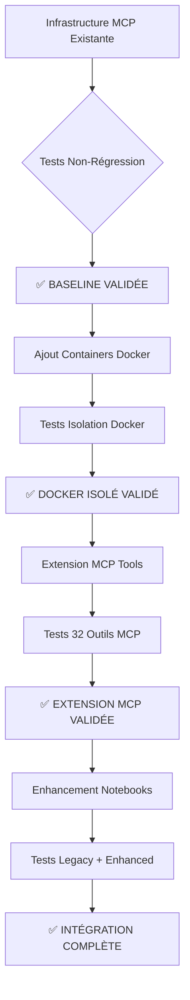

# 🔗 Plan d'Intégration GenAI Images - CoursIA

**Date :** 7 octobre 2025  
**Méthode :** SDDD avec Préservation Totale Infrastructure Existante  
**Mission :** Phase 2.2 - Stratégie d'Intégration Sans Régression

---

## 🎯 Principe Directeur : ZÉRO RÉGRESSION

**PRÉSERVATION ABSOLUE :** L'infrastructure MCP actuelle est **exceptionnellement mature** et **production-ready**. Toute intégration doit :
- ✅ Préserver les 22+ outils MCP existants
- ✅ Maintenir l'ExecutionManager async (timeouts illimités)
- ✅ Conserver l'architecture subprocess isolation 
- ✅ Garder la compatibilité Papermill-CoursIA
- ✅ Protéger les notebooks existants (img2img_cross_stitch_pattern_maker.ipynb)

---

## 📊 Analyse de l'Existant à Préserver

### 1. Infrastructure MCP Critique

```yaml
# Configuration MCP actuelle (À PRÉSERVER INTÉGRALEMENT)
mcp_settings.json:
  servers:
    jupyter-papermill-mcp-server:
      enabled: true
      architecture: subprocess_isolation  # CRITIQUE
      environment: mcp-jupyter-py310       # CRITIQUE
      tools: 22+                          # TOUS PRÉSERVÉS
      timeout: unlimited                   # ExecutionManager async
```

#### Outils MCP Existants (TOUS PRÉSERVÉS)
```python
EXISTING_MCP_TOOLS = [
    # Core Execution (CRITIQUES)
    "execute_notebook_sync",
    "start_notebook_async", 
    "get_execution_status_async",
    "cancel_job",
    "list_jobs",
    
    # Notebook Management (PRÉSERVÉS)
    "read_notebook",
    "write_notebook", 
    "create_notebook",
    "add_cell",
    "update_cell",
    
    # Kernel Management (PRÉSERVÉS)
    "list_kernels",
    "start_kernel",
    "stop_kernel",
    "restart_kernel",
    "get_kernel_status",
    
    # Advanced Features (PRÉSERVÉS)
    "parameterize_notebook",
    "execute_notebook_papermill",
    "validate_notebook",
    "system_info",
    "cleanup_all_kernels"
]
```

### 2. Architecture Subprocess Critique

```python
# Architecture subprocess (À PRÉSERVER ABSOLUMENT)
SUBPROCESS_COMMAND = [
    "conda", "run", "-n", "mcp-jupyter-py310",
    "python", "-m", "papermill_mcp.main"
]

# Variables d'environnement critiques (TOUTES PRÉSERVÉES)
CRITICAL_ENV_VARS = {
    # .NET Variables (CRITIQUES pour notebooks .NET)
    "DOTNET_ROOT": "/path/to/dotnet",
    "MSBuildSDKsPath": "/path/to/sdk",  
    "PATH": "enhanced_path_with_dotnet",
    
    # Conda Variables (CRITIQUES pour isolation)
    "CONDA_DEFAULT_ENV": "mcp-jupyter-py310",
    "CONDA_PREFIX": "/path/to/conda/envs/mcp-jupyter-py310",
    
    # OpenAI Variables (EXISTANTES)
    "OPENAI_API_KEY": "sk-...",
    "OPENAI_BASE_URL": "https://api.openai.com/v1"
}
```

---

## 🔄 Stratégie d'Extension Non-Intrusive

### 1. Pattern d'Extension par Composition

```python
# NOUVEAU: GenAIExtension (S'AJOUTE à l'existant)
class GenAIImageExtension:
    """
    Extension GenAI qui s'ajoute à l'infrastructure MCP existante
    AUCUNE modification des outils existants
    """
    
    def __init__(self, existing_mcp_server):
        # Réutilise l'infrastructure existante
        self.execution_manager = existing_mcp_server.execution_manager  # RÉUTILISE
        self.notebook_service = existing_mcp_server.notebook_service    # RÉUTILISE
        
        # Ajoute nouvelles capacités
        self.genai_manager = GenAIImageManager()         # NOUVEAU
        self.docker_orchestrator = DockerOrchestrator()  # NOUVEAU
        self.openrouter_client = OpenRouterClient()      # NOUVEAU
```

### 2. Nouveaux Outils MCP (Extensions Uniquement)

```python
# NOUVEAUX outils MCP (S'AJOUTENT aux 22 existants)
NEW_GENAI_TOOLS = [
    # Image Generation (NOUVEAUX)
    "generate_image_openrouter",      # GPT-5 via OpenRouter
    "generate_image_local",           # FLUX/SD3.5 via Docker
    "edit_image_qwen",                # Qwen-Image-Edit-2509
    
    # Docker Management (NOUVEAUX)
    "start_genai_container",          # Démarre FLUX/SD3.5/ComfyUI
    "stop_genai_container",           # Arrête containers
    "list_genai_models",              # Liste modèles disponibles
    "get_genai_model_status",         # Statut modèles
    
    # Workflow Orchestration (NOUVEAUX) 
    "create_image_workflow",          # Workflows multi-modèles
    "execute_batch_generation",       # Génération en lot
    "validate_genai_environment",     # Validation setup GenAI
    "monitor_genai_resources"         # Monitoring ressources
]

# Configuration finale MCP (22 EXISTANTS + 10 NOUVEAUX = 32 outils)
TOTAL_MCP_TOOLS = EXISTING_MCP_TOOLS + NEW_GENAI_TOOLS  # 32 outils
```

---

## 🐳 Intégration Docker Non-Intrusive

### 1. Architecture Docker Isolée

```yaml
# Architecture Docker complètement séparée de MCP
docker-compose.genai.yml:
version: '3.8'
services:
  # Containers GenAI (NOUVEAUX, isolation complète)
  genai-flux:
    image: comfyanonymous/comfyui:latest
    ports: ["8189:8188"]
    networks: ["genai-network"]  # Réseau séparé
    
  genai-sd35:
    image: huggingface/diffusers:latest  
    ports: ["8190:8000"]
    networks: ["genai-network"]
    
  genai-comfyui:
    image: comfyanonymous/comfyui:latest
    ports: ["8191:8188"] 
    networks: ["genai-network"]

networks:
  genai-network:
    driver: bridge
    ipam:
      config:
        - subnet: 172.20.0.0/16  # Subnet dédié
```

### 2. Orchestration Sans Impact MCP

```python
class DockerOrchestrator:
    """
    Orchestrateur Docker complètement indépendant du MCP
    Communication via API REST uniquement
    """
    
    def __init__(self):
        self.containers = {}
        self.health_checkers = {}
        # AUCUNE dépendance vers infrastructure MCP
        
    async def start_model(self, model_name):
        """Démarre un container sans affecter MCP"""
        container = await self._start_container(model_name)
        await self._wait_healthy(container)
        return container.endpoint_url
        
    async def ensure_models_for_notebook(self, notebook_path):
        """
        Analyse notebook et démarre containers nécessaires
        AVANT l'exécution via MCP existant
        """
        required_models = self._analyze_notebook_requirements(notebook_path)
        endpoints = {}
        
        for model in required_models:
            endpoints[model] = await self.start_model(model)
            
        return endpoints  # Variables d'environnement pour MCP
```

---

## 📝 Préservation des Notebooks Existants

### 1. Migration img2img_cross_stitch_pattern_maker.ipynb

```python
# STRATÉGIE: Extension compatible sans modification structure
MIGRATION_STRATEGY = {
    "preservation": {
        # Structure originale PRÉSERVÉE
        "original_cells": "ALL_PRESERVED",
        "original_logic": "UNCHANGED", 
        "original_imports": "MAINTAINED",
        
        # Extensions ajoutées EN PLUS
        "new_models": ["flux-1", "sd35", "qwen-edit"],
        "new_endpoints": ["openrouter", "docker-local"],
        "new_features": ["batch-generation", "style-transfer"]
    },
    
    "compatibility": {
        # Mode legacy TOUJOURS fonctionnel
        "legacy_mode": True,
        "legacy_dependencies": "stable-diffusion==1.x",
        
        # Mode enhanced OPTIONNEL
        "enhanced_mode": "opt-in",
        "enhanced_models": "additional_choice"
    }
}
```

### 2. Pattern de Migration Générique

```python
# Pattern applicable à TOUS les notebooks existants
class NotebookMigrationPattern:
    """
    Pattern de migration non-destructif pour tous notebooks CoursIA
    """
    
    def enhance_notebook(self, notebook_path):
        """
        Ajoute capacités GenAI SANS modifier le code existant
        """
        # 1. Analyse du notebook existant
        existing_cells = self.read_notebook(notebook_path)
        
        # 2. Ajout de cellules OPTIONNELLES en début
        enhanced_cells = [
            self.create_parameter_cell(),     # Parameters Papermill
            self.create_genai_setup_cell(),   # GenAI setup OPTIONNEL
            *existing_cells,                  # Cellules ORIGINALES
            self.create_enhanced_features()   # Fonctionnalités BONUS
        ]
        
        # 3. Sauvegarde version enhanced séparée
        enhanced_path = notebook_path.replace('.ipynb', '-enhanced.ipynb')
        self.write_notebook(enhanced_path, enhanced_cells)
        
        return {
            "original": notebook_path,        # Version originale PRÉSERVÉE
            "enhanced": enhanced_path         # Version améliorée OPTIONNELLE
        }
```

---

## 🔌 Extension Infrastructure MCP

### 1. Configuration MCP Enrichie (Non-Intrusive)

```json
{
  "mcpServers": {
    "jupyter-papermill-mcp-server": {
      "enabled": true,
      "architecture": "subprocess_isolation",
      "environment": "mcp-jupyter-py310",
      
      "environment_extensions": {
        "genai": {
          "enabled": false,
          "openrouter_api_key": "${OPENROUTER_API_KEY}",
          "docker_endpoints": {
            "flux": "http://localhost:8189",
            "sd35": "http://localhost:8190", 
            "comfyui": "http://localhost:8191"
          }
        }
      },
      
      "tools": {
        "existing": {
          "count": 22,
          "status": "PRESERVED_UNCHANGED"
        },
        "extensions": {
          "genai": {
            "count": 10,
            "status": "OPTIONAL_ADDON",
            "activation": "environment_extensions.genai.enabled"
          }
        }
      }
    }
  }
}
```

### 2. Variables d'Environnement Étendues (Additives)

```bash
# .env.existing (PRÉSERVÉ intégralement)
OPENAI_API_KEY=sk-...
OPENAI_BASE_URL=https://api.openai.com/v1
DOTNET_ROOT=/path/to/dotnet
MSBuildSDKsPath=/path/to/sdk

# .env.genai-extension (NOUVEAU fichier séparé)
# Chargé SEULEMENT si GenAI activé
OPENROUTER_API_KEY=sk-or-...
OPENROUTER_BASE_URL=https://openrouter.ai/api/v1
GENAI_DOCKER_FLUX=http://localhost:8189
GENAI_DOCKER_SD35=http://localhost:8190
GENAI_DOCKER_COMFYUI=http://localhost:8191
GENAI_ENABLE_MONITORING=true
GENAI_MAX_CONCURRENT=3
```

### 3. Injection d'Environnement Conditionnelle

```python
class EnvironmentManager:
    """
    Gestionnaire d'environnement qui ÉTEND sans modifier
    """
    
    def __init__(self):
        # Variables existantes TOUJOURS présentes
        self.base_env = self.load_existing_environment()  # PRÉSERVÉES
        
        # Extensions GenAI CONDITIONNELLES
        self.genai_extensions = {}
        if self.is_genai_enabled():
            self.genai_extensions = self.load_genai_environment()
    
    def get_execution_environment(self, notebook_path):
        """
        Retourne environnement adapté au notebook
        """
        env = self.base_env.copy()  # Base TOUJOURS présente
        
        # Ajout extensions si notebook GenAI détecté
        if self.is_genai_notebook(notebook_path):
            env.update(self.genai_extensions)
            
        return env
```

---

## 🧪 Validation et Tests d'Intégration

### 1. Tests de Non-Régression

```python
# Suite de tests CRITIQUE pour validation zéro régression
NON_REGRESSION_TESTS = {
    "mcp_tools_existing": {
        "test": "Validation des 22 outils MCP existants",
        "notebooks": [
            "MyIA.AI.Notebooks/ML/ML-1-Introduction.ipynb",
            "MyIA.AI.Notebooks/Sudoku/Sudoku-1-Backtracking.ipynb",
            "MyIA.AI.Notebooks/GenAI/05-SemanticKernel-NotebookMaker.ipynb"
        ],
        "expected": "AUCUNE régression, performance identique"
    },
    
    "subprocess_isolation": {
        "test": "Architecture subprocess avec conda run",
        "validation": [
            "Variables d'environnement .NET préservées",
            "Timeout illimité ExecutionManager fonctionnel",
            "Isolation containers préservée"
        ],
        "expected": "Architecture subprocess 100% fonctionnelle"
    },
    
    "papermill_compatibility": {
        "test": "Compatibilité Papermill-CoursIA patterns",
        "features": [
            "Parameterization via cellules 'parameters'",
            "Pattern hybride widgets/batch",
            "Progress tracking et monitoring"
        ],
        "expected": "Tous patterns existants fonctionnels"
    }
}
```

### 2. Tests d'Extension Graduels

```python
INTEGRATION_PHASES = {
    "phase_1_baseline": {
        "description": "Validation infrastructure existante",
        "actions": ["Tests non-régression complets"],
        "success_criteria": "100% notebooks existants fonctionnels"
    },
    
    "phase_2_docker_isolated": {
        "description": "Ajout containers Docker isolés",  
        "actions": ["Démarrage containers", "Tests health checks"],
        "success_criteria": "Containers démarrent sans affecter MCP"
    },
    
    "phase_3_mcp_extension": {
        "description": "Ajout 10 nouveaux outils MCP",
        "actions": ["Extension outils GenAI", "Tests nouveaux endpoints"],
        "success_criteria": "32 outils MCP (22+10) fonctionnels"
    },
    
    "phase_4_notebook_enhancement": {
        "description": "Notebooks GenAI enrichis",
        "actions": ["Migration img2img", "Nouveaux notebooks GenAI"], 
        "success_criteria": "Notebooks legacy + enhanced fonctionnels"
    }
}
```

---

## 🔀 Architecture de Déploiement

### 1. Déploiement Graduel Sans Interruption



### 2. Rollback et Sécurité

```python
class DeploymentManager:
    """
    Gestionnaire de déploiement avec rollback automatique
    """
    
    def __init__(self):
        self.backup_manager = BackupManager()
        self.health_monitor = HealthMonitor()
        
    def deploy_phase(self, phase_config):
        """
        Déploie une phase avec sauvegarde automatique
        """
        # 1. Sauvegarde état actuel
        backup_id = self.backup_manager.create_backup()
        
        try:
            # 2. Déploiement de la phase
            self.execute_deployment(phase_config)
            
            # 3. Tests de validation
            if not self.validate_deployment():
                raise DeploymentValidationError("Tests failed")
                
            # 4. Monitoring santé 5 minutes
            if not self.health_monitor.monitor_stability(duration=300):
                raise HealthCheckError("Instability detected")
                
            return {"status": "success", "backup_id": backup_id}
            
        except Exception as e:
            # Rollback automatique en cas de problème
            self.backup_manager.restore_backup(backup_id)
            raise IntegrationError(f"Phase deployment failed: {e}")
```

---

## 📈 Plan de Migration des Notebooks

### 1. Catégories de Migration

```python
NOTEBOOK_MIGRATION_PLAN = {
    "category_1_preserve": {
        "description": "Notebooks critiques - Préservation totale",
        "notebooks": [
            "MyIA.AI.Notebooks/GenAI/img2img_cross_stitch_pattern_maker.ipynb",
            "MyIA.AI.Notebooks/GenAI/05-SemanticKernel-NotebookMaker.ipynb"
        ],
        "strategy": "Duplication avec version enhanced optionnelle"
    },
    
    "category_2_extend": {
        "description": "Notebooks GenAI - Extension de fonctionnalités",
        "notebooks": [
            "MyIA.AI.Notebooks/GenAI/OpenAI_Intro.ipynb",
            "MyIA.AI.Notebooks/GenAI/PromptEngineering.ipynb"
        ],
        "strategy": "Ajout cellules GenAI avancées"
    },
    
    "category_3_create": {
        "description": "Nouveaux notebooks GenAI Images", 
        "notebooks": [
            "GenAI/01-Images-Foundation/OpenAI-DALLE-Intro.ipynb",
            "GenAI/02-Images-Advanced/Qwen-Image-Edit-2509.ipynb",
            "GenAI/03-Images-Orchestration/Multi-Model-Pipeline.ipynb"
        ],
        "strategy": "Création avec templates standardisés"
    }
}
```

### 2. Timeline de Migration

```yaml
# Timeline d'intégration sur 8 semaines
migration_timeline:
  week_1_2:
    focus: "Infrastructure & Validation Baseline"
    deliverables:
      - Configuration MCP étendue
      - Containers Docker isolés  
      - Tests non-régression complets
      
  week_3_4:
    focus: "Extension MCP & Endpoints"
    deliverables:
      - 10 nouveaux outils MCP GenAI
      - OpenRouter integration
      - Docker orchestration
      
  week_5_6:
    focus: "Migration Notebooks Existants"  
    deliverables:
      - img2img enhanced version
      - SemanticKernel GenAI features
      - Validation legacy compatibility
      
  week_7_8:
    focus: "Nouveaux Notebooks & Documentation"
    deliverables:
      - 12 nouveaux notebooks GenAI
      - Documentation complète
      - Formation utilisateurs
```

---

## 🎯 Mesures de Succès

### 1. KPIs Techniques

```yaml
success_metrics:
  zero_regression:
    target: "100% notebooks existants fonctionnels"
    measurement: "Tests automatisés quotidiens"
    
  performance_maintained:
    target: "≤ 5% dégradation performance MCP"
    measurement: "Benchmarks ExecutionManager" 
    
  new_capabilities:
    target: "10 nouveaux outils MCP opérationnels"
    measurement: "Tests fonctionnels nouveaux endpoints"
    
  user_adoption:
    target: "Migration 100% notebooks GenAI existants"
    measurement: "Versions enhanced déployées"
```

### 2. Validation Utilisateur

```python
USER_ACCEPTANCE_TESTS = {
    "backward_compatibility": {
        "test": "Tous notebooks existants s'exécutent sans modification",
        "users": ["Étudiants", "Enseignants", "Développeurs"],
        "success": "Aucune interruption workflow existant"
    },
    
    "new_features_adoption": {
        "test": "Nouvelles fonctionnalités GenAI utilisables intuitivement",
        "users": ["Power users", "Early adopters"],
        "success": "Génération d'images fonctionnelle en <5 minutes"
    },
    
    "documentation_quality": {
        "test": "Documentation permet migration autonome", 
        "users": ["Nouveaux utilisateurs"],
        "success": "Setup complet GenAI en <30 minutes"
    }
}
```

---

## 🔒 Sécurité et Gouvernance

### 1. Gestion des Secrets

```yaml
# Sécurisation des nouvelles clés API
secrets_management:
  openrouter:
    key: "OPENROUTER_API_KEY"
    storage: ".env.genai-extension"
    access: "restricted_to_genai_notebooks"
    
  docker_endpoints:
    internal_network: "172.20.0.0/16"
    external_access: "disabled"
    monitoring: "enabled"
```

### 2. Isolation et Permissions

```python
SECURITY_MODEL = {
    "mcp_isolation": {
        "description": "MCP subprocess reste isolé",
        "docker_access": "via_api_only",
        "network_access": "controlled_endpoints"
    },
    
    "docker_isolation": {  
        "description": "Containers GenAI isolés du système",
        "network": "dedicated_subnet", 
        "filesystem": "bind_mounts_readonly"
    },
    
    "api_security": {
        "description": "Endpoints GenAI sécurisés",
        "authentication": "api_keys_required",
        "rate_limiting": "per_user_quotas"
    }
}
```

---

## 📋 Actions Immédiates

### 1. Préparation Infrastructure

```bash
# Phase 1: Validation baseline (Semaine 1)
1. Tests non-régression sur 22 outils MCP existants
2. Validation architecture subprocess actuelle  
3. Benchmarking performance ExecutionManager
4. Documentation état actuel complet

# Phase 2: Extension contrôlée (Semaine 2)
1. Configuration Docker containers isolés
2. Extension fichiers .env avec variables GenAI
3. Développement 10 nouveaux outils MCP
4. Tests intégration sans activation
```

### 2. Validation Continue

```python
# Monitoring continu pendant intégration
CONTINUOUS_VALIDATION = {
    "daily_tests": "22 outils MCP existants",
    "performance_monitoring": "ExecutionManager benchmarks",
    "health_checks": "Infrastructure subprocess",
    "regression_alerts": "Email immédiat si dégradation"
}
```

---

## 🏆 Vision Finale

**RÉSULTAT CIBLE :** Infrastructure CoursIA **ENRICHIE sans RÉGRESSION**

- ✅ **32 outils MCP** (22 préservés + 10 nouveaux)
- ✅ **Architecture hybride** Cloud OpenRouter + Docker local  
- ✅ **Notebooks legacy** fonctionnels à 100%
- ✅ **12 nouveaux notebooks** GenAI Images
- ✅ **Performance maintenue** infrastructure MCP
- ✅ **Documentation complète** migration et utilisation

**ENGAGEMENT :** ZÉRO interruption des workflows existants pendant toute la migration.

---

*Plan d'intégration SDDD - Préservation totale + Extension contrôlée*