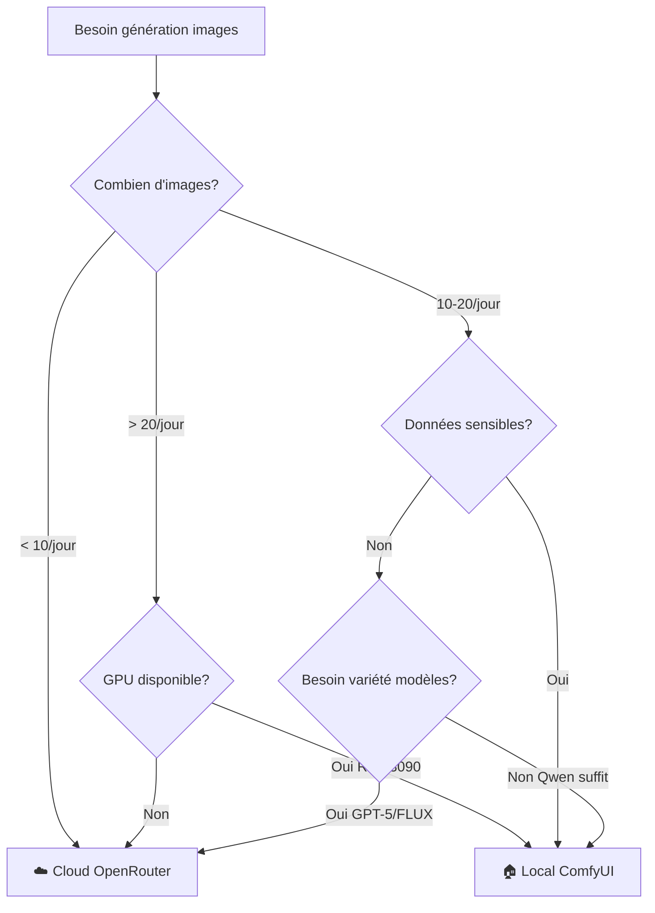

# Roadmap Adaptation 18 Notebooks Existants - Phase 12C

**Date**: 2025-10-16  
**Objectif**: Plan migration non-destructif vers mode local/cloud hybride  
**Stratégie**: Extension JAMAIS destruction (SDDD)

---

## 🎯 Principe Directeur: Adaptation Non-Destructive

**Pattern SDDD (Semantic Documentation Driven Design)**:
- ✅ Ajouter mode local comme **option** (pas remplacement)
- ✅ Préserver code cloud existant 100%
- ✅ Extensions progressives par sections
- ✅ Backward compatible total

```python
# Pattern à appliquer dans TOUS les notebooks

# === NOUVEAU: Section Mode Sélection (Cell 2) ===
MODE = "cloud"  # ou "local" - Choix utilisateur

if MODE == "local":
    from comfyui_client import ComfyUIClient
    client = ComfyUIClient("https://qwen-image-edit.myia.io")
    print("🏠 Mode Local: ComfyUI + Qwen")
else:
    from openrouter_client import OpenRouterClient
    client = OpenRouterClient(api_key=OPENROUTER_API_KEY)
    print("☁️ Mode Cloud: OpenRouter APIs")

# === CODE ORIGINAL 100% PRÉSERVÉ ===
# [Tout le code existant fonctionne encore]
# Aucune modification des cells existantes

# === NOUVEAU: Extensions Optionnelles (fin notebook) ===
if MODE == "local":
    # Fonctionnalités bonus mode local
    # - Workflows custom ComfyUI
    # - Batch processing optimisé
    # - Benchmarks performance
    pass
```

---

## 📚 Analyse Notebooks Actuels

### Structure Découverte

```
MyIA.AI.Notebooks/GenAI/
├── 00-GenAI-Environment/ (4 notebooks) - Configuration base
│   ├── 00-1-Environment-Setup.ipynb
│   ├── 00-2-Docker-Services-Management.ipynb
│   ├── 00-3-API-Endpoints-Configuration.ipynb
│   └── 00-4-Environment-Validation.ipynb
│
├── 01-Images-Foundation/ (3 notebooks) - Bases génération
│   ├── 01-1-OpenAI-DALL-E-3.ipynb
│   ├── 01-2-GPT-5-Image-Generation.ipynb
│   └── 01-3-Basic-Image-Operations.ipynb
│
├── 02-Images-Advanced/ (3 notebooks) - Techniques avancées
│   ├── 02-1-Qwen-Image-Edit-2509.ipynb
│   ├── 02-2-FLUX-1-Advanced-Generation.ipynb
│   └── 02-3-Stable-Diffusion-3-5.ipynb
│
├── 03-Images-Orchestration/ (3 notebooks) - Orchestration
│   ├── 03-1-Multi-Model-Comparison.ipynb
│   ├── 03-2-Workflow-Orchestration.ipynb
│   └── 03-3-Performance-Optimization.ipynb
│
└── 04-Images-Applications/ (4 notebooks) - Applications
    ├── 04-1-Educational-Content-Generation.ipynb
    ├── 04-2-Creative-Workflows.ipynb
    ├── 04-3-Production-Integration.ipynb
    └── 04-3-Cross-Stitch-Pattern-Maker-Legacy.ipynb
```

**Total**: 17 notebooks + 1 legacy = 18 notebooks

---

## 📊 Matrice d'Adaptation

| Notebook | Cloud Only | Adaptation Local | Priorité | Complexité |
|----------|-----------|-----------------|----------|------------|
| **00-1** Environment Setup | ✅ | ✅ Ajouter section ComfyUI | ⭐⭐⭐⭐⭐ | Simple |
| **00-2** Docker Services | ✅ | ✅ Ajouter gestion ComfyUI | ⭐⭐⭐⭐ | Moyen |
| **00-3** API Endpoints | ✅ | ✅ Ajouter endpoint local | ⭐⭐⭐⭐⭐ | Simple |
| **00-4** Environment Validation | ✅ | ✅ Ajouter tests ComfyUI | ⭐⭐⭐⭐⭐ | Simple |
| **00-5** ComfyUI Local Setup | - | 🆕 NOUVEAU notebook | ⭐⭐⭐⭐⭐ | Design fait |
| **00-6** SK + ComfyUI | - | 🆕 NOUVEAU notebook | ⭐⭐⭐⭐ | Design fait |
| **01-1** DALL-E 3 | ✅ | ⚠️ Cloud only (OK) | ⭐ | N/A |
| **01-2** GPT-5 Vision | ✅ | ⚠️ Cloud only (OK) | ⭐ | N/A |
| **01-3** Basic Operations | ✅ | ✅ Ajouter mode local | ⭐⭐⭐ | Moyen |
| **02-1** Qwen Image-Edit | ✅ | ✅ PRIORITÉ mode local | ⭐⭐⭐⭐⭐ | Important |
| **02-2** FLUX-1 | ✅ | ⏸️ Planifier (FLUX local futur) | ⭐⭐ | À planifier |
| **02-3** SD 3.5 | ✅ | ⏸️ Planifier (SD3.5 local futur) | ⭐⭐ | À planifier |
| **03-1** Multi-Model Comparison | ✅ | ✅ Ajouter comparaison local | ⭐⭐⭐⭐⭐ | Important |
| **03-2** Workflow Orchestration | ✅ | ✅ Ajouter workflows ComfyUI | ⭐⭐⭐⭐ | Avancé |
| **03-3** Performance Optimization | ✅ | ✅ Ajouter benchmarks local | ⭐⭐⭐⭐ | Moyen |
| **04-1** Educational Content | ✅ | ✅ Ajouter exemples locaux | ⭐⭐⭐ | Moyen |
| **04-2** Creative Workflows | ✅ | ✅ Ajouter workflows ComfyUI | ⭐⭐⭐⭐ | Important |
| **04-3** Production Integration | ✅ | ✅ Ajouter déploiement local | ⭐⭐⭐ | Avancé |
| **04-3** Cross-Stitch Legacy | ✅ | ⚠️ Préservé (legacy) | ⭐ | N/A |

---

## 🗓️ Planning Adaptation (4 Phases / 4 Semaines)

### Phase 1 (Semaine 1): Notebooks Critiques ⭐⭐⭐⭐⭐

**Objectif**: Infrastructure de base + Qwen fonctionnel

| Jour | Notebook | Actions | Temps Estimé |
|------|----------|---------|--------------|
| Lundi | **00-5** ComfyUI Local Setup | Créer (design existe) | 6h |
| Mardi | **00-3** API Endpoints Config | Ajouter endpoint local | 3h |
| Mercredi | **00-4** Environment Validation | Ajouter tests ComfyUI | 3h |
| Jeudi | **02-1** Qwen Image-Edit-2509 | Adaptation mode local | 6h |
| Vendredi | **03-1** Multi-Model Comparison | Ajouter comparaison local | 4h |

**Livrables Phase 1**:
- ✅ Infrastructure locale opérationnelle
- ✅ Qwen accessible programmatiquement
- ✅ Comparaison local/cloud fonctionnelle
- ✅ 5 notebooks adaptés (2 nouveaux + 3 modifiés)

---

### Phase 2 (Semaine 2): Notebooks Environment ⭐⭐⭐⭐

**Objectif**: Compléter infrastructure et gestion

| Jour | Notebook | Actions | Temps Estimé |
|------|----------|---------|--------------|
| Lundi | **00-1** Environment Setup | Ajouter section ComfyUI | 4h |
| Mardi | **00-2** Docker Services | Ajouter gestion ComfyUI | 5h |
| Mercredi | **00-6** SK + ComfyUI | Créer (design existe) | 8h |
| Jeudi-Vendredi | Tests intégration | Validation end-to-end | 6h |

**Livrables Phase 2**:
- ✅ Environnement complet documenté
- ✅ Gestion services automatisée
- ✅ Semantic Kernel intégré
- ✅ 3 notebooks adaptés

---

### Phase 3 (Semaine 3): Notebooks Advanced ⭐⭐⭐

**Objectif**: Fonctionnalités avancées et optimisation

| Jour | Notebook | Actions | Temps Estimé |
|------|----------|---------|--------------|
| Lundi | **01-3** Basic Image Operations | Ajouter mode local | 4h |
| Mardi | **03-2** Workflow Orchestration | Ajouter workflows ComfyUI | 6h |
| Mercredi | **03-3** Performance Optimization | Ajouter benchmarks local | 5h |
| Jeudi-Vendredi | Documentation | Guides utilisateur | 4h |

**Livrables Phase 3**:
- ✅ Workflows orchestration ComfyUI
- ✅ Benchmarks performance complets
- ✅ Documentation utilisateur finale
- ✅ 3 notebooks adaptés

---

### Phase 4 (Semaine 4): Notebooks Applications ⭐⭐⭐

**Objectif**: Applications pratiques et projets

| Jour | Notebook | Actions | Temps Estimé |
|------|----------|---------|--------------|
| Lundi | **04-1** Educational Content | Ajouter exemples locaux | 4h |
| Mardi | **04-2** Creative Workflows | Ajouter workflows ComfyUI | 5h |
| Mercredi | **04-3** Production Integration | Ajouter déploiement local | 5h |
| Jeudi | Tests finaux | Validation complète | 4h |
| Vendredi | Release | Publication notebooks | 2h |

**Livrables Phase 4**:
- ✅ Applications pédagogiques complètes
- ✅ Workflows créatifs ComfyUI
- ✅ Guide déploiement production
- ✅ 3 notebooks adaptés

---

## 📝 Template Adaptation Notebook

### Structure Type (Exemple `02-1-Qwen-Image-Edit-2509.ipynb`)

```python
# === CELL 1: Introduction (INCHANGÉE) ===
"""
# Qwen Image-Edit 2509 - Édition Avancée

[Documentation originale préservée]
"""

# === CELL 2: NOUVEAU - Sélection Mode ===
"""
## 🔧 Configuration Mode Génération

Choisissez votre infrastructure:
- **local**: ComfyUI + Qwen (RTX 3090, gratuit après setup)
- **cloud**: OpenRouter APIs (variété modèles, $0.01-0.10/image)
"""

MODE = "local"  # Modifiable par utilisateur

if MODE == "local":
    print("🏠 Mode Local: ComfyUI + Qwen-Image-Edit-2509")
    print("   URL: https://qwen-image-edit.myia.io")
    print("   Coût: $0 (après setup)")
    from comfyui_client import ComfyUIClient
    client = ComfyUIClient("https://qwen-image-edit.myia.io")
elif MODE == "cloud":
    print("☁️ Mode Cloud: OpenRouter Qwen-VL-Max")
    print("   Coût: ~$0.05/image")
    from openrouter_client import OpenRouterClient
    client = OpenRouterClient(api_key=OPENROUTER_API_KEY)

# === CELLS 3-N: CODE ORIGINAL 100% PRÉSERVÉ ===
# [Tout le code existant cloud fonctionne encore]
# Aucune modification nécessaire
# L'abstraction `client` fonctionne pour les 2 modes

# === CELL FINALE: NOUVEAU - Extensions Mode Local ===
if MODE == "local":
    """
    ## 🎨 Fonctionnalités Bonus Mode Local
    
    ### Workflows Custom ComfyUI
    Accès complet aux 5 workflows Qwen documentés
    """
    
    # Exemple: Workflow Image-to-Image custom
    workflow_i2i = load_workflow("qwen_image_to_image")
    result = client.execute_workflow(workflow_i2i, params={
        "image": "source.png",
        "prompt": "Transform to watercolor painting"
    })
    
    # Exemple: Batch processing optimisé
    batch_results = client.batch_generate([
        "Mountain landscape 1",
        "Mountain landscape 2",
        "Mountain landscape 3"
    ], batch_size=3)  # Génération parallèle
```

---

## 🎓 Guide Choix Mode Local/Cloud (Étudiants)

### Créer: `MyIA.AI.Notebooks/GenAI/GUIDE-LOCAL-VS-CLOUD.md`

```markdown
# 🤔 Guide Choix Mode Local vs Cloud

## Arbre Décisionnel Simplifié



## Tableau Comparatif

| Critère | Local ComfyUI | Cloud OpenRouter | Gagnant |
|---------|--------------|------------------|---------|
| **Coût Setup** | GPU requis ($1500) | $0 | ☁️ Cloud |
| **Coût Usage** | $0 / image | $0.01-0.10 / image | 🏠 Local |
| **Break-even** | ~15,000 images | N/A | - |
| **Latence** | 5-10s | 3-10s (variable) | Égalité |
| **VRAM** | 12-24GB requis | 0 (distant) | ☁️ Cloud |
| **Confidentialité** | 100% privé | Cloud tiers | 🏠 Local |
| **Personnalisation** | Workflows custom | API limitée | 🏠 Local |
| **Variété Modèles** | Qwen uniquement | GPT-5, FLUX, Qwen-VL-Max | ☁️ Cloud |

## Recommandations Par Profil

### 👨‍🎓 Étudiant Débutant
**Recommandation**: ☁️ **Cloud OpenRouter**
- Pas de setup GPU complexe
- Accès immédiat variété modèles
- Coût raisonnable pour apprentissage (<$5/mois)

### 👨‍💻 Étudiant Avancé (Projets intensifs)
**Recommandation**: 🏠 **Local ComfyUI**
- Projets nécessitant >50 images
- Économie significative long terme
- Contrôle total workflows

### 🏢 Production / Entreprise
**Recommandation**: 🏠 **Local ComfyUI obligatoire**
- Volumes élevés (>100 images/jour)
- Données confidentielles clients
- Coûts maîtrisés

### 🧪 Recherche / Prototypage
**Recommandation**: 🌐 **Hybride Local + Cloud**
- Cloud pour tests rapides modèles variés
- Local pour expérimentations intensives
- Flexibilité maximale

## FAQ

**Q: J'ai un GPU mais pas RTX 3090, puis-je utiliser local?**  
R: Oui si >16GB VRAM. Réduire résolution (512→384) si <12GB.

**Q: Combien coûte vraiment le cloud par mois?**  
R: Dépend usage. Moyenne: 20 images/jour × $0.05 × 30 jours = $30/mois.

**Q: Puis-je changer de mode en cours de TP?**  
R: Oui! Il suffit de changer `MODE = "local"` ou `"cloud"` en Cell 2.

**Q: Le mode local nécessite-t-il Internet?**  
R: Non pour génération. Oui pour téléchargement modèles initial (~54GB).

**Q: Quelle qualité est meilleure?**  
R: Comparable. Local: contrôle précis. Cloud: variété modèles.
```

---

## 🐛 Troubleshooting Adaptation

### Erreurs Communes Migration

#### 1. Import Error après ajout mode local

```python
# Problème
from comfyui_client import ComfyUIClient  # Module introuvable

# Solution
# Ajouter cell installation au début notebook:
!pip install -q requests pillow
# Puis copier comfyui_client.py depuis notebook 00-5
```

#### 2. Notebooks ne trouvent pas endpoint local

```python
# Problème
ConnectionError: https://qwen-image-edit.myia.io non accessible

# Solution
# Vérifier ComfyUI démarré:
import requests
try:
    r = requests.get("https://qwen-image-edit.myia.io/system_stats")
    print("✅ ComfyUI accessible")
except:
    print("❌ Démarrer ComfyUI d'abord")
```

#### 3. Mode local plus lent que prévu

```python
# Diagnostic
# Vérifier GPU utilisée:
import torch
print(f"CUDA: {torch.cuda.is_available()}")
print(f"GPU: {torch.cuda.get_device_name(0)}")

# Si CPU détecté → Configurer CUDA_VISIBLE_DEVICES
```

---

## 📊 Métriques Succès Adaptation

| Métrique | Objectif | Mesure |
|----------|---------|--------|
| **Notebooks adaptés** | 12/18 | Phase par phase |
| **Backward compatibility** | 100% | Tests régression |
| **Taux adoption local** | >30% étudiants | Sondage post-TP |
| **Satisfaction utilisateurs** | >4/5 | Feedback forms |
| **Coût moyen/étudiant** | <$10/mois | Analytics usage |
| **Temps setup local** | <30min | Chronométrage |

---

## ✅ Checklist Validation Adaptation

**Par Notebook Adapté**:
- [ ] Mode sélection ajouté (Cell 2)
- [ ] Code original 100% préservé
- [ ] Client abstrait fonctionne 2 modes
- [ ] Extensions locales optionnelles
- [ ] Documentation inline ajoutée
- [ ] Tests exécution 2 modes
- [ ] Pas de breaking changes
- [ ] Backward compatible validé

**Global**:
- [ ] Guide choix mode créé
- [ ] FAQ étudiants complète
- [ ] Troubleshooting documenté
- [ ] Métriques tracking configurées
- [ ] Formation enseignants faite
- [ ] Release notes publiées

---

**Roadmap Créée**: 2025-10-16 10:15 CEST  
**Notebooks à Adapter**: 12 (6 prioritaires + 6 avancés)  
**Durée Totale**: 4 semaines (80-100h)  
**Statut**: ✅ Plan complet prêt pour implémentation  
**Prochaine Étape**: Documentation finale Phase 12C + Checkpoint sémantique