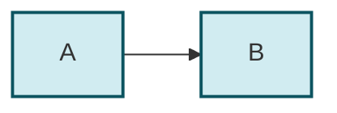
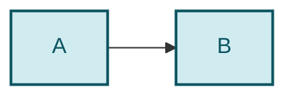
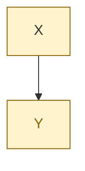

# Fixture : blocs mermaid `fill:` sans `color:` (pattern #15022)

Fixture de test POSITIF du detecteur `detect_mermaid_fill_without_color.py`.
Ce fichier porte volontairement les formes fautives pour piner le contrat —
il est allowlisté par chemin dans le detecteur (`ALLOWED`), un scan fleet ne
doit donc jamais le remonter comme finding.

## Bloc fautif (classDef sans color:)



## Bloc corrige (classDef avec color:)



## Forme style (fautive)



## Fence NON mermaid (doit etre ignoree)

```
classDef dist fill:#d1ecf1,stroke:#0c5460;
style X fill:#fff3cd;
```

## Commentaire %% portant le mot fill (doit etre ignore)


