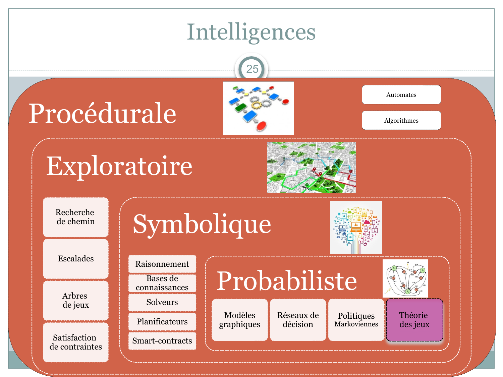
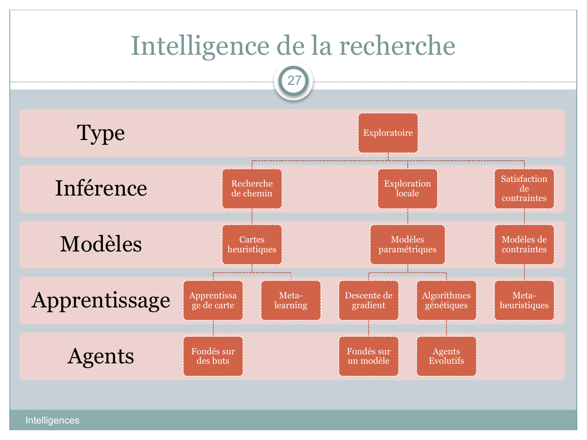
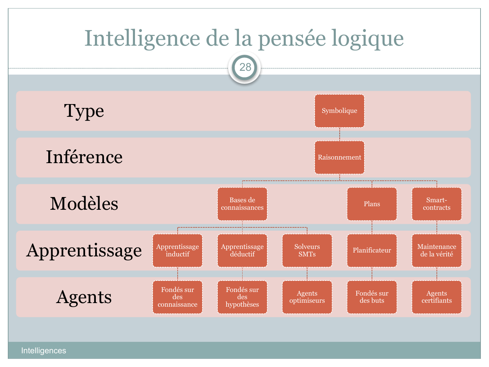
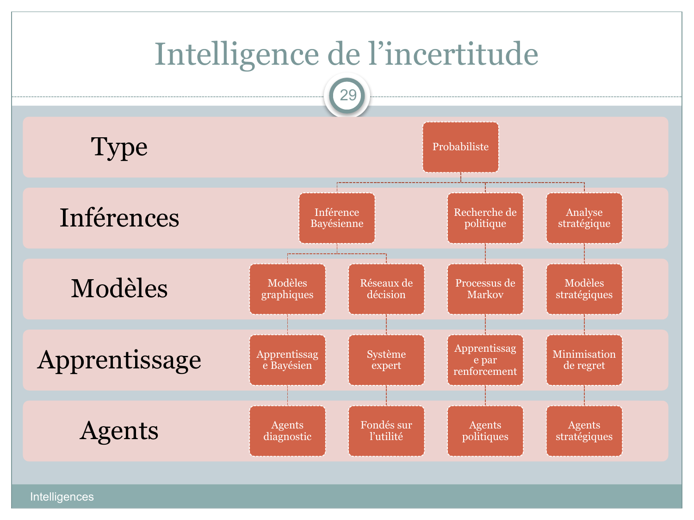

# Intelligence Artificielle

Intelligence Artificielle -- I

**Jean-Sylvain Boige**
MRes CSAI, Sussex University, Brighton UK
Aricie -- DNN -- PKP -- My Intelligence Agency

---

# IA 101 -- Ressources et organisation

- **Ouvrage de reference**
  - *Artificial Intelligence: A Modern Approach* (Russell & Norvig)
  - 3e edition (2006) et 4e edition (2020, avec deep learning et IA moderne)
- **En classe**
  - Cours magistraux, corrections d'exercices, travaux pratiques
- **Projets trimestriels**
  - Équipes de 2-3 étudiants, travail transversal
  - Exposé final en classe devant le groupe

---
layout: image-overlay
image: ./images/img_001.jpg
---

# Sommaire

<ul>
  <li>Qu'est-ce que l'intelligence artificielle ?
    <ul>
      <li>Racines, histoire et etat de l'art</li>
      <li>Structure des agents rationnels</li>
    </ul>
  </li>
  <li v-click>Intelligence exploratoire
    <ul><li>Comment chercher la solution a un probleme ?</li></ul>
  </li>
  <li v-click>Intelligence Symbolique
    <ul><li>Comment utiliser le raisonnement et les mathematiques ?</li></ul>
  </li>
  <li v-click>Intelligence probabiliste
    <ul><li>Comment agir dans l'incertitude ?</li></ul>
  </li>
  <li v-click>Intelligence Multi-Agents
    <ul><li>Comment tenir compte des autres ?</li></ul>
  </li>
  <li v-click>Apprentissage
    <ul><li>Comment utiliser les donnees et l'experience ?</li></ul>
  </li>
  <li v-click>Application : le langage naturel</li>
</ul>

---

# Sommaire

- Presentation du cursus
- Introduction
  - Qu'est-ce que l'intelligence artificielle?
  - Les domaines d'etude
  - Un peu d'histoire
  - L'état de l'art
- Systemes d'agents
  - Agents rationnels
  - Environnements taches
  - Types d'Agents
- Presentation des projets de groupe

---

# Objectifs du cours (1/2)

A l'issue de ce cours, vous serez capables de :

- **Comprendre les grands paradigmes de l'IA**
  - Identifier les principaux domaines et leurs applications
  - Disposer des bases pour approfondir chacun d'entre eux
- **Concevoir des programmes intelligents dans des domaines varies :**
  - Recherche de solutions et jeux strategiques
  - Representation de connaissances et raisonnement logique
  - Modelisation probabiliste et prise de decision sous incertitude
  - Apprentissage automatique (supervise, non supervise, par renforcement)
  - Traitement du langage naturel

---

# Objectifs du cours (2/2)

- **Concevoir des systemes intelligents en conditions reelles**
  - Integrer les differentes briques pour construire un systeme complet
  - Gerer les contraintes du monde reel : incertitude, temps de calcul, donnees imparfaites
- **BONUS : Mieux comprendre l'intelligence elle-meme**
  - Comment l'intelligence emerge-t-elle dans la nature ?
  - Comment fonctionne le cerveau humain, et en quoi l'IA s'en inspire ?
  - Comment definir et mesurer la rationalite ?

---

# Plan du cours

<ol class="roman-list">
<li>Introduction</li>
<li>Resolution de problemes</li>
<li>Bases de connaissances et logique</li>
<li>Raisonnement probabiliste</li>
<li>Theorie des jeux</li>
<li>Apprentissage</li>
<li>Traitement du langage naturel</li>
<li>Presentations des projets</li>
</ol>

---
layout: section
---

<h1 style="color: #F5F5F5 !important; border-bottom: 2px solid #F5F5F5 !important;">Questions?</h1>

---

# Introduction a l'intelligence artificielle

- Presentation du cursus
- **Introduction**
  - Qu'est-ce que l'intelligence artificielle?
  - Les domaines d'etude
  - Un peu d'histoire
  - L'état de l'art
- Systemes d'agents
  - Agents rationnels
  - Environnements taches
  - Types d'agents
- TP: Mise en place de l'environnement de travail
- Presentation des projets de groupe

---

# Qu'est-ce que l'intelligence artificielle ?

- **Des definitions multiples et un concept evolutif**
  - L'IA n'a pas de definition unique : elle recouvre des approches tres differentes
  - Concevoir un systeme intelligent n'implique pas de comprendre l'intelligence
- **Une definition qui evolue avec la technologie :**
  - Automates → Calculateurs → Algorithmes → Bases de connaissances → Systemes experts → Apprentissage profond → IA generative

---

# Quatre visions de l'IA

<ColoredTable />

**Notre angle : « Agir de facon rationnelle »**
- Des agents qui prennent les meilleures decisions possibles
- Unifie les autres : raisonner, apprendre, communiquer

---
layout: image-overlay
image: ./images/img_003.png
imageClass: mid-right large
---

# Les fondements de l'IA

L'IA est une discipline profondement interdisciplinaire :

- **Philosophie :** logique, methodes de raisonnement, nature de l'esprit, langage, apprentissage
- **Mathematiques :** representation formelle et preuve, algorithmes, calcul, complexite, (in)decidabilite, probabilites
- **Economie :** utilite, theorie de la decision, theorie des jeux, agents economiques rationnels
- **Biologie :** intelligence naturelle et animale, evolution
- **Neurosciences :** substrat physique de l'activite mentale (cerveau, neurones, plasticite)
- **Psychologie :** perception, cognition, controle moteur, comportement, techniques experimentales
- **Informatique :** puissance de calcul, logiciel, architectures, langages
- **Theorie du controle :** maximiser une fonction objective dans le temps, retroaction
- **Linguistique :** grammaires, representation du sens, semantique

---
layout: image-overlay
image: ./images/img_004.png
---

# Histoire succincte (1/2)

**Les debuts (1943-1970)**
- **1943** : McCulloch & Pitts modelisent le cerveau comme un circuit logique
- **1950** : Turing pose la question "Can machines think?"
- **1956** : Conference de Dartmouth -- le terme "Artificial Intelligence" est ne
- **Annees 50** : premiers programmes capables d'apprendre
  - Samuel (jeu de dames), Newell & Simon (theoricien logique)
  - Gelernter (geometrie), naissance de Lisp
- **1965** : Robinson propose un algorithme complet de raisonnement logique
- **1969-79** : age d'or des systemes experts (bases de connaissances)

---

# Histoire succincte (2/2)

**Maturite et "hivers de l'IA" (1970-2010)**

- **1970s** : l'IA se heurte a la complexite calculatoire -- premier "hiver"
- **1980s** : l'IA devient une industrie (robotique, vision, systemes experts)
- **1986** : retour des reseaux de neurones grace a la retropropagation
- **1990s** : l'IA se mathematise (probabilites, optimisation)
- **2000s** : data mining, apprentissage bayesien, web semantique

**Renaissance et explosion (2010-aujourd'hui)**

- **2012** : deep learning domine ImageNet -- la revolution commence
- **2017** : "Attention Is All You Need" -- naissance des Transformers
- **2020s** : GPT, DALL-E, ChatGPT, Claude, Gemini, DeepSeek, agents autonomes

---
layout: image-overlay
image: ./images/img_005.jpg
---

# État de l'art (1/2)

**L'IA bat les champions (1997-2019)**

- **1997** : Deep Blue bat Kasparov aux echecs
- **2016** : AlphaGo bat Lee Sedol au Go (DeepMind)
- **2017** : Libratus domine les pros du poker
- **2018** : AlphaZero apprend seul Go, echecs et shogi par renforcement
- **2019** : StarCraft II, Pluribus (poker multi-joueurs)

**Applications dans le monde reel**

- Preuve de conjectures mathematiques (Robbins, 1996)
- Vehicules autonomes (vol, conduite, marche robotique)
- Logistique et planification militaire (guerre du Golfe) 
- NASA : planification autonome de missions spatiales
- Trading algorithmique (85% du volume des marches en 2012)

---
layout: image-overlay
image: ./images/img_005.jpg
---

# État de l'art (2/2)

**Deep Learning et NLP (2010-2019)**

- **2012** : deep learning domine ImageNet (reconnaissance d'images quasi humaine)
- **2014** : GANs -- les reseaux de neurones deviennent creatifs
- **2017** : Transformers (Google) -- revolution du traitement du langage
- **2018-19** : GPT-2, BERT, Watson -- un nouveau paradigme d'interaction

**L'ere de l'IA generative (2020-2026)**

- **2020** : GPT-3 (175 milliards de parametres)
- **2021** : DALL-E (images), AlphaFold (proteines)
- **2022** : ChatGPT (1M utilisateurs en 5 jours), Stable Diffusion
- **2023** : GPT-4, Claude, LLaMA, Gemini -- competition ouverte
- **2024** : modeles de reflexion (O1), agents LLM, open source (DeepSeek)
- **2025** : GPT-5, agents autonomes, MCP (interoperabilite)

---

# Qui fait de l'IA ?

**Recherche academique** : CMU, Stanford, Berkeley, MIT, Caltech, U Austin, IDSIA...

**Gouvernements et laboratoires prives** : NASA, NRL, NIST, IBM, AT&T, SRI, ISI, MERL...

**Beaucoup de societes** : Google, Microsoft, Facebook, Amazon, Honeywell, MITRE, Fujitsu...

---

# L'IA dans la vie de tous les jours

- **Poste** : reconnaissance des adresses manuscrites, tri automatique du courrier
- **Banque et finance** : scoring de credit, detection de fraude, trading algorithmique
- **Service client** : chatbots, reconnaissance vocale, routage intelligent
- **Internet** : recommandation (Netflix, Spotify), detection de spam, publicite ciblee
- **Securite** : reconnaissance faciale, detection de plaques, videosurveillance
- **Transport** : navigation GPS, vehicules autonomes, optimisation logistique
- **Sante** : aide au diagnostic, analyse d'imagerie medicale, decouverte de medicaments
- **Quotidien** : assistants vocaux (Siri, Alexa), traduction automatique, filtres photo
- **Jeux** : personnages non-joueurs, adversaires intelligents (echecs, Go, jeux video)

---
layout: image-overlay
image: ./images/img_020.png
---

# Agir comme l'homme : le Test de Turing

**Alan Turing (1950)** propose un test operationnel : une machine est "intelligente" si un humain ne peut la distinguer d'un autre humain en conversant avec elle.

**Competences requises pour reussir le test :**
- Traitement du langage naturel
- Representation de connaissances
- Raisonnement automatique
- Apprentissage

**« Total Turing » (+ camera)** ajoute la vision et la robotique.

**Ces competences definissent les grandes disciplines de l'IA** -- dont quatre seront detaillees dans ce cours.

*En pratique : Dnn + Portal Keeper -- plateforme web d'agents conversationnels*

---

# Penser comme l'homme : sciences cognitives

- **La "revolution cognitive" (annees 1960)**
  - La psychologie commence a modeliser la pensee comme un traitement de l'information
- **Deux approches pour etudier le cerveau**
  - *Top-down* : modeliser le comportement humain observable
  - *Bottom-up* : observer directement l'activite neurologique (IRMf, EEG)
- **Pourquoi l'IA s'en distingue aujourd'hui**
  - Les humains sont souvent irrationnels (biais cognitifs)
  - Le reverse-engineering du cerveau reste extremement difficile
  - Le "hardware" biologique differe fondamentalement du silicium

---

# Penser de facon rationnelle : lois de la raison

- **Depuis Aristote : quels sont les arguments corrects ?**
  - La logique formelle fournit des regles de derivation rigoureuses
- **La logique au service de l'IA**
  - Representer les faits du monde sous forme formelle
  - Utiliser l'inference pour deduire de nouvelles connaissances
  - Exemple : prouveurs automatiques de theoremes
- **Limites de l'approche purement logique**
  - Le monde reel est incertain (capteurs imparfaits, information incomplete)
  - Tout comportement intelligent ne relève pas d'une délibération logique
  - En pratique, il faut aussi definir des buts et evaluer des couts

---

# Agir de facon rationnelle : l'agent

- **Un comportement rationnel consiste a faire la bonne chose :**
  - Choisir l'action qui maximise les chances d'atteindre l'objectif, compte tenu de l'information disponible
- **Agir rationnellement n'implique pas forcement de penser**
  - Un réflexe (cligner des yeux) peut être rationnel sans délibération
  - Mais la reflexion reste un outil puissant au service de l'action
- **Lien avec la theorie de la decision**
  - Evaluer les états possibles et les actions disponibles
  - Maximiser l'utilite esperee, meme sous incertitude
- **C'est l'approche centrale de ce cours** : concevoir des agents rationnels

---
layout: section
---

<h1 style="color: #F5F5F5 !important; border-bottom: 2px solid #F5F5F5 !important;">Questions?</h1>

---

# Systemes d'agents

- Presentation du cursus
- Introduction
  - Qu'est-ce que l'intelligence artificielle?
  - Les domaines d'etude
  - Un peu d'histoire
  - L'état de l'art
- **Agents rationnels**
- **Environnements taches**
- **Types d'agents**
- TP: Mise en place de l'environnement de travail
- Presentation des projets de groupe

---
layout: image-overlay
image: ./images/img_021.png
---

# Les agents

**Un agent est une entite autonome qui :**
- **Percoit** son environnement grace a des capteurs (cameras, micros, senseurs...)
- **Agit** sur cet environnement par des effecteurs (moteurs, ecrans, haut-parleurs...)

**Formalisation :**
- Un agent implemente une *fonction d'agent* : $f: \mathcal{P}^* \to \mathcal{A}$
- A partir de l'historique complet de ses percepts, il choisit une action

---

# Les agents rationnels

**Un agent rationnel choisit l'action qui maximise sa mesure de performance.**

- **Mesure de performance** : critere objectif et externe de succes
- **Decision basee sur** : la suite des percepts recus et les connaissances prealables
- **Rationnel ne signifie pas omniscient**
  - L'agent explore pour completer ses connaissances
  - Il s'adapte par l'experience (apprentissage)
  - Il est reactif *et* proactif

---

# Rationalite limitee

- **La rationalite parfaite est rarement atteignable**
  - Ressources de calcul limitees, temps de decision contraint
  - Information incomplete sur l'environnement
- **Objectif realiste** : obtenir les meilleures performances possibles compte tenu des ressources disponibles
- **Herbert Simon (1955)** : concept de "satisficing" -- choisir une solution satisfaisante plutot qu'optimale

---

# Intelligences

<IntelligencePyramid />

---

---

---

---

# Environnement de tache

**Description PEAS:**
- **P**erformance (Mesure de)
- **E**nvironnement
- **A**ctuators (Effecteurs)
- **S**ensors (Capteurs)

**Exemple: Taxi**
- **Performance:**
  - Prudent, rapide, legal, confortable, rentable
- **Environnement:**
  - Route, trafic, pietons, clients, vehicule
- **Effecteurs:**
  - Volant, accelerateur, frein, clignotants, klaxon
- **Capteurs:**
  - Cameras, sonar, accelerometre, GPS, Lidar, clavier etc.

---

# Environnements de tache: exemples

---

# Types d'environnement (1/2)

Chaque environnement de tache possede des proprietes qui influencent la conception de l'agent :

- **Completement vs partiellement observable**
  - L'agent a-t-il acces a l'etat complet de l'environnement ?
- **Deterministe vs stochastique**
  - L'etat suivant est-il entierement determine par l'état courant et l'action ?
  - Cas particulier : *strategique* = deterministe sauf les actions des autres agents
- **Episodique vs sequentiel**
  - Les decisions sont-elles independantes ou liees entre elles ?
- **Statique vs dynamique**
  - L'environnement change-t-il pendant que l'agent delibere ?

---

# Types d'environnement (2/2)

- **Discret vs continu**
  - Les etats, le temps, les percepts et les actions sont-ils denombrables ?

- **Agent simple vs multiagent**
  - L'agent est-il seul ou en interaction (cooperation, competition) ?

- **Connu vs inconnu**
  - L'agent connait-il les regles de l'environnement ?

**En pratique**, le monde reel combine les cas les plus difficiles : partiellement observable, stochastique, sequentiel, dynamique, continu, multiagent.

---

# Types d'environnement: exemples

---
---

# Types d'agents

**f(agent) = Architecture physique + Programme**

**Programme agent pilote par table**

- Taille ? Duree ? Autonomie ?

Un agent naif pourrait stocker une table "percepts → action" : la table serait gigantesque et impossible a construire.

**Cinq architectures d'agents, par ordre de generalite :**

1. Agent réflexe simple
2. Agent réflexe fondé sur un modele
3. Agent fonde sur des buts
4. Agent fonde sur l'utilite
5. Agent capable d'apprentissage

---

# Agent réflexe

- **Pas de memoire**
- **Percepts courants**
- **Regles Conditions / Actions**

**Intelligence animale**

- Intelligence animale

- Behaviourism
- Artificial Life
- Cellular Automata

---

# Agent réflexe fondé sur un modele

**Caracteristiques :**

- Etat du monde
- Historique des percepts
- Memoire du changement

**Ex : Subsomption (Brooks)**

- Modele non representatif
- Comportements simples
- Couches d'automates
- Emergence

---

# Agent fonde sur des buts

**Du reactif au deliberatif** : l'agent ne reagit plus seulement a l'instant present, il anticipe le futur.

- Considere les consequences de ses actions
- Planifie des sequences d'actions pour atteindre un objectif
- Utilise la recherche (exploration) et la planification

---

# Agent fonde sur l'utilite

**Quand plusieurs chemins menent au but, lequel choisir ?**

- Une **fonction d'utilite** U : Etat → R attribue un score a chaque etat
- L'agent choisit l'action qui maximise l'utilite esperee

**Permet d'arbitrer entre :**
- Probabilite de succes vs importance de l'objectif
- Risque vs recompense, urgence vs cout

---

# Agent capable d'apprentissage

**Quatre composants internes :**

- **Element de performance** : choisit les actions
- **Element d'apprentissage** : ameliore la performance a partir de l'experience
- **Critique** : evalue les resultats par rapport a un standard fixe
- **Generateur de problemes** : suggere des actions exploratoires

**Formes d'apprentissage :** supervise, par renforcement, non supervise

---

# Fonctionnement interne des agents

**La representation de la connaissance est determinante**

Trois niveaux de representation des etats, du plus simple au plus expressif :

- **Atomique** : chaque etat est indivisible (ex: un noeud dans un graphe)

- **Factorise** : un etat est un ensemble de proprietes (ex: variables booleennes)

- **Structure** : un etat est un objet complexe avec des relations (ex: base de donnees)

**Compromis fondamental :** plus la representation est riche, plus l'agent est flexible -- mais plus le raisonnement est couteux.

---

# Resume

- **Intelligence artificielle**
  - Quatre approches : penser/agir comme l'homme ou de facon rationnelle
  - Fondements interdisciplinaires : logique, decision, neurosciences, linguistique...
  - Une histoire ponctuee de "hivers" et de renaissances spectaculaires
- **Agents rationnels**
  - Un agent percoit son environnement et agit pour maximiser sa performance
  - La rationalite parfaite est un ideal ; en pratique, on vise le meilleur compromis
- **Architectures d'agents**
  - Reflexes (simples ou avec modele), fondes sur des buts ou l'utilite, apprenants
  - Les proprietes de l'environnement dictent le choix de l'architecture
  - La representation des etats (atomique, factorisee, structuree) conditionne les capacites

---

# Plan du cours

<ol class="roman-list">
<li>Introduction</li>
<li>Resolution de problemes</li>
<li>Bases de connaissances et logique</li>
<li>Raisonnement probabiliste</li>
<li>Theorie des jeux</li>
<li>Apprentissage</li>
<li>Traitement du langage naturel</li>
<li>Presentations des projets</li>
</ol>

---

# Pour aller plus loin : Notebooks

Chaque chapitre du cours est accompagne de travaux pratiques sous forme de notebooks Jupyter :

- **Exploration** : `Search/Part1-Foundations/` (11 notebooks), `Search/Part2-CSP/` (9 notebooks), `Sudoku/` (16 notebooks) -- recherche, CSP, algorithmes genetiques, optimisation
- **Logique** : `SymbolicAI/` -- Z3, Tweety, Lean 4, argumentation, smart-contracts
- **Probabilites** : `Probas/Infer/` -- inference bayesienne, reseaux de decision (Infer.NET)
- **Jeux** : `GameTheory/` -- equilibres de Nash, jeux bayesiens, MARL (OpenSpiel)
- **Apprentissage** : `ML/` -- classification, regression, renforcement (ML.NET)
- **IA Generative** : `GenAI/` -- Image (19 notebooks), Audio (16), Video (16), Texte (10)
- **Trading** : `QuantConnect/` -- 28 notebooks + 67 strategies backtestees

> **Depot :** `github.com/jsboige/CoursIA` > dossier `MyIA.AI.Notebooks/`

---
layout: cover
---

# Merci

Jean-Sylvain Boige
jsboige@myia.org
