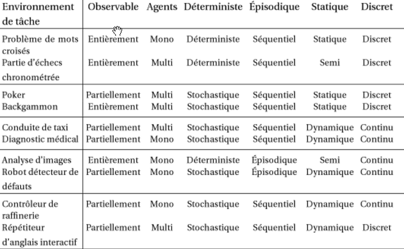
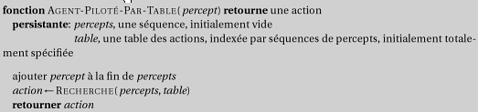
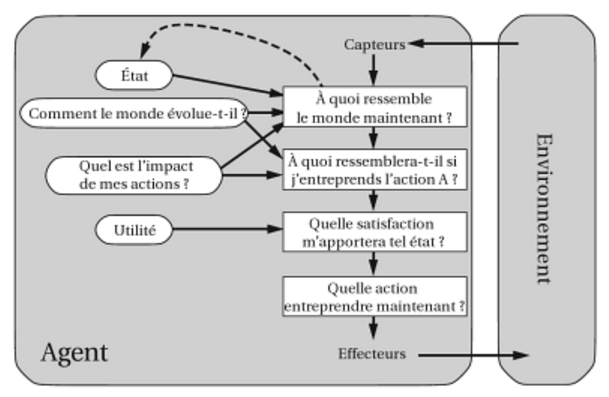

<!-- _class: title -->

# Intelligence artificielle

Intelligence Artificielle -- I

- Enseignant: Jean-Sylvain Boige
- MRes CSAI, Sussex University, Brighton UK
- Aricie - DNN - PKP
- My Intelligence Agency

<!-- TODO: ajouter visuel d'accroche (reseau neuronal, robot, cerveau+circuit) -->

---

# IA 101

- Livres
  - **Intelligence artificielle, 3e edition** (2006)
    - S. Russell & P. Norvig, Pearson (PDF)
  - **Intelligence artificielle, 4e edition** (2020)
    - Mise a jour avec deep learning et IA moderne
- Classe
  - Corrections / Projets
  - Cours
  - TPs
- Projets trimestriels
  - Equipes de 2-3
  - Travail transversal
  - Expose final en classe

---

# Sommaire

- Qu'est-ce que l'intelligence artificielle ?
- Racines, histoire et etat de l'art
- Structure des agents rationnel
- Intelligence exploratoire
  - Comment chercher la solution a un probleme ?
- Intelligence Symbolique
  - Comment utiliser le raisonnement et les mathematiques ?
- Intelligence probabiliste
  - Comment agir dans l'incertitude ?
- Intelligence Multi-Agents
  - Comment tenir compte des autres?
- Apprentissage
  - Comment utiliser les donnees et l'experience ?
- Application: le langage naturel

---

# Sommaire

- Presentation du cursus
- Introduction
  - Qu'est-ce que l'intelligence artificielle?
  - Les domaines d'etude
  - Un peu d'histoire
  - L'etat de l'art
- Systemes d'agents
  - Agents rationnels
  - Environnements taches
  - Types d'Agents
- Presentation des projets de groupe

---

# Objectifs du cours (1/2)

A la fin de ce cours vous pourrez:

- **Comprendre et utiliser des modeles informatiques de l'IA**
  - Principaux domaines
  - Pouvoir approfondir
- **Concevoir des programmes dans des domaines comme:**
  - La recherche de solutions et les jeux
  - La representation de connaissance et le raisonnement
  - Les systemes probabilistes
  - Differentes formes d'apprentissage
  - Le traitement du langage naturel

---

# Objectifs du cours (2/2)

- **Concevoir des systemes intelligents**
  - Conditions reelles
  - Systeme complet
- **BONUS: Connaitre un peu mieux notre monde**
  - Comment emerge l'intelligence
  - Comment fonctionne le cerveau humain
  - Comment reflechir et agir de facon rationnelle

---

# Plan du cours

- Introduction
- Resolution de problemes
- Bases de connaissances et logique
- Raisonnement probabiliste
- Theorie des jeux
- Apprentissage
- Traitement du langage naturel
- Presentations des projets

---

<!-- _class: questions -->

# Questions?

---

# Introduction a l'intelligence artificielle

- Presentation du cursus
- Introduction
  - Qu'est-ce que l'intelligence artificielle?
  - Les domaines d'etude
  - Un peu d'histoire
  - L'etat de l'art
- Systemes d'agents
  - Agents rationnels
  - Environnements taches
  - Types d'agents
- TP: Mise en place de l'environnement de travail
- Presentation des projets de groupe

---

# Qu'est-ce que l'intelligence artificielle?

- **Definitions multiples de l'intelligence et de l'IA**
  - Concevoir != comprendre
- **Definition mouvante:**
  - Automates → Calculateur → Algorithmes → Bases de connaissances → Systemes experts → Systemes probabilistes → Apprentissage profond → Generatif ?

---

# Qu'est-ce que l'intelligence artificielle?

**4 types d'approches:**
- Penser comme l'homme (sciences cognitives)
- Agir comme l'homme (Test de Turing)
- Penser de facon rationnelle (logique)
- Agir de facon rationnelle (agents)

**Notre angle principal: « Agir de facon rationnelle »**
- Conception d'agents

---

# Les fondements de l'IA

- **Philosophie:** Logique, methodes de raisonnement, esprit physique, apprentissage, langage, raison
- **Maths:** Representation formelle et preuve, algorithmes, calcul, (in)decidabilite, complexite, probabilites
- **Economie:** Utilite, theorie des jeux, la decision, agents economiques rationnels
- **Biologie:** Intelligence naturelle et animale
- **Neurosciences:** Substrat physique de l'activite mentale
- **Psychologie:** Comportement, Perception cognition, controle moteur, techniques experimentales
- **Informatique:** Origines, ordinateurs puissants et logiciels
- **Theorie du controle:** Maximiser une fonction objective dans le temps
- **Linguistique:** Representation de connaissances, grammaire

---

# Histoire succincte (1/2)

**Debuts (1943-1970)**
- 1943: McCulloch & Pitts: le cerveau comme un circuit logique
- 1950: Turing "Computing Machinery and Intelligence"
- 1956: Rencontre de Dartmouth : "Artificial Intelligence"
- 1950s: Premiers programmes
  - Samuel (jeu de dames), Newell & Simon (theoricien logique)
  - Gelernter (moteur geometrique), Lisp (Clojure: 2007)
- 1965: Robinson: Algorithme complet de raisonnement
- 1969-79: Systemes a base de connaissance (systemes experts)

---

# Histoire succincte (2/2)

**Maturite (1970-2000)**
- 1970s: L'IA decouvre la complexite calculatoire
  - La recherche sur les reseaux de neurones calle
- 1980s: L'IA devient une industrie (robotique, vision)
- 1986: Retour des reseaux de neurones (retropropagation)
- 1990s: L'IA devient une science (neats vs scruffies, Maths)
- 1995: L'emergence d'agents intelligents, diagnostic, GAs
- 2000s: Data mining, reconnaissances, apprentissage bayesien, web semantique

**Renaissance (2010s)**
- 2010s: Big data, deep learning, chatbots, smart contracts, cloud, architectures hybrides

---

# Etat de l'art (1/2)

**Jeux et raisonnement (1997-2019)**
- 1997: Echecs - Deep Blue bat Garry Kasparov
- 2007: Jeu de dames resolu, Backgammon egalement
- 2016: Jeu de Go - AlphaGo bat Lee Sedol (Google)
- 2017: Poker - Libratus bat les joueurs professionnels, puis Deep CRM
- 2018: Alpha zero - apprentissage par renforcement (Go/Echecs/Shogi)
- 2019: Deepmind: Starcraft 2, Pluribus

**Applications**
- Preuve de conjectures mathematiques irresolues (Robbins)
- Vol / Conduite / marche autonome
- Systemes de gestion logistique et de planification (guerre du Golfe)
- NASA: systeme embarque de planification des operations des vaisseaux
- Trading algorithmique (85% du volume en 2012)

---

# Etat de l'art (2/2)

**Deep Learning et NLP (2010-2019)**
- 2010: Explosion du deep-learning
  - ImageNet: performances quasi humaines
- 2014: GANS - Les reseaux de neurones deviennent imaginatifs
- TPUs (Google, Nvidia etc.)
- Traitement du langage naturel:
  - LinkedData: semantisation du web
  - Raisonneurs et bases de connaissance (IBM Watson, Maths etc.)
  - Proverb: expert en mots croises, arg techs
  - Transformers: OpenAI: GPT2, Google: Bert
  - Bots conversationnels: Un nouveau paradigme UX

**L'ere de l'IA generative (2020-2026)**
- 2020: GPT-3 (175B parametres)
- 2021: DALL-E, AlphaFold (proteines)
- 2022: ChatGPT (Nov), Stable Diffusion
- 2023: GPT-4, Claude, LLaMA, Gemini
- 2024: Modeles de reflexion (O1), agents LLM
- 2025: GPT-5, DeepSeek R1
- 2026: Agents autonomes, MCP

---

# Qui fait de l'IA?

- **Recherche academique**
  - CMU, Stanford, Berkeley, MIT, Caltech, U Austin, IDSIA…
- **Gouvernements et laboratoires prives**
  - NASA, NRL, NIST, IBM, AT&T, SRI, ISI, MERL…
- **Beaucoup de societes**
  - Google, Apple, Microsoft, Meta (Facebook), Amazon, Honeywell, Teknowledge, SAIC, MITRE, Fujitsu, Global InfoTek, BodyMedia…

<!-- TODO: ajouter OpenAI, Anthropic, Mistral, DeepSeek -->

---

# Dans la vie de tous les jours

- **Poste**
  - Reconnaissance des adresses et tri du courrier
- **Banque**
  - Lecture des cheques et verification des signatures
  - Evaluation des demandes de credits
  - Trading
- **Service client**
  - Synthese et reconnaissance vocale, agents conversationnels
- **Internet**
  - Identification du visiteur / marketing /segmentation
  - Detection de spam, de fraude
- **Securite**
  - Detection de plaques d'immatriculations et de visages
- **Jeux**
  - Personnages / adversaires intelligents

---

# Agir comme l'homme: le Test de Turing

**Turing (1950)**
- Test precis pour mesurer l'intelligence

**Competences requises:**
- Langage
- Representation de connaissances
- Raisonnement
- Apprentissage

**« Total Turing » (+ camera)**
- Vision
- Robotique

**→ Principales disciplines de l'IA**
- Dont 4 detaillees dans ce cours
- Dnn + Portal Keeper: plateforme web d'agents

---

# Penser comme l'homme: sciences cognitives

- **« Revolution cognitive » (1960s):**
  - Psychologie comme traitement de l'information
- **Theories scientifique de l'activite du cerveau humain**
  - Modeles du comportement humain (top-down)
  - Observation de l'activite neurologique (bottom-up)
- **Deux approches aujourd'hui distinctes de l'IA**
  - Les hommes sont souvent irrationnels
  - Le reverse-engineering est difficile a faire
  - Le « hardware » est different de ce qu'offre l'informatique

<!-- TODO: ajouter schema/visuel sciences cognitives -->

---

# Penser de facon rationnelle: lois de la raison

- **Aristote: Quels sont les arguments corrects?**
  - Regles de derivations pour la pensee
- **En lien par les maths et la philosophie (Logique) a l'IA**
  - Representation des faits du monde
  - Inference logique pour raisonner sur ces faits
  - Ex: prouveurs de theoremes
- **Problemes:**
  - Incertitude du monde (capteurs)
  - Tout comportement intelligent n'est pas le resultat d'une deliberation logique
- **Quelles sont de « bonnes » pensee?**
  - Monde reel → Definir des buts, evaluer des couts…

<!-- TODO: ajouter schema/visuel logique/raisonnement -->

---

# Agir de facon rationnelle: l'agent

- **Comportement rationnel: faire la bonne chose:**
  - Celle dont on espere qu'elle maximisera les chances d'atteindre l'objectif, compte tenu de l'information disponible.
- **N'implique pas forcement de penser**
  - Ex. clignement, reflexes
  - Mais penser sert la rationalite de l'action
- **Theorie de la decision / Economie**
  - Evaluation des etats et des actions possibles
  - Maximisation de l'utilite des etats resultants
  - Utilite esperee si incertaine

<!-- TODO: ajouter schema agent rationnel -->

---

<!-- _class: questions -->

# Questions?

---

# Systemes d'agents

- Presentation du cursus
- Introduction
  - Qu'est-ce que l'intelligence artificielle?
  - Les domaines d'etude
  - Un peu d'histoire
  - L'etat de l'art
- **Agents rationnels**
- **Environnements taches**
- **Types d'agents**
- TP: Mise en place de l'environnement de travail
- Presentation des projets de groupe

---

# Les agents

**Un agent est une entite qui:**
- Percoit son environnement par des **capteurs**
- Et agit sur lui par des **effecteurs**

**Abstraction:**
- Fonction d'agent: de l'historique des perceptions (percepts) vers les actions:
  - [f: P* → A]

---

# Les agents rationnels

**« La bonne action »: celle qui maximise le succes.**

- **Mesure de la performance**
  - Critere objectif de succes.
- **Maximisation de la mesure de performance**
  - A partir de la suite de percepts et de l'etat de connaissance.
- **Rationnel != omniscient**
  - Reactivite, Proactivite
  - Exploration = modification des percepts
  - Interaction, Autonomie
  - Comportement issu de l'experience
- **Environnement limite:**
  - La rationalite parfaite n'est souvent pas atteignable.
  - Objectif = les meilleures performances (compte tenu des ressources disponibles)

---

<!-- _class: columns-layout -->

# Intelligences

**Procedurale** -- Automates, Algorithmes

**Intelligence exploratoire** -- Recherche de chemin, Exploration locale, Satisfaction de contraintes

**Intelligence symbolique** -- Raisonnement, Bases de connaissances, Plans

**Intelligence probabiliste** -- Inference Bayesienne, Recherche de politique, Analyse strategique

---

# Environnement de tache

**Description PEAS:**
- **P**erformance (Mesure de)
- **E**nvironnement
- **A**ctuators (Effecteurs)
- **S**ensors (Capteurs)

**Exemple: Taxi**
- **Performance:**
  - Prudent, rapide, legal, confortable, rentable
- **Environnement:**
  - Route, trafic, pietons, clients, vehicule
- **Effecteurs:**
  - Volant, accelerateur, frein, clignotants, klaxon
- **Capteurs:**
  - Cameras, sonar, accelerometre, GPS, Lidar, clavier etc.

---

# Environnements de tache: exemples

<!-- TODO: remplacer img_028 par une image de meilleure qualite (tableau PEAS) -->

---

# Types d'environnement

- **Completement vs partiellement observable**
  - Etats de l'environnement
- **Deterministe vs stochastique**
  - Evolution completement determinee par l'etat precedent et les actions
  - Deterministe sauf actions des autres = strategique
- **Episodique vs sequentiel**
  - Episodes atomiques independants
- **Statique vs Dynamique**
  - Change pendant la deliberation (score = semi-dynamique)
- **Discret vs continu**
  - Atomicite des etats, du temps, des percepts, des actions
- **Agent simple vs multiagent**
  - Concurrentiel vs cooperatif
  - Communication vs aleatoire
- **Connu vs inconnu**
  - Monde reel → cas complexes

---

# Types d'environnement: exemples

<!-- TODO: remplacer img_029 par une image de meilleure qualite (tableau types env) -->

---

# Types d'agents

**f (agent) = Architecture physique + Programme**

**Programme agent pilote par table**
- Taille?
- Duree?
- Autonomie?

**Types dans l'ordre de generalite:**
- Agent reflexe
- Agent reflexe fondes sur un modele
- Agent fonde sur des buts
- Agent fonde sur l'utilite
- + Agent apprenant

---

<!-- _class: columns-layout -->

# Agent reflexe

**Caracteristiques:**

- Pas de memoire
- Percepts courants
- Regles Conditions / Actions

**Exemples:**

- Intelligence animale
- Behaviourism
- Artificial Life
- Cellular Automata

---

<!-- _class: columns-layout -->

# Agent reflexe fonde sur un modele

**Caracteristiques:**

- Etat du monde
- Historique des percepts
- Memoire du changement

**Exemple: Subsomption (Brooks)**

- Modele non representatif
- Comportements simples
- Couches d'automates
- Emergence

---

# Agent fonde sur des buts

**Reactif → Deliberatif**
- Consideration du Futur
- Sequences d'actions
- Exploration, planification

---

# Agent fonde sur l'utilite

**Alternatives ?**
- Niveau de succes (quantitatif)
- Fonction U: Etat → R

**Arbitrages:**
- Chance de succes
- Important
- Urgent
- …

---

# Agent capable d'apprentissage

**Modules:**
- Performance
- Apprentissage
- Critique
- Generateur de probleme

**Plusieurs formes:**
- Direct
- Recompense
- Non supervise

---

# Fonctionnement interne des agents

**Representation de la connaissance importante**

**Niveau de representation des Etats:**
- **Atomique**
  - Indivisible
- **Factorise**
  - Proprietes
- **Structuree**
  - Modele / DB

**Compromis:**
- Flexibilite vs complexite

---

# Resume

- **Intelligence artificielle**
  - Plusieurs approches / objectifs
  - Nombreux fondements: Logique, decision, comportement, langage, adaptation etc.
  - Histoire a rebondissements
  - Progres recents pratiques et theoriques
- **Agents**
  - Percoit et Agit dans un Environnement
  - Rationnel → Succes → Performance
- **Types d'environnements de taches**
  - Agents reflexes, simple ou base sur un modele
  - Agents fondes sur des buts (qualitatif) ou l'utilite (quantitatif)
  - Capables d'apprentissage (+ critique et generateur de probleme)
  - Etats atomiques, factorises, structures

---

# Plan du cours

- Introduction
- Resolution de problemes
- Bases de connaissances et logique
- Raisonnement probabiliste
- Apprentissage
- Traitement du langage naturel
- Presentations projets

---

# Pour aller plus loin : Notebooks

- **Exploration** : `Search/`, `Sudoku/` (15 notebooks)
  - CSP, algorithmes genetiques, optimisation
- **Logique** : `SymbolicAI/`, `Lean/` (35 notebooks)
  - Z3, Tweety, Lean 4, argumentation
- **Probabilites** : `Probas/Infer/` (22 notebooks)
  - Inference bayesienne, reseaux de decision
- **Jeux** : `GameTheory/` (26 notebooks)
  - Nash, jeux bayesiens, MARL, AlphaGo
- **Apprentissage** : `ML/`, `RL/` (8 notebooks)
- **IA Generative** : `GenAI/` (58 notebooks)

<!-- TODO: ajouter QR codes ou liens cliquables -->

---

<!-- _class: title -->

# Merci

Jean-Sylvain Boige
jsboige@myia.org
