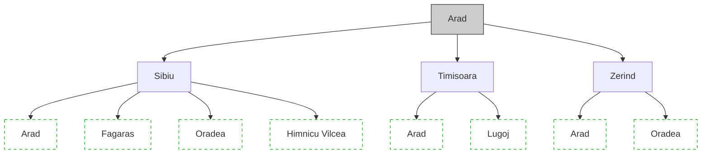

# Comparaison visuelle S17 - "Arbre d'exploration: exemple"
# Deck: 02-resolution-problemes (EPITA)

**Date**: 2026-04-19
**Analyste**: Claude Sonnet 4.6 (vision native, sans MCP sk-agent)
**Slides examinées**:
- A (Slidev): `slidev-export/17.png`
- B (PPTX): `pptx-reference/slide-17.png`

---

## 1. Que représente chaque image ?

### A — Slidev (slide 17)

La slide Slidev affiche :
- **Titre** : "Arbre d'exploration: exemple" (rouge foncé, aligné à gauche, souligné par un filet rouge)
- **Paragraphe introductif** : "Arbre de recherche avec la racine **Arad** : developpement des successeurs Sibiu, Timisoara, Zerind, puis de leurs propres successeurs."
- **Diagramme** : un arbre textuel ASCII dans un rectangle gris clair, centré dans la moitié gauche de la slide. L'arbre montre Arad → {Sibiu, Timisoara, Zerind} → leurs enfants (Arad, Fag, Ora, RilV, Arad, Lugoj, Arad, Oradea, ...). Les branches sont tracées avec des caractères `/`, `|`, `\`. Dimensions : occupe environ 40% de la largeur et 25% de la hauteur totale.
- **Deux bullets** sous le diagramme :
  - "Noeuds en **tirets verts** : successeurs non encore développés (frontière)"
  - "Les états répétés (Arad) apparaissent mais ne doivent pas être re-explorés"
- **La moitié droite de la slide est entièrement vide** (espace blanc mort).

**Conclusion** : La slide Slidev montre bien un arbre d'exploration, mais sous forme ASCII art — pas de carte Roumanie. L'audit précédent signalant une "carte Roumanie" est **INFIRMÉ** pour cette slide.

### B — PPTX (slide 17)

La slide PPTX affiche :
- **Titre** : "Arbre d'exploration: exemple" (rose/magenta, centré, police serif)
- **Numéro de slide** : "17" dans un cercle gris au centre du titre
- **Diagramme** : un arbre graphique vectoriel sur fond blanc, occupant ~80% de la surface de la slide. Les nœuds sont des ellipses ovales avec :
  - Nœud racine : Arad (gris, centre-haut)
  - Niveau 1 : Sibiu (gauche), Timisoara (centre), Zerind (droite) — ellipses blanches, bordure noire, liaisons en traits pleins noirs
  - Niveau 2 : sous Sibiu → {Arad, Fagaras, Oradea, Himnicu Wcea} ; sous Timisoara → {Arad, Lugoj} ; sous Zerind → {Arad, Oradea}
  - Nœuds feuilles : ellipses en **tirets verts** avec des petits traits verts divergeant vers le bas (représentation visuelle des successeurs non développés)
- **Pied de page** : "IA 101" en bas à gauche, fond gris-bleu
- **Pas de texte explicatif** : le diagramme seul occupe toute la surface utile

**Conclusion** : Le PPTX montre un arbre graphique propre avec codage couleur (vert = frontière), visuellement riche et immédiatement lisible.

---

## 2. Quelle version est meilleure pour enseigner en amphithéâtre ?

**Vainqueur net : PPTX (B)**

| Critère | Slidev (A) | PPTX (B) |
|---|---|---|
| Lisibilité à distance (amphi) | 4/10 — ASCII art illisible au fond | 8/10 — graphe vectoriel, nœuds larges |
| Codage couleur "frontière" | 0/10 — texte dit "tirets verts" mais le diagramme est monochrome | 9/10 — ellipses vertes visibles immédiatement |
| Utilisation de l'espace | 5/10 — moitié droite vide | 8/10 — diagramme occupe toute la surface |
| Hiérarchie visuelle | 6/10 — titre + texte + ASCII + bullets | 8/10 — titre + graphe seul, focus direct |
| Cohérence avec le titre | 7/10 — arbre présent mais sous-optimal | 9/10 — arbre graphique explicite |

L'ASCII art de Slidev est particulièrement problématique : le bullet "Noeuds en **tirets verts**" mentionne une couleur verte qui n'apparaît **nulle part** dans le diagramme Slidev — incohérence pédagogique directe. Un étudiant au fond de l'amphi ne pourra pas lire les noms de villes dans le tableau ASCII.

---

## 3. Correspondance titre / contenu

**Les deux slides correspondent au titre** "Arbre d'exploration: exemple". Aucune ne montre une carte de Roumanie. L'audit précédent était incorrect sur ce point pour la slide 17.

Cependant, le PPTX **illustre mieux** le concept pédagogique visé :
- Le codage couleur vert est réellement visible (frontière vs développé)
- La structure arborescente est immédiatement perceptible (liens graphiques)
- Les nœuds répétés (Arad apparaissant 3 fois) sont clairement identifiables

Le Slidev transmet l'information mais avec une friction pédagogique élevée.

---

## 4. Top 3 changements concrets à appliquer au Slidev

### Changement 1 — Remplacer l'ASCII art par un diagramme Mermaid

**Priorité : CRITIQUE**

L'ASCII art est illisible en amphi et ne peut pas rendre le codage couleur. Remplacer par un bloc Mermaid :

Cela reproduit fidèlement le codage couleur du PPTX (nœuds frontière en vert pointillé).

### Changement 2 — Supprimer le bullet "tirets verts" / intégrer la légende dans le diagramme

**Priorité : HAUTE**

Le bullet "Noeuds en tirets verts" est redondant si le diagramme utilise réellement des tirets verts, et trompeur si ce n'est pas le cas (situation actuelle). La légende doit être visuelle, pas textuelle. Options :
- Utiliser `classDef` Mermaid pour que le style soit directement visible
- Ou conserver un bullet court : "Vert pointillé = frontière (nœuds à développer)"

### Changement 3 — Occuper toute la largeur de la slide

**Priorité : MOYENNE**

La version Slidev laisse ~50% de l'espace horizontal inutilisé. Le diagramme (qu'il soit ASCII ou Mermaid) doit être centré et agrandi pour occuper au moins 70% de la largeur. En Slidev, ajouter `style` au bloc ou utiliser une mise en page `layout: center` avec le graphe en grand format.

Si le texte introductif est conservé, le déplacer au-dessus en 2 lignes maximum et allouer le reste à la visualisation.

---

## 5. Niveau de confiance

**Confiance : HAUTE (9/10)**

- Les deux images ont été lues directement par vision native, aucune inférence indirecte.
- Les noms de villes (Arad, Sibiu, Timisoara, Zerind, Fagaras, Oradea, Lugoj) sont lisibles dans les deux versions.
- Le codage couleur vert est visible dans le PPTX, absent dans le Slidev.
- **Point d'incertitude (1/10)** : le nom "Himnicu Wcea" dans le PPTX est partiellement lisible (espace et caractères flous à cette résolution) — probablement "Rimnicu Vilcea" (ville roumaine standard dans cet exemple AIMA classique).

---

## Synthèse

Le PPTX est pédagogiquement supérieur grâce à son graphe vectoriel coloré. Le Slidev contient les bonnes informations textuelles mais sa représentation ASCII est inexploitable en amphi. La priorité absolue est de remplacer l'ASCII art par un diagramme Mermaid avec codage couleur vert pour les nœuds frontière.

L'audit signalant une "carte Roumanie" sur cette slide est infirmé : les deux slides montrent bien un arbre d'exploration (pas une carte géographique).
