# Résolution de problèmes

INTELLIGENCE ARTIFICIELLE -- II

- Explorations non informée et informée
  - Jeux
  - Problèmes à satisfaction de contraintes

---

# Plan du cours

<ol class="roman-list">
<li>Introduction</li>
<li><strong>Résolution de problèmes</strong></li>
<li>Bases de connaissances et logique</li>
<li>Raisonnement probabiliste</li>
<li>Apprentissage</li>
<li>Traitement du langage naturel</li>
<li>TP final projets trimestriels</li>
</ol>

---

# Sommaire

- **Agents de résolution de problèmes**
- **Résolution de problèmes par exploration**
  - Exploration non informée
  - Heuristiques et exploration informée
- **Exploration en situation d'adversité : les jeux**
  - Minimax et Alpha-Beta
  - Décisions imparfaites
- **Problèmes à satisfaction de contraintes**
  - Backtracking
  - Exploration locale
  - Structure des problèmes
- **TP** : Mise en oeuvre de l'exploration et de la satisfaction de contrainte dans un contexte ludique

---
layout: section
---

# Agents de résolution de Problèmes
---

# Agent fondé sur des buts


- **Réactif → Délibératif**
  - Exploration du Futur, séquences d'actions
  - Recherche, planification

- **Composants :**
  - États, Buts, Capteurs, Effecteurs
- **Questions clés :**
  - "Comment le monde evolue-t-il ?"
  - "Quel est l'impact de mes actions ?"
  - "À quoi ressemble le monde maintenant ?"
  - "Quelle action entreprendre maintenant ?"

---

# Résolution de problèmes

- Quel est **l'objectif** à atteindre ?
- Quelles sont les **actions** possibles ?
- Quelle est la **représentation** de l'état courant ?

<div style="display:flex; align-items:center; justify-content:center; gap:0; margin-top:24px;">
  <div style="background:#2563EB; color:white; font-weight:bold; padding:18px 20px; clip-path:polygon(0 20%, 15% 0, 100% 0, 100% 100%, 15% 100%, 0 80%); text-align:center; min-width:110px;">Etat<br>Initial</div>
  <div style="background:#9CA3AF; color:white; padding:18px 16px; clip-path:polygon(0 0, 85% 0, 100% 50%, 85% 100%, 0 100%); text-align:center; min-width:120px;">Actions</div>
  <div style="background:#9CA3AF; color:white; padding:18px 16px; clip-path:polygon(0 0, 85% 0, 100% 50%, 85% 100%, 0 100%); text-align:center; min-width:120px; opacity:0.7;"></div>
  <div style="background:#2563EB; color:white; font-weight:bold; padding:18px 20px; clip-path:polygon(0 0, 85% 0, 100% 20%, 100% 80%, 85% 100%, 0 100%); text-align:center; min-width:110px;">Etat<br>Final</div>
</div>

---

# Agents de résolution de problèmes

## Fonction Agent-Simple-Resolution-Problème

```
fonction Agent-Simple-Resolution-Probleme(percept) retourne une action
  persistante: seq (sequence d'actions, initialement vide)
               etat (description de l'etat courant du monde)
               but (initialement vide)
               probleme (formulation du probleme)
  etat <- Actualiser-Etat(etat, percept)
  si seq est vide alors
    but <- Formuler-But(etat)
    probleme <- Formuler-Probleme(etat, but)
    seq <- Explorer(probleme)
    si seq = echec alors retourner une action vide
  action <- Premier(seq)
  seq <- Reste(seq)
  retourner action
```

---

# Exemple: Itineraire

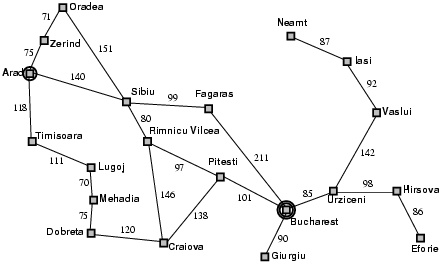

- En vacances en Roumanie; actuellement à Arad.
- Le vol part demain de Bucharest
- **Formuler le but :**
  - Etre à Bucharest
- **Formuler le problème :**
  - **États** : plusieurs villes
  - **Actions** : conduire d'une ville à l'autre
- **Trouver la solution :**
  - Séquence de villes e.g., Arad, Sibiu, Fagaras, Bucharest

---

# Types de problèmes

- **Déterministes, complètement observables** → **problème à état simple**
  - L'agent sait exactement dans quel état il sera ; la solution est une séquence
- **Non-observable** → **problème sans capteur** dit conformant
  - L'agent peut ne pas savoir ou il est, la solution est une séquence
- **Non déterministe et/ou partiellement observable** → **problème de contingence**
  - Les percepts fournissent une **nouvelle** information à propos de l'état courant
  - Entrelacement &#123;calcul, action&#125;
- **Espaces d'états inconnu** → **problèmes d'exploration en ligne**

---

# Formulation de problèmes

Un **problème** est défini par les éléments suivants :

1. **Etat initial** e.g., "à Arad"
2. **Actions** ou **fonction successeur** S(x) = ensemble de paires actions - état
   - e.g., S(Arad) = &#123;(Arad → Zerind, Zerind), ... &#125;
   - AIMA : ActionsFunction et ResultFunction = **modèle de transition**
   - 1+2 = Espace des états → graphe → chemins
3. **Test de but**, qui peut être
   - *explicite*, e.g. x = "à Bucharest"
   - *implicite*, e.g. ÉchecEtMat(x)
4. **Coût de chemin** (optionnel, additif)
   - e.g., Somme des distances, Nombre d'actions executees, etc.
   - c(x,a,y) est le **coût d'étape**, (>= 0)

- Une **solution** est une séquence d'actions (chemin) qui conduit de l'état initial à un état but
  - **Optimale** = coût minimum

---

# Sélection d'un espace des états

- Le monde réel est très complexe
  - L'espace des états doit faire l'objet d'une **abstraction**
- **Etat** (abstrait) = ensemble d'états réels
- **Action** (abstraite) = combinaison complexe d'actions réelles
  - e.g. "Arad → Zerind" représente un ensemble de routes, détours, pauses etc.
  - Pour une réalisation garantie, chaque état réel "à Arad" doit conduire à un état réel "à Zerind"
- **Solution** (abstraite) = ensemble de chemins réels qui sont solutions dans le monde réel
  - Chaque action abstraite doit être plus "facile" que dans le problème réel
- **Problème jouet** : expérimenter avec les méthodes de résolution

---

# Exemple Abstraction: Assemblage robotique


- **États** : Coordonnées réelles des joints du robot et des objets
- **Test de but** : Objet assemblé
- **Etat initial** : Pièces détachées, bras au repos
- **Actions** : Mouvement continu des joints du bras robotique
- **Coût de chemin** : temps d'exécution

---

# Problème jouet: Le taquin

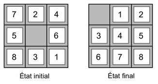

- **États** : Position des 8 pièces + case vide
- **Test de but** : Etat == &#123; 0, 1, 2, 3, 4, 5, 6, 7, 8 &#125;
- **Etat initial** : La moitié des états possibles
- **Actions** : case vide → gauche, droite, haut, bas
- **Coût de chemin** : 1 par étape
- Note : puzzle à glissement de pièces : problèmes NP-complet (durs)

---

# Problème jouet: Les 8 reines

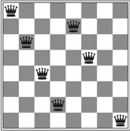

- **États** : Disposition de 0-8 reines
- **Test de but** : 8 reines presentes, aucune n'est menacee
- **Etat initial** : Échiquier vide
- **Actions** : Poser une reine
- **Coût de chemin** : N.A / 1 par étape
- **Meilleure formulation:** une reine par colonne, legale
  - 1,8 * 10^14 positions (dur) → 2057 positions (facile)

---
layout: section
---

# Résolution de Problèmes par Exploration
---

# Arbre d'exploration

## Idee de base

- Exploration simulée (hors ligne) de l'espace des états en générant les successeurs des états déjà explorés (**développement** des états)
- Ensemble des noeuds feuilles = **frontiere** d'exploration
- Choix des noeuds à développer = **stratégie** d'exploration

## Fonction EXPLORER-ARBRE

```
fonction EXPLORER-ARBRE(probleme) retourne une solution, ou echec
  initialiser la frontiere avec l'etat initial de probleme
  faire en boucle
    si la frontiere est vide alors retourner echec
    choisir un noeud feuille et l'enlever de la frontiere
    si le noeud contient un etat but alors retourner la solution correspondante
    developper le noeud choisi, en ajoutant les noeuds obtenus a la frontiere
```

---

# Arbre d'exploration: exemple

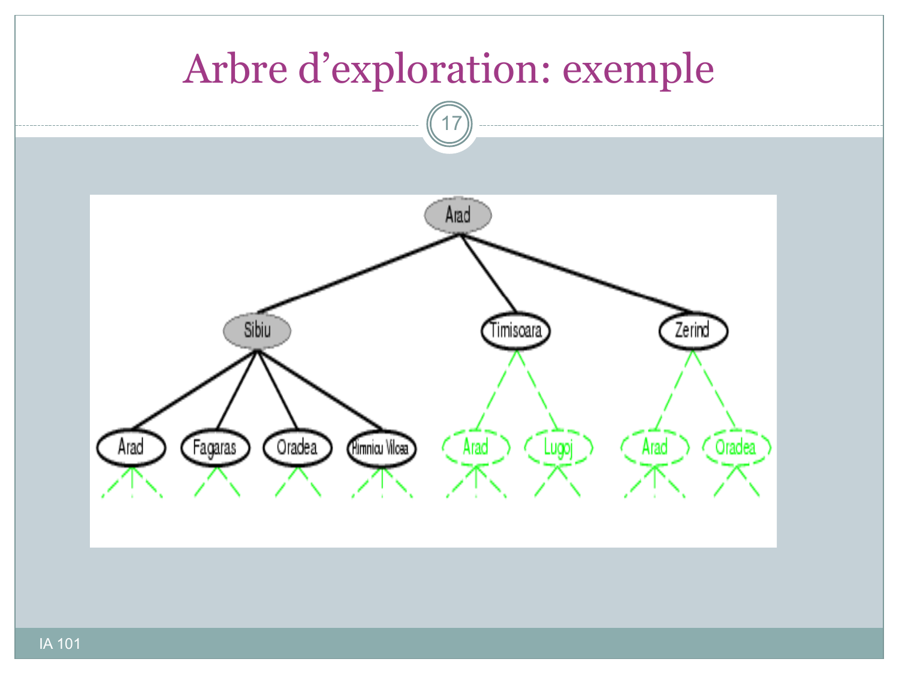

Arbre de recherche avec la racine **Arad** : développement des successeurs Sibiu, Timisoara, Zerind, puis de leurs propres successeurs.

- Noeuds en **tirets verts** : successeurs non encore développés (frontière)
- Les états répétés (Arad) apparaissent mais ne doivent pas être réexplorés

---

# Exploration de graphe

## Idée de base

- États répétés → chemins avec boucle
- **Solution** : mémoire = ensemble exploré
- **Frontière** : sépare espace exploré et espace inconnu

## Fonction EXPLORER-GRAPHE

```
fonction EXPLORER-GRAPHE(probleme) retourne une solution, ou echec
  initialiser la frontiere avec l'etat initial de probleme
  initialiser l'ensemble des noeuds explores a vide
  faire en boucle
    si la frontiere est vide alors retourner echec
    choisir un noeud feuille et l'enlever de la frontiere
    si le noeud contient un etat but alors retourner la solution correspondante
    ajouter le noeud a l'ensemble des noeuds explores
    developper le noeud choisi, en ajoutant les noeuds obtenus a la frontiere
    seulement si ils ne sont ni dans la frontiere, ni dans l'ensemble explores.
```

---

# Infrastructure: États vs Noeuds

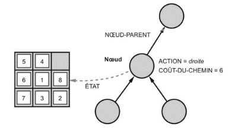

## États != Noeuds

- Un **Etat** : représentation de la configuration réelle
- Un **Noeud** : structure de donnees de l'exploration
  - état, parent, action, coût g(x), profondeur

## Fonction NOEUD-FILS

```
fonction NOEUD-FILS(probleme, parent, action) retourne un noeud
  retourner un noeud avec
    ETAT = probleme.Resultat(parent.Etat, action),
    PARENT = parent, ACTION = action,
    COUT-CHEMIN = parent.COUT-CHEMIN
                + probleme.COUT-ETAPE(parent.Etat, action)
```

---

# Stratégies d'exploration

Une stratégie d'exploration définit l'ordre de développement des noeuds.

## Criteres d'évaluation

- **Completude** : garantie d'obtenir une solution si elle existe
- **Optimalite** : garantie d'obtenir une solution de coût minimal
- **Complexité en temps** : ~ nombre de noeuds développés
- **Complexité en espace** : ~ nombre max de noeuds en mémoire

## Complexités s'évaluént selon

- **b** : facteur maximal de branchement dans l'arbre de recherche
- **d** : (depth) profondeur de la solution de moindre coût
- **m** : profondeur maximale de l'espace d'états (souvent infini)

---
layout: section
---

# Exploration Non Informée
---

# Stratégies d'exploration non informée

Les stratégies non informées (aveugle) utilisent uniquement la définition du problème.

## Stratégies d'exploration en largeur

- **BFS** : En largeur d'abord (Breadth First Search)
- **UCS** : A coût uniforme (Uniform Cost Search)

## Stratégies d'exploration en profondeur

- **DFS** : En profondeur d'abord (Depth First Search)
- **DLS** : En profondeur limitée (Depth Limitéd Search)
- **IDS** : Iterative en profondeur (Iterative Depth Search)

## Variantes

- Bidirectionnelle

---

# Exploration en largeur d'abord (BFS)


- Développé les noeuds les **moins profonds** en premier
- La frontière est une **queue** (File ou FIFO)

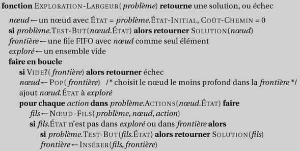

---

# Propriétés de l'exploration en largeur

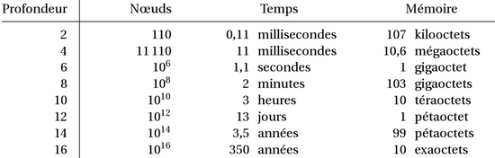

- **Complet** ? Oui (si b est fini)
- **Complexité en temps** ? O(b^(d+1))
- **Complexité en espace** ? O(b^(d+1))
  - chaque noeud est gardé en mémoire
- **Optimale** ? Oui si coût d'étape = 1
- L'**espace** est le plus gros problème

---

# Exploration à coût uniforme (UCS)

- Développé les noeuds les moins coûteux en premier
  - La frontiere est une queue triee par coût de chemin
- Equivaut à l'exploration en largeur d'abord si le coût d'étapes est uniforme
- En théorie de graphes = algorithme de Dijkstra

## Caracteristiques

- Complet? Oui, si coût d'étape >= epsilon
- Complexité en temps et en espace: O(b^(1+plafond(C*/epsilon)))
  - avec C* le coût d'une solution optimale
- Optimal ? Oui: les noeuds sont développés dans l'ordre des coût de chemin

---

# Exploration en profondeur d'abord (DFS)


- Développé les noeuds les **plus profonds** en premier
  - Frontiere = **Pile** (LIFO)
  - Branches explorees non conservees

## Caracteristiques

- **Complet ?** Non : profondeur infinie ou boucles
- **Temps** : O(b^m), mauvais si m >> d
- **Espace** : O(b^m) -- linéaire !
- **Optimal** : Non

## Variante : backtracking

- 1 seul successeur à la fois -> O(m) en espace
- Modifier l'état plutot que le copier

---

# Exploration en profondeur limitée (DLS)

= Exploration en profondeur d'abord avec une profondeur limité l

- Les noeuds de profondeur l n'ont pas de successeur
- Complet si l >= d = diamêtre de l'espace des états

## Implementation recursive

```
fonction Exploration-Profondeur-Limitee(probleme, limite) retourne une solution, ou echec/arret
  retourner EPL-Recursive(Creer-Noeud(probleme.Etat-Initial), probleme, limite)

fonction EPL-Recursive(noeud, probleme, limite) retourne une solution, ou echec/arret
  si probleme.Test-But(noeud.Etat) alors retourner Solution(noeud)
  sinon si limite = 0 alors retourner coupure
  sinon
    arret_rencontre? <- faux
    pour chaque action dans probleme.Actions(noeud.Etat) faire
      fils <- Noeud-Fils(probleme, noeud, action)
      resultat <- EPL-Recursive(fils, probleme, limite - 1)
      si resultat = coupure alors arret_rencontre? <- vrai
      sinon si resultat != echec alors retourner resultat
    si arret_rencontre? alors retourner coupure sinon retourner echec
```

---

<style scoped>
.slidev-layout { font-size: 0.85em; }
h2 { font-size: 1.1em !important; margin-top: 0.3em !important; margin-bottom: 0.1em !important; }
</style>

# Exploration iterative en profondeur (IDS)

On augmente graduellement l

```
fonction Exploration-Iterative-Profondeur(probleme) retourne une solution, ou echec
  pour profondeur = 0 jusqu'a l'infini faire
    resultat <- EXPLORATION-LIMITEE-PROFONDEUR(probleme, profondeur)
    si resultat != arret alors retourner resultat
```

## Coût du même ordre que l'exploration en profondeur limitée

- Pour b = 10, d = 5: ~+10% (contre intuition)
  - N_DLS = 1 + 10 + 100 + 1,000 + 10,000 + 100,000 = 111,111
  - N_IDS = 6 + 50 + 400 + 3,000 + 20,000 + 100,000 = 123,456

## Caracteristiques

- Complet: Oui | Temps: O(b^d) | Espace: O(b*d) | Optimale: Oui si coût d'étape = 1

**Analogue :** Exploration iterative par allongement (ILS) pour coût uniforme

---

# Exploration Bidirectionnelle


## Quand on connait l'état but

- Double exploration vers l'aval et vers l'amont
- Interet : O(b^(d/2)) + O(b^(d/2)) est tres inferieur à O(b^d)

## Exemple courant

- Logiciel de navigation GPS

## Difficultes

- Nécessite une fonction Prédécesseurs
- Controle de l'intersection
  - maintient de la frontiere, même en profondeur + hachage pour comparaison
  - + Solution non optimale même en largeur -> continuer pour trouver les raccourcis
- États buts complexes
  - Plusieurs états buts -> Etat but fictif en l'aval des états buts
  - Description implicite (ex: 8 reines) -> difficile

---

# Résumé Exploration non informée

## Nécessite d'une abstraction du monde réel

## Varie des stratégies non informées

- En largeur = Queue
- En profondeur = Pile
- Compromis complexité espace vs temps
- Presence de cycles -> exploration de graphe

## Comparaison des explorations non informées

| Critere | Largeur d'abord | Coût uniforme | Profondeur d'abord | Profondeur limitée | Profondeur iterative | Bidirectionnelle |
|--------|-----------------|---------------|--------------------|--------------------|-----------------------|------------------|
| Complete? | Oui | Oui | Non | Oui (si l>=d) | Oui | Oui |
| Temps | O(b^(d+1)) | O(b^(1+C*/epsilon)) | O(b^m) | O(b^l) | O(b^d) | O(b^(d/2)) |
| Espace | O(b^(d+1)) | O(b^(1+C*/epsilon)) | O(b^m) | O(b^l) | O(b^d) | O(b^(d/2)) |
| Optimal? | Oui (coût=1) | Oui | Non | Non | Oui (coût=1) | Oui |

---

# Les missionnaires et cannibales

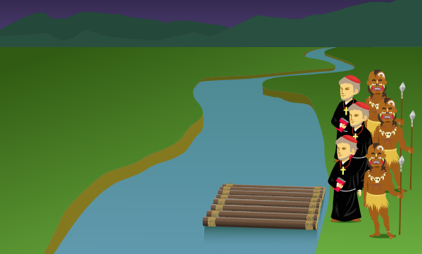

- Les missionnaires et cannibales doivent traverser la riviere
- Pas plus de 2 personnes sur la barque
- Si + de cannibales que de missionnaires d'un cote
  - → les missionnaires sont manges

---
layout: section
---

# Exploration Informée
---

# Exploration gloutonne

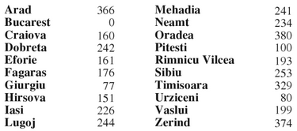

## Idee

- Utiliser une **heuristique** h(n)
  - = coût estime pour atteindre le but depuis n
  - f(n) = g(n) + h(n)
  - Développé le noeud avec le plus petit f(n)

## Caracteristiques

- Complet? Non, peut être piégé dans un maximum local
- Temps? O(b^m) mais un bon heuristique donne des bons résultats
- Espace? O(b^m)
- Optimal? Non

---

# Exploration A*

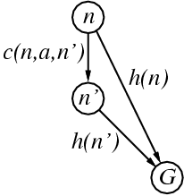

## Idee

- Eviter de développer les noeuds déjà coûteux
  - Minimisation du coût total estime de la solution

## Fonction d'évaluation f(n) = g(n) + h(n)

- g(n) = coût pour atteindre n
- h(n) = coût estime de n au but
- f(n) = coût total estime du chemin au but en passant par n

## Identique à UCS avec g+h au lieu de g

## Théorèmes

- Si h(n) est admissible, A* est optimal en exploration d'arbre
  - Demonstration par l'absurde en développant
- Si h(n) est consistante, A* est optimal en exploration de graphe
  - Demonstration: f est monotone puis par l'absurde en développant

---

# Caracteristiques de A*


## Optimalite de A*

- Ajoute graduellement des "f-contours" de noeuds
- Le contour i à tous les noeuds avec f=f_i ou f_i < f_(i+1)

## Propriétés de A*

- Complet: Oui
  - Sauf s'il existe une infinite de noeuds avec f <= f(G)
- Complexité en temps: Exponentielle
- Complexité en espace: Idem
- Optimal? Oui (cf. théorèmes)
  - + optimalement efficace pour toute heuristique consistante donnee

## Limités

- Nombre d'états dans l'espace d'exploration des contours souvent exponentiel.
- Souvent, le principal problème est la mémoire

---

# Variations

## Exploration heuristique à mémoire limitée

- A* avec approfondissement itératif (IDA*)
  - Coupe: coût f le plus faible parmi les noeuds en depassement
- Exploration recursive par le meilleur d'abord (RBFS)
  - Espace en mémoire linéaire: valeur f du meilleur chemin alternatif
  - Recursion avec valeur rapportee: meilleure valeur f des enfants oublies
  - Mais exces inverse: trop peu de mémoire et trop de "redéveloppements"
- Utilisation de toute la mémoire disponible
  - MA* (A* sous contrainte de mémoire)
  - SMA* (simplified MA*)
    - On oublie quand plus de place disponible, le noeud le plus mauvais

## Exploration avec apprentissage

- Espace des états de metaniveau = états de l'algorithme d'exploration (noeuds, arbres etc.)
- Techniques d'apprentissage au metaniveau -> compromis entre coût de calcul et coût de chemin

---

# Effet de l'exactitude de l'heuristique

## Efficacité fonction de l'erreur absolue ou relative de l'heuristique

- Delta = h* - h, epsilon = (h* - h)/h*
- Complexité en O(b^epsilon*d) ou O(b^(epsilon*d)) à coût d'étape constant

## Facteur de branchement effectif b*

- Facteur de branchement équivalent sans heuristique (exploration à coût uniforme)
- Bonne indication de l'utilité globale de l'heuristique

## Dominance

- Si h1 et h2 admissibles et h2(n) >= h1(n) pour tout n, h2 domine h1
- Si h2 domine h1, h2 est meilleure

---

# Production d'heuristiques

## Problèmes relaxes

- Problème avec moins de restrictions = **problème relaxé**
- Coût exact = heuristique admissible
- Exemple du Taquin: h1 (nb pieces mal placees), h2 (distance Manhattan)

## Sous-problèmes

- Exemple: taquin (pieces 1,2,3,4)
- **Bases de donnees de motifs**: coût exact sous-problèmes = heuristique générale
- **Motifs disjoints** : question de l'additivité des heuristiques admissibles

## Apprentissage d'heuristiques

- Utilisation de l'expérience sur solutions connues
- Apprentissage inductif (ex: h(n) = c1*x1(n) + c2*x2(n))
- Domaine vaste: apprentissage = machine learning

---
layout: section
---

# Algorithmes d'Exploration Locale
---

# Algorithmes d'exploration locale

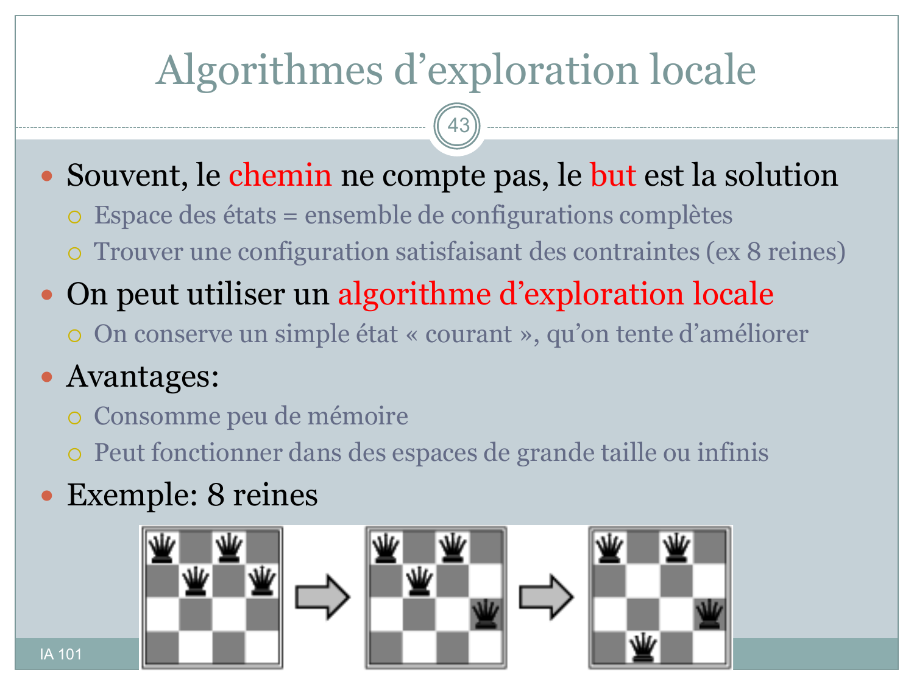

## Objectif: but = solution (chemin secondaire)

- Espace états = configurations complètes (ex: 8 reines)

## Algorithme d'exploration locale

- Conserve un état "courant" à améliorer

## Avantages

- Peu de mémoire
- Fonctionne dans espaces grands/infinis

## Exemple: 8 reines

---

# Paysage de l'espace des états

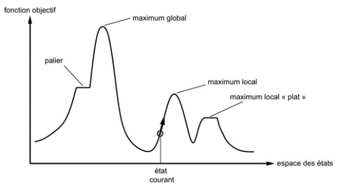

## Problèmes d'optimisation

- Objectif = meilleur état selon **fonction objectif**

## Utilité du paysage

- Recherche maximum (f = -h)
- **Complet**: trouve toujours un but
- **Optimal**: trouve maximum global

---

# Exploration par escalade (HCS)

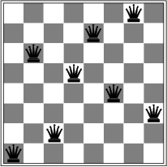

## Escalade par la plus forte pente

```python
retourne maximum local
  boucle courant <- voisin max valeur
  si voisin <= courant, retourner courant
```

## Exploration locale "gloutonne"

- Maxima locaux, crêtes, plateaux, paliers

## Solution: deplacement latéraux

- Nécessite de limités

## Escalade stochastique: premier choix aléatoire (incomplet)

## Escalade reprise aléatoire (complet)

---

# Exploration par recuit simulé (SA)

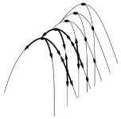

## Idee : echapper aux maxima locaux

- Autoriser mauvais deplacements, diminuer leur frequence progressivement

## Code

```python
boucle t -> infini
  si T=1 retourner courant
  sinon -> voisin aléatoire
  DeltaE = voisin - courant
  suivant si DeltaE > 0
  sinon courant avec proba e^(DeltaE/T)
```

## Frequence <- temperature T

- T diminue doucement -> proba optimum global -> 1
- Utilise dans circuits, ordonnancement (ex: carton de babioles)

---

# Exploration locale en faisceau (LBS)

## Idee: suivre k états (ex: *Perdus en foret*)

- k états aléatoires, generation tous succes, sélection k meilleurs

## Transfere progressif ressources

- Risque: transfert trop rapide vers une petite region

## Variante: exploration en faisceau stochastique

- Analogue escalade stochastique; k choix aléatoire (proba = valeur)
- Analogue sélection naturelle -> GAs

---

# Algorithmes génétiques (GAs)

## Variante faisceau stochastique

- Successeurs = combinaisons (approx reproduction)

## Population (individus, taille constante)

## Genes (recombinaison, mutations aléatoires)

## Phenotype (fonction d'adaptation: *fitness function*)

## Code

```
algorithme génétique (selection, reproduction, mutation, retour meilleur individu)
```

---

# Algorithme génétique pour les 8 reines

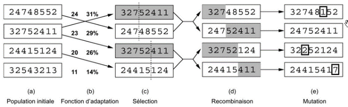

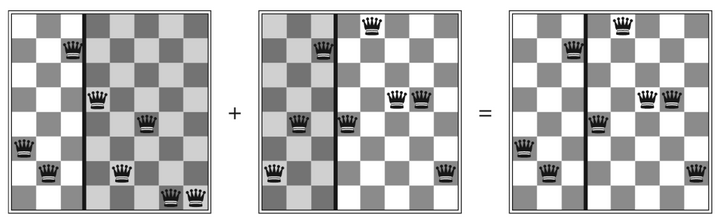

## Phenotype

- Diagramme: 3 échiquiers (addition de deux, résultat)

---
layout: section
---

# Exploration Locale - Espaces Continus
---

# Exploration locale d'espaces continus


## États définis par des variables réelles

## Problèmes de discontinuites

- Une solution = Discretisation des voisinages

## Pente pour l'escalade = gradient du paysage

- Parfois résolution analytique de nabla f = 0 (rare)
- Si valable localement: x <- x + alpha * nabla f
  - alpha = pas de l'étape
- Si pas analytique: gradient empirique
  - Exploration linéaire
    - alpha trop petit ou trop grand -> on double le pas jusqu'a observer une diminution
  - Méthode de Newton-Raphson
    - Formule de Newton pour trouver g(x) = 0 : x <- x - g(x) / g'(x)
    - En prenant pour g le gradient de f: x <- x - H^-1(x) nabla f(x)
      - avec H matrice Hessienne des derivees secondes de f
    - Methodes modernes (RMSProp, ADAM)

## Optimisation sous contrainte

- Contraintes sur les variables
- Programmation linéaire
  - <- inegalites formant ensemble convexe (pas de trous)
  - Tres etudie -> complexité polynomiale

---
layout: section
---

# Extensions
---

# Exploration avec actions non déterministes

## Cf. cours précédent → utilité des percepts

- Solution != séquence → plan contingent ou stratégie

## Arbres ET-OU : entrelacement de nœuds

- Nœuds OU = Choix d'exploration classique
- Nœuds ET = "Choix" de l'environnement
- Solutions cycliques → possibilité d'étiquettes (tant que...)

## Ex: Aspirateur glissant

- Où l'action de déplacement peut échouer

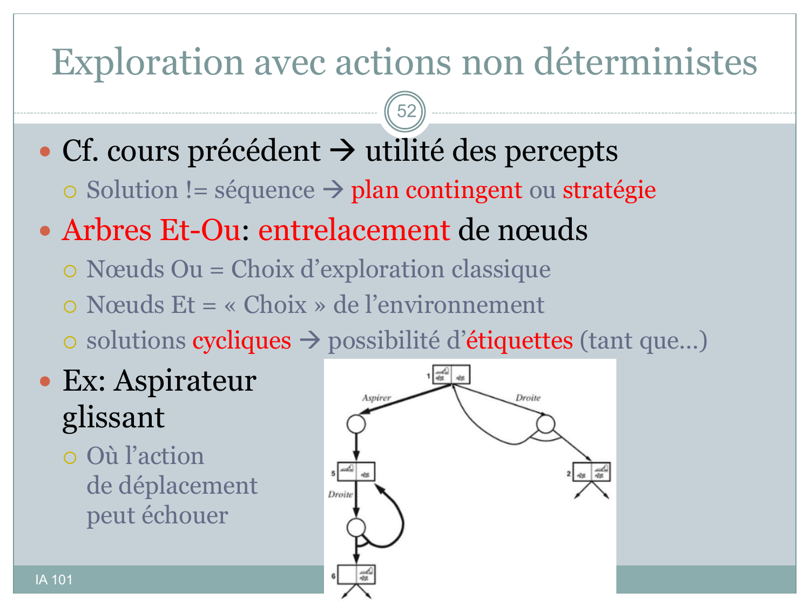

---

# Exploration avec observations partielles

## Cf. cours précédent → État pas situé précisément

- Analogue à non déterministe
- État de croyance : états physiques possibles

## Exploration sans observation : problème conformant

- Parfois parfaitement soluble. Ex : positionnement de pièces
- Idée → contraindre le monde
- N états physiques → 2^N états de croyance
- Modèle de transition → étape de prévision

## Exploration incrémentale

- → Arbres ET-OU complets

## Exploration avec observation

- Étape de prévision d'observations
- Étape de mise à jour

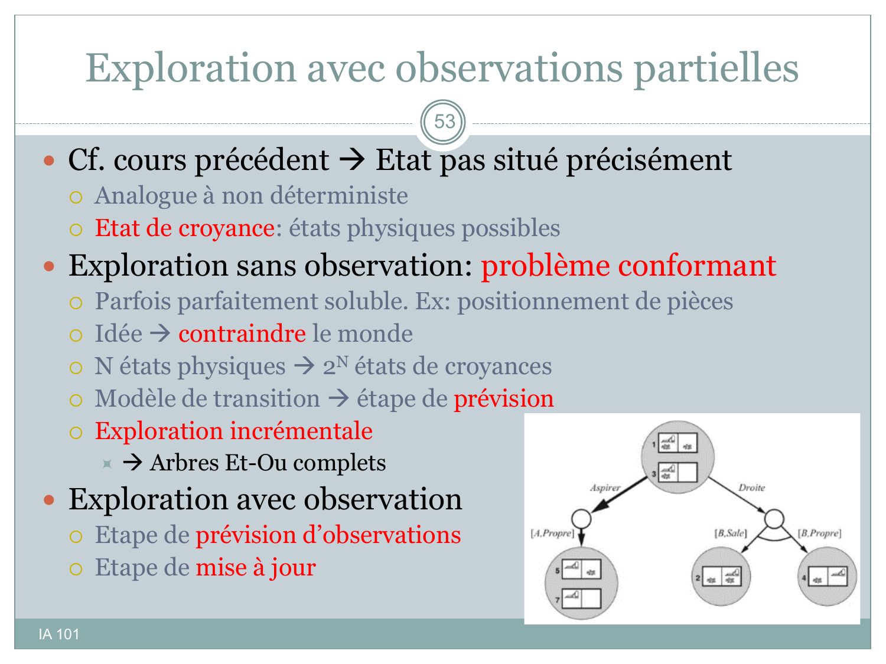

---

# Exploration en ligne

## Entrelacement calcul et action

- Problèmes de découverte

## Ratio de compétitivité

- En temps, vis-à-vis d'un espace connu

## Il y a parfois des impasses

- Sinon l'espace est explorable sans risque

## Algorithmes

- DFS, Escalade avec reprise aléatoire
- Mémoire → estimation H de l'heuristique h
  - LRTA\* (learning real time A\*)

## Code

```text
fonction LRTA*-Agent(s') retourne une action
  entrées: s', un percept qui identifie l'état courant
  persistante: résultat, une table indexée par état et action
               H, une table d'estimation des coûts indexée par état
               s, a, l'action et l'état précédents, initialement nuls
  si Test-But(s') alors retourner stop
  si s' est un nouvel état (pas dans H) alors H[s'] ← h(s')
  si s n'est pas nul
    résultat[s, a] ← s'
    H[s] ← min_b Actions(s) COUT-LRTA*(s, b, résultat[s, b], H)
  a ← action b dans Actions(s) minimisant COUT-LRTA*(s', b, résultat[s', b], H)
  s ← s'
  retourner a
```

## Apprentissage

- De la "carte" (États)
- Du coût d'étape
- Des règles (transitions)

---

# Résumé Exploration Informée

## Heuristiques

- Admissibles
- Consistantes

## Meilleur d'abord

- Exploration Gloutonne (h)
- A* (g+h) + variantes limitées en mémoire

## Exploration Locale

- Paysage de l'espace d'états
- Escalade, Recuit simulé
- Exploration en Faisceau, stochastique, algorithmes génétiques

## Extensions

- Espaces continus -> gradients, programmation linéaire
- Actions Non déterministe -> Arbres Et-Ou
- Observations partielles -> prévisions, exploration en ligne

---
layout: section
---

# Jeux vs Exploration
---

# Jeux vs Exploration

## Environnements

- multi-agents
- concurrentiels

## Classe de jeux la plus etudiee (échecs, Go)

- Alternes
- Déterministes
- A somme nulle (h1 = -h2)
- A information parfaite

## Difficulte

- Impr edictibilite -> arbre d'exploration complet
- Impraticable, solution optimale impossible
- Performance critique: temps -> victoire

---

# Arbre de jeu

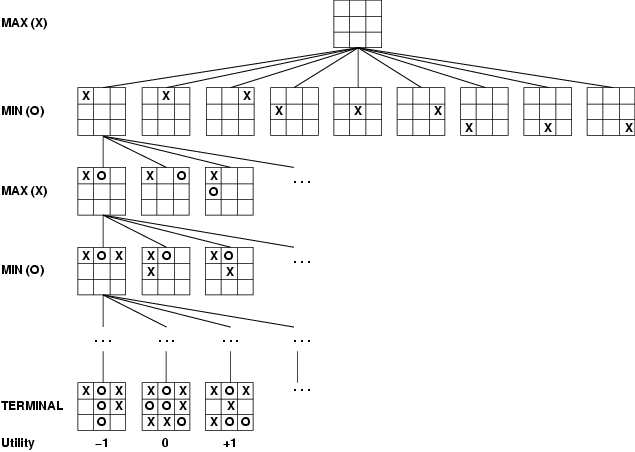

## Ex : Morpion

- **Etat initial** S0
- **Joueurs** : Max, Min
- **Actions** : Coups
- **Résultat**(s,a) : Modèle de transition
- **Test-Terminal**(s) : Fin de partie
- **Utilité**(s,p) : Score final de p

---

# Minimax

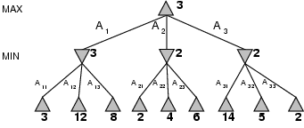

## Décisions optimales

- Espace Non déterministe
  - Stratégie contingente
  - Arbre Et-Ou
- 1 tour = 2 coups (Max, Min)

## Valeur Minimax

- Stratégie théorique optimale
- Les 2 joueurs jouent au mieux

## Formules Minimax

```
Minimax(s) = { Utilite(s) si Test-Terminal(s)
              max_a dans Actions(s) Minimax(Resultat(s,a)) si Joueur(s) = Max
              min_a dans Actions(s) Minimax(Resultat(s,a)) si Joueur(s) = Min
```

---

# Algorithme Minimax

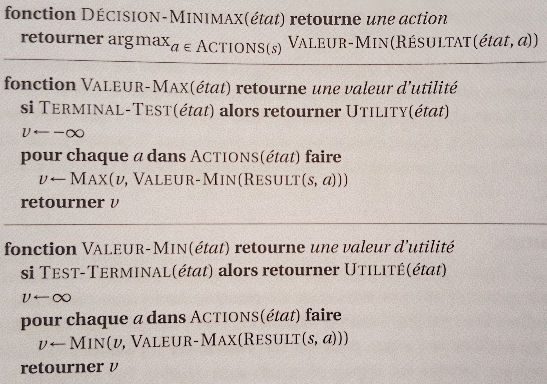

## Faire "remonter" les valeurs Minimax

## Propriétés

- Complet? Oui (si l'arbre est fini)
- Optimal? Oui (avec adversaire optimal)
- Complexité en temps: O(b^m)
- Complexité en espace: O(b^m) (DFS)
- Échecs: b ~ 35, m ~ 100
  -> complètement infaillable

## Mais c'est la base de

- l'analyse mathematique des jeux
- meilleurs algorithmes

## Cadre Multi-joueurs

- Même approche
- Vecteurs Utilité
- Souvent, alliances naturelles

---

# Élagage Alpha-Bêta

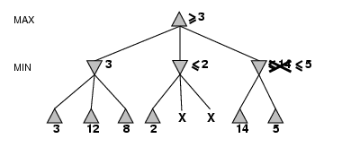

## Idee : Diminuer le nombre d'états à examiner

- Sans perdre l'optimalité
- Les branches mauvaises sont ignorées (élaguées)
  - alpha = meilleur coup pour Max
  - beta = meilleur coup pour Min

## L'ordre d'évaluation des coups est important

- Si l'ordre est "parfait":
  - la complexité devient O(b^(m/2))
  - facteur de branchement effectif sqrt(b)
  - profondeur double

## Approfondissement itératif : Heuristiques des coups de maître

## Permutations

- Certaines séquences distinctes sont équivalentes
- Maintiennent une table de transposition

## Exemple raisonnement au metaniveau

- Ex: raisonnement oriente buts ou autres types d'IA

---

# Décisions imparfaites

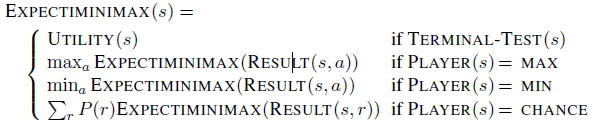

## Approche

- Utilité -> Eval(s) heuristique
  - sur des états non terminaux
- Test de terminaison -> Cutoff(s)
  - ex: profondeur limité d_lim

## Fonction d'évaluation

- Cf. Humains <- attributs d'un état
- Classe d'équivalence -> valeur attendue (utilité pondérée)
- Mais trop de classes -> valeur matérielle -> fonction linéaire pondérée
  - Eval(s) = w1*f1(s) + w2*f2(s) + ... + wn*fn(s)
- Mais non independance des attributs -> fonction non linéaire
- Si pas d'expérience, possibilité d'apprentissage (1 fou = 3 pions!)

## Exploration avec arret

- Alpha Beta Iteratif pour respecter une limité de temps (+ ordre des coups)
- Problème des situation instables au cutoff (prise au prochain tour)
  - Solution = recherche de stabilite ("quiescence", ex: pas de prise)

---

# Techniques avancees

## Élagage avant (forward pruning)

- Idee : ignorer certains coups sans les évaluér
- **Dangereux** : pas de consideration des noeuds elagues
- **Beam search** : n meilleurs coups par tour
- **ProbCut** : probabilite que le noeud soit hors [α, β]

## Exploration vs Consultation

- Échecs -- **debuts** et **fins de partie** documentes :
  - **Debut** : consultation de **livres d'ouverture** + statistiques de bases de parties
  - **Fin** : utilisation d'une **politique** (correspondance directe coup optimal), exploration retrograde

## Leçon

- Combiner **exploration** (milieu de partie) et **consultation** (bibliothèques)
- Alpha Beta itératif pour respecter une limité de temps + ordre des coups
- Recherche de **quiescence** aux cutoffs instables

---

# Exploration d'arbre de Monte-Carlo (MCTS)

## Principe -- simulations statistiques

Pas d'heuristique d'évaluation : **remplacee par des rollouts** (simulations aléatoires jusqu'a fin de partie).

## Algorithme (boucle)

1. **Sélection** : descente guidee par une **politique de sélection** (compromis exploration / exploitation)
2. **Expansion** : creation d'un ou plusieurs noeuds enfants
3. **Simulation (rollout)** : jeu aléatoire jusqu'a résultat
4. **Retropropagation** : les noeuds parents voient leur compteur de victoires / visites incrémenté

## Politique de sélection -- UCB1

$$
UCB1 = \bar{X_i} + C \sqrt{\frac{\ln N}{n_i}}
$$

- `C` : constante empirique ou apprise (cf. **AlphaGo / AlphaZero**)
- Combinaison avec **heuristique** possible
- Critere de terminaison avancee (apprentissage par renforcement)

## Applications

Go, Échecs (AlphaZero), planification en jeux partiellement observables.

---

# Classes de Jeux complexes

## Jeux stochastiques

- Presence d'aléatoire (des, cartes)
- **Valeur Minimax esperee** :
  - Noeud chance intercale entre MAX et MIN
  - `EU(n) = Σ P(résultat) × Minimax(résultat)`
- Ex : Backgammon, Monopoly, jeux de cartes

## Jeux partiellement observables

- **Information cachee** : cartes adverses, positions non révélées
- **Etat de croyance** (belief state) : distribution sur états compatibles avec l'observation
- Décision optimale : maximiser l'utilité **moyennée sur la croyance**
- Ex : Poker, Bridge, jeux de guerre à brouillard de guerre

## Defis

- **Explosion combinatoire** des états de croyance
- Approches modernes : **CFR** (Counterfactual Regret Minimization, Libratus/Pluribus au poker)

---

# Résumé -- Jeux

## Décisions optimales

- **Arbre de jeu** : états, actions, résultats, test terminal, utilité
- **Minimax** : valeur optimale, algorithme recursif
- **Alpha-Beta** : élagage pour réduire la taille de l'arbre explore

## Décisions imparfaites

- **Fonction d'évaluation heuristique** (linéaire pondérée des attributs)
- **Test d'arret** : complications liees à la stabilite et à l'horizon
- **Élagage avant** (beam search, ProbCut) : efficace mais dangereux
- **Consultation** et **politiques** pour debut et fin de partie

## Classes complexes

- **Jeux stochastiques** : valeur Minimax esperee (noeuds chance)
- **Jeux partiellement observables** : état de croyance
- **MCTS** : méthode générale qui scale à de très grands jeux (Go, Échecs, Poker)

---
layout: section
---

# Problèmes à Satisfaction de Contraintes
---

# Problèmes à satisfaction de contraintes (CSPs)

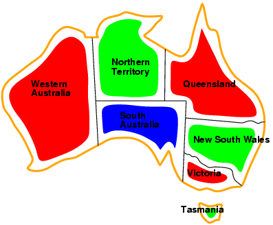

## Definition

- **Variables** X1, ..., Xn
- **Domaines** D1, ..., Dn
- **Contraintes** C1, ..., Cm

## Exemple : Coloration de carte

- Variables : WA, NT, Q, NSW, V, T, SA
- Domaines : &#123;rouge, vert, bleu&#125;
- Contraintes : WA != NT, NT != Q, SA != NSW, NSW != V, V != SA

## Objectif

- Trouver une assignation complete satisfaisant toutes les contraintes

---

# CSP: Exemple cryptarithme

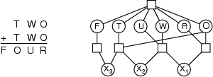

## Variables

- F, T, U, W, R, O, X1, X2, X3

## Domaines

- &#123;0, 1, 2, 3, 4, 5, 6, 7, 8, 9&#125;

## Contraintes

- Alldiff(F,T,U,W,R,O)
  - O + O = R + 10
  - X1 + W + W = U + 10
  - X2 + T + T = O + 10
  - X3 + F + F = W + 10
- X1 != X2 != X3

## Recherche

- Essayer les valeurs pour F,T,U,W,R,O

---

# Résolution de CSPs: Génération et test

## Approche la plus simple

1. Générer une assignation complete aléatoire
2. Tester si elle satisfait toutes les contraintes
3. Recommencer jusqu'a succes

## Problème

- Nombre d'assignations: produit des domaines
  - Ex: coloration 7 pays -> 3^7 = 2187
  - Ex: 8 reines -> 64^8 = 2.8 * 10^14

---

# CSPs: Exploration avec backtracking

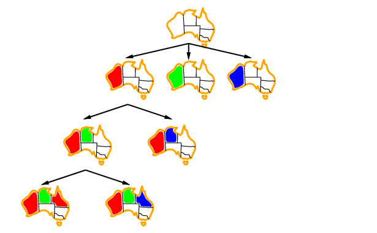

## Principe

- Etendre progressivement une assignation partielle
- Des qu'une contrainte est violee → retour en arriere (backtrack)

## Fonction BACKTRACK

```
fonction BACKTRACK(csp, assignation) retourne solution ou echec
  si assignation est complete alors retourner assignation
  var <- variable non assignee
  pour chaque valeur dans var.domaine faire
    si valeur consistante avec assignation alors
      ajouter var=valeur a assignation
      resultat <- BACKTRACK(csp, assignation)
      si resultat != echec alors retourner resultat
      retirer var=valeur de assignation
  retourner echec
```

---

# CSPs: Propagation de contraintes


## Idee

- Réduire les domaines avant développement
- Si domaine vide -> échec immediat

## Techniques

- **Forward Checking**: Apres assignation, éliminer les valeurs incompatibles des variables non assignees
- **Arc Consistency (AC)**: Pour chaque contrainte binaire (X,Y), éliminer les valeurs de X qui n'ont pas de support dans Y

## Algorithme AC-3

- Propage la coherence d'arc à travers le reseau de contraintes
- Tres efficace mais complexe

---

# CSPs: Heuristiques de variables et valeurs

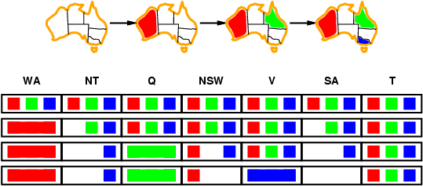

<div style="max-width:55%;">

## Choix de variable (MRV, LCV)

- **Most Constrained Variable**: Variable avec le plus petit domaine
- **Least Constraining Value**: Valeur qui élimine le moins de choix pour les autres variables

</div>

## Choix de valeur (LCV)

- Choisir la valeur qui laisse le plus d'options aux voisins
- Maximise les chances de succes

---

# CSPs: Structure des problèmes

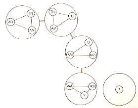

## Graphe de contraintes

- Noeuds = variables
- Arcs = contraintes binaires

## Composantes connexes

- Sous-ensembles de variables interconnectees
- Résolution indépendante possible

## Clusters et arbres

- Structure en arbres -> résolution en temps linéaire O(n)
- Graphe complet -> NP-complet

---

# CSPs: Exploration locale

## Min-conflicts

- Choisir la variable qui viole le plus de contraintes
- Changer sa valeur pour minimiser les conflits
- Tres efficace pour les problèmes àvec de nombreuses variables

## Example: 8 reines

- Chaque reine sur une colonne différente
- Deplacer la reine qui à le plus de conflits

---

# Techniques de résolution des CSPs

## Methodes traditionnelles

- Backtracking + heuristiques
- Propagation de contraintes, Forward checking
- Exploration locale (min-conflicts)
- Backjumping

## Contraintes modernes et Hybridation

- Integration CP/SAT/SMT: Utilisation de techniques telles que Lazy Clause Generation pour apprendre les conflits
  - Exemple: Le solver CP-SAT de Google OR-Tools

- Hybridation avec metaheuristiques: Combinaison d'exploration locale (min-conflicts) avec des phases de reparation par CP
  - Large Neighborhood Search

---

# Domaines des CSPs

## Variables discrêtes

- Domaines finis: n variables, taille de domaine d -> O(d^n) assignations complètes
- Domaines infinis: Entiers, chaines de caracteres etc.
  - Ex: planification de cours
  - Besoin d'un langage de contraintes (DebutCours1 + 5 <= DebutCours2)

## Variables continues

- Exemple: Planifications des observation du Telescope Hubble
- Contraintes linéaires solubles en temps polynomial par la programmation linéaire

---

# Graphe de contraintes

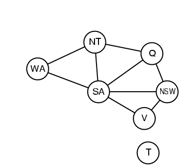

## CSP Binaire: chaque contrainte relie 2 variables

## Graphe de contraintes

- Les noeuds sont les variables
- Les arcs sont les contraintes

## Exemple coloration

- Graphe avec noeuds (WA, NT, SA, Q, NSW, V, T)
- Arcs entre noeuds adjacents (e.g., WA-NT, NT-SA, SA-Q, etc.)

---

# Types de contraintes

## Unaires

- Contraintes à 1 variable (Ex: SA != vert)

## Binaires

- Contraintes impliquant 1 paire de variables (Ex: SA != WA)

## Globales ou d'ordre supérieur

- Contraintes avec 3 variables ou plus
- Ex: problèmes cryptarithmetiques
  - Variables: F T U W R O x X1 X2 X3
  - Domaines: &#123;0,1,2,3,4,5,6,7,8,9&#125;
  - Contraintes: Alldiff(F,T,U,W,R,O), O + O = R + 10, etc.

## Représentation

- Hypergraphe des contraintes
  - Xi sont des variables auxiliaires
  - Possible de réduire à des contraintes binaires (ex: Graphe Biparti)
  - Contraintes de préférences
    - CSP -> contraintes absolues
    - -> Problèmes à optimisation de contraintes (COP)

---

# CSPs courants

## Principaux solveurs actuels

- MiniZinc: Langage de modelisation indépendant et front-end pour divers solveurs
- Google OR-Tools: Solveur hybride CP/SAT avec API pour Python, C#, Java et C++
- Choco Solver: Alternative open-source en Java et C++ respectivement
- Z3: Solveur SMT pour contraintes logiques complexes

## Interoperabilite multi-langages

- Bindings natifs OR-Tools et Z3 offrent des interfaces officielles pour plusieurs langages

## Ponts technologiques

- pythonnet pour integration Python et .NET
- IKVM pour utiliser des bibliothèques Java en C#
- JPype pour appeler du code Java depuis Python

---

# Applications et cas d'usage modernes

## Planification et ordonnancement

- Emploi du temps, scheduling industriel, allocation de ressources

## Logistique et transport

- Problèmes de tournees de vehicules (VRP), gestion d'entrepots

## Optimisation combinatoire

- Puzzles (Sudoku, n-queens, coloriage de graphes, configuration de produits)

## Planification en IA

- Planification de missions robotiques, satellites, et autres systèmes autonomes

---

# Résumé CSPs (1/2)

## Problèmes à satisfaction de contraintes

- Variables et domaines
- Graphes (binaires) ou hypergraphes des contraintes

## Techniques d'inférence

- Coherence de noeuds, d'arcs, K-coherence

## Exploration avec Backtracking

- Parcours en profondeur d'abord
- Couplage inférence + exploration
- Heuristiques de choix de variables et de valeurs
- Forward checking et Backjumping : orientent vers les conflits et accelerent la recherche
- Exploration locale : Min-Conflicts tres efficace, même avec de nombreuses variables

---

# Résumé CSPs (2/2)

## Structure des problèmes et complexité

- **Coupe de cycle** : ideal pour réduire à un arbre (complexité linéaire)
- **Décomposition en sous-arbres** : pratique et courante, exploite les sous-ensembles connexes indépendants
- **Symétrie des valeurs** : éliminer les solutions symmetriques réduit l'espace de recherche

---
layout: section
---

# TP
---

# TP

## PKP service web CSPs

---
layout: end
---

# Merci

Jean-Sylvain Boige
JSBOIGE@myia.ORG
