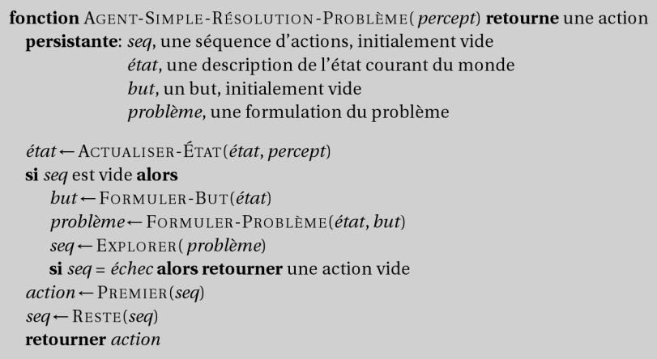
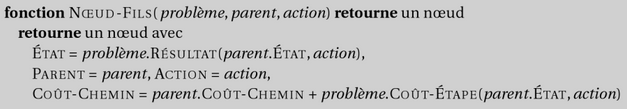
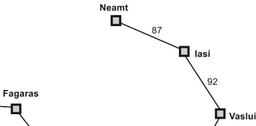
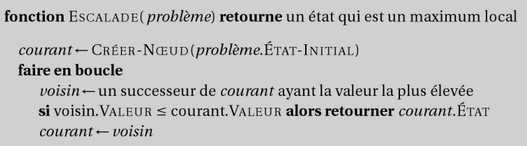
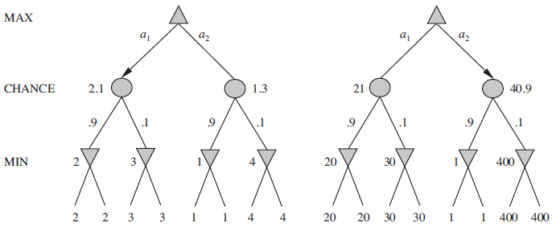
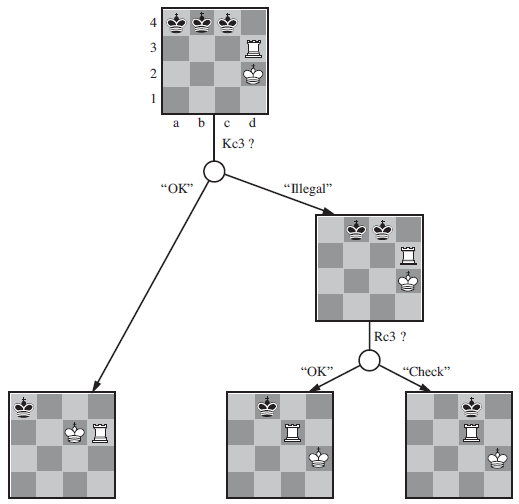

---
layout: cover
---

# Résolution de problèmes

Intelligence Artificielle - II

**Panorama des techniques de résolution par exploration**

- Explorations non informée et informée
- Jeux
- Problèmes à satisfaction de contraintes

---

# Plan du cours

- Introduction
- **Résolution de problèmes** ← *vous êtes ici*
- Bases de connaissances et logique
- Raisonnement probabiliste
- Apprentissage
- Traitement du langage naturel
- TP final projets trimestriels

---

# Sommaire

- Agents de résolution de problèmes
- Résolution de problèmes par exploration
- Exploration non informée
- Heuristiques et exploration informée
- Exploration en situation d'adversité: les jeux
- Minimax et Alpha-Bêta
- Décisions imparfaites
- Problèmes à satisfaction de contraintes
- Backtracking
- Exploration locale
- Structure des problèmes
- TP: Mise en œuvre de l'exploration et de la satisfaction de contrainte dans un contexte ludique

---

# Agent fonde sur des buts

L'agent passe du mode **reactif** au mode **deliberatif** : il anticipe les consequences de ses actions.

- Exploration du futur : envisager des sequences d'actions
- Recherche : parcourir systematiquement l'espace des possibles
- Planification : construire un plan avant d'agir

---
layout: image-right
image: ./images/img_001.png
---

---

# Résolution de problèmes

- Quel est l'objectif à atteindre ?
- Quelles sont les actions possibles ?
- Quel est la représentation de l'état courant?

  

    <strong>État Initial</strong>
  

  
→

  

    <strong>Actions</strong>
  

  
→

  

    <strong>État Final</strong>
  

---

# Agents de résolution de problèmes

---

# Exemple: Itinéraire

- En vacances en Roumanie; actuellement à Arad.
- Le vol part demain de Bucharest
- Formuler le but:
  - Etre à Bucharest
- **Formuler le problème:**
  - Etats: plusieurs villes
  - **Actions: conduire d'une ville à l'autre**
- Trouver la solution:
  - **Séquence de villes**
  - e.g., Arad, Sibiu, Fagaras, Bucharest

---
layout: image-right
image: ./images/img_003.png
---

---

# Types de problèmes

- **Deterministe, completement observable** → probleme a etat simple
  - L'agent sait exactement dans quel etat il sera ; la solution est une sequence d'actions predeterminee
- **Non-observable** → probleme sans capteur (dit *conformant*)
  - L'agent ne connait pas sa position ; la solution doit fonctionner quel que soit l'etat reel
- **Non déterministe et/ou partiellement observable** → probleme de contingence
  - Les percepts fournissent de nouvelles informations sur l'etat courant
  - Necessite un entrelacement {calcul, action, observation}
- **Espace d'etats inconnu** → probleme d'exploration en ligne
  - L'agent decouvre l'environnement au fur et a mesure de ses actions

---

# Formulation de problèmes

- Un problème est défini par les éléments suivants:
  - Etat initial e.g., "à Arad"
  - Actions ou fonction successeur S(x) = ensemble de paires actions - état
    - e.g., S(Arad) = {<Arad  Zerind, Zerind>, … }
    - AIMA : ActionsFunction et ResultFunction = modèle de transition
  - 1+2 = Espace des états -> graphe -> chemins
  - Test de but, qui peut être
    - explicite, e.g. x = "à Bucharest"
    - implicite, e.g. EchecEtMat(x)
  - Coût de chemin (optionnel, additif)
    - e.g., Somme des distances, Nombre d'actions exécutées, etc.
    - c(x,a,y) est le coût d'étape, (≥ 0)
- Une solution est une séquence d'actions (chemin) qui condition de l'état initial à un état but
- Optimale = coût minimum

---

# Sélection d'un espace des états

- Le monde réel est très complexe
- L'espace des états doit faire l'objet d'une abstraction
  - Etat (abstrait) = ensemble d'états réels
  - Action (abstraite) = combinaison complexe d'action réelles
  - e.g. « Arad -> Zerind » représente un ensemble de routes, détours, pauses etc.
  - Pour une réalisation garantie, chaque état réel « à Arad » doit conduire à un état réel « à Zerind »
  - Solution (abstraite) = ensemble de chemins réels qui sont solutions dans le monde réel
- Chaque action abstraite doit être plus « facile » que dans le problème réel.
- Problème jouet: Expérimenter avec les méthodes de résolution

---

# Exemple Abstraction: Assemblage robotique

- Etats: Coordonnées réelles des joints du robot et des objets
- Test de but: Objet assemblé
- Etat initial: Pièces détachées, bras au repos
- Actions: Mouvement continu des joints du bras robotique
- Cout de chemin: temps d'exécution

---

# Problème jouet: Le taquin

- Etats: Position des 8 pièces + case vide
- Test de but: Etat == { 0, 1, 2, 3, 4, 5, 6, 7, 8 }
- Etat initial: La moitié des états possible
- Actions: case vide  gauche, droite, haut, bas
- Cout de chemin: 1 par étape
- [Note: puzzle à glissement de pièces: problèmes NP-complet (durs)]

---

# Problème jouet: Les 8 reines

- Etats: Disposition de 0-8 reines
- Test de but: 8 reines sont présentes, et aucune n'est menacée
- Etat initial: Echiquier vide
- Actions: Poser une reine
- Cout de chemin: N.A / 1 par étape
- Note: Meilleure formulation: une reine par colonne, de gauche à droite, légale.
  - 1,8* 10^14 positions  (dur)  2057 positions (facile)

---

---
layout: center
---

# Questions?

---

# Sommaire

- Agents de résolution de problèmes
- Résolution de problèmes par exploration
- **Exploration non informée** ← *vous êtes ici*
- Exploration informée (heuristiques)
- Exploration en situation d'adversité: les jeux
- Minimax et Alpha-Bêta
- Décisions imparfaites
- Problèmes à satisfaction de contraintes
- Backtracking
- Exploration locale
- Structure des problèmes
- TP: Mise en œuvre de l'exploration et de la satisfaction de contrainte dans un contexte ludique

---

# Arbre d'exploration

- Idée de base:
  - Exploration simulée (hors ligne) de l'espace des états en générant les successeurs des états déjà explorés (Développement des états)
- Ensemble des Nœuds feuilles = Frontière d'exploration
- Choix des nœuds à développer = Stratégie d'exploration

---

# Arbre d'exploration: exemple

- Developpement progressif depuis Arad
- A chaque etape, on developpe un noeud feuille de la frontiere
- L'ordre de developpement depend de la **stratégie d'exploration** choisie

---

# Exploration de graphe

- Idée de base:
  - Etats répétés  chemins avec boucle
  - Solution : mémoire = ensemble exploré
- Frontière: sépare espace exploré et espace inconnu

---

# Infrastructure: Etats vs Nœuds

- Etats != Noeud
- Un Etat est une représentation de la configuration réelle
- Un Nœud est une structure de données constitutive d'une exploration
  - **Inclut l'état, le nœud parent,**
  - l'action, le coup d'étape g(x),
  - la profondeur
- **La fonction de développement**
  - crée de nouveaux nœuds,
  - et utilise la fonction successeur
  - pour déterminer les états enfants

  
  

---

# Stratégies d'exploration

- Une stratégie d'exploration définit l'ordre de développement des nœuds.
- Critères d'évaluation
  - Complétude: Garantie d'obtenir une solution si elle existe
  - Optimalité: Garantie d'obtenir une solution de coût minimal
  - Complexité en temps: ~ nombre de nœuds développés
  - Complexité en espace: ~ nombre max de nœuds en mémoire
- Complexités en temps et en espace s'évaluent selon:
  - b: Facteur maximal de branchement dans l'arbre de recherche
  - d: (depth)  profondeur de la solution de moindre coût
  - m: profondeur maximale de l'espace d'états (souvent ∞)

---

# Stratégies d'exploration non informée

- Les stratégies non informée (aveugle) utilisent uniquement la définition du problème
- Stratégies d'exploration en largeur
  - En largeur d'abord (BFS: Breadth First Search)
  - A coût uniforme (UCS: Uniform Cost Search)
- Stratégies d'exploration en profondeur
  - En profondeur d'abord (DFS: Depth First Search)
  - En profondeur limitée (DLS: Depth Limited Search)
  - Itérative en profondeur (IDS: Iterative Depth Search)
- Variantes
  - Bidirectionnelle

<!-- Le tableau comparatif complet est présenté plus loin (img_018) -->

---

# Exploration en largeur d'abord (BFS)

- Développe les nœuds les moins profonds en premier
- La frontière est une queue (File ou FIFO)

---

# Propriétés de l'exploration en largeur

- Complet ? Oui (si b est fini)
- Complexité en temps ?
  - 1+b+b2+b3+… +bd + b(bd-1) = O(bd+1)
- Complexité en espace ?
  - O(bd+1) chaque nœud est gardé en mémoire
- Optimale? Oui si coût d'étape = 1
- L'espace est le plus gros problème

---
layout: image-right
image: ./images/img_013.png
---

---

# Exploration à coût uniforme (UCS)

- Développe les nœuds les moins coûteux en premier
- La frontière est une queue triée par coût de chemin
- Equivaut à l'exploration en largeur d'abord si le coût d'étapes est uniforme
- En théorie de graphes = algorithme de Dijkstra
- Caractéristiques
  - Complet? Oui, si coût d'étape ≥ ε
  - **Complexité en temps et en espace: O(bplafond(C*/ ε))**
  - avec C* le coût d'une solution optimale
  - Optimal ? Oui: les nœuds sont développés dans l'ordre des coût de chemin

---

# Exploration en profondeur d'abord (DFS)

- Développe les nœuds les plus profonds en premier
- La frontière est une Pile (LIFO)
- Les branches déjà explorés ne sont pas conservées en mémoire
- Caractéristiques:
  - Complet ? Non: échoue dans les espaces de profondeur infinie
  - ou avec des boucles -> exploration de graphe
  - Complexité en temps: O(bm) terrible si m beaucoup plus grand que d
  - mais si les solutions sont dense, plus rapide qu'en largeur
  - Complexité en espace: O(bm), linéaire en espace !
  - Optimal: Non
- Variante: Exploration avec retour arrière (backtracking):
  - On développe 1 seul successeur à la fois  O(m) en espace
  - + Optimisation en modifiant les états plutôt qu'en les copiant (retour arrière = annulation)

---
layout: image-right
image: ./images/img_014.png
---

---

# Exploration en profondeur limitée (DLS)

- = Exploration en profondeur d'abord avec une profondeur limite l
- Les nœuds de profondeur l n'ont pas de successeur
- Complet si l ≥ d= diamètre des l'espace des états
- Implémentation récursive:

---

# Exploration itérative en profondeur (IDS)

- On augmente graduellement l
- Coût du même ordre que l'exploration en profondeur limitée
- Pour b = 10, d= 5: ~+10% (contre intuitif)
  - NDLS = 1 + 10 + 100 + 1,000 + 10,000 + 100,000 = 111,111
  - NIDS = 6 + 50 + 400 + 3,000 + 20,000 + 100,000 = 123,456
- Caractéristiques
  - Complet: Oui
  - Complexité en temps: O(bd)
  - Complexité en espace: O(bd)
  - Optimale: Oui si coût d'étape = 1
- De façon analogue pour l'exploration à coût uniforme:
  - Exploration itérative par allongement (ILS)

---

# Exploration Bidirectionnelle

- Quand on connait l'état but
- Double exploration vers l'aval et vers l'amont
- Intérêt: O(bd/2) + O(bd/2) est très inférieur à O(bd)
- Exemple courant
  - Logiciel de navigation GPS
- Difficultés:
  - Nécessite une fonction Prédécesseurs
  - Contrôle de l'intersection
  - maintient de la frontière, même en profondeur + hachage pour comparaison
  - + Solution non optimale même en largeur  continuer pour trouver les raccourcis
- Etats buts complexes:
  - Plusieurs états buts  Etat but fictif en l'aval des états buts
  - Description implicite (ex: 8 reines)  difficile

---
layout: image-right
image: ./images/img_017.png
---

---

# Résumé Exploration non informée

- Nécessité d'une abstraction du monde réel
- Variété des stratégies non informées
  - En largeur = Queue
  - En profondeur = Pile
- Compromis complexité espace vs temps
- Présence de cycles  exploration de graphe
- Comparaison des explorations non informées:

---

# Les missionnaires et cannibales

- **Probleme classique d'exploration** en IA (Russell & Norvig)
- 3 missionnaires et 3 cannibales doivent traverser une riviere en barque
- **Contraintes** :
  - La barque transporte au maximum 2 personnes
  - Si les cannibales sont plus nombreux que les missionnaires sur une rive, les missionnaires sont devores
- **Formulation** : etat = (nb missionnaires, nb cannibales, position barque) sur une rive
- Espace d'etats compact mais solution non triviale (11 traversees minimum)

---
layout: image-right
image: ./images/img_019.png
---

---

---
layout: center
---

# Questions?

---

---
layout: cover
---

# TP

Exploration non informée

> **Notebooks associés :**
> - `Search/Exploration_non_informee_et_informee_intro.ipynb`
> - `Sudoku/Sudoku-1-Backtracking.ipynb`

**Outils :**
- Services Web PKP: Search
- Librairie js : PathFinding.js
- Aima javascript

---

# Sommaire

- Agents de résolution de problèmes
- Résolution de problèmes par exploration
- Exploration non informée
- **Exploration informée (heuristiques)** ← *vous êtes ici*
- Exploration en situation d'adversité: les jeux
- Minimax et Alpha-Bêta
- Décisions imparfaites
- Problèmes à satisfaction de contraintes
- Backtracking
- Exploration locale
- Structure des problèmes
- TP: Mise en œuvre de l'exploration et de la satisfaction de contrainte dans un contexte ludique

---

# Stratégies d'exploration informée

- Les stratégies informées utilisent des connaissances du problème en plus de sa définition
- Exploration par le meilleur d'abord
  - Exploration gloutonne (GBF: Greedy Best-First)
  - Exploration A étoile (A*: A-Star)
- Stratégies d'exploration locale
  - Exploration par escalade (HC: Hill-Climbing)
  - Exploration par recuit simulé (SA: Simulated Annealing)
  - Exploration locale en faisceau (LBS: Local Beam Search)
  - Algorithmes génétiques (GAs: Genetic Algorithms)

---

# Exploration par le meilleur d'abord

- Idée: utiliser une fonction d'évaluation f(n) pour chaque nœud.
  - Estimation de la « désirabilité »
  - On développe les nœuds non explorés les plus désirables
- Implémentation
  - On tri les nœuds dans la frontière en ordre décroissant de désirabilité
- Cas spéciaux:
  - Exploration gloutonne
  - Exploration A étoile

---

# Exploration gloutonne

- f(n) = h(n) =Heuristique = estimation du coût depuis n au but
  - Ex: hSLD(n) = distance à vol d'oiseau de n à Bucarest (straight-line distance)
  - **Développe le nœud qui semble être le plus proche du but**
- Caractéristiques:
  - Complet:
    - **Arbre: Non, Possibilité de boucle (cf Iasi  Fagaras)**
    - Graphe: Oui pour espaces finis
  - Complexité en temps: O(bm)
    - **mais une bonne heuristique donne de bons résultats**
  - Complexité en espace: O(bm) :
    - on garde tous les nœuds en mémoire
  - Optimal? Non

  
  

---

# Heuristiques admissibles et consistantes

- **Une heuristique h(n) est dit admissible si pour chaque nœud n,**
  - h(n) ≤ h*(n), où h*(n) est le vrai coût pour rejoindre l'état but depuis n
- Une heuristique admissible ne surestime jamais le coût pour atteindre le but: elle est optimiste
  - Exemple hSLD(n) ne surestime jamais la distance routière
- **Une heuristique est consistante (ou monotone) si pour chaque nœud n, et chaque successeur n' de n généré par une action a:**
  - h(n) ≤ c(n,a,n') + h(n')
  - ≈ inégalité triangulaire
  - Consistante  admissible

---
layout: image-right
image: ./images/img_022.png
---

---

# Exploration A*

- Idée: éviter de développer les nœuds déjà coûteux
- Minimisation du coût total estimé de la solution
- Fonction d'évaluation f(n) = g(n) + h(n)
  - g(n) = coût pour atteindre n
  - h(n) = coût estimé de n au but
  - f(n) = coût total estimé du chemin au but en passant par n
- Identique à UCS avec g+h au lieu de g
- Théorèmes:
  - Si h(n) est admissible, A* est optimal en exploration d'arbre
    - Démonstration par l'absurde en développant
  - Si h(n) est consistante, A* est optimal en exploration de graphe
    - Démonstration: f est monotone  puis par l'absurde en développant

<!-- La carte de Roumanie est illustree dans les slides precedentes (img_009, img_010) -->

---

# Caractéristiques de A*

- Optimalité de A*
  - **Ajoute graduellement des « f-contours » de nœuds**
  - **Le contour i a tous les nœuds avec f=fi où fi < fi+1**
- Propriétés de A*
  - Complet: Oui
    - **Sauf s'il existe une infinité de nœuds avec f ≤ f(G)**
  - Complexité en temps: Exponentielle
  - Complexité en espace: Idem
  - Optimal? Oui (cf. théorèmes)
  - + optimalement efficace pour toute heuristique consistante donnée
- Limites
  - Nombre d'états dans l'espace d'exploration des contours souvent exponentiel.
  - Souvent, le principal problème est la mémoire
- Démos itinéraires

---
layout: image-right
image: ./images/img_023.png
---

---

# Variations

- Exploration heuristique à mémoire limitée
  - A* avec approfondissement itératif (IDA*)
    - Coupure: coût f le plus faible parmi les nœuds en dépassement
  - Exploration récursive par le meilleur d'abord (RBFS)
    - Espace en mémoire linéaire: valeur f du meilleur chemin alternatif
    - Récursion avec valeur rapportée: meilleur valeur f des enfants oubliés
  - Mais excès inverse: trop peu de mémoire et trop de « redéveloppements »
- Utilisation de toute la mémoire disponible
  - MA* (A* sous contrainte de mémoire)
  - SMA* (simplified MA*)
    - On oublie quand plus de place disponible, le nœud le plus mauvais
- Exploration avec apprentissage
  - Espace des états de métaniveau = états de l'algorithme d'exploration (nœuds, arbres etc.)
  - Techniques d'apprentissage au métaniveau  compromis entre coût de calcul et coût de chemin

---

# Effet de l'exactitude de l'heuristiques

- Efficacité fonction de l'erreur absolue ou relative de l'heuristique
  - Δ = h* - h et ε = (h* - h)/ h*
  - Complexité en O(bΔ) ou O(bεd) à coût d'étape constant
- Facteur de branchement effectif b*
  - Facteur de branchement pour une exploration équivalente (même nombre de développements) sans heuristique (exploration à coût uniforme)
  - Bonne indication de l'utilité globale de l'heuristique
- Dominance:
  - Si h1 et h2 sont admissibles et h2(n) ≥ h1(n) ∀ n, h2 domine h1
  - si h2 domine h1, h2 est meilleure

---

# Production d'heuristiques

- Problèmes relaxés
  - Problème avec moins de restrictions sur les actions = problème relaxé
  - **Coût exact d'une solution optimale pour une problème relaxé = heuristique admissible**
  - Exemple du Taquin
    - Une pièce peut bouger n'importe où  h1 (nb pièces mal placées)
    - Une pièce peut bouger sur toute case adjacente  h2 (distance Manhattan)
- Sous-problèmes
  - Exemple du taquin: pièces 1,2,3 et 4 uniquement à placer
  - Bases de données de motifs
    - Coût exact de solutions de sous-problèmes = Heuristique pour le problème général
  - Motifs disjoints
    - Question de l'additivité des heuristiques admissibles
- Apprentissage d'heuristiques
  - Utilisation de l'expérience sur des solutions connues
  - Apprentissage inductif à partir des caractéristiques pertinentes
  - Approche classique: h(n) = c1 x1 (n) + c2 x2(n)
  - Domaine vaste: Apprentissage = machine learning

---

# Algorithmes d'exploration locale

- Souvent, le chemin ne compte pas, le but est la solution
- Espace des états = ensemble de configurations complètes
- Trouver une configuration satisfaisant des contraintes (ex 8 reines)
- On peut utiliser un algorithme d'exploration locale
  - On conserve un simple état « courant », qu'on tente d'améliorer
- Avantages:
  - Consomme peu de mémoire
  - Peut fonctionner dans des espaces de grande taille ou infinis
- Exemple: 8 reines

---

# Paysage de l'espace des états

- Problèmes d'optimisation :
  - Objectif = trouver le meilleur état selon une fonction objectif
- Utilité du paysage de l'espace des états
  - On recherche un maximum (f = -h)
- Complet
  - **On trouve toujours un but**
- Optimal
  - **On trouve toujours un maximum global**

---
layout: image-right
image: ./images/img_025.png
---

---

# Exploration par escalade (HCS)

- Escalade par la plus forte pente:
  - Exploration locale « gloutonne »
- Maxima locaux
- Crêtes, plateaux, paliers
  - Solution: déplacement latéraux
  - Mais nécessité de limites
- Escalade stochastique du premier choix, mais toujours incomplets
- Escalade avec reprise aléatoire (complet)

  
  
  

---

# Exploration par recuit simulé (SA)

- Idée: échapper des maxima locaux:
  - en autorisant de mauvais déplacement
  - mais en diminuant progressivement leur fréquence
- Fréquence  température T
- Si T diminue suffisamment doucement, la probabilité de trouver un optimum global approche 1
- Très utilisé dans l'agencement de circuits, l'ordonnancement
- Exemple: le carton de babioles

---

# Exploration locale en faisceau (LBS)

- Idée: on suit simultanément k états plutôt qu'un seul
  - On démarre avec k états aléatoires
  - A chaque itération, tous les successeurs sont générés
  - On sélectionne les k meilleurs successeurs de la liste complète
- Exemple: Perdus en foret
  - Transfère progressif des ressources vers les explorations fructueuses
  - Mais parfois, transfère trop rapide vers une petite région
- Variante: exploration en faisceau stochastique
  - Analogue à l'escalade stochastique
  - k choisis au hasard, avec probabilité fonction de leur valeur
  - Analogue à la sélection naturelle  GAs

---

# Algorithmes génétiques (GAs)

- Variante de l'exploration en faisceau stochastique
- Successeurs issus de combinaisons (≈ reproduction)
- Population
  - Individus
  - Taille constante
- Gènes
  - **Points de recombinaison**
  - **Mutations aléatoires**
- Phénotype
  - **Fonction d'adaptation: fitness function**

---
layout: image-right
image: ./images/img_030.png
---

---

# Algorithme génétique pour les 8 reines

  

    <h3>Génotype</h3>
    
Représentation chromosomique: 
    Position de chaque reine par colonne

    
  

  

    <h3>Phénotype</h3>
    
Expression physique: 
    Échiquier avec les 8 reines

    
  

---

---
layout: cover
---

# TP

Exploration informée et locale

> **Notebooks associés :**
> - `Search/Exploration_non_informee_et_informee_intro.ipynb`
> - `Search/Portfolio_Optimization_GeneticSharp.ipynb`
> - `Sudoku/Sudoku-2-Genetic.ipynb`

**Outils :**
- Services Web PKP: Search
- Librairie js : PathFinding.js

---

# Exploration locale d'espaces continus (1/2)

- **Etats definis par des variables reelles** (pas discretes)
- Le gradient du paysage remplace la notion de pente pour l'escalade
  - Parfois resolution analytique de ∇f = 0 (rare en pratique)
  - Sinon : mise a jour iterative x ← x + α∇f ou α est le **pas d'apprentissage**
  - Gradient empirique si la derivee analytique n'est pas disponible
- **Exploration lineaire** : ajuster α en doublant le pas jusqu'a observer une diminution
- **Methode de Newton-Raphson** :
  - x ← x – Hf⁻¹(x) ∇f(x), avec H la matrice Hessienne (derivees secondes)
  - Convergence rapide mais couteuse (inversion de matrice)

---

# Exploration locale d'espaces continus (2/2)

- **Methodes modernes de descente de gradient** :
  - RMSProp, ADAM : pas adaptatif par parametre, momentum
  - Fondements theoriques : condition de Polyak-Lojasiewicz
  - Utilisees massivement en apprentissage profond
- **Optimisation sous contrainte** :
  - Les variables sont soumises a des inegalites formant un ensemble convexe
  - **Programmation lineaire** : objectif et contraintes lineaires → complexité polynomiale
  - Tres etudiee, nombreux solveurs efficaces (Simplex, points interieurs)

---

# Exploration avec actions non déterministes

- Quand les actions ont des **resultats imprevisibles**, la solution n'est plus une simple sequence mais un **plan contingent** (stratégie avec branchements)
- **Arbres Et-Ou** : entrelacement de deux types de noeuds
  - Noeuds **Ou** = choix de l'agent (exploration classique)
  - Noeuds **Et** = « choix » de l'environnement (tous les resultats possibles)
- Solutions cycliques possibles → etiquettes de boucle (tant que...)
- **Exemple : Aspirateur glissant**
  - L'action de deplacement peut echouer aleatoirement

---
layout: image-right
image: ./images/img_034.png
---

---

# Exploration avec observations partielles

- L'agent ne connait pas son etat exact → il raisonne sur un **etat de croyance** (ensemble d'etats physiques possibles)
- **Probleme conformant** (sans observation) :
  - Parfois soluble malgre l'absence totale de percepts (ex : positionnement de pieces)
  - Idee : choisir des actions qui **contraignent le monde** vers le but
- N etats physiques → 2^N etats de croyance possibles
  - Modele de transition → etape de prevision
- **Exploration avec observation** :
  - Prevision des observations possibles apres chaque action
  - Mise a jour de l'etat de croyance → arbres Et-Ou complets

---
layout: image-right
image: ./images/img_035.png
---

---

# Exploration en ligne

- **Entrelacement calcul et action** : l'agent explore en temps reel, sans modèle prealable
- **Problemes de decouverte** :
  - Ratio de competitivite : performance vs un agent omniscient connaissant l'espace
  - Presence possible d'impasses (sinon l'espace est explorable sans risque)
- **Algorithmes** :
  - DFS en ligne, escalade avec reprise aleatoire
  - Mémoire : estimation H de l'heuristique h, mise a jour apres chaque action
  - **LRTA*** (Learning Real-Time A*) : converge vers le chemin optimal
- **Apprentissage en ligne** :
  - De la « carte » (etats decouverts), du cout d'etape, des règles de transition

---
layout: image-right
image: ./images/img_036.png
---

---

# Résumé Exploration Informée

- Heuristiques
  - Admissibles
  - Consistantes
- Meilleur d'abord
  - Exploration Gloutonne (h)
  - A* (g+h) + variantes limitées en mémoire
- Exploration Locale
  - Paysage de l'espace d'états
  - Escalade, Recuit simulé
  - Exploration en Faisceau, stochastique, algorithmes génétiques
- Extensions
  - Espaces continus → gradients, programmation linéaire
  - Actions Non déterministe → Arbres Et-Ou
  - Observations partielles → prévisions, exploration en ligne

---

---
layout: center
---

# Questions?

---

# Sommaire

- Agents de résolution de problèmes
- Résolution de problèmes par exploration
- Exploration non informée
- Exploration informée (heuristiques)
- **Exploration en situation d'adversité: les jeux** ← *vous êtes ici*
- Minimax et Alpha-Bêta
- Décisions imparfaites
- Problèmes à satisfaction de contraintes
- Backtracking
- Exploration locale
- Structure des problèmes
- TP: Mise en œuvre de l'exploration et de la satisfaction de contrainte dans un contexte ludique

---

# Jeux vs Exploration

- **Environnements multi-agents concurrentiels** : l'adversaire est une source d'incertitude
- Classe de jeux la plus etudiee en IA (echecs, Go, dames) :
  - Tours alternes, déterministes, a somme nulle (le gain de l'un = la perte de l'autre)
  - Information parfaite (tous les joueurs voient l'etat complet)
- **Difficultes specifiques** :
  - L'adversaire rend le resultat imprevisible → il faut envisager un arbre d'exploration complet
  - En pratique, l'arbre complet est impraticable (echecs : ~10^47 etats)
  - La performance est critique : le temps de reflexion est limite

---

# Arbre de jeu

- Ex: Morpion
  - Etat initial S0
  - Joueurs(s)
    - Max, Min
  - Actions(s)
    - Coups
  - Résultat(s,a)
    - **Modèle de transition**
  - **Test-Terminal(s)**
    - Fin de partie
  - Utilité(s,p)
    - **Score final de p**

---
layout: image-right
image: ./images/img_037.png
---

---

# Minimax

- Principe: **Faire « remonter » les valeurs Minimax**
- L'algorithme explore l'arbre de jeu en profondeur
- Aux nœuds MAX: choisir la valeur maximale
- Aux nœuds MIN: choisir la valeur minimale
- Remonter les valeurs jusqu'à la racine

---
layout: image-right
image: ./images/img_038.png
---

---

# Algorithme Minimax

- **Faire « remonter » les valeurs Minimax**
- Propriétés
  - Complet? Oui
    - si l'arbre est fini
  - Optimal? Oui
    - avec adversaire optimal
  - Complexité en temps
    - O(bm)
  - Complexité en espace
    - O(bm) (DFS)
  - Echecs: b ≈ 35, m ≈ 100
    -  complètement infaisable
- Mais c'est la base de:
  - l'analyse mathématique des jeux
  - meilleurs algorithmes
- Cadre Multi-joueurs:
  - Même approche
  - Vecteurs Utilité
  - Souvent, alliances naturelles

---
layout: image-right
image: ./images/img_039.png
---

---

# Elagage Alpha-Bêta

---
layout: image-right
image: ./images/img_040.png
---

---

# Decisions imparfaites (1/2)

- **Approche** : on ne peut pas explorer l'arbre complet
  - On remplace l'utilite reelle par une **fonction d'évaluation heuristique** Eval(s) sur des etats non terminaux
  - On remplace le test terminal par un **test d'arret** Cutoff(s) (ex : profondeur limite)
- **Fonction d'évaluation** :
  - S'inspire du jugement humain : attributs d'un etat (materiel, position, mobilite...)
  - Forme classique : fonction lineaire ponderee Eval(s) = w1 f1(s) + w2 f2(s) + ... + wn fn(s)
  - En pratique, les attributs ne sont pas independants → fonctions non lineaires ou apprentissage
  - Exemple aux echecs : 1 fou ≈ 3 pions (appris par expérience)

---

# Decisions imparfaites (2/2)

- **Exploration avec arret** :
  - Alpha-Beta iteratif pour respecter une limite de temps (+ ordre des coups)
  - **Probleme de stabilite** (quiescence) : une prise au prochain tour fausse l'évaluation
    - Solution : poursuivre l'exploration dans les positions instables
  - **Effet d'horizon** : un evenement inevitable peut etre « repousse » au-dela du cutoff
    - Solution : extensions de singularite (prolonger l'exploration sur les coups forces)

---

# Techniques avancées

- Elagage avant (forward pruning)
  - Dangereux (pas de considération des nœuds élagués)
  - Exploration en faisceau (n-meilleurs coups par tour)
  - ProbCut  probabilité que le nœuds soit hors [Alpha,Beta]
- Exploration vs Consultation
  - Ex: Echecs: début et fin de partie documentés
  - Début de partie:
    - Consultation de tables plutôt qu'exploration
    - Livres d'ouverture + statistiques de bases de données de parties
  - Fin de partie:
    - Utilisation d'une Politique (correspondance directe du coup optimal)
    - Exploration rétrograde

---

# Exploration d'arbre de Monte-Carlo

- Rollouts
  - Pas d'heuristique d'évaluations
  - Replacée par des rollouts
  - = simulations statistiques
- Algorithme complet
  - Sélection
    - Guidé par une politique de sélection
    - Compromis exploration/exploitation
  - Expansion
  - Simulations = rollouts
  - Rétropropagation: Nœuds parents incrémentés
- Politique de sélection
  - Intervalle de confiance supérieur UCB1=
  - C empirique ou modèle appris (Alpha Go)
- Combinaison avec heuristique et apprentissage
  - Critere de terminaison avancee
  - Apprentissage par renforcement des evaluations

**Avancees recentes :**
- **AlphaGo / AlphaZero** (2016-2018) : MCTS + réseaux de neurones profonds
- **MuZero** (2019) : apprend le modèle de l'environnement sans règles connues
- **Pluribus** (2019) : poker multi-joueurs a information incomplete

---

# Classes de Jeux complexes

- **Jeux stochastiques** (backgammon, Monopoly)
  - Element de hasard (des, tirage de cartes)
  - Minimax espere : ponderation par les probabilités
- **Jeux a information incomplete** (poker, bridge)
  - Etat partiellement observable → raisonnement sur les etats de croyance
  - Pluribus (2019) : IA surhumaine au poker 6 joueurs
- **Jeux a information imparfaite** (Starcraft, jeux video)
  - Actions simultanees, brouillard de guerre
  - AlphaStar (2019) : niveau Grand Maitre a Starcraft II

  
  
  

---

# Résumé Jeux

- Décisions optimales
  - Arbre de jeu (états, actions, résultats, test terminal, utilité)
  - Minimax (valeur optimale, algorithme)
  - Alpha Beta (élagage)
- Décisions imparfaites
  - Fonction d'évaluation heuristique
  - Test d'arrêt (compliqué  stabilité, horizon)
  - Elagage avant (faisceaux mais dangereux)
  - Consultation, Politiques (début et fin de parties)
- Classes complexes
  - Jeux stochastiques (valeur minimax espérée)
  - Jeux partiellement observables (état de croyance)

---

---
layout: center
---

# Questions?

---

# Sommaire

- Agents de résolution de problèmes
- Résolution de problèmes par exploration
- Exploration non informée
- Exploration informée (heuristiques)
- Exploration en situation d'adversité: les jeux
- Minimax et Alpha-Bêta
- Décisions imparfaites
- **Problèmes à satisfaction de contraintes** ← *vous êtes ici*
- Backtracking
- Exploration locale
- Structure des problèmes
- Contraintes modernes et hybridation
- TP: Mise en œuvre de l'exploration et de la satisfaction de contrainte dans un contexte ludique

---

# Problèmes à satisfaction de contraintes (CSPs)

- Problème standard d'exploration
  - L'état est une « boite noire », toute structure qui implémente:
    - la fonction successeur
    - la fonction heuristique
    - le test de but
- CSP:
  - Etat défini par des variables Xi à valeurs dans le domaine Di
  - Test de but défini par un ensemble de contraintes spécifiant les combinaisons de valeurs acceptables pour des sous-ensembles de variables
- Exemple simple d'un langage de représentation formelle
  - Permet l'utilisation de méthodes générales
  - plus puissantes que les algorithmes standards d'exploration

---
layout: image-right
image: ./images/img_045.png
---

---

# Exemple: coloration de carte

- Contexte:
  - Coloration:
    - **Contraintes: les régions adjacentes doivent avoir des couleurs différentes**
  - Théorie des graphes
    - **Théorème des 4 couleurs (épique !)**
  - Ici: 3 couleurs
- Définition:
  - Variables : WA, NT, Q, NSW, V, SA, T
  - Domaines : Di = {rouge, vert, bleu}
  - Contraintes :
    - WA ≠ NT
    - ou (WA,NT) dans {(rouge, vert),(rouge, bleu),(vert, rouge), (vert, bleu),(bleu, rouge),(bleu, vert)}
    - + les autres paires de regions adjacentes…

---
layout: image-right
image: ./images/img_046.png
---

---

# Solutions d'un CSP

- Etat = Assignation de variables
- Solutions = Assignations complètes et consistantes
  - Exemple: {WA=rouge, NT=vert, Q=rouge, NSW=vert, V = rouge, SA=bleu, T = vert}
- Assignation partielle: certaines variables seulement

---
layout: image-right
image: ./images/img_047.png
---

---

# Techniques de résolution des CSPs

- Méthodes traditionnelles :
  - Backtracking + heuristiques,
  - Propagation de contraintes, Forward checking
  - Exploration locale (min-conflicts)
  - Backjumping
- Contraintes modernes et Hybridation
  - Intégration CP/SAT/SMT
  - Utilisation de techniques telles que Lazy Clause Génération pour apprendre des conflits
  - Exemple: Le seolver CP-SAT de Google OR-Tools
  - Hybridation avec métaheuristiques
    - Combinaison d'exploration locale (min-conflicts) avec des phases de réparation par CP (Large Neighborhood Search)

---

# Domaines des CSP

- Variables discrètes
  - Domaines finis
    - n variables, taille de domaine d  O(dn) assignations complètes
  - Domaines infinis
    - Entiers, chaines de caractères etc.
    - Ex: planification de cours
    - Besoin d'un langage de contraintes
    - DébutCours1 +5 ≤ DébutCours2
- Variables continues
  - Exemple: Planifications des observation du Télescope Hubble
  - Contraintes linéaires solubles en temps polynomial par la programmation linéaire

---

# Graphe de contraintes

- CSP Binaire: chaque contrainte relie 2 variables
- Graphe de contraintes:
  - Les nœuds sont les variables
  - Les arcs sont les contraintes
- Exemple Coloration:

---
layout: image-right
image: ./images/img_048.png
---

---

# Types de contraintes

- Unaires: contraintes à 1 variable
  - Ex: SA ≠ vert
- Binaires: contraintes impliquant 1 paire de variables
  - Ex: SA ≠ WA
- Globale ou d'ordre supérieur: contraintes avec 3 variables ou plus
  - Ex: problèmes cryptaritmétiques
    - Variables: F T U W R O X1 X2 X3
    - Domaines: {0,1,2,3,4,5,6,7,8,9}
    - Contraintes: Alldiff (F,T,U,W,R,O)
    - O + O = R + 10 · X1
    - X1 + W + W = U + 10 · X2
    - X2 + T + T = O + 10 · X3
    - X3 = F, T ≠ 0, F ≠ 0
  - Représentation = hypergraphe des contraintes
  - Xi  sont des variables auxiliaires
  - Possible de réduire à des contraintes binaires (ex: Graphe Biparti)
- Contraintes de préférences
  - CSP  contraintes absolues
  -  Problèmes à optimisation de contraintes (COP)

---
layout: image-right
image: ./images/img_049.png
---

---

# CSPs courants

- Problèmes d'assignation
  - Dits de « mariage »
  - E.g. Quels classes / projets sont attribués?
- Problème de répartition
  - E.g. Quelle classe est enseignée quand et où?
- Logistique
- Planification d'usines
- Les problèmes en conditions réels impliquent souvent des variables continues

---

# Formulation standard d'exploration

- On commence par une formulation simple, puis on l'améliore
- Les états sont définis par les valeurs assignées
  - Etat initial: l'assignation vide {}
  - Fonction successeur:
    - on assigne une valeur aux variables non assignées compatible avec l'assignation courante
    -  Echec si pas d'assignation légale
  - Test de but: l'assignation est complète
    - Identique pour tous les CSPs
- Chaque solution arrive à la profondeur n avec n variables
  - Exploration en profondeur d'abord (DFS)
  - Le chemin n'est pas important
- Facteur de branchement b = (n-p).d à la profondeur p
  - soit n!dn feuilles

---

# Propagation de contraintes

- **Inférence**: déduire de nouvelles contraintes à partir des existantes
- **Cohérence locale**:
  - Nœud-cohérence: valeurs du domaine satisfait contraintes unaires
  - Arc-cohérence (AC-3): chaque valeur d'une variable a un support dans l'autre
  - Path-cohérence (PC-2): cohérence sur les triplets de variables
- **k-cohérence**: généralisation aux sous-ensembles de k variables
- Objectif: réduire les domaines pour détecter les échecs plus tôt

---

# Contraintes globales

- AllDiff:
  - réduction de la cardinalité des domaines
  -  rapide (ex: Sudoku)
- AtMost:
  - somme des valeurs minimales, considération max vs mins
- Domaines  considérés par leurs bornes et propagation des limites
  -  limite-cohérence
- Contraintes de sommes, cricuits

---

# Exploration avec backtracking des CSPs

- Approche systématique par **profondeur d'abord**
- À chaque étape:
  - Choisir une variable non assignée
  - Tester chaque valeur du domaine
  - Si conflit: backtrack (retour arrière)
- Optimisations:
  - Ordre des variables (MRV)
  - Ordre des valeurs (LCV)
  - Propagation de contraintes (AC-3)

---
layout: image-right
image: ./images/img_050.png
---

---

# Ordre des variables et des valeurs

Objectif: Détecter les incohérences au plus tôt et éviter les cul de sacs

**Variables la plus contrainte**

- Variable avec le moins de valeurs légales restantes
-  Heuristique du minimum des valeurs restantes (MRV)

- En cas d'égalité: Heuristique des degrés:
  - Variable la plus contraignante pour les autres

**Ordonnancement des domaines: LCV**

- Heuristique de la valeur la moins contraignante
  - Celle qui exclut le moins de choix par la suite.

- **Weighted Degree Heuristic**
  - Priorise les variables impliquées dans de nombreux conflits.
- **Backjumping dynamique & nogood learning**
  - Pour éviter de revisiter des branches déjà invalidées.

---

# Vérification avant et examen en amont

- Forward checking: application de l'inférence pendant l'exploration
  - On identifie les valeurs légales pour les variables non assignées
  - Terminaison quand une variable n'a plus de valeur légale
  - **Mais toutes les incohérences ne sont pas détectées (ex ligne 3)**
- **Maintien de la cohérence d'arc (MAC)**
  - Propagation des contraintes
- Backtracking intelligent
  - Problème: reprise à variables qui ne résout rien (ex: Tasmanie)
  - Solution: Backjumping orienté conflits
    - Retour vers assignation la plus récente dans l'ensemble de conflit
  - Apprentissage de contraintes:
    - Sous-ensemble minimal de l'ensemble de conflit: variables inutiles

---
layout: image-right
image: ./images/img_054.png
---

---

# Exploration locale pour les CSPs

- Algorithmes très efficaces
  - Quand les solutions sont denses
- Formulation par états complets
  - Modification d'une variable à la fois
  - Elimination des contraintes violées
- Heuristique Min-Conflits:
  - Choix d'une valeur qui minimise le nombre de conflits
  - N-reines: Nombre d'étapes quasi constant: solutions denses
- Autre avantage: changement du problème à la volée
  - Ex: trafic aérien et météo
  - Modification rapide et minimale

- Mais de nombreux plateaux
  - Techniques pour déplacements latéraux vues précédemment
  - + Exploration taboue
- Pondération de contraintes
  - Les contraintes reçoivent un poids
  - On essaie de minimiser le poids
  - Les poids sont mis à jour à chaque étape
- Hybridation CP + Métaheuristiques
  - Large Neighborhood Search (LNS)
  - Relâchement partiel de la solution suivie d'une phase de réparation par CP.
  - Combinaison d'une recherche locale stochastique et de la propagation de contraintes.

---

# Structure des problèmes (1/3)

- Idée: décomposition d'un problème en sous-problèmes
- Composantes connexes du graphe: sous-problèmes indépendant
  - Ex: Tasmanie vs Australie continentale
  - Complexité: si c variables par sous problème, O(dcn/c)
  - Exponentielle  linéaire en n

---
layout: image-right
image: ./images/img_055.png
---

---

# Structure des problèmes (2/3)

- Rare mais structure d'arbre également linéaire
  - Cohérence d'arc dirigé (DAC)
  - Tri topologique de l'arbre puis DAC en O(nd2)
  - Puis assignation sans retour arrière  résolveur arbre
- Du coup idée = faire apparaitre l'arbre
  - Assignation des bonnes variables: Australie méridionale
  - Choix d'un ensemble coupe-cycle (cutset)
  - Coupe cycle minimal NP-complet : Ex: graphes petit-monde
  - Mais bonnes heuristiques. Méthode complète: conditionnement du coupe cycle

---
layout: image-right
image: ./images/img_056.png
---

---

# Structure des problèmes (3/3)

- Ou bien: décomposition en arbre de sous problèmes connexes
  - Résolution d'arbre sur les variables partagées
  - Taille des sous-problèmes minimale
  -  largeur d'arbre w d'une décomposition= taille max, O(ndw+1)
  - Problème NP-complet mais bonnes heuristiques
- Structure des domaines également intéressante
  - Ex: coloration: n! permutations équivalentes  symétrie de valeurs
  -  Contrainte de rupture de symétrie
  - ex: ordre alphabétique: NT<SA<WA

---

# Solveurs modernes - intégrations

- Principaux solveurs actuels :
  - MiniZinc : Langage de modélisation indépendant et front-end pour divers solveurs.
  - Google OR-Tools (CP‑SAT) : Solveur hybride CP/SAT avec API pour Python, C#, Java et C++.
  - Choco Solver et Gecode : Alternatives open-source en Java et C++ respectivement.
  - Z3 : Solveur SMT pour contraintes logiques complexes.
- Interopérabilité multi-langages :
  - Bindings natifs : OR-Tools et Z3 offrent des interfaces officielles pour plusieurs langages.
  - Ponts technologiques :
    - pythonnet pour intégrer Python et .NET.
    - IKVM pour utiliser des librairies Java en C#.
    - JPype pour appeler du code Java depuis Python.

---

# Applications et cas d'usage modernes

- Planification et ordonnancement :
  - Emplois du temps, scheduling industriel, allocation de ressources.
- Logistique et transport :
  - Problèmes de tournées de véhicules (VRP), gestion d'entrepôts.
- Optimisation combinatoire :
  - Puzzles (Sudoku, n‑queens), coloriage de graphes, configuration de produits.
- Planification en IA :
  - Planification de missions robotiques, satellites, et autres systèmes autonomes.

---

# Résumé CSPs

- Problèmes à satisfaction de contraintes
  - Variables, domaines
  - + Graphes (binaires) ou hypergraphes de contraintes
- Techniques d'inférences
  - Cohérence de nœuds, arcs, K-cohérence
- Exploration avec Backtracking
  - En profondeur d'abord: Couplage Inférence + exploration
  - Heuristiques choix de variables, de valeurs
  - Forward checking et Backjumping orienté conflit accélèrent aussi
- Exploration locale
  - Min conflits est très efficace mêmes avec de nombreuses variables
- Structure des problèmes: complexité des problèmes
  - Coupe cycle idéal pour réduire à un arbre
  - Décomposition en arbre pratique courante
  - Symétrie des valeurs importantes

---

---
layout: center
---

# Questions?

---

---
layout: cover
---

# TP

Problèmes à satisfaction de contraintes

> **Notebooks associés :**
> - `Search/CSPs_Intro.ipynb`
> - `Sudoku/Sudoku-1-Backtracking.ipynb`
> - `Sudoku/Sudoku-2-Genetic.ipynb`
> - `Sudoku/Sudoku-3-ORTools.ipynb`
> - `Sudoku/Sudoku-4-Z3.ipynb`
> - `Sudoku/Sudoku-5-DancingLinks.ipynb`
> - `Sudoku/Sudoku-6-Infer.ipynb`

**Outils :**
- PKP service web CSPs

---

# Sommaire

- Agents de résolution de problèmes
- Résolution de problèmes par exploration
- Exploration non informée
- Heuristiques et exploration informée
- Exploration en situation d'adversité: les jeux
- Minimax et Alpha-Bêta
- Décisions imparfaites
- Problèmes à satisfaction de contraintes
- Backtracking
- Exploration locale
- Structure des problèmes

---

# Plan du cours

- Introduction
- **Résolution de problèmes** ← *conclusion*
- Bases de connaissances et logique
- Raisonnement probabiliste
- Apprentissage
- Traitement du langage naturel
- Présentations projets trimestriels

---

# Pour aller plus loin : Notebooks

> **Exploration :**
> - `Search/Exploration_non_informee_et_informee_intro.ipynb`

> **Algorithmes génétiques :**
> - `Search/Portfolio_Optimization_GeneticSharp.ipynb`
> - `Sudoku/Sudoku-2-Genetic.ipynb`

> **CSPs :**
> - `Search/CSPs_Intro.ipynb`
> - `Sudoku/Sudoku-3-ORTools.ipynb`
> - `Sudoku/Sudoku-4-Z3.ipynb`

> **Jeux combinatoires :**
> - `GameTheory/GameTheory-8-CombinatorialGames.ipynb`

> **Sudoku (fil rouge) :**
> - `Sudoku/Sudoku-1-Backtracking.ipynb` à `Sudoku-6-Infer.ipynb`

---

---
layout: cover
---

# Merci

Jean-Sylvain Boige
jsboige@myia.org
