---

<!-- _class: title -->

# Bases de connaissance et Logique

- Intelligence Artificielle - III
- Logique propositionnelle
- Logique du premier ordre
- Planification
- Représentation des connaissances

---

# Plan du cours

- Introduction
- Résolution de problèmes
- Bases de connaissances et logique
- Raisonnement probabiliste
- Apprentissage
- Traitement du langage naturel
- TP final projets trimestriels

---

# Sommaire

- Agents fondés sur la connaissance
- Logique propositionnelle
- Logique du premier ordre
- Planification
- Représentation de connaissances
- TP: Mise en œuvre de l'inférence en logique propositionnelle et en logique du premier ordre

---

<!-- _class: columns-layout -->

# Agents fondés sur les connaissances

- Comprend:
  - une base de connaissance (KB), composée d'énoncés formulés dans un langage formel de représentation des connaissances
  - un système d'inférence (raisonnement) qui produit de nouveaux énoncés pour prendre des décisions
- Fonctions principales: Tell ( KB) et Ask ( KB)
- Niveaux de l'architecture:
  - Connaissances (formulation naturelle)
  - Logique (formulation en énoncés)
  - Implémentation (représentation physique des énoncés)

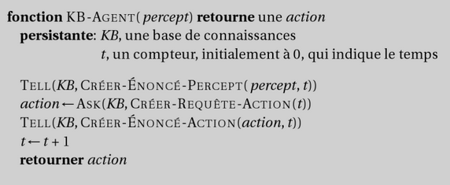

---

# Exemple: le monde du Wumpus

- Jeux de rôle simpliste
- Environnement:
  - Grille 4*4 de salles à explorer
- But/Performance:
  - **Trouver l'or et sortir**
  - sans dommages
- Actions:
  - **Avancer, tourner, saisir,**
  - tirer, sortir
- Percepts:
  - Odeur, brise, lueur, choc, cri
  - Vecteur

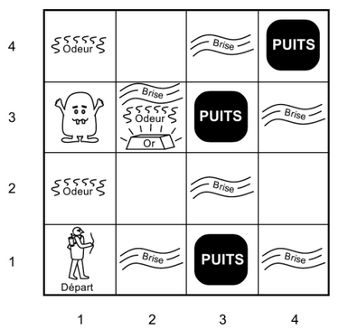

---

# Représentation et logique

- Représentation de connaissance
  - Objectif = forme manipulable par l'ordinateur
- Définition d'un langage de représentation:
  - Syntaxe: séquences possibles de symboles formant les énoncés
  - Sémantique: faits du monde auxquels les énoncés correspondent
  - Un Monde « possible » = un Modèle qui satisfait l'énoncé
- Raisonnement:
  - Conséquence logique  inférence
  - Exemple: énumération = vérification de modèles

---

# Représentation et logique (2/2)

- Propriétés:
  - Correction:
    - **préserve la validité sémantique**
    - = dérive des conséquences
  - Cohérence / consistance:
    - Pas de contradiction
  - Complétude:
    - Dériver tout ce qui est valide

---

# Types de logiques

- Ontologie: étude de ce qui existe
- Epistémologie: étude de ce qui peut être connu

<!-- TODO: ajouter tableau comparatif des types de logiques (propositionnelle, FOL, HOL, modale) -->

---

<!-- _class: questions -->

# Questions?

---

# Sommaire

- Agents fondés sur la connaissance
- Logique propositionnelle
- Logique du premier ordre
- Planification
- Représentation de connaissances
- TP: Mise en œuvre de l'inférence en logique propositionnelle et en logique du premier ordre

---

# Logique propositionnelle

- Syntaxe
  - Constantes
    - Vrai, Faux
  - Symboles
    - (énoncés atomiques)
  - Connecteurs
    - Négation
    - Conjonction
    - Disjonction
    - (double) Implication

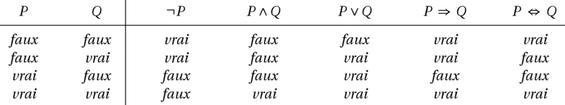

---

# Logique propositionnelle (2/2)

- Sémantique
  - Modèle  valeur de vérité des symboles
  - Puis tables de vérité
- Exemple: (interprétation)
  - C signifie « il fait chaud »
  - H signifie « il fait humide »
  - P signifie « il pleut »
  - (C  H)  P
- Une tautologie est vrai pour toute interprétation (contradiction toujours fausse)

<!-- TODO: ajouter table de vérité colorée pour l'exemple (C ∧ H) → P -->

---

# Procédure d'inférence simple

- Approche par vérification de modèle (truth table)
- Procédure cohérente et complète (par définition)
- Mais coûteuse

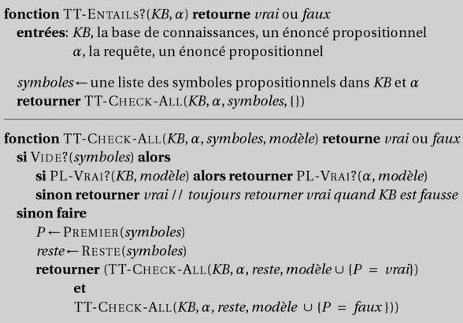

---

# Règles d'inférence

- Objectif de l'inférence logique:
  - Vérifier qu'un énoncé est une conséquence de la KB, i.e. un théorème
- Inférence par la preuve: utilisation de règles de dérivation cohérentes pour produire une chaine de conclusions conduisant au but

<!-- TODO: ajouter arbre de preuve visuel pour un exemple simple -->

---

# Règles d'inférence (2/2)

- Exemple de règles cohérentes
  - REGLE			PREMISSES		CONCLUSION
  - Modus Ponens		A, A  B		B
  - Introduction du Et		A, B			A  B
  - Elimination du Et		A  B			A
  - Double Négation		A			A
  - Résolution	d'unité		A  B, B		A
  - Reductio ad absurdum	 A  B			(A  B)
  - Résolution			A  B, B  C		A  C

---

# Equivalences logiques standards

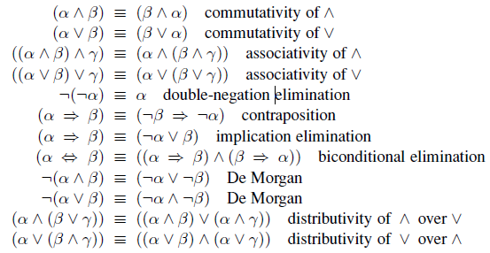

---

# Chainage avant et arrière

- Clause définie / de Horn:
  - disjonction avec 1 litéral positif / au plus 1  clause de but
  - Ex: P1   P2   P3 ...   Pn  Q ( P1  P2  P3 ...  Pn    Q)
  - -> Raisonnement naturel (Modus Ponens)
- Algorithmes de chainage avant et arrière
  - Temps linéaire en fonction de la taille de KB
  - (P  Q) ≡ (P  Q)
- Chainage avant:
  - raisonnement par les données
- Chainage arrière: raisonnement par les buts (e.g. où sont mes clés?)

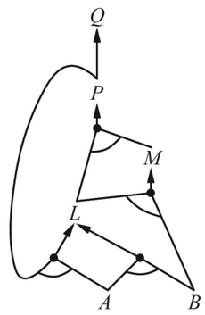
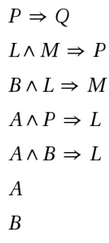
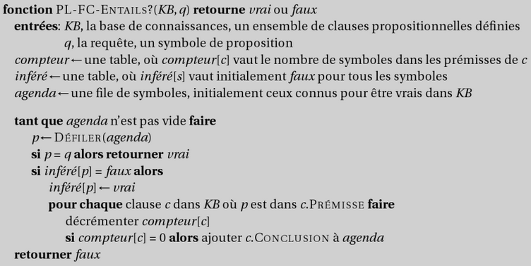

---

# Preuve par résolution

- Algorithme d'inférence complet
- Forme Normale Conjonctive (FNC) : tout énoncé peut s'écrire comme une conjonction de clauses de disjonctions de littéraux
  - Ex: B1,1 ⇔ (P1,2 ∨ P2,1) ≡ (￢B1,1 ∨ P1,2 ∨ P2,1) ∧ (￢P1,2 ∨ B1,1) ∧ (￢P2,1 ∨ B1,1)
- théorème: la clôture par résolution contient la clause vide si un énoncé est insatisfiable
  - = application répétée de la règle de résolution aux clauses et leurs dérivées
- Mais coûteux également

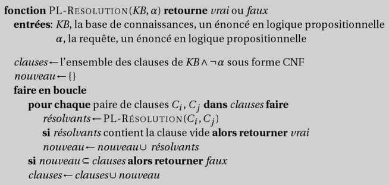

---

# Backtracking complet

- Algorithmes efficace pour la satisfiabilité (SAT)
  - (P  Q)  =  (P   Q)
- Algorithme de Davis-Putnam, Logemann et Loveland (DPLL)
  - Enumération récursive en profondeur d'abord
  - Elagage (une clause est vrai si un littéral est vrai, un énoncé est faux si une clause est fausse)
  - Heuristique des symboles purs (toujours le même signe  littéral doit être vrai)
  - Heuristique des clauses unitaires : assignation de ces clauses en premier

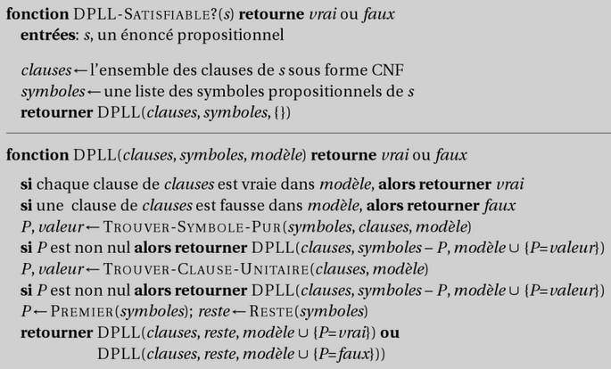

---

# Backtracking complet (2/2)

- Astuces (cf. CSP):
  - Analyse des composants
  - Ordre des variables
  - Backtracking intelligent
  - Reprises aléatoires
  - Indexation intelligente
- Applications modernes:
  - Vérification hardware
  - Vérification de protocoles

---

# Exploration locale

- Equivaut à Min-Conflits pour les CSPs
- Evaluation = nb de clauses non satisfaites
- Problèmes simples sous-contraints / sur-contraints
- Ratio nb clauses / nb symboles  seuil de satisfiabilité
- NP-complet souvent au seuil.

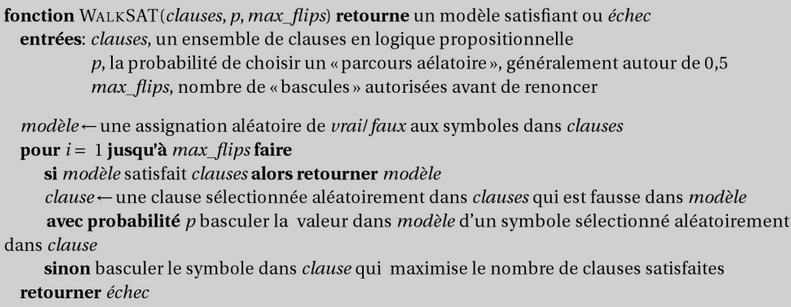

---

# Agents fondés sur la logique propositionnelle (1/2)

- Etat actuel du monde (cf wumpus)
  - Variables temporelles (fluent) et atemporelles
- Modèle de transition  axiomes d'effet L01,1 ∧ FacingEast0 ∧ Forward0 ⇒ (L12,1 ∧ ￢L11,1 )  Ask(KB, L12,1) = true
- Pour ce qui demeure inchangé  axiomes de persistance Forwardt  ⇒ (HaveArrowt ⇔ HaveArrowt+1)
- Mais nombreux cas   axiomes de l'état successeur HaveArrowt+1 ⇔ (HaveArrowt ∧ ￢Shoott)

---

# Agents fondés sur la logique propositionnelle (2/2)

- Agent hybride
  - Maintient d'une KB, d'un plan courant
  - + exploration A* pour la navigation
- Estimation logique des états
  - Pb: inférence de plus en plus longue (t0+1+1+…)
  - Solution: mise en cache des résultats intermédiaires
- MAJ état de croyance = estimation des états

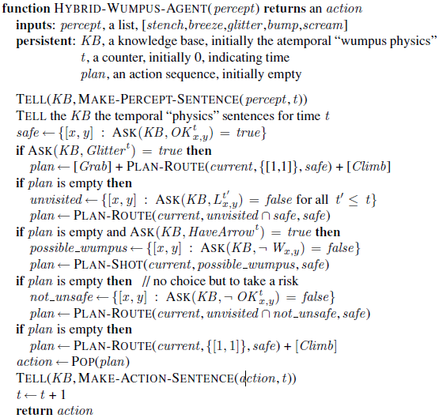

---

# Agents fondés sur la logique propositionnelle (3/3)

- Construction du plan par inférence
  - =/= agent hybride
- Algorithme SAT Plan
  - Utilisation de WalkSAT
  - **+ Axiomes de précondition d'actions**
    - (actions légales seulement)
  - Shoott ⇒ HaveArrowt
  - + axiomes d'exclusion d'action (non simultanéité)
  - ￢Ati ∨ Atj

---

# Résumé Logique propositionnelle

- Définition
  - Syntaxe: Symboles, connecteurs
  - Sémantique: Valeurs de vérités
- Inférence
  - Tables de vérités
  - Chainage avant, arrière
  - Résolution
  - Backtracking, DPLL
  - Exploration locale, WalkSat
- Agents
  - Variables (Fluents/atemporelles)
  - Modèle Transitionnel Axiomes
  - Hybride / Satplan

---

# Limites de la logique propositionnelle

- Difficile d'identifier les « individus »
  - Ex: Marie, 3
- Ne peut identifier les propriétés des individus et leurs relations
  - Ex: Bill est grand
- Les généralisations et régularités sont difficilement représentées
  - Ex: tous les triangles ont 3 côtés
- La logique du premier ordre (FOL) est assez expressive pour représenter ce type d'info
  - "Chaque éléphant est gris":  x (elephant(x) → gray(x))
  - "Il y a un alligator blanc":  x (alligator(X) ^ white(X))

---

<!-- _class: questions -->

# Questions?

---

# Sommaire

- Agents fondés sur la connaissance
- Logique propositionnelle
- Logique du premier ordre
- Planification
- Représentation de connaissances
- TP: Mise en œuvre de l'inférence en logique propositionnelle et en logique du premier ordre

---

# Logique du premier ordre

- La logique du premier ordre modélise le monde en termes de:
  - Objets: des choses avec des identités individuelles
  - Propriétés des objets qui les distinguent des autres objets
  - Relations qui existent entre les ensembles d'objets
  - Fonctions qui sont un sous ensemble des relations avec une valeur unique de résultat pour des données entrées

<!-- TODO: ajouter diagramme objets/relations/fonctions avec exemples visuels -->

---

# Logique du premier ordre (2/2)

- Exemples:
  - Objets: Etudiants, cours, société, voitures
  - Relations: Frère de, plus grand que, en dehors de, partie de, a la couleur, se passe après, possède, visite, précède
  - Propriétés: bleu, oval, pair, large
  - Fonctions: père de, meilleur ami, deuxième moitié, un de plus que

---

# Syntaxe

- **Domaine:**
  - fourni par l'utilisateur
- Symboles de Constantes
  - Marie, Vert
- Symboles de fonctions
  - **père-de()**
  -  père-de(Marie) = Jean
- Symboles de prédicats
  - **plus-grand-que(), vert()**
  -  plus-grand-que(5,3), vert(herbe)

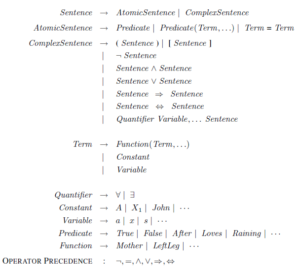

---

# Syntaxe (2/2)

- Fourni par FOL:
- Symboles de variables
  - x, y, jean (pas constante)
- Connecteurs
  - Identique logique propositionnelle
- Quantificateurs
  - Universel: x  définit pour tout x
  - Existentiel: x  il existe un x (au moins 1)

---

# Enoncés

- Un terme est défini par une constante, une variable, ou le résultat d'une fonction à n termes (composé)
  - Ex: LeftLeg(John)
- Un terme sans variable est dit fermé
- Un énoncé atomique est composé d'un prédicat
  - Ex: Married(Father (Richard), Mother (John))
- Un énoncé complexe est composé d'énoncés atomiques reliés par
  - des connecteurs (ex: ￢King(Richard) ⇒ King(John))
  - des quantificateur (ex: ∀ x King(x) ⇒ Person(x))
- Symbole égalité disponible

---

# Quantificateurs

- Notions
  - Règles : (x) student(x)  smart(x) = "Il y a un étudiant intelligent"
  - Emprise
  - Ordre important entre eux ((x)(y) likes(x,y) != (y) (x) likes(x,y))
- Connexions
  - Inversion dans la négation (ex: (x) P(x) ↔ (x) P(x))

<!-- TODO: ajouter schéma de portée des quantificateurs avec négations -->

---

# Quantificateurs (2/2)

- Une formule bien formée (wff) est un énoncé qui ne continent aucune variable « libre »
  - Toutes les variables sont « liées » à des quantificateurs existentiels ou universels
- Règles d'inférence quantifiées
  - Instanciations universelle et existentielle
    - x P(x)  P(A)
    - x P(x)  P(F)  Skolemization (constant de Skolem F)
  - généralisations universelle et existentielle
    - P(A)  P(B) …  x P(x)
    - P(A)  x P(x)

---

# Traductions d'énoncés

- Exemples simples
  - On peut tromper quelqu'un tout le temps
    - x t  person(x) time(t)  can-fool(x,t)
  - On peut tromper tout le monde de temps en temps
    - x t (person(x)  time(t) can-fool(x,t))

<!-- TODO: ajouter arbres syntaxiques pour les formules -->

---

# Traductions d'énoncés (2/2)

- Il y a exactement 2 champignons violets
  - x y mushroom(x)  purple(x)  mushroom(y)  purple(y) ^ (x=y)  z (mushroom(z)  purple(z))  ((x=z)  (y=z))
- Monty Python (raisonnements fallacieux)
  -  x witch(x)  burns(x)
  -  x wood(x)  burns(x)
  - -------------------------------
  -   z witch(x)  wood(x)
- Argument fallacieux => Affirmation du conséquent

---

# Aparté: Analyse rhétorique

- Introduction à l'argumentation
  - Un code de conduite intellectuelle
  - Qu'est-ce qu'un argument?
  - Qu'est-ce qu'un bon argument?
  - Qu'est-ce qu'un argument fallacieux?
- Taxonomie des arguments fallacieux
- Biais cognitifs
- Qualités argumentatives
- Jeu de cartes

---

# Code de conduite intellectuelle (1/2)

- Un standard procédural efficace
  - Les règles de bases pour une discussion fructueuse
- Un standard éthique important
  - Les parties s'engagent à être honnêtes
- Principes de conduite intellectuelle
  - Faillibilité
    - Accepter de pouvoir se tromper
  - Recherche de la vérité
    - s'engager à rechercher la position la plus défendable
  - Clarté
    - Pas de confusion linguistique et séparé d'autres problématiques
  - Charge de la preuve
    - Repose sur celui qui avance une position

---

# Code de conduite intellectuelle (2/2)

- Principes de conduite intellectuelle (suite)
  - Charité
    - Donner à l'adversaire le bénéfice du doute
  - Structure, Pertinence, Acceptabilité, Suffisance, Réfutation
  - Suspension du jugement
    - Si pas de preuve ou des arguments égaux, sauf si nécessaire  conséquences?
  - Résolution
    - Si tout le reste est respecté, accepter la conclusion
  - Accepter un nouvel examen au besoin

---

# Qu'est-ce qu'un argument?

- Une proposition supportée par d'autres propositions
  - Prémisses
    - Les raisons
  - Conclusion
    - Supportée par les prémisses et le raisonnement
- Argument =/= Opinion
  - Une opinion n'est pas supportée
- Forme standard pouvant être reconstituée:
  - Puisque (prémisse 1), qui est une conclusion supportée par (sous-prémisse 1.1)
  - et (prémisse 2)
  - [et (prémisse implicite)]
  - et (prémisse de réfutation)
  - Alors (Conclusion)

---

# Qu'est-ce qu'un argument? (2/2)

- Déduction vs Induction
  - Déduction  nécessité logique
  - Induction  Corroboration
- Arguments particuliers
  - Moral  prémisse morale (principe)
  - Légal  prémisse légale (loi, jurisprudence etc.)
  - Esthétique  prémisse esthétique (Critère esthétique)

---

# Qu'est-ce qu'un bon argument? (1/2)

- Respecte 5 critères:
- Structure bien formée
  - Pas de contradictions entre prémisses et avec la conclusion
  - Pas de vérité par principe, ou de déduction invalide
- Prémisse pertinentes pour la vérité de la conclusion
  - Pas de prémisses inutiles, les liens doivent être explicites
- Prémisses acceptables par une personne raisonnable
  - Connaissance commune, ou confirmée par l'expérience
  - Défendue ou défendable par une source accessible
  - Témoignage non controversée par une autorité compétente
  - Conclusion d'un autre bon argument
  - Proposition mineure constituant une hypothèse raisonnable

---

# Qu'est-ce qu'un bon argument? (2/2)

- Prémisses suffisantes à démontrer la conclusion
  - Difficile à systématiser,
  - Cf. certaines sciences (échantillons statistiques) ou expérience
- Prémisses fournissant une réfutation effective des critiques anticipées
  - Le plus difficile, manque le plus souvent
  - Permet de départager de « presque » bons arguments
- Renforcer un argument:
  - Balayer ces 5 critères et le modifier en conséquence

---

# Qu'est-ce qu'un argument fallacieux?

- La violation de l'un des critères définissant un bon argument
  - Faille structurelle
  - Prémisse non pertinente
  - Prémisse sous le standard d'acceptabilité
  - Prémisses insuffisantes à établir la conclusion
  - Pas de réfutation effective des critiques anticipées
- Nommées ou non
  - Cf. Taxonomie
  - Nom pas nécessaire, mais utile

---

# Qu'est-ce qu'un argument fallacieux? (2/2)

- Dénoncer un argument fallacieux
  - Autodestruction par reconstruction en forme standard
  - Méthode du contre-exemple absurde
- Fair-play:
  - Pas trop en faire,
  - Que si nécessaire,
  - Accepter ses propres erreurs,
  - Eviter si possible de mentionner la notion d'argument fallacieux
- Fin de l'aparté

---

# Sémantique de la logique de premier ordre

- Transposition dans le monde
  - Interprétation des domaines (Constantes  objets), connecteurs, quantifieurs
  - Prédicats, fonctions  relations entre objets
  - Egalité  mêmes objets
- Interprétation d'énoncé
  - Modèle d'énoncés, énoncé satisfiable (vrai selon une interprétation), valide (toutes les interprétations), inconsistant (pas d'interprétation), conséquence logique (inclusion des modèles)

---

# Sémantique de la logique de premier ordre (2/2)

- Dérivations
  - Axiomes : capture des faits importants des domaines
  - démonstration de théorèmes
  - définitions par équivalences
  - Conditions nécessaires, suffisantes (dualité)
- Sémantique de base de données
  - Hypothèse des noms uniques
  - Les énoncés atomiques inconnus sont présumés faux (hypothèse de monde clos)
  - Fermeture du domaine (pas plus d'éléments que les constantes données)

---

# Inférence en logique du premier ordre

- Opérations Tell, Ask
  - Assertions  Tell (ex: TELL(KB, King(John)))
  - requêtes / buts  Ask (ex: ASK(KB, King(John)))
  - substitution / liste de liaison  AskVars (ex: ASKVARS(KB, Person(x)))
- Réduction à l'inférence propositionnelle
  - Règles des quantificateurs
  - + Symboles fermés  => symboles propositionnels
  - + Composition de fonctions finie
  -  procédure complète mais semi-décidable (théorème de l'incomplétude de Gödel), très lente

---

# Inférence en logique du premier ordre (2/2)

- Unification
  - Substitutions (ex: subst({x/IceCream, y/Ziggy}, eats(y,x)) = eats(Ziggy, IceCream) )
  - Recherche d'unificateurs les plus généraux  Élimine l'étape d'instanciation
  - UNIFY(Knows(John, x), Knows(y,Mother (y))) = {y/John, x/Mother (John)}
- Modus ponens généralisé  inférence naturelle, +Indexation  accélération

<!-- TODO: ajouter exemple d'unification pas-à-pas visuel -->

---

# Procédures d'inférence en FOL (1/2)

- Chainages
  - Chainage avant  bases de données déductives, systèmes de production
  - Chainage arrière  programmation logique  (Prolog) + mémoisation
- Exemple:
  - **The law says that it is a crime for an American to**
    - sell weapons to hostile nations. The country Nono,
    - an enemy of America, has some missiles M1, and
    - all of its missiles were sold to it by Colonel West,
    - who is American. Who's a criminal?

---

# Procédures d'inférence en FOL (2/2)

- Résolution
  - Système de preuve complet
  - **Stratégies pour réduire la taille de**
    - l'espace de résolution (démodulation, paramodulation)
  - Démonstrateurs de théorèmes sophistiqués ex: OTTER; e-prover
- Notations
  - p v (q ^ r) <-> p + (q * r)
  - Prolog: cat(X) :- furry(X), meows (X), has(X, claws)
  - Lispy: forall ?x (implies (and (furry ?x) (meows ?x) (has ?x claws)) (cat ?x)))

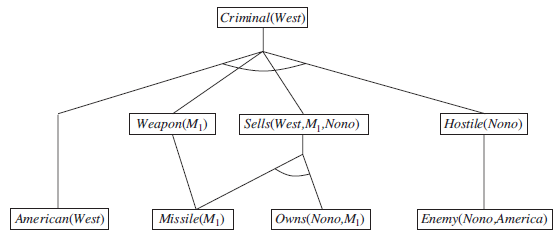

---

# Logiques d'ordre supérieur

- FOL quantifie sur des variables, qui représentent des objets
- HOL (ordre supérieur) quantifie sur les relations
  - Ex: f g (f = g)  (x f(x) = g(x))
  - r transitive( r )  (xyz) r(x,y)  r(y,z)  r(x,z))
- Plus expressif mais indécidable
  - FOL décidable uniquement avec prédicats à 1 argument
- Exemple
  - Tweety
  - E-prover
  - Lean

---

# Logique modale

- Extension avec les modalités
  - de la logique propositionnelle
  - Ou de la logique du premier ordre
- Modalités
  - Possibilité (peut être vrai)
  - Nécessité (doit être vrai)
  - Contingence (vrai dans certains cas)

---

# Logique modale (2/2)

- Syntaxe: opérateurs
  - "◊" (diamant = possibilité)
  - "□" (carré = nécessité)
- Sémantique: mondes possibles
- Applications:
  - Philosophie (modalités épistémiques)
  - Informatique (systèmes muli-agents, vérification formelle)
  - Mathématiques (théorie des ensembles, des jeux, de la preuve)
  - Argumentation (raisonnement modal) Mondes possibles
  - Argumentum

---

# Logiques argumentatives

- Extension des logiques appliquées à l'argumentation
  - Analyse de la structure, la validité, la force des arguments
- Logique argumentative abstraite (de Dung)
  - Modèle sous forme de graphe (Noeuds = arguments, arrêtes = attaques )
  - Notion d'ensembles stable / extensions (pas d'attaques internes)

<!-- TODO: ajouter graphe d'attaque de Dung avec exemples d'extensions stables -->

---

# Logiques argumentatives (2/2)

- Autres logiques argumentatives extensions de Dung
  - Aspic (SPecification, and Interrogation with Constraints)
    - Règles, contraintes, attaques entre arguments
    - Satisfaction des règles, validité des arguments, résolution des conflits
  - ABA (Assumption-Based Argumentation)
    - Utilisation d' ensembles d'hypothèses
    - Relations de soutien et d'attaques
    - Cohérences des ensembles et forces contextuels des arguments
  - Argumentum

---

# Argument mining

- Objectif: reconstruire la structure inférentielle depuis le texte et le discours
- Domaine naissant:
  - Groupes de recherches: CMNA, COMMA, ACL etc.
  - Toutils: DisLog Language, Topic Based Modelling
  - Ontologie: Argument Interchange Format
    - AIF+ rajoute le dialogue
- Outils d'annotation argumentative
  - Ex: Ova+
- Dimension sociale
  - Importance du travail collaboratif
  - Débat, jeux de dialogue ex:  "<statement>,<challenge><defense>"

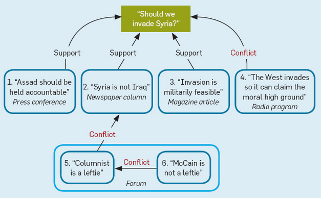

---

# Solveurs Modulo Théorie et optimiseurs (1/2)

- Issus de SAT, rajoute:
  - des théories arithmétiques
  - les quantificateurs du premier ordre
  - Certaines techniques de résolution d'équations ou d'optimisation mathématique
- Très populaires
  - Représentation + riche que SAT mais décidables = sweet spot
  - Ex: Vérification de circuits électronique et de code/protocoles critiques
  - Automates symboliques. Ex: Automata.Net

---

# Solveurs Modulo Théorie et optimiseurs (2/2)

- Théories
  - Egalité de fonctions, différences, arithmétique linéaire entière, rationnelle, réelle, tableaux, arithmétique non linéaire, vecteur de bits.
- Outils
  - Solveurs
    - Z3, Yices, Open SMT, MathSAT etc.
  - Optimiseurs / solveurs
    - MSF, OR-Tools
  - Exemple
    - Linq To Z3

---

# Agents à base de connaissance (1/2)

- 3 architectures
  - Par ordre de compléxité
- Agents réflex  classifications de situations
  - Percepts  observations  actions
  - Ex: s,g,u,c,t Percept([s, Breeze, g, u, c], t)  Breeze(t)
  - t AtGold(t)  Action(Grab, t)
  - Mais faits non percepts (position, or) + boucles

---

# Agents à base de connaissance (2/2)

- Fondé sur un modèle  modèle interne du monde
  - Représentation du changement  calcul situationnel
  - Propriétés perpétuelles  propriétés cachées des lieux
  - Règles causales, de diagnostique
  - Ex: (l1,l2,s) At(Wumpus,l1,s)  Adjacent(l1,l2)  Smelly(l2)
  - Axiomes de persistances, d'effets, problèmes de qualifications
  - Ingénierie de données  modéliser le bon niveau

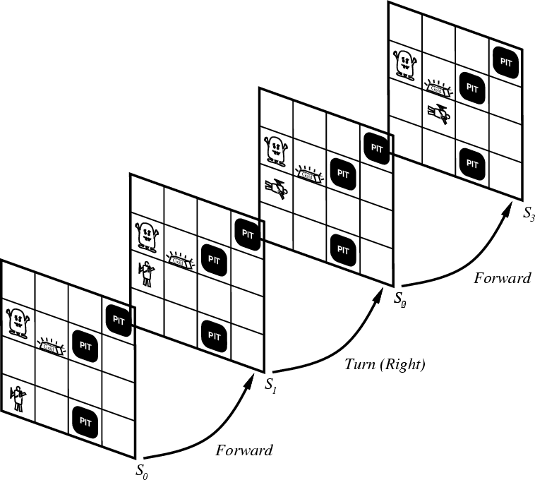

---

# Agents à base de connaissance (3/3)

- Fondé sur des buts  conçoivent des buts à atteindre
  - Tri des actions, séparation des faits sur les actions et les buts
  - Ex: (a,s) Good(a,s)  (b) Great(b,s)   Action(a,s)
  - Approches: Inférence, Exploration, Planification

---

# Résumé Logique du premier ordre

- Logique du premier ordre
  - Objets, relations, fonctions
  - Termes, Quantificateurs
  - Modèle, interprétation
  - Axiomes, Ingénierie de données
- Inférence
  - Propositionalisation
  - Unification, Modus ponens élargi, chainage avant et arrière
  - Résolution, améliorations

---

# Résumé Logique du premier ordre (2/2)

- Applications puissantes
  - Solveurs SMTs
  - Logiques d'ordre supérieur
  - Arg Tech
- Agents
  - réflexe,
  - modèle,
  - Fondé sur un but

---

<!-- _class: questions -->

# Questions?

---

# Sommaire

- Agents fondés sur la connaissance
- Logique propositionnelle
- Logique du premier ordre
- Planification
- Représentation de connaissances
- TP: Mise en œuvre de l'inférence en logique propositionnelle et en logique du premier ordre

---

# Planification

- Problème de planification:
  - Trouver une séquence d'actions qui permettent d'atteindre un objectif à partir d'un état initial.
  - Donner la listes des instances d'opérations, qui telles qu'exécutées à partir de l'état initial, vont modifier l'état du monde à un état qui satisfait le but
- Planification et résolution de problème
  - Souvent mêmes types de problèmes
  - Planification plus expressive
  - Exploration de l'espace de plan en plus de l'espace d'états
  - + Sous-objectifs indépendants réduisant la complexité

---

# Définition d'un domaine de planification (1/2)

- Planning Domain Definition language (PDDL)
  - Similaire à la logique du premier ordre (FOL).
- Etat  At(Truck 1, Melbourne) ∧ At(Truck 2, Sydney)
  - Chaque état est appelé un fluent
  - Sémantique de DB (ce qui n'est pas explicité est présumé faut)
  - Les énoncés sont fermés, sans function
- Un schéma d'action spécifique les actions avec:
  - Noms: ex: Go
  - Liste de variables (here, there)
  - Préconditions: At(here), Path(here, there)
  - Effets: At(there) , At(here)

---

# Définition d'un domaine de planification (2/2)

- Application d'une action
  - Les preconditions doivent être satisfaites
  - S' = (S – Del(a))   Add(a)
  - Add(a): Litéraux positifs dans les effets
  - Del(a): Litéraux négatifs dans les effets
- Domaine de planification
  - Schémas + état initial + but
  - Ex: Transport logistique
  - Description PDDL
  - Plan solution

---

# Approches

- Exploration de l'espace des états et des plans
- Planification à Ordre partiel
  - Construction des sous plans
  - Ordre réconcilié par application de contraintes
- Décomposition hiérarchique
  - Distinction des buts à décomposer
  - des primitives atomiques pour les atteindre
- Planification par contraintes
  - Utilisation des CSP
- Calcul situationnel
  - Logique du premier ordre
  - Utilisation de théorèmes pour prouver les bonnes séquences
- Planification réactive
  - Modifications en temps réel

---

# Exploration de l'espace des états (1/2)

- Complexité de la planification classique?
  - PlanSAT: Y-a-t-il un plan?  PSPACE > NP
  - PlanSAT « borné »: Y-a-t-il un plan de longueur <k ?  PSPACE
  -  Décourageant mais pour de nombreux domaines (e.g. logistique):
    - PlanSAT borné NP-Complet (optimalité difficile)
    - PlanSAT dans P (suboptimalité plus facile)
- Algorithmes pour l'exploration de l'espace d'états
  - Planificateur progressif (avant)
  - Planificateur régressif (arrière)
  - Recherche des états pertinents
  - Exploration bidirectionnelles

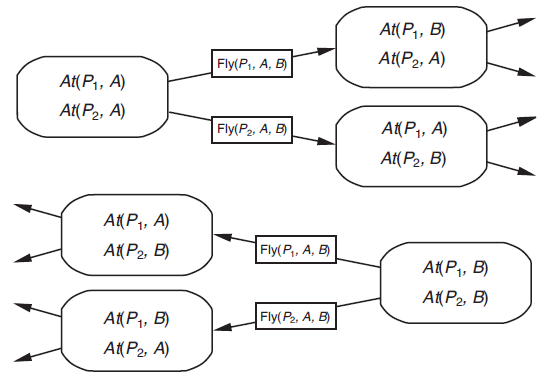
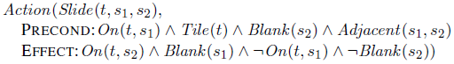
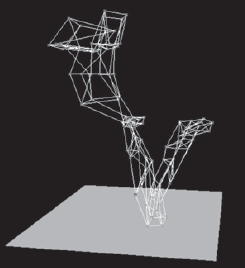

---

# Exploration de l'espace des états (2/2)

- Heuristiques
  - ~ distance = problème relâché
  - PDDL  indépendant du domaine
  - En ignorant les préconditions
    - Ex: Taquin:
    - On enlève la condition Blank(s2)  distance Manhattan
  - En ignorant les delete lists = littéraux négatifs dans les effets
    - Progression monotone  utilisation de l'escalade
    - Espace des états large  reste complexe
  - Abstraction (ignorer les fluents)
    - Ex: logistique: enlever les autres aéroports

---

# Graphes de planification (1/2)

- Structure de données
  - Générée à partir d'un problème de planifcation
  - Analyse de la structure  heuristique efficace
- Divisé en niveaux
  - Niveaux d'états Si: Les fluents peuvent être vrais au niveau i
  - Niveaux d'actions Ai:  les actions that might be applicable at step i
- Construction
  - Ai = actions avec préconditions satisfaites par Si
  - Si = fluents rendus vrais par effets des actions dans  Ai-1
  - +NO-OP passe les fluents vrais de Si à Si+1

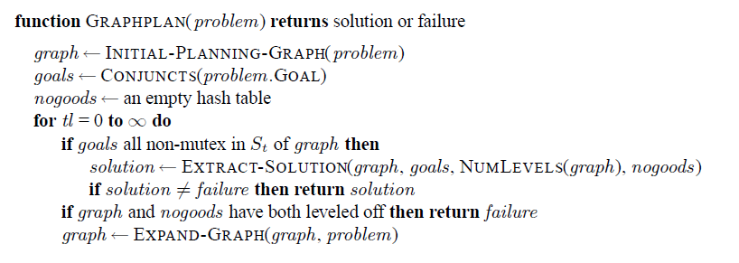
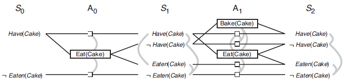
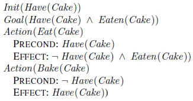

---

# Graphes de planification (2/2)

- Liens entre niveaux
  - Fluents  Préconditions
  - Effets  Fluents
- Liens intra niveaux: Mutexes
  - Actions (inconsistente, interference, compétion)
  - Fluents (négation, actions incompatibles)
- Heuristics depuis les graphes de planification:
  - But simple: Le niveau à partir duquel le but apparait
  - Conjonction: Niveau où tout les buts apparaissent sans Mutexe
- Graph Plan Algorithm
  - Extraction de solution extraction
  - CSP ou exploration rétrograde
  - **Démarrage à Sn,  actions non-mutex**
    -  Sn-1 (preconditions)
  - **Succès ou stockage du résultat dans "no-goods"**
    - = Apprentissage de contraintes

---

# Planification par contraintes

- SatPlan: La planification comme une satisfiabilité Booléenne
  - Propositionalisation des actions, des buts
  - Ajout des axiomes d'états successeurs
  - Ajout des axiomes de préconditions
  - Utilisation de l'algorithme WalkSat pour trouver une solution
  - A l'air compliqué, mais très rapide en pratique
- Formuler le problème comme un CSP
  - Plan à « k » actions
  - Variables
    - Action unique pour chaque étape Actiont = Action(a,i)
    - Fluent(f,i)
  - Contraintes
    - décrivent les effets
    - + état initial et but
  - Pas besoin d'action d'exclusion

---

# Calcul Situationnel

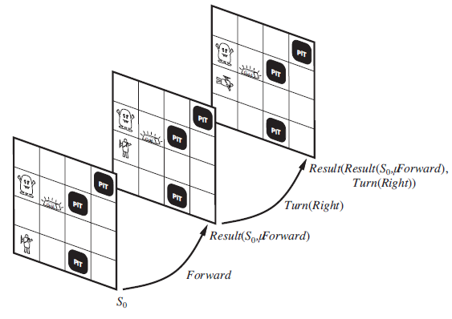

---

# Planification à ordre partiel

- Un planificateur non linéaire construit une liste d'étapes
  - Avec des contraintes temporaires
- Raffinement du plan partiellement ordonné
  - Par ajout d'étapes
  - Par ajout de contraintes
- Engagement minimal
  - On ne garde que le nécessaire
  - Pas d'engagement à l'avance
- Plan non linéaire
  - Etapes {S1, S2, S3…}
  - **Description d'opérateurs**
    - + pré et post-conditions
  - Liens causaux { … (Si, C, Sj) …}
  - Contraintes d'ordre { … Si < Sj …}
- Plan complet:
  - Toutes les étapes sont inclues
  - chaine de causalité
  - validité temporelles

---

# Décomposition hiérarchique (1/2)

- Conditions réelles plus difficiles
  - Gestion des ressources, du temps, des abstractions
- Planning  scheduling
  - Actions conditionnelles, incertaines, dynamicité
- Planifier =/= Programmer un évènement
  - Allouer des ressources, respecter des contraintes
- Planifier -> raisonner
- Programmer -> CSPs

---

# Décomposition hiérarchique (2/2)

- Opérateurs abstraits   vers les Buts intermédiaires
- Primitives de bas niveau
  - Exécutable
- Opérateurs non primitifs
  - Buts, actions abstraites
- Planificateurs hiérarchiques
  - Ex: SIPE
  - heuristiques de corroboration
  - Complexité de linéarisation
- Mesure et gestion des ressources
  - Variables numériques
  - Continu vs discret
  - Partageable vs non partageable
  - Réutilisable vs consommable vs renouvelable

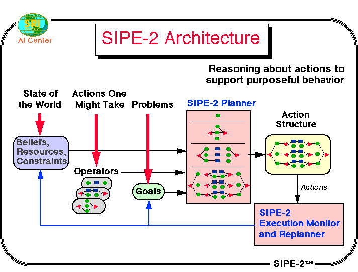

---

# Résumé planification

- Approches
  - Recherche dans l'espace d'état (STRIPS, chainage avant, etc.)
  - Dans l'espace des plans (planification partiellement ordonnées, HTN, etc.)
  - Basé sur les contraintes (GraphPlan, SATPlan etc.)
  - Calcul situationnel
  - Planification hierarchique
- Stratégies d'exploration
  - Planification progressive
  - Régression des but
  - Planification rétrograde
  - Moindre engagement
  - **Planification**
    - non linéaire
- Compétition annuelle
  - Plusieurs catégories
  - Etat de l'art
  - ICAPS

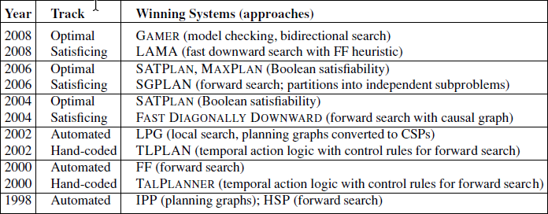

---

<!-- _class: questions -->

# Questions?

---

# Sommaire

- Agents fondés sur la connaissance
- Logique propositionnelle
- Logique du premier ordre
- Planification
- Représentation de connaissances
- TP: Mise en œuvre de l'inférence en logique propositionnelle et en logique du premier ordre

---

# Ontologies

- Objectifs
  - Représentation des connaissances à grande échelle
  - Lier les domaines spécialisés du savoir
  - Couvrir la diversité des connaissances
  -  Tâche difficile
- Besoins de catégorisation
  - Réification: prédicats et constantes
    - BallonDeBasket(b)  Membre(b, BallonsDeBasket)
  - Hiérarchie: taxonomies (sous-classes),
    - Héritage
  - Partitions: Disjoints + décomposition exhaustive
  - Composition
    - PartieDe(x,y)
    - Partition  assortiment (pas ensemble)

<!-- TODO: ajouter diagramme hiérarchie de classes avec exemples d'héritage -->

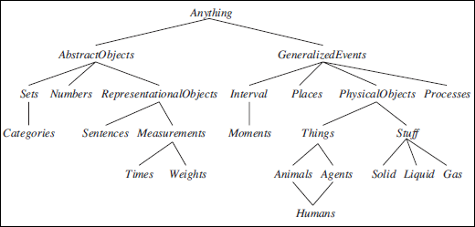

---

# Ontologies (2/2)

- Mesure
  - Unités
  - Diametre(ballonDeBasket12) = Centimetre(24)
  - Centimetre(2,54 * d) = Pouces(d)
- Evènements
  - Temps plutôt que situations (..,t)
  - Evènements discrets  « Processus » continus, liquides
- Objets mentaux
  - Connaissances sur les croyances
  -  Degrés de croyances Knows(Lois, CanFly(Superman))
  - Logique modale
  - Mondes possibles reliés par des relations d'accessibilité.

---

# Web sémantique

- Resource Description Framework
  - Communauté KR: AAAI, W3C, Berners-Lee
  - RDF - triplets (faits), classes / sousclasses
  - RDFS - OWL
    - Classes définies
    - contraintes
  - SPARQL
    - Requêtes, "Triple Stores",
    - Linked-Data
  - SOA
  - Exemples

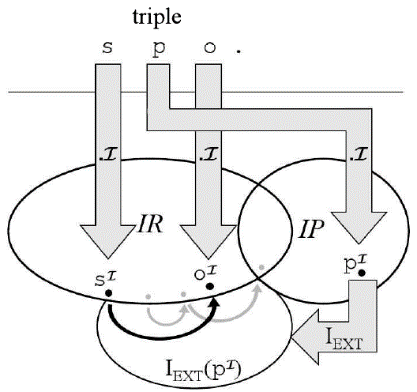

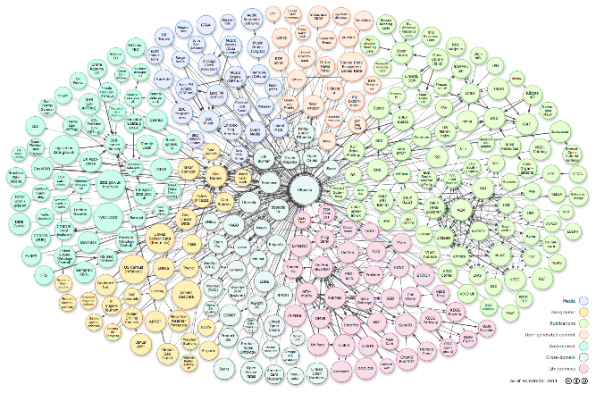

---

# Systèmes de raisonnement

- Réseaux sémantiques
  - Proche des formalismes UML/Merise
  - Inf. par navigation, héritage, réification
- Valeurs par défaut et héritage
- Logiques de descriptions
  - Notations élaborées pour FOL
  - Subsomption (sous-ensemble), classification, cohérence
  - And, All, AtLeast, AtMost, Fills, SameAs, OneOf…

---

# Systèmes de raisonnement (2/2)

- Logiques non monotones
  - Monde clos: proposition pas mentionnée fausse par défaut.
  - Non monotone: nouveaux faits peuvent invalider état de croyance
  - Circonscription: Oiseau(x) ^ Not (Anormal(x))  Voler(x): Anormal a priori faux + priorité des modèles
  - Logique par défaut: Tant que Voler est cohérent, il est considéré vrai

---

# Systèmes à maintenance de vérité (1/2)

- Révision des croyances
  - Statut par défaut  révision des faits inférés faux
  - = révision des croyances: Tell(KB,not P)  Retract (KB,P)
  - Problème : si PQ doit on annuler Q?
  - Solution simple: revenir en arrière (coûteux)
- Fondé sur la justification (JTMS)
  - Les énoncés sont associés à leurs justifications
  - Suppression soft: in/out

---

# Systèmes à maintenance de vérité (2/2)

- Fondé sur les hypothèses (ATMS = assumptions)
  - Envisager simultanément plusieurs hypothèses (≠ JTMS)
  - Chaque énoncé comporte les hypothèses qui peuvent le rendre vrai
  - = Etiquettes, Environnements
  - Ex: Justice: IBM ANB: Analyst's Notebook
- Générateurs d'explications
  - + hypothèses = explications raisonnables
  - = Explications minimales (Ockham)
  - Ex: panne moteur
  - Batterie à plat

---

# Smart Contracts

- Cryptographie:
  - Signature
  - Chiffrement
    - Symétrique
    - Asymétrique
- Cypherpunks
  - Manifesto
  - Ex: Bitcoin
- Blockchain
  - POW, POS
- Non divulgation de connaissance
  - Preuves interactives. Ex: la porte cachée
  - Preuves non interactives.
  - Chiffrement Homomorphe: C(A+B) = C(A)+C(B)
  - Ex: Helios voting
- Contrats à clauses complexes
  - Signatures composites (courtier, dépots/agents fiducières)
  - Clauses scriptées. Ex: EtherCoin Hack

---

# Résumé représentation des connaissances

- Ontologies
  - Méta-modèles de données
- Web sémantique
  - Représentation de faits
  - Pile sémantique du W3C
- Systèmes de raisonnement
  - Maintenance de la vérité
- Smart Contracts
  - Signatures, chiffrement et Preuves
  - Divulgation partielle et contractualisée

---

<!-- _class: questions -->

# Questions?

---

# Plan du cours

- Introduction
- Résolution de problèmes
- Bases de connaissances et logique
- Raisonnement probabiliste
- Apprentissage
- Traitement du langage naturel
- TP final projets trimestriels

---

# Projets de groupe (1/2)

- Moteur de recherche augmenté par le raisonnement et le langage naturel
  - Grammaire et sémantique des contenus et des requêtes. Lucene.Net, OpenNLP, SharpRDF, FOL
- Conception de bots de services sur réseaux sociaux
  - Chat Bots, AIML, Reddit et agents de service, NLP, RDF, APIs
- Conception d'un modèle d'inférence pour l'analyse de sentiment
  - Conception d'un modèle probabiliste, Infer.Net, démarche expérimentale, Reddit
- Création d'une plateforme sémantique LDP à partir d'un index structuré.
  - Structuration et ouverture des données = Linked Data. Lucene.Net, SharpRDF
- Résolution de Captchas par deep learning
  - Apprentissage via un Adapteur DNN, Réseaux de dernières génération. TensorFlow, CNTK, Encog

---

# Projets de groupe (2/2)

- Entrainement de stratégies de trading algorithmiques sur crypto monnaies.
  - Expérience DNN Bitcoin, Encog et machine learning
- Amélioration par l'apprentissage d'un agent joueur de Go simple
  - Le Go et l'IA, Récentes avancées. Go Traxx
- Evolution de vaisseaux spatiaux par algorithmes génétiques dans le jeu de la vie.
  - Approches évolutionnistes, automates cellulaires, Bac a sable. Golly, Encog
- Pilotage d'un cluster de cache distribué pour le portage d'applications  dans le Cloud
  - Caches distribués, scaling, stratégies et clustering. Redis

---

# Pour aller plus loin : Notebooks

> **Lean 4** (10 notebooks) : Assistants de preuve, logique d'ordre supérieur
> `MyIA.AI.Notebooks/SymbolicAI/Lean/`

> **Z3 / SMT** : Solveurs modulo théorie, SAT, contraintes
> `MyIA.AI.Notebooks/Sudoku/Sudoku-4-Z3.ipynb`

> **Argumentation (Tweety)** : Logiques argumentatives de Dung, ASPIC, ABA
> `MyIA.AI.Notebooks/SymbolicAI/Argument_Analysis/`

> **Web sémantique (RDF)** : Triplets, ontologies, SPARQL
> `MyIA.AI.Notebooks/SymbolicAI/RDF/`

> **CSPs et planification** : Problèmes de satisfaction de contraintes
> `MyIA.AI.Notebooks/Search/CSPs_Intro.ipynb`
> `MyIA.AI.Notebooks/Sudoku/Sudoku-3-ORTools.ipynb`

---

<!-- _class: title -->

# Merci

- Jean-Sylvain Boige
- jsboige@myia.org
