# Bases de connaissances et Logique

<div class="text-center text-2xl mt-8 mb-4 opacity-70">INTELLIGENCE ARTIFICIELLE — III</div>

<div class="grid grid-cols-1 gap-2 text-xl mt-8">

- Logique propositionnelle
- Logique du premier ordre
- Planification
- Representation des connaissances

</div>

---
layout: section
---

# Plan du cours

- I. Introduction
- II. Resolution de problemes
- **III. Bases de connaissances et logique**
- IV. Raisonnement probabiliste
- V. Apprentissage
- VI. Traitement du langage naturel
- VII. TP final projets trimestriels

---
layout: default
---

# Sommaire

- Agents fondes sur la connaissance
- Logique propositionnelle
- Logique du premier ordre
- Planification
- Representation de connaissances
- TP: Mise en oeuvre de l'infrence en logique propositionnelle et en logique du premier ordre

---
layout: section
---

# Agents fondes sur les connaissances
---
layout: default
---

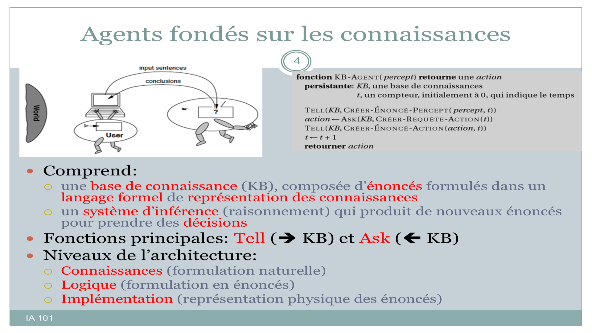

# Agents fondes sur les connaissances

## Fonction KB-AGENT

```
fonction KB-AGENT(percept) retourne une action
  persistante: KB, une base de connaissances
               t, un compteur, initialement a 0, qui indique le temps

  Tell(KB, Creer-Enonce-Percept(percept, t))
  action <- Ask(KB, Creer-Requete-Action(t))
  Tell(KB, Creer-Enonce-Action(action, t))
  t <- t + 1
  retourner action
```

## Composants

- Une base de connaissance (KB), composee d'enonces formules dans un langage formel de representation des connaissances
- Un systeme d'infrence (raisonnement) qui produit de nouveaux enonces pour prendre des decisions

## Fonctions principales

- Tell (-> KB) : Ajouter des connaissances
- Ask (<- KB) : Interroger la base

## Niveaux de l'architecture

- Connaissances (formulation naturelle)
- Logique (formulation en enonces)
- Implementation (representation physique des enonces)

---
layout: default
---

# Exemple: le monde du Wumpus


<div style="max-width: 60%;">

## Jeu de role simpliste

### Environnement

- Grille 4x4 de salles a explorer

### But/Performance

- Trouver l'or et sortir sans dommages

### Actions

- Avancer, tourner, saisir, tirer, sortir

### Percepts

- Odeur, brise, lueur, choc, cri
  -> Vecteur

## Symboles

- A = Agent
- B = Brise
- L = Lueur/Or
- OK = Case sure
- P = Puits
- O = Odeur
- V = Visite
- W = Wumpus

</div>

---
layout: default
---

<div style="max-width: 60%;">

# Representation et logique

## Syntaxe

- Definit les enonces possibles dans le langage

## Semantique

- Definit le sens des enonces
- Relation entre les enonces et le monde reel

## Proposition logique

- Un enonce qui peut etre vrai ou faux

## Connecteurs logiques

- NON (negation)
- ET (conjonction)
- OU (disjonction)
- IMPLIQUE (implication)
- EQUIVAUT (equivalence)

</div>


---
layout: default
---

# Proprietes des systemes de representation

## Correction

- Preserve la validite semantique
- Derive des consequences valides

## Coherence / Consistance

- Pas de contradiction dans la base de connaissances

## Completude

- Deriver tout ce qui est valide
- Tout ce qui est vrai peut etre prouve

---
layout: default
---

# Types de logiques

## Ontologie et Epistemologie

- **Ontologie** : etude de ce qui existe dans le monde modelise
- **Epistemologie** : etude de ce qui peut etre connu par l'agent

## Comparaison

| Logique | Variables | Quantifie sur | Decidable ? |
|---------|-----------|---------------|-------------|
| Propositionnelle | Symboles booleens | -- | Oui (NP-complet) |
| Premier ordre (FOL) | Objets du domaine | Variables | Semi-decidable |
| Ordre superieur (HOL) | Relations, fonctions | Relations | Non |
| Modale | + mondes possibles | Necessaire/possible | Selon variante |

---
layout: section
---

# Logique Propositionnelle
---
layout: default
---

# Enonces propositionnels

## Proposition

- Un enonce atomique qui peut etre vrai ou faux
- Ex: "Il pleut", "Le Wumpus est en [1,2]"

## Enonces complexes

- Combinaisons de propositions avec des connecteurs logiques
- Ex: "Il pleut ET il fait froid"

## Connecteurs logiques

- P ET Q : vrai si P et Q sont vrais
- P OU Q : vrai si au moins un est vrai
- NON P : vrai si P est faux
- P => Q : vrai si P est faux ou Q est vrai
- P <=> Q : vrai si P et Q ont meme valeur de verite

---
layout: default
---

<div style="max-width: 58%;">

# Syntaxe de la logique propositionnelle

## Symboles

- Propositions: P, Q, R, ...
- Connecteurs: ET, OU, NON, =>, <=>
- Parentheses: (, )

## Formules bien formees (FBF)

1. Toute proposition est une FBF
2. Si P est une FBF, NON P est une FBF
3. Si P et Q sont des FBF, (P ET Q), (P OU Q), (P => Q), (P <=> Q) sont des FBF
4. Rien d'autre n'est une FBF

</div>


---
layout: default
---

# Semantique de la logique propositionnelle

## Interpretation

- Attribution d'une valeur de verite (Vrai/Faux) a chaque proposition

## Tables de verite

<table style="border-collapse:collapse; margin: 0.4em 0 1em 0; font-size: 0.92em;">
<thead>
<tr style="background:#8B1A1A; color:#fff;">
<th style="padding:4px 14px; border:1px solid #8B1A1A;">P</th>
<th style="padding:4px 14px; border:1px solid #8B1A1A;">Q</th>
<th style="padding:4px 14px; border:1px solid #8B1A1A;">P ET Q</th>
<th style="padding:4px 14px; border:1px solid #8B1A1A;">P OU Q</th>
<th style="padding:4px 14px; border:1px solid #8B1A1A;">P =&gt; Q</th>
<th style="padding:4px 14px; border:1px solid #8B1A1A;">P &lt;=&gt; Q</th>
</tr>
</thead>
<tbody>
<tr><td style="padding:3px 14px; border:1px solid #ccc; text-align:center;">V</td><td style="padding:3px 14px; border:1px solid #ccc; text-align:center;">V</td><td style="padding:3px 14px; border:1px solid #ccc; text-align:center;">V</td><td style="padding:3px 14px; border:1px solid #ccc; text-align:center;">V</td><td style="padding:3px 14px; border:1px solid #ccc; text-align:center;">V</td><td style="padding:3px 14px; border:1px solid #ccc; text-align:center;">V</td></tr>
<tr><td style="padding:3px 14px; border:1px solid #ccc; text-align:center;">V</td><td style="padding:3px 14px; border:1px solid #ccc; text-align:center;">F</td><td style="padding:3px 14px; border:1px solid #ccc; text-align:center;">F</td><td style="padding:3px 14px; border:1px solid #ccc; text-align:center;">V</td><td style="padding:3px 14px; border:1px solid #ccc; text-align:center;">F</td><td style="padding:3px 14px; border:1px solid #ccc; text-align:center;">F</td></tr>
<tr><td style="padding:3px 14px; border:1px solid #ccc; text-align:center;">F</td><td style="padding:3px 14px; border:1px solid #ccc; text-align:center;">V</td><td style="padding:3px 14px; border:1px solid #ccc; text-align:center;">F</td><td style="padding:3px 14px; border:1px solid #ccc; text-align:center;">V</td><td style="padding:3px 14px; border:1px solid #ccc; text-align:center;">V</td><td style="padding:3px 14px; border:1px solid #ccc; text-align:center;">F</td></tr>
<tr><td style="padding:3px 14px; border:1px solid #ccc; text-align:center;">F</td><td style="padding:3px 14px; border:1px solid #ccc; text-align:center;">F</td><td style="padding:3px 14px; border:1px solid #ccc; text-align:center;">F</td><td style="padding:3px 14px; border:1px solid #ccc; text-align:center;">F</td><td style="padding:3px 14px; border:1px solid #ccc; text-align:center;">V</td><td style="padding:3px 14px; border:1px solid #ccc; text-align:center;">V</td></tr>
</tbody>
</table>

## Satisfaction

- Une interpretation satisfait une formule si la formule est vraie sous cette interpretation
- Une formule est **satisfaisable** s'il existe au moins une interpretation qui la satisfait
- Une formule est **valide** (tautologie) si elle est satisfaite par toute interpretation

---
layout: default
---

# Infrence propositionnelle

## Entailment (consequence semantique)

- KB |= alpha : "KB entraine alpha"
- Alpha est vrai dans tous les modeles ou KB est vrai

## Theoreme de deduction

- KB |= alpha si et seulement si (KB => alpha) est valide

## Demonstration d'infrence

1. **Methodes de verification de modele**
   - Enumerer toutes les interpretations
   - Verifier que alpha est vrai quand KB est vrai

2. **Methodes de preuve**
   - Deriver alpha a partir de KB en utilisant des regles d'infrence

---
layout: default
---

<div style="max-width: 58%;">

# Regles d'infrence

## Modus Ponens

- Si P est vrai et P => Q est vrai, alors Q est vrai
- P, P => Q |- Q

## Et-introduction

- Si P est vrai et Q est vrai, alors P ET Q est vrai
- P, Q |- P ET Q

## Et-elimination

- Si P ET Q est vrai, alors P est vrai et Q est vrai
- P ET Q |- P
- P ET Q |- Q

## Ou-introduction

- Si P est vrai, alors P OU Q est vrai
- P |- P OU Q

## Double negation

- NON(NON P) equivaut a P

</div>


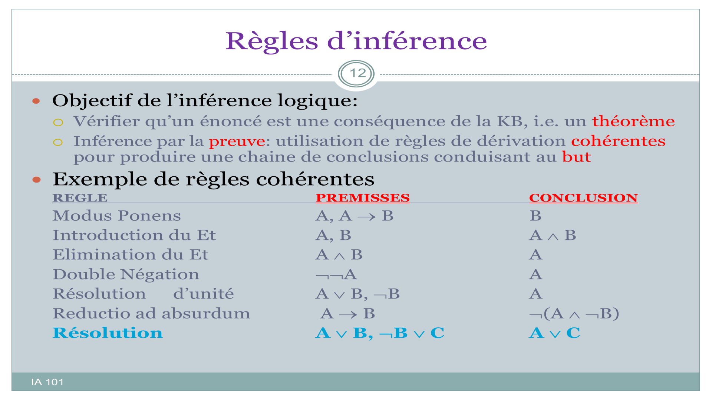

---
layout: default
---

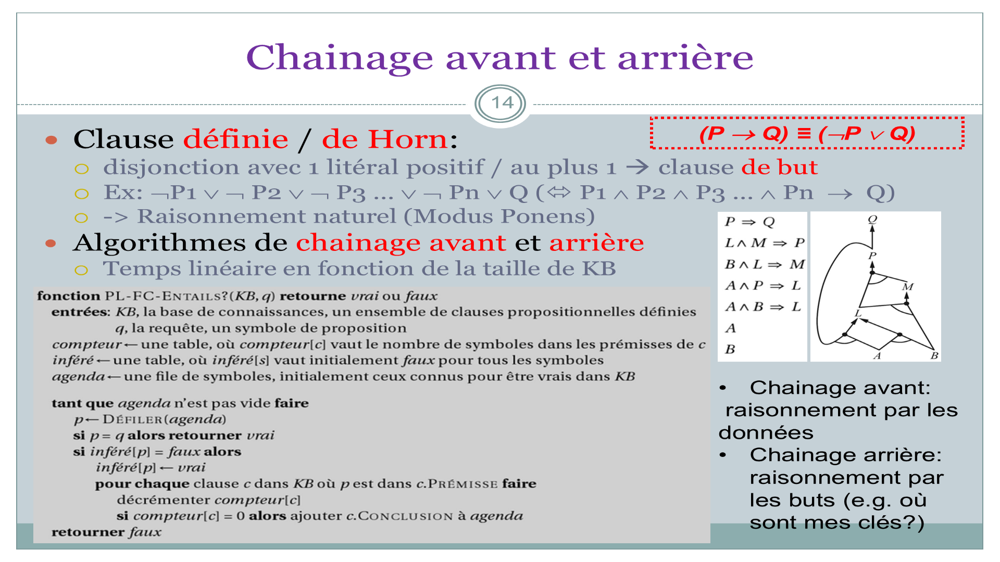

# Resolution - Clauses

## Clause

- Disjonction de litteraux: P1 OU P2 OU ... OU Pn OU NON Q1 OU ... OU NON Qm

## Clause de Horn

- Au plus un litteral positif: P OU NON Q1 OU ... OU NON Qm
- Equivaut a: (Q1 ET Q2 ET ... ET Qm) => P

## Regle de resolution

- Deux clauses avec des litteraux complementaires peuvent etre combinees
- (P OU Q), (NON P OU R) |- (Q OU R)

## Resolution unitaire

- Si une clause a un seul litteral: P, (NON P OU Q) |- Q

---
layout: image-overlay
image: ./images/img_015.png
---

# Resolution - Algorithme

<div style="background: rgba(245,245,245,0.92); padding: 1.2em 1.6em; border-radius: 6px; max-width: 60%;">

## Algorithme de resolution

1. Convertir KB en CNF (forme normale conjonctive)
2. Ajouter NON alpha a l'ensemble de clauses
3. Appliquer la resolution jusqu'a obtenir la clause vide (contradiction) ou ne plus pouvoir progresser

**Resultat** : si la clause vide est derivee, alors KB |= alpha (preuve par refutation).

</div>

---
layout: default
---

# Forward et Backward Chaining


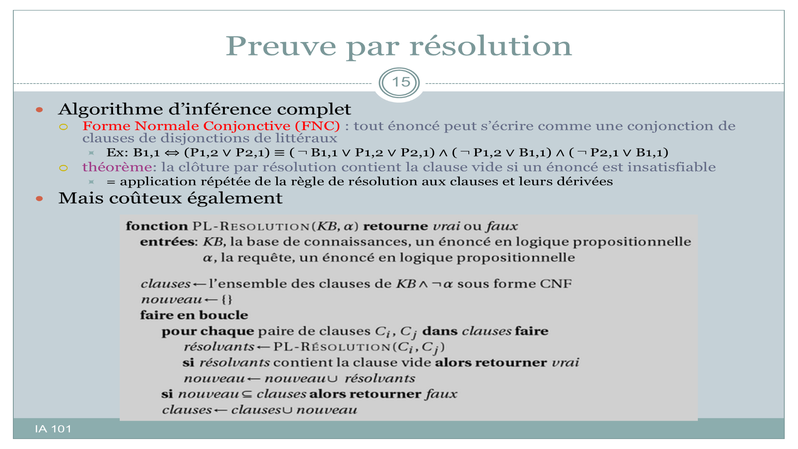

<div style="max-width: 58%;">

## Forward Chaining (chaine avant)

- Partir des faits connus
- Appliquer les regles pour deduire de nouveaux faits
- Continuer jusqu'a ce que le but soit atteint ou plus aucun fait nouveau

## Backward Chaining (chaine arriere)

- Partir du but
- Chercher les regles dont le but est la conclusion
- Recursivement chercher a prouver les premisses

## Comparaison

- Forward: mieux quand les faits sont peu nombreux et les buts nombreux
- Backward: mieux quand les buts sont peu nombreux et les faits nombreux

</div>

---
layout: default
---

# Proprietes des systemes d'infrence

## Correctitude (Soundness)

- Si KB |- alpha, alors KB |= alpha
- Tout ce qui est prouvable est vrai

## Completude

- Si KB |= alpha, alors KB |- alpha
- Tout ce qui est vrai peut etre prouve

## Decidabilite

- Existe-t-il un algorithme qui peut toujours determiner si KB |= alpha ?

## Complexite

- Logique propositionnelle: NP-complet pour la satisfiabilite
- Mais les clauses de Horn: temps lineaire

---
layout: default
---

<div style="max-width: 58%;">

# Procedure d'inference simple

## Approche par verification de modele (truth table)

- Enumerer toutes les interpretations possibles
- Verifier que la conclusion est vraie quand les premisses sont vraies

## Proprietes

- Procedure **coherente** et **complete** (par definition)
- Mais **couteuse** : exponentielle en fonction du nombre de symboles

</div>


---
layout: default
---

<div style="max-width: 58%;">

# Backtracking complet (DPLL)

## Algorithmes efficaces pour la satisfiabilite (SAT)

- (P => Q) equivaut a (NON P OU Q)
- Algorithme de Davis-Putnam, Logemann et Loveland (DPLL)

## DPLL

- Enumeration recursive en profondeur d'abord
- **Elagage** : une clause est vraie si un litteral est vrai, un enonce est faux si une clause est fausse
- **Heuristique des symboles purs** : toujours le meme signe -> litteral doit etre vrai
- **Heuristique des clauses unitaires** : assignation de ces clauses en premier

</div>


---
layout: default
---

# Backtracking complet (2/2)

## Astuces (cf. CSP)

- Analyse des composants
- Ordre des variables
- Backtracking intelligent
- Reprises aleatoires
- Indexation intelligente

## Applications modernes

- Verification hardware
- Verification de protocoles
- Model checking

---
layout: default
---

<div style="max-width: 58%;">

# Exploration locale

## Principe

- Equivaut a Min-Conflits pour les CSPs
- Evaluation = nombre de clauses non satisfaites

## Caracteristiques

- Problemes simples sous-contraints / sur-contraints
- Ratio nb clauses / nb symboles -> seuil de satisfiabilite
- NP-complet souvent au seuil

</div>


---
layout: default
---

# Agents fondes sur la logique propositionnelle (1/2)

## Etat actuel du monde (cf Wumpus)

- Variables temporelles (fluent) et atemporelles

## Modele de transition -> axiomes d'effet

- L<sub>0,1</sub> ∧ FacingEast<sub>0</sub> ∧ Forward<sub>0</sub> => (L<sub>1,2,1</sub> ∧ ¬L<sub>1,1,1</sub>)
- Ask(KB, L<sub>1,2,1</sub>) = true

## Persistance

- Pour ce qui demeure inchange -> axiomes de persistance
- Forward<sub>t</sub> => (HaveArrow<sub>t</sub> ⇔ HaveArrow<sub>t+1</sub>)

## Axiomes de l'etat successeur

- HaveArrow<sub>t+1</sub> ⇔ (HaveArrow<sub>t</sub> ∧ ¬Shoot<sub>t</sub>)
- Nombreux cas a couvrir

---
layout: default
---

<div style="max-width: 58%;">

# Agents fondes sur la logique propositionnelle (2/2)

## Agent hybride

- Maintient une KB et un plan courant
- + exploration A* pour la navigation

## Estimation logique des etats

- Probleme : inférence de plus en plus longue (t<sub>0</sub>+1+1+...)
- Solution : mise en cache des resultats intermediaires

## MAJ etat de croyance

- = estimation des etats

</div>


---
layout: default
---

# Agents fondes sur la logique propositionnelle (3/3)

## Construction du plan par inference

- =/= agent hybride

## Algorithme SAT Plan

- Utilisation de WalkSAT
- **Axiomes de precondition d'actions** (actions legales seulement)
  - Shoot<sub>t</sub> => HaveArrow<sub>t</sub>
- **Axiomes d'exclusion d'action** (non simultaneite)
  - ¬At<sub>i</sub> ∨ At<sub>j</sub>

---
layout: default
---

# Resume logique propositionnelle

## Definition

- Syntaxe : Symboles, connecteurs
- Semantique : Valeurs de verite

## Inference

- Tables de verite
- Chainage avant, arriere
- Resolution
- Backtracking, DPLL
- Exploration locale, WalkSat

## Agents

- Variables (Fluents / atemporelles)
- Modele transitionnel, axiomes
- Hybride / SatPlan

---
layout: section
---

# Logique du Premier Ordre
---
layout: default
---

# Limites de la logique propositionnelle

## Exemple: Monde du Wumpus

- "Il y a une odeur dans toutes les cases adjacentes au Wumpus"
- En logique propositionnelle:
  - O1,1 <=> (W1,1 OU W1,2 OU W2,1)
  - O1,2 <=> (W1,1 OU W1,2 OU W1,3 OU W2,2)
  - ...
- Besoin d'une regle par case!

## Logique du premier ordre

- Permet d'exprimer des generalites
- "Pour tout x, s'il y a du Wumpus en x, alors il y a une odeur dans toutes les cases adjacentes"
- Une seule formule pour toutes les cases

---
layout: default
---

<div style="max-width: 58%;">

# Syntaxe de la logique du premier ordre

## Termes

- Constantes: Jean, Marie, A, B, ...
- Variables: x, y, z, ...
- Fonctions: Pere(Jean), Position(Agent), ...

## Formules atomiques

- Predicats: P(x), Q(x, y), R(Jean, Marie)
- Egalite: x = y

## Formules complexes

- Combinaisons avec connecteurs propositionnels
- Quantificateurs:
  - Quel que soit (pour tout): ∀x P(x)
  - Il existe: ∃x P(x)

</div>


---
layout: default
---

# Semantique de la logique du premier ordre

## Interpretation

- Domaine: ensemble non vide d'objets
- Interpretation des constantes: elements du domaine
- Interpretation des fonctions: applications du domaine vers le domaine
- Interpretation des predicats: relations sur le domaine

## Satisfaction

- Une interpretation satisfait ∀x P(x) si P(x) est vrai pour tout element du domaine
- Une interpretation satisfait ∃x P(x) si P(x) est vrai pour au moins un element

## Modele

- Une interpretation qui satisfait une formule

---
layout: default
---

# Quantificateurs

## Quantificateur universel (∀)

- ∀x P(x) : "Pour tout x, P(x)"
- Ex: ∀x (Humain(x) => Mortel(x))

## Quantificateur existentiel (∃)

- ∃x P(x) : "Il existe un x tel que P(x)"
- Ex: ∃x (Humain(x) ET Philosophe(x))

## Equivalences

- ∀x P(x) equivaut a NON ∃x NON P(x)
- ∃x P(x) equivaut a NON ∀x NON P(x)

## Portee des quantificateurs

- Les variables liees par un quantificateur sont locales a la formule

---
layout: default
---

# Quantificateurs (2/2)

## Formule bien formee (wff)

- Un enonce qui ne contient aucune variable "libre"
- Toutes les variables sont "liees" a des quantificateurs existentiels ou universels

## Regles d'inference quantifiees

- Instanciations universelle et existentielle
  - ∀x P(x) |- P(A)
  - ∃x P(x) |- P(F) (Skolemization : constante de Skolem F)
- Generalisations universelle et existentielle
  - P(A), P(B) ... |- ∀x P(x)
  - P(A) |- ∃x P(x)

---
layout: default
---

# Traductions d'enonces

## Exemples simples

- "On peut tromper quelqu'un tout le temps"
  - ∀x ∃t person(x) ∧ time(t) => can-fool(x,t)
- "On peut tromper tout le monde de temps en temps"
  - ∃x ∀t (person(x) ∧ time(t) => can-fool(x,t))

---
layout: default
---

# Traductions d'enonces (2/2)

## Exemples avances

- "Il y a exactement 2 champignons violets"
  - ∃x ∃y mushroom(x) ∧ purple(x) ∧ mushroom(y) ∧ purple(y) ∧ (x≠y) ∧ ∀z (mushroom(z) ∧ purple(z)) => ((x=z) ∨ (y=z))

## Monty Python (raisonnements fallacieux)

- ∀x witch(x) => burns(x)
- ∀x wood(x) => burns(x)
- Donc ∀x witch(x) => wood(x)
- **Argument fallacieux** : Affirmation du consequent

---
layout: default
---

# Axiomes et ingenierie des donnees

## Axiomes de base

- Enonces consideres comme vrais sans demonstration
- Fondements de la base de connaissances

## Ingenierie des donnees

- Processus de formalisation des connaissances
- Identifier les objets, relations et proprietes pertinentes
- Formuler les axiomes corrects

## Exemple: Monde du Wumpus

- "Toutes les cases adjacentes au Wumpus sentent mauvais"
  - ∀x (Wumpus(x) => ∀y (Adjacent(y,x) => Odeur(y)))
- "Il n'y a pas de Wumpus dans la case de depart"
  - NON Wumpus([1,1])

---
layout: default
---

<div style="max-width: 58%;">

# Aparte : Analyse rhetorique

## Introduction a l'argumentation

- Un code de conduite intellectuelle
- Qu'est-ce qu'un argument ?
- Qu'est-ce qu'un bon argument ?
- Qu'est-ce qu'un argument fallacieux ?

## Themes

- Taxonomie des arguments fallacieux
- Biais cognitifs
- Qualites argumentatives
- Jeu de cartes

</div>


---
layout: default
---

# Code de conduite intellectuelle (1/2)

## Un standard procedural efficace

- Les regles de base pour une discussion fructueuse

## Un standard ethique important

- Les parties s'engagent a etre honnetes

## Principes de conduite intellectuelle

- **Faillibilite** : accepter de pouvoir se tromper
- **Recherche de la verite** : s'engager a rechercher la position la plus defendable
- **Clarte** : pas de confusion linguistique, separer d'autres problematiques
- **Charge de la preuve** : repose sur celui qui avance une position

---
layout: default
---

# Code de conduite intellectuelle (2/2)

## Principes (suite)

- **Charite** : donner a l'adversaire le benefice du doute
- **Structure, Pertinence, Acceptabilite, Suffisance, Refutation**
- **Suspension du jugement** : si pas de preuve ou des arguments egaux (sauf si necessite consequences)
- **Resolution** : si tout le reste est respecte, accepter la conclusion
- **Accepter un nouvel examen au besoin**

---
layout: default
---

# Qu'est-ce qu'un argument ?

## Definition

- Une proposition supportee par d'autres propositions
  - **Premisses** : les raisons
  - **Conclusion** : supportee par les premisses et le raisonnement

## Argument =/= Opinion

- Une opinion n'est pas supportee

## Forme standard

- Puisque (premise 1), qui est une conclusion supportee par (sous-premise 1.1)
- et (premise 2)
- [et (premise implicite)]
- et (premise de refutation)
- Alors (Conclusion)

---
layout: default
---

# Qu'est-ce qu'un argument ? (2/2)

## Deduction vs Induction

- **Deduction** : necessite logique
- **Induction** : corroboration

## Arguments particuliers

- **Moral** : premise morale (principe)
- **Legal** : premise legale (loi, jurisprudence)
- **Esthetique** : premise esthetique (critere esthetique)

---
layout: default
---

# Qu'est-ce qu'un bon argument ? (1/2)

## 5 criteres

1. **Structure bien formee**
   - Pas de contradictions entre premisses et avec la conclusion
   - Pas de verite par principe, ou de deduction invalide
2. **Premisses pertinentes** pour la verite de la conclusion
   - Pas de premisses inutiles, les liens doivent etre explicites
3. **Premisses acceptables** par une personne raisonnable
   - Connaissance commune, ou confirmee par l'experience
   - Defendue ou defendable par une source accessible
   - Temoignage non controversee par une autorite competente
   - Conclusion d'un autre bon argument
   - Proposition mineure constituant une hypothese raisonnable

---
layout: default
---

# Qu'est-ce qu'un bon argument ? (2/2)

## Criteres (suite)

4. **Premisses suffisantes** a demontrer la conclusion
   - Difficile a systematiser
   - Cf. certaines sciences (echantillons statistiques) ou experience
5. **Refutation effective** des critiques anticipees
   - Le plus difficile, manque le plus souvent
   - Permet de departager de "presque" bons arguments

## Renforcer un argument

- Balayer ces 5 criteres et le modifier en consequence

---
layout: default
---

# Qu'est-ce qu'un argument fallacieux ?

## Definition

- La violation de l'un des criteres definissant un bon argument
  - Faille structurelle
  - Premisse non pertinente
  - Premisse sous le standard d'acceptabilite
  - Premisses insuffisantes a etablir la conclusion
  - Pas de refutation effective des critiques anticipees

## Nommees ou non

- Cf. Taxonomie
- Le nom pas necessaire, mais utile

---
layout: default
---

# Qu'est-ce qu'un argument fallacieux ? (2/2)

## Denoncer un argument fallacieux

- Autodestruction par reconstruction en forme standard
- Methode du contre-exemple absurde

## Fair-play

- Pas trop en faire
- Que si necessaire
- Accepter ses propres erreurs
- Eviter si possible de mentionner la notion d'argument fallacieux

---
layout: default
---

# Semantique de la logique du premier ordre (details)

## Transposition dans le monde

- Interpretation des domaines (Constantes -> objets), connecteurs, quantificateurs
- Predicats, fonctions -> relations entre objets
- Egalite -> memes objets

## Interpretation d'enonce

- Modele d'enonces, enonce satisfiable (vrai selon une interpretation)
- Valide (toutes les interpretations), inconsistant (pas d'interpretation)
- Consequence logique (inclusion des modeles)

## Derivations

- Axiomes : capture des faits importants des domaines
- Demonstration de theoremes
- Definitions par equivalences
- Conditions necessaires, suffisantes (dualite)

---
layout: default
---

# Semantique de la logique du premier ordre (2/2)

## Semantique de base de donnees

- Hypothese des noms uniques
- Les enonces atomiques inconnus sont presumes faux (hypothese de monde clos)
- Fermeture du domaine (pas plus d'elements que les constantes donnees)

## Infrence en FOL : Operations Tell, Ask

- Assertions -> Tell (ex: TELL(KB, King(John)))
- Requetes / buts -> Ask (ex: ASK(KB, King(John)))
- Substitution / liste de liaison -> AskVars (ex: ASKVARS(KB, Person(x)))
- Reduction a l'inference propositionnelle
  - Regles des quantificateurs + symboles fermes => symboles propositionnels
  - Procedure complete mais semi-decidable (Godel), tres lente

---
layout: default
---

# Procedures d'inference en FOL

## Chainages

- **Chainage avant** : bases de donnees deductives, systemes de production
- **Chainage arriere** : programmation logique (Prolog) + memoisation

## Exemple : le crime du Colonel West

- "The law says that it is a crime for an American to sell weapons to hostile nations"
- "The country Nono, an enemy of America, has some missiles M1"
- "All of its missiles were sold to it by Colonel West, who is American"
- "Who's a criminal?"

---
layout: default
---

# Procedures d'inference en FOL (2/2)

<div style="max-width: 55%;">

## Resolution

- Systeme de preuve complet
- Strategies pour reduire l'espace de resolution (demodulation, paramodulation)
- Demonstrateurs de theoremes sophistiques : OTTER, E-prover

## Notations

- p ∨ (q ∧ r) <-> p + (q * r)
- Prolog: `cat(X) :- furry(X), meows(X), has(X, claws)`
- Lispy: `(forall ?x (implies (and (furry ?x) (meows ?x) (has ?x claws)) (cat ?x)))`

</div>


---
layout: default
---

# Infrence en logique du premier ordre

## Propositionalisation

- Convertir en logique propositionnelle
- Remplacer les variables par toutes les constantes possibles
- Probleme: explosion combinatoire

## Unification

- Trouver une substitution qui rend deux termes identiques
- Ex: unifier P(x, Jean) et P(Marie, y) -> &#123;x/Marie, y/Jean&#125;

## Modus Ponens generalise

- Si P et (P => Q) sont vrais, alors Q est vrai
- Avec substitution appropriee

---
layout: default
---

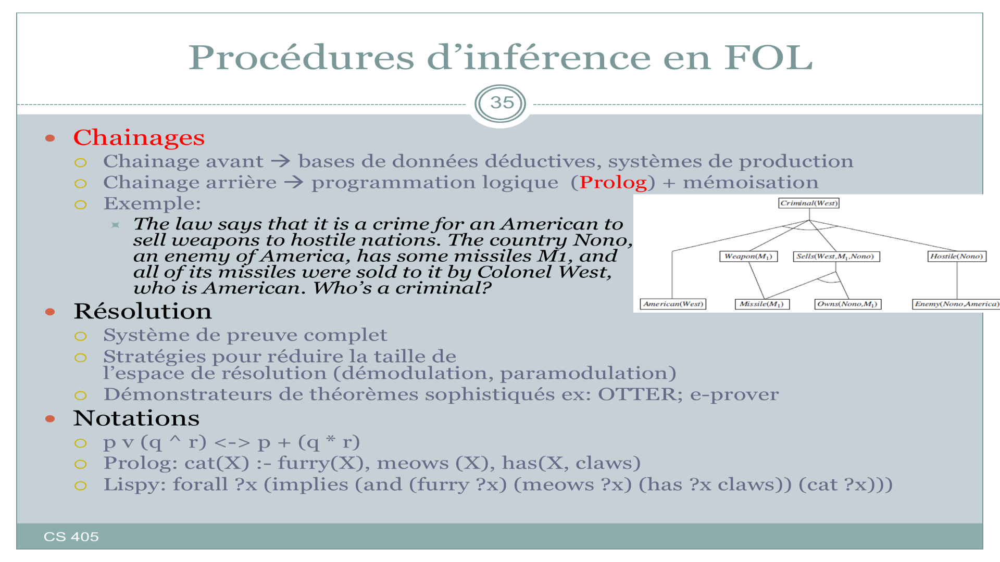

# Unification

## Definition

- Substitution: ensemble de paires variable/terme
- Unificateur: substitution qui rend deux atomes identiques
- Unificateur le plus general (MGU): unificateur minimal

## Exemples

- Unifier P(x, Jean) et P(Marie, y)
  - MGU: &#123;x/Marie, y/Jean&#125;
  - Resultat: P(Marie, Jean)

- Unifier P(x, x) et P(Jean, Marie)
  - Echec: impossible d'unifier

## Algorithme d'unification

- Comparer recursivement les termes
- Remplacer les variables par des termes plus specifiques

---
layout: default
---


# Forward chaining en FOL

## Principe

1. Partir des faits connus
2. Pour chaque regle, trouver les substitutions qui satisfont les premisses
3. Ajouter les conclusions correspondantes
4. Repeter jusqu'a ce que le but soit atteint

## Exemple

- Faits: Humain(Socrate)
- Regle: ∀x (Humain(x) => Mortel(x))
- Substitution: &#123;x/Socrate&#125;
- Nouveau fait: Mortel(Socrate)

---
layout: default
---

# Backward chaining en FOL


<div style="max-width: 56%;">

## Principe

1. Partir du but
2. Chercher les regles dont le but est la conclusion
3. Pour chaque regle, chercher les substitutions et prouver les premisses
4. Recursivement

## Exemple

- But: Mortel(Socrate)
- Regle: ∀x (Humain(x) => Mortel(x))
- Substitution: &#123;x/Socrate&#125;
- Nouveau but: Humain(Socrate)
- Fait connu: Humain(Socrate) -> Succes!

</div>

---
layout: default
---


# Resolution en FOL

## Conversion en forme normale conjonctive (CNF)

1. Eliminer => et <=>
2. Deplacer NON vers l'interieur
3. Standardiser les variables
4. Skolemiser (eliminer ∃)
5. Eliminer ∀
6. Distribuer ET sur OU

## Resolution generalisee

- Unifier des clauses complementaires
- (P(x) OU Q(x)), (NON P(Jean) OU R(y))
- Substitution: &#123;x/Jean&#125;
- Resolvante: (Q(Jean) OU R(y))

---
layout: default
---

# Logiques d'ordre superieur

## FOL vs HOL

- **FOL** quantifie sur des variables representant des **objets**
- **HOL** (Higher-Order Logic) quantifie sur les **relations et fonctions elles-memes**

## Exemples

- Extensionnalite : ∀f ∀g (f = g) ↔ (∀x f(x) = g(x))
- Transitivite : ∀r transitive(r) ↔ (∀x∀y∀z r(x,y) ∧ r(y,z) → r(x,z))

## Proprietes

- Plus expressif mais **indecidable** (pas d'algorithme complet garanti de terminer)

## Outils et demonstrateurs

- **Tweety** : framework Java pour logiques argumentatives
- **E-prover** : demonstrateur automatique pour FOL
- **Lean** : assistant de preuve interactif, tres actif en mathematiques

---
layout: default
---

# Logique modale

## Extension avec les modalites

- De la logique propositionnelle
- Ou de la logique du premier ordre

## Modalites

- **Possibilite** (peut etre vrai)
- **Necessite** (doit etre vrai)
- **Contingence** (vrai dans certains cas)

---
layout: default
---

# Logique modale (2/2)

## Syntaxe : operateurs

- "◊" (diamant = possibilite)
- "□" (carre = necessite)

## Semantique : mondes possibles

## Applications

- Philosophie (modalites epistemiques)
- Informatique (systemes multi-agents, verification formelle)
- Mathematiques (theorie des ensembles, des jeux, de la preuve)
- Argumentation (raisonnement modal, mondes possibles)
- Argumentum

---
layout: default
---

# Logiques argumentatives

## Extension des logiques appliquees a l'argumentation

- Analyse de la structure, la validite, la force des arguments

## Logique argumentative abstraite (de Dung)

- Modele sous forme de graphe
  - Noeuds = arguments
  - Aretes = attaques
- Notion d'ensembles stables / extensions (pas d'attaques internes)
- Exemple : si A attaque B et B attaque C, alors {A, C} est une extension stable

---
layout: default
---

# Logiques argumentatives (2/2)

## Extensions de Dung

- **ASPIC** (SPecification and Interrogation with Constraints)
  - Regles, contraintes, attaques entre arguments
  - Satisfaction des regles, validite des arguments, resolution des conflits
- **ABA** (Assumption-Based Argumentation)
  - Utilisation d'ensembles d'hypotheses
  - Relations de soutien et d'attaques
  - Coherence des ensembles et forces contextuels des arguments
- **Argumentum**

---
layout: default
---

# Argument mining

<div style="max-width: 58%;">

## Objectif

- Reconstruire la structure inferentielle depuis le texte et le discours

## Domaine naissant

- Groupes de recherches : CMNA, COMMA, ACL
- Outils : DisLog Language, Topic Based Modelling
- Ontologie : Argument Interchange Format (AIF+ rajoute le dialogue)
- Outils d'annotation : Ova+

## Dimension sociale

- Importance du travail collaboratif
- Debat, jeux de dialogue : "statement, challenge, defense"

</div>


---
layout: default
---

# Solveurs Modulo Theorie et optimiseurs (1/2)

## Issus de SAT, rajoute

- Des theories arithmetiques
- Les quantificateurs du premier ordre
- Certaines techniques de resolution d'equations ou d'optimisation mathematique

## Tres populaires

- Representation + riche que SAT mais **decidables** = sweet spot
- Ex : Verification de circuits electroniques et de code/protocoles critiques
- Automates symboliques (ex: Automata.Net)

---
layout: default
---

# Solveurs Modulo Theorie et optimiseurs (2/2)

## Theories

- Egalite de fonctions, differences
- Arithmetique lineaire entiere, rationnelle, reelle
- Tableaux, arithmetique non lineaire, vecteur de bits

## Outils

- **Solveurs** : Z3, Yices, Open SMT, MathSAT
- **Optimiseurs / solveurs** : MSF, OR-Tools
- **Exemple** : Linq To Z3

---
layout: default
---

# Agents a base de connaissance (1/2)

## 3 architectures (par ordre de complexite)

### Agents reflex

- Classifications de situations
- Percepts -> observations -> actions
- Ex: s,g,u,c,t Percept([s, Breeze, g, u, c], t) => Breeze(t)
- Mais faits non percepts (position, or) + boucles

---
layout: default
---

# Agents a base de connaissance (2/2)

<div style="max-width: 58%;">

## Fondes sur un modele

- Modele interne du monde
- Representation du changement -> calcul situationnel
- Proprietes perpetuelles -> proprietes cachees des lieux
- Regles causales, de diagnostique
- Ex: (l1,l2,s) At(Wumpus,l1,s) ∧ Adjacent(l1,l2) => Smelly(l2)
- Axiomes de persistance, d'effets, problemes de qualifications
- Ingenierie de donnees -> modeliser le bon niveau

</div>


---
layout: default
---

# Agents a base de connaissance (3/3)

## Fondes sur des buts

- Concoivent des buts a atteindre
- Tri des actions, separation des faits sur les actions et les buts
- Ex: ∀(a,s) Good(a,s) => ¬(∃b) Great(b,s) => Action(a,s)
- Approches : Inference, Exploration, Planification

---
layout: default
---

# Resume logique du premier ordre

## Logique du premier ordre

- Objets, relations, fonctions
- Termes, Quantificateurs
- Modele, interpretation
- Axiomes, Ingenierie de donnees

## Inference

- Propositionalisation
- Unification, Modus ponens elargi, chainage avant et arriere
- Resolution, ameliorations

---
layout: default
---

# Resume logique du premier ordre (2/2)

## Applications puissantes

- Solveurs SMTs
- Logiques d'ordre superieur
- Arg Tech (argumentation)

## Agents

- Reflex
- Modele
- Fondes sur un but

---
layout: default
---

# Applications

## Agents fondes sur la connaissance

- Representation explicite des connaissances
- Raisonnement automatique

## Systemes experts

- Base de connaissances + Moteur d'infrence
- Domaines: medecine, diagnostic, configuration

## Web semantique

- RDF, OWL: representation des connaissances sur le web
- SPARQL: interrogation des connaissances

## Planification automatique

- Representation des actions et des etats
- Raisonnement sur les plans

---
layout: section
---

# Planification
---
layout: default
---

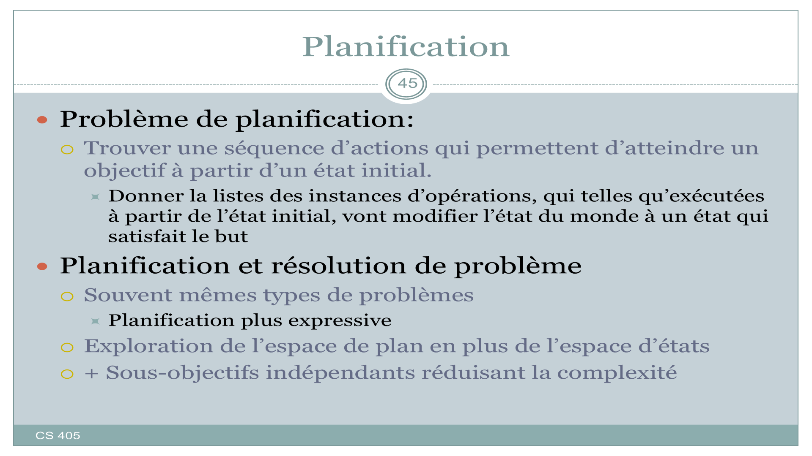

# Planification

## Probleme de planification

- Trouver une sequence d'actions qui permettent d'atteindre un objectif a partir d'un etat initial
- Donner la liste des instances d'operations, qui, executees a partir de l'etat initial, vont modifier l'etat du monde a un etat qui satisfait le but

## Planification et resolution de probleme

- Souvent memes types de problemes
- Planification plus expressive
- Exploration de l'espace de plan en plus de l'espace d'etats
- Sous-objectifs independants reduisent la complexite

---
layout: default
---

# Definition d'un domaine de planification

<div style="max-width: 58%;">

## Planning Domain Definition Language (PDDL)

- Similaire a la logique du premier ordre (FOL)
- Etat: At(Truck1, Melbourne) ET At(Truck2, Sydney)
- Chaque etat est appele un fluent
- Semantique de DB (ce qui n'est pas explicite est presume faux)
- Les enonces sont fermes, sans fonction

## Schema d'action

- Noms: ex: Go
- Liste de variables (here, there)
- Preconditions: At(here), Path(here, there)
- Effets: At(there), NON At(here)

## Application d'une action

- Les preconditions doivent etre satisfaites
- S' = (S - Del(a)) ∪ Add(a)
- Add(a): Litteraux positifs dans les effets
- Del(a): Litteraux negatifs dans les effets

</div>


---
layout: default
---

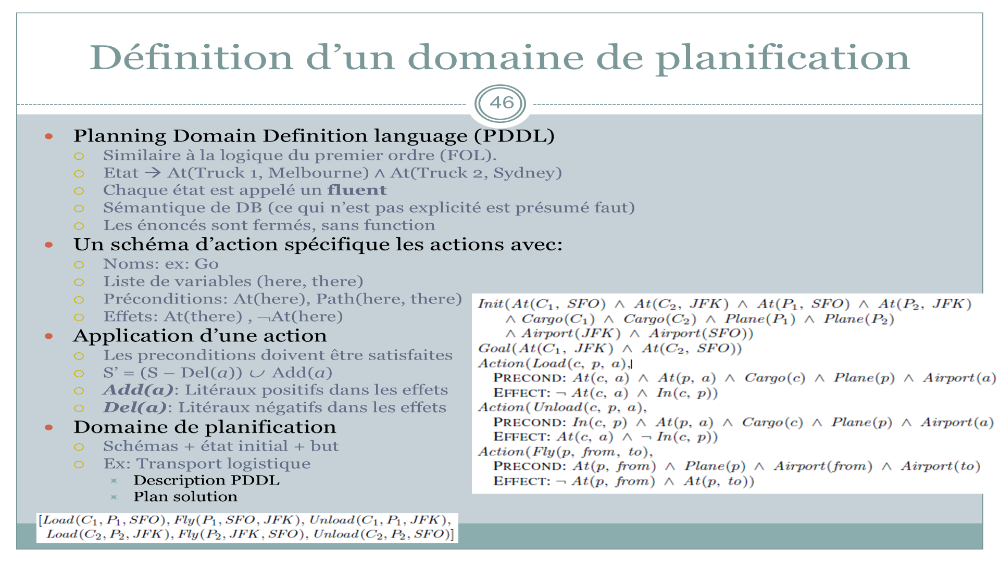

# Exemple PDDL: Transport logistique

```
Init(At(C1, SFO) ET At(C2, JFK) ET At(P1, SFO) ET At(P2, JFK)
    ET Cargo(C1) ET Cargo(C2) ET Plane(P1) ET Plane(P2)
    ET Airport(JFK) ET Airport(SFO))
Goal(At(C1, JFK) ET At(C2, SFO))

Action(Load(c, p, a))
  PRECOND: At(c, a) ET At(p, a) ET Cargo(c) ET Plane(p) ET Airport(a)
  EFFECT: NON At(c, a) ET In(c, p))

Action(Unload(c, p, a))
  PRECOND: In(c, p) ET At(p, a) ET Cargo(c) ET Plane(p) ET Airport(a)
  EFFECT: At(c, a) ET NON In(c, p))

Action(Fly(p, from, to),
  PRECOND: At(p, from) ET Plane(p) ET Airport(from) ET Airport(to)
  EFFECT: NON At(p, from) ET At(p, to))
```

---
layout: default
---

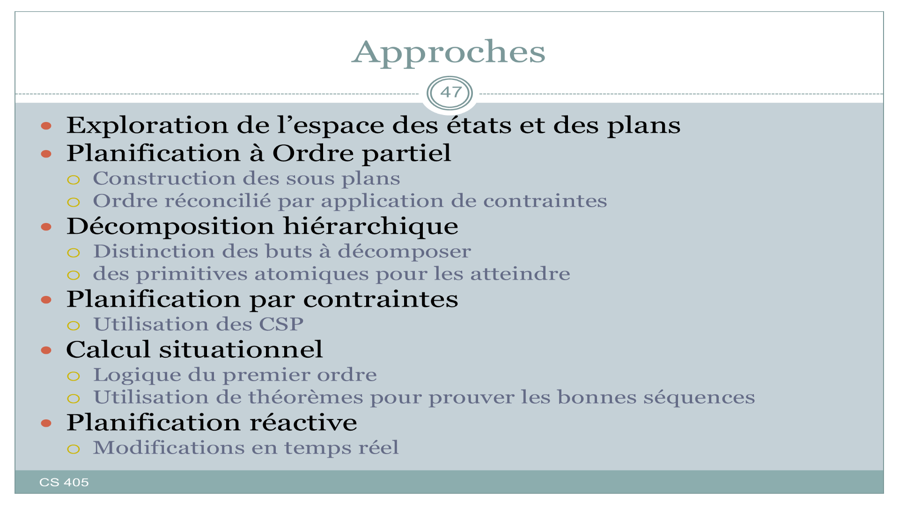

# Approches de planification

## Exploration de l'espace des etats et des plans

- STRIPS, chainage avant, etc.

## Planification a ordre partiel

- Construction des sous-plans
- Ordre reconcilie par application de contraintes

## Decomposition hierarchique

- Distinction des buts a decomposer
- Primitives atomiques pour les atteindre

## Planification par contraintes

- Utilisation des CSP

## Calcul situationnel

- Logique du premier ordre
- Utilisation de theoremes pour prouver les bonnes sequences

---
layout: default
---

# Exploration de l'espace des etats

<div style="max-width: 58%;">

## Complexite de la planification classique

- PlanSAT: Y-a-t-il un plan? -> PSPACE > NP
- PlanSAT "borne": Y-a-t-il un plan de longueur <k? -> PSPACE
- Pour de nombreux domaines (e.g. logistique):
  - PlanSAT borne NP-Complet (optimalite difficile)
  - PlanSAT dans P (suboptimalite plus facile)

## Algorithmes

- Planificateur progressif (avant)
- Planificateur regressif (arriere)
  - Recherche des etats pertinents
- Explorations bidirectionnelles

</div>


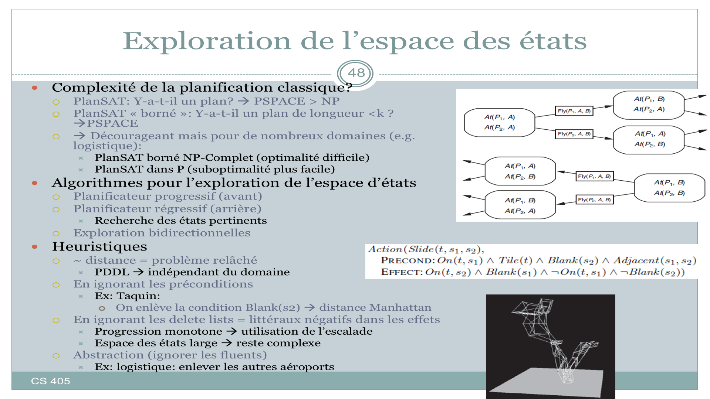

---
layout: default
---

# Heuristiques pour la planification

## Probleme relache

- Ignorer les preconditions
- Ignorer les delete lists

## Abstraction

- Ignorer les fluents non pertinents

## Decomposition

- Diviser le probleme en sous-problemes independants

## Landmarks

- Faits qui doivent etre vrais a un moment donne

---
layout: default
---

# Graphes de planification

<div style="max-width: 58%;">

## Structure de donnees

- Generee a partir d'un probleme de planification
- Divisee en niveaux:
  - Niveaux d'etats Si: Les fluents peuvent etre vrais au niveau i
  - Niveaux d'actions Ai: Les actions applicables a l'etape i

## Construction

- Ai = actions avec preconditions satisfaites par Si
- Si = fluents rendus vrais par effets des actions Ai-1
- + NO-OP passe les fluents vrais de Si a Si+1

## Liens

- Fluents -> Preconditions
- Effets -> Fluents
- Mutexes: actions incompatibles, fluents incompatibles

</div>


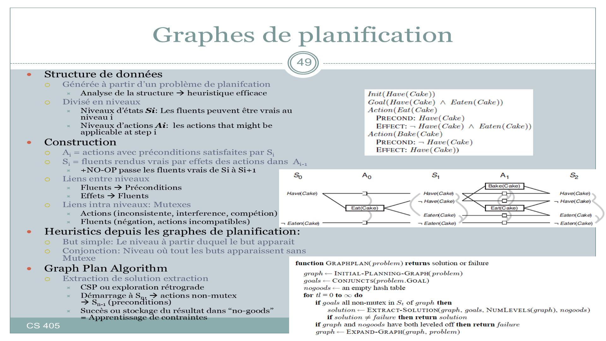

---
layout: default
---

# Algorithme GraphPlan

<div style="max-width: 55%;">

```
fonction GRAPHPLAN(probleme) retourne solution ou echec
  graph <- INITIAL-PLANNING-GRAPH(probleme)
  goals <- CONJUNCTS(probleme.Goal)
  nogoods <- table de hachage vide
  pour t = 0 a l'infini faire
    si goals tous non-mutex dans St de graph alors
      solution <- EXTRACT-SOLUTION(graph, goals, NUMLEVELS(graph), nogoods)
      si solution != echec alors retourner solution
    si graph et nogoods ont tous les deux level-off alors retourner echec
    graph <- EXPAND-GRAPH(graph, probleme)
```

</div>


---
layout: default
---

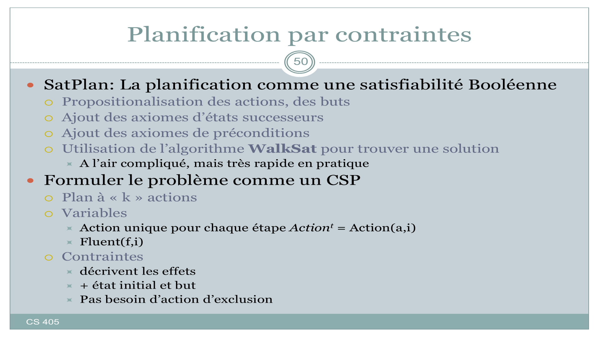

# Planification par contraintes

## SatPlan

- La planification comme une satisfiabilite Booleenne
- Propositionalisation des actions, des buts
- Ajout des axiomes d'etats successeurs
- Ajout des axiomes de preconditions
- Utilisation de l'algorithme WalkSat

## Formulation comme CSP

- Plan a "k" actions
- Variables: Action unique pour chaque etape, Fluent
- Contraintes: decrivent les effets + etat initial et but

---
layout: default
---

# Calcul situationnel


<style scoped>
.slidev-layout { font-size: 0.85em; }
h2 { margin-top: 0.3em !important; margin-bottom: 0.1em !important; }
</style>

<div style="max-width:58%;">

## Limitations de PDDL

- Pas de quantificateur (deplacer "tout le chargement" etc.)
- Logique propositionnelle: le temps est lie aux fluents

## Alternative: utiliser la FOL avec branches de situations

- Raisonner a propos du changement a travers ces branches
- Utilisation de theoremes pour prouver qu'un plan fonctionne

## Etat initial

- Phrase logique a propos de la situation S0
- At(Home, S0) ET NON Have(Milk, S0) ET NON Have(Bananas, S0) ET NON Have(Drill, S0)

## Etat but

- (∃s) At(Home, s) ET Have(Milk, s) ET Have(Bananas, s) ET Have(Drill, s)

</div>

---
layout: default
---

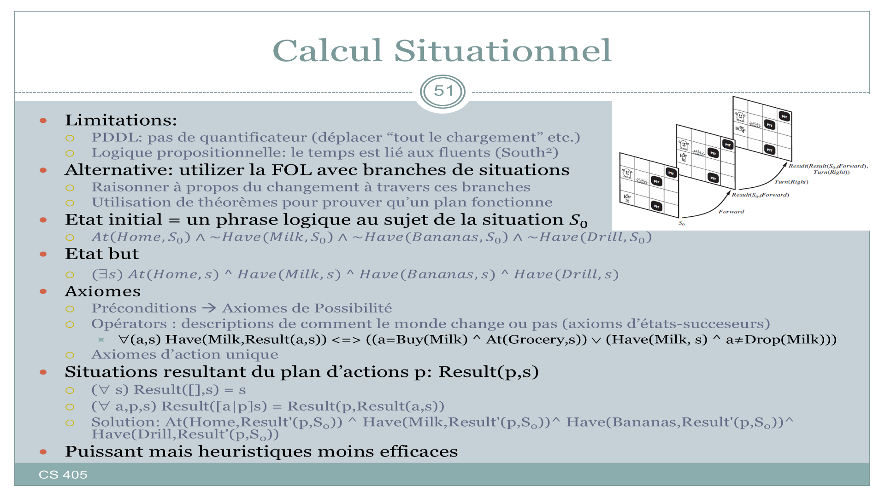

# Axiomes du calcul situationnel

## Preconditions -> Axiomes de Possibilite

## Operateurs: descriptions de comment le monde change

- ∀(a,s) Have(Milk, Result(a,s)) <=> ((a=Buy(Milk) ET At(Grocery,s)) OU (Have(Milk, s) ET a≠Drop(Milk)))

## Axiomes d'action unique

## Situations resultant du plan d'actions p

- Result(p, S0)
- (∀s) Result([], s) = s
- (∀a,p,s) Result([a|p], s) = Result(p, Result(a, s))

## Solution

- At(Home, Result'(p, S0)) ET Have(Milk, Result'(p, S0)) ET Have(Bananas, Result'(p, S0)) ET Have(Drill, Result'(p, S0))

---
layout: default
---

# Planification a ordre partiel


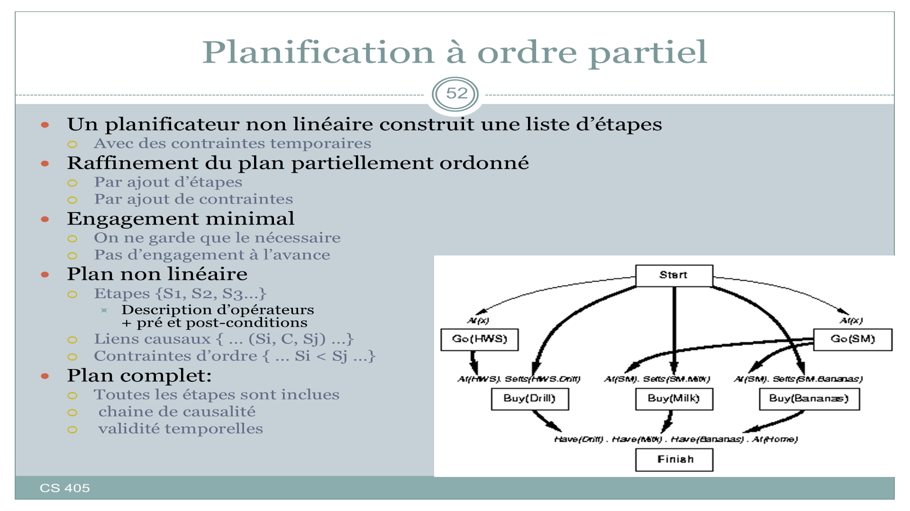

<style scoped>
.slidev-layout { font-size: 0.88em; }
h2 { margin-top: 0.3em !important; margin-bottom: 0.1em !important; }
</style>

<div style="max-width:60%;">

## Planificateur non lineaire

- Construit une liste d'etapes avec des contraintes temporelles

## Raffinement du plan partiellement ordonne

- Par ajout d'etapes
- Par ajout de contraintes

## Engagement minimal

- On ne garde que le necessaire
- Pas d'engagement a l'avance

## Plan non lineaire

- Etapes &#123;S1, S2, S3...&#125;
  - Description d'operateurs + pre et post-conditions
- Liens causaux &#123;... (Si, C, Sj) ...&#125;
- Contraintes d'ordre &#123;... Si &lt; Sj ...&#125;

## Plan complet

- Toutes les etapes sont incluses
- Chaine de causalite
- Validite temporelle

</div>

---
layout: default
---

# Decomposition hierarchique


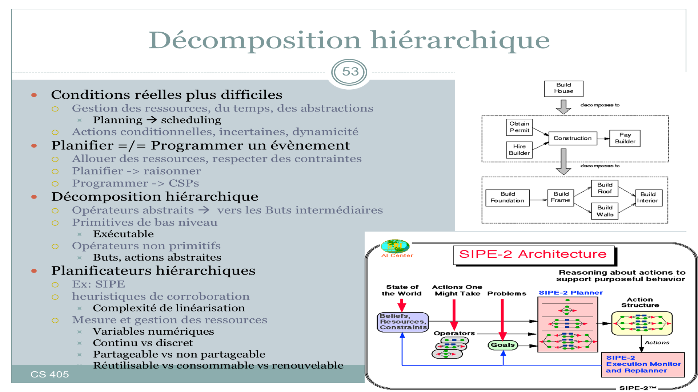

<style scoped>
.slidev-layout { font-size: 0.88em; }
h2 { margin-top: 0.3em !important; margin-bottom: 0.1em !important; }
</style>

<div style="max-width:60%;">

## Conditions reelles plus difficiles

- Gestion des ressources, du temps, des abstractions
- Planning -> scheduling
- Actions conditionnelles, incertaines, dynamiques

## Planifier =/= Programmer un evenement

- Allouer des ressources, respecter des contraintes
- Planifier -> raisonnement
- Programmer -> CSPs

## Decomposition hierarchique

- Operateurs abstraits -> vers les Buts intermediaires
- Primitives de bas niveau: Executable
- Operateurs non primitifs: Buts, actions abstraites

</div>

---
layout: default
---

# Resume planification

## Approches

- Recherche dans l'espace d'etats (STRIPS, chainage avant, etc.)
- Dans l'espace des plans (planification partiellement ordonnees, HTN, etc.)
- Base sur les contraintes (GraphPlan, SATPlan etc.)
- Calcul situationnel
- Planification hierarchique

## Strategies d'exploration

- Planification progressive
- Regression des buts
- Planification retrograde
- Moindre engagement
- Planification non lineaire

---
layout: section
---

# Representation de Connaissances
---
layout: default
---

# Ontologies


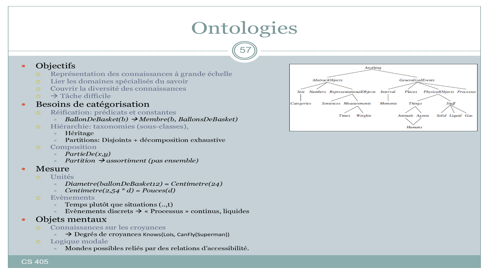

<style scoped>
.slidev-layout { font-size: 0.88em; }
h2 { margin-top: 0.3em !important; margin-bottom: 0.1em !important; }
</style>

<div style="max-width:65%;">

## Objectifs

- Representation des connaissances a grande echelle
- Lier les domaines specialises du savoir
- Couvrir la diversite des connaissances

## Besoins de categorisation

- Reification: predicats et constantes
  - BallonDeBasket(b) -> Membre(b, BallonsDeBasket)
- Hierarchie: taxonomies (sous-classes), heritage
- Partitions: Disjoints + decomposition exhaustive
- Composition: PartieDe(x,y)
- Mesure: Unites (Centimetre, Pouces)

## Objets mentaux

- Connaissances sur les croyances
- Logique modale: mondes possibles

</div>

---
layout: default
---

# Web semantique

<div style="max-width: 58%;">

## Resource Description Framework (RDF)

- Communaute KR: AAAI, W3C, Berners-Lee
- RDF: triplets (faits), classes / sous-classes
- Triplet (sujet, predicat, objet)

## RDFS et OWL

- Classes definies
- Contraintes

## SPARQL

- Requetes sur "Triple Stores"

## Linked Data

- SOA (Service Oriented Architecture)
- Donnees connectees sur le web

</div>


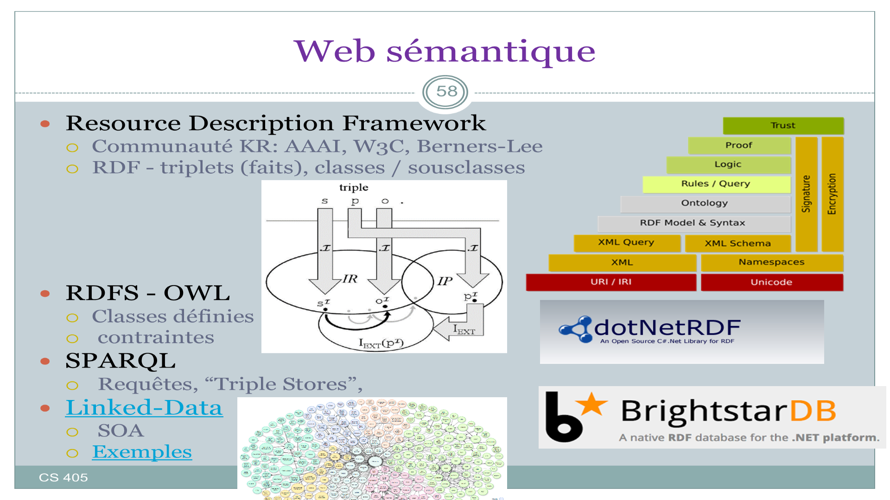

---
layout: default
---

# Systemes de raisonnement

<div style="max-width: 58%;">

## Reseaux semantiques

- Proche des formalismes UML/Merise
- Infrence par navigation, heritage, reification
- Valeurs par defaut et heritage

## Logiques de descriptions

- Notations elaborees pour FOL
- Subsomption (sous-ensemble), classification, coherence
- And, All, AtLeast, AtMost, Fills, SameAs, OneOf...

## Logiques non monotones

- Monde clos: proposition pas mentionnee fausse par defaut
- Nouveaux faits peuvent invalider etat de croyance
- Circonscription, logique par defaut

</div>


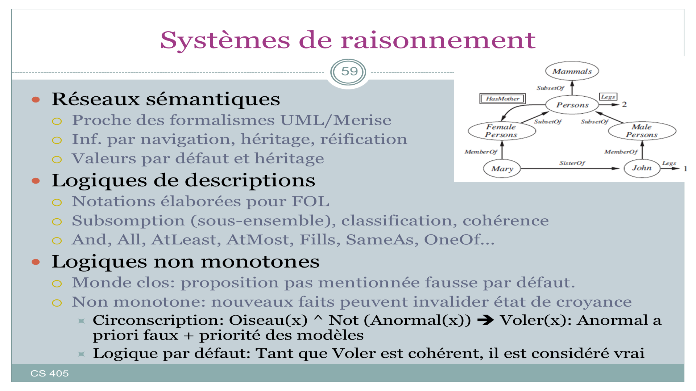

---
layout: default
---

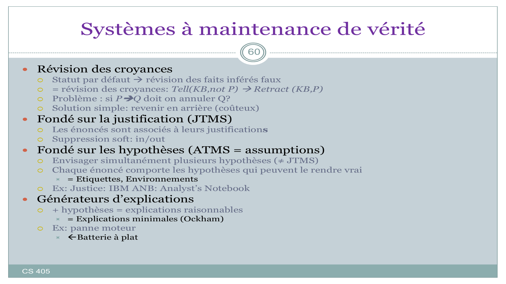

# Systemes a maintenance de verite

<style scoped>
.slidev-layout { font-size: 0.88em; }
h2 { margin-top: 0.3em !important; margin-bottom: 0.1em !important; }
</style>

## Revision des croyances

- Statut par defaut -> revision des faits infenes faux
- Tell(KB, not P) -> Retract(KB, P)
- Probleme: si P->Q doit-on annuler Q?

## Fondes sur la justification (JTMS)

- Les enonces sont associes a leurs justifications
- Suppression soft: in/out

## Fondes sur les hypotheses (ATMS)

- Envisager simultanement plusieurs hypotheses
- Chaque enonce comporte les hypotheses qui peuvent le rendre vrai

## Generateurs d'explications

- Hypotheses = explications raisonnables
- Explications minimales (Ockham)

---
layout: default
---

# Smart Contracts

<div style="max-width: 58%;">

## Cryptographie

- Signature, chiffrement (symetrique, asymetrique)

## Blockchain

- POW, POS

## Non divulgation de connaissance

- Preuves interactives (ex: la porte cachee)
- Preuves non interactives
- Chiffrement Homomorphe : C(A+B) = C(A)+C(B)
- Ex: Helios voting

## Contrats a clauses complexes

- Signatures composites (courtier, depots/agents fiduciaires)
- Clauses scriptees (ex: EtherCoin Hack)

</div>


---
layout: default
---

# Resume representation des connaissances

## Ontologies

- Meta-modeles de donnees

## Web semantique

- Representation de faits
- Pile semantique du W3C

## Systemes de raisonnement

- Maintenance de la verite

## Smart Contracts

- Signatures, chiffrement et Preuves
- Divulgation partielle et contractualisee

---
layout: section
---

# TP — 24 notebooks (Tweety + Lean)

---

# Pourquoi l'IA symbolique en 2026 ?

**Renaissance de l'IA symbolique** : alors que les LLM dominent l'IA generative, l'IA symbolique reste **indispensable** pour :

- **Verification formelle** : preuves de correction (preuves Lean, SAT/SMT)
- **Garantie de comportement** : reseaux de neurones verifies (TorchLean)
- **Raisonnement explicable** : argumentation structuree (ASPIC+, ABA)
- **Theoremes mathematiques** : AlphaProof (DeepMind 2024), APOLLO (2025)
- **Decisions multi-agents** : votes, dialogues argumentatifs

**Convergence neural + symbolic** :
- LeanCopilot, AlphaProof : LLM **+** Lean prover
- LeanDojo (NeurIPS 2023) : RAG sur Mathlib
- APOLLO : 99.5% miniF2F

---

# Cartographie des 24 notebooks

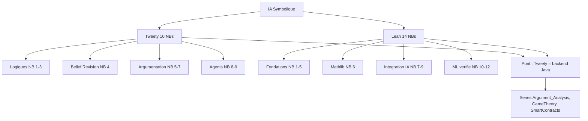
```mermaid
graph TB
    A[IA Symbolique] --> B[Tweety 10 NBs]
    A --> C[Lean 14 NBs]

    B --> B1[Logiques NB 1-3]
    B --> B2[Belief Revision NB 4]
    B --> B3[Argumentation NB 5-7]
    B --> B4[Agents NB 8-9]

    C --> C1[Fondations NB 1-5]
    C --> C2[Mathlib NB 6]
    C --> C3[Integration IA NB 7-9]
    C --> C4[ML verifie NB 10-12]

    B --> D[Pont : Tweety = backend Java]
    C --> D
    D --> E[Series Argument_Analysis, GameTheory, SmartContracts]
```

**Total** : ~18 heures de contenu interactif (7h Tweety + 11h Lean).

---

# Plan de la partie pratique

| Partie | Duree | Contenu |
|--------|-------|---------|
| **I. TweetyProject** | 30 min | 10 notebooks Java/Python — argumentation et logiques |
| **II. Lean 4** | 40 min | 14 notebooks — verification formelle et integration IA |
| **III. Convergence** | 15 min | LLM + provers, ponts inter-series |
| **IV. Pratique** | 15 min | Quick start, parcours suggere, projets integrateurs |

**Approche** : passer de l'abstraction (logiques formelles) au concret (verification de reseaux de neurones, theoremes mathematiques).

---
layout: section
---

# I. TweetyProject (30 min)

---

# Qu'est-ce que TweetyProject ?

**TweetyProject** : bibliotheque Java open-source pour l'IA symbolique.

- **35 modules** couvrant logiques formelles et argumentation computationnelle
- Developpe a l'Universite de Hagen (Matthias Thimm et al.)
- Reference : [tweetyproject.org](https://tweetyproject.org/)

**Integration Python** via **JPype** :

```python
import jpype
jpype.startJVM(classpath=["libs/*"])
PlBeliefSet = jpype.JClass("org.tweetyproject.logics.pl.syntax.PlBeliefSet")
```

JDK 17 + 35 JARs telecharges automatiquement par le notebook de setup. Aucune installation systeme requise.

---

# Tweety — cartographie des notebooks

| # | Notebook | Theme | Duree |
|---|----------|-------|-------|
| 1 | Setup | JVM, JARs, outils externes | 20 min |
| 2 | Basic-Logics | Propositionnelle, FOL | 45 min |
| 3 | Advanced-Logics | DL, Modale, QBF, Conditionnelle | 40 min |
| 4 | Belief-Revision | MUS, MaxSAT, incoherence | 50 min |
| 5 | Abstract-Argumentation | Dung AF, semantiques, CF2 | 55 min |
| 6 | Structured-Argumentation | ASPIC+, DeLP, ABA, ASP | 60 min |
| 7a | Extended-Frameworks | ADF, Bipolar, WAF, SAF | 50 min |
| 7b | Ranking-Probabilistic | Ranking, probabiliste | 40 min |
| 8 | Agent-Dialogues | Dialogues, loteries | 35 min |
| 9 | Preferences | Vote, agregation | 30 min |

---

# Notebooks 2-3 — Logiques formelles

**Logique Propositionnelle (`logics.pl`)** :

```python
parser = PlParser()
kb = parser.parseBeliefBase("a && b\n!a || c")
reasoner = SatReasoner()
result = reasoner.query(kb, parser.parseFormula("c"))
```

**Logiques avancees** :

| Logique | Module | Solveur |
|---------|--------|---------|
| **DL** (Description) | `logics.dl` | HermiT, Pellet |
| **Modale** (ML) | `logics.ml` | SPASS-XDB |
| **QBF** | `logics.qbf` | DepQBF, CAQE |
| **FOL** | `logics.fol` | EProver |
| **Conditionnelle** | `logics.cl` | ranking-based |

---

# Notebook 4 — Revision AGM et MUS

**Postulats AGM** (Alchourron-Gardenfors-Makinson, 1985) :

| Operation | Notation | Effet |
|-----------|----------|-------|
| Expansion | K + α | Ajoute α sans verification |
| Contraction | K - α | Retire α et ses consequences |
| Revision | K * α | Integre α en maintenant la coherence |

**Diagnostic d'incoherence** :
- **MUS** : Minimal Unsatisfiable Subsets
- **MCS** : Minimal Correction Subsets
- **Dualite** : `MUS = hitting set minimal de MCS`

**Mesures** : `MI`, `eta`, `Contention`, `MUS-count`. Outils : MARCO (Z3), MaxSAT (PySAT).

---

# Notebook 5 — Frameworks de Dung

**Definition** : `AF = (A, R)` graphe oriente arguments + relation d'attaque.

**Semantiques** :

| Semantique | Definition |
|------------|------------|
| **Conflict-free** | Aucun argument n'attaque un autre dans le set |
| **Admissible** | Conflict-free + defend ses membres |
| **Complete** | Admissible + contient tous les arguments defendus |
| **Grounded** | Plus petite complete (skeptique) |
| **Preferred** | Maximale parmi les admissibles |
| **Stable** | Conflict-free + attaque tout le reste |
| **Semi-stable** | Preferred maximisant le range |
| **CF2** | Recursif sur SCC |

Reference : Dung, *"On the Acceptability of Arguments"*, AIJ 1995.

---

# Notebook 6 — Argumentation structuree

**ASPIC+** (Modgil & Prakken, 2014) : arguments comme arbres de derivation.

```python
theory = AspicArgumentationTheory(parser)
theory.addAxiom(formula)
theory.addRule(rule_d, premises, conclusion)
af = theory.asDungTheory()
```

**Frameworks complementaires** :
- **DeLP** (Garcia & Simari) : Defeasible Logic Programming
- **ABA** (Bondarenko et al.) : Assumption-Based Argumentation
- **ASP** via **Clingo** : metaprogrammation argumentation

```
% ASP : reachability
reach(X, X) :- node(X).
reach(X, Y) :- reach(X, Z), edge(Z, Y).
```

---

# Notebooks 7a-7b — Frameworks etendus

**Frameworks generalises** :

| Framework | Extension |
|-----------|-----------|
| **ADF** | Acceptance conditions arbitraires |
| **Bipolar** | Attack + Support |
| **Weighted (WAF)** | Poids sur les attaques |
| **SetAF** | Attaques collectives (sets → arg) |
| **Extended** | Attaques recursives |

**Ranking et probabilistic** (7b) :
- Ranking semantics : Categoriser, Burden, Discussion, h-Categorizer
- Probabilistic : constellation approach, epistemic approach

---

# Notebooks 8-9 — Agents et preferences

**Dialogues argumentatifs** (Walton & Krabbe, 1995) :
- **Persuasion** : convaincre
- **Negotiation** : trouver un accord
- **Information-seeking** : obtenir une donnee
- **Inquiry** : decouvrir la verite
- **Deliberation** : decider d'une action

**Theorie sociale du choix** :
- Theoreme d'Arrow (1951) : impossibilite
- Regles : Plurality, Borda, Condorcet, Copeland, STV
- Lien serie GameTheory : port Lean d'Arrow dans `social_choice_lean/`

---
layout: section
---

# II. Lean 4 (40 min)

---

# Qu'est-ce que Lean 4 ?

**Lean 4** : assistant de preuves et langage de programmation fonctionnel base sur la **theorie des types dependants**.

- Successeur de Lean 3, reecriture complete (2021)
- Auteur principal : Leonardo de Moura (Microsoft Research, AWS)
- Compile vers C, performance native
- Ecosysteme : **Mathlib4** (~1M+ lignes de math formelle)

**Pourquoi Lean 4 maintenant ?**
- 2023-2024 : Polynomial Freiman-Ruzsa, Liquid Tensor Experiment
- 2024-2025 : integration LLM (AlphaProof, LeanCopilot, LeanDojo)
- 2025-2026 : agents autonomes (APOLLO, Erdos problems)

Reference : de Moura & Ullrich, *"The Lean 4 Theorem Prover and Programming Language"* (CADE 2021).

---

# Lean — cartographie des notebooks

| # | Notebook | Theme | Duree |
|---|----------|-------|-------|
| 1 | Setup | elan, kernel Jupyter | 15 min |
| 2 | Dependent-Types | Calcul des Constructions | 35 min |
| 3 | Propositions-Proofs | Prop, Curry-Howard | 45 min |
| 4 | Quantifiers | forall, exists, egalite | 40 min |
| 5 | Tactics | apply/exact/intro/rw/simp | 50 min |
| 6 | Mathlib-Essentials | ring/linarith/omega | 45 min |
| 7 | LLM-Integration | LeanCopilot, AlphaProof | 50 min |
| 7b | Examples | Benchmarks miniF2F, proofnet | 40 min |
| 8 | Agentic-Proving | APOLLO, Erdos | 55 min |
| 9 | SK-Multi-Agents | Agent Framework | 45 min |
| 10 | LeanDojo | Tracing, Dojo interactif | 45 min |
| 11/11a | TorchLean | NN verifies, IBP, CROWN | 1h30-2h |
| 12 | Sensitivity-Theorem | Huang 2019, port Lean | 60 min |

---

# Modes d'execution suggeres

| Mode | Notebooks | Temps |
|------|-----------|-------|
| **Fondations** | 1-5 | ~3h |
| **Avec Mathlib** | 1-6 | ~3h45 |
| **Integration IA** | 1-7, 7b | ~5h |
| **Complet** | 1-12 | ~11h |

**Architecture pedagogique** :
- Notebooks **1-5** : bases sur PDF de reference (Avigad, *Theorem Proving in Lean 4*)
- Notebooks **6-12** : etat de l'art 2024-2026

---

# Notebooks 1-5 — Fondations

**Curry-Howard** : `Propositions ≅ Types`, `Preuves ≅ Programmes`.

```lean
-- And introduction
theorem and_comm (p q : Prop) : p ∧ q → q ∧ p :=
  fun ⟨hp, hq⟩ => ⟨hq, hp⟩

-- Universal
theorem forall_and (p q : α → Prop) :
    (∀ x, p x ∧ q x) ↔ (∀ x, p x) ∧ (∀ x, q x) :=
  ⟨fun h => ⟨fun x => (h x).1, fun x => (h x).2⟩,
   fun ⟨hp, hq⟩ x => ⟨hp x, hq x⟩⟩

-- Induction tactique
theorem zero_add (n : Nat) : 0 + n = n := by
  induction n with
  | zero => rfl
  | succ k ih => simp [Nat.add_succ, ih]
```

---

# Tactiques essentielles

| Tactique | Usage |
|----------|-------|
| `intro` | Introduit une hypothese |
| `exact` | Fournit un terme exact |
| `apply` | Applique un lemme (back-chaining) |
| `rw` | Reecrit avec une egalite |
| `simp` | Simplifie avec lemmes marques `@[simp]` |
| `omega` | Arithmetique lineaire Nat/Int |
| `linarith` | Ordres lineaires reels |
| `ring` | Anneaux commutatifs |
| `decide` | Decide une proposition decidable |

```lean
example (a b : Nat) (h : a = b) : a + 1 = b + 1 := by
  rw [h]
```

---

# Notebook 6 — Mathlib4

**Mathlib4** : ~1M+ lignes, ~150,000 theoremes.

```lean
import Mathlib

-- ring
example (a b : ℝ) : (a + b)^2 = a^2 + 2*a*b + b^2 := by ring

-- linarith
example (x y : ℝ) (h1 : x ≤ y) (h2 : y ≤ 5) : x ≤ 5 := by linarith

-- omega
example (n : Nat) : n + 0 = n ∧ n * 1 = n := by omega

-- polyrith (SMT-based)
example (a b : ℝ) : a^2 - b^2 = (a-b)*(a+b) := by polyrith
```

**Recherche** : **Loogle** (syntaxique), **Moogle** (semantique).

---

# Notebooks 7-9 — Integration IA

**LeanCopilot** : LLM in-editor.

```lean
import LeanCopilot

example (a b : Nat) : a + b = b + a := by
  suggest_tactics  -- LLM propose: exact Nat.add_comm a b
```

**AlphaProof** (DeepMind, 2024) : IMO 2024 silver-medal equivalent.

**APOLLO** (Yang et al., 2025) :
- Agent autonome multi-agents : Director / Tactician / Verifier / Critic
- 99.5% sur miniF2F (vs 85% AlphaProof)
- Problemes Erdos en cours de formalisation

**Microsoft Agent Framework** (Notebook 9) : orchestration sequentielle, concurrente, group chat, handoff.

---

# Notebooks 10-12 — ML verifie

**LeanDojo** (Yang et al., NeurIPS 2023) :

```python
from lean_dojo import LeanGitRepo, trace, Dojo

repo = LeanGitRepo("https://github.com/leanprover/mathlib4", "v4.x")
traced = trace(repo)

with Dojo(theorem) as dojo:
    state = dojo.init_state
    new_state, result = dojo.run_tac(state, "intro h")
```

**TorchLean** — verification de NN :

| Methode | Complexite | Precision |
|---------|------------|-----------|
| **IBP** (Interval Bound Propagation) | O(n) | Faible |
| **CROWN** (Linear Relaxation) | O(n^2) | Moyenne |
| **LiRPA** (per Activation) | O(n^2) | Eleve |
| **MILP** (exact) | NP-hard | Exact |

---

# Notebook 12 — Theoreme de sensibilite

**Huang (2019)** : reponse au probleme de sensibilite (ouvert depuis 1988).

> Pour toute fonction booleenne `f : {0,1}^n → {0,1}`, sensibilite `s(f)` et degre `deg(f)` sont polynomialement equivalents : `deg(f) ≤ s(f)^4`.

**Outils** :
- Hypercube `{0,1}^n`
- Signing matrix `A_n` (recursive, eigenvalues ±√n)
- Cauchy interlacing

**Port Lean 4** (en cours) :

```lean
-- sensitivity_lean/Sensitivity.lean
theorem sensitivity_theorem (n : ℕ) (f : (Fin n → Bool) → Bool) :
    deg f ≤ (s f) ^ 4 := by
  sorry  -- port Lean en cours
```

Reference : Huang, *Induced subgraphs of hypercubes and a proof of the Sensitivity Conjecture* (Ann. of Math., 2019).

---
layout: section
---

# III. Convergence neural + symbolic (15 min)

---

# Percees recentes (2024-2026)

| Annee | Systeme | Accomplissement |
|-------|---------|------------------|
| 2023 | **LeanDojo** | RAG ReProver, NeurIPS 2023 |
| 2024 | **AlphaProof** | IMO 2024 silver-medal |
| 2025 | **APOLLO** | 99.5% miniF2F |
| 2025 | **Erdos problems** | Projet de formalisation collective |
| 2025 | **TweetyProject 1.29** | arg.eaf (Epistemic AF) |
| 2025 | **MetaMath-Lean** | Cross-formalization |
| 2026 | **AlphaProof v2** | Gold-medal predicte |

**Mathematiques formelles 2025** :
- Polynomial Freiman-Ruzsa (Tao, Gowers et al., 2023)
- Liquid Tensor Experiment (Scholze, 2022)
- Sphere Packing 8D (Viazovska, en cours)

---

# Convergence : argumentation + theorem proving

**Tweety** (raisonnement argumentatif Java) :
- Logiques **PL, FOL, DL, Modale, QBF, CL**
- Frameworks **Dung, ASPIC+, ABA, ADF**
- Solveurs **Sat4j, MiniSAT, Lingeling**

**Lean 4** (verification formelle) :
- Tactiques **omega, linarith, ring, polyrith**
- **Mathlib4** (~150k theoremes)
- LLM in-editor : **LeanCopilot, AlphaProof**

**Convergence pratique** :
- Tweety encode des semantiques de Dung en ASP (Clingo)
- Lean **prouve** la correction des algorithmes argumentatifs
- LLMs (GPT-4o, Claude Opus) generent **+** verifient via les deux

---

# Ponts inter-series

| Serie | Connection avec Tweety + Lean |
|-------|--------------------------------|
| **Argument_Analysis** | Tweety = backend Java pour l'analyse de textes argumentatifs |
| **GameTheory** | Notebook 9 Tweety (vote) + `social_choice_lean/` (Arrow, Sen) |
| **SmartContracts** | Verification Solidity (Certora, SMTChecker) — meme stack SAT/SMT |
| **ML** | TorchLean (Lean 11/11a) : verification de NN entraines |
| **Search** | CSP : preuves de correction via Lean |
| **Planners** | Dialogues argumentatifs (Tweety 8) ↔ planification PDDL |

**Slides connexes** :
- S1 — Argumentation (Argumentum card game)
- S2 — IA exploratoire symbolique (contexte historique)
- S3 — Acculturation IA

---
layout: section
---

# IV. Pratique (15 min)

---

# Quick start — Tweety

```bash
# 1. Installer les packages Python
pip install jpype1 requests tqdm clingo z3-solver python-sat

# 2. Ouvrir le notebook de setup (auto-telecharge JDK + JARs)
cd MyIA.AI.Notebooks/SymbolicAI/Tweety
jupyter notebook Tweety-1-Setup.ipynb

# 3. Executer toutes les cellules, puis passer a Tweety-2
```

JDK 17 et 35 JARs telecharges automatiquement. Aucune installation systeme requise.

**Validation rapide** :

```bash
cd scripts
python verify_all_tweety.py --quick
python verify_all_tweety.py --check-env
```

---

# Quick start — Lean 4

```bash
# 1. elan + Lean 4
curl https://raw.githubusercontent.com/leanprover/elan/master/elan-init.sh -sSf | sh
elan default leanprover/lean4:stable

# 2. WSL (Windows) : conda + lean4_jupyter
wsl -d Ubuntu
conda create -n lean4-jupyter python=3.10
conda activate lean4-jupyter
pip install lean4_jupyter

# 3. Lancer le notebook 1
jupyter notebook MyIA.AI.Notebooks/SymbolicAI/Lean/Lean-1-Setup.ipynb
```

**Pour les notebooks LLM** (7-10) : configurer `.env` avec `OPENAI_API_KEY` ou `ANTHROPIC_API_KEY`.

**WSL obligatoire sous Windows** (cf [.claude/rules/wsl-kernels.md](../../.claude/rules/wsl-kernels.md)).

---

# Parcours suggere

**Decouverte (5h)** :
- Tweety 1 + 2 + 5 (logiques + Dung)
- Lean 1 + 2 + 3 + 5 (types + tactiques)

**Approfondissement (10h)** :
- Tweety 3 + 4 + 6 (logiques avancees + revision + ASPIC+)
- Lean 4 + 6 + 7 (quantificateurs + Mathlib + LLM)

**Specialisation IA (8h)** :
- Lean 8 + 9 + 10 (APOLLO + Multi-Agents + LeanDojo)
- Tweety 7a + 7b + 8 + 9 (extended + ranking + agents)

**Projet integrateur** :
- Choisir un theoreme classique (Cauchy-Schwarz, Borda paradox)
- Modeliser argumentativement (Tweety) **et** prouver formellement (Lean)
- Implementer un agent dialogique qui consulte Lean

---

# References academiques

**Tweety** :
- Dung (1995) — *Acceptability of Arguments*, AIJ
- Modgil & Prakken (2014) — ASPIC+
- AGM (1985) — *Logic of Theory Change*
- Brewka, Eiter & Truszczynski (2011) — ASP
- Besnard & Hunter (2008) — *Elements of Argumentation*
- Walton & Krabbe (1995) — typologie dialogues

**Lean** :
- de Moura & Ullrich (2021) — Lean 4 (CADE)
- Avigad (2024) — *Theorem Proving in Lean 4*
- Yang et al. (NeurIPS 2023) — LeanDojo
- First et al. (2024) — AlphaProof
- Song et al. (2025) — TorchLean IBP/CROWN/LiRPA
- Huang (2019) — Sensitivity theorem (Ann. of Math.)

---

# Outils et solveurs

**Tweety** :

| Outil | Usage | Telechargement |
|-------|-------|----------------|
| **Clingo** | ASP | Auto (Win/Linux) |
| **SPASS** | Modale | Auto Linux / inclus Windows |
| **EProver** | FOL | Inclus dans `ext_tools/` |
| **Z3** | SMT | `pip install z3-solver` |
| **PySAT** | SAT/MaxSAT | `pip install python-sat` |

**Lean** :

| Outil | Role |
|-------|------|
| **elan** | Gestionnaire de versions |
| **lake** | Build system |
| **mathlib4** | Bibliotheque mathematique |
| **LeanCopilot** | LLM in-editor |
| **LeanDojo** | RAG framework Python |
| **TorchLean** | NN verification |

---

# Ressources en ligne

**Tweety** :
- [tweetyproject.org](https://tweetyproject.org/)
- [API Doc](https://tweetyproject.org/api/)
- [GitHub](https://github.com/TweetyProjectTeam/TweetyProject)
- [JPype](https://jpype.readthedocs.io/)

**Lean** :
- [Theorem Proving in Lean 4](https://leanprover.github.io/theorem_proving_in_lean4/)
- [Mathlib4 Docs](https://leanprover-community.github.io/mathlib4_docs/)
- [Loogle](https://loogle.lean-lang.org/) — recherche syntaxique
- [Moogle](https://www.moogle.ai/) — recherche semantique
- [Lean Zulip](https://leanprover.zulipchat.com/)
- [Mathematics in Lean](https://leanprover-community.github.io/mathematics_in_lean/)

---
layout: two-cols
---

# Pour aller plus loin : Argumentum

- **~1500 sophismes** classifies en arbre interactif
- **7 familles** : Insuffisance, Influence, Erreur mathematique, Erreur de raisonnement, Abus de langage, Tricherie, Obstruction
- **Sur smartphone** : scanner le QR ->
- **Interactions** :
  - **Tap** sur un noeud -> carte (definition + exemple)
  - **Pinch** pour zoomer / dezoomer
  - Boutons **+ / - / Reset** disponibles
- **Source** : argumentum.games

::right::

<div style="display: flex; flex-direction: column; align-items: center; justify-content: center; height: 100%;">


<p style="font-family: monospace; font-size: 0.75em; margin-top: 0.5em;">argumentum.games/fallacies_fr.html</p>

</div>

---
layout: center
---

# Questions ?

---
layout: end
---

# Merci

Jean-Sylvain Boige
JSBOIGE@myia.ORG
