<!-- _class: title -->

# Incertitude et modèles probabilistes

Intelligence Artificielle - IV

**Quantification de l'incertitude, Raisonnement probabiliste, Prise de décision**

- Quantification de l'incertitude
- Raisonnement probabiliste
- Prise de décision

---

# Plan du cours

- Introduction
- Résolution de problèmes
- Bases de connaissances et logique
- **Incertitude et modèles probabilistes** ← *vous êtes ici*
- Théorie des jeux
- Apprentissage
- Traitement du langage naturel
- Présentation projets

---

# Sommaire

- **Quantification de l'incertitude**
  - Incertitude
  - Probabilités
  - Syntaxe et sémantique
  - Inférence
  - Indépendance et règle de Bayes
- **Raisonnement probabiliste**
  - Réseaux Bayésiens
  - Modèles de Markov Cachés (HMM)
  - Raisonnement probabiliste temporel
- **Théorie de la décision**
  - Prise de décision simple
  - Prise de décision complexe (MDP)

---

# Incertitude

- **At = partir pour l'aéroport t minutes avant le vol**
  - Est-ce que At me permettra d'avoir mon vol?
- **Problèmes**
  - Observabilité partielle (état de la route, plans des autres etc.)
  - Capteurs bruités (Bison Futé)
  - Incertitude sur les résultats des actions (pneu crevé, etc.)
  - Complexité de la modélisation et la prévision du trafic
- **Une approche purement logique**
  - Risque d'être incorrecte (A25 devrait suffire…)
  - Conduira à des conclusions trop faibles pour la prise de décision
  - A25 suffira s'il n'y a pas d'accident sur le pont et il ne pleut pas et mes pneus ne crèvent pas etc. = problème de la qualification logique
  - A1500 conduira raisonnablement au but, mais il me faudra dormir à l'aéroport

---

# Méthodes face à l'incertitude

- **Logique par défaut ou non monotone**
  - On suppose que ma voiture n'a pas de pneu crevé
  - On suppose que A25 fonctionne à moins d'une indication contradictoire
  - Problèmes:
    - Quelles sont les suppositions raisonnables?
    - Comment gérer la contradiction?
- **Règles avec facteurs vagues**
  - A25 |→0.3 devrait suffire
  - Arroseur |→ 0.99 Herbe Mouillée
  - Herbe Mouillée |→ 0.7 Pluie
  - Problèmes: combinaisons (e.g, l'arroseur cause la pluie?)
- **Probabilités**
  - Représente le degré de croyance de l'agent
  - Etant donné les observations disponibles, A25 devrait me permettre d'avoir mon avion avec la probabilité 0.04

---

# Probabilité

- **Les assertions probabilistes résument les effets de:**
  - La paresse: on n'énumère pas toutes les exceptions, qualifications etc.
  - L'ignorance théorique et pratique: Il nous manque des faits pertinents, les conditions initiales etc.
- **Probabilités subjectives**
  - Elles concernent les propositions de l'état de connaissance de l'agent
  - P(A25 | pas d'incident rapporté) = 0.06
  - Ce ne sont pas des assertions sur le monde
  - Les probabilités des propositions changent avec de nouvelles observations
  - P(A25 | pas d'incident rapporté, 05h00) = 0.15

---

# Prendre des décisions dans l'incertitude

- **Supposons que je crois:**
  - P(A25 j'arrive à temps | …) = 0.04
  - P(A90 j'arrive à temps | …) = 0.70
  - P(A120 j'arrive à temps | …) = 0.95
  - P(A1440 j'arrive à temps | …) = 0.9999
- **Quelles actions choisir?**
  - Dépend des préférences entre rater le vol et attendre
  - La théorie de l'utilité peut représenter et inférer les préférences
  - Théorie de la décision = probabilités + théorie de l'utilité

---

# Syntaxe

- **Elément de base: La variable aléatoire**
  - Des mondes possibles leur donnent des assignations (cf logique propositionnelle)
- **Domaines:**
  - Variables aléatoires Booléennes:
    - E.g. Carie (est-ce que j'ai une carie?)
  - Variables discrètes:
    - E.g. Le Temps est un parmi <ensoleillé, nuageux, pluvieux, neigeux>
    - Valeurs des domaines exhaustives et mutuellement exclusives
- **Propositions:**
  - Proposition élémentaire construites par assignation
    - E.g. Temps = ensoleillé, Carie = faux (¬Carie)
  - Proposition complexe formée par élémentaires + connecteurs logiques
    - E.g. Temps = ensoleillé ∧ Carie = faux
- **Evènement atomique: spécification complète de l'état incertain**
  - Ex pour 2 variables aléatoires: Carie = false ∧ MalDeDent = true
  - Mutuellement exclusifs et exhaustifs

---

# Axiomes des probabilités

- **Pour toutes propositions A, B:**
  - 0 ≤ P(A) ≤ 1
  - P(vrai) = 1 and P(faux) = 0
  - P(A ∨ B) = P(A) + P(B) - P(A ∧ B)

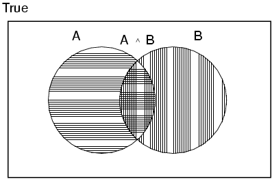

---

# Probabilités a priori

- **Probabilités inconditionnelles ou a priori de propositions**
  - E.g. P(Carie = vrai) et P(Temps = ensoleillé) = 0.72
  - État de croyance a priori en l'absence d'observation
- **La distribution de probabilité donne les valeurs pour toutes les assignations:**
  - P(Temps) = <0.72, 0.1, 0.08, 0.1> (normalisées, i.e. la somme vaut 1)
- **Distribution de probabilités conjointe**
  - Pour des variables aléatoires, la probabilité de chacun de leurs évènements atomiques
  - P(Temps, Carie) = une matrice 4 x 2

| Temps = | Soleil | Pluie | Nuages | Neige |
|---------|--------|-------|--------|-------|
| Carie = true | 0.144 | 0.02 | 0.016 | 0.02 |
| Carie = false | 0.576 | 0.08 | 0.064 | 0.08 |

- Chaque question sur un domaine peut être répondue par la distribution conjointe

---

# Probabilités des variables continues

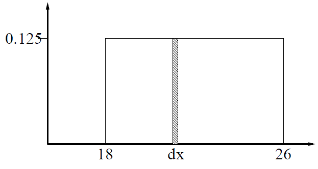

---

<!-- _class: dense -->

# Probabilités conditionnelles

- **Probabilités conditionnelles ou a posteriori**
  - E.g. P(Carie | MalDeDent) = 0.8
  - i.e. "sachant uniquement" Mal De Dent
- **Notation pour distributions conditionnelles:**
  - P(Carie | MalDeDent) = vecteur à 2 elts de vecteurs à 2 elts
- **Si l'on sait plus**
  - P(Carie | MalDeDent, Carie) = 1
- **Des observations peuvent être non pertinentes**
  - Permettent la simplification
  - P(Carie | MalDeDent, ensoleillé) = P(Carie | MalDeDent) = 0.8

---

# Règles de calcul probabiliste

- **Règle du produit**
  - P(a ∧ b) = P(a | b) P(b) = P(b | a) P(a)
  - Soit P(a | b) = P(a ∧ b) / P(b) si P(b) > 0
  - P(Temps, Carie) = P(Temps | Carie) P(Carie) produit terme à terme, pas matriciel
- **Règle de chaînage = dérivation successive**
  - P(X₁, …, Xₙ) = P(X₁, …, Xₙ₋₁) P(Xₙ | X₁, …, Xₙ₋₁)
  - = P(X₁) P(X₂ | X₁)… P(Xₙ₋₁ | X₁, …, Xₙ₋₂) P(Xₙ | X₁, …, Xₙ₋₁)
  - = πⁿᵢ₌₁ P(Xᵢ | X₁, …, Xᵢ₋₁)

<!-- TODO: diagramme visuel pour accompagner les equations -->

---

# Inférence par énumération

- **Probabilités conjointes:**
  - Proposition φ → sommer les évts atomiques où elle est vraie
  - P(φ) = Σ_{ω:ω⊨φ} P(ω)
  - P(MalDeDents) = 0.108 + 0.012 + 0.016 + 0.064 = 0.2
- **Conditionnelles**
  - **P(Carie | MalDeDents)**
    - = P(Carie ∧ MalDeDents) / P(MalDeDents)
    - = (0.016 + 0.064) / (0.108 + 0.012 + 0.016 + 0.064)
    - = 0.4

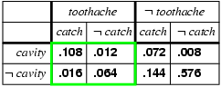
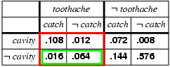

---

<!-- _class: dense -->

# Normalisation

- **Dénominateur = constante de normalisation α**
  - P(Carie | MalDeDents) = α P(Carie, MalDeDents), α = 1 / P(MalDeDents)
  - = α [P(Carie, MalDeDents, Croche) + P(Carie, MalDeDents, ¬Croche)]
  - = α [<0.108, 0.016> + <0.012, 0.064>]
  - = α <0.12, 0.08> = <0.6, 0.4>
- **Idée générale: calculer la distribution**
  - Sur la variable de requête Y
  - En fixant les variables d'observations E
  - En sommant sur les variables cachées H
  - Distribution a posteriori conjointe: P(Y | E = e) = α P(Y, E = e) = α Σₕ P(Y, E = e, H = h)
- **Problèmes:**
  - Complexité au pire en O(dⁿ) où d est la plus grande arité (nb d'arguments)
  - Complexité en espace en O(dⁿ) pour stocker la distribution conjointe
  - Comment trouver les nombres pour O(dⁿ) entrées?

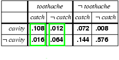

---

# Indépendance

- **A et B sont indépendants si et seulement si**
  - P(A | B) = P(A) ou P(B | A) = P(B) ou P(A, B) = P(A) P(B)
- **Exemple:**
  - P(MalDeDent, Croche, Carie, Temps) = P(MalDeDent, Croche, Carie) P(Temps)
- **Impact sur la complexité**
  - Pour n lancés de pièces indépendants: O(2ⁿ) → O(n)
  - Puissant mais rare
  - Ex du dentiste: des centaines de variables dépendantes

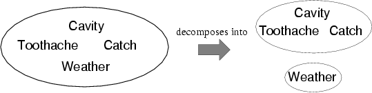

---

# Indépendance conditionnelle

- **Croche est conditionnellement indépendant de Mal De Dents:**
  - (1) P(Croche | MalDeDent, Carie) = P(Croche | Carie)
  - (2) P(Croche | MalDeDent, ¬Carie) = P(Croche | ¬Carie)
  - P(Croche | MalDeDent, Carie) = P(Croche | Carie)
  - P(MalDeDent | Croche, Carie) = P(MalDeDent | Carie)
  - P(MalDeDent, Croche | Carie) = P(MalDeDent | Carie) P(Croche | Carie)
- **Utilisation de la règle de chaînage:**
  - P(MalDeDent, Croche, Carie) = P(MalDeDent | Carie) P(Croche | Carie) P(Carie)
- **Réduction de la complexité:**
  - Peut réduire depuis la distribution conjointe de O(2ⁿ) à O(n)
  - Notre connaissance la plus basique et robuste en environnement incertain

---

# Règle de Bayes

- **Règle du produit:**
  - P(a ∧ b) = P(a | b) P(b) = P(b | a) P(a)
  - → Règle de Bayes
  - P(a | b) = P(b | a) P(a) / P(b)
- **Sous forme de distribution:**
  - P(Y | X) = P(X | Y) P(Y) / P(X) = α P(X | Y) P(Y)
- **Utile pour déterminer les probabilités de diagnostic depuis les probabilités causales**
  - P(Cause | Effet) = P(Effet | Cause) P(Cause) / P(Effet)
- **Ex: méningite, nuque douloureuse:**
  - P(m | s) = P(s | m) P(m) / P(s) = 0.8 × 0.0001 / 0.1 = 0.0008
  - La probabilité a posteriori est encore très faible

---

# Bayes et indépendance conditionnelle

- **Exemple:**
  - P(Carie | MalDeDents ∧ croche)
  - = α P(MalDeDents ∧ croche | Carie) P(Carie)
  - = α P(MalDeDent | Carie) P(Croche | Carie) P(Carie)
- **C'est un exemple de modèle Bayesien naïf**
  - P(Cause, Effet₁, …, Effetₙ) = P(Cause) πᵢ P(Effetᵢ | Cause)
  - Le nombre de paramètres est linéaire en n

---

# Résumé

- **Les probabilités sont un formalisme rigoureux pour la connaissance incertaine**
- **La distribution conjointe de probabilité spécifie la probabilité de chaque évènement atomique**
- **Les questions peuvent être répondues en sommant sur les évènements atomiques**
- **Pour des domaines non triviaux, on doit trouver un moyen de réduire la taille conjointe**
  - L'indépendance et l'indépendance conditionnelle fournissent de bons outils

---

<!-- _class: questions -->

# Questions?

---

# Sommaire

- Quantification de l'incertitude
- **Raisonnement probabiliste**
  - Réseaux Bayésiens
  - Domaines experts simples
- Raisonnement probabiliste temporel
- Prise de décision simple
- Prise de décision complexe

---

# Réseaux Bayésiens

- **Une notation simple, graphique**
  - Pour les assertions d'indépendance conditionnelle
  - Et pour la spécification compacte d'une distribution conjointe complète
- **Syntaxe:**
  - Un ensemble de nœuds, un par variable
  - Un graphe dirigé acyclique (lien ≈ "influences directes")
  - Une distribution conditionnelle pour chaque nœud, étant donné ses parents:
    - P(Xᵢ | Parents(Xᵢ))
- **Dans le cas le plus simple:**
  - Une distribution conditionnelle est représentée par une table de probabilités conditionnelles (CPT)
  - Donnant la distribution en Xᵢ pour chaque combinaison de valeur parente

<!-- TODO: diagramme interactif reseau bayesien -->

---

# Example

- **La topologie du réseau encode les assertions d'indépendance conditionnelle:**
  - Weather est indépendant des autres variables
  - Toothache et Catch sont conditionnellement indépendants, étant donné Cavity

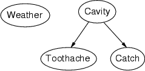

---

# Exemple

- **Mise en situation:**
  - "Au travail, mon voisin John m'appelle pour me prévenir que mon alarme sonne, mais ma voisine Marie n'appelle pas. Parfois elle est déclenchée par de petits tremblements de terre. Y a-t'il un voleur?"
- **Variables:**
  - Burglary, Earthquake, Alarm, JohnCalls, MaryCalls
- **La topologie de réseau reflète la connaissance "causale":**
  - A burglar can set the alarm off
  - An earthquake can set the alarm off
  - The alarm can cause Mary to call
  - The alarm can cause John to call

---

# Example (suite)

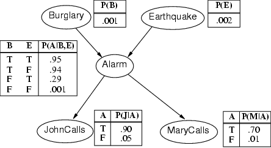

---

# Compacité

- **Un CPT pour les booléens Xᵢ avec k Booléens parents a 2ᵏ lignes pour les combinaisons de valeurs parents**
  - Chaque ligne nécessite un nombre p pour Xᵢ = true
  - (le nombre pour Xᵢ = false est juste 1-p)
- **Si chaque variable n'a pas plus de k parents, le réseau complet nécessite O(n · 2ᵏ) nombres**
  - I.e., croît linéairement en n, vs. O(2ⁿ) pour la distribution conjointe complète
- **Pour le réseau burglary:**
  - 1 + 1 + 4 + 2 + 2 = 10 nombres (vs. 2⁵ - 1 = 31)

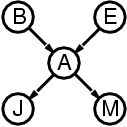

---

# Sémantiques

- **La distribution conjointe complète est définie par le produit des distributions conditionnelles locales:**
  - P(X₁, …, Xₙ) = πⁿᵢ₌₁ P(Xᵢ | Parents(Xᵢ))
- **Exemple:**
  - P(j ∧ m ∧ a ∧ ¬b ∧ ¬e)
  - = P(j | a) P(m | a) P(a | ¬b, ¬e) P(¬b) P(¬e)

---

# Construction de réseaux Bayésiens

- **1. On choisit un ordre de variables X₁, …, Xₙ**
- **2. De i = 1 à n**
  - On ajoute Xᵢ au réseau
  - On sélectionne les parents de X₁, …, Xᵢ₋₁ tels que
  - P(Xᵢ | Parents(Xᵢ)) = P(Xᵢ | X₁, ..., Xᵢ₋₁)
- **Ce choix de parents garantit:**
  - P(X₁, …, Xₙ) = πⁿᵢ₌₁ P(Xᵢ | X₁, …, Xᵢ₋₁) (règle de chaîne)
  - = πⁿᵢ₌₁ P(Xᵢ | Parents(Xᵢ)) (par construction)

---

# Exemple

- **Supposons qu'on choisisse l'ordre M, J, A, B, E**
  - P(J | M) = P(J)?

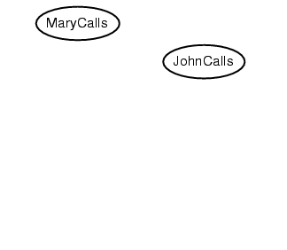

---

# Exemple

- **Supposons qu'on choisisse l'ordre M, J, A, B, E**
  - P(J | M) = P(J)?
  - Non
  - P(A | J, M) = P(A | J)? P(A | J, M) = P(A)?

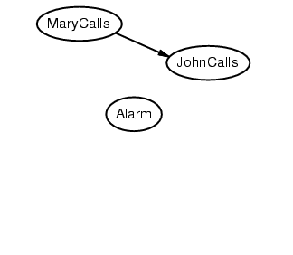

---

# Exemple

- **Supposons qu'on choisisse l'ordre M, J, A, B, E**
  - P(J | M) = P(J)?
  - Non
  - P(A | J, M) = P(A | J)? P(A | J, M) = P(A)? Non
  - P(B | A, J, M) = P(B | A)?
  - P(B | A, J, M) = P(B)?

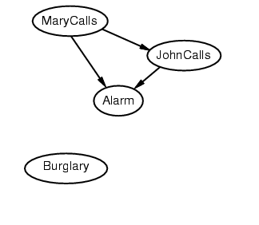

---

# Exemple

- **Supposons qu'on choisisse l'ordre M, J, A, B, E**
  - P(J | M) = P(J)?
  - No
  - P(A | J, M) = P(A | J)? P(A | J, M) = P(A)? No
  - P(B | A, J, M) = P(B | A)? Yes
  - P(B | A, J, M) = P(B)? No
  - P(E | B, A, J, M) = P(E | A)?
  - P(E | B, A, J, M) = P(E | A, B)?

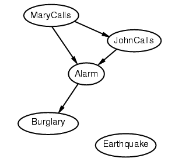

---

# Exemple

- **Supposons que nous choisissons l'ordre M, J, A, B, E**
  - P(J | M) = P(J)?
  - No
  - P(A | J, M) = P(A | J)? P(A | J, M) = P(A)? No
  - P(B | A, J, M) = P(B | A)? Yes
  - P(B | A, J, M) = P(B)? No
  - P(E | B, A, J, M) = P(E | A)? No
  - P(E | B, A, J, M) = P(E | A, B)? Yes

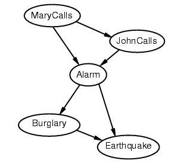

---

# Exemple (suite)

- **Décider de l'indépendance conditionnelle est difficile dans les directions non causales**
  - (Les modèles causaux et d'indépendance conditionnelle semblent câblés pour les humains!)
- **Le réseau est moins compact:**
  - 1 + 2 + 4 + 2 + 4 = 13 nombres nécessaires

---

<!-- _class: dense columns-layout -->

# Représentation efficace

- **Relations d'indépendance conditionnelle**
  - Indépendante conditionnelle aux non-descendants, étant donné les parents (a)
  - Couverture de Markov: Indépendance au reste du réseau (b)
  - Etant données parents, enfants et parents des enfants
- **Distribution canonique**
  - Tables de probabilités conditionnelles fastidieux
  - O(2ᵏ) nombres dans le cas pessimiste
  - → Schéma standard plus simple

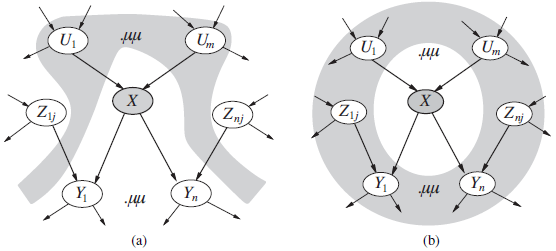
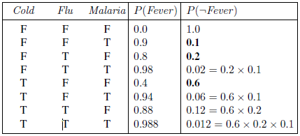
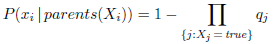

---

<!-- _class: dense -->

# Distributions canoniques (exemples)

- **Ex simple: Nœuds déterministes**
  - Enfants spécifiés par parents
  - Ex: Canadien vs US & Mexico → Nord Américain (disjonction)
  - Ex: Concessionnaires → Meilleur prix (Min)
  - Ex: débits entrant et sortant → Niveau d'un lac (différence)
- **Relation "OU-bruité"**
  - + Incertitude causale Parents/Enfants → Relation inhibée par un bruit
  - Couverture des clauses de la disjonction → ajout d'un nœud de fuite
  - Hypothèse d'indépendance causale des bruits
- **Formulation générale:**
  - Ex: Fièvre vs Maladies → 3 chiffres suffisent

<!-- TODO: diagramme visuel pour accompagner les concepts de distributions canoniques -->

---

<!-- _class: columns-layout -->

# Variables continues

- **Concerne de nombreux problèmes (hauteur, masse, devise, température etc.)**
- **1ère possibilité: Discrétisation → intervalles fixes**
  - Mais parfois peu précis
- **Meilleur: définition d'une distribution de probabilités**
  - Paramétrique: ex: Gaussienne → moyenne et variance
  - Non paramétrique: Définition implicite par l'exemple

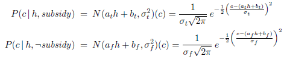
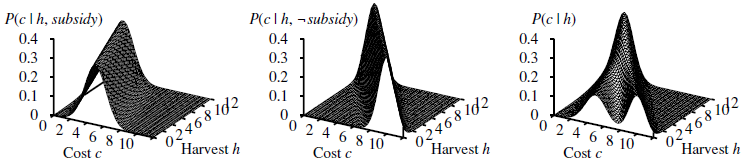
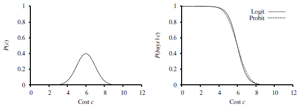

---

<!-- _class: columns-layout -->

# Réseau bayésien hybride

- **Paramètres discrets + continus**
- **Variables continues: Probabilité linéaire Gaussienne**
  - Ex: Coût → Q récolte (h) + subventions
  - 2 distributions sommées
  - Somme de distributions linéaires gaussienne
  - Distribution conjointe = Distribution gaussienne multivariée
  - Distribution a posteriori = distribution gaussienne conditionnelle
- **Variables discrètes avec parents continus**
  - Seuil doux: Ex: acheter / coût
  - Possibilité = intégrale de la distribution normale
  - = Distribution Probit
  - Alternative = fonction sigmoïde = distribution logit

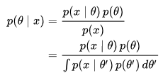
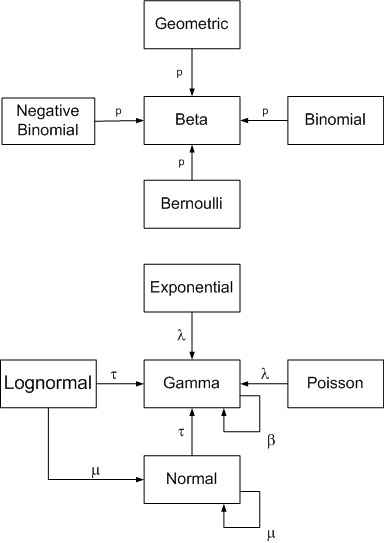

---

# Distribution a priori conjuguée

- **Quelle distribution utiliser?**
  - Posterieur = même famille de distribution
- **Exemples:**
  - Gaussienne: moyenne → Gaussienne, précision → Gamma
  - https://en.wikipedia.org/wiki/Conjugate_prior

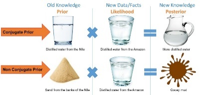

---

<!-- _class: columns-layout -->

# Inférence exacte dans les réseaux Bayésiens

- **Inférence exacte**
  - Énumération
  - Élimination de variables
  - Clustering

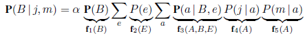
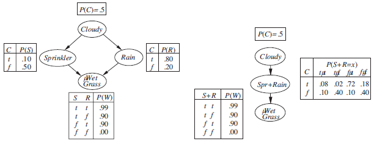

---

<!-- _class: columns-layout -->

# Inférence approchée dans les RB

- **Inférence approchée**
  - Échantillonnage a priori
  - Échantillonnage par rejet
  - Échantillonnage par vraisemblance
  - Méthodes de Monte-Carlo (Gibbs)

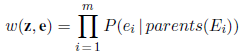
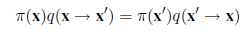

---

<!-- _class: dense columns-layout -->

# Modèles relationnels du premier ordre

- **Modèles bayésiens = propositionnel**
- **FOL → relations entre objets**
  - Ex: évaluations livres: pb de partialité
  - → Impartial(c), Indulgent(c), Mérite(l) prédicats du premier ordre
- **Mondes possibles**
  - Assignations de variables → mondes possibles
  - Sémantique de base de données (limite la taille du problème)
- **Modèles probabilistes relationnels**
  - Syntaxe de FOL → Variables aléatoires = assignations possibles
  - Distributions et dépendances (Tables de Pr Cond.)
  - Indépendance contextuelle = branchement ex: si Impartial(c), si Fan(c, Auteur(l))

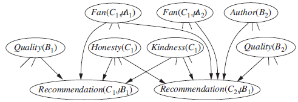

---

<!-- _class: dense columns-layout -->

# MPR: Inférence et univers ouverts

- **Inférence: ex dépliement → Assemblage complet**
  - Grand réseau + variables inconnues → nombreux nœuds parents: ex auteur?
  - Mais si sémantique de DB:
    - Mise en cache + indépendance contextuelle + techniques MCMC efficaces
    - = propositionnalisation → améliorée en FOL par lifting → De même lifting ici
- **Modèles relativistes en univers ouvert**
  - Sémantique standard → incertitude d'existence et d'identité des objets (e.g. IDs: Sibyl attacks)
  - → MPUOs
  - Ex: NbClient: Si honnête, exactement 1, sinon distribution LogNormal[6,9,2,3]

<!-- No images on this slide - text only -->

---

# Résumé réseaux bayésiens

- **Les réseaux Bayésiens fournissent une représentation naturelle pour les indépendance conditionnelles (induites par causalité)**
- **Topologie + CPTs = représentation compacte d'une distribution jointe**
  - Généralement facile à construire pour un expert d'un domaine
- **Représentation efficace/compacte:**
  - Distributions canonique, distributions paramétriques (Gaussiennes etc.)
- **Inférence = calcul de variables de requêtes**
  - Exacte: énumération, élimination, clustering → Efficace dans les polyarbres
  - Approximée: Echantillonnage a priori, par rejet, par vraisemblance, Méthodes de Monte-Carlo (Gibbs)
- **Modèles relationnels**
  - Combinaison avec FOL = Modèles probabilistes relationnels (MPR)
  - + Incertitude d'existence et d'identité = MP en Univers Ouvert

---

<!-- _class: questions -->

# Questions?

---

# Sommaire

- Quantification de l'incertitude
- Raisonnement probabiliste
- **Raisonnement probabiliste temporel**
  - Chaînes de Markov
  - Modèles de Markov Cachés
  - Réseaux Bayésiens dynamiques
  - Filtrage particulaire
- Prise de décision simple
- Prise de décision complexe

---

# Raisonner dans le temps ou l'espace

- **Souvent, nous souhaitons raisonner à propos d'une séquence d'observations**
  - Reconnaissance de la parole
  - Localisation d'un robot
  - Attention d'un utilisateur
  - Monitoring médical
  - Suivi radar
- **Besoin d'introduire le temps (ou l'espace) dans nos modèles**

<!-- TODO: ajouter exemple moderne (vehicules autonomes, LLMs contextuels) -->

---

# Modèles de Markov

---

# Distribution de probabilités

---

# Indépendance conditionnelle

- **Indépendance conditionnelle basique:**
  - Passé et futur indépendants conditionnellement au présent
  - Chaque étape dépend uniquement de la précédente
  - On l'appelle la propriété de Markov (du premier ordre)
- **On note que la chaîne est simplement un Réseau bayésien (extensible):**
  - On peut toujours utiliser le raisonnement des RB classiques si on tronque la chaîne à une longueur donnée

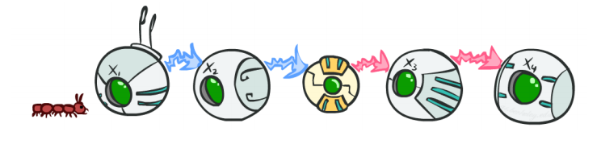

---

# Exemple: Chaîne de Markov

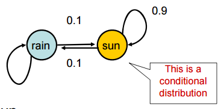

---

# Inférence sur chaînes de Markov

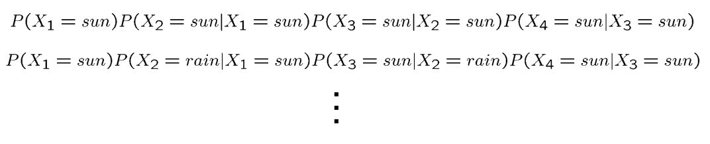

---

# Distribution conjointe de modèle de Markov

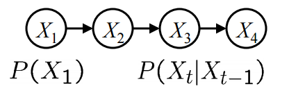

---

# Récapitulatif modèles de Markov

---

# Algorithme Mini-Forward

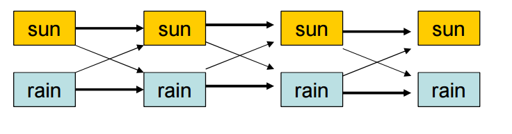

---

# Exemple d'exécution Mini-Forward

- **Depuis une observation initiale d'ensoleillement:**
- **Depuis une observation initiale de pluie:**
- **Depuis une autre distribution initiale P(X₁):**

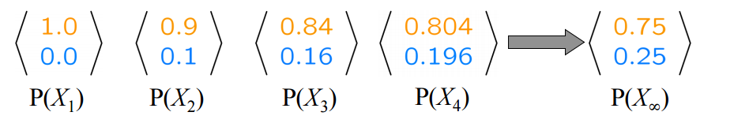
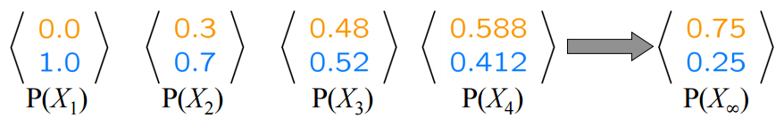
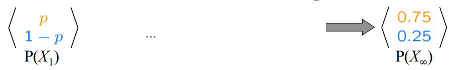

---

# Distributions stationnaires

---

# Exemple: distribution stationnaire

- **Question: Quel est P(X) au temps t = infini?**

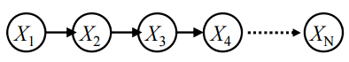

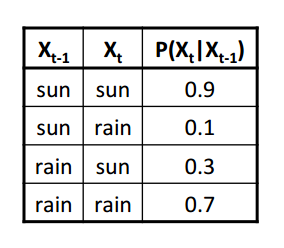

---

# Application: Analyse des liens web

- **PageRank sur un graphe du web**
  - Chaque page est un état
  - Distribution initiale: uniforme sur les pages
- **Transitions:**
  - Avec la prob. c, saut uniforme vers une page aléatoire (lignes pointillées)
  - Avec prob. 1-c, suivre un lien sortant aléatoire (lignes pleines)
- **Distribution stationnaire:**
  - On passera plus de temps sur les pages hautement accessibles
  - E.g. Plein de façon d'arriver sur la page de téléchargement d'Acrobat Reader
  - Relativement robuste au spam de liens
- **Google 1.0**
  - Renvoyait la liste de pages contenant vos mots clés par ordre décroissant de page rank
  - Maintenant tous les moteurs de recherche utilisent l'analyse de lien avec d'autres facteurs (le page rank devient en fait de moins en moins important)

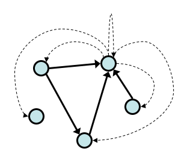

---

# Hidden Markov Models

- **Markov chains not so useful for most agents**
  - Eventually you don't know anything anymore
  - Need observations to update your beliefs
- **Hidden Markov models (HMMs)**
  - Underlying Markov chain over states S
  - You observe outputs (effects) at each time step
- **As a Bayes' net:**

---

# Example

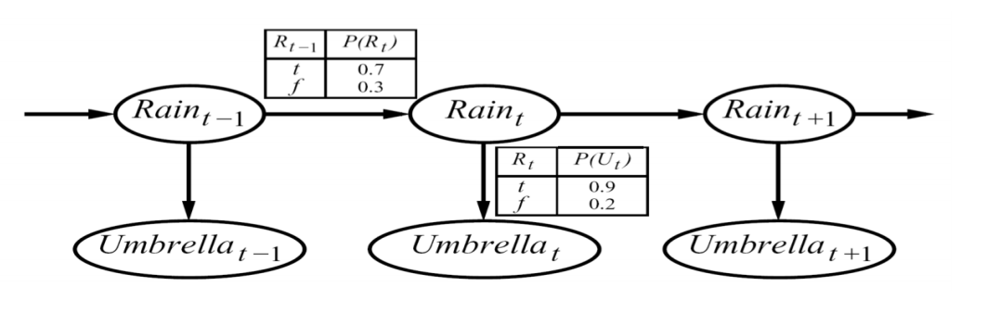

---

# Hidden Markov Models

---

# HMM Computations

- **Given**
  - Parameters
  - Evidence E₁:ₙ = e₁:ₙ
- **Inference problems include:**
  - Filtering, find P(Xₜ | e₁:ₜ) for all t
  - Smoothing, find P(Xₜ | e₁:ₙ) for all t
  - Most probable explanation, find x*₁:ₙ = argmax_{x₁:ₙ} P(x₁:ₙ | e₁:ₙ)

---

# Real HMM Examples

- **Speech recognition HMMs:**
  - Observations are acoustic signals (continuous valued)
  - States are specific positions in specific words (so, tens of thousands)

---

# Real HMM Examples

- **Machine translation HMMs:**
  - Observations are words (tens of thousands)
  - States are translation options

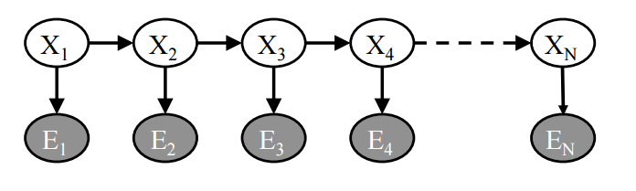

---

# Real HMM Examples

- **Robot tracking:**
  - Observations are range readings (continuous)
  - States are positions on a map (continuous)

---

# Conditional Independence

- **HMMs have two important independence properties:**
  - Markov hidden process, future depends on past via the present

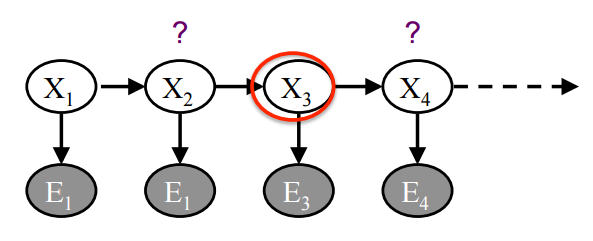

---

# Conditional Independence

- **HMMs have two important independence properties:**
  - Markov hidden process, future depends on past via the present
  - Current observation independent of all else given current state

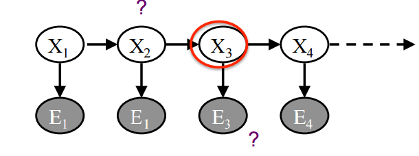

---

# Conditional Independence

- **HMMs have two important independence properties:**
  - Markov hidden process, future depends on past via the present
  - Current observation independent of all else given current state
- **Quiz: does this mean that observations are independent given no evidence?**

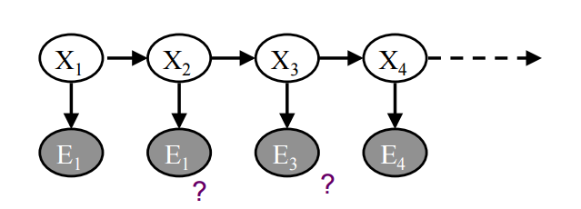

<!-- notes: [No, correlated by the hidden state] -->

---

# HMM Notation

---

# HMM Problem 1: Evaluation

- **Evaluation**
  - Consider the problem where we have a number of HMMs (that is, a set of (π, A, B) triples) describing different systems, and a sequence of observations
  - We may want to know which HMM most probably generated the given sequence
- **Solution: Forward Algorithm**

---

# HMM Problem 2: Decoding

- **Decoding: Finding the most probable sequence of hidden states given some observations**
  - Find the hidden states that generated the observed output
  - In many cases we are interested in the hidden states of the model since they represent something of value that is not directly observable
- **Solution:**
  - Backward Algorithm
  - or Viterbi Algorithm

---

# HMM Problem 3: Learning

- **Learning: Generating a HMM from a sequence of observations**
- **Solution: Forward-Backward Algorithm**

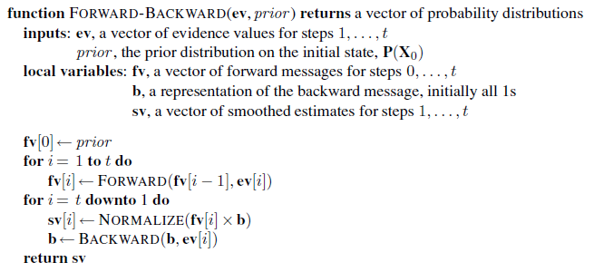

---

# Exhaustive Search Solution

- **Sequence of observations for seaweed state:**
  - Dry
  - Damp
  - Soggy

---

# Exhaustive Search Solution

- **Pr(dry, damp, soggy | HMM) =**
  - Pr(dry, damp, soggy | sunny, sunny, sunny)
  - + Pr(dry, damp, soggy | sunny, sunny, cloudy)
  - + Pr(dry, damp, soggy | sunny, sunny, rainy)
  - + ...
  - + Pr(dry, damp, soggy | rainy, rainy, rainy)

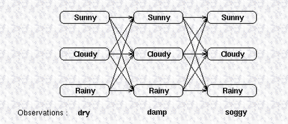

---

# A better solution: dynamic programming

- **We can calculate the probability of reaching an intermediate state in the trellis as the sum of all possible paths to that state**

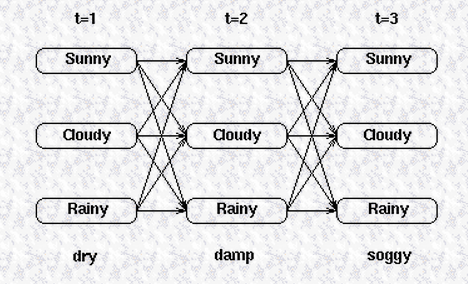

---

# A better solution: dynamic programming

- **αₜ(j) = Pr(observation | hidden state is j) × Pr(all paths to state j at time t)**

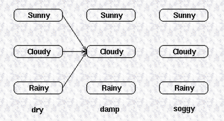

---

# A better solution: dynamic programming

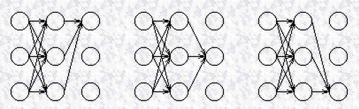

---

# A better solution: dynamic programming

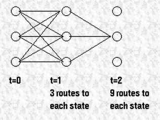

---

<!-- _class: dense columns-layout -->

# Filtres de Kalman

- **Filtres de Kalman**
  - Estimation récursive de l'état
  - Modèle linéaire gaussien
  - Prédiction + mise à jour

---

<!-- _class: dense columns-layout -->

# Filtres de Kalman (suite)

- **Equations du filtre de Kalman**
  - État prédit: x̂ₖ₋ = A x̂ₖ₋₁ + B uₖ
  - Covariance prédite: Pₖ₋ = A Pₖ₋₁ Aᵀ + Q
  - Gain de Kalman: Kₖ = Pₖ₋ Hᵀ (H Pₖ₋ Hᵀ + R)⁻¹
  - État mis à jour: x̂ₖ = x̂ₖ₋ + Kₖ (zₖ - H x̂ₖ₋)

---

<!-- _class: dense columns-layout -->

# Filtres de Kalman (suite)

- **Applications des filtres de Kalman**
  - Navigation GPS
  - Suivi de véhicules
  - Robotique mobile
  - Traitement du signal

---

<!-- _class: dense columns-layout -->

# Réseaux bayésiens dynamiques

- **Généralisation HMM, Kalman etc.**
- **Modèle probabiliste temporel**
  - Variables Xₜ d'état et Eₜ d'observations, dans des coupes arbitraires
  - Cf transformation HMM RBD (vecteur multidimensionnel)
  - Modèle (beaucoup) plus parcimonieux
- **Construction d'un RBD**
  - Distribution a priori, modèle de transition, de capteur
  - Ex: Robot: jauge de batterie
    - → Modèle de défaillance temporaire
    - → Modèle de défaillance persistante → "Jauge cassée"

---

<!-- _class: dense columns-layout -->

# RBD: Inférence

- **Inférence exacte**
  - Possibilité: dépliement de suffisamment de coupes
  - Puis élimination, clustering
  - Utilité du fonctionnement récursif (sommations partielles)
  - Mais résultat pas factorisable
  - → Souvent, méthodes approximatives uniquement
- **Inférence approchée**
  - Pondération par vraisemblance et méthodes MCMC adaptables
  - Ex: Filtrage particulaire: on rejette les échantillons trop faibles et on duplique les autres parmi N
- **Suivre de nombreux objets (jusqu'ici: une trajectoire)**
  - Incertitude d'identité → pb d'association des données → Méthodes approximatives
  - Ex: plus proche voisin, max. de la probabilité des observations, filtrage particulaire, MCMC

---

# Résumé raisonnement temporel

- **Variables aléatoires temporelles**
  - Propriété de Markov, stationnarité
  - Modèles de transition, de capteur
- **Inférence**
  - Filtrage (forward), prédiction, lissage (backward), explication vraisemblance
- **Familles de modèles temporels**
  - Modèles de Markov cachés, filtres de Kalman, Réseaux bayésiens dynamiques
  - Inférence exacte souvent difficile mais méthodes approchées efficaces
- **Filtrage particulaire**
  - + Problème de l'association des données

---

<!-- _class: questions -->

# Questions?

---

# Programmation probabiliste

- **Principales librairies**
  - Infer.Net (C# / .NET)
  - Pyro (Python / PyTorch)
  - Tensorflow Probability (Python / TensorFlow)
  - PyMC (Python / Aesara, Jax)
  - Stan (C++ / Wrappers)
- **Tutoriels Infer.Net**
  - Prise en main (en français)
  - Tutoriels (en anglais)
  - Guide utilisateur

<!-- TODO: ajouter exemple de code Infer.Net -->

---

# Sommaire

- Quantification de l'incertitude
- Raisonnement probabiliste
- Raisonnement probabiliste temporel
- **Prise de décision simple**
  - Théorie de l'utilité
  - Réseaux de décision
  - Systèmes experts
- Prise de décision complexe
- Théorie des jeux

---

# Agent fondé sur l'utilité

- **Alternatives?**
  - Niveau de succès
  - Quantitatif
  - Fonction U: Etat → R
  - Arbitrages
- **Chance de succès**
  - Important
  - Urgent
  - …

<!-- notes: design best program for given machine resources -->

---

<!-- _class: columns-layout -->

# Prise de décision

- **Théorie des probabilités**
  - Ce qu'un agent devrait croire en s'appuyant sur l'observation
- **Théorie de l'utilité**
  - Ce que l'agent veut
- **→ Théorie de la décision synthétise les deux**
  - Ce que l'agent devrait faire
  - Considérer toutes les actions possibles
  - Viser le meilleur résultat: maximiser l'utilité espérée
  - → Agent rationnel
- **Préférence entre les loteries:**
  - L = [p₁, S₁; p₂, S₂; ... pₙ, Sₙ]
- **Axiomes simples d'utilité**
- **Prise de décision simple: Problèmes épisodiques**

---

<!-- _class: columns-layout -->

# Théorie de l'utilité

- **Fonction d'utilité**
  - Représentation des préférences
  - Axiomes de rationalité
  - Utilité espérée

---

<!-- _class: columns-layout -->

# Théorie de l'utilité (suite)

- **Utilité monétaire**
  - Relation entre argent et utilité
  - Aversion au risque
  - Prime de risque

---

<!-- _class: columns-layout -->

# Fonctions d'utilité

- **Types de fonctions d'utilité**
  - Linéaire: neutre au risque
  - Concave: aversion au risque
  - Convexe: goût pour le risque

---

<!-- _class: columns-layout -->

# Fonctions d'utilité (suite)

- **Exemples d'applications**
  - Assurance
  - Investissement
  - Jeux de hasard

---

<!-- _class: columns-layout -->

# Réseaux de décision

- **Réseaux de décision**
  - Combinaison de RB et noeuds de décision
  - Noeuds de décision: actions
  - Noeuds d'utilité: récompenses
  - Inférence: meilleure action

---

<!-- _class: columns-layout -->

# Réseaux de décision (suite)

- **Valeur espérée de l'information**
  - Valeur de l'information parfaite
  - Valeur de l'imparfaite
  - Coût vs bénéfice

---

# Système expert

---

<!-- _class: questions -->

# Questions?

---

# Sommaire

- Quantification de l'incertitude
- Raisonnement probabiliste
- Raisonnement probabiliste temporel
- Prise de décision simple
- **Prise de décision complexe**
  - Politiques, Processus de décision de Markov
  - Théorie de jeux
  - Design de mécanismes
  - Jeux différentiels

---

<!-- _class: dense columns-layout -->

# Prise de décision complexe

- **Problèmes de décision séquentiels**
  - Planification = cas particulier
  - Entièrement observables
- **Processus de décision de Markov (MDP)**
  - Etats s, Actions(s)
  - Modèle de transition P(s' | s, a)
  - Récompense R(s)
  - Ex: +1; -1 (terminal); -0,04 (vitesse)
- **Solution = Politique optimale (π*)**
  - Fournit l'utilité espérée maximale
  - EUₕ([s₀, s₁, ..., sₙ])

---

<!-- _class: columns-layout -->

# Horizons et préférences

- **Horizon fini → π* non-stationnaire**
- **Préférences Stationnaires → récompenses**
  - Additives: Uₕ([s₀, s₁, s₂, ...]) = R(s₀) + R(s₁) + R(s₂) + ...
  - Besoin d'une politique appropriée (garantie de finir)
  - Ou escomptées: Uₕ([s₀, s₁, s₂, ...]) = R(s₀) + γ R(s₁) + γ² R(s₂)
  - → U bornée, Empirique, monétaire, incertitude, stationnarité
  - Sinon, récompense moyenne

---

<!-- _class: columns-layout -->

# Evaluation des politiques

- **Evaluation d'une politique π**
  - Utilité espérée
  - Valeur de chaque état

---

<!-- _class: columns-layout -->

# Evaluation des politiques (suite)

- **Equations de Bellman**
  - Valeur d'état
  - Relation de récurrence

---

<!-- _class: columns-layout -->

# Méthodes itératives

- **Value Iteration**
  - Mise à jour itérative
  - Convergence vers π*

---

<!-- _class: columns-layout -->

# Méthodes itératives (suite)

- **Policy Iteration**
  - Evaluation de politique
  - Amélioration de politique

---

<!-- _class: dense columns-layout -->

# Autres méthodes

- **Programmation linéaire**
  - Bellman → sommes et max → problème d'optimisation
  - Minimisation U(s) avec contraintes
  - Mais souvent complexité mauvaise (nombreux états/actions)
- **Algorithmes itératifs en ligne**
  - Méthodes offline souvent impraticables (cf. jeux)
  - Ex: Expectiminimax: Arbre minimax + nœuds de chance
  - Profondeur bornée (via γ) ainsi que branchement (via sampling)
  - Programmation dynamique en temps réel (RTDP)
  - (décomposition en sous problèmes → Graphe = sous-MPD)

---

<!-- _class: dense columns-layout -->

# Méthodes de Monte-Carlo et bandits

- **Grands espaces → méthodes de Monte-Carlo**
- **Problèmes de bandits manchots**
  - Machines à sous à n bras aux probabilités de gains distinctes (MAP ≈ MDP)
  - → Compromis Exploration/Exploitation
  - Ex: traitements covid-19
- **Coefficient de Gittins**
  - Une seule machine à sous: Comparaison avec récompense stationnaire λ
  - → stopping time T
  - Calcul: Cas simple: utilisation d'un Restart MDP (indifférence à T)
  - Approximations (MDP tronqué)

---

<!-- _class: columns-layout -->

# PDMPOs / POMDPs

- **Partially Observable MDPs**
  - États partiellement observables
  - Croyances sur l'état
  - Inférence sur les croyances

---

<!-- _class: columns-layout -->

# PDMPOs / POMDPs (suite)

- **Résolution des POMDPs**
  - Arbre de croyances
  - Points de croyance
  - Méthodes approximatives

---

<!-- _class: questions -->

# Questions?

---

# Plan du cours

- Introduction
- Résolution de problèmes
- Bases de connaissances et logique
- Incertitude et modèles probabilistes
- Théorie des jeux
- Apprentissage
- Traitement du langage naturel
- Présentation projets

---

# Projets de groupe

- **Moteur de recherche augmenté par le raisonnement et le langage naturel**
  - Grammaire et sémantique des contenus et des requêtes. Lucene.Net, OpenNLP, SharpRDF, FOL
- **Conception de bots de services sur réseaux sociaux**
  - Chat Bots, AIML, Reddit et agents de service, NLP, RDF, APIs
- **Conception d'un modèle d'inférence pour l'analyse de sentiment**
  - Conception d'un modèle probabiliste, Infer.Net, démarche expérimentale, Reddit
- **Création d'une plateforme sémantique LDP à partir d'un index structuré**
  - Structuration et ouverture des données = Linked Data. Lucene.Net, SharpRDF
- **Résolution de Captchas par deep learning**
  - Apprentissage via un Adapteur DNN, Réseaux de dernières génération. TensorFlow, CNTK, Encog

---

# Projets de groupe (suite)

- **Entraînement de stratégies de trading algorithmiques sur crypto monnaies**
  - Expérience DNN Bitcoin, Encog et machine learning
- **Amélioration par l'apprentissage d'un agent joueur de Go simple**
  - Le Go et l'IA, Récentes avancées. Go Traxx
- **Evolution de vaisseaux spatiaux par algorithmes génétiques dans le jeu de la vie**
  - Approches évolutionnistes, automates cellulaires, Bac à sable. Golly, Encog
- **Pilotage d'un cluster de cache distribué pour le portage d'applications dans le Cloud**
  - Caches distribués, scaling, stratégies et clustering. Redis

---

# Pour aller plus loin: Notebooks

- **Infer.NET 101**: `Probas/Infer-101.ipynb` - introduction probabilités
- **Réseaux bayésiens**: `Probas/Infer/Infer-3-Factor-Graphs.ipynb`, `Infer-4-Bayes-Nets.ipynb`
- **Inférence**: `Probas/Infer/Infer-5-Inference.ipynb`, `Infer-7-Variable-Elimination.ipynb`
- **HMM**: `Probas/Infer/Infer-6-HMM.ipynb`, `Infer-8-Temporal.ipynb`
- **Décision et utilité**: `Probas/Infer/Infer-12-Decision.ipynb`, `Infer-14-Decision-Utility.ipynb`
- **MDP et RL**: `GameTheory/GameTheory-2b-MDP.ipynb`, `GameTheory-14b-RL-Basics.ipynb`

<!-- TODO: ajouter liens cliquables -->

---

<!-- _class: title -->

# Merci

Jean-Sylvain Boige
jsboige@myia.org
