<!-- _class: title -->

# Théorie des jeux

Intelligence Artificielle -- V

**Analyse strategique et prise de decision multi-agents**

- Equilibres de Nash et jeux strategiques
- Jeux Bayesiens et information incomplete
- Mecanismes et choix social
- Jeux differentiels et controle optimal

---

# Plan du cours

- I. Introduction
- II. Resolution de problemes
- III. Bases de connaissances et logique
- IV. Incertitude et modeles probabilistes
- **V. Theorie des jeux** ← *vous etes ici*
- VI. Apprentissage
- VII. Traitement du langage naturel
- VIII. Presentation projets

---

# Théorie des jeux

- **Environnement multi-agent**
  - Un seul Decideur : planification / synchronisation
  - Multi-Effecteurs / Multi-corps (decouplage)
  - Centralise (state = pool) vs decentralise
- **Decideurs multiples** → theorie des jeux
  - But commun / buts propres
  - Degre d'adversite et/ou collaboration
  - Information parfaite / imparfaite
- **A un tour** : Joueurs, actions, recompenses
  - Ex: Morra (2 doigts)

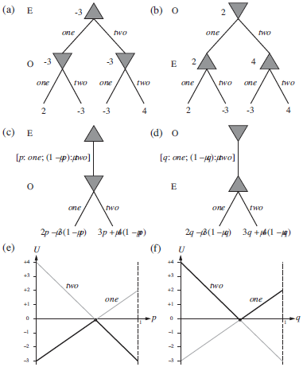

---

# Pourquoi la théorie des jeux?

- **Etude des interdependances strategiques**
- **Objectif double**
  - *Design d'agent* : Quelle est la meilleure strategie?
  - *Design de mecanisme* : Quelles sont les bonnes regles?
- **Justifications**
  - Les maths deviennent compliquees
  - Fournit des outils de comptabilite
  - Identifier les situations analogues
  - Comprehension des schemas habituels
- **Optimisation de strategies**
  - Pure / mixte (randomisee)
  - Solution = profil rationnel = assignation de strategies

---

# Fondements : Von Neumann et Maximin

- **Jeux a somme nulle**
  - Von Neumann → strategie Maximin
  - Maximiser le pire gain possible
- **Changement de regles**
  - Sequence UE,O ≤ U ≤ UO,E
- **Exemple : Morra**
  - p = 7/12, U(E) = -1/12

<!-- TODO: matrice de gains visuelle pour Morra -->

---

# Analyse stratégique

- **Jeux simultanees**
  - Matrice de gains
  - Ex: Dilemme du prisonnier (parler ou se taire)
- **Strategie pure strictement dominante** (stable)
  - Mais Pareto dominee (global mais instable)
- **IESDS**
  - Elimination iterative des strategies strictement dominees
  - Reduction progressive de la matrice

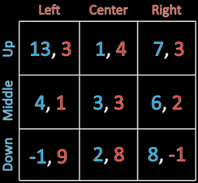

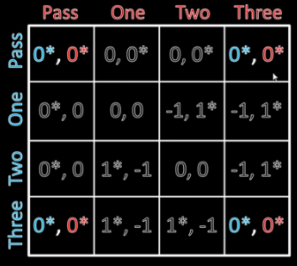

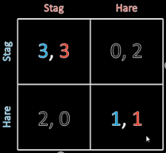

---

# Equilibre de Nash

- **Optimum local dans l'espace des politiques**
- **Definition** : Aucun agent n'a de motivation a changer de strategie
  - = Une loi que personne n'enfreint sans la police (ex: feu rouge)
  - Garanti d'exister / importance de la Coordination
- **Meilleure reponse**
  - Etant donnees les autres choix
  - Equilibre de Nash = meilleure reponse pour tous
- **Exemple** : Chasse au cerf
  - Deux equilibres : cooperation (cerf) vs securite (lievre)

<!-- TODO: matrice chasse au cerf avec equilibres de Nash marques -->

---

# Stratégies mixtes

- **Strategies mixtes**
  - Randomisation sur les strategies pures
  - Distribution de probabilite sur les actions
- **Theoreme de Nash**
  - Tout jeu fini possede au moins un equilibre de Nash (pur ou mixte)
- **Principe d'indifference**
  - A l'equilibre mixte, le joueur est indifferent entre ses strategies pures
  - Chaque strategie pure jouee avec probabilite > 0 donne la meme esperance

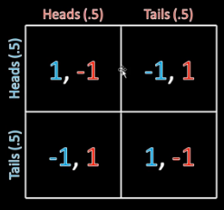

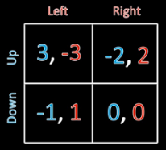

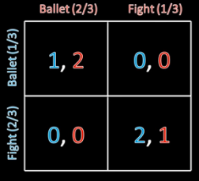

---

# Equilibres de stratégie mixte

- **Calcul des equilibres mixtes**
  - Egalisation des esperances de gain
  - Resolution d'un systeme d'equations lineaires
- **Interpretation**
  - Incertitude sur les choix adverses
  - Impredictibilite strategique
- **Exemples classiques**
  - Pierre-Feuille-Ciseaux : equilibre (1/3, 1/3, 1/3)
  - Penalité au football : gauche/droite

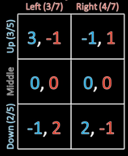

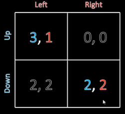

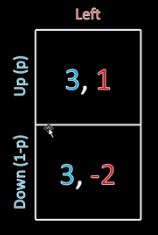

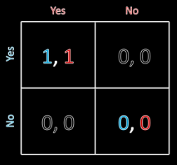

---

# Jeux séquentiels

- **Jeux a tours successifs**
  - Conflits, negociations, etc.
- **Jeu de la guerre des prix** (in/out)
  - Accept, out = equilibres possibles
  - Matrice → dominance faible
  - Mais difference = menace credible?
- **Equilibre parfait de sous-jeu (SPE)**
  - Sous-jeu Firm 2 → accept
  - "out" plus en equilibre → question des menaces credibles
  - Induction arriere pour resoudre

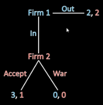

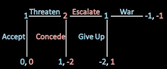

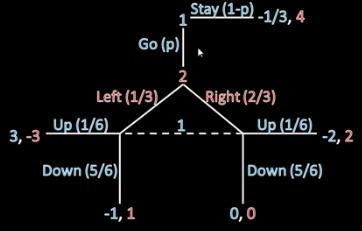

---

# Induction arrière

- **On demarre par la fin**
  - Les sous-jeux finaux eclairent les premiers
  - → "Accept" strategie optimale
- **Equilibres parfaits de sous-jeu**
  - Importance de reperer tous les chemins / nœuds de decision
  - Ex: <Accept, War>; <Escalade>
- **Equilibres de sous-jeu parfaits multiples** (rare)
  - Sous-jeu du bas → cf simultane : mixte → EU(1) = -1/3 → mixte infini
- **Exemple** : Jeu de l'escalade a la guerre

<!-- TODO: arbre complet avec induction arriere etape par etape -->

---

# Jeux à étapes : Principes

- **Plusieurs manches**
  - Sous-jeux simultanes
  - Gains independants
  - Connaissance du passe
  - Difficile a dessiner (exponentiel)
- **Theoremes**
  - Derniere etape → Equilibre de Nash (passe pas modifiable)
  - Autres : jouer equilibres de Nash = 1 equilibre de sous-jeu
  - Mais autres equilibres de sous-jeu possibles (cooperation)
- **Strategies de punition**
  - Ex: Prisonnier puis Argent gratuit
  - → Equilibre faible (0,0) = menace de punition
  - → Meilleur equilibre

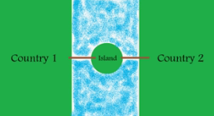
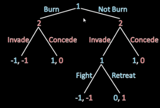

---

# Jeux à étapes : Engagement et induction

- **Menaces "credibles" importantes**
  - Se lier les mains
  - Ex: bruler le pont derriere soi
  - → Pas de possibilites de retraite
  - → Rend la menace credible
- **Problemes d'engagement**
  - Ex: fouille : superficielle, complete, chien
  - Pb = pas d'engagement credible
  - Induction arriere K9
  - → L'ordre est important
- **Problemes de l'induction arriere**
  - Ex: le millepattes
  - Equilibre pessimiste, pas constate dans la pratique
  - Hypotheses → Maths → conclusions
  - Pb ici : hypotheses de rationalite limitee

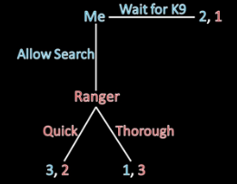
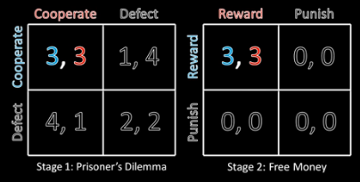

---

# Jeux répétés et évolution de la confiance

- **Induction avant**
  - Induction arriere = futur rationnel
  - Induction avant = passe rationnel
  - Ex: "pub hunt" → supprime un equilibre
  - Mais parfois solutions controversees
- **Version societale : dilemmes repetes**
  - Punition perpetuelle
  - Œil pour œil (Tit-for-Tat)
  - Evolution de la confiance
- **Applications**
  - Negociations commerciales repetees
  - Cooperation internationale

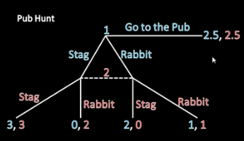
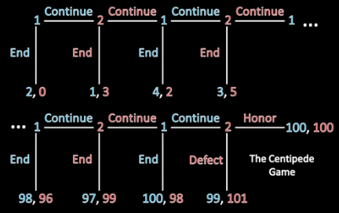

---

<!-- _class: dense -->

# Formes stratégiques avancées

- **Extensions des representations classiques**
  - Jeux en forme extensive avec information incomplete
  - Jeux stochastiques
  - Jeux a champs moyens
- **Raffinements d'equilibre**
  - Equilibres tremblants
  - Equilibres sequentiels
  - Proper equilibria

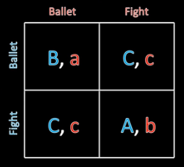

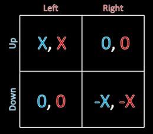

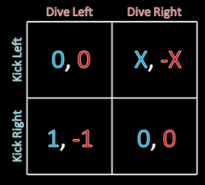

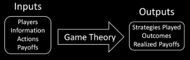

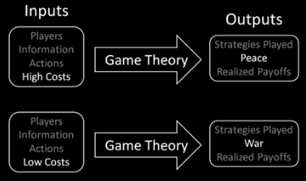

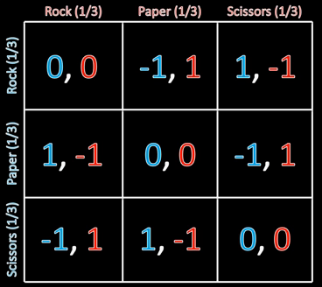

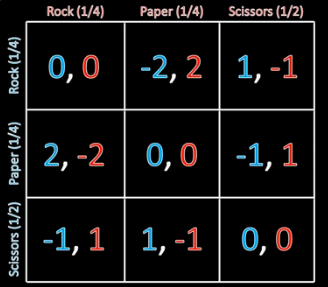

---

# Espaces de stratégies infinis

- **Jeux sans equilibre**
  - Jusqu'ici, nombre fini de strategies pures
  - Matrices + theoremes de Nash
- **Certains jeux ont une infinite de strategies pures**
  - → Pas de matrice et pas forcement d'equilibre de Nash
  - Ex: Joueur 1 : x>0, Joueur 2 : y>0, gain xy pour les deux
- **Duels**
  - 100 m, 2 balles, se rapprochent, peuvent tirer quand ils souhaitent
  - Precisions differentes mais 0% a 100m, 100% a 0m
  - → Equilibre = meme distance (preuve par contradiction)
- **Ex** : Date de sortie de produits concurrents

---

# Loi de Hotelling et l'électeur médian

- **2 vendeurs de glace sur la plage**
  - Choix de l'emplacement
  - Equilibre = les deux au milieu
- **Principe important en politique**
  - Theoremes de l'electeur median
  - Vainqueur de Condorcet (cf Choix social)
- **Applications**
  - Positionnement des partis politiques
  - Strategies de differenciation commerciale

---

# Jeux Bayésiens

- **Information incomplete**
  - Les joueurs ne connaissent pas parfaitement les types des autres
  - Ex: poker (cartes cachees), negociation (valuations privees)
- **Types et croyances**
  - Chaque joueur a un "type" prive
  - Distribution de probabilite (croyances) sur les types adverses
- **Equilibre Bayesien de Nash**
  - Extension de l'equilibre de Nash
  - Meilleure reponse en esperance sur les types adverses

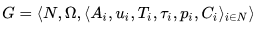
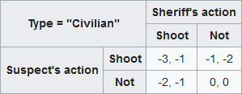
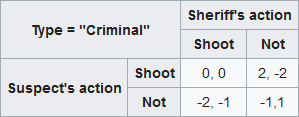

---

# Equilibres Bayésiens parfaits (PBE)

- **Perfect Bayesian Equilibrium**
  - Extension aux jeux sequentiels avec information incomplete
  - Combine rationalite sequentielle + croyances coherentes
- **Deux exigences**
  - Rationalite sequentielle : strategies optimales a chaque nœud
  - Croyances coherentes : actualisees par la regle de Bayes
- **Applications**
  - Signalisation (education comme signal de competence)
  - Negociations avec asymetrie d'information

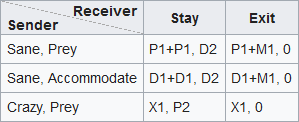
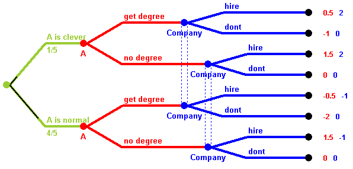
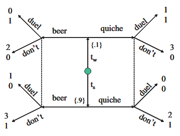

---

<!-- _class: questions -->

# Questions?

---

# Jeux coopératifs

- **Coalitions et negociation**
  - Formation de coalitions entre joueurs
  - Distribution des gains collectifs
- **Valeur de Shapley**
  - Repartition equitable basee sur la contribution marginale
  - Unicite sous axiomes de symetrie, additivite, joueur nul
- **Core et stabilite**
  - Ensemble des allocations non bloquees par coalitions
  - Peut etre vide dans certains jeux
- **Applications**
  - Partage de couts (infrastructures communes)
  - Accords internationaux (climat, commerce)

<!-- TODO: diagramme formation de coalitions et calcul Shapley -->

---

# Conception de mécanismes

- **Design de regles du jeu**
  - Objectif : obtenir un resultat souhaite via incitations individuelles
  - "Reverse game theory"
- **Compatibilite incitative**
  - Verite comme strategie dominante (strategy-proof)
  - Equilibre Bayesien incitatif
- **Principe de revelation**
  - Tout mecanisme peut etre transforme en mecanisme direct veridique
- **Applications**
  - Encheres (maximiser revenus)
  - Votes (agregation des preferences)
  - Allocation de ressources (spectre radio, places universitaires)

<!-- TODO: schema pipeline design de mecanisme -->

---

# Allocation de ressources par les enchères

- **Types d'encheres**
  - Premier prix scelle
  - Second prix (Vickrey) : veridique
  - Anglaise (ascendante)
  - Hollandaise (descendante)
- **Theoreme d'equivalence des revenus**
  - Sous hypotheses standard, revenus equivalents
- **Encheres combinatoires**
  - Allocation de multiples items interdependants
  - Complexite computationnelle elevee

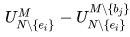

<!-- TODO: comparaison visuelle des 4 formats d'encheres -->

---

# Allocation par les votes

- **Choix social et procedures de vote**
  - Agregation de preferences individuelles
  - Pas de "meilleure" methode universelle
- **Paradoxes du vote**
  - Paradoxe de Condorcet : cycles de preferences
  - Paradoxe d'Arrow : pas de systeme parfait
- **Criteres de qualite**
  - Unanimite, monotonie, independance
  - Resistance a la manipulation strategique

<!-- TODO: exemple visuel du paradoxe de Condorcet -->

---

# Critère de Condorcet : Définition

- **Condition du vainqueur de Condorcet**
  - La meilleure aux autres options prises paire a paire
- **Exemple**
  - Uninominal a 2 tours : Bayrou vainqueur de Condorcet mais pas au 2e tour
- **Theoreme** : Indifference aux petits candidats
  - Vainqueur de Condorcet stable aux changements mineurs
- **Mais paradoxe de Condorcet**
  - Pas de garantie d'existence du vainqueur

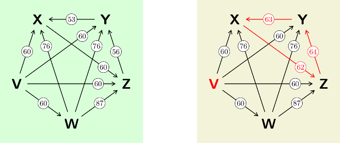
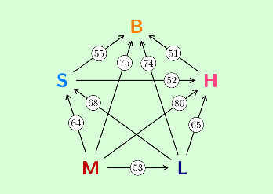

---

# Critère de Condorcet : Théorèmes de l'électeur médian

- **1er theoreme**
  - Gauche – droite → existence du vainqueur → electeur median
- **2e theoreme**
  - Gauche – droite + valeur intrinseque
- **Si pas de vainqueur de Condorcet**
  - Methodes de Condorcet → resolution
  - Une ou deux methodes
- **Exemple a une methode : Methode Minimax**
  - Celui qui fait le mieux au pire
  - Mais tres strategique (ex: anarchistes)

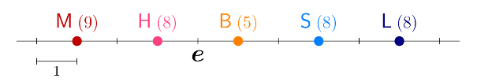

---

# Critère de Condorcet : Méthode de Schulze

- **Methode de Schulze**
  - Elimination iterative des derniers du peloton de tete
  - Robuste a la manipulation (electeurs raisonnables)
- **Algorithme**
  - Calcul des chemins de victoire les plus forts
  - Selection du candidat avec les meilleurs chemins
- **Proprietes**
  - Respecte le critere de Condorcet
  - Clone-proof (resistant aux candidats clones)
- **Utilisation**
  - Wikimedia Foundation
  - Pirate Party

<!-- TODO: graphe de victoires avec chemins de Schulze -->

---

# Procédures de vote : Méthodes directes

- **Referendum**
  - 2 options → methode de la majorite robuste a la manipulation (et c'est la seule)
- **Vote pluraliste uninominal** (n candidats)
  - Critique : vote utile + pas de preferences
- **Vote a second-tour instantane**
  - Preferences completes
  - Si pas de majorite, elimination du dernier et second tour
  - → Pas de critere de Condorcet
- **Methode de Condorcet** : vote a regle de vraie majorite
  - Preferences completes, puis comparaisons paires a paires
  - → Bons resultats mais ne marche pas tout le temps (paradoxe de Condorcet)
  - → Methodes de Condorcet → Schulze

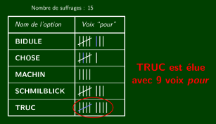
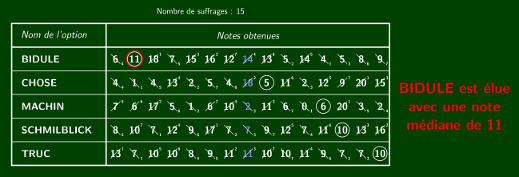

---

# Procédures de vote : Méthodes utilitaristes

- **Compte de Borda**
  - Preferences, score = ordre
  - Manipulable
- **Vote par assentiment**
  - Elimination, majorite d'approbation
  - Theoreme de robustesse au mensonge : suffrage sincere strategique
- **Scrutin au jugement majoritaire**
  - Mediane des scores
  - Seule procedure verifiant :
    - Majorite d'une meme note validee
    - Et monotonie au changement individuel

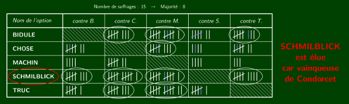
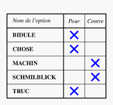

---

# Procédures de vote : Méthodes stochastiques

- **Scrutin Stochocratique**
  - Option preferee puis tirage au sort
  - Theoreme d'Hylland de "la dictature aleatoire"
  - Seule methode avec critere d'unanimite non strategique
- **Methode de Condorcet randomisee**
  - Loterie ponderee dans le peloton de tete
  - Ponderation selon equilibre de Nash
  - Ex: Shifumi
  - Critere de Condorcet ET Non strategique (seul)
- **Comparaison detaillee**
  - Articles et demonstrations disponibles

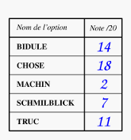
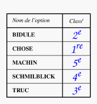

---

# Allocation par la négociation

- **Negociation bilaterale**
  - Deux parties, ressource a partager
  - Alternatives de desaccord (BATNA)
- **Solution de Nash**
  - Maximise le produit des utilites
  - Axiomes : efficacite de Pareto, symetrie, invariance, independance
- **Autres solutions**
  - Egalitariste, utilitariste, Kalai-Smorodinsky
- **Applications**
  - Negociations syndicales
  - Accords commerciaux

---

# Théorie de la négociation

- **Demarche**
  - Hypotheses
  - → Modeles de jeux
  - → Equilibres et pouvoirs de negociation
- **Sources du pouvoir de negociation**
  - Pouvoir de proposition
  - Patience
  - Options alternatives
  - Connaissance de l'autre utilite
  - Monopole
  - Reputation
  - Engagement credible
  - Signalement couteux

<!-- TODO: schema facteurs de pouvoir de negociation -->

---

<!-- _class: questions -->

# Questions?

---

# Jeux différentiels

- **Jeux en temps continu**
  - Etats et controles evolvent continument dans le temps
  - Equations differentielles decrivent la dynamique
- **Applications**
  - Economie : croissance, investissement, ressources
  - Ingenierie : poursuite-evasion, controle de systemes
  - Ecologie : gestion de ressources naturelles
- **Outils mathematiques**
  - Calcul variationnel
  - Principe du maximum de Pontryagin
  - Equations d'Hamilton-Jacobi-Bellman

<!-- TODO: schema systeme dynamique avec joueurs et controles -->

---

# Equilibres différentiels : Nash et Stackelberg

- **Equilibres de Nash pour jeux a somme nulle**
  - J1(u1,u2) + J2(u1,u2) = 0
- **Equilibres de point de selle**
  - P1 maximise, P2 minimise
  - → Equilibre ssi point de selle existe
- **Equilibres de Stackelberg**
  - Le "leader" annonce
  - En tenant compte du fait que les autres maximisent leur reponse
- **Jeux Cooperatifs/competitifs**
  - Possibilite de dialogue, maximisation commune
  - Division en partie cooperative et partie competitive : valeur co-co

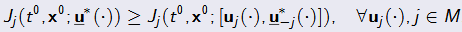
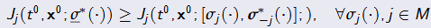

---

# Equilibres différentiels : Boucle ouverte et Markovien

- **Equilibres en boucle ouverte**
  - Equilibre de Nash : u* est un equilibre ssi
  - J1, J2 → 2 optimisations, conditions d'existence et de calcul
  - + Equilibre de Stackelberg : conditions d'existence et de calcul
  - Ex: croissance economique avec u1 taxe sur le capital et u2 consommation
  - → Equilibre de S avec gouvernement leader
- **Equilibres Markovien**
  - Equilibre de Nash : σ* est un equilibre ssi
  - Resolution d'equations differentielles partielles
  - Cas general → Solutions non hyperboliques
  - Jeux a somme nulle ou dimension 1 → systeme hyperbolique
- **Jeux lineaires quadratiques**
  - Dynamique lineaire, recompense quadratique → solution analytique

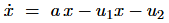

---

# Méthodes calculatoires

- **Methodes directes**
  - Formulation du programme mathematique et resolution
- **Methodes indirectes**
  - Utilisation d'equations differentielles partielles
- **Methode d'echantillonnage incremental**
  - Ex: poursuite evasion
  - Temps terminal T, recompense L(Ue,Up) – T
  - RRT exploration d'arbre
  - Convergence avec nombre d'echantillons suffisant
  - → Similaire au filtrage particulaire
- **Pour aller plus loin**
  - Details mathematiques dans les notebooks

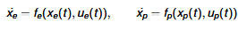
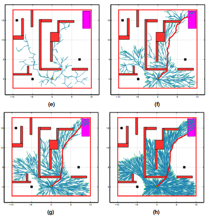

---

<!-- _class: questions -->

# Questions?

---

# Projets de groupe

- **Moteur de recherche augmente** (langage naturel, Lucene.Net, OpenNLP, SharpRDF, FOL)
- **Bots de services** (Chat Bots, AIML, Reddit, NLP, RDF, APIs)
- **Modele d'inference pour l'analyse de sentiment** (Infer.Net, demarche experimentale, Reddit)
- **Plateforme semantique LDP** (Linked Data, Lucene.Net, SharpRDF)
- **Resolution de Captchas** (Deep Learning, TensorFlow, CNTK, Encog)
- **Strategies de trading algorithmiques** (Crypto monnaies, DNN Bitcoin, Encog)
- **Agent joueur de Go** (Monte Carlo Tree Search, apprentissage, Go Traxx)
- **Evolution de vaisseaux spatiaux** (Algorithmes genetiques, automates cellulaires, Golly, Encog)
- **Cluster de cache distribue** (Cloud, Redis, scaling, strategies)

<!-- TODO: pictogrammes pour chaque type de projet -->

---

# Pour aller plus loin : Notebooks

- **Introduction** : `GameTheory/GameTheory-1b-Intro.ipynb`
- **Equilibre de Nash** : `GameTheory/GameTheory-3b-Nash.ipynb`, `GameTheory-4b-Nash-Computation.ipynb`
- **Jeux Bayesiens** : `GameTheory/GameTheory-5b-Bayesian-Games.ipynb`
- **Mecanismes** : `GameTheory/GameTheory-7b-Mechanism-Design.ipynb`, `GameTheory-8b-Auctions.ipynb`
- **Jeux differentiels** : `GameTheory/GameTheory-13b-Differential-Games.ipynb`
- **RL et Multi-Agent** : `GameTheory/GameTheory-14b-RL-Basics.ipynb`, `GameTheory-15b-Multi-Agent-RL.ipynb`

> **Note** : Les notebooks GameTheory utilisent OpenSpiel et necessitent un kernel WSL.

<!-- TODO: ajouter QR codes ou liens cliquables -->

---

<!-- _class: title -->

# Merci

Jean-Sylvain Boige
jsboige@myia.org
