# Théorie des jeux

INTELLIGENCE ARTIFICIELLE -- V

**Analyse stratégique**

- Jeux Bayesiens
- Théorie des mécanismes
  - Jeux differentiels

---
layout: section
---

# Plan du cours

---
layout: default
---

# Sommaire

- I. Introduction
- II. Resolution de problemes
- III. Bases de connaissances et logique
- IV. Incertitude et modèles probabilistes
- **V. Théorie des jeux**
- VI. Apprentissage
- VII. Traitement du langage naturel
- VIII. Presentation projets

---
layout: dense
---

# Théorie des jeux

## Environnement multi-agent

- Un seul Decideur
  - Planification / Synchronisation
  - Multi-Effecteurs / Multi-corps (decouplage)
    - Centralise (state = pool) vs decentralise
- Decideurs multiples -> théorie des jeux
  - But commun / buts propres, adversite et/ou collaboratif
  - Information parfaite / imparfaite
  - A un tour: Joueurs, actions, recompenses

## Études des interdependances stratégiques

- Objectif double
  - Design d'agent: Quelle est la meilleure stratégie?
  - Design de mécanisme: Quelles sont les bonnes règles?
- Optimisation de stratégies: pure / mixte (randomisee)
- Von Neumann -> Maximin: Jeux a somme nulle

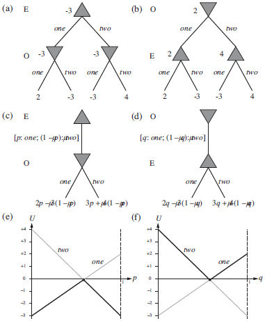

---
layout: section
---

# Analyse stratégique

---
layout: dense
---

# Analyse stratégique

## Jeux simultanes

- Matrice de gains
- Dilemme du prisonnier: Parler ou se taire
  - Stratégie pure strictement dominante (stable)
  - Mais Pareto dominee (global mais instable)

## IESDS

- Elimination iterative des stratégies strictement dominees
- Reduction progressive de la matrice

## Equilibre de Nash

- Optimum local dans l'espace des politiques
- Aucun agent n'a de motivation a changer de stratégie
  - = Une loi que personne n'enfreint sans la police
- Garanti d'exister / importance de la Coordination

## Meilleure reponse

- Etant donnée les autres choix
- Equilibre de Nash = meilleure reponse pour tous

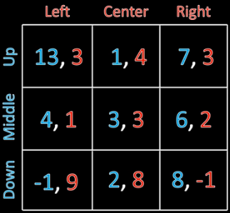
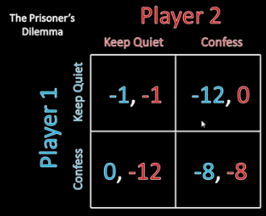
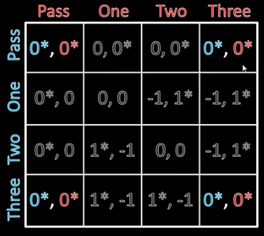
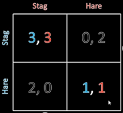

---
layout: dense
---

# Stratégies mixtes

## Occurrences

- Ex: Penalty, pile ou face -- Jeux a somme nulle
- Distribution probabiliste de stratégies pures
- Theoreme de Nash: 1 equilibre doit exister

## Algorithme de stratégie mixte

- Utilites esperees -> equations pour l'indifference a l'equilibre
  - `EU_L = sigma_u(-3) + (1-sigma_u)(1) = EU_R = sigma_u(2) + (1-sigma_u)(0)` -> `sigma_u = 1/6`
  - `EU_U = sigma_L(3) + (1-sigma_L)(-2) = EU_D = sigma_L(-1) + (1-sigma_L)(0)` -> `sigma_L = 1/3`

## Calcul des gains esperes

- Somme ponderee par les probabilités individuelles
- Ex: Bataille des sexes (boxe vs ballet): 2 equilibres purs + mixte 1/3 vs 2/3 -> gain 2/3

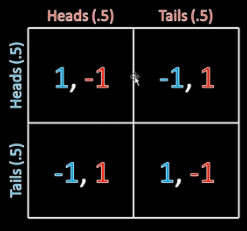
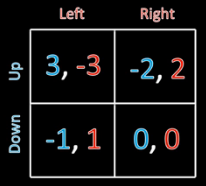
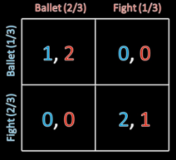

---
layout: dense
---

# Equilibres de stratégie mixte

## Stratégie mixte dominant strictement une pure

- Ex: 3 lignes, milieu dominee, calcul des probas

## Dominance faible

- Domine ou indifferente (>=)
- Elimination iterative, mais reste autres equilibres

## Equilibres infinis

- Ex: equilibres partiellement mixtes

## Règle impaire

- Presque tous les jeux ont un nombre impair d'equilibres
- Nombre infini ou pair généralement lie a la dominance faible
  - Ex nombre pair: l'argent gratuit
  - Sinon verifier si on n'a pas oublie une mixte

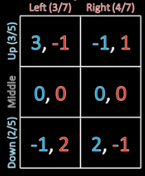
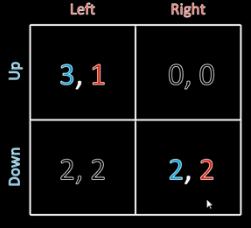
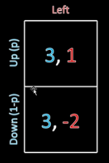
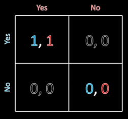

---
layout: dense
---

# Jeux séquentiels

## Jeux a tours successifs

- Conflits, negociations etc.
- Jeu de la guerre des prix (in/out)
  - Accept, out = equilibres
  - Différence = menace credible?
- Equilibre parfait de sous-jeu (SPE)
  - Sous-jeu Firm 2 -> accept
  - "out" plus en equilibre -> question des menaces credibles

## Induction arriere

- Ex: Jeu de l'escalade a la guerre
- On demarre par la fin
  - Les sous-jeux finaux eclairent les premiers

## Equilibres parfaits de sous-jeu

- Importance de reperer tous les chemins / noeuds de decision
- Equilibres de sous-jeu parfaits multiples (rare)

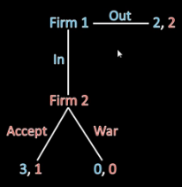
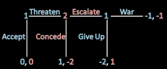
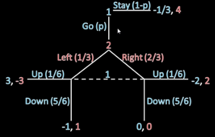

---
layout: dense
---

# Jeux a étapes

## Plusieurs manches

- Sous-jeux simultanes, Gains independants, connaissance du passe
- Difficile a dessiner (exponentiel)
- Theoremes:
  - Dernière étape -> Equilibre de Nash (passe non modifiable)
  - Autres: jouer equilibres de Nash = 1 equilibre de sous-jeu
  - Mais autres equilibres de sous-jeu possibles (cooperation)

## Stratégies de punition

- Ex: Prisonnier puis Argent gratuit -> equilibre faible (0,0) = menace de punition
- Menaces "credibles" importantes

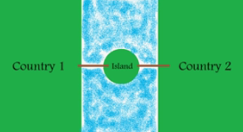

## Se lier les mains

- Ex: bruler le pont derriere soi -> Rend la menace credible

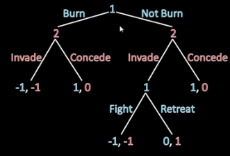

## Problemes de l'induction arriere

- Ex: le millepattes -- equilibre pessimiste, pas constate en pratique
- Hypotheses -> Maths -> conclusions (problème: rationalite limitee)
- Induction avant = passe rationnel (supprime un equilibre)

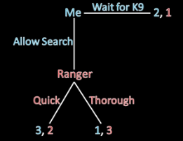
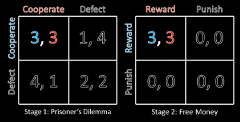

## Dilemmes repetes

- Punition perpetuelle, oeil pour oeil etc. -- Evolution de la confiance

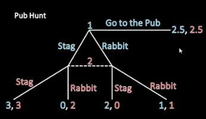
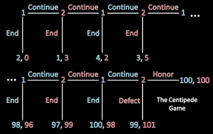

---
layout: dense
---

# Formes stratégiques avancees

## Raisonner avec des variables

- Ex: bataille des sexes, A>B>C, algorithme de stratégie mixte
  - `sigma_u = (b-c)/(a+b-2c)` et `0 < sigma_u < 1`
- Ex: Topologie complete 2x2

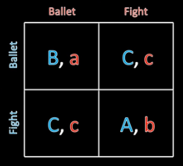B>C" style="width:100%; height:100px; object-fit:contain;">
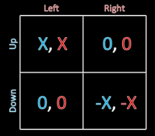
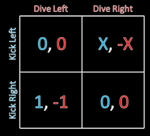

## Equilibre de lame de couteau

- X>0 -> Up, Left vs x<0 -> down, right, x=0 -> tous
- Instable autour de x=0, probabilité faible -> ignore

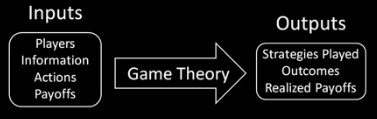

## Modèles causaux

- Proprietes causales des inputs -> Statiques comparees
  - Calcul des gradients aux equilibres
- Ex: Football penalty: `sigma_KL = 1/(1+x)`, `sigma'_KL = -1/(1+x^2) < 0`
  - -> il tire davantage son cote faible (compense)

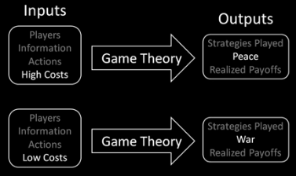

## Pierre, papier, ciseaux

- Pas de stratégie pure -> cycle
- Support des stratégies mixtes, EU egales dans le support
- Theoreme: 2 joueurs, symetrique a somme nulle -> EU = 0
- Resolution: indifference `sigma_L = 1/4` (ciseaux pour compenser)

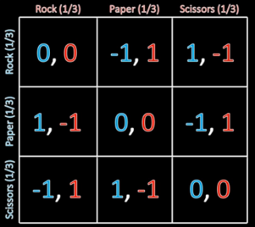
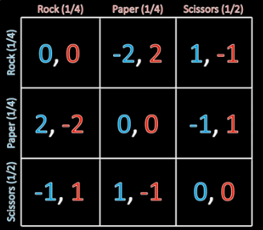

---
layout: default
---

# Espaces de stratégies infinis

## Jeux sans equilibre

- Nombre fini de stratégies pures -> Matrices + theoremes de Nash
- Certains jeux ont une infinite de stratégies pures
  - Pas de matrice, pas forcement d'equilibre de Nash

## Duels

- 100 m, 2 balles, precisions différentes (0% a 100m, 100% a 0m)
- Equilibre = même distance (preuve par contradiction)
- Ex: date de sortie de produits concurrents

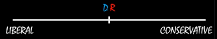

## Loi de Hotelling et l'electeur median

- 2 vendeurs de glace sur la plage, choix de l'emplacement
  - Equilibre = les deux au milieu
- Principe important en politique: theoreme de l'electeur median
  - Vainqueur de Condorcet (cf Choix social)

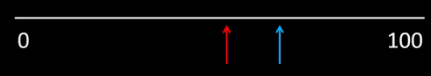

---
layout: section
---

# Jeux Bayesiens

---
layout: dense
---

# Jeux Bayesiens

## Information incomplete

- Sur les autres joueurs (ex: recompenses)
- Representation = Distribution de probabilité sur les types de joueurs
  - Information imparfaite -> Analyse probabiliste

## Formalisation

`G = <N, Omega, <A_i, u_i, T_i, tau_i, p_i, C_i>>`

- N joueurs, Omega etats de la nature, A_i actions du joueur i
- T_i type du joueur i, U_i recompense, p_i distribution des types
- Stratégies pures: `S_i = {s_i: T_i -> A_i}`

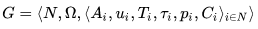

## Equilibres de Nash Bayesien

- Objectif = maximisation de la recompense esperee
- De nombreux equilibres sans restrictions supplementaires

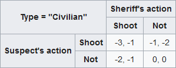

## Ex: Dilemme du Sheriff

- Criminel (p) vs civil (1-p), tirer ou pas
- Stratégies dominantes: tirer pour criminel, pas pour civil
- Pour le Sheriff: `E(tirer) = p-1`, `E(pas) = -2p`
  - p>1/3 = tirer

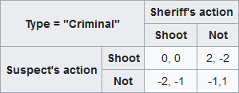1/3 pour tirer" style="display:block; margin:4px auto; max-height:70px; width:auto; max-width:100%; object-fit:contain;">

---
layout: dense
---

# Equilibres Bayesiens parfaits (PBE)

## Jeux séquentiels

- Rappel SPE -> equilibres non plausibles (menaces non credibles)
- Systèmes de croyance: assignations de probabilités sur les types
  - "Consistant" -> Probabilités par application des stratégies (Bayes)
- Rationalite séquentielle: recompense esperee maximale

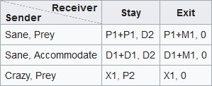

## Definition PBE

- Profile stratégique et système de croyance consistant tels que les stratégies sont sequentiellement rationnelles

## Jeux de signalisation

- Emetteur S (connait son type) -> message m, Recepteur R -> action a
- 3 catégories de PBE:
  - **Pooling**: emetteurs choisissent le même message (pas de signal)
  - **Separating**: messages toujours différents -> croyance déterministe
  - **Semi-separation** (partial-pooling): mixte

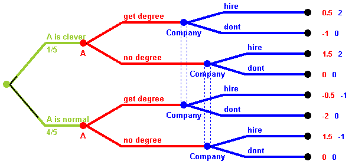

## Exemples

- Jeu de reputation (guerre des prix): pooling ou separating
- Jeu d'education: doue ou pas, diplome ou pas (signal) -> PBE de separation
- Biere-quiche: P=0.9 -> pooling, P=0.2 -> stratégies mixtes

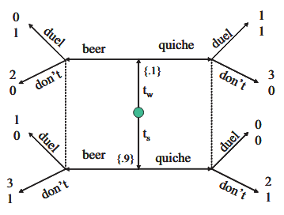

---
layout: section
---

# Questions?

---
layout: section
---

# Jeux cooperatifs

---
layout: dense
---

# Jeux cooperatifs

## Jeux d'assistance

- 2 joueurs, recompense theta incertaine pour l'assistant
- Ex: Jeu du trombone
  - Nash -> meilleure reponse myope incrementale
- Cas general similaire a un POMDP + theta

## Théorie des jeux cooperatifs

- Utilite transferable de coalition: `G = {N, v}`, `V(C) >= 0`
- Partitions = Structures de Coalitions CS(N)
- **Imputation**: `sum x_i = v(N)`, `x_i > v({i})`
- **Noyau**: imputations x telles que `x(C) > v(C)` pour tout C
- **Valeur de Shapley**: contribution marginale moyennee sur toutes les permutations
  - `phi_i(G) = 1/n! * sum mc_i(p_i)`
  - Axiomes: Efficace, joueur nul, symetrie, additivite -> unique

## Calculs

- Reseaux de contribution marginale (representation compacte)
  - `phi_i(R) = sum x/|C|` pour les coalitions contenant i
- Structures de coalition optimales: NP-Hard
  - Bons résultats avec exploration du graphe de structure

---
layout: section
---

# Conception de mécanismes

---
layout: dense
---

# Conception de mécanismes

## Théorie des jeux inverse

- Si les agents sont rationnels, quelles sont les bonnes règles?
- Dans le cadre Bayesien d'information imparfaite
  - Le "principal" souhaite inciter a reveler la vraie utilite

## Formalisme

- Le principal choisit la structure de recompense `y()`
- Les agents declarent `theta_hat` (et peuvent mentir)
- Fonction de choix social `f(theta)` a implementer par `y(theta_hat)`

## Principe de revelation

- Mécanisme incitatif verace (IC): non manipulable, revelateur
  - `theta_hat(theta) = theta`
- S'il existe un mécanisme y implementant f, alors il existe une version IC
- 2 versions:
  - **DSIC**: Implementation en stratégies dominantes
  - **BNIC**: Equilibre de Nash Bayesien (plus faible)

---
layout: dense
---

# Allocation de ressources par les encheres

## Encheres individuelles

- Valeur privee v_i de l'objet par l'individu i
- Enchere anglaise (ascendante): Efficace mais risque de collusion
- Enchere de Vickrey (second prix)
  - Equilibre DSIC = chacun declare la valeur "honnete"
  - Très repandu: eBay, AdWords etc.
- Theoreme d'equivalence de revenue

## Bien commun

- Tragedie des communs (ex: pollution)
  - Stratégie de pollution dominante mais pas optimale (Pareto)
  - Necessite d'expliciter les externalites (ex: taxe carbone)

## Mécanisme de Vickrey-Clarke-Groves (VCG)

- N Encherisseurs declarent utilite de M ressources
- Allocation maximisant la somme des utilites
- Taxe: `T_i = U_max(sans i) - U_max(sans i, sans ressource j)`

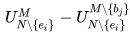

---
layout: dense
---

# Allocation par les votes

## Théorie du choix social

- Préférences individuelles rationnelles -> Ordre de préférence social
- Proprietes d'une bonne fonction de choix social:
  1. Condition de Pareto / critere d'unanimite
  2. Indépendance des alternatives non pertinentes
  3. Pas de dictature

## Résultats negatifs

- **Paradoxe de Condorcet**: A,B,C -> 2/3 de mecontents
- **Theoreme de Arrow**: Impossible de satisfaire 1, 2 et 3 simultanement (>= 3 options)
- **Theoreme de Gibbard-Satterthwaite**: Toute FCS déterministe avec Pareto et >2 choix est manipulable ou dictatoriale

---
layout: dense
---

# Critere de Condorcet

## Condition du vainqueur de Condorcet

- La meilleure aux autres options prises paire a paire
  - Ex: Uninominal a 2 tours: Bayrou vainqueur de Condorcet mais pas au 2e tour
- **Indifference aux petits candidats**: vainqueur stable aux changements
- Paradoxe de Condorcet: pas de garantie d'existence

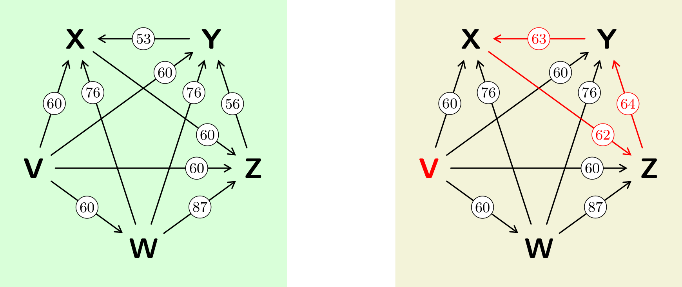

## Theoremes de l'electeur median

- 1er theoreme: Gauche-droite -> existence du vainqueur -> electeur median
- 2e theoreme: Gauche-droite + valeur intrinseque

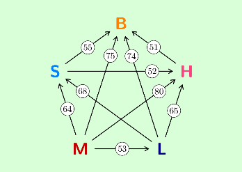

## Si pas de vainqueur de Condorcet

- Méthode **Minimax**: celui qui fait le mieux au pire
  - Mais très stratégique (ex: anarchistes)
- Méthode de **Schulze**: elimination iterative des derniers du peloton de tete
  - Robuste a la manipulation (electeurs raisonnables)

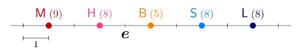

---
layout: dense
---

# Procedures de votes connues

- **Referendum**: 2 options -> méthode de la majorite robuste (la seule)
- **Vote pluraliste uninominal** (n candidats): critique (vote utile)
- **Vote a second-tour instantane**: Préférences, elimination du dernier
  - Pas de critere de Condorcet
- **Méthode de Condorcet**: comparaisons paires a paires -> Schulze

## Méthodes utilitaristes

- **Compte de Borda**: préférences, score = ordre (manipulable)
- **Vote par assentiment**: elimination, majorite d'approbation
  - Theoreme de robustesse au mensonge
- **Scrutin au jugement majoritaire**: mediane des scores
  - Seule procedure avec majorite d'une même note validee + monotonie

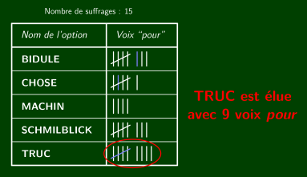
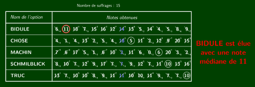
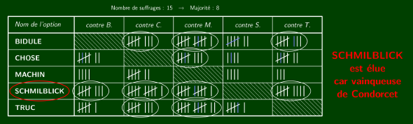

## Scrutins stochastiques

- **Scrutin Stochocratique**: option preferee puis tirage au sort
  - Theoreme d'Hylland: seule méthode avec unanimite non stratégique
- **Condorcet randomisee**: loterie ponderee dans le peloton de tete
  - Ponderation selon equilibre de Nash -- critere de Condorcet + non stratégique

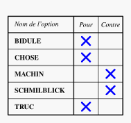
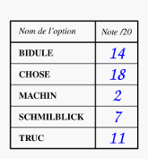
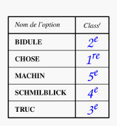

---
layout: default
---

# Allocation par la negociation

## Modèle des offres alternees

- Si pas d'accord: Accord de conflit -> fenêtre de negociation
- Nombre de manches:
  - 1 manche: Ultimatum (J1 a tout le pouvoir)
  - 2 manches: J2 a tout le pouvoir
  - N manches: JN a le pouvoir
- Agents impatients: facteurs de discompte `0 <= gamma_i < 1`
  - Offre a l'equilibre: `A_1 = (1-gamma_2)/(1-gamma_1*gamma_2)`

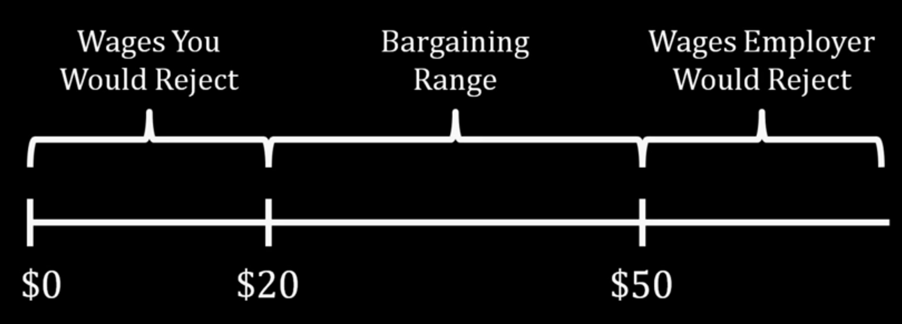

## Domaines orientes tâches

- Offres (T1, T2) de repartitions de tâches parmi T
- Protocole de concession monotone

## Stratégie de Zeuthen

- Mesure de l'aversion au risque de conflit
- Le risque plus faible concede, sinon tirage au sort

---
layout: default
---

# Théorie de la negociation

## Demarche

- Hypotheses -> Modèles de jeux -> Equilibres et pouvoirs de negociation

## Sources du pouvoir de negociation

- Pouvoir de proposition
- Patience
- Options alternatives
- Connaissance de l'autre utilite
- Monopole
- Reputation
- Engagement credible
- Signalement couteux

---
layout: section
---

# Questions?

---
layout: section
---

# Jeux differentiels

---
layout: dense
---

# Jeux differentiels

## Théorie des jeux + théorie du contrôle

- Interdependance: agents economiques, pollution, marches
- Dynamique: habitudes, technologies, accumulations, traffic
- Comportement stratégique: buts antagonistes, choix

## Definitions

- Joueurs M={1,...,m}, Vecteur de contrôle `u_j(t)`
- Vecteur d'etat `x(t)`, equation d'etat: `x'(t) = f(x(t), u(t), t)`
- Fonction de gain: `J_j = S_j(x(T)) - integral g_j dt` -> Minimisation de L

## Structure de l'information

- **Boucle ouverte**: conditions initiales + temps: `u_j(t) = mu_j(x_0, t)`
- **Markovienne**: `u_j(t) = sigma_j(t, x(t))` (lineaire, quadratique, seuil)
- Non Markovienne: utilisation de l'historique
- **Hiérarchique**: le leader annonce sa stratégie

---
layout: dense
---

# Equilibres differentiels

## Equilibres de Nash pour jeux a somme nulle

- `J_1 + J_2 = 0`, equilibres de point de selle
- P1 maximise, P2 minimise -> equilibre ssi point de selle existe

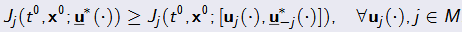

## Equilibres de Stackelberg

- Le "leader" annonce en tenant compte des reponses des autres
- Ex: croissance economique (taxe sur le capital + consommation)

## Jeux cooperatifs/competitifs

- Possibilite de dialogue -> maximisation commune
- Division en partie cooperative et partie competitive (valeur co-co)

## Equilibres en boucle ouverte

- u* est un equilibre de Nash ssi aucun joueur ne peut ameliorer seul
- Resolution: 2 optimisations -> conditions necessaires

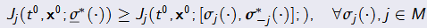

## Equilibres Markoviens

- Resolution d'equations differentielles
- Jeux lineaires quadratiques -> solution analytique

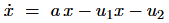

---
layout: default
---

# Méthodes calculatoires

## Méthodes directes

- Formulation du programme mathematique et resolution

## Méthodes indirectes

- Utilisation d'equations differentielles partielles

## Méthode d'echantillonnage incremental

- Ex: poursuite evasion
- RRT -> exploration d'arbre
  - Convergence avec nombre d'echantillons suffisant
  - Similaire au filtrage particulaire

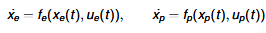
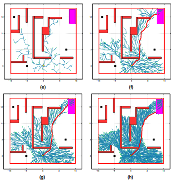

## Pour aller plus loin

- Details mathematiques dans les references du cours

---
layout: section
---

# Questions?

---
layout: section
---

# Plan du cours

---
layout: default
---

# Sommaire (suite)

- I. Introduction
- II. Resolution de problemes
- III. Bases de connaissances et logique
- IV. Incertitude et modèles probabilistes
- V. Théorie des jeux
- **VI. Apprentissage**
- VII. Traitement du langage naturel
- VIII. Presentation projets

---
layout: dense
---

# Projets de groupe

1. Moteur de recherche augmente par le raisonnement et le langage naturel
2. Conception de bots de services sur reseaux sociaux
3. Conception d'un modèle d'inference pour l'analyse de sentiment
4. Création d'une plateforme sémantique LDP
5. Resolution de Captchas par deep learning
6. Entrainement de stratégies de trading algorithmiques sur crypto monnaies
7. Amelioration par l'apprentissage d'un agent joueur de Go simple
8. Evolution de vaisseaux spatiaux par algorithmes génétiques dans le jeu de la vie
9. Pilotage d'un cluster de cache distribue pour le portage d'applications dans le Cloud

---
layout: end
---

# Merci

**Jean-Sylvain Boige**

jsboige@myia.org
