# Apprentissage

Intelligence Artificielle -- VI

**Apprentissage supervisé, apprentissage et logique, apprentissage probabiliste, apprentissage par renforcement**

- Apprentissage supervisé
  - Paramétrique
  - Non paramétrique
- Apprentissage et logique
- Apprentissage probabiliste
- Apprentissage par renforcement

---

# Plan du cours

- Introduction
- Résolution de problèmes
- Bases de connaissances et logique
- Incertitude et modèles probabilistes
- Apprentissage
- Traitement du langage naturel
- Présentation projets

---

# Sommaire

- Agents apprenants
- Apprentissage inductif paramétrique
- Arbre de décision
- Réseaux de neurones
- Apprentissage inductif non paramétrique
- Q means
- Machine à vecteur de support (SVM)
- Apprentissage de connaissances
- Apprentissage probabiliste
- Apprentissage par renforcement

---

# Apprentissage

- Essentiel dans les environnements inconnus
- Quand un concepteur n’a pas l’omniscience du problème
- Utile comme une méthode de conception de systèmes
- Exposer l’agent à la réalité plutôt qu’essayer de la lui programmer
- Modifie le mécanisme de prise de décision de l’agent pour améliorer les performances.

---

# Agent Apprenant

- **4 modules** : performance, apprentissage, critique, generateur de problemes
- Le module d'apprentissage ameliore le composant de performance a partir du feedback du critique
- Le generateur de problemes suggere de nouvelles expériences pour enrichir l'apprentissage

---

<!-- _class: dense -->

# Composant d'apprentissage

- La conception d'un composant d'apprentissage est affecté par:
  - Composants qui doivent être appris
  - Connaissance a priori qu'a l'agent
  - Représentation utilisée pour les données et le composant
  - Feedback dont on dispose pour apprendre
- Type d'apprentissage
  - Inductif: une règle générale à partir de cas particuliers
  - Déductif / Analytique:  on part d'une règle pour en dériver une autre
- Type de représentation
  - Factorisé = caractéristiques
  - Autre structures possibles (relationnelles / séquentielles / GNNs)
  - Cf. Geometric Deep-learning
- Type de feedback:
  - Apprentissage supervisé: les réponses correctes pour chaque exemple
  - Apprentissage non-supervisé: pas de réponses correctes, découverte des structures (e.g. clusters)
  - Apprentissage par renforcement: système de récompense

---

# Apprentissage inductif

- Forme la plus simple: apprendre une fonction à partir d’exemples
  - f est la fonction cible
  - Un exemple est une paire (x, f(x))
- Problème: trouver une hypothèse h:
  - Telle que  h ≈ f
  - À partir d’un ensemble d’apprentissage et d’un ensemble de test distinct (généralisation)
- Ensemble de sortie
  - Discret  Classification
  - Continue  Régression
- Simplification de l’apprentissage réel
  - Connaissances a priori ignorées
  - Suppose que les exemples sont fournis

---

# Principes de l’apprentissage inductif

- h est choisie dans un espace d’hypothèses
  - E.g. types de fonctions (polynômes)
  - De manière à égaler f sur l’ensemble d’apprentissage
- h est consistante / cohérente si elle concorde avec f sur tous les exemples
- Mesure de performances
  - Biais : déviation par rapport à f en moyenne  espace d’hypothèses: Ex: underfitting
  - Variance  déviations dues aux Données: Ex: Overfitting
  - Dilemme biais-variance
- Rasoir d’Occam
  - On choisit l’hypothèse la plus simple consistante avec les données

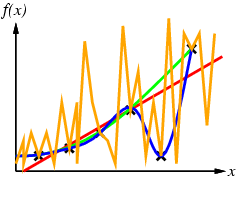

---

<!-- _class: dense -->

# Exemple: l'attente au restaurant

- Fonction d'une liste d'attributs vers une décision (e.g. vrai/faux)
- Exemple: décider d'attendre pour une table dans un restaurant, en fonction des attributs suivants:
  - Alternative: Existe-t-il un autre restaurant pas loin?
  - Bar: Est-ce que le bar est confortable pour attendre?
  - Ven/Sam: Est-ce qu'on est vendredi ou samedi?
  - Faim: A-t-on faim?
  - Clients: Combien de clients dans le restaurant ?
    - parmi {Aucun, QuelquesUns, Complet}
  - Prix: quelle est la gamme de prix ?
    - {€, €€, €€€}
  - Pluie: Pleut-il?
  - Réservation: A-t-on réservé?
  - Type: Quel est le type de restaurant ?
    - {Français, Italien, Thaïlandais, Rapide}
  - Estimation de l'attente
    - {0-10min, 10-30 min, 30-60 min, +60 min}

---

# Représentation par attributs

- Les exemples sont données par leurs valeurs d’attributs (Booléennes, discrètes, continues)
- Exemple pour le restaurant
- La classification est positive ou négative

---
layout: image-right
image: ./images/img_004.png
---

---

# Arbres de décision

- Un type de représentation pour les hypothèses
- Logiquement équivalent à une proposition disjonctive:
- But  (Chemin1 ∨ Chemin2 ∨ Chemin3)
- Exemple du restaurant:

---
layout: image-right
image: ./images/img_005.png
---

<!-- Frontiere de decision : arbre = decoupage orthogonal, foret = ensemble lisse -->

---

# Expressivité des arbres de décisions

- Ils peuvent exprimer toute fonction des attributs en entrée.
- E.g. pour des fonctions booléennes:
- table de vérité  chemin vers une feuille
- Construction triviale, consistante avec les exemples:
- un chemin pour chaque exemple, mais il ne généralisera pas
- On préfère un arbre plus compact

---
layout: image-right
image: ./images/img_006.png
---

---

# Espace d’hypothèses

- Combien d’arbres de décisions avec n attributs Booléens?
  - = Nombre de fonctions Booléennes
  - = Nombre de tables de vérités distinctes à 2n lignes = 22n
  - E.g. avec 6 attributs booléens:
  - il y a 18,446,744,073,709,551,616 arbres
- Combien d’hypothèses purement conjonctives
  - e.g Faim   Pluie
  - Chaque attribut peut être positif, négatif, omis
  - 3n  Hypothèses conjonctives distinctes
- Espace d’hypothèses plus expressif
  - Accroit la chance qu’une fonction cible puisse être exprimée
  - Accroit le nombres d’hypothèses consistantes avec l’ensemble d’apprentissage
  - Avec potentiellement de plus mauvaises prédictions

---

# Apprentissage d’arbres de décision

- But: trouver un petit arbre consistant avec les exemples
- Idée: choisir (récursivement) l’attribut le plus important comme racine de l’arbre (du sous arbre)

---
layout: image-right
image: ./images/img_007.png
---

---

# Choix d’un attribut

- Idée: un bon attribut  divise les exemples en sous-ensembles discriminants (positifs ou négatifs)
- Clients ? Est un meilleur choix

---
layout: image-right
image: ./images/img_008.png
---

---

# Utilité de la théorie de l’information

- Pour implémenter la fonction Importance dans l’algorithme d’apprentissage d’arbres de décisions
- Entropie d’une variable aléatoire
- Mesure du contenu informationnel
- I(E) = I(P(v1), … , P(vn)) = Σi=1 -P(vi) log2 P(vi)
- Pour un ensemble d’apprentissage contenant
- p exemples positifs
- n exemples négatifs:
- Ex: 1 lancé de pièce  = (2/2) log2 2 = 1 bit
- Ex: 1 dé non pipé: (6/6) log2 6 = 2.58 bits
- Distribution uniforme  plus d’information

---
layout: image-right
image: ./images/img_009.png
---

---

# Code de Huffman

- En 1952 au MIT, dans le cadre d’un travail scolaire:
- Encodage élégant de messages
- **avec Probabilités des symboles**
  - des puissances entières de ½
- Construction du code:
- **Tri des symboles selon**
  - la fréquence
- **Combinaison de symboles**
  - les moins fréquents
- Tracé d’un chemin
- ** Arbre de décision**
  - optimal
- encodage robuste
- Msg.	Prob.
- A		.125
- B		.125
- C		.25
- D		.5

---

# Gain informationnel

- A divise E en sous-ensembles E1, … , Ev selon leur valeurs pour A, avec v valeurs pour A
- Gain d’information (IG) ou réduction en entropie du test sur l’attribut:
- On choisir l’attribut avec le plus gros IG (« importance »)
- Exemple clients / type:
- Ensemble d’apprentissage: p = n = 6, I(6/12, 6/12) = 1 bit d’information (= pièce)
- Clients a le IG le plus fort de tous les attributs donc il est choisi comme racine

---

# Exemple d’arbre appris

- Arbre de décision appris à partir des 12 exemples:
- Substantiellement plus simple que l’arbre « naturel »
- Une hypothèse plus complexe n’est pas requise par les données

---
layout: image-right
image: ./images/img_010.png
---

---

# Efficacité des arbres de décision

- Méthode d’apprentissage la plus élémentaire
- Très efficace sur de nombreux problèmes
- Dans beaucoup de cas similaire à l’expertise humaine et fournissant de meilleures performances
- Diagnostic des cancers du sein:
- 65%  homme
- 72%  arbre
- BP: conception d’un arbre de décision pour la séparation gaz/pétrole en remplacement d’un ancien système expert.
- Cessna a conçu un pilote automatique avec 90000 exemples et 20 attributs par exemple

---

# Extensions de l’algorithme d’apprentissage

- Utilisation de ratios de gain
- Domaines de données réelles / continues
- Génération de règles
- Elagage
- Algorithmes C4.5 puis See5
- Combinaison de la plupart des optimisations
- See5 beaucoup plus rapide mais uniquement en GPL

---

# Ratios de gain

- Le critère de gain d’information favorise les attributs qui ont un grand nombre de valeurs
- Si D a une valeur distincte pour chaque exemple, I(D,E) = 0 et donc IG(D,E) est maximal
- Pour compenser, Quinlan remplace IG par le ratio:
- GainRatio(D,E) = IG(D,E) / SplitInfo(D,E)
- SplitInfo(D,E) est l’information due à la partition de E sur les bases de l’attribut catégoriel D
- SplitInfo(D,E)  =  I(|E1|/|E|, |E2|/|E|, .., |Em|/|E|)
- SplitInfo(Clients, E)= - (1/6 log 1/6 + 1/3 log 1/3 + ½  log ½) 				=0.36
- GainRation(Clients, E) = 1.47

---

# Valeurs réelles

- On sélection un ensemble de seuils définissant des intervalle
- Chaque intervalle devient une valeur discrète de l’attribut
- Diviser selon:
- Des heuristiques simples (médianes, quarts etc.)
- Les connaissances du domaine (nourisson 0-1, tout petit 3-5 écolier 5-8 etc.)
- Le résultat d’un nouveau problème d’apprentissage
- On teste et on regarde l’efficacité
- On utilise la dichotomie

---

# Conversion des arbres de décision en règles

- Dériver un ensemble de règle d’un arbre de décision:
- Ecrire une règle pour chaque chemin dans l’arbre de décision depuis la racine à une feuille
- Dans cette règle la partie de gauche est dérivée facilement des nœuds et labels des chemins
- Les règles résultantes peuvent être simplifiées:
- Si en supprimant des conditions, les sous-ensembles sont les mêmes
- Par des métaconditions (« en l’absence d’autre règle spécifique …»)

---

# Elagage des arbres de décision

- L’élagage d’un arbre de décision consiste à remplacer un sous arbre par une feuille.
- Le remplacement a lieu si la règle de décision établit que le taux d’erreur espéré dans le sous arbre est plus grand que celui dans la simple feuille
- Exemple pour un attribut couleur
- Entrainement: 1 rouge vrai et 2 bleu faux
- Test: 3 rouges faux et un bleu vrai
- Remplacement par Faux  2 erreurs au lieu de 4

---

# Résumé arbres de décision

- L’induction d’arbres de decision est l’une des methodes d’apprentissage les plus utilisees
- Surpasse les humains dans de nombreux problemes, apprentissage par gain informationnel
- **Points forts** : rapide, simple, comprehensible, empiriquement valide, robuste au bruit
- **Points faibles** :
  - Decoupe a un seul attribut : limite les types de problemes supportes
  - Les arbres de grande taille deviennent difficiles a interpreter
  - Necessite des vecteurs de taille fixe, non incremental (batch)

<!-- Frontiere de decision : arbre = decoupage orthogonal, foret = ensemble lisse -->

---
layout: center
---

# Questions?

---
<!-- _class: columns-layout -->

# Mesure de performance

- Comment sait-on que h ≈ f ?
  - Utilisation des théorèmes de la théorie de l’apprentissage
  - Hypothèse de stationnarité de la distribution des exemples
  - On essaie h sur un nouvel ensemble de test d’exemples
  - On utilise la même distribution sur l’espace des exemple
- Courbe d’apprentissage
- **= % de réponses correctes**
  - sur un ensemble de test
  - comme fonction de la taille
  - de l’ensemble d’apprentissage
  - Et parfois double-descente
- Et parfois double-descente
- **Attention au dévoilement**
  - de l’ensemble de test:
- **Si on change d’hypothèse,**
  - il faut régénérer l’ensemble de test
- **Sinon l’ensemble de test a « fuité »**
  - dans l’apprentissage.

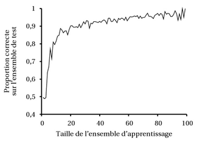
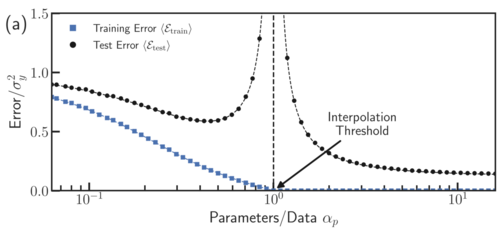

---
<!-- _class: columns-layout -->

# Généralisation et surapprentissage

- Toute sorte de « bruits » peuvent apparaitre dans les exemples
  - 2 exemples ont les mêmes attributs mais pas la même classe
  - valeurs incorrectes du fait d’erreur d’acquisition ou de traitement
  - Mauvaise classification à cause d’erreur
  - Certains attributs ne sont pas pertinents dans la décision
- Le dernier problème peut conduire à un surapprentissage
  - Si l’espace des hypothèses a de nombreuses dimensions due à ses attributs, on peut trouver des régularités insignifiantes dans les données
  - On corrige en élaguant les nœuds insignifiants de l’arbre
  - Par exemple, si le IG est en dessous d’un seuil, pas de branche
- Etablissement de la Signifiance statistique vis-à-vis de l’hypothèse nulle
  - Par exemple seuil de 5% d’écart sur la déviation total
- Elagage χ2 du nom de la distribution de la déviation
  - = test du  « khi-deux » en statistiques
  - Hypothèse nulle = variable indépendantes
  - Théorème central limite: n → ∞  distribution χ2

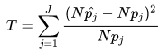

---
<!-- _class: columns-layout -->

# Choix de la meilleure hypothèse

- Ensembles d’apprentissage et de test
  - Taux d’erreur = proportion d’erreurs
- Sélection et optimisation
  - Hyperparamètres
  - Nécessité d’un troisième ensemble: ensemble de validation
  - = Validation croisée « hold out » (cross validation)
  - Mais sous-utilisation non optimale des données
  -  Validation croisée k-uple: batchs successifs (k tests tirés)
- Choix du modèle: complexité vs précision
  - Optimisation  Taille (degré polynôme, nœuds arbre)
  - Emballage: Enumération des modèles selon taille et résultats
- Taux d’erreur  fonction de perte (Loss)
  - F(x) = y, h(x) = y’  L(x,y,y’) = Utilité(y/x) – utilité (y’/x)
  - Ex: L(spam, non spam) >> L(non spam, spam)
  - Ex: Normes: L0/1 = seuil, L1 = abs, L2 = perte quadratique
  - Score F1 = 2* Precision * Recall / (Précision + Recall)

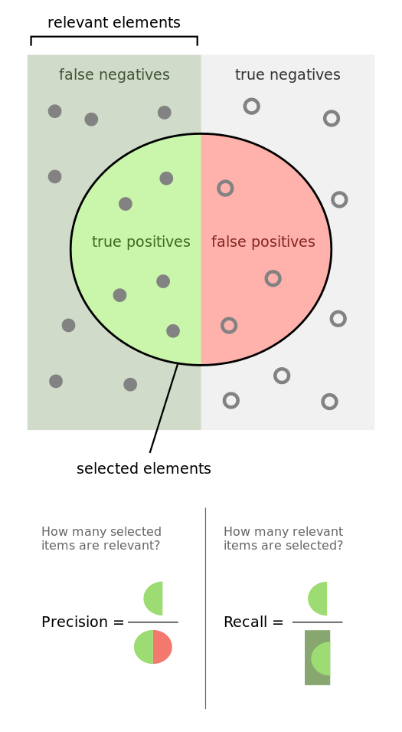
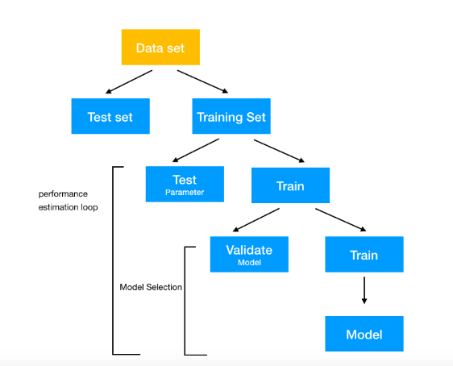

---

# Du taux d'erreur à la perte

- Perte Générale:
- Importance de la loi de probabilité P(x,y)
- On veut minimiser PerteGen mais P pas disponible
-  Perte empirique   (estimation dans E)
- Causes: irréalisabilité, variabilité, bruit, complexité
- Pénalisation de la complexité = régularisation
- Ex: sommes des (coef)2
- Diminution des dimensions
-  sélection d’attributs  (ex: élagage khi-2)
- Utilisation de la même échelle (Entropie)
- Longueur de description minimale
- MDL = taille totale modèle + corrections données en bits

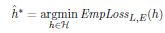
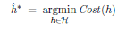

---

# Théorie de l'apprentissage

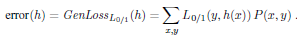
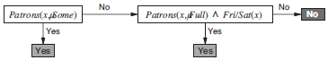

---

<!-- _class: dense -->

# Méthodes d'ensemble

- Jusqu’à présent: 1 seule hypothèse
- Apprentissage d’ensemble = ensemble d’hypothèses
- Si indépendantes  probabilité faible de mauvaise prédiction
- En pratique pas indépendantes mais juste pas trop corrélées
- Ex: Random Decision Forests: sélection aléatoire sur ensemble d’apprentissage
- Méthode courante = Boosting
- Apprentissage pondéré = les exemples ont un poids
- Du coup, K-hypothèses
- en commençant à Wj=1
- en augmentant les poids des exemples mal classifés aux hypothèses suivantes
- hypothèses combinées et pondérées par leurs performances
- Ex: ADA Boost
- Converge vers un classificateur parfait si K grand
- Utilisation de souches de décisions (stubs)
- = arbres à 1 nœud racine
- Fonctionne bien (approxime le Bayesian learning)
- Apprentissage en ligne
- Données changent rapidement
-  Ajustement au fur et à mesure des prédictions
- Algorithme aléatoire de majorité pondérée
- Mesure du regret au meilleurs experts
- et ajustement des poids pour pénaliser les mauvais experts

---
layout: image-right
image: ./images/img_020.png
---

<!-- Bagging = echantillons paralleles, Boosting = echantillons sequentiels ponderes -->

---
layout: center
---

# Questions?

---

# Classification lineaire

- Separer les classes par un hyperplan dans l'espace des caractéristiques
- Fonction de decision : f(x) = sign(w . x + b)
- Limite : ne fonctionne que si les données sont lineairement separables

---
layout: image-right
image: ./images/img_021.png
---

---

# Regression logistique

- Sortie = probabilité d'appartenance a une classe via la fonction sigmoide
- Frontiere de decision lisse, interpretable, rapide a entrainer
- Base des classificateurs lineaires modernes

---
layout: image-right
image: ./images/img_022.png
---

<!-- Regression : lineaire = droite, polynomiale = courbe, risque de surapprentissage -->

---
<!-- _class: columns-layout -->

# Réseau de neurones artificiels

- Unité de McCulloch-Pitts
- Inspiration biologique
- Simplification élémentaire
-  Multi-Perceptrons
- Structure
- Unités / neurones
- Connexions / poids
- Fonction d’activation
- Couches
- Feed-Forward
- 1 ou plusieurs couches successives
-  unités cachées
- Graphe orienté acyclique
- Pas d’état interne
- Récurrent
- Connexions réentrantes
-  système dynamique, états stables
-  mémoire à court terme mais plus complexe à comprendre / maîtriser

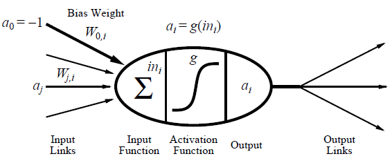

---

# Réseaux de neurones à une couche

- Toutes les unités opèrent séparément
- Pas de poids partagés
- Apprentissage par descente de gradient
- Wj   Wj + Err g’(in)xj
- Apprend sur des datasets linéairement séparable
- vs Arbre de décision: bon sur majorité, mauvais sur restaurant

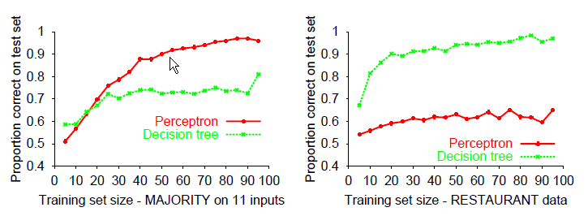
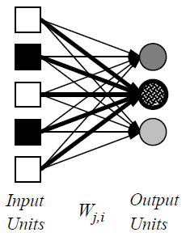

---

# Réseaux feed-forward multi-couches

- Structure
- couches généralement entièrement connectées
- Nombre d’unités cachées choisi empiriquement
- Expressivité  Régression non linéaire
- **Fonctions continues**
  - avec 2 couches
- 2 seuils  1 crète
- **Toute fonction avec**
  - 3 couche
- 2 crètes  1 bosse
- Niveaux d’abstractions:
- Ajouter des couches
-  ajouter des dimensions
- **Similaire à une classification**
  - par hyperplan dans l’espace cible

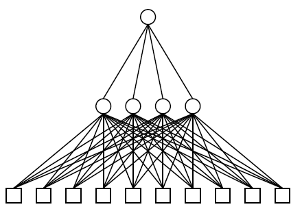
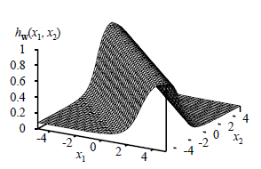
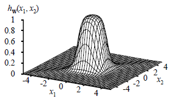
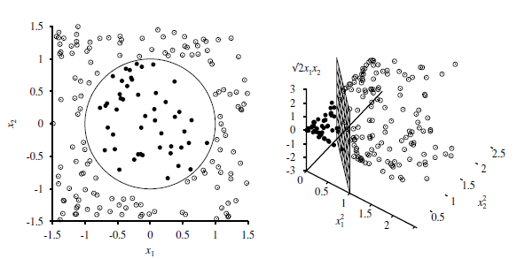

---

# Apprentissage par retropropagation

- **Principe** : propager l'erreur de la sortie vers les couches cachees
- Calcul du gradient de l'erreur par la règle de la chaine (chain rule)
- Mise a jour des poids : W_j ← W_j - alpha * dE/dW_j
- Permet d'entrainer des réseaux multi-couches (invention cle du deep learning)

---
layout: image-right
image: ./images/img_031.png
---

---

# Mise en œuvre de la rétropropagation

- A chaque époque on somme et on applique les mise à jour de gradients
- Courbe d’apprentissage
- Dataset du restaurant
- 100 exemples
- Convergence exacte
- Caractéristiques
- Bons pour les taches de reconnaissance complexe
- Convergence peut être lente
- Soucis de Minima locaux / surapprentissage
- Eviter trop de paramètres / d’unités
- Validation croisée nécessaire
- Algorithme du dégât de cerveau (similaire à l’élagage d’arbre)
- Couches Dropout
- Inverse = pavage (similaire à l’apprentissage de listes de décision)
- Les hypothèses sont assez opaques

---
layout: image-right
image: ./images/img_032.png
---

---

# Apprentissage profond

- Classificateurs multicouches traditionnels:
- Les caractéristiques intermédiaires sont non supervisées
- Réseaux profonds
- Représentation hiérarchiques
- Plusieurs niveaux de transformations de caractéristiques
- Hiérarchisation naturelle
- **Pixel, bord, teston, motif,**
  - partie, objet
- **Caractère, mot, groupe,**
  - clause, phrase, histoire
- ** fonctionne bien car**
  - le monde est hiérarchique
- Librairies de Deep learning

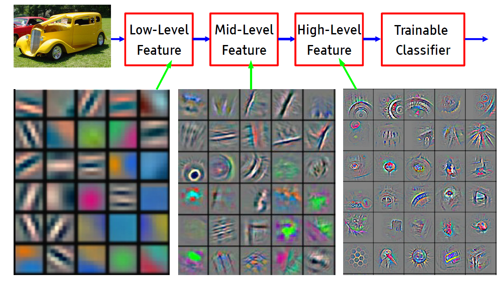
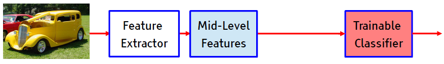

<!-- Architecture NN : entrée → couches cachees (activation ReLU/sigmoid) → sortie -->

---

# Réseaux Convolués LeNet

- Fonction d’activation non linéaire:
- Rectified Linear Unit
- Meilleures caractéristiques que Sigmoïde
- Motivation biologique
- Cellules Simple: détection locale
- Complexes: « Pooling »
- Noyaux de convolution
- Appliquées sur  inputs
- Stridingsaut d’un masque à l’autre
- Padding Gestion des bords
- Couches de pooling
- Réduction de définition
- agrégation spatiale
- Architecture globale
- + normalisation
- + mise en série

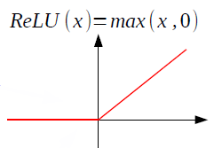

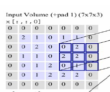
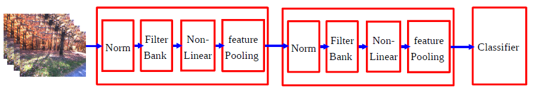

<!-- CNN : convolution → feature maps → pooling → couches denses → classification -->

---

# Auto-Encodeurs

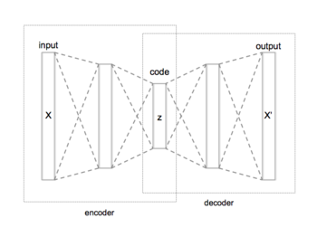

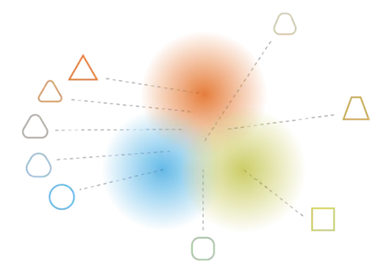
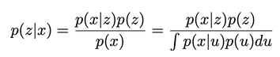
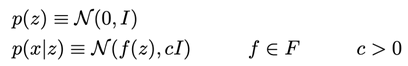
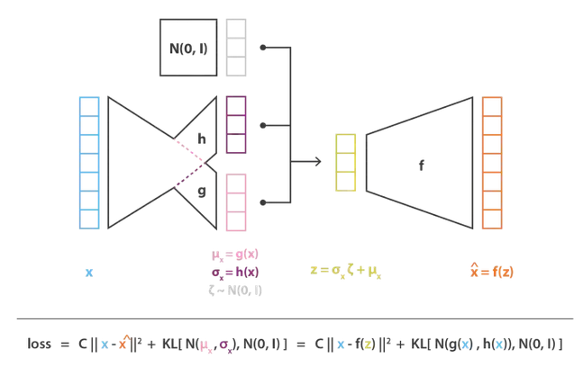

---

# Réseaux résiduels (ResNets)

- Problème:
- Augmentation de la profondeur
-  Dégradation des performances
- Vanishing /Exploding gradient
- Intuition
- Surface de perte découpée
- F(x) = x difficile à faire converger
- Solution:
- Courts-circuits F(x) = x
- Avec ou sans convolution
-  Architectures très profondes
- Plus récemment
- DenseNets:
- Addition  Concaténation
- RoR = Resnets of Resnets
- U-Nets
- Down+Upsampling (autoencodeur)
-  Segmentation d’image
- Ajout de connexions résiduelles
-  Amélioration de la précision
- V-Nets, U-Nets++ etc.

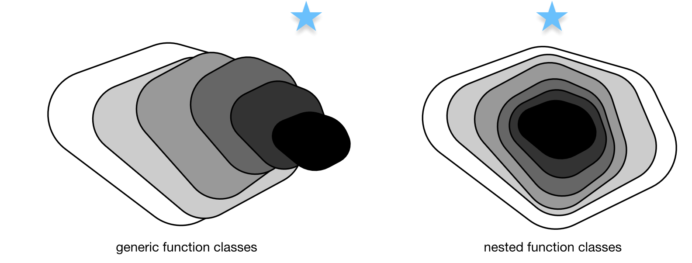
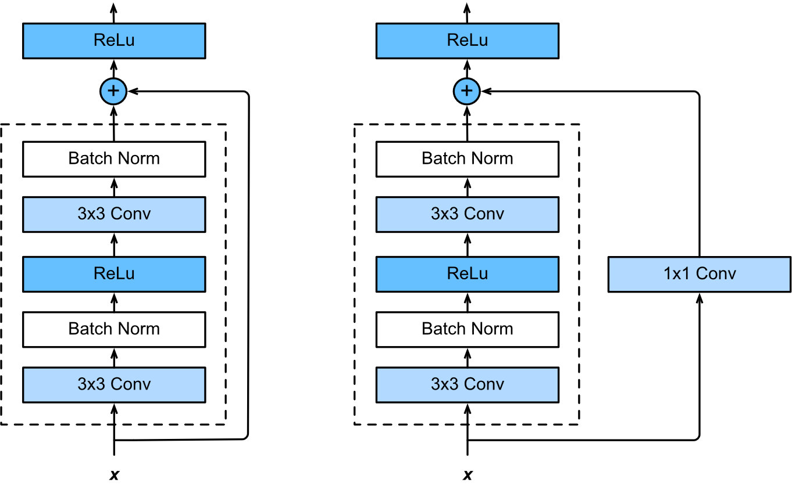
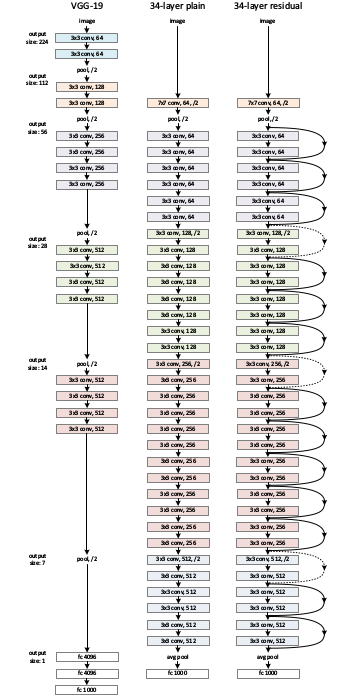
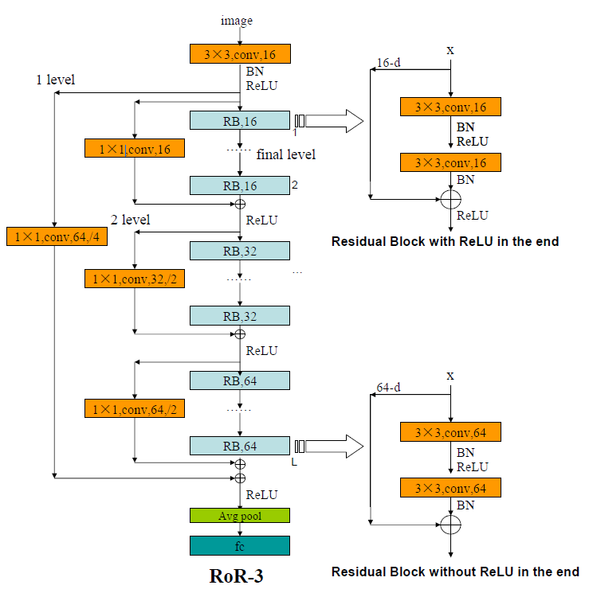
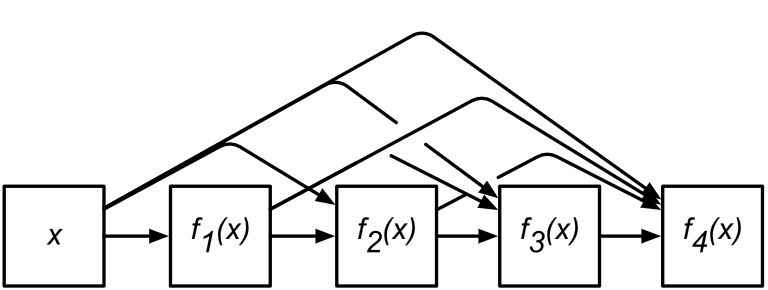
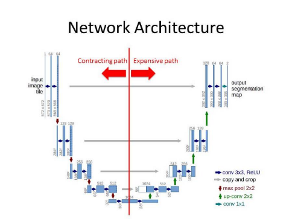

---

# Réseaux antagonistes génératifs (GANs)

- Principe
- Apprentissage non-supervisé
- Jeu à somme nulle
- Deux NN en compétition
- Générateur
- Produit des faux
- Déconvolution
- Discriminateur
- Détecte les faux des vrais
- Applications
- Génération d’images
- Texte à image
- Image à image
- Transfert de style
- Arithmétique d’images
- Découverte de médicaments
- Génération en 3D
- Nettoyage audio

---
layout: image-right
image: ./images/img_054.png
---

---

# Réseaux récurrents - RNNs

- Réseaux récurrents
- Pensées persistantes  Connexions réentrantes
- Peuvent être vus « dépliés »
- Objectif= mémoire à court terme
- Dans les signaux séquentiels
- Ex: « Il y a des nuages dans le ???? »
- Réseaux LSTM
- MAJ d’un état de cellule
- Des portes (σ) contrôlent les MAJ
- Opérations simples
- Passe ou pas / Ajout du signal / Activation  tanh
- Ex. Sujet de la phrase
- Porte 1: On oublie le précédent
- Porte 2: On MAJ le sujet courant
- Porte 3: On le passe en sortie pour le verbe
- Variante : Gated Recurrent Unit
- Simplification des portes
- RNNs profonds
- Interactions Observation / états latents
- + d’expressivité Ajout de couches
- Réseaux bidirectionnels
- J’ai ___ faim, je pourrais manger un bœuf.
- But= tirer profit du futur

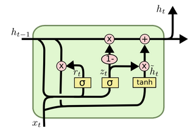
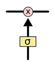
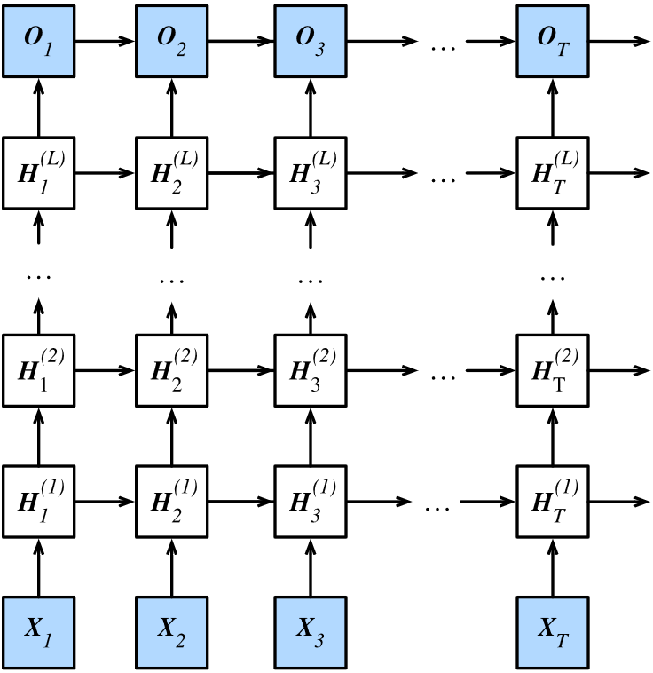
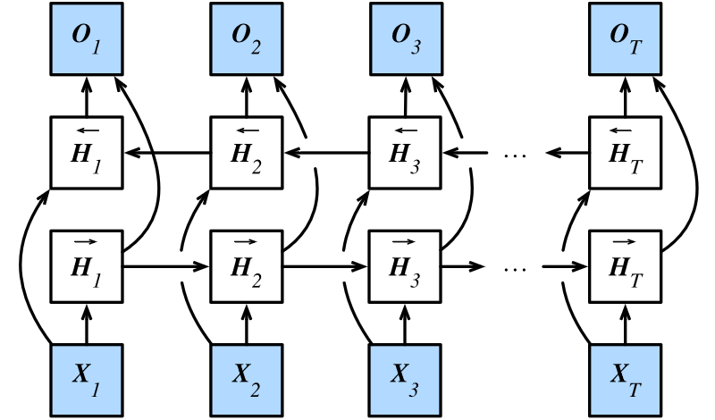

---
<!-- _class: columns-layout -->

# Mécanisme d'attention

- Inspiration naturelle
- Focalisation  économie de ressources
- Principe algorithmique
- Filtrage contextuel en sortie
- Seq2Seq
- Encodeur/décodeur
- Délocalisation
- Implémentation RNN
- Problème: Expressivité
- Création d’un contexte
- Filtrage de proximité
- Transformers
- Construits sur le MA
- Encodage positionnel
- Auto-attention multi-tête
- Produit scalaire
- Transfer learning
- Modèles agnostiques pré-entraînés
- Exemples NLP
- Bert (Google)
- GPT-2 (Open AI)
- Vulgarisation
- 3Blue1Brown
- Attention
- Tranformers
- LLM VIzualisation

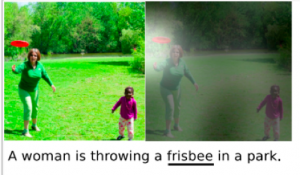

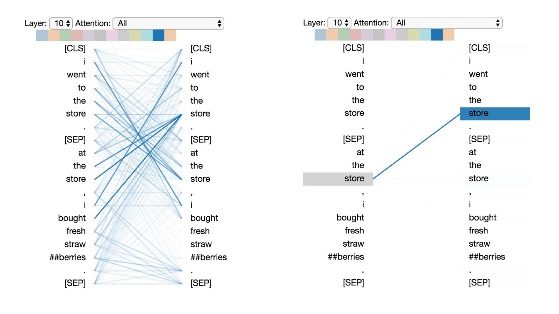
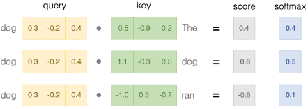
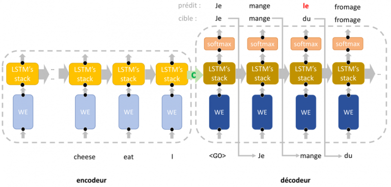
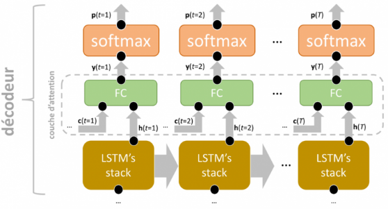
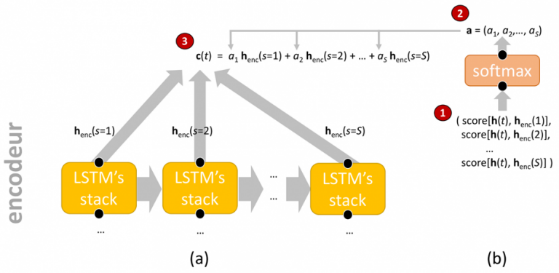
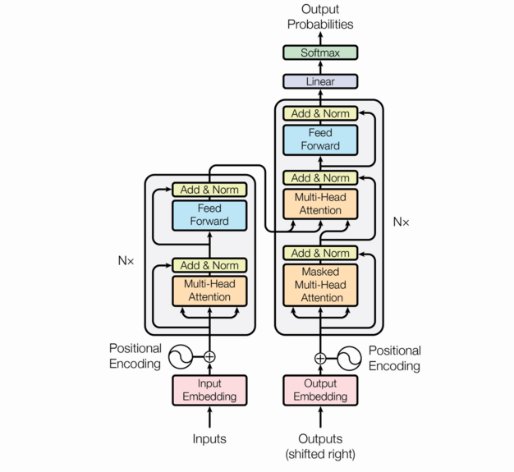

---

# Modèles multimodaux

- Combinaison de plusieurs modalités
- E.g. Texte + Image, 3D, Audio etc.
- Datasets fournissant les combinaisons
- Encodeurs
- Dans les modalités respectives
- Entrainement
- Rapprochement des embeddings
- Encodeurs réutilisables

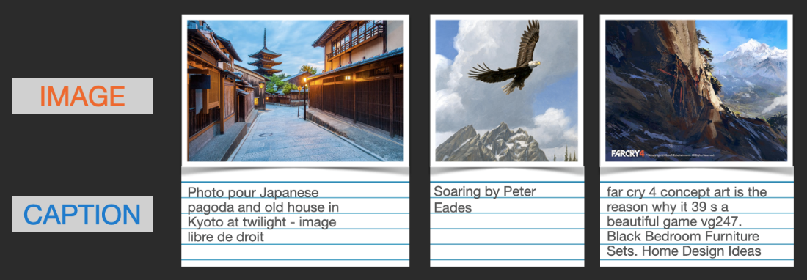
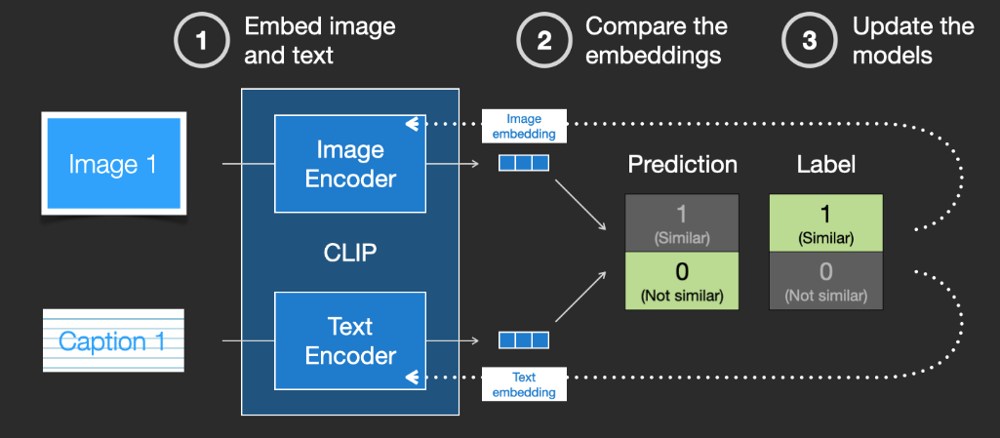

---

# Modèles de diffusion

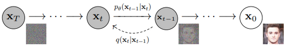
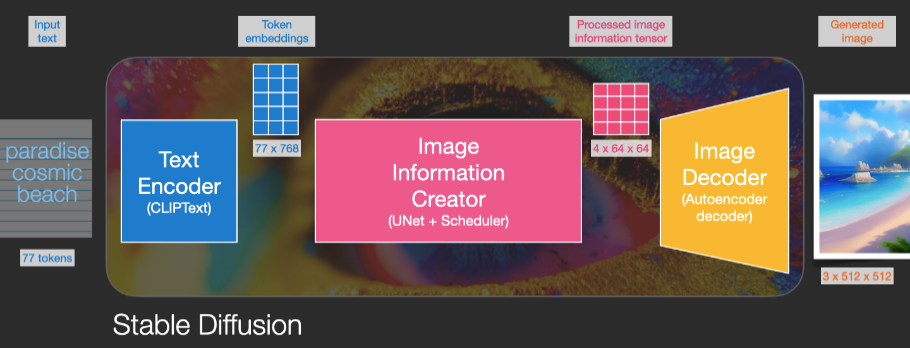

---

# Graphs Neural Networks (GNNs)

- Graphes G = (V,E)
- GNN opère sur la structure de G
- Ex: Classification des noeuds: Xv  Tv
- Caractéristiques x de v, Plongement h de v:
-  agrégation =Contraction itérative (Banach)
- GNN opérant sur h et x
- Perte optimisée (GD)
- Variantes
- Point fixe abandonné
-  Couches distinctes plus flexibles (MLPs)
- DeepWalk (plongement appris)
- Random Walk  skip-grams (~Word2Vec)
- Softmax hierarchique (optimisation)
- GraphSage
-  DeepWalk pas adaptatif
- Solution: Agrégation de voisinage
- Ex: Moyenne, MaxPooling
- Librairies
- PyTorch Geometric
- Deep Graph Library
- tf_geometric

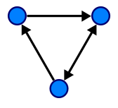
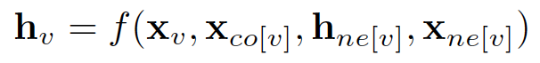

---

# Résumé réseaux de neurones

- Les Perceptrons (1 couche) sont insuffisamment expressifs
- Les réseaux multi-couches sont suffisamment expressifs
- Ils peuvent être entrainés par rétropropagation / Autodiff
- Récents progrès avec Deep learning, convolutions, RNNs, GANs, Tranformers, Diffusion, GNNs etc.
- Applications multiples
- Discours, conduite, écriture, fraude, Image, 3D, Musique etc.
- Ingénierie, modélisation cognitive et neurosciences ont largement divergé

---
layout: center
---

# Questions?

---

# Modèles non paramétriques

- Decision trees and neural nets are a kind of model-based learning
- We take the training instances and use them to build a model of the mapping from inputs to outputs
- This model (e.g., a decision tree) can be used to make predictions on new (test) instances
- Another option is to do instance-based learning
- Save all (or some subset) of the instances
- Given a test instance, use some of the stored instances in some way to make a prediction
- Instance-based methods:
- Nearest neighbor and its variants
- Support vector machines

---

# Plus proche voisin

- Plus proche voisin simple :
- Sauvegarder toutes les instances d’entraînement Xi = (Ci, Fi) in T
- Etant donnée une nouvelle instance de test Y, trouver l’instance Xj qui est la plus proche de Y
- Prédire la classe Cj
- Qu’est-ce que “proche” veut dire?
- En pratique: distance Euclidienne dans l’espace des caractéristiques
- = Distance de Minkowski Lp avec P = 2
- Alternatives:
- distance Manhattan,
- Hamming (Booléen)
-  # de caractéristiques différentes
- Ou tout autre métrique sophistiquée
- La Normalisation peut être importante (moyenne et écard type - l’échelle a un impact)
- You can make anything up, so long as it respects the Triangular Inequality
- Ex: Mahalanobis (covariance entre dimension)

---

# Nearest Neighbor Example:Run Outside (+) or Inside (-)

- Humidity
- Temperature
- 0
- 100
- 0
- 100
- +
- +
- +
- +
- -
- -
- -
- -
- -
- -
- -
- +
- +
- Noisy data
- Not linearly separable
- ?
- ?
- ?
- ?
- -
- -
- ?
- ?
- ?
- +

---

<!-- _class: dense -->

# K-Nearest Neighbor

- What if the data is noisy?
- Generalize to k-nearest neighbor
- Find the k closest training instances to Y
- Use majority voting to predict the class label of Y
- Better yet: use weighted (by distance) voting to predict the class label
- Choosing K:
- Avoid ties: choose k to be odd!
- K too low: overfitting the model
- K too high: underfitting the model
- Limites: malédiction de la dimensionalité
- En grande dimension, les voisins ne sont plus proche du tout.
- Speed considerations:
- Can we use binary trees to speed up search? Arbres k-d
- Mais limites
- Ok dimension 10 avec des 1000ers d’exemple, dimension 20 avec des millions
-  Hachage sensible à l’emplacement (Locally Sensitive Hash)  projections probabilisée
- Regression par les k-plus proches voisins
- 2 voisins = Manières de relier les points
- Mieux: moyenne ou regression sur k-voisins
- Mieux: un noyau pour pondérer les poids des voisins
-  idée reprise par les SVMs

<!-- Clustering : données brutes → k-means/DBSCAN → groupes identifies -->

---

# Classificateurs Linéaires

- Classer des données en 2 catégories : **positif (+1)** et **négatif (−1)**
- Décision par **hyperplan** : f(x, w, b) = sign(w · x + b)
  - **w** : vecteur normal à l'hyperplan
  - **b** : biais (décalage du seuil de décision)
- De nombreux hyperplans peuvent séparer des données linéairement séparables

<!-- Classificateur linéaire : frontière w·x + b = 0 sépare les deux classes -->

---

# La Marge du Classifieur

- La **marge** = distance entre l'hyperplan et les exemples les plus proches de chaque classe
- Intuition : une grande marge = classifieur plus robuste aux nouvelles données
- Définition formelle :

| Zone | Équation |
|------|----------|
| Plan positif | w · x + b = +1 |
| Frontière | w · x + b = 0 |
| Plan négatif | w · x + b = −1 |
| Marge totale | **M = 2 / ‖w‖** |

<!-- Marge = zone tampon entre les deux classes ; maximiser la marge améliore la généralisation -->

---

# Marge Maximale — Intuition

- L'hyperplan à **marge maximale** est le "meilleur" classifieur linéaire parmi tous les séparateurs
- Intuition géométrique :
  - Une petite perturbation de l'hyperplan ne cause pas d'erreur de classification
  - Le classifieur est **immune au retrait** de tout exemple non-vecteur-de-support
- Fondement théorique : lié à la **dimension VC** (Vapnik-Chervonenkis) et à la généralisation

<!-- SVM : maximiser la marge revient à minimiser ||w|| sous contraintes de classification -->

---

# Vecteurs de Support

- Les **vecteurs de support** sont les exemples d'entraînement exactement sur les plans ±1
- Ce sont eux qui définissent et "supportent" la frontière optimale
- Propriétés remarquables :
  - Le modèle SVM **ne dépend que** de ces quelques exemples (représentation sparse)
  - Retirer un exemple non-vecteur-de-support **ne change pas** le modèle
  - Permet une validation croisée leave-one-out (LOOCV) efficace

<!-- Vecteurs de support : seuls exemples critiques qui définissent la frontière optimale -->

---

# Calcul de la Marge

Soit x⁻ sur le plan négatif, x⁺ le point le plus proche sur le plan positif :

- **x⁺ = x⁻ + λw** (car w est perpendiculaire aux deux plans)
- De w · x⁺ + b = +1 et w · x⁻ + b = −1, on déduit :
- Substitution : −1 + λ‖w‖² = 1 → **λ = 2/‖w‖²**

$$M = |x^+ - x^-| = \lambda\|w\| = \frac{2}{\|w\|}$$

**Maximiser M revient à minimiser ½ ‖w‖²**

<!-- Dérivation : marge = 2/||w||, optimisé via programmation quadratique convexe -->

---

# Optimisation du SVM Linéaire

**Problème primal** : minimiser ½ ‖w‖² sous les contraintes :

$$y_i(w \cdot x_i + b) \geq 1 \quad \forall i$$

- Problème de **programmation quadratique convexe** (QP)
- **Optimum global garanti** (pas de minimum local)
- Via la **formulation duale de Lagrange** :
  - On travaille avec les produits scalaires xᵢ · xⱼ
  - Seuls les vecteurs de support ont un multiplicateur λᵢ > 0
  - Ouvre la voie au **kernel trick**

<!-- Formulation duale : base mathématique pour les SVMs à noyaux non-linéaires -->

---

# Apprentissage des SVM

- **Astuce 1** : Identifier les points les plus proches du plan de separation optimal (les "vecteurs supports") et travailler directement a partir de ces instances.
- **Astuce 2** : Formuler comme un probleme d'optimisation quadratique et utiliser les techniques de programmation quadratique.
- **Astuce 3** (le "kernel trick") :
  - Au lieu d'utiliser directement les caractéristiques, representer les données dans un espace de grande dimension construit a partir de fonctions de base (combinaisons polynomiales et gaussiennes des caractéristiques d'origine).
  - Trouver un hyperplan separateur / SVM dans cet espace de grande dimension.
  - Resultat : un classifieur non lineaire !

<!-- SVM : hyperplan optimal, vecteurs supports sur la marge maximale -->

---
layout: image-right
image: ./images/img_086.png
---

---

# Noyaux SVM — Fonctions de Base

Pour les données **non linéairement séparables**, le **kernel trick** projette implicitement dans un espace de grande dimension :

| Noyau | Formule K(x, z) | Usage |
|-------|-----------------|-------|
| **Polynomial** | (x · z + c)^d | Frontières polynomiales |
| **RBF (Gaussien)** | exp(−‖x−z‖²/2σ²) | Classification généraliste |
| **Sigmoïde** | tanh(α x·z + c) | Analogue réseau de neurones |

Le calcul dans l'espace projeté se fait **sans projeter explicitement** (astuce du noyau).

<!-- Kernel trick : SVM non-linéaire par transformation implicite dans un espace haute dimension -->

---

# Performance Empirique des SVMs

- **Excellents résultats** jusqu'aux années 2010 (texte, bioinformatique, vision, finance)
- **Avantages** :
  - Optimum global garanti (problème convexe, pas de minimum local)
  - Bonne généralisation en haute dimension
  - Fondements théoriques solides (dimension VC, marges)
- **Limites et contexte actuel** :
  - Coût O(n²) à O(n³) — difficile sur grands datasets
  - Supplanté par le Deep Learning depuis 2012 (AlexNet, ImageNet)
  - Toujours pertinent : petits datasets, haute dimension, garanties formelles

<!-- SVMs : référence du ML classique, encore utilisés pour petits datasets et haute dimension -->

---
layout: center
---

# Questions?

---

<!-- _class: dense -->

# Apprentissage et logique

- Jusque là: fonction (input)  outputs
- Exploration dans l’espace d’hypothèses
- Ici: utilisation de la connaissance a priori
- = FOL théories et ontologies
- Hypothèses, exemples, classes = KB
- Ex restaurant: définition extensive: ∀ r WillWait(r) ⇔ Patrons (r, Some) ∨ Patrons (r, Full ) ∧ Hungry(r) ∧ Type(r,French)∨ Patrons (r, Full ) ∧ Hungry(r) ∧ Type(r,Thai )…
- Pb: faux positifs / negatives  inconsistences
- possibilité = Apprentissage par élimination d’hypothèses
- Mais complexe  méthodes plus économiques
- Exploration de la meilleure hypothèses courante
- Idée = maintenir une hypothèse unique ajustée
- Ajouts = généralisation
- relaxer des conditions ou ajout de disjoints
- Suppression = spécialisation
- Ajout de conditions ou suppression de disjoints
- Pb: vérification répétée des exemples, et espace à explorer (backtracking)

---
layout: image-right
image: ./images/img_087.png
---

---

<!-- _class: dense -->

# Exploration à moindre engagement

- Principe d’élimination  incrémental
- On part des hypothèses h1 ∨ h2 ∨. . . ∨ hn
- On élimine les mauvais candidats pour maintenir l’espace de version
- Pb = taille de l’espace de version
- partiellement ordonné alors on ne garde que les bornes S et G
- Apprentissage des bornes
- =Version Space learning
- On démarre avec S = {False} et G = {True}
- On ajoute les exemples en gérant faux positifs et négatifs pour G et S
- 0, 1 ou plusieurs hypothèses résultantes
- Problèmes:
- bruit  collapse (0),
- illimités = disjonctions simples, cardinalité forte
- Pb des disjonctions
-  on met des limites
- + hiérarchie de généralisation
- **WaitEstimate(x, 30-60) ∨ WaitEstimate(x,>60)**
  -  LongWait (x)

---

# Apprentissage et connaissance

- Relation en hypothèses et exemples:
- Hypothèses ∧ Descriptions |= Classifications
- Rasoir d’Occam  écarter l’énumération
- Comment tirer parti de l’expérience?
- Parfois 1 exemple suffit (ex: brochette)
- Apprentissage par l’explication (EBL)
- Hypothèse ∧ Descriptions |= Classifications
- Contexte |= Hypothèse
- Connaissance sémantique (ex: La langue du pays est attendue, la densité est constante, pas le poids etc.).
- Apprentissage par la pertinence (RBL)
- Hypothèse ∧ Descriptions |= Classifications
- Contexte ∧ Descriptions ∧ Classifications |= Hypothèse
- Apprentissage d’un diagnostique
-  apprentissage inductif à base de connaissances (KBIL)
- Contexte ∧ Hypothèse ∧ Descriptions |= Classifications
- Programmation logique inductive (taille de l’espace d’hypothèses réduite) + hypothèses en FOL

---

<!-- _class: dense -->

# Apprentissage par explication (EBL)

- Principes
- Hypothèse ∧ Descriptions |= Classifications, Contexte |= Hypothèse
- Extractions de règles par l’observation va plus loin que la Mémoïsation
- Exemples:
- Inconnue(u)=> Dérivée(u²,u) = 2u; Simplification: 1 × (0 + X)
- Extraction de règles générales à partir d’exemples
- Méthode: inférence des exemples depuis KB existante
- Ex: backward chaining depuis un exemple
- Construction d’un arbre parallèle généralisé = à but variabilisé
- Conception d’un règle causale du but à partir de l’arbre
- Suppression de conditions tautologiques / pas nécessaires
- Amélioration de l’efficacité
- Elagage des branches donne des règles plus générales
- Ex: InconnueArithmétique  PrimitiveSimplifier…
- Critère de choix des règles (sinon trop coûteuses)
- augmentation de b compensée par gains
- Critère = opérationnalité de chaque sous-but
- Primitive opérationnel, pas Simplifier(x+z,w)
- Compromis avec généralité ou maths (difficile) ou empirique (+ simple)
- EBL concerné par efficacité d’une KB = mémoisation
- Hypothèse de stationnarité de la distribution = hypothèse PAC

---

# Apprentissage fondé sur la pertinence (RBL)

---

<!-- _class: dense -->

# Programmation logique inductive (ILP)

- Principe
- Contexte ∧ Hypothèse ∧ Descriptions |= Classifications
- Combinaison de l’induction et de la force de FOL
- + Rigueur de l’apprentissage logique inductif
- + relations FOL > apprentissage par attributs
- + FOL facile à comprendre, critiquer > Réseaux de neurones
- Exemple parenté: Père(Phillipe, Charle)… GrandParent?
- Apprentissage à partir d’attributs  impossible de généraliser sans réification
- Contexte utile: Parent(x,y) [Père(x,y) ∨ Mère(x,y)]
- Sinon possibilité de créer ces nouveaux prédicats = induction constructive
- Méthodes d’apprentissage inductif descendantes
- **Règle générale puis spécialisation ≈ DTL,**
  - hypothèse = clauses plutôt qu’arbre
- Algorithme FOIL (1990): clauses de but/horn
- **Ex: Père(x,y)GrandPère(x,y) a des contre-exemples,**
  - Père(x,z) ∧ Père(z,y) GrandPère(x,y) fonctionne
- Couverture de tous les exemples positifs:+ Père(x,z) ∧ Mère(z,y) GrandPère(x,y)
- Choix des nouveaux littéraux:
- Utilisant des prédicats (au moins une variable commune)
- Egalités/inégalités (variables + constantes)
- Comparaisons arithmétiques (cf hiérarchie de généralisation)
- **b très grand mais restrictions de types + utilisation du gain**
  - informationnel  + heuristique d’Occam (ex: longueur de la clause)

---
layout: image-right
image: ./images/img_097.png
---

---

# Apprentissage inductif par résolution inverse

---

# Résumé apprentissage et connaissances

- Utilisation des connaissances
- Modèles plus expressifs qu’attributs simple
- Apprentissage cumulatif: utilisation de la KB
- Eliminations d’hypothèses et explications
- Bornes = espace de version
- Contraintes de dérivations Hypothèses / exemples
-  identifie les différentes formes de techniques
- Apprentissage par l’explication (EBL)
- Généralisation des explications analogue à une forme de mémoisation
- Apprentissage par la pertinence (RBL)
- Apprentissage des déterminations, généralisations déductives
- Apprentissage inductif basé sur des connaissances (KBIL)
- Utilisation des règles d’inférence
- Programmation inductive logique
- KBIL en FOL > représentation par attribut
- Approche top-down /  forward ou bottom-up / backward
- Génération naturelle de prédicats concis / universels

---
layout: center
---

# Questions?

---

# Apprentissage probabiliste

- Naïve Bayes
- Use Bayesian modeling
- Make the simplest possible independence assumption:
- Each attribute is independent of the values of the other attributes, given the class variable
- In our restaurant domain:  Cuisine is independent of Patrons, given a decision to stay (or not)

---

# Naive Bayes: Analysis

- Naive Bayes is amazingly easy to implement (once you understand the bit of math behind it)
- Remarkably, naive Bayes can outperform many much more complex algorithms—
- It’s a baseline that should pretty much always be used for comparison
- Naive Bayes can’t capture interdependencies between variables (obviously)—for that, we need Bayes nets!

---

# Bayesian Formulation

- Assuming conditional independence
- **p(C | F1, ..., Fn) = p(C) p(F1, ..., Fn | C) / P(F1, ..., Fn)**
  - = α p(C) p(F1, ..., Fn | C)
- **Assume that each feature Fi is conditionally independent of the other features given the class C.  Then:**
  - p(C | F1, ..., Fn)  = α p(C) Πi p(Fi | C)
- **We can estimate each of these conditional probabilities from the observed counts in the training data:**
  - p(Fi | C)  = N(Fi ∧ C) / N(C)
- Dealing with zeros
- One subtlety of using the algorithm in practice:  When your estimated probabilities are zero, ugly things happen
- The fix: Add one to every count (aka “Laplacian smoothing”)
- Example
- **p(Wait | Cuisine, Patrons, Rainy?)  =**
  - α p(Wait) p(Cuisine | Wait) p(Patrons | Wait)
  - p(Rainy? | Wait)

---

# About Multiplying Probabilities

- If we have lots of features, each with small posterior probabilities, what happens when we multiply them together?
- e.g., .0001*.0003*.05*.0000001*.002*.5*.9*.1
- UNDERFLOW!!!!!
- Solution: Log-Likelihood!
- log(X) is a monotonically increasing function
- Maximizing log(p(C | F1, ..., Fn)) is the same as maximizing p(C | F1, ..., Fn)
- Logarithms also sometimes simplify the math

---

# Bayesian learning: Bayes’ rule

- Given some model space (set of hypotheses hi) and evidence (data D):
- P(hi|D) =  P(D|hi) P(hi)
- We assume that observations are independent of each other, given a model (hypothesis), so:
- P(hi|D) =  j P(dj|hi) P(hi)
- **To predict the value of some unknown quantity, X**
  - (e.g., the class label for a future observation):
- P(X|D) = i P(X|D, hi) P(hi|D) = i P(X|hi) P(hi|D)
- These are equal by our
- independence assumption

---

# Bayesian learning

- Sometimes, computing the sum over all hypotheses (or in continuous case, an integral) is inefficient or intractible.
- To simplify, we can pick one (or more) hypotheses as the ‘true’ one, and make predictions using P(X|hi)
- BMA (Bayesian Model Averaging): Don’t just choose one hypothesis; instead, make predictions based on the weighted average of all hypotheses (or some set of best hypotheses)
- MAP (Maximum A Posteriori) hypothesis:  Choose the hypothesis with the highest a posteriori probability, given the data
- MLE (Maximum Likelihood Estimate): Assume that all hypotheses are equally likely a priori; then the best hypothesis is just the one that maximizes the likelihood (i.e., the probability of the data given the hypothesis)
- MDL (Minimum Description Length) principle:  Use some encoding to model the complexity of the hypothesis, and the fit of the data to the hypothesis, then minimize the overall description of hi + D

---

# Learning Bayesian networks

- Given training set
- Find B that best matches D
- model selection
- parameter estimation
- Data D
- Inducer

---

# Parameter estimation

- Assume known structure
- Goal: estimate BN parameters q
- entries in local probability models, P(X | Parents(X))
- A parameterization q  is good if it is likely to generate the observed data:
- **Maximum Likelihood Estimation (MLE) Principle:**
  - Choose q*  so as to maximize L
- i.i.d. samples

---

# Parameter estimation II

- The likelihood decomposes according to the structure of the network
- → we get a separate estimation task for each parameter
- The MLE (maximum likelihood estimate) solution:
- for each value x of a node X
- and each instantiation u of Parents(X)
- Just need to collect the counts for every combination of parents and children observed in the data
- MLE is equivalent to an assumption of a uniform prior over parameter values

---

# Sufficient statistics: Example

- θ*A | E, B = N(A, E, B) / N(E, B)
- D =
- E B A
- E B A
- E B A
- E B A
- E B A
- E B A
- E B A
- E B A
- E B A
- E B A
- E B A
- E B A
- E B A

---

# Model selection

- Goal: Select the best network structure, given the data
- Input:
- Training data
- Scoring function
- Output:
- A network that maximizes the score

---

# Structure selection: Scoring

- Bayesian: prior over parameters and structure
- get balance between model complexity and fit to data as a byproduct
- Score (G:D) = log P(G|D)  log [P(D|G) P(G)]
- Marginal likelihood just comes from our parameter estimates
- Prior on structure can be any measure we want; typically a function of the network complexity
- Marginal likelihood
- Prior

---

# Heuristic search

- B
- E
- A
- C

- Add EC
- Δscore(C)
- B
- E
- A
- C
- Reverse EA
- Δscore(A,E)
- Delete EA
- Δscore(A)
- B
- E
- A
- C
- B
- E
- A
- C

---

# Exploiting decomposability

- Delete EA
- Δscore(A)
- B
- E
- A
- C
- To recompute scores,
- only need to re-score families
- that changed in the last move

- B
- E
- A
- C

- Add EC
- Δscore(C)
- B
- E
- A
- C
- Reverse EA
- Δscore(A)
- Delete EA
- Δscore(A)
- B
- E
- A
- C

---

# Handling missing data

- **Suppose that in some cases, we observe**
  - earthquake, alarm, light-level, and
  - moon-phase, but not burglary
- Should we throw that data away??
- **Idea: Guess the missing values**
  - based on the other data
- Earthquake
- Burglary
- Alarm
- Moon-phase
- Light-level

---

# EM (expectation maximization)

- Guess values for observations with missing values (e.g., based on other observations)
- Compute the probability distribution over the attribute, given our guess
- Update the probabilities based on the guessed values
- Repeat until convergence

---

# Convergence Example: Estimating an Average

- Data: [4, 10, ?, ?] Fill in with initial values
- New Data: [4, 10, 0, 0]
- **Step 1: New Mean: 3.5**
  - New Data:[4, 10, 3.5, 3.5]
- **Step 2: New Mean: 5.25**
  - New Data: [4, 10, 5.25, 5.25]
- **Step 3: New Mean: 6.125**
  - New Data: [4, 10, 6.125, 6.125]
- **Step 4: New Mean: 6.5625**
  - New Data: [4, 10, 6.5625, 6.5625]
- **Step 5: New Mean: 6.7825**
  - New Data: [4, 10, 6.7825, 6.7825]
- Result: New Mean: 6.890625

---

# EM example

- Suppose we have observed Earthquake and Alarm but not Burglary for an observation on November 27
- We estimate the CPTs based on the rest of the data
- We then estimate P(Burglary) for November 27 from those CPTs
- Now we recompute the CPTs as if that estimated value had been observed
- Repeat until convergence!
- Earthquake
- Burglary
- Alarm

---

# Missing Data: Example

- θ*A | E, B = N(A, E, B) / N(E, B)
- D =
- E B A
- E B A
- E B A
- E B A
- E ?? A
- E B A
- E B A
- E ?? A
- E B A
- E B A
- E ?? A
- E B A
- E B A

---

# Variations on a theme

- Known structure, fully observable: only need to do parameter estimation
- Unknown structure, fully observable: do heuristic search through structure space, then parameter estimation
- Known structure, missing values: use expectation maximization (EM) to estimate parameters
- Known structure, hidden variables: apply adaptive probabilistic network (APN) techniques
- Unknown structure, hidden variables: too hard to solve!

---

# Apprentissage non supervisé

- Clustering = trouver les labels
- Partition (k-means)
- Agglomeratif
- Spectral

---
layout: center
---

# Questions?

---

# Apprentissage par renforcement

---

<!-- _class: dense -->

# Renforcement passif

- Principes
- Politique π(s) fixée, Cf. Itération de politique
- Phase d’évaluation de politique
- Inconnues:
- P(s’, s, a) = transitions, Récompense R(s)
- Série d’essais de π   percepts et récompenses
-  apprendre U π(s)
- Estimation directe d’utilité
- Méthode simple années 50
- Récompenses à suivre, moyenne ≈ apprentissage inductif
- Mais pas indépendants cf. Bellmann
- Programmation dynamique adaptative
- Avantage des contraintes, apprentissage des transitions P(s’, s, a)
- Utilisation de Bellmann et calcul de U (linéaire)
- Ou itération de politique modifiée
- Mais modèle estimé pas correct (fonction de la politique) Choix de la politique:
- Apprentissage par renforcement Bayésien
- P(h|e) m.a.j.
- Théorie du control robuste: ensemble d’hypothèses H  pire des cas

---

# Apprentissage des différences temporelles

- TDL
- Observation des transitions  ajustement des utilités par équation de MAJ
- Différences des utilités des états successifs = différence temporelle
-  ajustement local vs prise en compte globale mais probas respectées
- Moins sophistiqué que ADP
- moins demandeur en CPU (0 transitions)
- ADP ajustement global
- TD = Approx de ADP sans « simulation »
- Variations:
- **TD: Utilisation d’un**
  - modèle d’environnement (simulations)
- ADP: Approximation des itérations de valeur/politique
- Borner le nombre d’ajustements
- Heuristique pour prioriser les ajustements :  « prioritized sweeping » / balayage hierachisé

---

# Renforcement actif

- Agent actif: choix de la politique
- Cf modification ADP: Politique depuis utilités
- Mais pb: pas la bonne U pas le bon modèle
- Exploration (ADP actif)
- Agent glouton:
- se contente d’une politique qui fonctionne (exploitation)
- + Nécessité d’explorer pour apprendre le vrai modèle
- Compromis exploitation/exploration
- Bandits manchots
- difficile, dans certains cas index Gittins
- Simplifié= GLIE
- (glouton à la limite d’une exploration infinie)
- ex: random 1/t
- Mieux: fonction d’exploration f
- U+: estimation optimiste

---

<!-- _class: dense -->

# Q-learning

- = Apprentissage d’utilité action
- Possibilité : ADP actif  TD actif
- Variante: utilité action Q(s,a)
- « model-free » (ADP   TD)
- Même fonction d’exploration f
-  convergence plus lente mais plus flexible
- Variante: Sarsa
- = State-action-reward-state-action
- Règle de MAJ similaire à Q-Learning
- Différence pour l’exploration:
- Q-learning: « off-policy » (plus flexible)
- Sarsa: « on-policy » (plus réaliste)
- Résultats:
- plus lent que ADP actif ( pas de modèle)
-  débat sur l’utilité des connaissances
-  Transition actuelle

---

<!-- _class: dense -->

# Généralisation et approximations

- Jusqu’à présent: Q-fonctions = table
-  pas réaliste pour les espaces conséquents, besoin d’un espace d’hypothèses approximatif
- ≈ fonction d’évaluation pour les jeux, somme pondérée etc.
-  compromis sur la taille pour la convergence, généralisation
- Cas le plus simple: estimation directe d’utilité
- =Apprentissage supervisé de paramètres θi
- Fonction d’erreur, apprentissage en ligne
- Règle Widrow-Hoff / delta de maj::
- ≈ gradient avec réseaux de neurones
- Ex pour TD et Q-learning:
- **Convergence garantie**
  - pour cas simples uniquement
- Egalement utile pour apprendre un modèle
- Si observable  Apprentissage inductif
- Sinon plus difficile (HMM)

---

# Exploration de politique

---

# Applications

---

<!-- _class: dense -->

# Deep Q learning

- Réseaux de neurones
- = excellent espace d’hypothèses
- Inputs génériques:
- ex Atari: état = pixels + actions
- Outputs = Q-valeurs pour chaque action
- Architecture: Convolué + outputs denses
- pas de pooling (pas d’invariance)
- Regression: perte quadratique L:
- Procédure:
- Feed-forward  Q pour chaque action
- Même chose pour état suivant  max a’ Q(s’, a’)
- Target  r + γmax a’ Q(s’, a’) pour a, 0 pour les autres
- Mise à jour des poids par backpropagation
- Mais convergence très lente
-  tricks pour l’accélérer
- Ex: Experience replay: des scénarios sont gardés en mémoire et rejoués en batchs
-  moins de similarité dans les échantillons  échappe aux minima locaux
- Problème de l’exploration
- (cf. bandits manchot)
- Début: aléatoire  exploration
- Mais exploration « gloutonne »  Exploration ε-greedy : ε de 1 à 0.1
- Algorithme final
- Autres « tricks »: target network, error clipping, reward clipping etc.
- Finit par converger
- Récentes avancées
- Q-learning double
- Pb: surestimation de Q (malédication de l’optimiseur)
- Double estimateur Q1 et Q2 découplés (non biaisés)
- Architecture de réseaux en duels
- Utilisation couplée d’un réseau d’état et d’un réseau pour Q
- Replay d’expériences priorisées
- Identification des transitions les plus intéressantes
- Priorité	             puis probabilités d’échantillon:
- Librairies généralistes:
- Open Spiel
- Acme
- Stable-baseline

---

---
layout: image-right
image: ./images/img_136.png
---

---

# Minimisation de regret hypothétique

- Jeux à information imparfaite:
- Etats de croyance probabilistes
- Évaluation du regret:
- Machine learning + théorie des jeux
- Quelles actions meilleures -> Mise à jour des mixes
- Ne converge pas en auto-play
- Mais stratégie moyenne  équilibres de Nash
- CFR: On  assume une stratégie pure
- Sandholm, Brown
- Poker: Libratus, Pluribus
- Abstraction  Stratégies « blueprint »
- Nested subgame solving
- Etimated Maxmargin
- Online-learning
-  abstraction incomplète  solving
- Deep CFR
- cf. RL approximé: Deep Q Learning
-  = DL utilisé pour subgame solving

---

# Résumé apprentissage par renforcement

- Données: percepts et récompenses occasionnelles
- Le plus difficile
- 3 designs
- Model P et utilité U
- « Model-free »  action-utilité Q
- Réflex: politique π
- Utilité: 3 approches:
- Estimation directe (récompense à suivre)
- Programmation dynamique adaptive (ADP):
- Apprend un modèle et R depuis l’observation puis itération (Bellmann)
- Différences temporelles (TD)
- Estimé l’utilité à partir des états successeurs: approxime ADP sans modèle
- Q fonctions
- Apprise par approche TD, convergence plus difficile
- Compromis exploitation / exploration
- Problème de bandits-manchots: difficile mais de bonnes heuristiques
- Espaces d’état large: fonction approximée
- Choix de l’espace d’hypothèses H, paramètres actualisés par l’approche TD
- Exploration de politique
- Amélioration directe de π à partir des observations. Domaines stochastiques compliqués
- Simulations et « Experience replay » importants
- Deep Q learning
- Etat de l’art: Deep NN = espace idéal
- Accélération de la convergence: tricks multiples
- CFR
- Q Learning + théorie des jeux
- Equilibres de Nash
- Application du RL au domaine médical

<!-- RL : agent observe l'etat, choisit une action, recoit une recompense -->

---

# RLHF : Aligner les LLMs avec les Préférences Humaines

- **Problème** : les LLMs entraînés sur du texte brut ne suivent pas forcément les instructions ni les valeurs humaines
- **Comportements problématiques observés** :
  - Réponses toxiques, biaisées ou dangereuses
  - Hallucinations présentées avec confiance
  - Réponses verbeuses mais peu utiles
- **Solution** : Reinforcement Learning from Human Feedback (RLHF)
  - Apprendre un **modèle de récompense** à partir des préférences humaines
  - Optimiser le LLM via RL pour maximiser cette récompense

<!-- RLHF : connexion directe entre RL classique (reward) et alignement des LLMs -->

---

# Pipeline RLHF : 3 Étapes

**Étape 1 — Supervised Fine-Tuning (SFT)**
- Fine-tuner le LLM pré-entraîné sur des démonstrations d'experts (~10k–100k exemples annotés)

**Étape 2 — Reward Model (RM)**
- Collecter des comparaisons : pour un prompt, A est préféré à B
- Entraîner un modèle de récompense : RM(prompt, réponse) → score de qualité

**Étape 3 — PPO Fine-tuning**
- Optimiser le LLM via PPO pour maximiser RM(prompt, réponse)
- Contrainte KL pour ne pas trop s'éloigner du modèle SFT

<!-- Pipeline SFT → RM → PPO : fondement d'InstructGPT (2022), ChatGPT, Claude 1 -->

---

# Reward Modeling : Apprendre les Préférences Humaines

**Modèle Bradley-Terry** : P(A ≻ B) = σ(r(A) − r(B))

- Entraîner le RM à prédire quelle réponse les humains préfèrent
- Données : paires (réponse_A, réponse_B, préférence) pour chaque prompt
- Architecture : LLM backbone + tête de régression scalaire

| Aspect | Valeur typique |
|--------|----------------|
| Données de comparaison | 30k–500k paires |
| Accord inter-annotateurs | 60–75% |
| Corrélation RM ↔ humains | ~0.75–0.85 |

<!-- Bradley-Terry : modèle probabiliste de préférence, base de l'InstructGPT reward model -->

---

# PPO et InstructGPT / ChatGPT

**Proximal Policy Optimization (PPO)** pour fine-tuner le LLM :

- **Récompense combinée** : r(x,y) = RM(x,y) − β · KL(π_RL ‖ π_SFT)
  - RM(x,y) : score du reward model (préférence humaine)
  - β · KL : pénalité pour rester proche du modèle SFT (β ≈ 0.02–0.5)
- **InstructGPT** (Ouyang et al., 2022) : première démonstration à grande échelle
  - GPT-3 fine-tuné par RLHF → suivi d'instructions radicalement amélioré
  - Base de ChatGPT (déployé Nov. 2022) puis GPT-4

<!-- PPO + KL penalty : équilibre entre optimisation des préférences et préservation des capacités du LLM -->

---

# Constitutional AI : RLAIF sans Labels Humains

**Anthropic Claude** — Constitution de principes plutôt qu'annotateurs massifs :

1. **SFT initial** : fine-tuning sur des réponses bénignes
2. **AI Feedback (RLAIF)** : un LLM critique génère ses propres préférences selon une **constitution** (principes : utile, inoffensif, honnête)
3. **RM entraîné sur RLAIF** : scalabilité sans annotateurs humains
4. **PPO** sur ce reward model constitutionnel

| Méthode | Labels humains | Scalabilité |
|---------|----------------|-------------|
| RLHF classique | Requis (coûteux) | Limitée |
| Constitutional AI (RLAIF) | Minimaux | Haute |

<!-- Constitutional AI (Bai et al., 2022) : alignement scalable, base de Claude 1 et Claude 2 -->

---
layout: center
---

# Questions?

---

# Projets de groupe

- Moteur de recherche augmenté par le raisonnement et le langage naturel
- Grammaire et sémantique des contenus et des requêtes. Lucene.Net, OpenNLP, SharpRDF, FOL
- Conception de bots de services sur réseaux sociaux
- Chat Bots, AIML, Reddit et agents de service, NLP, RDF, APIs
- Conception d'un modèle d'inférence pour l’analyse de sentiment
- Conception d’un modèle probabiliste, Infer.Net, démarche expérimentale, Reddit
- Création d'une plateforme sémantique LDP à partir d'un index structuré.
- Structuration et ouverture des données = Linked Data. Lucene.Net, SharpRDF
- Résolution de Captchas par deep learning
- Apprentissage via un Adapteur DNN, Réseaux de dernières génération. TensorFlow, CNTK, Encog
- Entrainement de stratégies de trading algorithmiques sur crypto monnaies.
- Expérience DNN Bitcoin, Encog et machine learning
- Amélioration par l'apprentissage d'un agent joueur de Go simple
- Le Go et l’IA, Récentes avancées. Go Traxx
- Évolution de vaisseaux spatiaux par algorithmes génétiques dans le jeu de la vie.
- Approches évolutionnistes, automates cellulaires, Bac a sable. Golly, Encog
- Pilotage d'un cluster de cache distribué pour le portage d’applications  dans le Cloud
- Caches distribués, scaling, stratégies et clustering. Redis

---

# Pour aller plus loin : Notebooks

> **ML.NET** (C#) : `ML/ML.Net/` - Classification, regression, clustering
> **Reinforcement Learning** : `RL/` - CartPole, DQN, Stable Baselines3
> **Algorithmes genetiques** : `Sudoku/Sudoku-2-Genetic.ipynb`, `Search/Portfolio_Optimization_GeneticSharp.ipynb`
> **Deep Learning et GenAI** : `GenAI/` - Transformers, diffusion, LLMs
> **Probabilités et inference** : `Probas/` - Infer.NET, réseaux bayesiens

<!-- Notebooks disponibles dans MyIA.AI.Notebooks/ -->

---

# Merci

- Jean-Sylvain Boige
- jsboige@myia.org

---

# Mesure de performance

- Comment sait-on que h ≈ f ?
  - Utilisation des théorèmes de la théorie de l'apprentissage
  - Hypothèse de stationnarité de la distribution des exemples
  - On essaie h sur un nouvel ensemble de test d'exemples
  - On utilise la même distribution sur l'espace des exemple
- Courbe d'apprentissage
- **= % de réponses correctes**
  - sur un ensemble de test
  - comme fonction de la taille
  - de l'ensemble d'apprentissage
  - Et parfois double-descente
- Et parfois double-descente
- **Attention au dévoilement**
  - de l'ensemble de test:
- **Si on change d'hypothèse,**
  - il faut régénérer l'ensemble de test
- **Sinon l'ensemble de test a « fuité »**
  - dans l'apprentissage.

---

# Généralisation et surapprentissage

- Toute sorte de « bruits » peuvent apparaitre dans les exemples
  - 2 exemples ont les mêmes attributs mais pas la même classe
  - valeurs incorrectes du fait d'erreur d'acquisition ou de traitement
  - Mauvaise classification à cause d'erreur
  - Certains attributs ne sont pas pertinents dans la décision
- Le dernier problème peut conduire à un surapprentissage
  - Si l'espace des hypothèses a de nombreuses dimensions due à ses attributs, on peut trouver des régularités insignifiantes dans les données
  - On corrige en élaguant les nœuds insignifiants de l'arbre
  - Par exemple, si le IG est en dessous d'un seuil, pas de branche
- Etablissement de la Signifiance statistique vis-à-vis de l'hypothèse nulle
  - Par exemple seuil de 5% d'écart sur la déviation total
- Elagage χ2 du nom de la distribution de la déviation
  - = test du  « khi-deux » en statistiques
  - Hypothèse nulle = variable indépendantes
  - Théorème central limite: n → ∞  distribution χ2

---

# Choix de la meilleure hypothèse

- Ensembles d'apprentissage et de test
  - Taux d'erreur = proportion d'erreurs
- Sélection et optimisation
  - Hyperparamètres
  - Nécessité d'un troisième ensemble: ensemble de validation
  - = Validation croisée « hold out » (cross validation)
  - Mais sous-utilisation non optimale des données
  -  Validation croisée k-uple: batchs successifs (k tests tirés)
- Choix du modèle: complexité vs précision
  - Optimisation  Taille (degré polynôme, nœuds arbre)
  - Emballage: Enumération des modèles selon taille et résultats
- Taux d'erreur  fonction de perte (Loss)
  - F(x) = y, h(x) = y'  L(x,y,y') = Utilité(y/x) – utilité (y'/x)
  - Ex: L(spam, non spam) >> L(non spam, spam)
  - Ex: Normes: L0/1 = seuil, L1 = abs, L2 = perte quadratique
  - Score F1 = 2* Precision * Recall / (Précision + Recall)

---

# Du taux d'erreur à la perte

- Perte Générale:
- Importance de la loi de probabilité P(x,y)
- On veut minimiser PerteGen mais P pas disponible
-  Perte empirique   (estimation dans E)
- Causes: irréalisabilité, variabilité, bruit, complexité
- Pénalisation de la complexité = régularisation
- Ex: sommes des (coef)2
- Diminution des dimensions
-  sélection d'attributs  (ex: élagage khi-2)
- Utilisation de la même échelle (Entropie)
- Longueur de description minimale
- MDL = taille totale modèle + corrections données en bits

---
layout: image-right
image: ./images/img_016.png
---
layout: image-right
image: ./images/img_017.png
---

# Théorie de l'apprentissage

---
layout: image-right
image: ./images/img_018.png
---
layout: image-right
image: ./images/img_019.png
---

# Méthodes d'ensemble

- Jusqu'à présent: 1 seule hypothèse
- Apprentissage d'ensemble = ensemble d'hypothèses
- Si indépendantes  probabilité faible de mauvaise prédiction
- En pratique pas indépendantes mais juste pas trop corrélées
- Ex: Random Decision Forests: sélection aléatoire sur ensemble d'apprentissage
- Méthode courante = Boosting
- Apprentissage pondéré = les exemples ont un poids
- Du coup, K-hypothèses
- en commençant à Wj=1
- en augmentant les poids des exemples mal classifés aux hypothèses suivantes
- hypothèses combinées et pondérées par leurs performances
- Ex: ADA Boost
- Converge vers un classificateur parfait si K grand
- Utilisation de souches de décisions (stubs)
- = arbres à 1 nœud racine
- Fonctionne bien (approxime le Bayesian learning)
- Apprentissage en ligne
- Données changent rapidement
-  Ajustement au fur et à mesure des prédictions
- Algorithme aléatoire de majorité pondérée
- Mesure du regret au meilleurs experts
- et ajustement des poids pour pénaliser les mauvais experts

---
layout: image-right
image: ./images/img_020.png
---

# Questions?

---

# Classification lineaire

- Separer les classes par un hyperplan dans l'espace des caractéristiques
- Fonction de decision : f(x) = sign(w . x + b)
- Limite : ne fonctionne que si les données sont lineairement separables

---
layout: image-right
image: ./images/img_021.png
---

# Regression logistique

- Sortie = probabilité d'appartenance a une classe via la fonction sigmoide
- Frontiere de decision lisse, interpretable, rapide a entrainer
- Base des classificateurs lineaires modernes

---
layout: image-right
image: ./images/img_022.png
---

# Réseau de neurones artificiels

---

# Réseau de neurones artificiels

- Unités / neurones
- Connexions / poids
- Fonction d'activation
- Couches
- Feed-Forward
- 1 ou plusieurs couches successives
-  unités cachées
- Graphe orienté acyclique
- Pas d'état interne
- Récurrent
- Connexions réentrantes
-  système dynamique, états stables
-  mémoire à court terme mais plus complexe à comprendre / maîtriser

---

# Réseaux de neurones à une couche

- Toutes les unités opèrent séparément
- Pas de poids partagés
- Apprentissage par descente de gradient
- Wj   Wj + Err g'(in)xj
- Apprend sur des datasets linéairement séparable
- vs Arbre de décision: bon sur majorité, mauvais sur restaurant

---
layout: image-right
image: ./images/img_023.png
---
layout: image-right
image: ./images/img_024.png
---

# Réseaux feed-forward multi-couches

- Structure
- couches généralement entièrement connectées
- Nombre d'unités cachées choisi empiriquement
- Expressivité  Régression non linéaire
- **Fonctions continues**
  - avec 2 couches
- 2 seuils  1 crète
- **Toute fonction avec**
  - 3 couche
- 2 crètes  1 bosse
- Niveaux d'abstractions:
- Ajouter des couches
-  ajouter des dimensions
- **Similaire à une classification**
  - par hyperplan dans l'espace cible

---
layout: image-right
image: ./images/img_027.png
---
layout: image-right
image: ./images/img_028.png
---
layout: image-right
image: ./images/img_029.png
---
layout: image-right
image: ./images/img_030.png
---

# Apprentissage par retropropagation

- **Principe** : propager l'erreur de la sortie vers les couches cachees
- Calcul du gradient de l'erreur par la règle de la chaine (chain rule)
- Mise a jour des poids : W_j ← W_j - alpha * dE/dW_j
- Permet d'entrainer des réseaux multi-couches (invention cle du deep learning)

---
layout: image-right
image: ./images/img_031.png
---

# Mise en œuvre de la rétropropagation

- A chaque époque on somme et on applique les mise à jour de gradients
- Courbe d'apprentissage
- Dataset du restaurant
- 100 exemples
- Convergence exacte
- Caractéristiques
- Bons pour les taches de reconnaissance complexe
- Convergence peut être lente
- Soucis de Minima locaux / surapprentissage
- Eviter trop de paramètres / d'unités
- Validation croisée nécessaire
- Algorithme du dégât de cerveau (similaire à l'élagage d'arbre)
- Couches Dropout
- Inverse = pavage (similaire à l'apprentissage de listes de décision)
- Les hypothèses sont assez opaques

---
layout: image-right
image: ./images/img_032.png
---

# Apprentissage profond

- Classificateurs multicouches traditionnels:
- Les caractéristiques intermédiaires sont non supervisées
- Réseaux profonds
- Représentation hiérarchiques
- Plusieurs niveaux de transformations de caractéristiques
- Hiérarchisation naturelle
- **Pixel, bord, teston, motif,**
  - partie, objet
- **Caractère, mot, groupe,**
  - clause, phrase, histoire
- ** fonctionne bien car**
  - le monde est hiérarchique
- Librairies de Deep learning

---
layout: image-right
image: ./images/img_033.png
---
layout: image-right
image: ./images/img_034.png
---
layout: image-right
image: ./images/img_035.jpg
---
layout: image-right
image: ./images/img_036.png
---
layout: image-right
image: ./images/img_037.png
---

# Réseaux Convolués LeNet

- Fonction d'activation non linéaire:
- Rectified Linear Unit
- Meilleures caractéristiques que Sigmoïde
- Motivation biologique
- Cellules Simple: détection locale
- Complexes: « Pooling »
- Noyaux de convolution
- Appliquées sur  inputs
- Stridingsaut d'un masque à l'autre
- Padding Gestion des bords
- Couches de pooling
- Réduction de définition
- agrégation spatiale
- Architecture globale
- + normalisation
- + mise en série

---
layout: image-right
image: ./images/img_038.png
---
layout: image-right
image: ./images/img_039.png
---
layout: image-right
image: ./images/img_040.png
---
layout: image-right
image: ./images/img_041.png
---

# Auto-Encodeurs

---
layout: image-right
image: ./images/img_042.png
---
layout: image-right
image: ./images/img_043.png
---
layout: image-right
image: ./images/img_044.png
---
layout: image-right
image: ./images/img_045.png
---
layout: image-right
image: ./images/img_046.png
---
layout: image-right
image: ./images/img_047.png
---

# Réseaux résiduels (ResNets)

- Problème:
- Augmentation de la profondeur
-  Dégradation des performances
- Vanishing /Exploding gradient
- Intuition
- Surface de perte découpée
- F(x) = x difficile à faire converger
- Solution:
- Courts-circuits F(x) = x
- Avec ou sans convolution
-  Architectures très profondes
- Plus récemment
- DenseNets:
- Addition  Concaténation
- RoR = Resnets of Resnets
- U-Nets
- Down+Upsampling (autoencodeur)
-  Segmentation d'image
- Ajout de connexions résiduelles
-  Amélioration de la précision
- V-Nets, U-Nets++ etc.

---
layout: image-right
image: ./images/img_048.png
---
layout: image-right
image: ./images/img_049.png
---
layout: image-right
image: ./images/img_050.png
---
layout: image-right
image: ./images/img_051.png
---
layout: image-right
image: ./images/img_052.png
---
layout: image-right
image: ./images/img_053.png
---

# Réseaux antagonistes génératifs (GANs)

- Principe
- Apprentissage non-supervisé
- Jeu à somme nulle
- Deux NN en compétition

---

# Réseaux antagonistes génératifs (GANs)

- Deux NN en compétition
- Générateur
- Produit des faux
- Déconvolution
- Discriminateur
- Détecte les faux des vrais
- Applications
- Génération d'images
- Texte à image
- Image à image
- Transfert de style
- Arithmétique d'images
- Découverte de médicaments
- Génération en 3D
- Nettoyage audio

---
layout: image-right
image: ./images/img_054.png
---

# Réseaux récurrents - RNNs

- Réseaux récurrents
- Pensées persistantes  Connexions réentrantes
- Peuvent être vus « dépliés »
- Objectif= mémoire à court terme
- Dans les signaux séquentiels
- Ex: « Il y a des nuages dans le ???? »
- Réseaux LSTM
- MAJ d'un état de cellule
- Des portes (σ) contrôlent les MAJ
- Opérations simples
- Passe ou pas / Ajout du signal / Activation  tanh
- Ex. Sujet de la phrase
- Porte 1: On oublie le précédent
- Porte 2: On MAJ le sujet courant
- Porte 3: On le passe en sortie pour le verbe
- Variante : Gated Recurrent Unit
- Simplification des portes
- RNNs profonds
- Interactions Observation / états latents
- + d'expressivité Ajout de couches
- Réseaux bidirectionnels
- J'ai ___ faim, je pourrais manger un bœuf.
- But= tirer profit du futur

---
layout: image-right
image: ./images/img_055.png
---
layout: image-right
image: ./images/img_056.png
---
layout: image-right
image: ./images/img_057.png
---
layout: image-right
image: ./images/img_058.png
---
layout: image-right
image: ./images/img_059.png
---
layout: image-right
image: ./images/img_060.png
---
layout: image-right
image: ./images/img_061.png
---

# Mécanisme d'attention

- Inspiration naturelle
- Focalisation  économie de ressources
- Principe algorithmique
- Filtrage contextuel en sortie
- Seq2Seq
- Encodeur/décodeur
- Délocalisation
- Implémentation RNN
- Problème: Expressivité
- Création d'un contexte
- Filtrage de proximité
- Transformers
- Construits sur le MA
- Encodage positionnel
- Auto-attention multi-tête
- Produit scalaire
- Transfer learning
- Modèles agnostiques pré-entraînés
- Exemples NLP
- Bert (Google)
- GPT-2 (Open AI)
- Vulgarisation
- 3Blue1Brown
- Attention
- Tranformers
- LLM VIzualisation

---

# Modèles multimodaux

- Combinaison de plusieurs modalités
- E.g. Texte + Image, 3D, Audio etc.
- Datasets fournissant les combinaisons
- Encodeurs
- Dans les modalités respectives
- Entrainement
- Rapprochement des embeddings
- Encodeurs réutilisables

---
layout: image-right
image: ./images/img_070.png
---
layout: image-right
image: ./images/img_071.png
---

# Modèles de diffusion

---
layout: image-right
image: ./images/img_072.png
---
layout: image-right
image: ./images/img_073.png
---
layout: image-right
image: ./images/img_074.png
---

# Graphs Neural Networks (GNNs)

- Graphes G = (V,E)
- GNN opère sur la structure de G
- Ex: Classification des noeuds: Xv  Tv
- Caractéristiques x de v, Plongement h de v:
-  agrégation =Contraction itérative (Banach)
- GNN opérant sur h et x
- Perte optimisée (GD)
- Variantes
- Point fixe abandonné
-  Couches distinctes plus flexibles (MLPs)
- DeepWalk (plongement appris)
- Random Walk  skip-grams (~Word2Vec)
- Softmax hierarchique (optimisation)
- GraphSage
-  DeepWalk pas adaptatif
- Solution: Agrégation de voisinage
- Ex: Moyenne, MaxPooling
- Librairies
- PyTorch Geometric
- Deep Graph Library
- tf_geometric

---
layout: image-right
image: ./images/img_075.png
---
layout: image-right
image: ./images/img_076.png
---
layout: image-right
image: ./images/img_077.png
---
layout: image-right
image: ./images/img_078.png
---
layout: image-right
image: ./images/img_079.png
---
layout: image-right
image: ./images/img_080.png
---
layout: image-right
image: ./images/img_081.png
---
layout: image-right
image: ./images/img_082.png
---
layout: image-right
image: ./images/img_083.png
---

# Résumé réseaux de neurones

- Les Perceptrons (1 couche) sont insuffisamment expressifs
- Les réseaux multi-couches sont suffisamment expressifs
- Ils peuvent être entrainés par rétropropagation / Autodiff
- Récents progrès avec Deep learning, convolutions, RNNs, GANs, Tranformers, Diffusion, GNNs etc.
- Applications multiples
- Discours, conduite, écriture, fraude, Image, 3D, Musique etc.
- Ingénierie, modélisation cognitive et neurosciences ont largement divergé

---
layout: center
---

# Questions?

---

# Modèles non paramétriques

- Decision trees and neural nets are a kind of model-based learning
- We take the training instances and use them to build a model of the mapping from inputs to outputs
- This model (e.g., a decision tree) can be used to make predictions on new (test) instances
- Another option is to do instance-based learning
- Save all (or some subset) of the instances
- Given a test instance, use some of the stored instances in some way to make a prediction
- Instance-based methods:
- Nearest neighbor and its variants
- Support vector machines

---

# Plus proche voisin

---

# Plus proche voisin simple :
- Sauvegarder toutes les instances d'entraînement Xi = (Ci, Fi) in T
- Etant donnée une nouvelle instance de test Y, trouver l'instance Xj qui est la plus proche de Y
- Prédire la classe Cj
- Qu'est-ce que « proche » veut dire?
- En pratique: distance Euclidienne dans l'espace des caractéristiques
- = Distance de Minkowski Lp avec P = 2
- Alternatives:
- distance Manhattan,
- Hamming (Booléen)
-  # de caractéristiques différentes
- Ou tout autre métrique sophistiquée
- La Normalisation peut être importante (moyenne et écard type - l'échelle a un impact)
- You can make anything up, so long as it respects the Triangular Inequality
- Ex: Mahalanobis (covariance entre dimension)

---

# Nearest Neighbor Example: Run Outside (+) or Inside (-)

- Humidity
- Temperature
- 0
- 100
- 0
- 100
- +
- +
- +
- +
- -
- -
- -
- -
- -
- -
- -
- -
- +
- +
- Noisy data
- Not linearly separable
- ?
- ?
- ?
- ?
- -
- -
- ?
- ?
- ?
- +

---

# K-Nearest Neighbor

- What if the data is noisy?
- Generalize to k-nearest neighbor
- Find the k closest training instances to Y
- Use majority voting to predict the class label of Y
- Better yet: use weighted (by distance) voting to predict the class label
- Choosing K:
- Avoid ties: choose k to be odd!
- K too low: overfitting the model
- K too high: underfitting the model
- Limites: malédiction de la dimensionalité
- En grande dimension, les voisins ne sont plus proche du tout.
- Speed considerations:
- Can we use binary trees to speed up search? Arbres k-d
- Mais limites
- Ok dimension 10 avec des 1000ers d'exemple, dimension 20 avec des millions
-  Hachage sensible à l'emplacement (Locally Sensitive Hash)  projections probabilisée
- Regression par les k-plus proches voisins
- 2 voisins = Manières de relier les points
- Mieux: moyenne ou regression sur k-voisins
- Mieux: un noyau pour pondérer les poids des voisins
-  idée reprise par les SVMs

---
layout: image-right
image: ./images/img_084.png
---
layout: image-right
image: ./images/img_085.png
---

# Classificateurs Linéaires

- Classer des données en 2 catégories : **positif (+1)** et **négatif (−1)**
- Décision par **hyperplan** : f(x, w, b) = sign(w · x + b)
  - **w** : vecteur normal à l'hyperplan
  - **b** : biais (décalage du seuil de décision)
- De nombreux hyperplans peuvent séparer des données linéairement séparables

---

# La Marge du Classifieur

- La **marge** = distance entre l'hyperplan et les exemples les plus proches de chaque classe
- Intuition : une grande marge = classifieur plus robuste aux nouvelles données
- Définition formelle :

| Zone | Équation |
|------|----------|
| Plan positif | w · x + b = +1 |
| Frontière | w · x + b = 0 |
| Plan négatif | w · x + b = −1 |
| Marge totale | **M = 2 / ‖w‖** |

---

# Marge Maximale — Intuition

- L'hyperplan à **marge maximale** est le meilleur classifieur linéaire parmi tous les séparateurs
- Intuition géométrique :
  - Une petite perturbation de l'hyperplan ne cause pas d'erreur de classification
  - Le classifieur est **immune au retrait** de tout exemple non-vecteur-de-support
- Fondement théorique : lié à la **dimension VC** (Vapnik-Chervonenkis) et à la généralisation

---

# Vecteurs de Support

- Les **vecteurs de support** sont les exemples d'entraînement exactement sur les plans ±1
- Ce sont eux qui définissent et supportent la frontière optimale
- Propriétés remarquables :
  - Le modèle SVM **ne dépend que** de ces quelques exemples (représentation sparse)
  - Retirer un exemple non-vecteur-de-support **ne change pas** le modèle
  - Permet une validation croisée leave-one-out (LOOCV) efficace

---

# Calcul de la Marge

Soit x⁻ sur le plan négatif, x⁺ le point le plus proche sur le plan positif :

- **x⁺ = x⁻ + λw** (car w est perpendiculaire aux deux plans)
- De w · x⁺ + b = +1 et w · x⁻ + b = −1, on déduit :
- Substitution : −1 + λ‖w‖² = 1 → **λ = 2/‖w‖²**

394M = |x^+ - x^-| = \lambda\|w\| = \frac{2}{\|w\|}394

**Maximiser M revient à minimiser ½ ‖w‖²**

---

# Optimisation du SVM Linéaire

**Problème primal** : minimiser ½ ‖w‖² sous les contraintes :

394y_i(w \cdot x_i + b) \geq 1 \quad \forall i394

- Problème de **programmation quadratique convexe** (QP)
- **Optimum global garanti** (pas de minimum local)
- Via la **formulation duale de Lagrange** :
  - On travaille avec les produits scalaires xᵢ · xⱼ
  - Seuls les vecteurs de support ont un multiplicateur λᵢ > 0
  - Ouvre la voie au **kernel trick**

---

# Apprentissage des SVM

- **Astuce 1** : Identifier les points les plus proches du plan de separation optimal (les "vecteurs supports") et travailler directement a partir de ces instances.
- **Astuce 2** : Formuler comme un probleme d'optimisation quadratique et utiliser les techniques de programmation quadratique.
- **Astuce 3** (le "kernel trick") :
  - Au lieu d'utiliser directement les caractéristiques, representer les données dans un espace de grande dimension construit a partir de fonctions de base (combinaisons polynomiales et gaussiennes des caractéristiques d'origine).
  - Trouver un hyperplan separateur / SVM dans cet espace de grande dimension.
  - Resultat : un classifieur non lineaire !

---
layout: image-right
image: ./images/img_086.png
---

# Noyaux SVM — Fonctions de Base

Pour les données **non linéairement séparables**, le **kernel trick** projette implicitement dans un espace de grande dimension :

| Noyau | Formule K(x, z) | Usage |
|-------|-----------------|-------|
| **Polynomial** | (x · z + c)^d | Frontières polynomiales |
| **RBF (Gaussien)** | exp(−‖x−z‖²/2σ²) | Classification généraliste |
| **Sigmoïde** | tanh(α x·z + c) | Analogue réseau de neurones |
