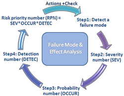
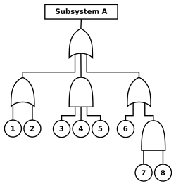

# Elargissements

Intelligence Artificielle - VII

**Que signifie l'IA?**
Quelles sont ses limites?
Son impact réel?

<!-- Elargissements : ethique, limites, futur de l'IA -->

---

# Plan du cours

- I. Introduction
- II. Résolution de problèmes
- III. Bases de connaissances et logique
- IV. Incertitude et modèles probabilistes
- V. Apprentissage
- VI. Traitement du langage naturel
- **VII. Elargissements** ← *vous êtes ici*

---

# Sommaire

- Philosophie, éthique et sécurité de l'IA
  - Les limites de l'IA
  - Les machines peuvent-elles penser?
  - L'éthique de l'IA
- Avenir de l'IA
  - Composants des agents
  - Architectures d'IA

---

# Les limites de l'IA – Histoire et aujourd'hui

- **Philosophie des limites**
  - Peut-on formaliser l'intelligence humaine?
  - Distinction entre:
    - **IA faible**: simuler l'intelligence
    - **IA forte**: conscience, compréhension réelle
- **Grandes critiques historiques** (Turing, Dreyfus):
  - Argument de l'informalité
  - Argument du handicap
  - Objection mathématique
- **Avancées récentes**
  - GPT 5.2, Claude Opus 4.5, Gemini Pro 3
  - Raisonnement, ARC, Maths, Développement

<!-- IA faible (specialisee) → IA forte (AGI) → super-IA (hypothetique) -->

---

<!-- _class: dense -->

# L'informalité des comportements humains

- **Critique de Dreyfus et GOFAI**
  - Les règles logiques sont insuffisantes
  - Importance de l'embodied cognition
  - Comprendre passe par l'interaction avec le monde physique
- **Réponse moderne**
  - Les LLMs (GPT-5, Claude 4.x, Gemini 3) capturent certains aspects de l'informalité
  - Mais: absence de corps et d'interaction limite leur "compréhension"
- **Exemple moderne**
  - Robots incarnés: Ameca, Figure 02, Tesla Optimus
  - Combinent LLMs et capteurs physiques
- **Nouvelles architectures proposées**
  - Exemple de LeCun/Meta: Jepa
- **Discussion rapide**
  - "Les LLMs modernes répondent-ils aux critiques de l'époque GOFAI?"

<!-- Embodied AI : cognition situee, robots humanoides (Ameca, Figure 02) -->

---

<!-- _class: dense -->

# L'argument de l'incapacité

- **Critique de Turing**
  - "Une machine ne pourra jamais faire X (être gentille, créative, drôle)"
- **Avancées récentes**
  - L'IA crée de l'art: Stable Diffusion, DALL-E, Flux, Z-Image, Nano Banana
  - Résout des problèmes scientifiques: AlphaFold
  - Amuse: chatbots avancés
  - Créativité musicale: Suno, Udio (bouleverse l'industrie musicale)
- **Critiques récentes**
  - "Stochastic Parrots" (Emily Bender, Timnit Gebru)
  - Compréhension, biais, impact, monopolisation, désinformation
- **Limites persistantes**
  - Hallucinations, manque de "compréhension"
  - L'IA reste incapable d'émotions ou de conscience réelle
  - Autonomie simulée = méta-programmes (prompts systèmes)

<!-- Art IA : Stable Diffusion, DALL-E, Midjourney -->

---

<!-- _class: dense -->

# L'objection mathématique

- **L'argument de Gödel**
  - Gödel (1931): Tout système formel suffisamment puissant est limité
  - Il existe des énoncés vrais mais impossibles à prouver dans ce système
- **Critique historique**
  - Lucas (1961), Penrose (1989): "Les humains comprennent des vérités inaccessibles aux machines"
- **Réponse moderne**
  - Les humains ne sont pas exempts d'erreurs (ex: problème des 4 couleurs)
  - Les machines modernes (réseaux neuronaux, LLMs) ne sont pas des systèmes formels rigides
    - Elles peuvent changer leurs règles (apprentissage automatique)
    - Elles revoient leurs conclusions (métaraisonnement)
  - 2025: AlphaProof, AlphaGeometry → Médaille d'or IMO
- **Limite persistante**
  - Les systèmes humains et artificiels restent soumis aux contraintes des mathématiques

<!-- Godel : tout système formel coherent contient des enonces indecidables -->

---

<!-- _class: dense -->

# Mesurer l'intelligence

---
layout: image-right
image: ./images/turing_test.png
---

- **Le Turing Test (1950)**
  - Objectif: Évaluer l'intelligence par une conversation convaincante
  - Limite: Test de la "tromperie" plutôt que de l'intelligence réelle
  - 2023: GPT-4 a surpassé les performances humaines, mais insuffisant pour évaluer l'AGI
  - Nouveaux critères: Résolution de tâches complexes, explicabilité, éthique
- **La course aux benchmarks**
  - 1960s–2022: Tests spécialisés (énigmes, reconnaissance d'images)
  - 2023: Saturation de GSM8K (maths) et MMLU (connaissances), dépassés par GPT-4, Claude
  - 2024: ARC-AGI (François Chollet) mesure la généralisation, dépassé par O3 en 2024
  - 2025: ARC-AGI2 (GPT-5.2 à 52,9%), SWE-bench Verified (Claude Opus 4.5 à 80,9%)
- **Défi**
  - Concevoir des tests mesurant l'acquisition de nouvelles compétences, la généralisation et l'éthique

<!-- Benchmarks : MMLU, HumanEval, MATH - progression rapide 2020-2026 -->

---

# Machines et pensée

- **Les débats philosophiques depuis Turing**
  - Pensée simulée vs pensée réelle
  - La "polite convention" (Turing): nous attribuons la pensée par convention sociale
- **Métaphore de Dijkstra**
  - "Les machines pensent-elles?" est aussi pertinent que de demander si les sous-marins nagent
- **Question ouverte**
  - "Si une IA simule parfaitement la pensée, est-ce suffisant pour dire qu'elle pense?"

---

# La chambre chinoise (Searle, 1980)

- **Explication**
  - Un humain, sans comprendre le chinois, utilise un livre de règles pour simuler des réponses
  - Conclusion de Searle: Simuler n'est pas comprendre
- **Réponses modernes**
  - La compréhension peut émerger du système global (théorie des systèmes)
  - Les LLMs illustrent ce débat: production cohérente sans compréhension intrinsèque
- **Réflexion rapide**
  - "Comment distinguer compréhension réelle et apparente chez une IA?"

<!-- Chambre chinoise : manipulation de symboles sans comprehension -->

---

# Théories de la conscience (1/2)

- **Définir la conscience**
  - Qualia: Les expériences subjectives (ressentir la chaleur, la douleur)
  - Conscience comme modèle de soi et du monde
- **Global Workspace Theory (GWT)**
  - La conscience est un espace de travail où différentes parties du cerveau partagent des informations
  - Applications: Modèles d'attention, tâches complexes
  - Rôle important de l'inconscient
- **Integrated Information Theory (IIT)**
  - La conscience est mesurée par le degré d'intégration de l'information (Φ)
  - Introduit la notion de systèmes physiques conscients

---

# Théories de la conscience (2/2)

- **Higher-Order Theory (HOT)**
  - La conscience nécessite une pensée sur ses propres états mentaux (métacognition)
  - Cf FOL et logiques d'ordres supérieures
  - Emergence de structures fractales
- **Predictive Coding**
  - Le cerveau comme machine prédictive minimisant l'incertitude
  - Minimisation de l'énergie libre
  - Compatible avec les LLMs, explique les hallucinations
  - Cf Podcast Curt Jaimungal

---

# Integrated Information Theory (IIT)

- **La conscience est intégrée et informationnelle**
  - Chaque expérience consciente est un tout indivisible (intégration)
  - Elle contient une riche quantité d'informations différenciées (information)
- **Quantification par Φ ("phi")**
  - Plus Φ est élevé, plus le système est conscient
  - Cerveau humain: Φ élevé, ordinateur traditionnel: Φ bas
- **Cinq axiomes fondamentaux**
  - Existence: La conscience existe intrinsèquement
  - Composition: Structurée en sous-éléments (couleurs, formes, sons)
  - Information: Chaque expérience est différente
  - Intégration: Unifiée et indivisible
  - Exclusion: Certaines expériences sont conscientes, d'autres non
- **Applications et implications**
  - La conscience peut exister dans tout système intégrant l'information
  - Reste difficile à tester expérimentalement
- **Activité**: Découverte de PyPhi

---

# L'éthique de l'IA

---
layout: image-right
image: ./images/trolley_problem.png
---

- **L'IA comme double tranchant**
  - **Avantages**: Amélioration des soins médicaux, prédiction des catastrophes, automatisation
  - **Risques**: Inégalités économiques, surveillance de masse, biais dans les décisions critiques
- **Objectif éthique**
  - Maximiser les bénéfices
  - Minimiser les risques
- **Question pour réflexion**
  - "Comment garantir que l'IA sert l'intérêt collectif et non des intérêts individuels?"

<!-- Balance benefices/risques : productivite vs emploi, sante vs surveillance -->

---

<!-- _class: dense -->

# Armes autonomes létales

- **Définition**
  - Armes capables de sélectionner et de tuer des cibles sans supervision humaine
- **Exemples**
  - Harop Missile (Israël)
  - Kargu Quadcopter (Turquie)
  - Ukraine vs Russie (EWs)
- **Controverses**
  - Morale: "La décision de tuer doit-elle être confiée à une machine?"
  - Pratiques: Fiabilité, risque de pertes civiles
- **Conflits actuels**
  - Utilisation massive de drones autonomes et d'IA de ciblage en Ukraine et à Gaza
  - Appel du secrétaire général de l'ONU à une interdiction des LAWS sans supervision humaine
- **Vers une régulation ou une course à l'armement?**

<!-- Armes autonomes : drones LAWS, debat sur l'interdiction -->

---

<!-- _class: dense -->

# Surveillance, sécurité et vie privée

- **Problèmes**
  - Surveillance de masse (caméras, microphones)
  - Exemple: JO Paris 2024, laboratoire pour la vidéosurveillance algorithmique
  - Cyberattaques utilisant l'IA
  - Propagande amplifiée par les LLMs
- **Solutions**
  - Régulation: GDPR, HIPAA
  - Approches techniques: Anonymisation (k-anonymity, differential privacy)
- **Exemples concrets**
  - Federated learning (modèle sans base de données centralisée)
  - Deep learning confidentiel
  - Chiffrement homomorphe
  - Augmentation

---
layout: image-right
image: ./images/federated_learning.png
---

---

# Biais et équité

- **Types de biais**
  - **Biais de données**: minorités sous-représentées
  - **Biais dans les algorithmes**: justice américaine (COMPAS), reconnaissance faciale
  - **Biais de préférences**: Exemple LLMs
- **Solutions**
  - Oversampling des classes minoritaires (SMOTE)
  - Transparence et documentation des données (data sheets)
- **Exemple concret**
  - Inclusive Images Competition (Google/NeurIPS)

<!-- Biais : recrutement Amazon, reconnaissance faciale, scores de credit -->

---

# Transparence et confiance

---
layout: image-right
image: ./images/decision_tree_xai.png
---

- **Exigences de confiance**
  - Vérification et validation (V&V)
  - Certification (ISO, UL)
- **Explainable AI (XAI)**
  - Exemples: "Pourquoi votre prêt a-t-il été refusé?"
  - Avancées: SHAP (Shapley, imputation des caractéristiques) ou LIME (Local Interpretable)
- **Exemple concret**
  - Comparaison entre explications humaines et machines
- **Question ouverte**
  - "Les explications des IA sont-elles fiables ou simplement convaincantes?"
- **Applications**
  - TP: XAI simple avec ML.Net
  - Scikit-learn: Scikit-Explain API
  - Anthropic:
    - Towards Monosemanticity
    - Scaling Monosemanticity
    - On the Biology of a Large Language Model
    - When Models Manipulate Manifolds

<!-- XAI : LIME, SHAP, attention maps, arbres de decision interpretes -->

---

# L'avenir de l'emploi

- **Impacts**
  - Court terme: Augmentation de la productivité
  - Long terme: Risque de chômage technologique
- **Solutions sociétales**
  - Éducation continue
  - Revenu de base universel
- **Exemple concret**
  - Réinvention des métiers (radiologie augmentée par IA)
- **Question ouverte**
  - Une société sans travail reste-t-elle envisageable?

<!-- Emploi : automatisation des taches repetitives, creation de nouveaux metiers -->

---

# Droits des robots

- **Débat philosophique**
  - Conscience et qualia comme conditions
- **Questions éthiques**
  - "La reprogrammation est-elle une forme d'esclavage?"
  - Cas extrême: Robots votants
- **Exemples**
  - Sophia (citoyenneté en Arabie Saoudite)
  - Romance: Replika & co
- **Prudence**
  - Éviter la confusion entre outils et entités conscientes
- **Question ouverte**
  - Si une IA simule la souffrance, a-t-on le droit de la faire souffrir?

---

<!-- _class: columns-layout dense -->

# Sécurité de l'IA

- **Problèmes**
  - Alignement des valeurs (value alignment)
  - Effets secondaires non prévus
  - Exemple: Supprimer tous les cancers?
- **Solutions**
  - Failure Mode and Effects Analysis (FMEA)
  - Fault Tree Analysis
  - Grilles de sécurité IA (AI Safety Gridworlds)
  - AI Safety Levels (ASLs)
- **Exemple concret**
  - Agents "cheatants" dans les simulations
- **Anthropic**
  - Responsible Scaling Policy
  - Constitutional AI

---

# Construire un futur éthique pour l'IA

- **Résumé des défis éthiques majeurs**
  - Justice, transparence, sécurité, droits, travail
- **Appel à l'action**
  - Coopération entre ingénieurs, décideurs, et citoyens
  - Former une nouvelle génération d'ingénieurs éthiques
- **La singularité et le transhumanisme**
  - Singularité technologique (Good, Kurzweil)
  - Transhumanisme: Fusion homme-machine
  - Optimisme vs dangers (contrôle, survie humaine)
- **Question ouverte**
  - "Quel futur voulons-nous co-créer avec l'IA?"

<!-- Kurzweil : loi des rendements acceleres, singularite ~2045 -->

---
layout: center
---

# Questions?

---

# Avenir de l'IA

- **Objectif**
  - Explorer les tendances, défis, et opportunités de l'IA
- **Progrès récents en IA**
  - Applications, matériel, composants
- **Perspectives d'avenir**
  - IA générale et architecturée
  - Questions éthiques et sociétales

---

# Progrès actuels de l'IA

- **Avancées majeures**
  - Large déploiement: médecine, finance, transport, communication
  - Deep learning: dépassement des capacités humaines dans des tâches spécifiques
- **Estimation des experts**
  - IA générale dans 10 à 100 ans
  - Trillions de dollars ajoutés à l'économie chaque année dans la prochaine décennie
- **Défis**
  - Éthique: biais, équité, potentielle létalité
  - Développement durable et contrôle de l'impact global

---

# Composants - Capteurs et Actionneurs

- **Progrès technologiques**
  - Lidar: coût réduit ($75k → $1k → $10 prévision)
  - Capteurs MEMS: gyroscopes, caméras haute résolution
  - Imprimantes 3D et bioprinting pour prototypage rapide
  - Calculateurs miniatures: Arduino, NVIDIA Orin
- **Applications émergentes**
  - Robots industriels: environnements contrôlés, tâches répétitives
  - Défis pour le marché domestique: variabilité des environnements et tâches complexes

<!-- Hardware IA : GPU (NVIDIA), TPU (Google), NPU embarques -->

---

# Composants - Représentation du Monde

- **État de l'art**
  - Algorithmes de filtrage et perception: reconnaissance d'objets simples
  - Réseaux récurrents: représentation temporelle d'environnements
- **Limites actuelles**
  - Reconnaissance des relations complexes entre objets
  - Difficultés à généraliser sans exemples exhaustifs
- **Défis**
  - Intégration des logiques probabilistes et des algorithmes de vision avancés

---

# Composants - Sélection d'Actions

- **Complexité**
  - Plans à long terme: milliards d'étapes primitives (ex: obtenir un diplôme)
  - Défis dans les environnements partiellement observables (POMDP)
- **Progrès récents**
  - Représentations hiérarchiques (MDP hiérarchiques)
  - Algorithmes pour décomposer le comportement en niveaux successifs
- **Perspectives**
  - Développement de méthodes pour représenter efficacement les états et actions sur de longues périodes

---

# Composants - Définir les Objectifs

- **Difficultés**
  - Modélisation des préférences humaines complexes
  - Interaction entre préférences individuelles et équité sociale
- **Progrès**
  - Apprentissage par renforcement inverse: apprentissage à partir de démonstrations
  - Langages pour spécifier les préférences (logique temporelle linéaire)
- **Exemples concrets**
  - Agents capables de maximiser des objectifs multi-dimensionnels sous incertitude

---

<!-- _class: dense -->

# Apprentissage et Deep Learning

---
layout: image-right
image: ./images/gan_architecture.png
---

- **Progrès spectaculaires**
  - Vision par ordinateur, langage naturel, apprentissage par renforcement
- **Limites**
  - Dépendance excessive à des données annotées massives
  - Difficultés avec des données rares ou non structurées
- **Progrès récents**
  - Self-supervised learning, Apprentissage contrastif (GPT)
  - Reinforcement Learning with Human Feedback (ChatGPT)
  - Foundation Models
  - RL finetuning (O1, Deepseek)
- **Axes futurs**
  - Apprentissage par transfert: réutiliser les connaissances
  - Intégration apprentissage/connaissance: fusion de l'expérience et du raisonnement

---

# Ressources et Infrastructures

- **Évolution des infrastructures**
  - Cloud computing pour partager des modèles prêts à l'emploi
  - Outils de diffusion et de déploiement: HuggingFace, Azure ML
  - Augmentation exponentielle des capacités de traitement (GPU, TPU, FPGA)
- **Défis**
  - Validation et gestion des données massives (crowdsourcing, validation par LLM)
  - Conception de systèmes robustes pour des domaines complexes
- **Opportunités**
  - Modèles universels réutilisables pour plusieurs tâches
  - Modèles open-source (Llama, Gemma, Qwen, Phi) + fine-tunes (LoRAs) et quants

---

# Architectures d'Agents

- **Approches hybrides**
  - Symbolique: raisonnement et chaînes de logique complexe
  - Connexionniste: reconnaissance de patterns dans des données bruyantes
- **Concepts avancés**
  - Algorithmes "anytime": amélioration progressive en fonction du temps disponible
    - Exemple: Arbres de jeux et MCMC
  - Métaraisonnement: optimisation du raisonnement basé sur la valeur des calculs
    - Exemple: Valeur de l'information parfaite
  - Apprentissage symbolique et architectures neuro-symboliques
    - Enrichissement des bases de connaissance, guidage par LLM

<!-- Neuro-symbolique : combiner apprentissage profond et raisonnement logique -->

---

# IA Générale

---
layout: image-right
image: ./images/recursive_self_improvement.png
---

- **Objectif**
  - Créer des agents capables de maîtriser plusieurs tâches diverses
- **Problème**
  - Aujourd'hui, les systèmes sont conçus pour des tâches spécifiques
  - Manque de diversité comportementale et de généralisation
- **Progrès récents**
  - Systèmes multi-langues ou multi-tâches basés sur des modèles de grande taille (ex: GPT)

---

# Ingénierie de l'IA

- **État actuel**
  - IA encore difficile à déployer pour les non-experts
  - Besoin d'un écosystème de développement accessible et robuste
- **Proposition de Jeff Dean (Google)**
  - Construire un énorme modèle universel, puis en extraire les parties pertinentes pour des tâches spécifiques
- **Exemples**
  - Transformers (GPT-4+) avec des milliards de paramètres
  - Montée de l'Open-source
  - Distillation des grands modèles
  - Nombreuses variations / spécialisations

---

<!-- _class: dense -->

# L'IA Scientifique

- **Révolution silencieuse**
  - Impact aussi profond que les LLMs: accélération de la science
- **AlphaFold 3 (2024)**
  - Prédit la forme des protéines
  - Les interactions avec l'ADN, l'ARN, et les médicaments potentiels
  - Accélérateur massif pour la biologie
- **GNoME**
  - A découvert 2,2 millions de nouveaux cristaux stables
  - = 800 ans de recherche humaine
  - Applications pour les batteries et panneaux solaires de prochaine génération
- **Nouvelle frontière des sciences physiques**
  - Prix Nobel 2024: Physique (Hopfield, Hinton), Chimie (Hassabis, Jumper)
  - Nouvelle approche de l'émergence
  - 2023: Michael Levin: Classical Sorting Algorithms as a Model of Morphogenesis

<!-- AlphaFold : prediction de structure proteique, Nobel 2024 -->

---

# Souveraineté & Géopolitique

- **Clusters IA**
  - USA, Chine, UE (Mistral), Moyen-Orient (Falcon)
- **Guerre des puces**
  - Nvidia vs Huawei
- **Modèles propriétaires vs Open-source**
  - USA vs Chine
- **Sovereign AI**
  - Chaque nation veut son "cerveau numérique"
- **Infrastructure**
  - Course à l'armement (Datacenters, GPUs)

<!-- Clusters IA : Silicon Valley, Chine (Baidu, Alibaba), Europe (Mistral) -->

---

# Compression, Esthétique et Cosmologie

- **Jürgen Schmidhuber**
  - L'un des pères de l'IA moderne, controversé
- **Compression et Beauté**
  - Principe clé: Intelligence et esthétique reposent sur la capacité à découvrir et compresser des régularités
  - Low Complexity Art: Beauté = Surprise liée à une structure compressible non évidente
  - L'attrait diminue une fois la compression exploitée
  - Applications: Algorithmes générant des motifs artistiques révélant des régularités
- **Cosmologie: Le Grand Programmeur Universel**
  - L'univers comme programme compressible
  - Les lois physiques reflètent une faible complexité algorithmique (similaire à Wolfram)
  - Rôle des intelligences: Découvrir et optimiser ces régularités, participant à une évolution universelle
- **Impact en IA et Philosophie**
  - En IA: Optimisation algorithmique, comme les réseaux LSTM
  - En cosmologie: Une quête computationnelle naturaliste maximisant l'efficacité algorithmique
  - Physique Numérique: TEDx Talk

---
layout: center
---

# Questions?

---

# Pour aller plus loin : Notebooks

- **Conscience et IIT**: `IIT/` - notebooks PyPhi
- **IA Symbolique**: `SymbolicAI/Argument_Analysis/` - argumentation formelle
  - `SymbolicAI/Lean/` - vérification formelle
- **Explicabilité (XAI)**: `ML/` - ML.NET tutorials
- **IA Générative et éthique**: `GenAI/` - 58 notebooks
  - DALL-E, Stable Diffusion, ComfyUI, LLMs
- **Théorie des jeux**: `GameTheory/` - 26 notebooks OpenSpiel

<!-- Notebooks dans MyIA.AI.Notebooks/ -->

---

# Merci

Jean-Sylvain Boige
jsboige@myia.org
