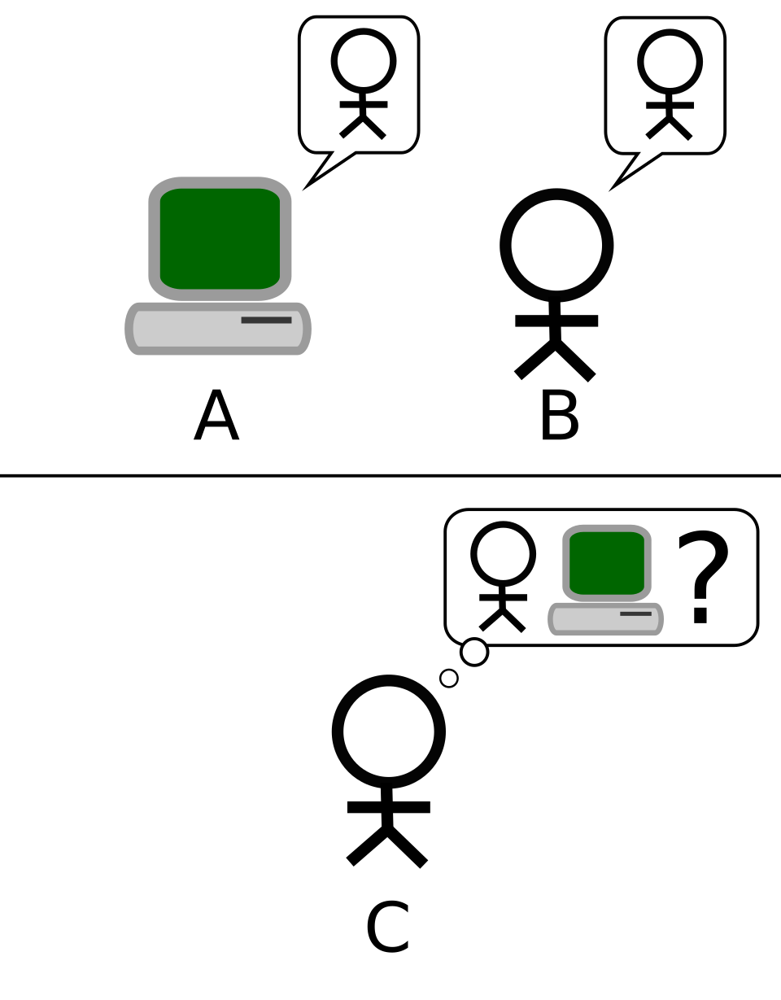
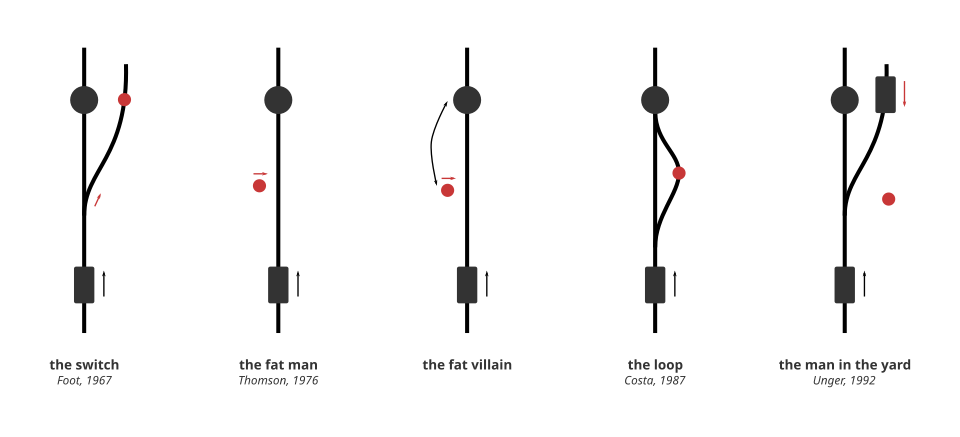
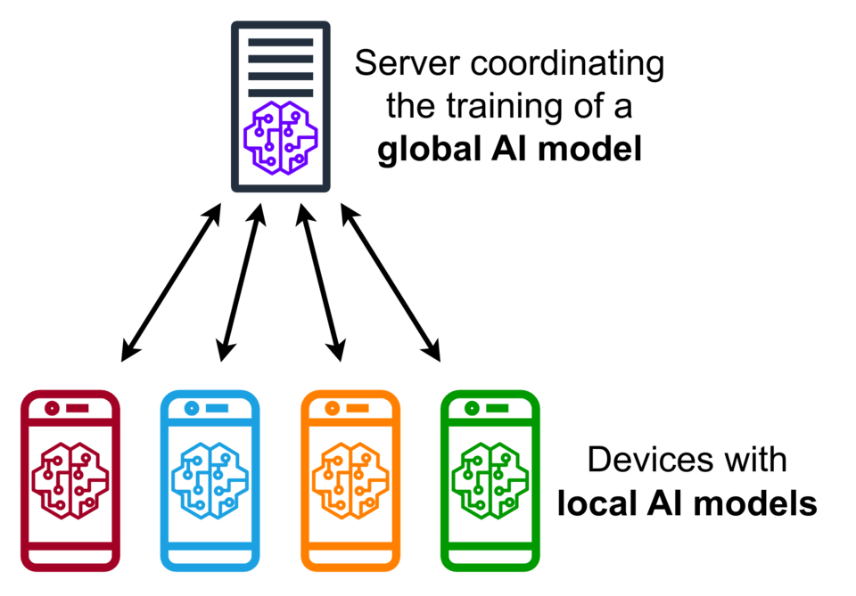
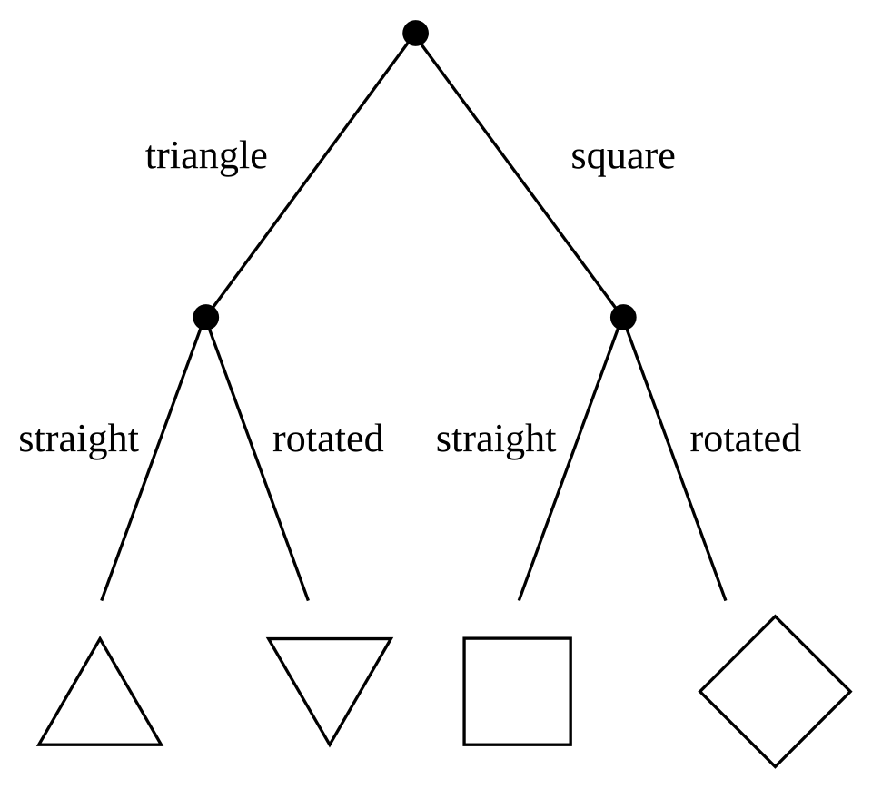
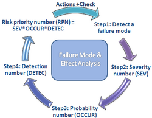
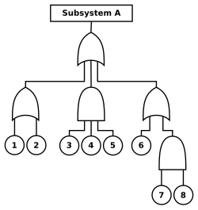
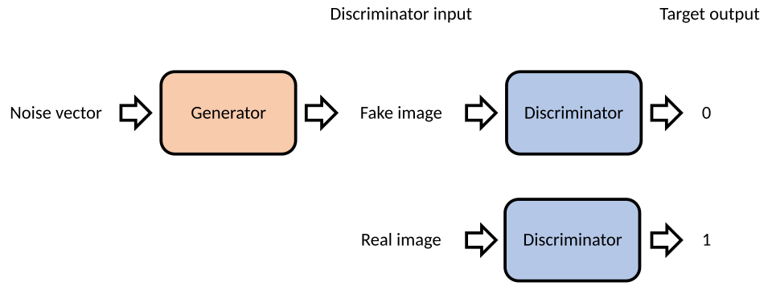
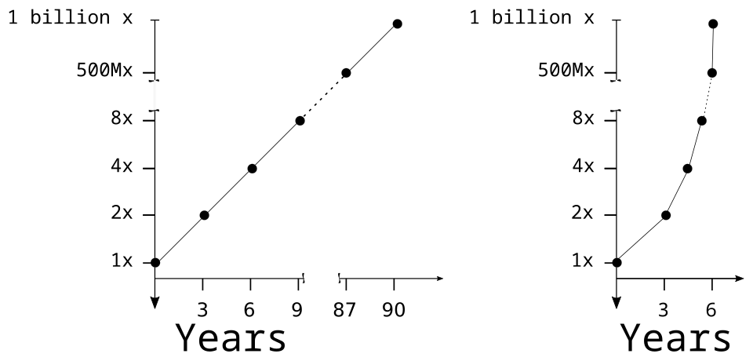

# Elargissements

Intelligence Artificielle - VII

**Que signifie l'IA?**
Quelles sont ses limites?
Son impact réel?

---

# Plan du cours

- I. Introduction
- II. Resolution de problemes
- III. Bases de connaissances et logique
- IV. Incertitude et modèles probabilistes
- V. Apprentissage
- VI. Traitement du langage naturel
- **VII. Elargissements** <- *vous etes ici*

---

# Sommaire

- Philosophie, ethique et securite de l'IA
  - Les limites de l'IA
  - Les machines peuvent-elles penser?
  - L'ethique de l'IA
- Avenir de l'IA
  - Composants des agents
  - Architectures d'IA

---

# Les limites de l'IA -- Histoire et aujourd'hui

- **Philosophie des limites**
  - Peut-on formaliser l'intelligence humaine?
  - Distinction entre:
    - **IA faible**: simuler l'intelligence
    - **IA forte**: conscience, comprehension réelle
- **Grandes critiques historiques** (Turing, Dreyfus):
  - Argument de l'informalite
  - Argument du handicap
  - Objection mathematique
- **Avancees recentes**
  - GPT 5.2, Claude Opus 4.5, Gemini Pro 3
  - Raisonnement, ARC, Maths, Développement

---
layout: dense
---

# L'informalite des comportements humains

- **Critique de Dreyfus et GOFAI**
  - Les règles logiques sont insuffisantes
  - Importance de l'embodied cognition
  - Comprendre passe par l'interaction avec le monde physique
- **Reponse moderne**
  - Les LLMs (GPT-5, Claude 4.x, Gemini 3) capturent certains aspects de l'informalite
  - Mais: absence de corps et d'interaction limite leur "comprehension"
- **Exemple moderne**
  - Robots incarnes: Ameca, Figure 02, Tesla Optimus
  - Combinent LLMs et capteurs physiques
- **Nouvelles architectures proposees**
  - Exemple de LeCun/Meta: Jepa
- **Discussion rapide**
  - "Les LLMs modernes repondent-ils aux critiques de l'epoque GOFAI?"

---
layout: dense
---

# L'argument de l'incapacite

- **Critique de Turing**
  - "Une machine ne pourra jamais faire X (etre gentille, creative, drole)"
- **Avancees recentes**
  - L'IA créé de l'art: Stable Diffusion, DALL-E, Flux, Z-Image, Nano Banana
  - Resout des problemes scientifiques: AlphaFold
  - Amuse: chatbots avances
  - Creativite musicale: Suno, Udio (bouleverse l'industrie musicale)
- **Critiques recentes**
  - "Stochastic Parrots" (Emily Bender, Timnit Gebru)
  - Comprehension, biais, impact, monopolisation, desinformation
- **Limites persistantes**
  - Hallucinations, manque de "comprehension"
  - L'IA reste incapable d'emotions ou de conscience réelle
  - Autonomie simulee = meta-programmes (prompts systèmes)

---
layout: dense
---

# L'objection mathematique

- **L'argument de Godel**
  - Godel (1931): Tout système formel suffisamment puissant est limite
  - Il existe des enonces vrais mais impossibles a prouver dans ce système
- **Critique historique**
  - Lucas (1961), Penrose (1989): "Les humains comprennent des verites inaccessibles aux machines"
- **Reponse moderne**
  - Les humains ne sont pas exempts d'erreurs (ex: problème des 4 couleurs)
  - Les machines modernes (reseaux neuronaux, LLMs) ne sont pas des systèmes formels rigides
    - Elles peuvent changer leurs règles (apprentissage automatique)
    - Elles revoient leurs conclusions (metaraisonnement)
  - 2025: AlphaProof, AlphaGeometry -> Medaille d'or IMO
- **Limite persistante**
  - Les systèmes humains et artificiels restent soumis aux contraintes des mathematiques

---
layout: dense
---

# Mesurer l'intelligence

<v-clicks at="1">

- **Le Turing Test (1950)**
  - Objectif: Evaluer l'intelligence par une conversation convaincante
  - Limite: Test de la "tromperie" plutot que de l'intelligence réelle
  - 2023: GPT-4 a surpasse les performances humaines, mais insuffisant pour evaluer l'AGI
  - Nouveaux critères: Resolution de tâches complexes, explicabilite, ethique
- **La course aux benchmarks**
  - 1960s--2022: Tests specialises (enigmes, reconnaissance d'images)
  - 2023: Saturation de GSM8K (maths) et MMLU (connaissances), depasses par GPT-4, Claude
  - 2024: ARC-AGI (Francois Chollet) mesure la generalisation, depasse par O3 en 2024
  - 2025: ARC-AGI2 (GPT-5.2 a 52,9%), SWE-bench Verified (Claude Opus 4.5 a 80,9%)
- **Defi**
  - Concevoir des tests mesurant l'acquisition de nouvelles competences, la generalisation et l'ethique

</v-clicks>

<!-- Référence PPTX : slide 8. -->

## Machines et pensee

<v-clicks at="5">

- **Les debats philosophiques depuis Turing**
  - Pensee simulee vs pensee réelle
  - La "polite convention" (Turing): nous attribuons la pensee par convention sociale
- **Metaphore de Dijkstra**
  - "Les machines pensent-elles?" est aussi pertinent que de demander si les sous-marins nagent
- **Question ouverte**
  - "Si une IA simule parfaitement la pensee, est-ce suffisant pour dire qu'elle pense?"

</v-clicks>

---

# La chambre chinoise (Searle, 1980)

- **Explication**
  - Un humain, sans comprendre le chinois, utilise un livre de règles pour simuler des reponses
  - Conclusion de Searle: Simuler n'est pas comprendre
- **Reponses modernes**
  - La comprehension peut emerger du système global (théorie des systèmes)
  - Les LLMs illustrent ce debat: production coherente sans comprehension intrinseque
- **Reflexion rapide**
  - "Comment distinguer comprehension réelle et apparente chez une IA?"

---

# Théories de la conscience (1/2)

- **Définir la conscience**
  - Qualia: Les expériences subjectives (ressentir la chaleur, la douleur)
  - Conscience comme modèle de soi et du monde
- **Global Workspace Theory (GWT)**
  - La conscience est un espace de travail ou différentes parties du cerveau partagent des informations
  - Applications: Modèles d'attention, tâches complexes
  - Rôle important de l'inconscient
  - *Notebook : [ICT-24-WorkspaceIgnition](../../MyIA.AI.Notebooks/IIT/ICT-Series/ICT-24-WorkspaceIgnition.ipynb) — ignition d'un workspace global, mesure empirique du basculement.*
- **Integrated Information Theory (IIT)**
  - La conscience est mesuree par le degré d'integration de l'information (Phi)
  - Introduit la notion de systèmes physiques conscients

---

# Théories de la conscience (2/2)

- **Higher-Order Theory (HOT)**
  - La conscience necessite une pensee sur ses propres etats mentaux (metacognition)
  - Cf FOL et logiques d'ordres superieures
  - Emergence de structures fractales
- **Predictive Coding**
  - Le cerveau comme machine predictive minimisant l'incertitude
  - Minimisation de l'energie libre
  - Compatible avec les LLMs, explique les hallucinations
  - Cf Podcast Curt Jaimungal

---
layout: dense
---

# Integrated Information Theory (IIT)

- **La conscience est integree et informationnelle**
  - Chaque expérience consciente est un tout indivisible (integration)
  - Elle contient une riche quantite d'informations differenciees (information)
- **Quantification par Phi ("phi")**
  - Plus Phi est eleve, plus le système est conscient
  - Cerveau humain: Phi eleve, ordinateur traditionnel: Phi bas
- **Cinq axiomes fondamentaux**
  - Existence: La conscience existe intrinsequement
  - Composition: Structuree en sous-éléments (couleurs, formes, sons)
  - Information: Chaque expérience est différente
  - Integration: Unifiee et indivisible
  - Exclusion: Certaines expériences sont conscientes, d'autres non
- **Applications et implications**
  - La conscience peut exister dans tout système integrant l'information
  - Reste difficile a tester experimentalement
- **Activite**: Decouverte de PyPhi
  - *Notebook : [IIT-01-IntroToPyPhi](../../MyIA.AI.Notebooks/IIT/IIT-01-IntroToPyPhi.ipynb) — calcul exact de Φ sur petits systèmes booléens, les cinq axiomes opérationnels, ce qui distingue un systeme a Phi eleve d'un circuit feed-forward equivalent.*

---
layout: dense
---

# Conscience mesurable : PyPhi et ignition de workspace

- **Le verrou empirique**
  - IIT donne un nombre (Phi) mais reste difficile a observer sur le vivant
  - GWT donne un critere operationnel (ignition) mais ne dit pas ce que le workspace represente
  - Les deux theories se rejoignent sur un meme geste : **mesurer un phenomene de transition**
- **PyPhi** (Tononi, Albantakis, et al.)
  - Systemes booleens a 5--8 noeuds : calcul exact de Phi en quelques secondes
  - Systemes plus grands : decomposition, partitions minimales, approximation
  - Question pedagoguee : un systeme a Phi eleve a-t-il quelque chose qui ressemble a une "experience"?
- **Workspace Ignition** (Dehaene, Mashour, ICT-24)
  - Signal EEG/MEG : passage d'une activite locale a une activite globale, large bande, durable
  - ICT-24 formalise cette ignition dans le cadre Integrated Complexity Theory (ICT) et la relie a Phi
  - Question pedagoguee : cette ignition peut-elle exister dans un systeme non-biologique?
- **Vers une science de la conscience**
  - Au-dela du debat philosophique, la mesure impose une discipline
  - Le depot porte les deux outils (IIT-01, ICT-24) ; les utiliser en parallele montre ce qu'aucun ne montre seul
  - *Notebooks : [IIT-01-IntroToPyPhi](../../MyIA.AI.Notebooks/IIT/IIT-01-IntroToPyPhi.ipynb) (calcul exact de Φ) · [ICT-24-WorkspaceIgnition](../../MyIA.AI.Notebooks/IIT/ICT-Series/ICT-24-WorkspaceIgnition.ipynb) (ignition et integration).*

---

# L'ethique de l'IA

<v-clicks at="1">

- **L'IA comme double tranchant**
  - **Avantages**: Amelioration des soins medicaux, prediction des catastrophes, automatisation
  - **Risques**: Inegalites economiques, surveillance de masse, biais dans les decisions critiques
- **Objectif ethique**
  - Maximiser les benefices
  - Minimiser les risques
- **Question pour reflexion**
  - "Comment garantir que l'IA sert l'intérêt collectif et non des intérêts individuels?"

</v-clicks>

<!-- Référence PPTX : slide 14. -->

---
layout: dense
---

# Armes autonomes letales

- **Definition**
  - Armes capables de sélectionner et de tuer des cibles sans supervision humaine
- **Exemples**
  - Harop Missile (Israel)
  - Kargu Quadcopter (Turquie)
  - Ukraine vs Russie (EWs)
- **Controverses**
  - Morale: "La decision de tuer doit-elle etre confiee a une machine?"
  - Pratiques: Fiabilite, risque de pertes civiles
- **Conflits actuels**
  - Utilisation massive de drones autonomes et d'IA de ciblage en Ukraine et a Gaza
  - Appel du secretaire general de l'ONU a une interdiction des LAWS sans supervision humaine
- **Vers une regulation ou une course a l'armement?**

---
layout: dense
---

# Surveillance, securite et vie privee

<v-clicks at="1">

- **Problemes**
  - Surveillance de masse (cameras, microphones)
  - Exemple: JO Paris 2024, laboratoire pour la videosurveillance algorithmique
  - Cyberattaques utilisant l'IA
  - Propagande amplifiee par les LLMs
- **Solutions**
  - Regulation: GDPR, HIPAA
  - Approches techniques: Anonymisation (k-anonymity, differential privacy)
- **Exemples concrets**
  - Federated learning (modèle sans base de données centralisee)
  - Deep learning confidentiel
  - Chiffrement homomorphe (calcul sur données chiffrées, sans déchiffrement)
    - *Notebook : [SC-16-Homomorphic-Encryption](../../MyIA.AI.Notebooks/SymbolicAI/SmartContracts/04-Privacy-Cryptography/SC-16-Homomorphic-Encryption.ipynb) — Paillier, vote sur chiffres homomorphes, scénario bulletin dans l'urne.*
  - Vote vérifiable de bout en bout (end-to-end voter verifiability)
    - *Notebook : [SC-17-E2E-Verifiable-Voting](../../MyIA.AI.Notebooks/SymbolicAI/SmartContracts/04-Privacy-Cryptography/SC-17-E2E-Verifiable-Voting.ipynb) — preuves individuelles + universelles, conformité électorale.*
  - Augmentation

</v-clicks>

---

# Biais et equite

- **Types de biais**
  - **Biais de données**: minorites sous-representees
  - **Biais dans les algorithmes**: justice americaine (COMPAS), reconnaissance faciale
  - **Biais de préférences**: Exemple LLMs
- **Solutions**
  - Oversampling des classes minoritaires (SMOTE)
  - Transparence et documentation des données (data sheets)
- **Exemple concret**
  - Inclusive Images Competition (Google/NeurIPS)

---
layout: dense
---

# Transparence et confiance

<v-clicks at="1">

- **Exigences de confiance**
  - Verification et validation (V&V)
  - Certification (ISO, UL)
- **Explainable AI (XAI)**
  - Exemples: "Pourquoi votre pret a-t-il ete refuse?"
  - Avancees: SHAP (Shapley, imputation des caractéristiques) ou LIME (Local Interpretable)
- **Exemple concret**
  - Comparaison entre explications humaines et machines
- **Question ouverte**
  - "Les explications des IA sont-elles fiables ou simplement convaincantes?"

</v-clicks>

- **Applications**
  - TP: XAI simple avec ML.Net
  - Scikit-learn: Scikit-Explain API
  - Anthropic:
    - Towards Monosemanticity
    - Scaling Monosemanticity
    - On the Biology of a Large Language Model
    - When Models Manipulate Manifolds

<!-- Référence PPTX : slide 17. -->

## L'avenir de l'emploi

<v-clicks at="7">

- **Impacts**
  - Court terme: Augmentation de la productivite
  - Long terme: Risque de chomage technologique
- **Solutions societales**
  - Education continue
  - Revenu de base universel
- **Exemple concret**
  - Reinvention des metiers (radiologie augmentee par IA)
- **Question ouverte**
  - Une societe sans travail reste-t-elle envisageable?

</v-clicks>

---

# Droits des robots

- **Debat philosophique**
  - Conscience et qualia comme conditions
- **Questions ethiques**
  - "La reprogrammation est-elle une forme d'esclavage?"
  - Cas extreme: Robots votants
- **Exemples**
  - Sophia (citoyennete en Arabie Saoudite)
  - Romance: Replika & co
- **Prudence**
  - Eviter la confusion entre outils et entites conscientes
- **Question ouverte**
  - Si une IA simule la souffrance, a-t-on le droit de la faire souffrir?
  - *Modèle d'argumentation pour structurer ce type de débat : [Argument_Analysis_Toulmin_Model](../../MyIA.AI.Notebooks/SymbolicAI/Argument_Analysis/Argument_Analysis_Toulmin_Model.ipynb) — claim / data / warrant / backing / qualifier / rebuttal, le debat redevient falsifiable.*

---

# Securite de l'IA

- **Solutions**
  - Failure Mode and Effects Analysis (FMEA)
  - Fault Tree Analysis
  - Grilles de securite IA (AI Safety Gridworlds)
  - AI Safety Levels (ASLs)
  - Modelisation par graphes d'arguments (Dung 1995)
    - *Notebook : [Argument_Analysis_Dung_AF_Semantics](../../MyIA.AI.Notebooks/SymbolicAI/Argument_Analysis/Argument_Analysis_Dung_AF_Semantics.ipynb) — extensions de valeurs, semantiques preferred/stable/complete, application au value alignment multi-criteres.*

- **Problemes**
  - Alignement des valeurs (value alignment)
  - Effets secondaires non prevus
  - Exemple: Supprimer tous les cancers?

- **Exemple concret**
  - Agents "cheatants" dans les simulations

- **Anthropic**
  - Responsible Scaling Policy
  - Constitutional AI

<!-- Référence PPTX : slide 20. -->

---

# Construire un futur ethique pour l'IA

- **Resume des defis ethiques majeurs**
  - Justice, transparence, securite, droits, travail

- **Appel a l'action**
  - Cooperation entre ingenieurs, decideurs, et citoyens
  - Former une nouvelle generation d'ingenieurs ethiques

- **La singularite et le transhumanisme**
  - Singularite technologique (Good, Kurzweil)
  - Transhumanisme: Fusion homme-machine
  - Optimisme vs dangers (contrôle, survie humaine)

- **Question ouverte**
  - "Quel futur voulons-nous co-créer avec l'IA?"

<!-- Référence PPTX : slide 21. -->

---
layout: section
---

# Questions?

---

# Avenir de l'IA

- **Objectif**
  - Explorer les tendances, defis, et opportunites de l'IA
- **Progres recents en IA**
  - Applications, materiel, composants
- **Perspectives d'avenir**
  - IA générale et architecturee
  - Questions ethiques et societales

---

# Progres actuels de l'IA

- **Avancees majeures**
  - Large deploiement: medecine, finance, transport, communication
  - Deep learning: depassement des capacités humaines dans des tâches spécifiques
- **Estimation des experts**
  - IA générale dans 10 a 100 ans
  - Trillions de dollars ajoutes a l'economie chaque annee dans la prochaine decennie
- **Defis**
  - Ethique: biais, equite, potentielle letalite
  - Développement durable et contrôle de l'impact global

---

# Composants - Capteurs et Actionneurs

- **Progres technologiques**
  - Lidar: cout reduit ($75k -> $1k -> $10 prevision)
  - Capteurs MEMS: gyroscopes, cameras haute resolution
  - Imprimantes 3D et bioprinting pour prototypage rapide
  - Calculateurs miniatures: Arduino, NVIDIA Orin
- **Applications emergentes**
  - Robots industriels: environnements contrôles, tâches repetitives
  - Defis pour le marche domestique: variabilite des environnements et tâches complexes

---

# Composants - Representation du Monde

- **Etat de l'art**
  - Algorithmes de filtrage et perception: reconnaissance d'objets simples
  - Reseaux recurrents: representation temporelle d'environnements
- **Limites actuelles**
  - Reconnaissance des relations complexes entre objets
  - Difficultes a generaliser sans exemples exhaustifs
- **Defis**
  - Integration des logiques probabilistes et des algorithmes de vision avances

---

# Composants - Sélection d'Actions

- **Complexite**
  - Plans a long terme: milliards d'étapes primitives (ex: obtenir un diplome)
  - Defis dans les environnements partiellement observables (POMDP)
- **Progres recents**
  - Representations hiérarchiques (MDP hiérarchiques)
  - Algorithmes pour decomposer le comportement en niveaux successifs
- **Perspectives**
  - Développement de méthodes pour representer efficacement les etats et actions sur de longues periodes

---

# Composants - Définir les Objectifs

- **Difficultes**
  - Modelisation des préférences humaines complexes
  - Interaction entre préférences individuelles et equite sociale
- **Progres**
  - Apprentissage par renforcement inverse: apprentissage a partir de demonstrations
  - Langages pour specifier les préférences (logique temporelle lineaire)
- **Exemples concrets**
  - Agents capables de maximiser des objectifs multi-dimensionnels sous incertitude

---
layout: dense
---

# Apprentissage et Deep Learning

<v-clicks at="1">

- **Progres spectaculaires**
  - Vision par ordinateur, langage naturel, apprentissage par renforcement
- **Limites**
  - Dépendance excessive a des données annotees massives
  - Difficultes avec des données rares ou non structurees
- **Progres recents**
  - Self-supervised learning, Apprentissage contrastif (GPT)
  - Reinforcement Learning with Human Feedback (ChatGPT)
  - Foundation Models
  - RL finetuning (O1, Deepseek)
- **Axes futurs**
  - Apprentissage par transfert: reutiliser les connaissances
  - Integration apprentissage/connaissance: fusion de l'expérience et du raisonnement

</v-clicks>

---

# Ressources et Infrastructures

- **Evolution des infrastructures**
  - Cloud computing pour partager des modèles prets a l'emploi
  - Outils de diffusion et de deploiement: HuggingFace, Azure ML
  - Augmentation exponentielle des capacités de traitement (GPU, TPU, FPGA)
- **Defis**
  - Validation et gestion des données massives (crowdsourcing, validation par LLM)
  - Conception de systèmes robustes pour des domaines complexes
- **Opportunites**
  - Modèles universels reutilisables pour plusieurs tâches
  - Modèles open-source (Llama, Gemma, Qwen, Phi) + fine-tunes (LoRAs) et quants

---

# Architectures d'Agents

- **Approches hybrides**
  - Symbolique: raisonnement et chaînes de logique complexe
  - Connexionniste: reconnaissance de patterns dans des données bruyantes
- **Concepts avances**
  - Algorithmes "anytime": amelioration progressive en fonction du temps disponible
    - Exemple: Arbres de jeux et MCMC
  - Metaraisonnement: optimisation du raisonnement base sur la valeur des calculs
    - Exemple: Valeur de l'information parfaite
  - Apprentissage symbolique et architectures neuro-symboliques
    - Enrichissement des bases de connaissance, guidage par LLM

---

# IA Générale

<v-clicks at="1">

- **Objectif**
  - Créer des agents capables de maitriser plusieurs tâches diverses
- **Problème**
  - Aujourd'hui, les systèmes sont concus pour des tâches spécifiques
  - Manque de diversite comportementale et de generalisation
- **Progres recents**
  - Systèmes multi-langues ou multi-tâches bases sur des modèles de grande taille (ex: GPT)

</v-clicks>

---

# Ingenierie de l'IA

- **Etat actuel**
  - IA encore difficile a deployer pour les non-experts
  - Besoin d'un ecosysteme de développement accessible et robuste
- **Proposition de Jeff Dean (Google)**
  - Construire un enorme modèle universel, puis en extraire les parties pertinentes pour des tâches spécifiques
- **Exemples**
  - Transformers (GPT-4+) avec des milliards de paramètres
  - Montee de l'Open-source
  - Distillation des grands modèles
  - Nombreuses variations / specialisations

---
layout: dense
---

# L'IA Scientifique

- **Revolution silencieuse**
  - Impact aussi profond que les LLMs: acceleration de la science
- **AlphaFold 3 (2024)**
  - Predit la forme des proteines
  - Les interactions avec l'ADN, l'ARN, et les medicaments potentiels
  - Accelerateur massif pour la biologie
- **GNoME**
  - A decouvert 2,2 millions de nouveaux cristaux stables
  - = 800 ans de recherche humaine
  - Applications pour les batteries et panneaux solaires de prochaine generation
- **Nouvelle frontiere des sciences physiques**
  - Prix Nobel 2024: Physique (Hopfield, Hinton), Chimie (Hassabis, Jumper)
  - Nouvelle approche de l'emergence
  - 2023: Michael Levin: Classical Sorting Algorithms as a Model of Morphogenesis

---

# Souverainete & Geopolitique

- **Clusters IA**
  - USA, Chine, UE (Mistral), Moyen-Orient (Falcon)
- **Guerre des puces**
  - Nvidia vs Huawei
- **Modèles proprietaires vs Open-source**
  - USA vs Chine
- **Sovereign AI**
  - Chaque nation veut son "cerveau numérique"
- **Infrastructure**
  - Course a l'armement (Datacenters, GPUs)

---
layout: dense
---

# Compression, Esthetique et Cosmologie

- **Jurgen Schmidhuber**
  - L'un des peres de l'IA moderne, controverse
- **Compression et Beaute**
  - Principe cle: Intelligence et esthetique reposent sur la capacité a decouvrir et compresser des regularites
  - Low Complexity Art: Beaute = Surprise liee a une structure compressible non evidente
  - L'attrait diminue une fois la compression exploitee
  - Applications: Algorithmes generant des motifs artistiques revelant des regularites
- **Cosmologie: Le Grand Programmeur Universel**
  - L'univers comme programme compressible
  - Les lois physiques refletent une faible complexite algorithmique (similaire a Wolfram)
  - Rôle des intelligences: Decouvrir et optimiser ces regularites, participant a une evolution universelle
- **Impact en IA et Philosophie**
  - En IA: Optimisation algorithmique, comme les reseaux LSTM
  - En cosmologie: Une quete computationnelle naturaliste maximisant l'efficacite algorithmique
  - Physique Numérique: TEDx Talk

---
layout: section
---

# Questions?

---

# Pour aller plus loin : Notebooks

Le depot ancre chaque theme du deck sur un notebook ou une serie mesurable. Selection
des cibles **directement citees dans les slides ci-dessus** (chemins relatifs au depot) :

- **Conscience et theories de l'esprit**
  - [IIT-01-IntroToPyPhi](../../MyIA.AI.Notebooks/IIT/IIT-01-IntroToPyPhi.ipynb) — calcul exact de Phi sur systemes booleens
  - [ICT-24-WorkspaceIgnition](../../MyIA.AI.Notebooks/IIT/ICT-Series/ICT-24-WorkspaceIgnition.ipynb) — ignition du workspace global (GWT)
- **Argumentation formelle et debat structure**
  - [Argument_Analysis_Dung_AF_Semantics](../../MyIA.AI.Notebooks/SymbolicAI/Argument_Analysis/Argument_Analysis_Dung_AF_Semantics.ipynb) — semantiques de Dung, value alignment
  - [Argument_Analysis_Toulmin_Model](../../MyIA.AI.Notebooks/SymbolicAI/Argument_Analysis/Argument_Analysis_Toulmin_Model.ipynb) — modele de Toulmin, debat falsifiable
- **Privacy, chiffrement et vote verifiable**
  - [SC-16-Homomorphic-Encryption](../../MyIA.AI.Notebooks/SymbolicAI/SmartContracts/04-Privacy-Cryptography/SC-16-Homomorphic-Encryption.ipynb) — Paillier, vote sur chiffres homomorphes
  - [SC-17-E2E-Verifiable-Voting](../../MyIA.AI.Notebooks/SymbolicAI/SmartContracts/04-Privacy-Cryptography/SC-17-E2E-Verifiable-Voting.ipynb) — preuves individuelles + universelles

Series complementaires (autres thematiques couvertes par le depot) :

- **Explicabilite (XAI)** : `MyIA.AI.Notebooks/ML/` — tutoriels ML.NET
- **Verification formelle** : `MyIA.AI.Notebooks/SymbolicAI/Lean/`
- **IA generative et ethique** : `MyIA.AI.Notebooks/GenAI/` (103 notebooks, Image/Audio/Video/Texte)

---
layout: end
---

# Merci

Jean-Sylvain Boige
jsboige@myia.org
