<!-- _class: title -->

# Intelligence Artificielle Generative

Intelligence Artificielle -- VIII

**Panorama, enjeux et pratiques de l'IA generative**

- Decouvrir les bases et les grands principes de l'IA generative
- Comprendre les differents usages applicatifs (texte, image, audio...)
- Identifier les limites et les enjeux ethiques

---

# Plan du cours

- I. Introduction
- II. Resolution de problemes
- III. Bases de connaissances et logique
- IV. Incertitude et modeles probabilistes
- V. Apprentissage
- VI. Traitement du langage naturel
- VII. Elargissements
- **VIII. IA Generative** ← *vous etes ici*

---

# Introduction a l'IA Generative

- **Qu'est-ce que l'IA generative ?**
  - Creation de textes, images, audio, video a partir de modeles probabilistes
  - En reponse a des prompts (+ autres modalites)
  - Exploitation d'algorithmes d'apprentissage profond sur des jeux de donnees massifs
- **Exemples :**
  - ChatGPT (texte), Stable Diffusion / Flux (images)
  - Hunyuan (video), Whisper (audio/speech-to-text)
  - Audiocraft (musique), Github Copilot (code)

<!-- TODO: ajouter icones/logos des outils cites -->

---

# IA generative : Une revolution

- **Adoption rapide, impact massif**
  - 2017 : "Attention is All you need"
  - Scaling Laws : GPT-1 (117M) → GPT-2 (1.5B) → GPT-3 (175B) → GPT-4 (1T+)
  - ChatGPT : 1M utilisateurs en 5 jours, 100M en 2 mois
- **Defis :**
  - Cout d'entrainement, biais des modeles
  - Complexite des prompts, intervention humaine necessaire
- **Approche multidisciplinaire**
  - ML + NLP + Vision par ordinateur
  - Embeddings + mecanismes d'attention

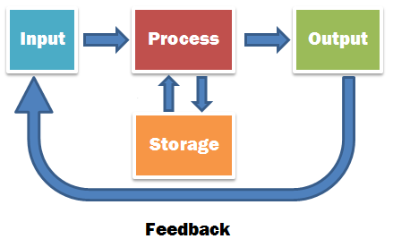

---

# Systemes ISPO

- **Input, Storage, Process, Output**
  - Vitesse, precision, regularite
  - Polyvalence, fiabilite, memoire, programmabilite

<!-- TODO: refaire le diagramme ISPO en plus grand, lisible en projection -->
<!-- NOTE: Dans le PPTX original, le contenu ISPO etait sur la meme slide que "Une revolution" -->

---

# Les donnees : Qualite et biais

- **Importance des donnees en IA generative**
  - Qualite et representativite des donnees
  - "Garbage in, Garbage out"
  - Biais possibles : genre, culture, contexte geographique
  - Risque d'hallucination → pre-traitement, audit
- **Pipeline de donnees**
  - Acquisition → Nettoyage → Preparation → Annotation
- **Donnees synthetiques**
  - Alternative pour creer en masse, proteger la confidentialite
  - 2025 : risque de Model Collapse

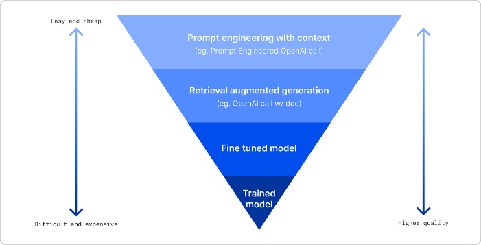

---

# Les donnees : Entrainement et cout

- **Scalabilite et cout energetique**
  - Necessite d'infrastructures puissantes (datacenters)
  - Optimisations : modeles distilles, datacenters verts
- **Methodes d'entrainement**
  - *Apprentissage de base* : tres couteux, modeles fondationnels
  - *Fine-Tuning* : ajustement specifique, LoRAs, RL
  - *Apprentissage en contexte* : peu couteux, prompt engineering
- **Activite : Sources de donnees**
  - Classe, Maison, Transport, Loisirs → Mots ?

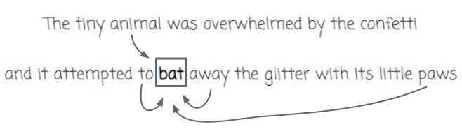

---

# Fonctionnement des LLMs : Tokens et Embeddings

- **Tokens**
  - Representation numerique des mots
  - Vocabulaire de 50k a 128k tokens
- **Embeddings**
  - Representation vectorielle des mots/phrases
  - Permet de calculer la proximite semantique
  - *King - Man + Woman = Queen*
- **Activite : Mind-Meld**
  - Par deux, mots aleatoires simultanes
  - Puis mots a "mi-distance"

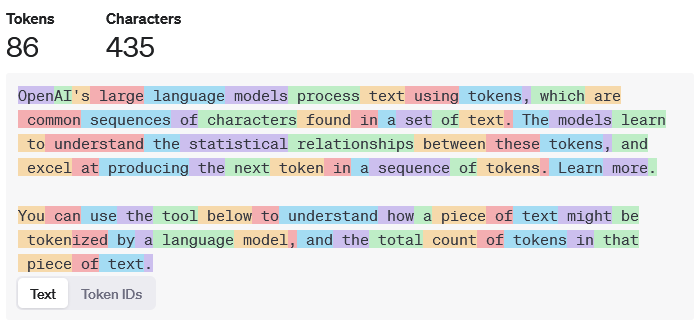
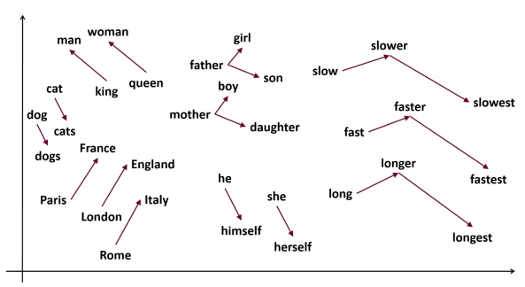

---

# Fonctionnement des LLMs : Attention et Transformers

- **Concept d'attention**
  - Importance relative des mots dans un contexte donne
  - *"I saw the man with the telescope"*
- **Activite : Mots polysemiques** -- definition + fleches d'attention
- **Transformers** : architecture cle des LLMs modernes
  - Avancees : MoE, Sparse Attention, RoPE Scaling, Multimodalite
- **Alternatives recentes** : Mamba, Jamba, Diffusion

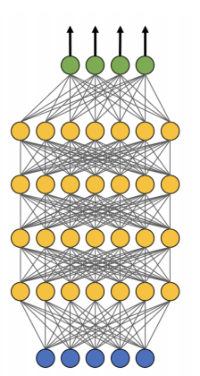
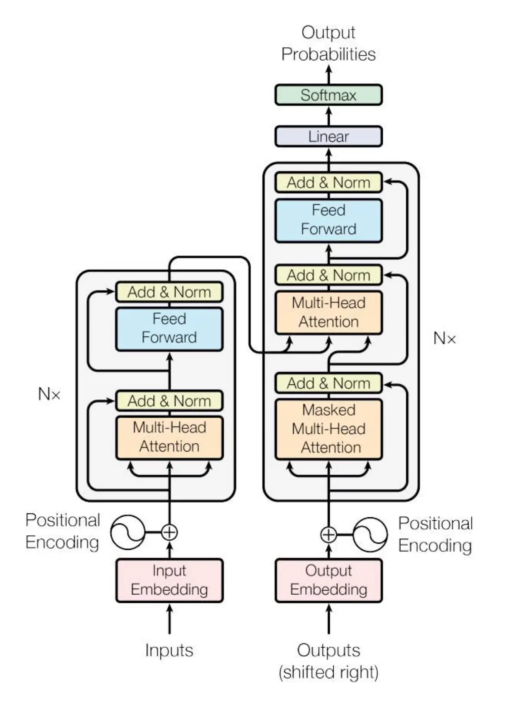

---

# Modeles probabilistes : Generation de texte

- **Les mots sont choisis en sequence**
  - En fonction de leur probabilite d'occurrence
  - Dans un contexte donne (= mots qui precedent)
- **Parametres de generation :**
  - *Temperature* : controle la variabilite des resultats
  - *Top-p sampling* : seuil de distribution cumulatif
  - *Top-k sampling* : k mots les plus probables

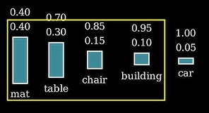
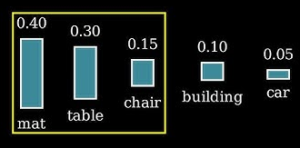
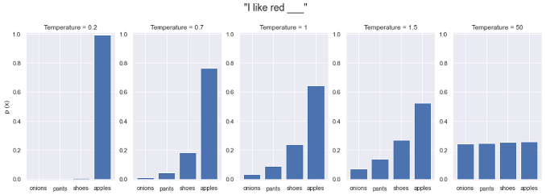

---

# Modeles probabilistes : Generation d'images

- **Modele de diffusion**
  - Ajout de bruit gaussien, apprentissage du debruitage
  - Generation depuis un espace latent
  - Conditionnement par attention (texte, image, etc.)
- **Parametres :**
  - *N-steps* : etapes de debruitage
  - *CFG-scale* : conformite au conditionnement
  - *Denoising strength* (img2img) : quantite de changement
  - *Seed* : reproductibilite
- **Activite : Experimentation de parametres** (seed fixe)

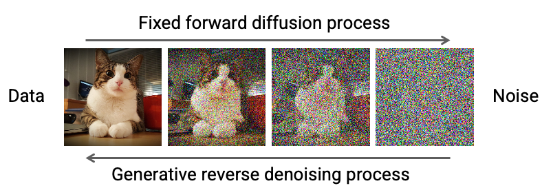
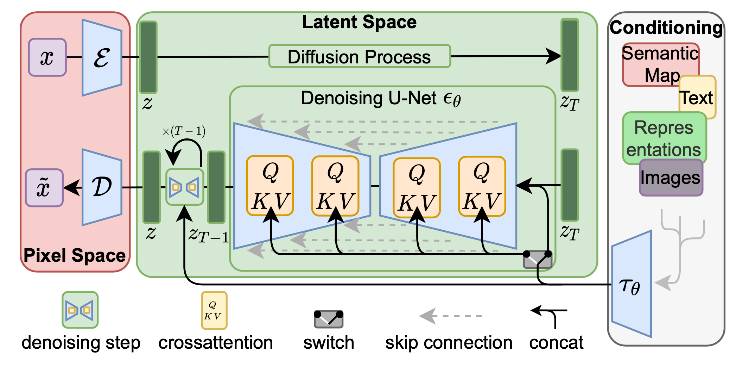

---

# Applications : Usages individuels

- **Design et graphisme**
  - Prototypes visuels, dessins, photos
  - Outils : MidJourney, Stable Diffusion, ChatGPT, Gemini
- **Litterature et redaction creative**
  - Scenarios, recits interactifs, co-ecriture, poesie
  - Outils : ChatGPT, Claude, Llama
- **Entreprenariat et innovation**
  - Ideation, validation d'idees, prototypage
- **Compagnons IA**
  - Soutien psychologique, coaching, romance (ex: Replika)

---

# Applications : Entreprise (1/2)

- **Positionnement Metier** (ex: Microsoft Copilot)
- **Communication d'entreprise**
  - Synthese de contenu, themes majeurs
  - Structuration d'arguments persuasifs
- **Marketing et interaction client**
  - Contenu reseaux sociaux, blogs, videos publicitaires
  - Slogans, storyboards publicitaires
  - Chatbots conversationnels, FAQ dynamique

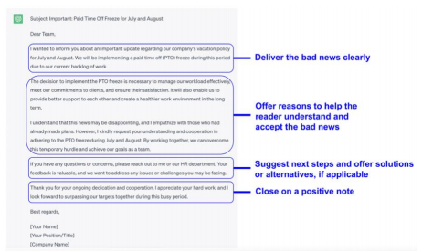

---

# Applications : Entreprise (2/2)

- **Recrutement et formation**
  - Descriptions de poste inclusives
  - Resume automatique des candidatures
  - Scenarios d'entretien personnalises
  - Parcours de formation adaptatifs
- **Analytics et prise de decision**
  - Automatisation des pipelines de donnees
  - Modelisation avancee, visualisation rapide
  - Synthese de tableaux de bord complexes
- **Activite : Campagne Marketing fictive : Nouveau Soda**
  - Un slogan, 1 visuel, 3 posts reseaux sociaux, 1 scenario de pub

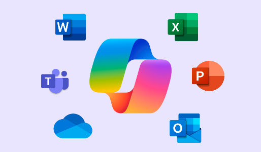

---

# Applications sectorielles

- **Sante** : rapports medicaux, assistance au diagnostic, chatbots de suivi
- **Education** : supports pedagogiques, vulgarisation, quiz dynamiques, assistants interactifs
- **Finance** : extraction de rapports, previsions, detection d'anomalies
- **Recherche** : synthese d'articles, exploration documentaire, optimisation de modeles
- **Activite :** Prevision Trading Crypto par graphiques avec indicateurs

---

# Techniques : Generation de texte

- **Prompt Engineering** : instructions explicites, few-shot learning, variantes stylistiques
- **Prompts Systemes** : structuration pour taches complexes (CoT, ToT)
- **RAG** (Retrieval Augmented Generation)
  - Combinaison modeles generatifs + bases documentaires
  - Chunks, embeddings, requetes contextuelles
- **Function Calling** : appels API, generation structuree
- **Orchestration** : Semantic Kernel, LangChain
- **Agentique avancee** : coordination multi-agents (AutoGen, Semantic Kernel)
- **Vibe Coding** : Copilot, Cline, Roo (VS Code) + CLIs (Claude Code, Gemini, etc.)

<!-- TODO: schema pipeline RAG ou architecture agents -->

---

<!-- _class: columns-layout -->

# Techniques : Multimodalite

- **Graphiques**
  - Dall-E, Stable Diffusion, Flux
  - Txt2Img, Img2Img, Inpainting, ControlNet, LoRAs
- **Vision**
  - GPT-4o, O1, QwenVL, InternVL
- **Video**
  - SD: Deforum, AnimateDiff
  - Hunyuan, Wan, Veo 3, Sora, Runway, Kling AI
- **3D**
  - Representation: Meshes, NeRFs, VoxNet, Point Clouds
  - Generation: DreamFusion, Trellis

- **Audio**
  - STT: Whisper, Moonshine
  - TTS: ElevenLabs, Kokoro
  - Musique: Audiocraft, AudioLDM, UniAudio
- **Code**
  - VS Code: Copilot, Cline, Continue
- **Maths**
  - Modeles de reflexion
  - Proprietaires: OpenAI, Google
  - Open-Source: DeepSeek

<!-- TODO: ajouter 1 capture d'ecran par categorie -->

---

# Ecosysteme GenAI : Modeles et APIs

- **APIs proprietaires** : OpenAI, Anthropic, Google, Mistral
  - Aggregateur : OpenRouter
- **Modeles locaux** : Llama, Mistral, Gemini, Phi, Qwen, DeepSeek
  - Diffuseurs : Hugging Face, Github
  - Nombreux benchmarks

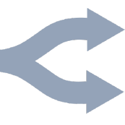

---

# Ecosysteme GenAI : Hebergement et outils

- **Cloud** : Hugging Face, Groq, Runpod, VastAI, AWS/Azure/GCP
- **Local** : Oobabooga, Ollama, vLLM
  - Quantification : GGUF, EXL2/3, AWQ
  - Containerisation Docker/Kubernetes
- **Image** : Stable Diffusion, Flux, Qwen Image Edit, CivitAI
  - Apps : Forge, ComfyUI
- **Conversationnel** : Open-WebUI, SillyTavern
  - Workflows Pro : Dify, Langflow

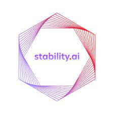

---

# Enjeux ethiques et societaux

- **Biais et discrimination**
  - Stereotypes dans les donnees d'entrainement
  - Techniques de debiaisage des modeles
- **Illusions**
  - Hallucinations : reponses incorrectes mais plausibles
  - Confiance exageree des utilisateurs
- **Impact environnemental**
  - Couts energetiques (GPUs, datacenters)
- **Activite : Dataset biaise**
  - Concevoir un dataset synthetique, ajouter un biais, le detecter

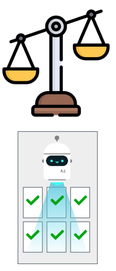

---

# Regulation et droit

- **Propriete intellectuelle**
  - Droits sur les contenus generes
  - Modeles open-source vs proprietaires
- **Protection des donnees**
  - Conformite RGPD, anonymisation
- **Normes emergentes**
  - AI Act europeen (en vigueur 01/08/2024)
  - Executive Order US sur l'IA (02/2025)
  - Agentic AI Foundation : MCP comme standard mondial (12/2025)
- **Droits des IAs**
  - IA surhumaine, conscience artificielle, autonomie economique ?

<!-- TODO: timeline visuelle des regulations -->

---

# Risques et limites

- **Fiabilite** : hallucinations, fabrications, impact confiance
  - Solutions : algorithmes robustes, verification croisee multi-modeles
- **Tests et validation**
  - "Auditeurs IA" : detection de biais en scenarios fictifs
  - **Activite :** recommandation voyage, sources de donnees in/out
- **Securite** : risques de mauvaise utilisation, perte de controle
  - Niveaux de securite Anthropic, Constitutional AI
- **Points critiques** : perte d'emplois, homogeneisation creative, deepfakes
  - **Activite : Constitutional AI** → definir une constitution, tester

<!-- TODO: schema niveaux de securite Anthropic -->

---

# Responsabilite sociale

- **Role des entreprises** : transparence, codes ethiques
- **Role des utilisateurs** : formation, adoption responsable
- **Impact environnemental**
  - Rapport IEA 2025 : consommation datacenters x2 en 3 ans (= Japon)
- **IA pour le bien commun**
  - Solutions ecologiques, sante publique, education
  - Surveillance deforestation, gestion des ressources en eau
- **Activite : Propositions novatrices** (avec et sans guidance)

<!-- TODO: infographie impact energetique de l'IA -->

---

# Defis pratiques de l'adoption

- **Compatibilite technologique** : adaptation CRM/ERP, bases vectorielles
- **Confidentialite** : maitrise des flux de donnees
- **Scalabilite et couts** : PMEs, infrastructure technique
- **Realite du ROI**
  - Gartner 2025 : 75% d'adoption mais "AI Fatigue"
  - ROI tangibles limites (redaction, code)
- **Optimisations :**
  - Solutions open-source, modeles distilles
  - Modeles specialises SOTA, confidentialite maitrisee

---

<!-- _class: questions -->

# Questions?

---

<!-- _class: title -->

# Merci

Jean-Sylvain Boige
jsboige@myia.org

> **Notebooks associes :** `MyIA.AI.Notebooks/GenAI/`
> Tutoriels DALL-E, Stable Diffusion, ComfyUI, Qwen Image Edit, LLMs
