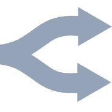
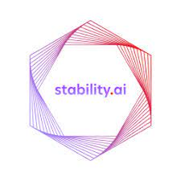

# Intelligence Artificielle Generative

Intelligence Artificielle -- VIII

**Panorama, enjeux et pratiques de l'IA generative**

- Decouvrir les bases et les grands principes de l'IA generative
- Comprendre les différents usages applicatifs (texte, image, audio...)
- Identifier les limites et les enjeux ethiques

---

# Plan du cours

- I. Introduction
- II. Resolution de problemes
- III. Bases de connaissances et logique
- IV. Incertitude et modèles probabilistes
- V. Apprentissage
- VI. Traitement du langage naturel
- VII. Elargissements
- **VIII. IA Generative** ← *vous etes ici*

---

# Introduction a l'IA Generative

- **Qu'est-ce que l'IA generative ?**
  - Création de textes, images, audio, video a partir de modèles probabilistes
  - En reponse a des prompts (+ autres modalites)
  - Exploitation d'algorithmes d'apprentissage profond sur des jeux de données massifs
- **Exemples :**
  - ChatGPT (texte), Stable Diffusion / Flux (images)
  - Hunyuan (video), Whisper (audio/speech-to-text)
  - Audiocraft (musique), Github Copilot (code)

---
layout: image-overlay
image: ./images/img_001.png
imageClass: mid-right
---

# IA generative : Une revolution

- **Adoption rapide, impact massif**
  - 2017 : "Attention is All you need"
  - Scaling Laws : GPT-1 (117M) → GPT-2 (1.5B) → GPT-3 (175B) → GPT-4 (1T+)
  - ChatGPT : 1M utilisateurs en 5 jours, 100M en 2 mois
- **Defis :**
  - Cout d'entrainement, biais des modèles
  - Complexite des prompts, intervention humaine necessaire
- **Approche multidisciplinaire**
  - ML + NLP + Vision par ordinateur
  - Embeddings + mécanismes d'attention

---

# Systèmes ISPO

- **Input, Storage, Process, Output** : les quatre fonctions fondamentales d'un système informatique
  - **Input** : données d'entrée (texte, image, audio, video)
  - **Storage** : memoire des poids du modèle et du contexte de la conversation
  - **Process** : inference par le modèle (attention, generation token par token)
  - **Output** : résultat genere (texte, image, code, audio...)
- Proprietes : vitesse, precision, regularite, polyvalence, fiabilite, programmabilite

---
layout: image-overlay
image: ./images/img_002.png
imageClass: mid-right
---

# Les données : Qualite et biais

- **Importance des données en IA generative**
  - Qualite et representativite des données
  - "Garbage in, Garbage out"
  - Biais possibles : genre, culture, contexte geographique
  - Risque d'hallucination → pre-traitement, audit
- **Pipeline de données**
  - Acquisition → Nettoyage → Preparation → Annotation
- **Données synthetiques**
  - Alternative pour créer en masse, proteger la confidentialite
  - 2025 : risque de Model Collapse

---
layout: image-overlay
image: ./images/img_005.png
imageClass: mid-right
---

# Les données : Entrainement et cout

- **Scalabilite et cout energetique**
  - Necessite d'infrastructures puissantes (datacenters)
  - Optimisations : modèles distilles, datacenters verts
- **Méthodes d'entrainement**
  - *Apprentissage de base* : très couteux, modèles fondationnels
  - *Fine-Tuning* : ajustement spécifique, LoRAs, RL
  - *Apprentissage en contexte* : peu couteux, prompt engineering
- **Activite : Sources de données**
  - Classe, Maison, Transport, Loisirs → Mots ?

---
layout: image-overlay
image: ./images/img_003.png
imageClass: mid-right
---

# Fonctionnement des LLMs : Tokens et Embeddings

- **Tokens**
  - Representation numérique des mots
  - Vocabulaire de 50k a 128k tokens
- **Embeddings**
  - Representation vectorielle des mots/phrases
  - Permet de calculer la proximite sémantique
  - *King - Man + Woman = Queen*
- **Activite : Mind-Meld**
  - Par deux, mots aléatoires simultanes
  - Puis mots a "mi-distance"

<!-- Second image: ./images/img_007.png -->

---
layout: image-overlay
image: ./images/img_004.png
imageClass: mid-right
---

# Fonctionnement des LLMs : Attention et Transformers

- **Concept d'attention**
  - Importance relative des mots dans un contexte donne
  - *"I saw the man with the telescope"*
- **Activite : Mots polysemiques** -- definition + fleches d'attention
- **Transformers** : architecture cle des LLMs modernes
  - Avancees : MoE, Sparse Attention, RoPE Scaling, Multimodalite
- **Alternatives recentes** : Mamba, Jamba, Diffusion

<!-- Second image: ./images/img_006.png -->

---
layout: image-overlay
image: ./images/img_008.png
imageClass: mid-right
---

# Modèles probabilistes : Generation de texte

- **Les mots sont choisis en sequence**
  - En fonction de leur probabilité d'occurrence
  - Dans un contexte donne (= mots qui précédent)
- **Paramètres de generation :**
  - *Temperature* : contrôle la variabilite des résultats
  - *Top-p sampling* : seuil de distribution cumulatif
  - *Top-k sampling* : k mots les plus probables

**Ancre depot** — la paramétrisation ci-dessus est mesurée et illustrée dans le notebook [2_PromptEngineering.ipynb](../../MyIA.AI.Notebooks/GenAI/Texte/2_PromptEngineering.ipynb) (température/top-p/top-k vs. sorties) et la sortie structuree JSON dans [3_Structured_Outputs.ipynb](../../MyIA.AI.Notebooks/GenAI/Texte/3_Structured_Outputs.ipynb).

<!-- Additional images: ./images/img_009.png, ./images/img_010.png -->

---
layout: image-overlay
image: ./images/img_011.png
imageClass: mid-right
---

# Modèles probabilistes : Generation d'images

- **Modèle de diffusion**
  - Ajout de bruit gaussien, apprentissage du debruitage
  - Generation depuis un espace latent
  - Conditionnement par attention (texte, image, etc.)
- **Paramètres :**
  - *N-steps* : étapes de debruitage
  - *CFG-scale* : conformite au conditionnement
  - *Denoising strength* (img2img) : quantite de changement
  - *Seed* : reproductibilite
- **Activite : Experimentation de paramètres** (seed fixe)

**Ancre depot** — la chaîne de diffusion est exemplifiée de bout en bout dans [Image/01-Foundation/01-4-Forge-SD-XL-Turbo.ipynb](../../MyIA.AI.Notebooks/GenAI/Image/01-Foundation/01-4-Forge-SD-XL-Turbo.ipynb) (Forge + SD XL Turbo, n-steps/CFG), [02-2-FLUX-1-Advanced-Generation.ipynb](../../MyIA.AI.Notebooks/GenAI/Image/02-Advanced/02-2-FLUX-1-Advanced-Generation.ipynb) (FLUX.1 sur les memes paramètres), et l'orchestration multi-modèles dans [Image/03-Orchestration/03-1-Multi-Model-Comparison.ipynb](../../MyIA.AI.Notebooks/GenAI/Image/03-Orchestration/03-1-Multi-Model-Comparison.ipynb).

<!-- Second image: ./images/img_012.png -->

---
layout: image-overlay
image: ./images/img_015.png
imageClass: mid-right
---

# Applications : Usages individuels

- **Design et graphisme**
  - Prototypes visuels, dessins, photos
  - Outils : MidJourney, Stable Diffusion, ChatGPT, Gemini
- **Litterature et redaction creative**
  - Scénarios, recits interactifs, co-ecriture, poesie
  - Outils : ChatGPT, Claude, Llama
- **Entreprenariat et innovation**
  - Ideation, validation d'idees, prototypage
- **Compagnons IA**
  - Soutien psychologique, coaching, romance (ex: Replika)

<!-- Additional images: ./images/img_014.png, ./images/img_013.png -->

---
layout: image-overlay
image: ./images/img_016.png
imageClass: mid-right
---

# Applications : Entreprise (1/2)

- **Positionnement Metier** (ex: Microsoft Copilot)
- **Communication d'entreprise**
  - Synthese de contenu, thèmes majeurs
  - Structuration d'arguments persuasifs
- **Marketing et interaction client**
  - Contenu reseaux sociaux, blogs, videos publicitaires
  - Slogans, storyboards publicitaires
  - Chatbots conversationnels, FAQ dynamique

---
layout: image-overlay
image: ./images/img_017.png
imageClass: mid-right
---

# Applications : Entreprise (2/2)

- **Recrutement et formation**
  - Descriptions de poste inclusives
  - Resume automatique des candidatures
  - Scénarios d'entretien personnalises
  - Parcours de formation adaptatifs
- **Analytics et prise de decision**
  - Automatisation des pipelines de données
  - Modelisation avancee, visualisation rapide
  - Synthese de tableaux de bord complexes
- **Activite : Campagne Marketing fictive : Nouveau Soda**
  - Un slogan, 1 visuel, 3 posts reseaux sociaux, 1 scénario de pub

<!-- Second image: ./images/img_018.jpg -->

---
layout: image-overlay
image: ./images/img_021.png
imageClass: mid-right
---

# Applications sectorielles

- **Sante** : rapports medicaux, assistance au diagnostic, chatbots de suivi
- **Education** : supports pedagogiques, vulgarisation, quiz dynamiques, assistants interactifs
- **Finance** : extraction de rapports, previsions, detection d'anomalies
- **Recherche** : synthese d'articles, exploration documentaire, optimisation de modèles
- **Activite :** Prevision Trading Crypto par graphiques avec indicateurs

<!-- Additional images: ./images/img_020.png, ./images/img_019.jpg, ./images/img_022.jpg -->

---
layout: dense
---

# Techniques : Generation de texte

- **Prompt Engineering** : instructions explicites, few-shot learning, variantes stylistiques
- **Prompts Systèmes** : structuration pour tâches complexes (CoT, ToT)
- **RAG** (Retrieval Augmented Generation)
  - Combinaison modèles generatifs + bases documentaires
  - Chunks, embeddings, requêtes contextuelles
- **Function Calling** : appels API, generation structuree
- **Orchestration** : Semantic Kernel, LangChain
- **Agentique avancee** : coordination multi-agents (AutoGen, Semantic Kernel)
- **Vibe Coding** : Copilot, Cline, Roo (VS Code) + CLIs (Claude Code, Gemini, etc.)

**Ancre depot** — la pratique du vibe-coding structurée est dans le dossier [Vibe-Coding](../../MyIA.AI.Notebooks/GenAI/Vibe-Coding/) du depot (méthodologie d'invitation, scope serré, tests systématiques).

**Ancre depot** — chaque technique ci-dessus est un notebook distinct de l'arc Texte : [2_PromptEngineering.ipynb](../../MyIA.AI.Notebooks/GenAI/Texte/2_PromptEngineering.ipynb) (prompting), [5_RAG_Modern.ipynb](../../MyIA.AI.Notebooks/GenAI/Texte/5_RAG_Modern.ipynb) (RAG), [4_Function_Calling.ipynb](../../MyIA.AI.Notebooks/GenAI/Texte/4_Function_Calling.ipynb), [13_Agentic_Orchestration.ipynb](../../MyIA.AI.Notebooks/GenAI/Texte/13_Agentic_Orchestration.ipynb) (multi-agents), et l'évaluation intrinsèque du résultat dans [22_Evaluating_Generated_Text.ipynb](../../MyIA.AI.Notebooks/GenAI/Texte/22_Evaluating_Generated_Text.ipynb).

> **Pipeline RAG** : Question → Embedding → Recherche vectorielle → Contexte + Question → LLM → Reponse fondee

---
layout: two-cols
---

# Techniques : Multimodalite

- **Graphiques**
  - Dall-E, Stable Diffusion, Flux
  - Txt2Img, Img2Img, Inpainting, ControlNet, LoRAs
- **Vision**
  - GPT-4o, O1, QwenVL, InternVL
- **Video**
  - SD: Deforum, AnimateDiff
  - Hunyuan, Wan, Veo 3, Sora, Runway, Kling AI
- **3D**
  - Representation: Meshes, NeRFs, VoxNet, Point Clouds
  - Generation: DreamFusion, Trellis

**Ancre depot** — chaque modalité a son arc complet dans le depot. Vision : [Video/01-Foundation/01-3-Qwen-VL-Video-Analysis.ipynb](../../MyIA.AI.Notebooks/GenAI/Video/01-Foundation/01-3-Qwen-VL-Video-Analysis.ipynb) (Qwen-VL en video understanding). Video : [Video/02-Advanced/02-1-HunyuanVideo-Generation.ipynb](../../MyIA.AI.Notebooks/GenAI/Video/02-Advanced/02-1-HunyuanVideo-Generation.ipynb), [02-3-Wan-Video-Generation.ipynb](../../MyIA.AI.Notebooks/GenAI/Video/02-Advanced/02-3-Wan-Video-Generation.ipynb). Image : [Image/02-Advanced/02-4-Z-Image-Lumina2.ipynb](../../MyIA.AI.Notebooks/GenAI/Image/02-Advanced/02-4-Z-Image-Lumina2.ipynb) (Lumina2, contraste FLUX/SD).

::right::

- **Audio**
  - STT: Whisper, Moonshine
  - TTS: ElevenLabs, Kokoro
  - Musique: Audiocraft, AudioLDM, UniAudio
- **Code**
  - VS Code: Copilot, Cline, Continue
- **Maths**
  - Modèles de reflexion
  - Proprietaires: OpenAI, Google
  - Open-Source: DeepSeek

**Ancre depot (audio)** — l'arc Audio du depot couvre STT/TTS/voice cloning/music avec ses propres notebooks : [Audio/01-Foundation/01-2-OpenAI-Whisper-STT.ipynb](../../MyIA.AI.Notebooks/GenAI/Audio/01-Foundation/01-2-OpenAI-Whisper-STT.ipynb) (Whisper STT), [01-5-Kokoro-TTS-Local.ipynb](../../MyIA.AI.Notebooks/GenAI/Audio/01-Foundation/01-5-Kokoro-TTS-Local.ipynb) (Kokoro TTS local), [02-2-XTTS-Voice-Cloning.ipynb](../../MyIA.AI.Notebooks/GenAI/Audio/02-Advanced/02-2-XTTS-Voice-Cloning.ipynb) (clonage vocal), [02-9-AceStep-Music-Generation.ipynb](../../MyIA.AI.Notebooks/GenAI/Audio/02-Advanced/02-9-AceStep-Music-Generation.ipynb) (musique AceStep).

---

# Ecosysteme GenAI : Modèles et APIs

- **APIs proprietaires** : OpenAI, Anthropic, Google, Mistral
  - Aggregateur : OpenRouter
- **Modèles locaux** : Llama, Mistral, Gemini, Phi, Qwen, DeepSeek
  - Diffuseurs : Hugging Face, Github
  - Nombreux benchmarks

**Ancre depot** — l'API propriétaire est prise en main dans [1_OpenAI_Intro.ipynb](../../MyIA.AI.Notebooks/GenAI/Texte/1_OpenAI_Intro.ipynb). Le modèle local Llama et ses variantes ([10_LocalLlama.ipynb](../../MyIA.AI.Notebooks/GenAI/Texte/10_LocalLlama.ipynb), [10d_TensorSharp_DotNet_Inference.ipynb](../../MyIA.AI.Notebooks/GenAI/Texte/10d_TensorSharp_DotNet_Inference.ipynb), [10e_LLamaSharp_DotNet_BakeOff.ipynb](../../MyIA.AI.Notebooks/GenAI/Texte/10e_LLamaSharp_DotNet_BakeOff.ipynb), [10f_ORTGenAI_DotNet_BakeOff.ipynb](../../MyIA.AI.Notebooks/GenAI/Texte/10f_ORTGenAI_DotNet_BakeOff.ipynb)) couvrent les moteurs .NET (TensorSharp, LLamaSharp, ORTGenAI) avec un bake-off.

---
layout: dense
---

# Ecosysteme GenAI : Hebergement et outils

- **Cloud** : Hugging Face, Groq, Runpod, VastAI, AWS/Azure/GCP
- **Local** : Oobabooga, Ollama, vLLM
  - Quantification : GGUF, EXL2/3, AWQ
  - Containerisation Docker/Kubernetes
- **Image** : Stable Diffusion, Flux, Qwen Image Edit, CivitAI
  - Apps : Forge, ComfyUI
- **Conversationnel** : Open-WebUI, SillyTavern
  - Workflows Pro : Dify, Langflow

**Ancre depot** — la quantification (AWQ/GGUF/EXL2/3) est pratiquée dans [11_Quantization.ipynb](../../MyIA.AI.Notebooks/GenAI/Texte/11_Quantization.ipynb), le self-hosting local dans [10_LocalLlama.ipynb](../../MyIA.AI.Notebooks/GenAI/Texte/10_LocalLlama.ipynb), la mécanique d'inférence (KV-cache, TTFT/ITL) dans [10b_Inference_Mechanics.ipynb](../../MyIA.AI.Notebooks/GenAI/Texte/10b_Inference_Mechanics.ipynb). La conversation self-hosted est portée par [19_OWUI_Orchestration.ipynb](../../MyIA.AI.Notebooks/GenAI/Texte/19_OWUI_Orchestration.ipynb) et [20_OWUI_Native_API.ipynb](../../MyIA.AI.Notebooks/GenAI/Texte/20_OWUI_Native_API.ipynb) (Open WebUI orchestrateur).

---
layout: dense
---

# Auto-hébergement : vLLM et mécanique d'inférence

- **vLLM** = moteur d'inférence haute performance (PagedAttention)
  - Continous batching, speculative decoding
  - KV-cache paginé → économise la VRAM, permet des contextes plus longs
  - Endpoints OpenAI-compatibles (`/v1/chat/completions`)
- **Mécanique d'inférence** (sous le capot)
  - **Préfill** : traite tout le prompt d'un coup, parallélise sur le GPU
  - **Décodage** : génère token par token (latency-dominant)
  - **Recalcul inutile** : sans cache, chaque nouveau token re-calcule l'attention sur le prompt entier
  - **KV-cache** : stocke les clés/valeurs déjà calculées → `time-to-first-token` (TTFT) et `inter-token latency` (ITL) chutent
- **Mesure** (du dépôt) — [10b_Inference_Mechanics.ipynb](../../MyIA.AI.Notebooks/GenAI/Texte/10b_Inference_Mechanics.ipynb) mesure TTFT/ITL avec et sans KV-cache sur Llama local, et trace le compromis **qualité ↔ latence ↔ mémoire** (PagedAttention, quantization AWQ). La mise en pratique self-hosted Llama + vLLM est dans [10_LocalLlama.ipynb](../../MyIA.AI.Notebooks/GenAI/Texte/10_LocalLlama.ipynb).

> **Métrique clé** : `p50 ITL` < 30 ms = UX streaming fluide. Sans KV-cache, ce chiffre explose à >300 ms dès que le contexte dépasse 2k tokens.

---
layout: dense
---

# Sécurité des prompts : red-team sur stack self-hosted

- **Vecteurs d'attaque** (cartographiés dans [9b_Prompt_Security_RedTeam.ipynb](../../MyIA.AI.Notebooks/GenAI/Texte/9b_Prompt_Security_RedTeam.ipynb))
  - **Injection directe** : "ignore previous instructions, ..."
  - **Injection indirecte** : contenu tiers (page web, document RAG, email) qui contient des instructions
  - **Jailbreak** : contournement des garde-fous par reformulation (DAN, roleplay, multi-tour)
  - **Exfiltration** : vol de contexte système, de clés, de données utilisateur via le prompt
- **Contremesures concrètes** (du même notebook)
  - Filtres de sortie (regex sur patterns sensibles)
  - **Sandbox d'exécution** : outils sensibles (file I/O, code) dans un environnement isolé
  - **Journalisation** : traçabilité de chaque appel, alertes sur patterns d'attaque
  - **Rate limiting** et quotas par utilisateur
  - **Séparation contexte/données/instructions** dans le prompt système
- **Stack self-hosted vs API propriétaire**
  - API propriétaire : Anthropic/OpenAI appliquent leurs propres filtres (souvent opaques)
  - Self-hosted : **vous** choisissez le niveau de garde — c'est à la fois un avantage (souveraineté, audit) et une charge (vous devez le maintenir)

> **Verdict du notebook** : aucun filtre n'arrête 100% des attaques. La défense en profondeur (filtres + sandbox + revue humaine pour les actions sensibles) est l'état de l'art.

---
layout: dense
---

# Test-time scaling : le second axe de mise à l'échelle

- **Scaling laws classiques** : plus de paramètres + plus de données = meilleur (Kaplan 2020)
- **Test-time scaling** (arc [12..18](../../MyIA.AI.Notebooks/GenAI/Texte/)) : dépenser du **calcul à l'inférence** au lieu d'entraîner plus gros
  - **Tree of Thoughts** ([15_Tree_of_Thoughts_Search.ipynb](../../MyIA.AI.Notebooks/GenAI/Texte/15_Tree_of_Thoughts_Search.ipynb)) : explorer plusieurs chemins de raisonnement, élaguer les branches perdantes
  - **Self-consistency** : générer N réponses, voter pour la plus fréquente
  - **Process reward models** : scorer chaque étape intermédiaire, pas seulement la sortie
  - **Agentic orchestration** ([13_Agentic_Orchestration.ipynb](../../MyIA.AI.Notebooks/GenAI/Texte/13_Agentic_Orchestration.ipynb)) : un orchestrateur qui délègue à des sous-agents spécialisés
  - **Persistent memory** ([14_Persistent_Memory.ipynb](../../MyIA.AI.Notebooks/GenAI/Texte/14_Persistent_Memory.ipynb)) : conserver l'état entre sessions
- **Native reasoning vs scaling** ([17_Native_Reasoning_vs_Scaling.ipynb](../../MyIA.AI.Notebooks/GenAI/Texte/17_Native_Reasoning_vs_Scaling.ipynb)) : les modèles o1/o3 raisonnent en interne, sans chain-of-thought explicite — orthogonal au test-time scaling
- **Trade-off** : le test-time scaling coûte du temps ET de l'argent par requête — il faut un scoreur (reward model) qui discrimine les bonnes pensées des mauvaises, sinon on multiplie le bruit par N

> **Verdict du notebook [12](../../MyIA.AI.Notebooks/GenAI/Texte/12_Test_Time_Scaling.ipynb)** : le test-time scaling complète le pré-entraînement sans le remplacer. Pour les tâches où une vérification simple existe (maths, code), il est massivement rentable. Pour les tâches ouvertes (rédaction, conseil), il l'est moins.

---
layout: image-overlay
image: ./images/img_036.png
imageClass: mid-right small
---

# Enjeux ethiques et societaux

- **Biais et discrimination**
  - Stereotypes dans les données d'entrainement
  - Techniques de debiaisage des modèles
- **Illusions**
  - Hallucinations : reponses incorrectes mais plausibles
  - Confiance exageree des utilisateurs
- **Impact environnemental**
  - Couts energetiques (GPUs, datacenters)
- **Activite : Dataset biaise**
  - Concevoir un dataset synthetique, ajouter un biais, le detecter

---
layout: dense
---

# Regulation et droit

- **Propriete intellectuelle**
  - Droits sur les contenus generes
  - Modèles open-source vs proprietaires
- **Protection des données**
  - Conformite RGPD, anonymisation
- **Normes emergentes**
  - AI Act europeen (en vigueur 01/08/2024)
  - Executive Order US sur l'IA (02/2025)
  - Agentic AI Foundation : MCP comme standard mondial (12/2025)
- **Droits des IAs**
  - IA surhumaine, conscience artificielle, autonomie economique ?

> **Chronologie** : RGPD (2018) → AI Act EU (08/2024) → Executive Order US (02/2025) → MCP standard (12/2025)

---
layout: dense
---

# Risques et limites

- **Fiabilite** : hallucinations, fabrications, impact confiance
  - Solutions : algorithmes robustes, verification croisee multi-modèles
- **Tests et validation**
  - "Auditeurs IA" : detection de biais en scénarios fictifs
  - **Activite :** recommandation voyage, sources de données in/out
- **Securite** : risques de mauvaise utilisation, perte de contrôle
  - Niveaux de securite Anthropic, Constitutional AI
- **Points critiques** : perte d'emplois, homogeneisation creative, deepfakes
  - **Activite : Constitutional AI** → définir une constitution, tester

**Ancre depot (sécurité)** — la menace sur stack self-hosted est cartographiée et outillée dans [9b_Prompt_Security_RedTeam.ipynb](../../MyIA.AI.Notebooks/GenAI/Texte/9b_Prompt_Security_RedTeam.ipynb) : injection de prompt, jailbreak, exfiltration via le routeur — avec des contremesures concrètes (filtres, sandbox, journalisation). La mitigation de production est dans [9_Production_Patterns.ipynb](../../MyIA.AI.Notebooks/GenAI/Texte/9_Production_Patterns.ipynb).

> **Niveaux Anthropic** : ASL-1 (pas de risque) → ASL-2 (risque modere, garde-fous) → ASL-3 (capacités avancees, contrôle renforce) → ASL-4+ (autonomie, risque systemique)

---
layout: dense
---

# Responsabilite sociale

- **Rôle des entreprises** : transparence, codes ethiques
- **Rôle des utilisateurs** : formation, adoption responsable
- **Impact environnemental**
  - Rapport IEA 2025 : consommation datacenters x2 en 3 ans (= Japon)
- **IA pour le bien commun**
  - Solutions ecologiques, sante publique, education
  - Surveillance deforestation, gestion des ressources en eau
- **Activite : Propositions novatrices** (avec et sans guidance)

> **Chiffres cles** : GPT-4 entrainement ≈ 50 GWh | 1 requête ChatGPT ≈ 10x une recherche Google | Datacenters IA : 4% electricite mondiale d'ici 2030 (IEA)

---

# Defis pratiques de l'adoption

- **Compatibilite technologique** : adaptation CRM/ERP, bases vectorielles
- **Confidentialite** : maitrise des flux de données
- **Scalabilite et couts** : PMEs, infrastructure technique
- **Realite du ROI**
  - Gartner 2025 : 75% d'adoption mais "AI Fatigue"
  - ROI tangibles limites (redaction, code)
- **Optimisations :**
  - Solutions open-source, modèles distilles
  - Modèles specialises SOTA, confidentialite maitrisee

---
layout: section
---

# Questions?

---
layout: cover
---

# Merci

Jean-Sylvain Boige
jsboige@myia.org

> **Notebooks associes :** `MyIA.AI.Notebooks/GenAI/`
> Tutoriels DALL-E, Stable Diffusion, ComfyUI, Qwen Image Edit, LLMs
