# Intelligence Artificielle Générative

Intelligence Artificielle — VIII

<strong>Panorama, concepts et pratiques de l'IA générative</strong>

<v-clicks at="3">

- Découvrir les concepts fondamentaux des modèles génératifs
- Comprendre les principales modalités (texte, image, audio, vidéo)
- Identifier les techniques clés (RAG, outils, mémoire, MCP)
- Repérer les limites, risques et enjeux éthiques associés

</v-clicks>

<!-- Référence PPTX : slide 01. -->

---
layout: image-overlay
---

# Plan du cours

<v-clicks at="1">

- I. Introduction
- II. Résolution de problèmes
- III. Bases de connaissances et logique
- IV. Incertitude et modèles probabilistes
- V. Apprentissage
- VI. Traitement du langage naturel
- VII. Élargissements
- **VIII. IA Générative** *(vous êtes ici)*

</v-clicks>

<!-- Référence PPTX : slide 02. -->

---

# Introduction à l'IA Générative

<v-clicks at="1">

- **Définition :** création de contenus (texte, image, audio, vidéo) par des modèles probabilistes conditionnés par une entrée (prompt, image, son, autres modalités).
- **Modalités couvertes :** texte, image, audio, musique, vidéo, code -- les mêmes principes de conditionnement et de génération se réutilisent.
- **Exemples de référence :** ChatGPT / Claude (texte), Stable Diffusion / Flux (image), Whisper (speech-to-text), Hunyuan (vidéo), Audiocraft (musique), Copilot (code).

</v-clicks>

<!-- Référence PPTX : slide 03. -->

---
layout: image-overlay
class: genai-illustrated genai-system
---

# Un système génératif ne se réduit pas au modèle

<v-clicks at="1">

- **Au-delà du modèle :** entrées, traitement, stockage, sorties et boucle de retour forment une application générative.
- **Entrées et stockage :** consignes, documents et conversation alimentent le contexte. Poids appris et mémoire externe restent distincts.
- **Sortie et retour :** générer, vérifier, corriger. Une conversation ne réentraîne pas les poids ; une réponse plausible ne prouve pas sa fiabilité.

</v-clicks>

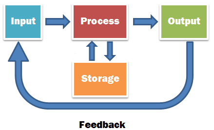

---

# Les données : qualité et biais

<v-clicks at="1">

- **Qualité et représentativité :** les modèles héritent des corpus d'entraînement -- si les données sont biaisées, les sorties le sont aussi.
- **"Garbage in, garbage out" :** la qualité d'un modèle plafonne par celle de ses données. Le nettoyage et l'audit sont des goulots d'étranglement réels.
- **Biais documentés :** genre, culture, contexte géographique. Les biais conditionnent les *distributions* de sortie ; les *hallucinations* sont un autre phénomène (le modèle complète un contexte sans ancre factuelle).
- **Pipeline classique :** acquisition, nettoyage, préparation, annotation.
- **Données synthétiques :** utiles pour augmenter un corpus ou protéger la confidentialité, mais risquant le *Model Collapse* si elles ré-alimentent l'entraînement en boucle.

</v-clicks>

<!-- Référence PPTX : slide 05. -->

---

# Activité : sources de données

<v-clicks at="1">

- **Domaines et sources :** classe (cours, manuels, exercices), maison (agenda familial, courses, recettes), transport (horaires, plans, trafic), loisirs (critiques, notations, événements locaux).
- **Structure et qualité :** distinguer données structurées (horaires) et non structurées (récits). Chaque source porte un point de vue, une période, une granularité.
- **Droits et biais :** vérifier licences d'usage et représentativité. Restituer un tableau source, date, droits et biais possibles ; comparer deux sources indépendantes.

</v-clicks>

---
layout: image-overlay
class: genai-illustrated genai-pyramid
---

# Pyramide des méthodes d'adaptation

<v-clicks at="1">

- **Quatre niveaux :** prompt + contexte, RAG, fine-tuning, pré-entraînement de zéro. Le schéma représente un effort croissant, pas une garantie de qualité.
- **Choix selon le besoin :** le contexte et le RAG apportent des connaissances actualisées ; le fine-tuning ajuste les poids pour un comportement ciblé, à évaluer.
- **Pré-entraînement fondationnel :** le plus lourd et le plus ponctuel, réservé aux organisations qui ont les moyens et les données massives.

</v-clicks>

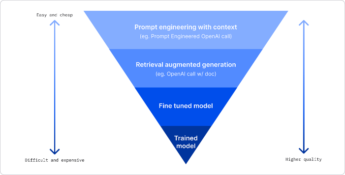

---
layout: image-overlay
class: genai-illustrated genai-tokens
---

# Des tokens aux embeddings

<v-clicks at="1">

- **Tokens :** le tokenizer découpe le texte en unités associées à des identifiants. Un token peut être un mot ou un fragment.
- **Embeddings :** chaque identifiant reçoit un vecteur appris. Les proximités représentent des régularités, sans garantir une proximité sémantique.
- **Activité Mind-Meld :** par deux, proposer simultanément deux mots, puis un mot à mi-distance. Comparer cette intuition aux analogies vectorielles.

</v-clicks>

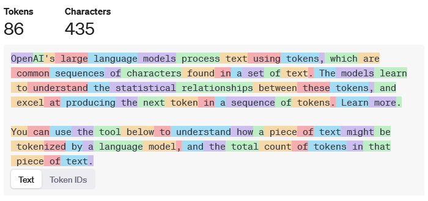

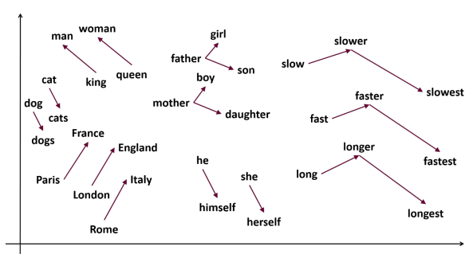

---
layout: image-overlay
class: genai-illustrated genai-attention
---

# Réseaux de neurones et attention

<v-clicks at="1">

- **Réseaux de neurones :** des transformations paramétrées composent plusieurs couches. L’apprentissage ajuste leurs poids.
- **Attention :** chaque position combine les informations du contexte. Les poids d’attention ne constituent pas une explication causale complète.
- **Activité polysémie :** donner deux sens à « avocat », écrire deux phrases, puis dessiner les liens vers les mots qui lèvent l’ambiguïté.

</v-clicks>

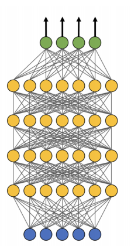

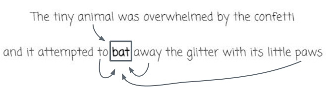

---
layout: image-overlay
class: genai-illustrated genai-transformer
---

# Transformer : composer les blocs

<v-clicks at="1">

- **Architecture :** embeddings, positions, attention multi-têtes et couches feed-forward. Le schéma original combine encodeur et décodeur.
- **LLM autoregressif :** de nombreux modèles utilisent seulement des blocs décodeurs avec attention causale sur les positions précédentes.
- **Évolutions :** MoE, attention parcimonieuse et RoPE scaling explorent efficacité et contextes longs. Mamba et Jamba proposent des modèles d’état et hybrides.

</v-clicks>

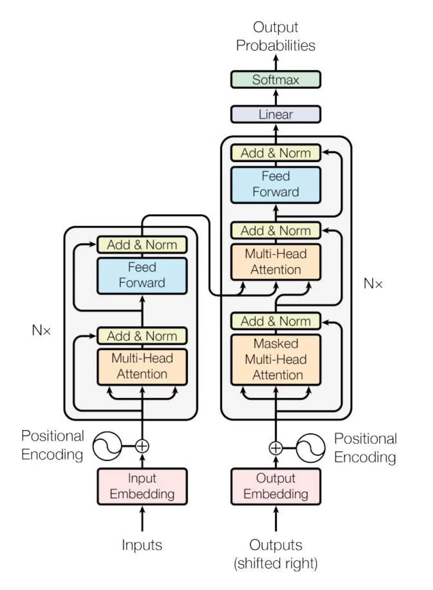

---

# Diffusion textuelle : une autre génération

<v-clicks at="1">

- **Texte discret :** certaines approches de diffusion masquent des tokens, puis apprennent à les retrouver par démasquage itératif. Toutes les variantes ne reposent pas sur le même bruit.
- **Ordre de génération :** plusieurs positions peuvent être complétées à une étape, contrairement au décodage autorégressif gauche à droite. Le nombre d’étapes reste un coût de calcul.
- **Comparaison :** évaluer qualité, latence et contrôlabilité sur les mêmes tâches. Ni le parallélisme ni la diffusion ne garantissent un avantage sur l’autorégressif.

</v-clicks>

---
layout: image-overlay
class: genai-illustrated genai-temperature
---

# Génération de texte : distribution et température

<v-clicks at="1">

- **Distribution conditionnelle :** chaque token est tiré d'une distribution calculée sur le contexte précédent. L'ordre compte.
- **Température basse :** concentre la masse sur les tokens les plus probables. Diversité réduite, sans garantie de cohérence ou de vérité.
- **Température haute :** accroît la diversité de sortie. Une valeur trop haute peut produire des textes décousus.

</v-clicks>

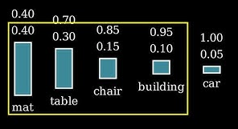

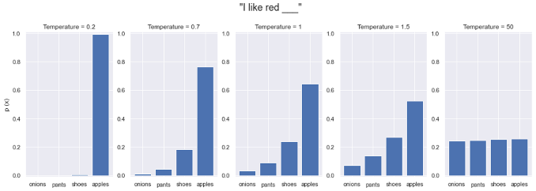

---
layout: default
---

# Génération de texte : échantillonnage et reproductibilité

<v-clicks at="1">

- **Top-p (nucleus) :** trier les tokens par probabilité décroissante, garder le plus petit ensemble atteignant le seuil p, puis renormaliser.
- **Top-k :** ne garde que les k tokens les plus probables. La taille du sous-ensemble est fixe, contrairement à top-p.
- **Reproductibilité :** fixer un seed n'assure pas l'égalité entre matériel, version ou batching. Consigner modèle et paramètres.

</v-clicks>

---
layout: image-overlay
class: genai-illustrated genai-diffusion
---

# Génération d'images : architecture de diffusion

<v-clicks at="1">

- **Principe :** ajouter du bruit (forward) puis apprendre le débruitage inverse (reverse). Certains modèles travaillent en pixels, d’autres dans un espace latent compressé.
- **Compromis du latent :** compression réduit calcul et mémoire, mais la reconstruction perd de l'information. Un détail fin peut s'estomper.
- **Conditionnement :** texte ou image guide le débruitage. Le compromis qualité / fidélité dépend du scheduler et du nombre d'étapes.

</v-clicks>

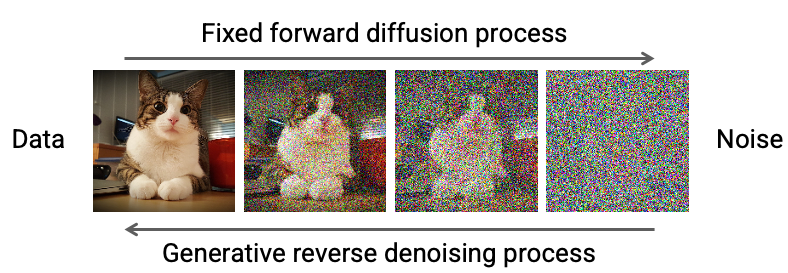

---
layout: image-overlay
class: genai-illustrated genai-large-visual
---

# Diffusion latente : lire l’architecture

L’encodeur compresse l’image ; le débruiteur conditionné transforme les latents ; le décodeur reconstruit les pixels.

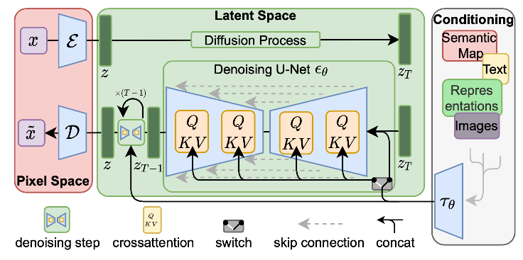

---
layout: default
---

# Génération d'images : CFG et paramètres

<v-clicks at="1">

- **CFG-scale :** intensité du conditionnement. Son effet dépend du modèle, de la variante et de l'implémentation ; les valeurs ne sont pas interchangeables.
- **N-steps :** nombre d'étapes de débruitage. Plus de pas n'améliore pas toujours la qualité ; le scheduler compte autant que le décompte.
- **Denoising strength (img2img) :** fraction de bruit réinjectée. Basse = proche de la source ; haute = réinterprétation libre.
- **Prompt négatif :** préciser les éléments à éviter quand le modèle le permet. Ce guidage ne garantit pas leur absence.

</v-clicks>

---
layout: default
---

# Génération d'images : seed et comparaisons

<v-clicks at="1">

- **Seed :** fixer le seed et conserver l'environnement aide à isoler un paramètre. Le seed seul n'assure pas l'égalité entre runs.
- **Variabilité :** matériel, version du modèle et batching peuvent modifier le résultat, même à seed identique.
- **Bonne pratique :** consigner modèle, version, paramètres et environnement pour qu'une comparaison reste reproductible.

</v-clicks>

---

# Activité : paramètres de diffusion

<v-clicks at="1">

- **Protocole :** garder modèle, version, environnement et seed identiques ; ne faire varier qu'un seul paramètre à la fois pour mesurer durée et qualité.
- **N-steps, CFG, denoising :** comparer successivement N-steps, puis CFG-scale, puis denoising strength ; remettre les autres paramètres à leur valeur initiale et consigner les résultats.
- **img2img et seed :** tester un passage img2img avec denoising strength faible puis élevé. Noter que le seed seul ne garantit pas l'égalité entre moteurs.

</v-clicks>

---
layout: image-overlay
class: genai-illustrated genai-design
---

# Usages individuels : design et rédaction

<v-clicks at="1">

- **Design et graphisme :** prototypes visuels, affiches, illustrations. Outils : Midjourney, Stable Diffusion, Flux, Firefly.
- **Rédaction créative :** scénarios, récits interactifs, co-écriture, poésie. Outils : ChatGPT, Claude, Llama.
- **Entrepreneuriat :** idéation, validation de concepts, prototypage rapide de propositions de valeur avant engagement.

</v-clicks>

---
layout: image-overlay
class: genai-illustrated genai-companion
---

# Usages individuels : compagnons IA

<v-clicks at="1">

- **Soutien et coaching :** compagnons conversationnels offrant un soutien émotionnel, coaching de vie ou romance interactive.
- **Exemples :** Replika, Character.ai. Les fournisseurs ne résolvent pas toutes les questions éthiques soulevées.
- **Limites :** ces usages appellent une vigilance sur la dépendance affective et la confidentialité des données.

</v-clicks>

---
layout: image-overlay
class: genai-illustrated genai-workplace
---

# Entreprise : poste de travail et communication

<v-clicks at="1">

- **Poste de travail :** Copilot Microsoft 365, Google Workspace. L'IA s'intègre aux outils métier existants.
- **Intégration :** relier documents et outils métier en respectant les droits d’accès et la confidentialité.
- **Adoption :** la valeur dépend de l'intégration au flux de travail réel, pas seulement de la qualité brute du modèle.

</v-clicks>

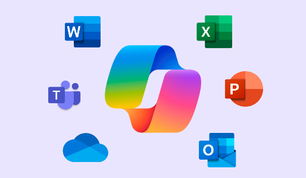

---
layout: image-overlay
class: genai-illustrated genai-email
---

# Entreprise : communication et marketing

<v-clicks at="1">

- **Communication :** synthèse de documents longs, extraction de thèmes majeurs, structuration d'arguments.
- **Marketing :** contenus réseaux sociaux, blogs, slogans, storyboards. FAQ dynamique et chatbots conversationnels.
- **Recrutement et formation :** descriptions de poste, résumé de candidatures, scénarios d'entretien, parcours adaptatifs.

</v-clicks>

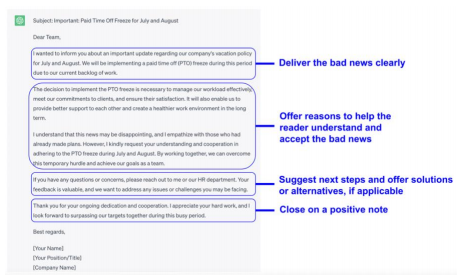

---
layout: image-overlay
class: genai-illustrated genai-analytics
---

# Entreprise : analytics et activité

<v-clicks at="1">

- **Analytics et décision :** automatisation de pipelines de données, modélisation, visualisation rapide, synthèse de tableaux de bord.
- **Activité :** campagne fictive pour un nouveau soda : un slogan, un visuel, trois posts réseaux, un scénario de pub.
- **Limites :** la génération automatique ne remplace pas une stratégie. Une relecture humaine reste nécessaire.

</v-clicks>

---
layout: image-overlay
class: genai-illustrated genai-sectors
---

# Secteurs : finance et éducation

<v-clicks at="1">

- **Finance :** extraction d'informations de rapports, prévisions, détection d'anomalies. Encadrement réglementaire strict.
- **Éducation :** supports pédagogiques adaptatifs, vulgarisation, quiz dynamiques, tuteurs interactifs personnalisés.
- **Limites communes :** la relecture experte reste indispensable avant toute décision à fort impact.

</v-clicks>

---
layout: image-overlay
class: genai-illustrated genai-sectors
---

# Secteurs : recherche et santé

<v-clicks at="1">

- **Recherche :** synthèse d'articles, exploration documentaire, génération d'hypothèses, prototypage rapide de modèles.
- **Santé :** rédaction de comptes-rendus, aide au diagnostic (avec revue médicale obligatoire), chatbots de suivi patient.
- **Vigilance :** dans les deux domaines, la sortie de l'IA reste un brouillon à valider par un expert humain.

</v-clicks>

---

# Activité : graphique historique crypto

<v-clicks at="1">

- **Donnée et méthode :** charger un graphique daté BTC, ETH ou autre sur 1-3 ans. Masquer la partie future avant toute sollicitation du modèle.
- **Lecture et scénarios :** repérer 2-3 régimes (tendance, range, choc exogène). Demander des trajectoires alternatives sans prétendre prédire la réalisation réelle.
- **Comparaison :** révéler la suite historique et comparer les scénarios à la baseline « dernier cours inchangé ». Un exemple isolé ne démontre aucune capacité prédictive.
- **Limites explicites :** signaler la possible connaissance préalable de l'historique par le modèle et l'absence de preuve prédictive. Aucune opération réelle.

</v-clicks>

---

# Activité : recommandation voyage

<v-clicks at="1">

- **Entrées :** destination, dates, budget, contraintes (santé, mobilité). Utiliser uniquement des données fictives pour le voyage et les personnes. Aucune réservation automatique.
- **Sorties :** itinéraire, hébergement, activités, transports locaux. Demander des recommandations vérifiables et traçables, pas des promesses.
- **Vérification :** contrôler chaque élément sur sites officiels, avis récents et cartes datées. Signaler explicitement ce qui reste invérifiable ou daté.

</v-clicks>

---

# Techniques : consignes et exemples

<v-clicks at="1">

- **Consigne explicite :** préciser la tâche, le public, les données autorisées, le format attendu et les critères de réussite.
- **Few-shot :** fournir quelques exemples représentatifs d’entrées et de sorties. Ils guident le contexte sans modifier les poids du modèle.
- **Instructions système :** séparer les règles applicatives du contenu fourni par les utilisateurs ou les documents. Le prompt seul n’est pas une barrière de sécurité.
- **Évaluer :** comparer les variantes sur les mêmes cas, y compris les cas limites. Demander des étapes vérifiables plutôt qu’une justification plausible.

</v-clicks>

---

# Techniques : workflows et agents

<v-clicks at="1">

- **Workflow :** le programme fixe l’ordre des étapes, par exemple extraire, vérifier, puis rédiger. Les erreurs et reprises sont explicites.
- **Agent :** le modèle choisit certaines actions dans une boucle d’outils autorisée. L’application conserve permissions, budget et conditions d’arrêt.
- **Orchestration :** Semantic Kernel, LangChain ou AutoGen aident à composer outils, modèles et échanges. Plusieurs agents ajoutent aussi coordination, latence et coûts.
- **Choisir simplement :** commencer par un workflow quand les étapes sont connues. N’ajouter de l’autonomie que si elle apporte un gain mesuré.

</v-clicks>

---

# Techniques : sorties structurées

<v-clicks at="1">

- **JSON Schema :** le modèle produit une sortie qui respecte un schéma défini -- clés, types, énumérations, champs obligatoires.
- **Décodage contraint :** les implémentations compatibles restreignent les tokens aux formes permises par le schéma. Ce mécanisme ne constitue pas une vérification factuelle.
- **Côté code applicatif :** un `json.loads(arguments)` reste nécessaire pour les appels d'outils et la manipulation post-réponse ; le schéma ne supprime pas le parsing, il borne les formes possibles.
- **Limites :** la conformité structurelle ne signifie pas vérité du contenu ; les refus et troncatures restent à gérer par l'application.

</v-clicks>

Référence : <a href="https://github.com/jsboige/CoursIA/blob/main/MyIA.AI.Notebooks/GenAI/Texte/03_Structured_Outputs.ipynb">3_Structured_Outputs.ipynb</a>.

---

# Techniques : boucle d'outils

<v-clicks at="1">

- **Function Calling :** le modèle *propose* un appel d'outil via `tool_calls`, l'application *autorise et exécute* la fonction, puis ré-injecte le résultat avec le rôle `tool`.
- **Le modèle n'est pas souverain :** c'est l'application qui décide quels appels exécuter, avec quelles limites, et quand arrêter la boucle.
- **Contrôle du choix :** `tool_choice="auto"` laisse le modèle décider, `tool_choice={"type":"function",...}` force un outil précis.
- **Boucles bornées :** limiter le nombre d'itérations et le coût total est une bonne pratique de production -- ne jamais laisser une boucle ouverte sans garde-fou.

</v-clicks>

Référence : <a href="https://github.com/jsboige/CoursIA/blob/main/MyIA.AI.Notebooks/GenAI/Texte/04_Function_Calling.ipynb">4_Function_Calling.ipynb</a>.

---

# Techniques : RAG et sources

<v-clicks at="1">

- **Principe :** découper un corpus en *chunks*, générer un embedding par chunk, retrouver les *k* plus proches voisins d'une question, les injecter dans le contexte.
- **Reranking :** une forte similarité cosinus ne prouve pas la pertinence. Une étape de reranking peut améliorer la pertinence des passages ; vérifier son gain et son coût sur des questions représentatives.
- **Citations :** demander au modèle de citer ses sources produit un contrat de forme, pas un contrat de vérité. Une note [3] peut désigner un passage hors sujet.
- **Limites :** la qualité dépend de l'embedder, du découpage, et du nombre *k* de passages récupérés -- le RAG n'est pas magique, c'est un compromis à régler empiriquement.

</v-clicks>

Référence : <a href="https://github.com/jsboige/CoursIA/blob/main/MyIA.AI.Notebooks/GenAI/Texte/05_RAG_Modern.ipynb">5_RAG_Modern.ipynb</a>.

---

# Techniques : mémoire persistante

<v-clicks at="1">

- **Mémoire externe :** chaque interaction peut être vectorisée et stockée, puis rappelée par similarité au tour suivant.
- **Gouvernance :** plafonner le nombre d'entrées (LRU), purger périodiquement, tracer ce qui est injecté dans le contexte.
- **Sélection et évaluation :** ne rappeler que les souvenirs utiles, datés et autorisés. Comparer avec et sans mémoire sur des questions nécessitant un rappel ; stocker davantage ne garantit pas un gain.

</v-clicks>

Référence : <a href="https://github.com/jsboige/CoursIA/blob/main/MyIA.AI.Notebooks/GenAI/Texte/14_Persistent_Memory.ipynb">14_Persistent_Memory.ipynb</a>.

---

# Techniques : MCP et intégrations

<v-clicks at="1">

- **Model Context Protocol :** standard d'échange entre un client (un agent) et un ou plusieurs serveurs exposant trois primitives -- **Tools** (actions), **Resources** (données adressables), **Prompts** (templates).
- **Intérêt :** rendre les outils portables entre frameworks d'agent -- une fois un serveur MCP écrit, plusieurs clients peuvent le consommer.
- **Architecture :** l'hôte gère les autorisations ; le client découvre les capacités d'un serveur et échange via un transport. MCP standardise les échanges, pas la politique de sécurité.
- **Sécurité :** authentification, permissions minimales, racines de fichiers autorisées et validation des arguments. Le notebook lié propose une illustration conceptuelle, pas une intégration de transport validée.

</v-clicks>

Référence : <a href="https://github.com/jsboige/CoursIA/blob/main/MyIA.AI.Notebooks/GenAI/SemanticKernel/08-SemanticKernel-MCP.ipynb">08-SemanticKernel-MCP.ipynb</a>.

---
layout: image-overlay
class: genai-illustrated genai-ecosystem-models
---

# Écosystème : modèles et APIs

<v-clicks at="1">

- **APIs propriétaires :** OpenAI, Anthropic, Google, Mistral -- agrégateur OpenRouter pour comparer ou basculer.
- **Modèles locaux :** Llama, Mistral, Phi, Qwen, DeepSeek -- diffusables via Hugging Face ou GitHub, exécutables localement ou sur un cloud de confiance.
- **Benchmarks :** nombreux, mais aucun ne suffit à prédire la qualité sur une tâche métier spécifique -- évaluer sur ses propres cas.

</v-clicks>

Références : <a href="https://github.com/jsboige/CoursIA/blob/main/MyIA.AI.Notebooks/GenAI/Texte/01_OpenAI_Intro.ipynb">1_OpenAI_Intro.ipynb</a>, <a href="https://github.com/jsboige/CoursIA/blob/main/MyIA.AI.Notebooks/GenAI/Texte/10_LocalLlama.ipynb">10_LocalLlama.ipynb</a>.

---
layout: image-overlay
class: genai-illustrated genai-ecosystem-hosting
---

# Écosystème : hébergement

<v-clicks at="1">

- **Cloud géré :** Hugging Face Inference, Groq, RunPod, Vast.ai, AWS / Azure / GCP.
- **Local :** Oobabooga, Ollama, vLLM. Quantification AWQ, GGUF, EXL2/3 pour faire tenir un modèle sur un GPU limité.

</v-clicks>

Référence : <a href="https://github.com/jsboige/CoursIA/blob/main/MyIA.AI.Notebooks/GenAI/Texte/11_Quantization.ipynb">11_Quantization.ipynb</a>.

---
layout: image-overlay
class: genai-illustrated genai-ecosystem-tools
---

# Écosystème : outils image et conversationnels

<v-clicks at="1">

- **Image :** Stable Diffusion, Flux, Qwen Image Edit ; applications Forge, ComfyUI. Dépôts de modèles : CivitAI, Hugging Face.
- **Conversationnel self-hosted :** Open WebUI, SillyTavern. Workflows métier : Dify, Langflow.

</v-clicks>

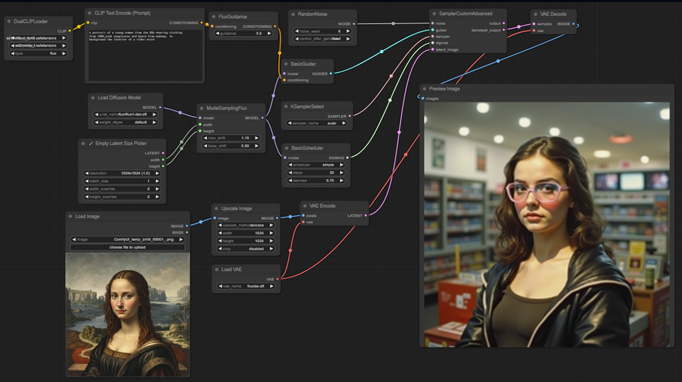

Référence : <a href="https://github.com/jsboige/CoursIA/blob/main/MyIA.AI.Notebooks/GenAI/Texte/19_OWUI_Orchestration.ipynb">19_OWUI_Orchestration.ipynb</a>.

---

# Auto-hébergement : vLLM et mécanique d'inférence

<v-clicks at="1">

- **vLLM :** moteur d'inférence haute performance -- PagedAttention, continuous batching, speculative decoding. Endpoints OpenAI-compatibles.
- **Mécanique d'inférence :** le *prefill* traite tout le prompt en parallèle, le *decoding* génère un token à la fois.
- **KV-cache :** sans cache, chaque nouveau token recalcule l'attention sur tout l'historique. Le KV-cache *réutilise* les clés/valeurs déjà calculées pour les positions précédentes -- ce qui réduit le coût par token de décodage. L'attention historique n'est pas "supprimée", elle est *ré-utilisée*.
- **Métriques :** le TTFT (*time-to-first-token*) agrège réseau, attente serveur, tokenisation et préfill. L'ITL (*inter-token latency*) mesure l'intervalle entre tokens reçus, influencé par le décodage, le batching et la charge. Comparer à contexte et concurrence contrôlés.

</v-clicks>

Référence : <a href="https://github.com/jsboige/CoursIA/blob/main/MyIA.AI.Notebooks/GenAI/Texte/10b_Inference_Mechanics.ipynb">10b_Inference_Mechanics.ipynb</a>.

---

# Post-training : fine-tuning et alignement

<v-clicks at="1">

- **Fine-tuning supervisé (SFT) :** ajuster les poids sur un corpus de paires (instruction, réponse attendue) pour stabiliser un style ou un format.
- **LoRA :** geler les poids de base et apprendre deux matrices de bas rang, A et B, par projection ciblée. Leur produit représente la mise à jour. Le rang règle un compromis de capacité et de coût.
- **QLoRA :** quantifier les poids de base gelés, généralement en 4 bits, tout en entraînant les adaptateurs. **RLHF et DPO** exploitent des préférences ; DPO évite la boucle de renforcement explicite.
- **Quand post-traîner ?** seulement après avoir vérifié qu'un prompt bien écrit et un peu de RAG ne suffisent pas. Sinon, c'est un coût fixe pour un gain marginal -- parfois négatif si le modèle perd en généralité.

</v-clicks>

Référence pratique : <a href="https://github.com/jsboige/CoursIA/blob/main/MyIA.AI.Notebooks/GenAI/Texte/21_LoRA_FineTuning.ipynb">21_LoRA_FineTuning.ipynb</a>.

---

# Test-time scaling : raisonner à l'inférence

<v-clicks at="1">

- **Scaling laws classiques :** la perte de prédiction tend à diminuer avec le calcul, les données et la capacité, dans des régimes étudiés. Cela ne garantit pas un progrès sur chaque tâche.
- **Test-time scaling :** dépenser du calcul supplémentaire *à l'inférence* -- Tree of Thoughts, self-consistency, reward models intermédiaires.
- **Raisonnement natif :** les modèles o1 / o3 *consomment eux aussi* du calcul d'inférence (chain-of-thought interne, en tokens de raisonnement). C'est une forme de test-time scaling *interne*, pas une alternative orthogonale -- les deux peuvent se composer.
- **Trade-off :** le test-time scaling coûte du temps et de l'argent par requête. Sur les tâches vérifiables (maths, code), mesurer le gain face au coût total, tokens de raisonnement inclus. Aucune rentabilité universelle n'est garantie.

</v-clicks>

Références : <a href="https://github.com/jsboige/CoursIA/blob/main/MyIA.AI.Notebooks/GenAI/Texte/15_Tree_of_Thoughts_Search.ipynb">15_Tree_of_Thoughts_Search.ipynb</a>, <a href="https://github.com/jsboige/CoursIA/blob/main/MyIA.AI.Notebooks/GenAI/Texte/17_Native_Reasoning_vs_Scaling.ipynb">17_Native_Reasoning_vs_Scaling.ipynb</a>.

---

# Sécurité des prompts

<v-clicks at="1">

- **Vecteurs d'attaque :** injection directe ("ignore previous instructions..."), injection indirecte (contenu tiers porteur d'instructions), jailbreak par reformulation, exfiltration de contexte système.
- **Défense en profondeur :** filtres de sortie, sandbox pour les outils sensibles, journalisation, rate limiting, séparation des contextes.
- **Self-hosted vs API :** en self-hosted, vous choisissez le niveau de garde -- c'est une souveraineté, mais aussi une charge de maintenance.
- **Verdict :** aucun filtre n'arrête 100% des attaques. La revue humaine reste indispensable pour les actions à fort impact.

</v-clicks>

Référence : <a href="https://github.com/jsboige/CoursIA/blob/main/MyIA.AI.Notebooks/GenAI/Texte/09b_Prompt_Security_RedTeam.ipynb">9b_Prompt_Security_RedTeam.ipynb</a>.

---

# Évaluation : choisir la bonne métrique

<v-clicks at="1">

- **Métriques lexicales :** BLEU et ROUGE comparent les n-grammes avec une référence. Indicatifs pour la paraphrase, mais aveugles à la reformulation valide.
- **Perplexité :** mesure l’incertitude du modèle sur les tokens d’un texte. Plus elle est basse, plus ce texte est prévisible pour ce modèle ; elle ne mesure pas sa vérité.
- **Juge LLM :** pertinent pour comparer deux sorties si le juge est calibré et soumis à un ordre A/B aléatoire. La permutation *détecte* un biais de position si l'ordre inverse renverse la note ; elle ne le *neutralise pas* automatiquement.
- **Évaluer le RAG :** distinguer le rappel des documents retrouvés et le rappel des faits couverts dans la réponse. La fidélité mesure si les affirmations sont soutenues par le contexte ; une réponse fidèle peut omettre des faits importants.

</v-clicks>

Référence : <a href="https://github.com/jsboige/CoursIA/blob/main/MyIA.AI.Notebooks/GenAI/Texte/22_Evaluating_Generated_Text.ipynb">22_Evaluating_Generated_Text.ipynb</a>.

---

# Voix interactive et vidéo générative

<v-clicks at="1">

- **Voix interactive :** les API temps réel permettent une conversation bidirectionnelle avec interruption -- utile pour les assistants oraux.
- **Statut :** les premières API (Realtime Beta) ont été dépréciées ; la version stable (GA) est la cible de migration.
- **Vidéo générative :** LTX-Video, Hunyuan, Wan, Veo -- génération d'une séquence vidéo conditionnée par texte ou image, avec un pipeline d'audiovisuel.
- **Synchronisation :** sonorisation séparée ou générée conjointement, la licence et la latence varient selon l'approche.

</v-clicks>

Références : <a href="https://github.com/jsboige/CoursIA/blob/main/MyIA.AI.Notebooks/GenAI/Audio/03-Orchestration/03-3-Realtime-Voice-API.ipynb">03-3-Realtime-Voice-API.ipynb</a>, <a href="https://github.com/jsboige/CoursIA/blob/main/MyIA.AI.Notebooks/GenAI/Video/02-Advanced/02-5-LTX2-Audiovisual.ipynb">02-5-LTX2-Audiovisual.ipynb</a>.

---

# Multimodalité : texte, image, vision

<v-clicks at="1">

- **Texte :** ChatGPT, Claude, Gemini, modèles locaux (Llama, Mistral, Qwen).
- **Image :** DALL-E, Stable Diffusion, Flux : génération, inpainting, outpainting, upscaling, ControlNet et LoRA. Les fonctions disponibles dépendent du modèle.
- **Vision :** GPT-4o, Qwen-VL, InternVL -- compréhension d'images et de vidéo, raisonnement visuel.

</v-clicks>

Références : <a href="https://github.com/jsboige/CoursIA/blob/main/MyIA.AI.Notebooks/GenAI/Image/02-Advanced/02-4-Z-Image-Lumina2.ipynb">02-4-Z-Image-Lumina2.ipynb</a>, <a href="https://github.com/jsboige/CoursIA/blob/main/MyIA.AI.Notebooks/GenAI/Video/01-Foundation/01-3-Qwen-VL-Video-Analysis.ipynb">01-3-Qwen-VL-Video-Analysis.ipynb</a>.

---

# Multimodalité : audio, musique, code, maths

<v-clicks at="1">

- **Audio :** STT (Whisper, Moonshine), TTS (ElevenLabs, Kokoro), musique (Audiocraft, AudioLDM, AceStep).
- **Code :** VS Code Copilot, Cline, Continue. Côté CLI : Claude Code, Gemini CLI.
- **Mathématiques :** modèles spécialisés (OpenAI, Google) ou ouverts (DeepSeek-Math). La vérification automatique reste le garde-fou.

</v-clicks>

Références : <a href="https://github.com/jsboige/CoursIA/blob/main/MyIA.AI.Notebooks/GenAI/Audio/01-Foundation/01-2-OpenAI-Whisper-STT.ipynb">01-2-OpenAI-Whisper-STT.ipynb</a>, <a href="https://github.com/jsboige/CoursIA/blob/main/MyIA.AI.Notebooks/GenAI/Audio/04-Applications/v4/p5_tts.py">p5_tts.py</a>.

---

# Multimodalité : 3D et représentations

<v-clicks at="1">

- **Représentations 3D :** meshes, NeRFs, voxels, nuages de points.
- **Génération 3D :** DreamFusion (texte → NeRF), Trellis (image → mesh).
- **Limites :** les géométries générées sont souvent incomplètes, les textures manquent de cohérence au changement de vue -- la recherche avance vite, mais la production reste délicate.

</v-clicks>

---

# Révolution et adoption

<v-clicks at="1">

- **Tournant :** l'article *"Attention is All You Need"* (2017) pose les bases des Transformers. Les modèles fondationnels (GPT, BERT, T5) popularisent ensuite l'apprentissage par pré-entraînement massif.
- **Adoption :** Les interfaces conversationnelles ont élargi l'accès aux modèles génératifs. L'usage s'étend au marketing, à la rédaction, à l'assistance client.
- **Limites concrètes :** coût d'entraînement, biais des modèles, complexité des prompts, intervention humaine indispensable.
- **Multidisciplinarité :** ML + NLP + vision par ordinateur, combinant embeddings et mécanismes d'attention.

</v-clicks>

<!-- Référence PPTX : slide 04 (revolution). -->

---

# Coûts d'entraînement et d'inférence

<v-clicks at="1">

- **Coût d'entraînement :** pré-entraîner un grand modèle nécessite des GPU clusters et plusieurs semaines de calcul. Le coût est concentré et ponctuel.
- **Coût d'inférence :** chaque requête paye le préfill et le décodage. Le coût est diffus, récurrent, et c'est lui qui détermine le modèle économique d'un produit.
- **Optimisations :** quantization (AWQ, GGUF, EXL2/3), distillation, PagedAttention (vLLM), speculative decoding.
- **Datacenters :** impact environnemental lié à la consommation électrique et au refroidissement -- un levier réel d'optimisation.

</v-clicks>

<!-- Référence PPTX : slide 05 (donnees / couts). -->

---
layout: image-overlay
class: genai-illustrated genai-ethics
---

# Enjeux éthiques et sociétaux

<v-clicks at="1">

- **Biais et discrimination :** stéréotypes véhiculés par les données, difficiles à corriger complètement.
- **Hallucinations :** réponses incorrectes mais plausibles. La confiance exagérée des utilisateurs aggrave l'impact.
- **Impact environnemental :** coût énergétique de l'entraînement et de l'inférence -- optimiser les modèles et les data centers est un levier réel.
- **Activité :** concevoir un petit dataset, y introduire un biais connu, mesurer si le modèle le reproduit.

</v-clicks>

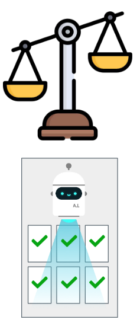

---

# Régulation et droit

<v-clicks at="1">

- **Propriété intellectuelle :** les contenus générés posent des questions de droit d'auteur et de licence -- le statut varie selon les juridictions.
- **Protection des données :** base légale, minimisation, droits des personnes, conservation et transferts. Un hébergement européen ne suffit pas à assurer la conformité au RGPD.
- **AI Act européen :** obligations graduées selon les risques et le rôle de l'organisation. Vérifier le calendrier officiel et les dispositions applicables au système déployé.
- **Décrets nationaux :** États-Unis et autres juridictions adoptent leurs propres cadres (executive orders, décrets).

</v-clicks>

---

# Risques et limites

<v-clicks at="1">

- **Fiabilité :** hallucinations, fabrications, dérapages factuels. Solution : vérification croisée, revue humaine pour les actions à impact.
- **Sécurité :** risques de mauvaise utilisation, perte de contrôle. Les niveaux de sécurité (ASL chez Anthropic) et le Constitutional AI sont des réponses incomplètes.
- **Sociétal :** perte d'emplois, homogénéisation créative, deepfakes. La régulation et l'éducation restent les meilleurs contre-pouvoirs.
- **Activité :** définir une mini-constitution (5 règles) et la tester sur un prompt qui tente de la contourner.

</v-clicks>

---

# Responsabilité sociale

<v-clicks at="1">

- **Rôle des entreprises :** transparence sur les modèles déployés, codes éthiques, audits indépendants.
- **Rôle des utilisateurs :** formation aux limites, esprit critique face aux sorties, signalement des abus.
- **IA pour le bien commun :** écologie (suivi de la déforestation), santé publique, éducation accessible -- usages à fort impact social.
- **Activité :** proposer trois cas d'usage à impact positif dans son domaine, avec et sans accompagnement technique.

</v-clicks>

---

# Défis pratiques de l'adoption

<v-clicks at="1">

- **Compatibilité :** intégration aux CRM, ERP, bases vectorielles existantes -- un projet à part entière.
- **Confidentialité :** maîtrise des flux de données, masquage des PII avant envoi, audit des logs.
- **Coûts :** API au token, GPUs pour le self-hosted. Les modèles distillés et la quantification améliorent le rapport coût / qualité.
- **ROI :** mesurer le temps gagné, la qualité, la correction humaine et les coûts d'intégration sur un cas réel. Comparer à une baseline sans IA ; le retour sur investissement dépend du contexte.
- **Optimisations :** modèles spécialisés plus petits, déploiement local pour la confidentialité, prompts structurés pour réduire les allers-retours.

</v-clicks>

---
layout: section
---

# Questions?

---
layout: cover
---

# Merci

Jean-Sylvain Boige

jsboige@myia.org

<strong>Notebooks associés :</strong> MyIA.AI.Notebooks/GenAI/

Tutoriels DALL-E, Stable Diffusion, ComfyUI, Qwen Image Edit, LLMs

