# Traitement Automatique des Langues

Intelligence Artificielle -- IX

**Jean-Sylvain Boige**
MRes CSAI, Sussex University, Brighton UK
Aricie -- DNN -- PKP -- My Intelligence Agency

> Migration pédagogique : 34 diapositives historiques (2018, anglais) → parcours
> **classique → probabiliste → symbolique → neuronal → moderne**, sans réduire
> le TAL aux LLM.

---
layout: default
---

# Parcours du chapitre

<ul>
  <li>Modèles de langue (caractères, mots, n-grammes)
    <ul><li>Markov, lissage, perplexité</li></ul>
  </li>
  <li v-click>Traitement de l'information
    <ul><li>Classification, recherche d'information (IR), extraction d'information (IE)</li></ul>
  </li>
  <li v-click>Formalismes grammaticaux
    <ul><li>Hiérarchie de Chomsky, CFG/PCFG, parsing CYK</li></ul>
  </li>
  <li v-click>Sémantique, pragmatique, actes de parole</li>
  <li v-click>Traduction automatique et reconnaissance de la parole</li>
  <li v-click>Modèles neuronaux : RNN, LSTM, seq2seq, attention, Transformers</li>
  <li v-click>Agents conversationnels</li>
</ul>

---
layout: default
---

# Plan détaillé

1. Modèles de langue (caractères, n-grammes) — slides 4-7
2. Classification, IR, extraction d'information — slides 8-14
3. Grammaires formelles et probabilistes — slides 17-21
4. Sémantique, complications, argument mining — slides 22-24
5. Traduction et reconnaissance de la parole — slides 25-27
6. Modèles profonds : RNN, LSTM, seq2seq, attention — slide 28
7. Agents conversationnels — slide 29

---

# Couverture moderne (notebooks du dépôt)

| Concept | Owner dans le dépôt |
|---|---|
| n-grammes, modèles de langue | `GenAI/Texte/23_TAL_Du_Mot_Aux_Dependances.ipynb` |
| Markov caché (HMM), Viterbi | `Probas/Infer/Infer-*` |
| Automates finis, transducteurs (morphologie) | `Search/Z3/Sudoku/Lean` |
| CRF / structured prediction | `Probas/Infer/CRF` |
| Parsing CFG/PCFG, CYK | `SymbolicAI/Lean` |
| Sémantique compositionnelle | `SymbolicAI/SemanticWeb` |
| Word embeddings, RNN, LSTM, seq2seq, Transformers | `GenAI/Texte/10*` |
| Agents conversationnels, LUIS, Dialogflow | `GenAI/Plateformes-Conversationnelles` |

> Aucun des 8 arcs n'est perdu silencieusement : chacun renvoie vers un **owner
> exécutable** du dépôt. Les gaps restent à fermer par des notebooks atomiques
> additionnels (jamais autofermés).

---
layout: section
---

# I. Modèles de langue

Caractères, mots, n-grammes et lissage

---
layout: default
---

# 4. Modèles de langue

**Objectifs du TAL**

- Communication avec les humains
- Acquisition d'information → Connaissance
- Classification, recherche d'information, extraction

**Modèles de langue**

- Une **distribution de probabilité** sur des séquences de tokens (caractères,
  syllabes, mots, phrases)
- Token = unité atomique de l'alphabet considéré
- Modèles de langues formelles (Java, Python) : **récursion** + **vocabulaire clos**

**Perplexité** : mesure standard de qualité d'un modèle de langue (plus c'est bas,
mieux c'est). Un modèle triviale (uniforme) donne une perplexité ≈ taille du vocabulaire.

---

# 5. n-grammes

- Modèles **n-gramme** : P(c₁:N) ≈ ∏ P(cᵢ | cᵢ₋ₙ₊₁:ᵢ₋₁)
- Markov d'ordre n − 1
- Valable pour caractères, syllabes, mots, phrases
- Estimation par comptage sur corpus + **lissage** (Laplace, Kneser-Ney)

**Exemple (mot "the")** : P("the") = 0.027 sur un grand corpus anglais.

**Modèle bigramme** : P("the cat") = P("the") × P("cat" | "the").

<div style="display:grid; grid-template-columns:repeat(2,1fr); gap:6px; align-items:center;">
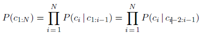
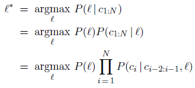
</div>

---

# 6-7. Calculs et modèles mots

**Calcul** : estimation par comptage sur corpus annoté, lissage pour les
séquences absentes.

**Modèles mots** (vs caractères) :

- Vocabulaire plus large → besoin du symbole hors vocabulaire `<UNK>`
- Symboles spéciaux : `<NUM>`, `<EMAIL>`, etc.
- **Unigramme** : perplexité ≈ 891 sur Book ; **Bigramme** : perplexité ≈ 142

**Exemples random** :
- Unigramme : « logical are as are confusion a may right tries agent goal the was ... »
- Bigramme : mieux, mais toujours agrammatical

<div style="display:grid; grid-template-columns:repeat(2,1fr); gap:6px; align-items:center;">
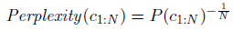
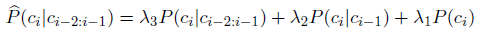
</div>

---
layout: section
---

# II. Classification, RI, IE

Inférence opérationnelle sur texte

---
layout: default
---

# 8. Classification de texte

**Catégorisation** : assigner une classe à un document.

- Identification de langue, genre, analyse de sentiment
- **Détection de spam** : Bayes naïf sur n-grammes

**Bayes naïf** :

$$P(\text{spam} | \text{message}) \propto P(\text{message} | \text{spam}) P(\text{spam})$$

**Approche ML** : message = vecteur de features (n-grammes), classifieur supervisé
(sVM, LR, ou Bayes).

**Bag-of-words** : unigrammes avec comptage d'occurrences, longueur ~100 000,
**pas d'ordre** conservé.

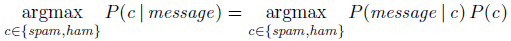

---

# 9-11. Recherche d'information (IR)

**Objectif** : trouver des documents pertinents dans un corpus.

- Corpus (fichier, page, paragraphe), requêtes (booléennes), ensemble de résultats
- **Modèle booléen** initial : pertinence binaire, rigide

**Évaluation** :

- **Précision** = |pertinents ∩ résultats| / |résultats|
- **Rappel** = |pertinents ∩ résultats| / |pertinents|
- **P@10** = précision dans les 10 premiers résultats
- **F1** = 2PR/(P+R)

**Algorithmes** :

- **TF-IDF** : pondération classique par fréquence inverse documentaire
- **PageRank** (Google, 1997) : surfer aléatoire + vote par in-links, récursif jusqu'à convergence

<div style="display:grid; grid-template-columns:repeat(3,1fr); gap:6px; align-items:center;">
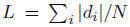
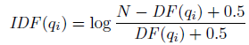

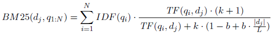
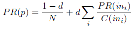

</div>

---

# 12-13. Extraction d'information (IE)

**Objectif** : extraire des **champs structurés** depuis du texte non structuré.

- Adresses, prévisions météo, entités nommées

**Approches** :

- **Automates finis** : regex pour motifs simples (`[$][0-9]+([.][0-9][0-9])?` matche `$249.99`)
- **Templates** : priorité entre motifs, valeurs par défaut
- **Extraction d'ontologie** depuis grands corpus (Hearst patterns)

**Pattern Hearst** : « NP such as NP (, NP)* ((and|or) NP)? » extrait des
hyperonymes (sous-catégories) depuis le web.

<div style="display:grid; grid-template-columns:repeat(3,1fr); gap:6px; align-items:center;">
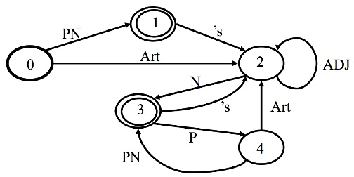
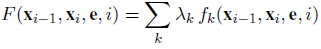
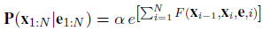
</div>
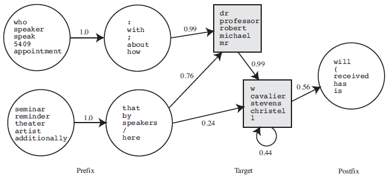
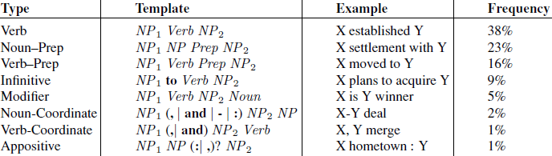

---

# 14. Synthèse section II

**Points clés** :

- n-grammes probabilistes : très puissants (identification, orthographe,
  classification, reconnaissance d'entités)
- Millions de features → **sélection** et **prétraitement** indispensables
- Classification : Bayes naïf n-grammes OU tout classifieur ML (Deep Learning)
- Compression ≈ modèle de langue
- RI : TF-IDF, PageRank, F1 pour l'évaluation

---
layout: default
---

# 15. Questions ?

**Discussion** :

- Tradeoff perplexité / couverture ?
- Bayes vs Deep Learning pour la classification ?
- Quand un automate suffit-il ?

---
layout: section
---

# III. Grammaires formelles

De Chomsky à CYK

---
layout: default
---

# 17. Grammaires

**Communication** = échange d'information par production/perception de signes.

**Modèles de communication** : plus complexes que la simple classification.

**Formalismes grammaticaux** : classes de capacité générative (Chomsky).

| Classe | Machine | Exemple |
|---|---|---|
| Récursivement énumérable | Turing machine | Langages naturels (?) |
| Sensible au contexte | LBA | Langages naturels |
| **Hors contexte** (CFG) | Automate à pile | Syntaxe de la plupart des langages de programmation |
| Régulier | DFA | Patterns, regex |


---

# 18. Grammaires probabilistes

**PCFG** = CFG + probabilités sur les règles.

- Non-terminaux + terminaux + **règles pondérées**

**Exemple minimal** (monde du Wumpus) :

```
S → NP VP  [0.9]
S → VP     [0.1]
NP → DET N [0.6]
NP → NAME  [0.4]
VP → V NP  [0.4]
VP → V     [0.6]
```

**Lexique** : listes de mots autorisés par catégorie (noms, verbes, adjectifs,
mots fonctionnels). Classes ouvertes (mots ajoutés au fil du temps).

<div style="display:grid; grid-template-columns:repeat(4,1fr); gap:6px; align-items:center;">
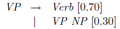
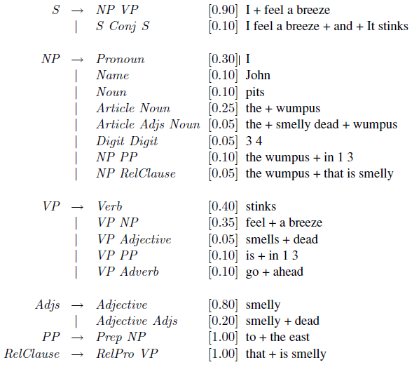

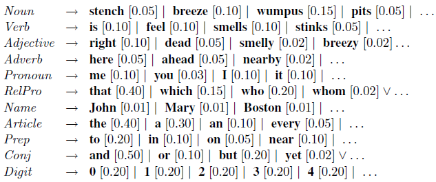
</div>

---

# 19. Analyse syntaxique — Parsing

**Objectif** : retrouver la **structure en syntagmes** d'une phrase.

- Approches **top-down** ou **bottom-up**
- Risque d'inefficacité → **backtracking**

**Exemple classique d'ambiguïté** :

> « Have the students in section 2 of Computer Science 101 take the exam. »

vs.

> « Have the students in section 2 of Computer Science 101 taken the exam? »

**Solution** : stocker les résultats intermédiaires → **Chart parsing**, **CYK**.

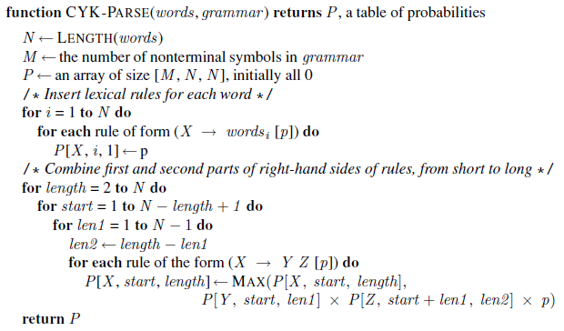

---

# 20-21. Apprentissage des PCFG

**Données d'entraînement** : corpus annoté = **treebank**
(Penn Treebank 1993, 3M mots).

**Apprentissage** : PCFG par **comptage** des règles dans le treebank.

$$\hat{P}(\alpha \to \beta) = \frac{\text{count}(\alpha \to \beta)}{\text{count}(\alpha)}$$

**Améliorations** :

- Lissage des règles peu fréquentes
- **Grammaires augmentées** : lexicalisation, sous-catégorisation, head-to-head
- **Definite Clause Grammar** (DCG) → logique du premier ordre (Prolog)

<div style="display:grid; grid-template-columns:repeat(2,1fr); gap:6px; align-items:center;">
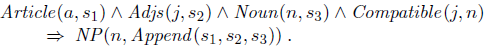
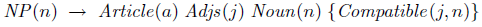
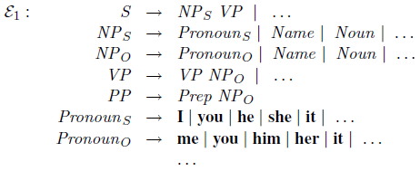
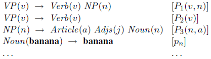
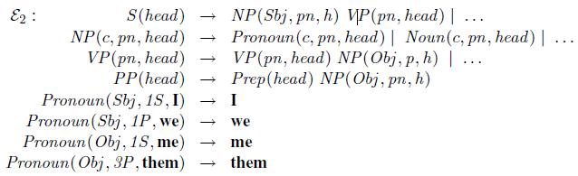
</div>

---
layout: section
---

# IV. Sémantique et complications

Du sens au contexte

---
layout: default
---

# 22. Interprétation sémantique

**Sémantique compositionnelle** : le sens d'une expression est **fonction** du sens
de ses parties.

**Exemple (expressions arithmétiques)** : ajouter une variable dans l'arbre syntaxique.

**Règles sémantiques** : arbre syntaxique annoté d'une **interprétation sémantique**.

**Verbes** : prédicats au même titre que les syntagmes verbaux (VP).

**Entraînement** : à partir d'exemples annotés (parallélisme syntaxe-sémantique).

<div style="display:grid; grid-template-columns:repeat(3,1fr); gap:6px; align-items:center;">
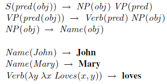
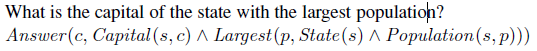
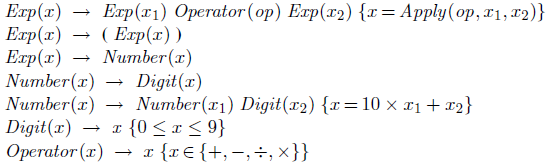
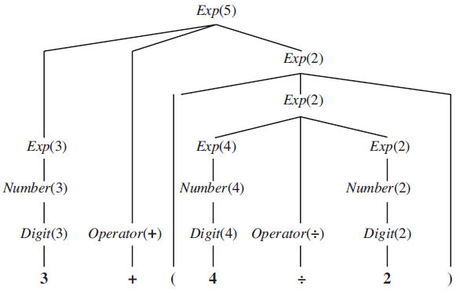
</div>

---

# 23. Complications

**Temps et aspect** → **event calculus** (intervales, fluents).

**Quantification** → quasi-logical form (Skolem, etc.).

**Pragmatique** : injecter du **contexte** :

- **Indexicaux** (« je », « aujourd'hui »)
- **Actes de parole** (commandes, assertions, promesses, avertissements)
- **Dépendances longue distance** :

> « Who did the agent tell you to give the gold to? » → trace `_`licenciée par `who`

<div style="display:grid; grid-template-columns:repeat(2,1fr); gap:6px; align-items:center;">
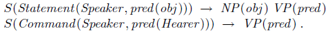
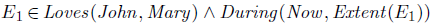
</div>

---

# 24. Fouille d'arguments

**Objectif** : extraire la **structure inférentielle** depuis un texte argumentatif.

**Efforts conjoints** : CMNA, COMMA, ACL.

**Outils** :

- DisLog Language, Topic-Based Modelling
- **AIF** (Argument Interchange Format) + RDF
- Outils d'annotation : **OVA+**

**Applications** : détection de sophismes, journalisme automatisé, aide à la décision.

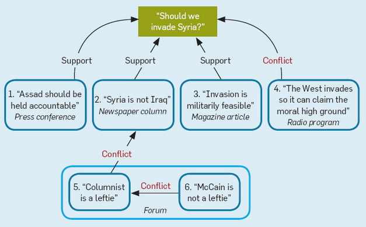

---
layout: section
---

# V. Traduction et parole

---

# 25-26. Traduction automatique

**Types** :

- **Rough** : contient des erreurs, post-correction humaine
- **Pre-edited** : traduction humaine après pré-édition
- **Restricted-source** : entièrement automatique sur domaines stéréotypés

**Difficultés** :

- Les langues catégorisent différemment
- Besoin d'une **langue intermédiaire (interlingua)** pour représenter l'universal

**Traduction statistique** (la plus efficace, ex. Google Translate) :

- Pas besoin d'ontologie complexe ni de grammaires artisanales
- Juste des **exemples de traduction**
- Maximise P(f) × P(e|f) (modèle cible × modèle de traduction)

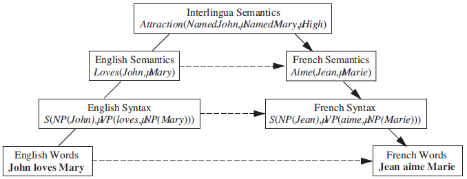
<div style="display:grid; grid-template-columns:repeat(3,1fr); gap:6px; align-items:center;">
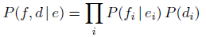
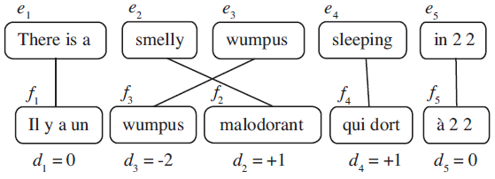
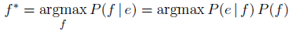
</div>

---

# 27. Reconnaissance de la parole

**Objectif** : signal acoustique → phrase.

**Difficultés** : ambiguïté + bruit.

> « recognize speech » vs « wreck a nice beach »

**Solutions** :

- **Segmentation** : espaces
- **Coarticulation** : « nice beach » → « sp »
- **Homophones** : « to / too / two »
- **Séquence la plus probable** :
  P(acoustic | words) × P(words | language model)

**Modèle acoustique** : P(sound₁:ₜ | word₁:ₜ). **Modèle de langue** :
P(word₁:ₜ) — vu en section I.

<div style="display:grid; grid-template-columns:repeat(4,1fr); gap:6px; align-items:center;">

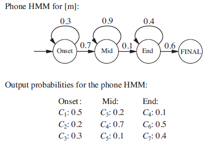
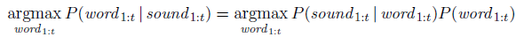
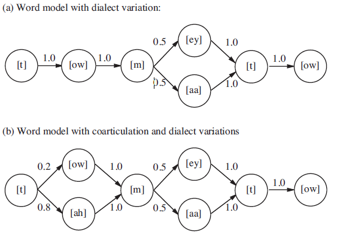
</div>

---
layout: section
---

# VI. Modèles neuronaux

De RNN à Transformers

---
layout: default
---

# 28. Modèles profonds

**Réseaux récurrents (RNN)** : mémoire interne = contexte.

- **seq2seq** : encodeur / décodeur
- Couches **LSTM** (longue mémoire)
- **Attention** : focus dynamique sur la séquence source

**Tâches** : traduction, sous-titrage, Q&A, génération de texte.

**Transformers** (2017) : self-attention multi-têtes, parallélisable, fondation des
LLM modernes.

> Cette migration historique s'arrête à 2018. Pour les architectures
> post-2018 (BERT, GPT, T5, etc.), voir `GenAI/Texte/10*` et `GenAI/Texte/13*`
> du dépôt.

<div style="display:grid; grid-template-columns:repeat(4,1fr); gap:6px; align-items:center;">
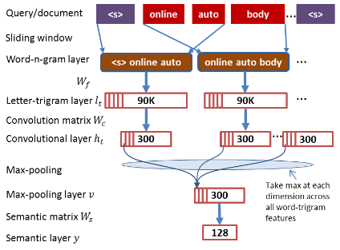
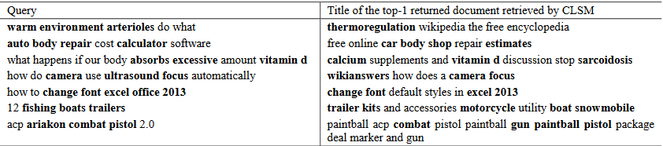
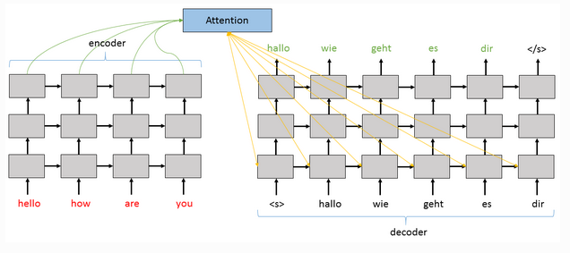
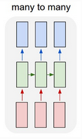
</div>

---

# 29. Agents conversationnels

**Agents à base de règles avec NLP UX** :

- Microsoft Bot Framework + LUIS
- Google Dialogflow
- Recast, Facebook Wit.ai, Salesforce Einstein

**Architecture** :

- Connecteurs vers canaux (Slack, Teams, Messenger, web)
- Déclencheurs synchrones / asynchrones
- Appels NLP (LUIS, Dialogflow) pour l'intent et les entités

**Voir** : `GenAI/Plateformes-Conversationnelles/*` pour les notebooks modernes
(open-webUI, Qwen, etc.).

<div style="display:grid; grid-template-columns:repeat(2,1fr); gap:6px; align-items:center;">
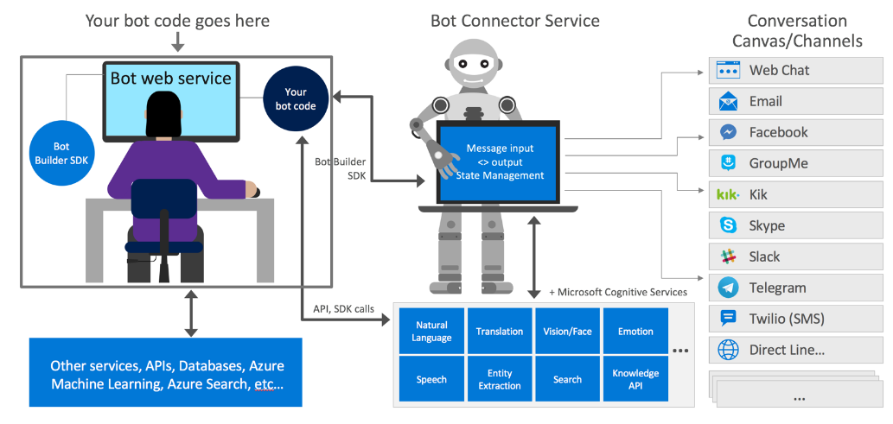

</div>

---
layout: default
---

# 30. Synthèse TAL historique

**Théorie des langages formels** : utile pour la syntaxe.

- Syntagmes, grammaires hors contexte
- Parsing efficace avec PCFG
- Apprentissage depuis treebank
- Augmentation (DCG → FOL)

**Vers le moderne** : embeddings, RNN, LSTM, seq2seq, attention, Transformers.

> Le TAL historique n'est pas obsolète : il pose les **fondations théoriques**
> des architectures modernes. Comprendre n-grammes et PCFG reste indispensable
> pour interpréter les sorties LLM.

---

# 31. Questions ?

**Discussion** :

- Quelle place pour les grammaires dans les LLM ?
- PCFG vs Transformers : opposition ou complémentarité ?
- Traduction statistique vs neuronale : quand l'une surpasse-t-elle l'autre ?

---
layout: section
---

# VII. Références au dépôt

---

# 32. Couverture TAL dans le dépôt

| Concept historique | Notebook moderne |
|---|---|
| n-grammes, modèles de langue | `GenAI/Texte/23_TAL_Du_Mot_Aux_Dependances.ipynb` |
| HMM, Viterbi | `Probas/Infer/*` |
| Automates finis, transducteurs | `Search/Z3/Sudoku/Lean` |
| CRF, structured prediction | `Probas/Infer/*` |
| Parsing CFG/PCFG | `SymbolicAI/Lean` |
| Sémantique | `SymbolicAI/SemanticWeb` |
| RNN, LSTM, seq2seq, attention | `GenAI/Texte/10*` |
| Transformers, LLMs | `GenAI/Texte/11*`, `13*` |
| Bots conversationnels | `GenAI/Plateformes-Conversationnelles/*` |

---

# 33. Projets étudiants suggérés (héritage 2018)

**Conception de bots de service pour réseaux sociaux** :

- Chat Bots, AIML, Reddit et agents de service, NLP, RDF, APIs

**Modèle d'inférence pour analyse de sentiment** :

- Probabilités, Infer.NET, expérimental, Reddit

**Stratégies d'entraînement pour trading crypto** :

- Bitcoin, DN/Encog, machine learning

> Ces projets sont **historiques** (2018). Pour les projets modernes équivalents,
> voir le syllabus courant (`MyIA.AI.Notebooks/GradeBookApp/`).

---

# 34. Merci

**Jean-Sylvain Boige**
jsboige@myia.org

> Migration pédagogique : 34 slides TAL historiques → Slidev FR classique →
> moderne. Aucun arc perdu silencieusement, chaque concept pointe vers un
> owner exécutable du dépôt.
