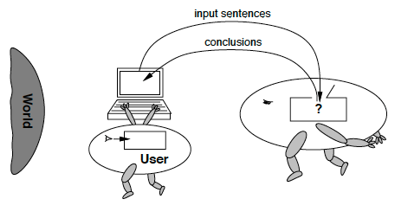
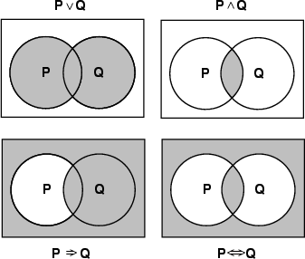

<!-- _class: title -->

# Introduction à l'argumentation

- Argumentum
- Histoire et théories
- Principes de l'argumentation
- Bons et mauvais arguments
- Fondements logiques du raisonnement
- Références bibliographiques

---

# Histoire de l'argumentation

- **Importance dans l'histoire de la pensée humaine**
  - Mécanisme par lequel les idées sont exprimées, discutées et évaluées
  - Remise en question des croyances préconçues et la recherche de la vérité
  - Influence profonde sur la philosophie, la politique et la science
- **La méthode socratique**
  - Poser des questions pour stimuler la pensée critique
  - Exposer les contradictions
- **La rhétorique aristotélicienne**
  - Ethos, logos et pathos

<!-- TODO: timeline Aristote -> Toulmin -> argumentation computationnelle -->
<!-- TODO: schema Ethos/Pathos/Logos avec exemples -->

---

# Histoire de l'argumentation (suite)

- **L'argumentation au Moyen Âge**
  - La scolastique et Thomas d'Aquin
- **La pensée de la Renaissance et l'humanisme**
  - Éloquence et persuasion
- **Dans l'âge des Lumières**
  - Raison et débat public
- **Au 19è siècle**
  - Forme logique moderne
- **Au 20e siècle**
  - Toulmin, Perelman, etc.
- **À l'ère numérique**
  - Nouveaux défis et opportunités

---

# Théories de l'argumentation (1/2)

- **Dans la logique formelle**
  - Utilise des règles et des symboles
  - Logiques propositionnelle, des prédicats, modale, argumentative
- **Dans la rhétorique**
  - Aristote, Cicéron, Quintilien
  - Art de persuader les auditeurs
  - Invention, disposition, élocution, mémoire et prononciation
- **Dans la linguistique**
  - Contextes langagiers : construction et interprétations (performativité)
  - Pragmatique (intentions, implicatures, relations locuteur/auditeur/contexte)
  - Analyse du discours (structures discursives)

---

# Théories de l'argumentation (2/2)

- **En psychologie sociale**
  - Persuasion, mécanismes psychologiques sous-jacents
  - Changement d'attitude
  - Processus cognitifs impliqués, théorie de l'élan cognitif (état émotionnel)
- **En communication**
  - Influencer les croyances, les attitudes et les comportements
  - Théories de l'influence sociale, du comportement de communication
  - Persuasion stratégique, communication persuasive

---

# Un code de conduite intellectuelle (1/2)

- **Un standard procédural efficace**
  - Les règles de bases pour une discussion fructueuse
- **Un standard éthique important**
  - Les parties s'engagent à être honnêtes
- **Principes de conduite intellectuelle**
  - **Faillibilité** : Accepter de pouvoir se tromper
  - **Recherche de la vérité** : S'engager à rechercher la position la plus défendable
  - **Clarté** : Pas de confusion linguistique et séparé d'autres problématiques
  - **Charge de la preuve** : Repose sur celui qui avance une position

---

# Un code de conduite intellectuelle (2/2)

- **Principes de conduite intellectuelle (suite)**
  - **Charité** : Donner à l'adversaire le bénéfice du doute
  - **Structure, Pertinence, Acceptabilité, Suffisance, Réfutation**
  - **Suspension du jugement** : Si pas de preuve ou des arguments égaux, sauf si nécessaire → conséquences ?
  - **Résolution** : Si tout le reste est respecté, accepter la conclusion
  - **Accepter un nouvel examen au besoin**

---

# Qu'est-ce qu'un argument ?

- **Une proposition supportée par d'autres propositions**
  - **Prémisses** : Les raisons
  - **Conclusion** : Supportée par les prémisses et le raisonnement
- **Argument =/= Opinion**
  - Une opinion n'est pas supportée
- **Forme standard pouvant être reconstituée**
  - Puisque (prémisse 1), qui est une conclusion supportée par (sous-prémisse 1.1)
  - et (prémisse 2)
  - [et (prémisse implicite)]
  - et (prémisse de réfutation)
  - Alors (Conclusion)

<!-- TODO: schema modele de Toulmin (Claim, Data, Warrant, Backing, Qualifier, Rebuttal) -->

---

# Déduction vs Induction et Arguments particuliers

- **Déduction vs Induction**
  - **Déduction** → nécessité logique
  - **Induction** → Corroboration
- **Arguments particuliers**
  - **Moral** → prémisse morale (principe)
  - **Légal** → prémisse légale (loi, jurisprudence etc.)
  - **Esthétique** → prémisse esthétique (Critère esthétique)

<!-- TODO: galerie visuelle des schemes courants -->

---

# Qu'est-ce qu'un bon argument ? (1/2)

**Respecte 5 critères :**

1. **Structure bien formée**
  - Pas de contradictions entre prémisses et avec la conclusion
  - Pas de vérité par principe, ou de déduction invalide
2. **Prémisse pertinentes pour la vérité de la conclusion**
  - Pas de prémisses inutiles, les liens doivent être explicites
3. **Prémisses acceptables par une personne raisonnable**
  - Connaissance commune, ou confirmée par l'expérience
  - Défendue ou défendable par une source accessible
  - Témoignage non controversée par une autorité compétente
  - Conclusion d'un autre bon argument
  - Proposition mineure constituant une hypothèse raisonnable

---

# Qu'est-ce qu'un bon argument ? (2/2)

4. **Prémisses suffisantes à démontrer la conclusion**
  - Difficile à systématiser
  - Cf. certaines sciences (échantillons statistiques) ou expérience
5. **Prémisses fournissant une réfutation effective des critiques anticipées**
  - Le plus difficile, manque le plus souvent
  - Permet de départager de « presque » bons arguments

**Renforcer un argument**
- Balayer ces 5 critères et le modifier en conséquence

---

# Qualités argumentatives (1/2)

- **Clarté**
  - L'argument est-il clairement exprimé et facile à comprendre ?
  - Terminologie, structuration, exemples concrets, explications
- **Pertinence**
  - L'argument est-il directement lié à la question à trancher ?
  - Contribution significative → impact
- **Précision**
  - L'argument est-il suffisamment précis et détaillé ?
  - Malentendus, interprétations, concision, exemples spécifiques

---

# Qualités argumentatives (2/2)

- **Profondeur**
  - L'argument traite-t-il tous les aspects de la question ?
  - Nuances, contre-arguments potentiels, élargissements, différents angles, dimensions
- **Cohérence**
  - L'argument est-il logique et sans contradiction ?
  - Interne et entre les différents arguments
- **Preuve**
  - L'argument est-il appuyé par des faits, des statistiques, des exemples concrets ?
  - Vérifiabilité des faits, qualité des sources, pertinence des autorités

---

# Qu'est-ce qu'un argument fallacieux ?

- **La violation de l'un des critères définissant un bon argument**
  - Faille structurelle
  - Prémisse non pertinente
  - Prémisse sous le standard d'acceptabilité
  - Prémisses insuffisantes à établir la conclusion
  - Pas de réfutation effective des critiques anticipées
- **Nommées ou non**
  - Cf. Taxonomie
  - Nom pas nécessaire, mais utile

<!-- TODO: taxonomie visuelle des sophismes (formels vs informels) -->
<!-- TODO: illustrations pedagogiques des sophismes (ad hominem, strawman, false dilemma, etc.) -->

---

# Dénoncer un argument fallacieux

- **Autodestruction par reconstruction en forme standard**
- **Méthode du contre-exemple absurde**
- **Fair-play**
  - Pas trop en faire
  - Que si nécessaire
  - Accepter ses propres erreurs
  - Éviter si possible de mentionner la notion d'argument fallacieux

---

# Préparation d'un argumentaire (1/2)

- **Définir le but de l'argumentation**
  - Persuader, convaincre, négocier, informer, éduquer etc.
  - Permet de diriger la préparation, la stratégie, les techniques
- **Identifier son public**
  - Connaissances, attitudes, valeurs
  - Ajustement du langage, des exemples, des preuves
- **Recherche et sélection des preuves**
  - Identification de sources et de leurs qualités

---

# Préparation d'un argumentaire (2/2)

- **Organiser ses arguments**
  - Du plus fort au plus faible, général au particulier, ou inversements
  - Structure problème-solution, etc.
  - Impact et cheminement des idées
- **Construire des arguments**
  - Prémisse, preuve, conclusion
  - Réfutation des arguments adverses
- **Examiner les arguments contraires**
  - Renforcer et anticiper les objections
  - Stratégies de réfutation (prémisses, contre-arguments, preuves contradictoires, biais, faiblesse)

---

# Analyse d'un débat (1/2)

- **Comprendre le contexte et le but du débat**
  - Tenir compte des spécificités et enjeux
  - Différents types (politiques, académiques, médiatiques etc.)
- **Identifier les parties et leurs positions**
  - Intérêts, affiliations, motivations
  - Positions déclarées vs positions réelles
- **Analyser les arguments : validité, pertinence, force**
  - Validité logique, pertinence vs enjeu, capacité à convaincre
  - Sans partialité, forces et faiblesses

---

# Analyse d'un débat (2/2)

- **Identifier les stratégies rhétoriques utilisées**
  - Anecdotes, émotions, preuves scientifiques, autorité etc.
  - Conviction, persuasion, manipulation
- **Déceler les failles logiques et les erreurs de raisonnement**
  - Biais, sophismes, causalité, généralisations, attaques, diversions etc.
- **Évaluer l'efficacité globale de chaque participant**
  - Présentation, réfutation, consistance
  - Éviter préjugés et favoritismes

---

<!-- _class: section-visual -->

# Raisonnement logique : Intelligences

---

<!-- _class: columns-layout -->

# Représentation et logique

- **Représentation de connaissance**
  - Forme manipulable par la pensée / l'ordinateur
- **Base de connaissance (KB)**
  - Énoncés dans un langage formel
- **Langage de représentation**
  - **Syntaxe** : séquences possibles de symboles
  - **Sémantique** : faits auxquels les énoncés correspondent
- **Raisonnement**
  - Conséquence logique → inférence

---

# Propriétés des systèmes logiques

- **Correction**
  - Préserve la validité sémantique
- **Cohérence / consistance**
  - Pas de contradiction
- **Complétude**
  - Dériver tout ce qui est valide
- **Problème**
  - Gödel : théorèmes d'incomplétude

---

# Types de logiques

- **Ontologie**
  - Étude de ce qui existe
- **Épistémologie**
  - Étude de ce qui peut être connu

---

<!-- _class: columns-layout -->

# Logique propositionnelle

- **Syntaxe**
  - Constantes (V,F)
  - Symboles
  - Connecteurs
- **Sémantique**
  - Tables de vérité

---

# Règles d'inférence

- **Objectif de l'inférence logique**
  - Vérifier qu'un énoncé est une conséquence de la KB, i.e. un théorème
- **Inférence par la preuve**
  - Utilisation de règles de dérivation cohérentes pour produire une chaine de conclusions conduisant au but

**Exemple de règles cohérentes**

| RÈGLE | PRÉMISSES | CONCLUSION |
|-------|-----------|------------|
| Modus Ponens | A, A → B | B |
| Introduction du Et | A, B | A ∧ B |
| Élimination du Et | A ∧ B | A |
| Double Négation | ¬¬A | A |
| Résolution d'unité | A ∨ B, ¬B | A |
| Reductio ad absurdum | ¬A → ⊥ | A |
| Résolution | A ∨ B, ¬B ∨ C | A ∨ C |

<!-- TODO: arbre de preuve, graphe de resolution -->

---

# Procédures d'inférence

- **Inférence naturelle**
  - 1 Humide (Prémisse) : "Il fait humide"
  - 2 Humide → Chaud (Prémisse) : "S'il fait humide, il fait chaud"
  - 3 Chaud (Modus Ponens(1,2)) : "Il fait chaud"
- **Chaînage avant**
  - Raisonnement par les données
- **Chaînage arrière**
  - Raisonnement par les buts
  - Ex : Où ai-je mis mes clés ?
- **Autres procédures**
  - Résolution
  - DPLL (la plus populaire)
  - Solveurs SAT

---

# Logique du premier ordre

- **La logique du premier ordre modélise le monde en termes de :**
  - **Objets** : des choses avec des identités individuelles
    - Étudiants, cours, société, voitures
  - **Propriétés** des objets qui les distinguent des autres objets
    - Bleu, oval, pair, large
  - **Relations** qui existent entre les ensembles d'objets
    - Frère de, plus grand que, partie de, a la couleur, se passe après, visite
  - **Fonctions** : relations avec une valeur résultat pour des données entrées
    - Père de, meilleur ami, deuxième moitié, un de plus que

---

# Quantificateurs et règles

- **Quantificateurs**
  - **∃x** : Il existe x
  - **∀x** : Pour chaque x
- **Règles**
  - (∃x) student(x) ∧ smart(x) = "Il y a un étudiant intelligent"

---

# Exemple : investigation

**Énoncé**
> « La loi stipule que c'est un crime pour un américain de vendre des armes à des nations hostiles. La Corée du Nord, un ennemi de l'Amérique, possède des missiles et tous ses missiles lui ont été vendus par le colonel West, qui est américain »

**Solution par chaînage avant**
- Missile(x) ∧ Possède(Corée, x) ⇒ Vend(West, x, Corée)
- Missile(x) ⇒ Arme(x)
- Enemy(x, America) ⇒ Hostile(x)
- Américain(x) ∧ Arme(y) ∧ Vend(x, y, z) ∧ Hostile(z) ⇒ Criminel(x)

---

# Logique modale

- **Extension avec les modalités**
  - De la logique propositionnelle
  - Ou de la logique du premier ordre
- **Modalités**
  - **Possibilité** (peut être vrai)
  - **Nécessité** (doit être vrai)
  - **Contingence** (vrai dans certains cas)
- **Syntaxe : opérateurs**
  - "◊" (diamant = possibilité)
  - "□" (carré = nécessité)
- **Sémantique : mondes possibles**

---

# Applications de la logique modale

- **Philosophie**
  - Modalités épistémiques
- **Informatique**
  - Systèmes multi-agents, vérification formelle
- **Mathématiques**
  - Théorie des ensembles, des jeux, de la preuve
- **Argumentation**
  - Raisonnement modal, mondes possibles

---

# Logiques argumentatives

- **Extension des logiques appliquées à l'argumentation**
  - Analyse de la structure, la validité, la force des arguments
- **Logique argumentative abstraite (de Dung)**
  - Modèle sous forme de graphe (Nœuds = arguments, arrêtes = attaques)
  - Notion d'ensembles stable / extensions (pas d'attaques internes)

<!-- TODO: schema graphe d'attaque AF = (Arguments, Attacks) -->

---

# Extensions de Dung

- **ASPIC (Argumentation with Structured Preferences and Inconsistency Constraints)**
  - Règles, contraintes, attaques entre arguments
  - Satisfaction des règles, validité des arguments, résolution des conflits
- **ABA (Assumption-Based Argumentation)**
  - Utilisation d'ensembles d'hypothèses
  - Relations de soutien et d'attaques
  - Cohérences des ensembles et forces contextuels des arguments

---

# Les attendus du programme

---

# Lycée - Français

**ARGUMENTUM comme opportunité ludique et pédagogique d'aborder les compétences attendues en français :**

_"Les finalités propres de l'enseignement du français au lycée sont les suivantes :"_

- "Améliorer les capacités d'expression"
- "Faire lire les élèves et leur permettre de comprendre et d'apprécier les œuvres, de manière à construire une culture littéraire commune, ouverte sur les autres arts, sur les différents champs du savoir et sur la société"
  - Via les decks histoire, politiques, mythologie, popculture, comme points d'entrée à l'étude des œuvres correspondantes et de leur problématique

---

# Lycée - Français (suite)

- "Structurer cette culture en faisant droit à la sensibilité et à la créativité des élèves dans l'approche des formes"
  - Comment mieux retenir une situation politique clé qu'en ayant "théâtralisé" ce qu'il s'y jouait et revécu l'histoire ?
- "En renforçant leurs capacités d'analyse et d'interprétation"
- "Approfondir et exercer le jugement et l'esprit critique des élèves, les rendre capables de développer une réflexion personnelle et une argumentation convaincante, à l'écrit comme à l'oral mais aussi d'analyser les stratégies argumentatives des discours lus ou entendus"
- "Les amener à adopter une attitude autonome et responsable, notamment en matière de recherche d'information et de documentation"

_Programme de français de première des voies générale et technologique_

---

# Lycée - Français : Compétences (1/2)

**Analyser des parties ARGUMENTUM ou réaliser des "baratins" ARGUMENTUM à l'écrit permettrait de revenir sur :**

- L'expression de la condition
- L'expression de la cause, de la conséquence et du but
- L'expression de la comparaison
- L'expression de l'opposition et de la concession
- Adapter son expression aux différentes situations de communication
- Organiser le développement logique d'un propos

---

# Lycée - Français : Compétences (2/2)

- Reformuler et synthétiser un propos
- Discuter et réfuter une opinion
- Exprimer et nuancer une opinion

**Analyser les discours des situations réelles, notamment en politique ou histoire, qui ont inspiré certains scénarii, permettrait de revenir sur :**
- "L'étude de la langue" comme "objet d'étude"
- Notamment la rhétorique et les choix stylistiques au service de l'argumentation

---

# Pour aller plus loin : Notebooks

- **Tweety Framework** : `SymbolicAI/Argument_Analysis/` (5 notebooks)
  - Argumentation abstraite, Dung semantics
  - Argument schemes, argument mining
- **Logique formelle** : `SymbolicAI/Lean/` - preuves et tactiques
- **Z3 / SMT** : `Sudoku/Sudoku-4-Z3.ipynb` - satisfiabilité

> Voir aussi : Deck III - Logique (slides 28-32) pour l'aparté argumentation

<!-- TODO: ajouter QR codes vers notebooks Tweety -->

---

<!-- _class: questions -->

# Questions?

---

# Références : Histoire de la pensée

- Aristote. La rhétorique
- Rowe, Christopher. The Cambridge History of Greek and Roman Political Thought
- Saint Thomas d'Aquin. Somme théologique
- Corbett, Edward P. J., Robert J. Connors. Classical Rhetoric for the Modern Student
- Pascal, Blaise. De l'art de persuader
- Kant, I. Critique de la raison pure
- Mill, J. S. Trois essais sur la liberté
- Schopenhauer, A. L'Art d'avoir toujours raison
- Locke, J. An Essay Concerning Human Understanding
- Boole, G. An Investigation of the Laws of Thought, on Which are Founded the Mathematical Theories of Logic and Probabilities
- Hume, D. A Treatise of Human Nature
- Moore, G. E. Principia Ethica
- Hamblin, C. L. Fallacies

---

# Références : Analyse du discours

- Delisle, Jean. L'analyse du discours comme méthode de traduction : initiation à la traduction française de textes pragmatiques anglais : théorie et pratique
- Anscombre, Jean-Claude, et Oswald Ducrot. L'argumentation dans la langue
- Maingueneau, Dominique. Discours et analyse du discours - 2e éd. Une introduction
- Doury, M. Argumentation - 2e éd : Analyser textes et discours

---

# Références : Rhétorique et communication (1/2)

- Bernays, E. L. Propaganda : Comment manipuler l'opinion en démocratie
- Cialdini, R. B. Influence et manipulation
- Amossy, Ruth. L'argumentation dans le discours - 4e éd
- Winkin, Yves (directeur d'ouvrage). La Nouvelle Communication
- van Eemeren, Frans H., A. Francisca Sn Henkemans. Argumentation : Analysis and Evaluation
- Billig, M. Arguing and Thinking : A Rhetorical Approach to Social Psychology
- Graff, G., Birkenstein, C., & Durst, R. K. "They Say, I Say" : The Moves that Matter in Academic Writing
- Ong, W. J., & Hartley, J. Orality and Literacy : The Technologizing of the Word

---

# Références : Rhétorique et communication (2/2)

- Viktorovitch, C. Le Pouvoir rhétorique
- Branham, R. J. Debate and Critical Analysis : The Harmony of Conflict
- Pinker, S. The Sense of Style : The Thinking Person's Guide to Writing in the 21st Century
- Adler, M. J., & Van Doren, C. How to Read a Book
- Burke, K. A Rhetoric of Motives

---

# Références : Pensée critique, scientifique et méthodo (1/2)

- Monvoisin, R. Pour une didactique de l'esprit critique
- Booth, W. C., Colomb, G. G., Williams, J. M., Bizup, J., & FitzGerald, W. T. The Craft of Research
- Sagan, C. The Demon-Haunted World : Science as a Candle in the Dark
- Kahneman, D. Système 1 / Système 2 : Les deux vitesses de la pensée
- Barnet, S., Bedau, H., & O'Hara, J. Critical Thinking, Reading and Writing : A Brief Guide to Argument
- Bassham, G., Irwin, W., Nardone, H., Wallace, J. M. Critical Thinking : A Student's Introduction
- Rainbolt, G. W., & Dwyer, S. L. Critical Thinking : The Art of Argument

---

# Références : Pensée critique, scientifique et méthodo (2/2)

- Reboul, O. Introduction à la rhétorique : théorie et pratique
- Baillargeon, N., & Charb. Petit cours d'autodéfense intellectuelle
- Moore, B. N., & Parker, R. Critical Thinking
- Chaffee, J. Thinking Critically
- Walton, D. Methods of Argumentation

---

# Références : Théorie de l'argumentation

- Meyer, Michel. La Rhétorique
- Meyer, Michel. Principia Rhetorica : Une théorie générale de l'argumentation
- Toulmin, S. E. The Uses of Argument
- Von Wright, G. H. Norm and Action : A Logical Enquiry
- Perelman, Chaïm, et Lucie Olbrechts-Tyteca. Traité de l'argumentation, la nouvelle rhétorique
- Perelman, Chaïm. L'empire rhétorique : rhétorique et argumentation
- Walton, Douglas, Christopher Reed, Fabrizio Macagno. Argumentation Schemes

---

# Références : Théorie des Sophismes

- Davies, Richard. "Can we have a Theory of Fallacies?"
- Larsen, Aaron, Joelle Hodge, Chris Perrin. The Art of Argument : An Introduction to the Informal Fallacies
- LaBossiere, M. 42 Fallacies
- Damer, T. E. Attacking Faulty Reasoning : A Practical Guide to Fallacy-free Arguments
- Maxwell, E. A. Fallacies in Mathematics
- Walton, Douglas. Informal Logic : A Handbook for Critical Argument

---

<!-- _class: title -->

# Merci

Jean-Sylvain Boige
jsboige@myia.org

> **Notebooks associés :** `MyIA.AI.Notebooks/SymbolicAI/Argument_Analysis/`
> Tweety Framework : Dung semantics, argumentation schemes, argument mining
