# C# IA exploratoire et symbolique

- C# et Intelligence Artificielle - I
- Recherches non informée et informée
- Algorithmes génétiques
- Logique propositionnelle
- Logique du premier ordre
- SMTs

---
layout: image-right
image: ./images/img_001.jpg
---

<!-- notes: Timing? -->

# Sommaire

- Qu'est-ce que l'intelligence artificielle ?
- Racines, histoire et état de l'art
- Structure des agents rationnel
- Intelligence exploratoire
  - Comment chercher la solution à un problème ?
- Intelligence Symbolique
  - Comment utiliser le raisonnement et les mathématiques ?
- Intelligence probabiliste
  - Comment agir dans l'incertitude ?
- Intelligence Multi-Agents
  - Comment tenir compte des autres?
- Apprentissage
  - Comment utiliser les données et l'expérience ?
- Application: le langage naturel

---
# Sommaire

- Agents rationnels
  - Structure
  - Intelligences
  - Environnement
  - Architecture
- Intelligence exploratoire
  - Résolution de problèmes
  - Exploration non informée
  - Heuristiques et exploration informée
  - Exploration locale
  - TP: algorithmes génétiques
- Intelligence symbolique
  - Logiques et raisonnement
  - Logique propositionnelle
  - Logique du premier ordre
  - TP: Solveur SMT

---
# Qu'est-ce que l'intelligence artificielle?

- Définitions multiples de l'intelligence et de l'IA
- Concevoir != comprendre
- Définition mouvante:
  - Automates  Calculateur  Algorithmes  Bases de connaissances  Systèmes experts  Systèmes probabilistes  Apprentissage profond  ?
- 4 types d'approches:
  - Notre angle principal: « Agir de façon rationnelle »
  - Conception d'agents

<!-- notes: Comprendre et construire
Période actuelle effervescente
Grande diversité d'approches -->

---
# Les fondements de l'IA

- **Philosophie** : Logique, méthodes de raisonnement, esprit physique, apprentissage, langage, raison
- **Maths** : Représentation formelle et preuve, algorithmes, calcul, (in)décidabilité, complexité, probabilités
- **Economie** : Utilité, théorie des jeux, la décision, agents économiques rationnels
- **Biologie** : Intelligence naturelle et animale
- **Neurosciences** : Substrat physique de l'activité mentale
- **Psychologie** : Comportement, Perception cognition, contrôle moteur, techniques expérimentales
- **Informatique** : Origines, ordinateurs puissants et logiciels
- **Théorie du contrôle** : Maximiser une fonction objective dans le temps
- **Linguistique** : Représentation de connaissances, grammaire

layout: image-right
image: ./images/img_002.png
---

---
# Histoire succincte

- **1943** : McCulloch & Pitts: le cerveau comme un circuit logique
- **1950** : Turing "Computing Machinery and Intelligence"
- **1956** : Rencontre de Dartmouth : "Artificial Intelligence"
- **1950-70** : Enthousiasme des débuts
  - **1950s** : Premiers programmes, Samuel (jeu de dames), Newell & Simon (théoricien logique), Gelernter (moteur géométrique), Lisp (Clojure: 2007)
  - **1965** : Robinson: Algorithme complet de raisonnement
  - **1970s** : L'IA découvre la complexité calculatoire. La recherche sur les réseaux de neurones calle
  - **1969-79** : Systèmes à base de connaissance (s. experts)
- **1980s** : L'IA devient une industrie (robotique, vision)
- **1986** : Retour des réseaux de neurones (rétropropagation)
- **1990s** : L'IA devient une science (neats vs scruffies, Maths)
- **1995** : L'émergence d'agents intelligents, diagnostic, GAs
- **2000s** : Data mining, reconnaissances, apprentissage bayésien, web sémantique
- **2010s** : Big data, deep learning, chatbots, smart contracts, cloud, architectures hybrides

layout: image-right
image: ./images/img_003.png
---

---
# Etat de l'art

- **1997** : Echecs - Deep Blue bat Garry Kasparov
- Preuve de conjectures mathématiques irresolues (Robbins)
- Vol / Conduite / marche autonome
- Systèmes de gestion logistique et de planification (guerre du Golfe)
- NASA: système embarqué de planification des opérations des vaisseaux
- **2007** : Jeu de dames résolu, Backgammon également
- Trading algorithmique (85% du volume en 2012)
- **2010** : Explosion du deep-learning
  - ImageNet: performances quasi humaines
- **2014** : GANS - Les réseaux de neurones deviennent imaginatifs
- **2016** : Jeu de Go - AlphaGo bat Lee Sedol (Google). TPUs (Google, Nvidia etc.)
- **2018** : Alpha zero - apprentissage par renforcement (Go/Echecs/Shogi)
- **2017** : Poker - Libratus bat les joueurs professionnels, puis Deep CRM
- **2019** : Deepmind: Starcraft 2, Pluribus
- **2022** : Stable-Diffusion, ChatGPT
- **2023** : Llama, Llama 2, Mistral
  - **2025** : Qwen, Deepseek, Wan
- **2010** : Traitement du langage naturel
  - LinkedData: sémantisation du web
  - Raisonneurs et bases de connaissance (IBM Watson, Maths etc.)
  - Proverb: expert en mots croisés, arg techs,
  - Transformers: OpenAI: GPT2, Google: Bert
  - Bots conversationnels: Un nouveau paradigme UX

---
# Les agents

- Un agent est une entité qui
  - perçoit son environnement par des capteurs
  - et agit sur lui par des effecteurs.
- Abstraction:
  - **Fonction d'agent: de l'historique des perceptions (percepts) vers les actions:**
    - [f: P* A]

layout: image-right
image: ./images/img_006.png

<!-- notes: design best program for given machine resources -->

---
# Les agents rationnels

- « La bonne action »: celle qui maximise le succès.
- **Mesure de la performance**
  - Critère objectif de succès.
- **Maximisation de la mesure de performance**
  - A partir de la suite de percepts et de l'état de connaissance.
- Rationnel != omniscient
- Réactivité, Proactivité
- Exploration = modification des percepts
- Interaction, Autonomie
  - Comportement issu de l'expérience
- **Environnement limité:**
  - la rationalité parfaite n'est souvent pas atteignable.
  - Objectif = les meilleures performances (compte tenu des ressources disponibles)

<!-- notes: design best program for given machine resources -->

---
# Intelligences

- **Procédurale**
  - Automates
  - Algorithmes

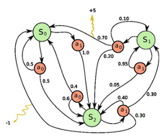

---
# Intelligences (suite)

---
# Intelligence de la recherche

- Intelligences

---
# Intelligence de la pensée logique

- Intelligences

---
# Intelligence de l'incertitude

- Intelligences

---
# Environnement de tâche

- **Description PEAS:**
  - **P**erformance
  - **E**nvironnement
  - **A**effecteurs (Actuators)
  - **S**enseurs (Capteurs)
- **Exemple: Taxi**
  - **Performance:**
    - Prudent, rapide, légal, confortable, rentable
  - **Environnement:**
    - Route, trafic, piétons, clients, véhicule
  - **Effecteurs:**
    - Volant, accélérateur, frein, clignotants, klaxon
  - **Capteurs:**
    - caméras, sonar, accéléromètre, GPS, Lidar, clavier etc.

<!-- notes: design best program for given machine resources -->

---
# Environnement de tâche (exemples)

layout: image-right
image: ./images/img_013.png

<!-- notes: design best program for given machine resources -->

---
# Types d'environnement

- **Complètement vs partiellement observable**
  - Etats de l'environnement
- **Déterministe vs stochastique**
  - Evolution complètement déterminée par l'état précédent et les actions
  - Déterministe sauf actions des autres = stratégique
- **Episodique vs séquentiel**
  - Episodes atomiques indépendants
- **Statique vs Dynamique**
  - Change pendant la délibération (score = semi-dynamique)
- **Discret vs continu**
  - Atomicité des états, du temps, des percepts, des actions
- **Agent simple vs multiagent**
  - Concurrentiel vs coopératif
  - Communication vs aléatoire
- **Connu vs inconnu**
  - Monde réel  cas complexes

<!-- notes: design best program for given machine resources -->

---
# Agent réflexe

- Pas de mémoire
- Percepts courants
- Règles
  - Conditions / Actions

<!-- notes: design best program for given machine resources -->

---
# Agent réflexe fondé sur un modèle

- Etat du monde
- Historique des percepts
- Mémoire du changement

<!-- notes: design best program for given machine resources -->

---
# Fonctionnement interne des agents

- Représentation de la connaissance importante
- **Niveau de représentation des Etats**
  - **Atomique** : Indivisible
  - **Factorisé** : Propriétés
  - **Structurée** : Modèle
- **Compromis**
  - Flexibilité vs complexité

layout: image-right
image: ./images/img_016.png

<!-- notes: design best program for given machine resources -->

---
---
layout: center
---

# Questions?

---
---
layout: section
---

# Intelligence exploratoire

- Recherches non informée et informée
- Jeux
- Problèmes à satisfaction de contraintes

---
# Agent fondé sur des buts

- Réactif  Délibératif
- Exploration du Futur, séquences d'actions
- Recherche, planification

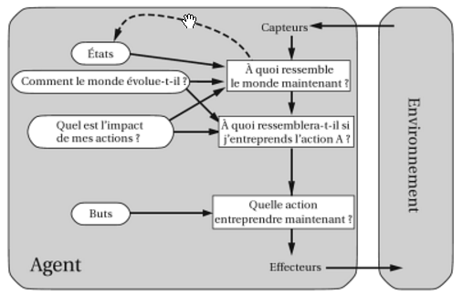

<!-- notes: design best program for given machine resources -->

---
# Résolution de problèmes

- Quel est l'objectif à atteindre ?
- Quelles sont les actions possibles ?
- Quel est la représentation de l'état courant?

---
# Exemple: Itinéraire

- En vacances en Roumanie; le vol part demain de Bucharest
- **Etat initial**
  - Actuellement à Arad.
- **Test de but**
  - Etre à Bucharest
  - ou implicite (échecs)
- **Formuler le problème**
  - Etats: plusieurs villes
  - **Actions: conduire** d'une ville à l'autre
- **Cout de chemin**
- **Trouver la solution:**
  - Séquence de villes
  - e.g., Arad, Sibiu, Fagaras, Bucharest
  - Solution optimale = cout minimal

layout: image-right
image: ./images/img_018.png

<!-- Illustration : carte de Roumanie avec chemins explores par A* -->

---
# Exemple Abstraction: Assemblage robotique

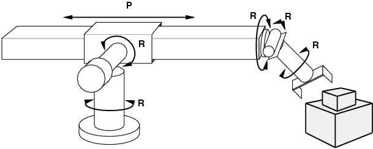

- **Etats:** Coordonnées réelles des joints du robot et des objets
- **Test de but:** Objet assemblé
- **Etat initial:** Pièces détachées, bras au repos
- **Actions:** Mouvement continu des joints du bras robotique
- **Cout de chemin:** temps d'exécution

---
# Problème jouet: Les 8 reines

- **Etats:** Disposition de 0-8 reines
- **Test de but:** 8 reines sont présentes, et aucune n'est menacée
- **Etat initial:** Echiquier vide
- **Actions:** Poser une reine
- **Cout de chemin:** N.A
- **Note:** Meilleure formulation: une reine par colonne, de gauche à droite, légale.
  - 1,8* 10^14 positions (dur)  2057 positions (facile)

---
# Arbre d'exploration

- **Idée de base:**
  - Exploration de l'espace des états en générant les successeurs des états déjà explorés
  - Développement des états
- Ensemble des Nœuds feuilles = Frontière d'exploration
- Choix des nœuds à développer = Stratégie d'exploration

<!-- Demo : PathFinding.js pour visualiser BFS et DFS en temps reel -->

---
---
layout: columns-layout
---

# Stratégies d'exploration non informée

- Les stratégies non informées (aveugles) utilisent uniquement la définition du problème
- Stratégies d'exploration en largeur
- Stratégies d'exploration en profondeur
- **Complexité distincte:** Où sont mes clés?
- **Variantes**
  - Bidirectionnelle

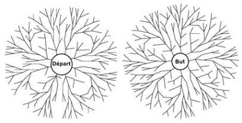

---
# Les missionnaires et cannibales

- Les missionnaires et cannibales doivent traverser la rivière
- Pas plus de 2 personnes en même temps sur la barque
- Si + de cannibales que de missionnaires d'un côté ou l'autre
  - ils se font manger

---
# Stratégies d'exploration informée

- Les stratégies informées utilisent des connaissances du problème en plus de sa définition
- **Exploration par le meilleur d'abord**
  - Exploration gloutonne
  - Algorithme A*
- **Stratégies d'exploration locale**
- **Idée:** utiliser une fonction d'évaluation pour chaque nœud
  - Heuristique = estimation du coût depuis n au but
  - Ex: Distance à vol d'oiseau de n à Bucarest
  - Estimation de la « désirabilité »
- On développe les nœuds non explorés les plus désirables
- **Principe**
  - On tri les nœuds en ordre décroissant de désirabilité

layout: image-right
image: ./images/img_025.png

<!-- Demo : comparaison visuelle Greedy vs A* sur PathFinding.js -->

---
# Méthodes d'exploration locale

- Souvent, le chemin ne compte pas, le but est la solution
- Espace des états = ensemble de configurations complètes
- Trouver une configuration satisfaisant des contraintes (ex 8 reines)
- On peut utiliser une méthode d'exploration locale
  - On conserve un simple état « courant », qu'on tente d'améliorer
- **Avantages:**
  - Peut fonctionner dans des espaces de grande taille ou infinis
- **Exemple:** 8 reines

---
# Paysage de l'espace des états

- **Problèmes d'optimisation :**
  - Objectif = trouver le meilleur état selon une fonction objectif
- Utilité du paysage de l'espace des états

---
# Sophistications évolutionnistes

- **Problèmes :**
  - On peut rester bloquer sur un optimum local
- **Solutions:**
  - Escalade stochastique – Recuit simulé
    - Exemple: le carton de babioles
  - Exploration en faisceaux
    - Exemple: Perdus en foret
- **Combinaison = Sélection/intelligence naturelle**
  - Algorithmes génétiques
    - Population
    - Génétique
    - Combinaisons
    - Mutations
    - Phénotype
    - Fonction d'adaptation

layout: image-right image: ./images/img_028.png
layout: image bg: ./images/img_029.png

<!-- Demo : visualisation convergence dans le notebook GeneticSharp -->

---
# Jeux vs Exploration

- **Environnements:**
  - multi-agents
  - concurrentiels
- **Classe de jeux la plus étudiée (échecs, Go…)**
  - Alternés
  - Déterministes
  - A somme nulle (h1 = -h2)
  - A information parfaite
- Progrès récents: jeux à information imparfaite (Libratus, StarCraft 2)
- **Difficulté**
  - Imprédictibilité  arbre d'exploration complet
  - Souvent impraticable, solution optimale impossible
- **Performance critique:**
  - temps  victoire

---
# Arbre de jeu

- **Ex: Morpion**
  - Etat initial S0
  - Joueurs Max, Min
  - Actions = coups
  - Résultat(s,a)
  - Test-Terminal(s) : Fin de partie
  - Utilité(s,p) = Score final de p
- **Techniques**
  - Minimax, élagage Alpha-Beta
  - Exploration avec arrêt + évaluation heuristique
- **Techniques probabilistes**
  - Expectiminimax, méthodes de Monte-Carlo

layout: image-right
image: ./images/img_030.png

---
# Problèmes à satisfaction de contraintes (CSPs)

- **Problème standard d'exploration**
  - L'état est une « boite noire », toute structure qui implémente:
    - la fonction successeur
    - la fonction heuristique
    - le test de but
- **CSP:**
  - Etat défini par des variables à valeurs dans des domaine
  - Test de but défini par des contraintes spécifiant les valeurs acceptables pour les variables
  - Permet l'utilisation de méthodes générales
    - plus puissantes que les algorithmes standards d'exploration

layout: image-right
image: ./images/img_031.png

---
---
layout: columns-layout
---

# Exemple: coloration de carte

- **Contexte:**
  - Régions adjacentes  couleurs ≠
  - Théorie des graphes: 4 couleurs (Ici: 3)
- **Définition:**
  - Variables WA, NT… Domaines Di = {R,V,B}
  - Contraintes : WA ≠ NT etc.
- **Techniques**
  - Exploration avec heuristiques
    - Minimum de valeurs restantes
    - Variable la + contraignante
    - Valeur la – contraignante
    - Ex: le coffre de voiture
  - Inférence
    - Mise en cohérence des domaines
    - Ex: Sudoku

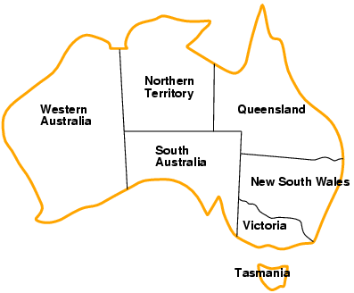

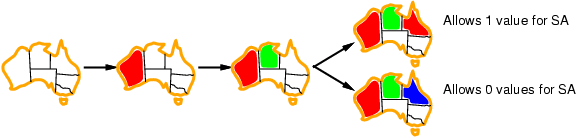

---
# Structure des problèmes

- **Idée:** décomposition d'un problème en sous-problèmes
- Composantes connexes du graphe: sous-problèmes indépendant
  - Ex: Tasmanie vs Australie continentale
- Rare mais structure d'arbre aussi efficace
  - faire apparaitre l'arbre
- **Choix des bonnes variables:**
  - ensemble coupe-cycle (cutset, ex: SA)
  - Ou bien: décomposition en arbre de sous problèmes connexes
  - Résolution d'arbre sur les variables partagées
- Structure des domaines également intéressante
  - **Ex: coloration: n! permutations équivalentes** symétrie de valeurs
  - Contrainte de rupture de symétrie
    - ex: ordre alphabétique: NT<SA<WA

layout: image-right image: ./images/img_036.png
layout: image bg: ./images/img_037.png

---
---
layout: section
---

# Intelligence symbolique

- Logique propositionnelle
- Logique du premier ordre
- Agents fondés sur la connaissance
- Planification

---
---
layout: columns-layout
---

# Représentation et logique

- **Représentation de connaissance**
  - Forme manipulable par la pensée / l'ordinateur
- **Base de connaissance (KB)**
  - = énoncés dans un langage formel
- **Langage de représentation:**
  - **Syntaxe:** séquences possibles de symboles
  - **Sémantique:** faits auxquels les énoncés correspondent
- **Raisonnement:**
  - Conséquence logique  inférence
- **Propriétés:**
  - **Correction:** préserve la validité sémantique
  - **Cohérence / consistance:** Pas de contradiction
  - **Complétude:** Dériver tout ce qui est valide
- **Problème:**
  - Gödel: théorèmes d'incomplétude

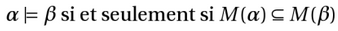
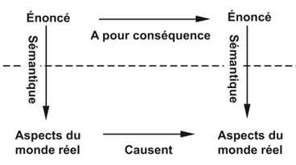

---
# Types de logiques

- **Ontologie:** étude de ce qui existe
- **Epistémologie:** étude de ce qui peut être connu

---
---
layout: columns-layout
---

# Logique propositionnelle

- **Syntaxe**
  - Constantes (V,F)
  - Symboles
  - Connecteurs
- **Sémantique**
  - Tables de vérité

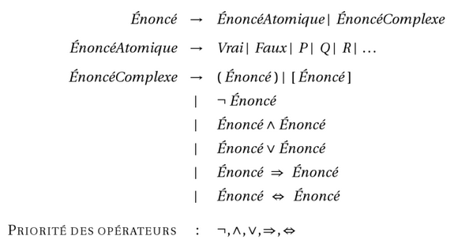

---
# Règles d'inférence

- **Objectif de l'inférence logique:**
  - Vérifier qu'un énoncé est une conséquence de la KB, i.e. un théorème
- Inférence par la preuve: utilisation de règles de dérivation cohérentes pour produire une chaine de conclusions conduisant au but
- **Exemple de règles cohérentes**
  - **REGLE / PREMISSES / CONCLUSION**
  - Modus Ponens : A, A  B  B
  - Introduction du Et : A, B  A  B
  - Elimination du Et : A  B  A
  - Double Négation : A  A
  - Résolution d'unité : A  B, B  A
  - Reductio ad absurdum : A  B  (A  B)
  - Résolution : A  B, B  C  A  C

---
# Procédures d'inférence

- **Inférence naturelle**
  - 1 Humide - Premisse - "Il fait humide"
  - 2 HumideChaud - Premisse - "S'il fait humide, il fait chaud"
  - 3 Chaud - Modus Ponens(1,2) - "Il fait chaud"
- **Chainages avant**
  - Raisonnement par les données
- **Chainage arrière**
  - Raisonnement par les buts
  - Ex: Où ai-je mis mes clés?
- **Autres procédures**
  - Résolution
  - DPLL (la plus populaire)
  - => Solveurs SAT
  - Satisfaction d'énoncés en logique Prop.

---
# Logique du premier ordre

- La logique du premier ordre modélise le monde en termes de:
  - **Objets:** des choses avec des identités individuelles
    - Etudiants, cours, société, voitures
  - **Propriétés** des objets qui les distinguent des autres objets
    - bleu, oval, pair, large
  - **Relations** qui existent entre les ensembles d'objets
    - Frère de, plus grand que, en dehors de, partie de, a la couleur, se passe après, possède, visite, précède
  - **Fonctions:** relations avec une valeur résultat pour des données entrées
    - père de, meilleur ami, deuxième moitié, un de plus que
- **Quantificateurs:**
  - Il existe x: x
  - Pour chaque x: x
- **Règles :** (x) student(x)  smart(x) = "Il y a un étudiant intelligent"

---
# Exemple: investigation

- **Enoncé**
  - « la loi stipule que c'est un crime pour un américain de vendre des armes à des nations hostiles. La Corée du Nord, un ennemi de l'Amérique, possède des missiles et tous ses missiles lui ont été vendus par le colonel West, qui est américain »
- **Traduction de l'énoncé**
  - Missile(x) ET Possède(Corée, x) => Vend(West, x ,Corée)
  - Missile(x) => Arme(x)
  - Enemy(x,America) => Hostile(x)
  - Américain(x) ET Arme(y) ET Vend(x,y,z) ET Hostile(z) => Criminel(x)
- **Solution par chainage avant**

---
---
layout: columns-layout
---

# Agents fondé sur des connaissances

- **Exemple: le Wumpus**
  - Jeux de rôle simpliste
  - A inspiré le démineur et les JDR
- **Environnement:**
  - Grille 4*4 de salles à explorer
- **But/Performance:**
  - **Trouver l'or et sortir** sans dommages
- **Actions:**
  - **Avancer, tourner, saisir,** tirer, sortir
- **Percepts:**
  - Odeur, brise, lueur, choc, cri

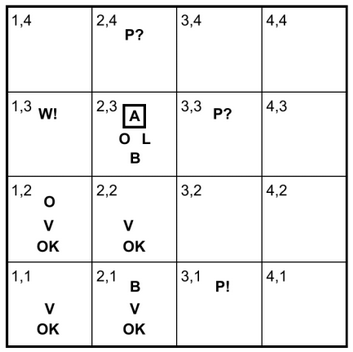
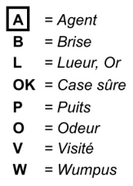

---
# Solveurs Modulo Théorie et optimiseurs

- **Issus de SAT, rajoute:**
  - des théories arithmétiques
  - les quantificateurs du premier ordre
  - Certaines techniques de résolution d'équations ou d'optimisation mathématique
- **Très populaires**
  - Représentation + riche que SAT mais décidables = sweet spot
  - Ex: Vérification de circuits électronique et de code/protocoles critiques
- **Théories**
  - Egalité de fonctions, différences, arithmétique linéaire entière, rationnelle, réelle, tableaux, arithmétique non linéaire, vecteur de bits etc.
- **Outils**
  - **Solveurs:** Z3, Yices, Open SMT, MathSAT etc.
  - **Optimiseurs / solveurs:** MSF, OR-Tools
- **Exemple**
  - Linq To Z3 (interface C# pour Z3)

> **Demo** : voir `Sudoku/Sudoku-4-Z3.ipynb` pour une resolution complete en C#

---
---
layout: columns-layout dense
---

# Argumentation

**Code de conduite**

- **Standards**
  - procédural efficace
  - éthique important
- **Principes de conduite intellectuelle**
  - Faillibilité
  - Recherche de la vérité
  - Clarté
  - Charge de la preuve
  - Charité
- **Arguments bien formés**
  - Structure, Pertinence, Acceptabilité, Suffisance, Réfutation
  - Suspension du jugement
  - Résolution

**Qu'est-ce qu'un argument?**

- **Une proposition supportée par**
  - d'autres proposition (= les prémisses)
  - le raisonnement
  - C'est la conclusion de l'argument
- **Argument ≠ Opinion**
- **Déduction vs Induction**
  - Déduction  nécessité logique
  - Induction  Corroboration
    - Prémisses particulières
  - Argument Moral  principe
  - Légal  loi, jurisprudence etc.
  - Esthétique  critère

---
---
layout: columns-layout
---

# Analyse rhétorique

**Un bon argument**

- Respecte 5 critères
  - Structure bien formée
  - Prémisse pertinentes pour la vérité de la conclusion
  - Prémisses acceptables par une personne raisonnable
  - Prémisses suffisantes à démontrer la conclusion
  - Réfutable : réfutant les critiques anticipées
- **Renforcer un argument**
  - Balayer ces 5 critères

**Un argument fallacieux**

- Viole l'un des critères
- Taxonomie

- Comment le dénoncer
  - Reconstruction standard
  - Contre-exemple absurde
  - Fair-play

---
---
layout: columns-layout
---

# Application: Planification

**Expression de problème**

- Langage formel
- But à atteindre
- Listes des opérations

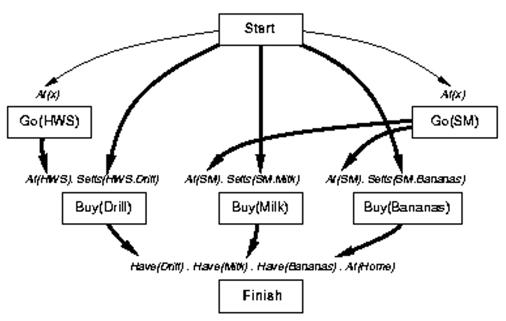

**Approches**

- Exploration des états, plans
- Calcul situationnel : Théorèmes en FOL
- Planification par contraintes
- Planification à Ordre partiel
- Décomposition hiérarchique

---
---
layout: columns-layout
---

# Autres Applications

**Ingénierie de connaissances**

- Triplets, Ontologies
- Web sémantique
  - W3C

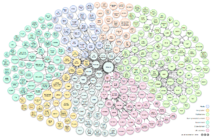

- Linked Data

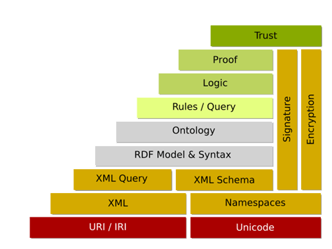

**Systèmes à maintenance de vérité (TMS)**

- Révision des croyances
- JTMS, ATMS: justice
- Générateurs d'hypothèses

**Smart-contracts**

- Cryptographie
- Blockchain
- Homomorphique
  - C(A+B) = C(A)+C(B)
  - Non-divulgation

---
---
layout: center
---

# Questions?

---
# Pour aller plus loin : Notebooks

- **Exploration** : `Search/Exploration_non_informee_et_informee_intro.ipynb`
  - BFS, DFS, UCS, A* sur carte de Roumanie
- **Algorithmes genetiques** : `Sudoku/Sudoku-2-Genetic.ipynb`
  - `Search/Portfolio_Optimization_GeneticSharp.ipynb`
- **Z3 / SMT** : `Sudoku/Sudoku-4-Z3.ipynb`
- **Logique formelle** : `SymbolicAI/Lean/` (10 notebooks)
- **CSP** : `Search/CSPs_Intro.ipynb`, `Sudoku/Sudoku-3-ORTools.ipynb`

---
---
layout: cover
---

# Merci

Jean-Sylvain Boige
jsboige@myia.org

> **Notebooks associes :** `MyIA.AI.Notebooks/Search/`, `MyIA.AI.Notebooks/Sudoku/`, `MyIA.AI.Notebooks/SymbolicAI/`
> Tutoriels exploration, algorithmes genetiques, CSP, Z3, logique formelle