# Intelligence(s)

- Jean-Sylvain Boige
- jsboige@myia.org
- Telecom Bretagne
- Cogs, Brighton UK
- Aricie - DNN - PKP

---

# Sommaire

- Qu'est-ce que l'intelligence artificielle ?
- Racines, histoire et état de l'art
- Structure des agents rationnel
- Intelligence exploratoire
- Comment chercher la solution à un problème ?
- Intelligence Symbolique
- Comment utiliser le raisonnement et les mathématiques ?
- Intelligence probabiliste
- Comment agir dans l'incertitude ?
- Apprentissage
- Comment utiliser les données et l'expérience ?
- Application: le langage naturel

---
layout: image-right
image: ./images/img_004.png
---

<!-- notes: Timing? -->

---

<!-- _class: section -->

# Intelligence artificielle

- Introduction
- Agents rationnels
- Intelligences

---

<!-- _class: columns-layout -->

# Qu'est-ce que l'intelligence artificielle?

- Définitions multiples
- Notre angle :
  - « Agir de façon rationnelle »
- Conception d'agents

**Fondements**

- Philosophie
- Maths
- Economie
- Biologie
- Neurosciences
- Psychologie
- Informatique
- Théorie du contrôle
- Linguistique

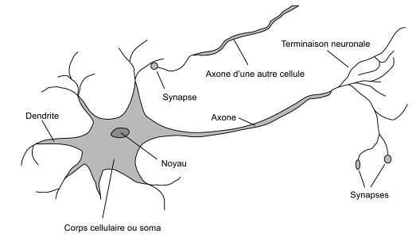

<!-- notes: Définitions multiples de l'intelligence et de l'IA
Concevoir != comprendre
Définition mouvante:
Automates  Calculateur  Algorithmes  Bases de connaissances  Systèmes experts  Apprentissage profond  ?
4 types d'approches:
Notre angle principal: « Agir de façon rationnelle »
Conception d'agents
Philosophie	Logique, méthodes de raisonnement, esprit physique, apprentissage, langage, raison
Maths 		Représentation formelle et preuve, algorithmes, calcul, (in)décidabilité, complexité, probabilités
Economie	Utilité, théorie des jeux, la décision, agents économiques rationnels
Biologie		Intelligence naturelle et animale
Neurosciences	Substrat physique de l'activité mentale
Psychologie	Comportement, Perception cognition, contrôle moteur, techniques expérimentales
Informatique	Origines, ordinateurs puissants et logiciels
Théorie du 	Maximiser une fonction objective contrôle	dans le temps
Linguistique	Représentation de connaissances, grammaire -->

---

<!-- _class: columns-layout dense -->

# Développement (1/2)

**Histoire succincte**

- 1940-70 : Enthousiasme des débuts
  - Turing, Dartmouth, Lisp
  - Samuel, Newell & Simon
- 1970s : Complexité calculatoire
  - Réseaux de neurones en pause
  - Systèmes experts
- 1980s : L'IA devient une industrie
  - Robotique, vision
- 1990s : L'IA devient une science

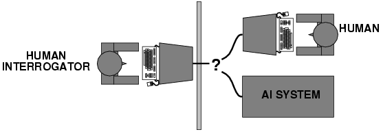

**État de l'art**

- 1997 : Deep Blue (échecs)
- 2000s : Prouveurs, planification
- 2007 : Jeu de dames résolu
- 2010s : Explosion deep-learning
  - 2014 : GANs
  - 2016 : AlphaGo
- NLP : Transformers, LLMs

<!-- notes: Ne pas passer trop de temps sur les jeux (pas des gamers) -->

---

# Développement (2/2)

- **2000s** : Data mining, apprentissage bayesien, web semantique, prouveurs automatiques
- **2010s** : Explosion du deep learning et du big data
  - 2014 : GANs (génération d'images), 2016 : AlphaGo (Go)
  - 2017 : Transformers ("Attention is All You Need")
  - 2018 : AlphaZero (echecs, Go, shogi sans connaissances humaines)
  - 2019 : Pluribus (poker), AlphaStar (Starcraft 2)
- **2020s** : LLMs et IA generative deviennent grand public
  - GPT-3 (2020), ChatGPT (2022), GPT-4 (2023), Claude 3 (2024)
  - Stable Diffusion, Midjourney, DALL-E : génération d'images
  - 2025 : agents IA autonomes, vibe coding, IA multimodale

> **Chronologie cle** : Turing (1950) → Dartmouth (1956) → Hiver IA (1974) → Deep Blue (1997) → AlphaGo (2016) → ChatGPT (2022) → Agents IA (2025)

---

# Dans la vie de tous les jours

- **Poste** : reconnaissance des adresses et tri automatique du courrier
- **Banque** : lecture des cheques, verification des signatures, évaluation de credits
- **Medecine** : diagnostic assiste, prescriptions, suivi et prevention
- **Service client** : synthese/reconnaissance vocale, chatbots (ChatGPT, Claude)
- **Transport** : detection de plaques, conduite autonome (Tesla, Waymo)
- **Internet** : marketing personnalise, detection de spam et de fraude
- **Industrie** : conception, fabrication et exploitation assistees par IA
- **Image numerique** : detection de visages, mise au point, compression
- **Jeux** : personnages et adversaires intelligents (NPCs adaptatifs)

---

<!-- _class: columns-layout -->

# Les agents

**Définition**

- L'agent rationnel
  - Entité qui perçoit par des capteurs
  - agit par des effecteurs.
- Dans un environnement
  - Fait la bonne action
  - Maximise son succès.
  - Pas omniscient
  - Réactif, proactif, interactif, autonome
- Limitations
  - ressources disponibles

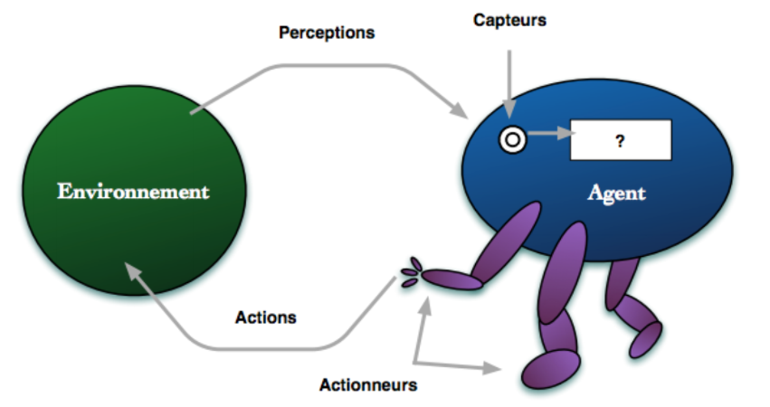

<!-- notes: « La bonne action »: celle qui maximise le succès.
Mesure de de la performance
Critère objectif de succès.
Maximisation de la mesure de performance
A partir de la suite de percepts et de l'état de connaissance.
Rationnel != omniscient
Réactivité, Proactivité
Exploration =  modification des percepts
Interaction, Autonomie
Comportement issu de l'expérience
Environnement limité:
la rationalité parfaite n'est souvent pas atteignable.
 Objectif = les meilleures performances
Compte tenu des ressources disponibles
Rationalité humaine
Normatif (logique)  Conséquentialiste (succès cognitif) -->

---

<!-- _class: columns-layout -->

# Conception d'agents

**Environnement de tache**

- Description PEAS : Performance, Environnement, Actionneurs, Senseurs

**Agent reflexe**

- Pas de mémoire, reagit aux percepts courants
- Regles condition → action (si obstacle, alors freiner)

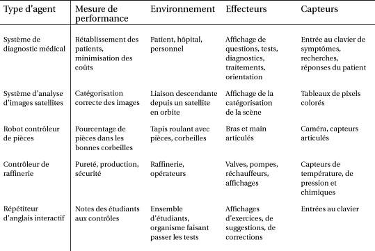

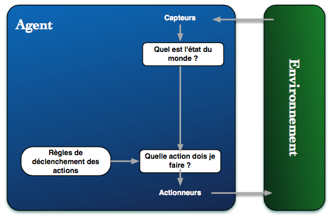

<!-- notes: Insister sur le cas pratique (e.g. Elon Musk)
 design best program for given machine resources -->

---

<!-- _class: section -->

# Quiz

- Taxi autonome:
  - Description Peas
  - Intelligences

---

<!-- _class: columns-layout -->

# Agent réflexe fondé sur un modèle

**Agent réflexe avec modèle**

- Fonctionnement interne
- Etat du monde
- Niveau de représentation

**Compromis**

- Flexibilité vs complexité

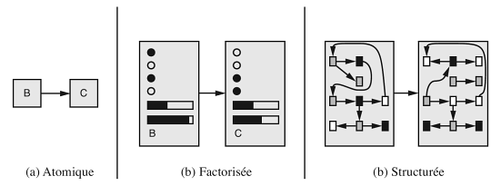

<!-- notes: (virer?)
 design best program for given machine resources -->

---

# Intelligences

- **Procedurale** : automates et algorithmes déterministes (instructions pas a pas)
- **Exploratoire** : recherche dans un espace d'etats (parcours de graphes, A*)
- **Symbolique** : raisonnement logique, bases de connaissances, planification
- **Probabiliste** : gestion de l'incertitude, réseaux bayesiens, decision
- **Apprentissage** : amelioration par l'expérience (supervise, renforcement, deep learning)

  

---
layout: center
---

# Questions?

---

<!-- _class: section -->

# Intelligence exploratoire

- Recherches non informée et informée
- Jeux
- Problèmes à satisfaction de contraintes

---

<!-- _class: columns-layout -->

# Agent explorateur

**Agent fonde sur des buts**

- Passe du reactif au deliberatif
- Planifie ses actions par exploration

**Résolution de problèmes**

- Objectif ?
- Actions ?
- Représentation ?

<!-- notes:  design best program for given machine resources -->

---

<!-- _class: columns-layout dense -->

# Formulation de problèmes

**Itinéraire**

- Etat initial, test de but
- Transitions
- Etats, Actions
- Coût de chemin
- Solution = Séquence

**Abstractions**

- Assemblage robotique
- Problèmes jouets

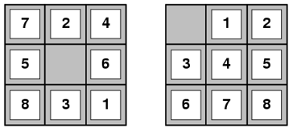
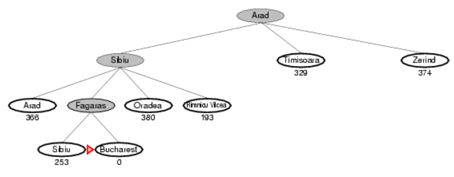

---

<!-- _class: columns-layout -->

# Arbre d'exploration

**Idée de base**

- Développement des états successeur
- **Choix des nœuds**
  - = Stratégie d'exploration

**Exemple: Enigme**

- Missionnaires et cannibales
  - Barque de 2 places
  - Jamais + de cannibales

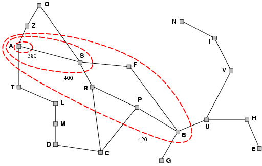
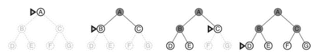

---

<!-- _class: section -->

# Quiz

- Missionnaires et cannibales
- Intelligences

---

<!-- _class: columns-layout dense -->

# Stratégies d'exploration (1/2)

**Non informées**

- En largeur
- En profondeur
- Ex: Où sont mes clefs ?
- Bidirectionnelle

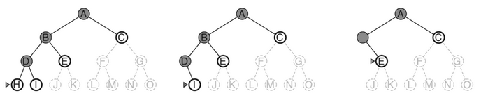

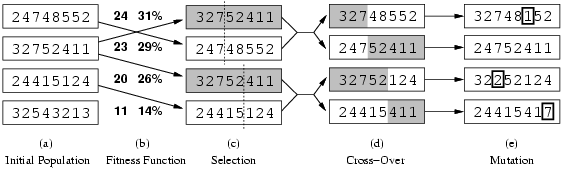

**Informées**

- Évaluation des états
- Heuristique
- Estimation du coût restant
- Ex: Distance à vol d'oiseau
- Par le meilleur d'abord
  - Exploration gloutonne
  - Algorithme A*
  - Demo Pathfinding.js

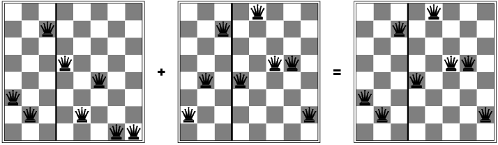
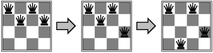

---

<!-- _class: columns-layout dense -->

# Stratégies d'exploration (2/2)

- Si seule la solution compte
  - pas le chemin
  - Modification d'un seul état
- Paysage de l'espace des états
  - Optimisation d'une fonction
  - Escalade, descente de gradient

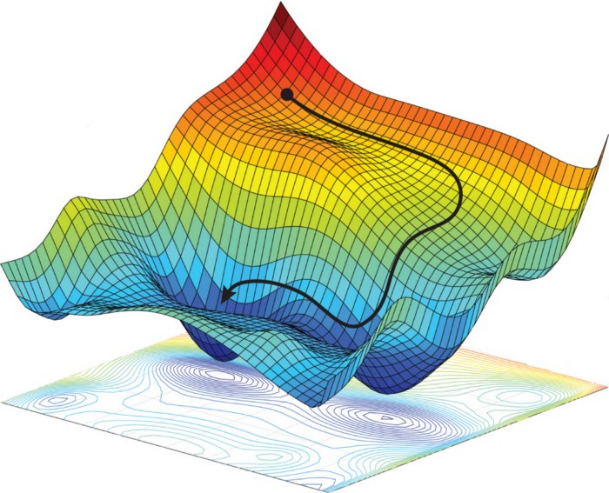

- Problèmes :
  - Bloqué sur un optimum local
- Solutions:
  - Recuit simulé
  - Ex: le carton de babioles
  - Exploration en faisceaux
  - Ex: Perdus en foret
  - Sélection naturelle = combinaison
  - Algorithmes génétiques

<!-- notes: Démo GeneticSharp -->

---

<!-- _class: columns-layout dense -->

# Jeux

**Jeux vs Exploration**

- Arbre de jeu
- Environnements
  - multi-agents, concurrentiels
  - Classe la plus étudiées
  - Alternés, déterministes
  - A somme nulle (h1 = -h2)
  - A information parfaite
- Difficulté
  - Arbre d'exploration impraticable
  - Performance critique: temps
  - Stochastiques, information imparfaite
  - Libratus (poker), Starcraft 2

**Arbre Minimax**

- Actions joueurs Max et Min + utilité terminale

**Techniques**

- Minimax, Alpha-Beta
- Avec arrêt + évaluation heuristique
- Techniques probabilistes
- Expectiminimax
- Méthodes de Monte-Carlo

---

<!-- _class: columns-layout dense -->

# Problèmes à satisfaction de contraintes

**Définition CSPs**

- Jusqu'ici: représentation atomique
- CSP = Etat factorisé
- Etat = variables sur des domaines
- Test de but = contraintes sur les variables
- Bonnes méthodes générales
- Meilleures que l'exploration standard
- Exemple
  - Coloration de carte

**Techniques**

- Exploration avec heuristiques
  - H1 ? H2 ? H3 ?
  - Ex: le coffre de voiture
- Inférence
  - Mise en cohérence des domaines
  - Ex: Sudoku
- Structure des problèmes
  - Sous-problèmes, Arbres
- Structure des valeurs
  - Symétrie (rupture de)

<!-- notes: Se concentrer sur le coffre de voitureMinimum de valeurs restantes
Variable la + contraignante
Valeur la – contraignante -->

---
layout: center
---

# Questions?

---

<!-- _class: section -->

# Intelligence symbolique

- Logique propositionnelle
- Logique du premier ordre
- Agents fondés sur la connaissance
- Planification

<!-- notes: Faire 1 slide des 3 suivants, se concentrer sur les exemples -->

---

<!-- _class: columns-layout -->

# Représentation et logique

**Enoncés**

- Langage
- Syntaxe
- Sémantique
- Types de logiques

**Inférence**

- Propriétés
- correction, consistance, complétude

**Bases de connaissances**

**Raisonnement**

---

<!-- _class: columns-layout -->

# Logique propositionnelle

- Syntaxe
- Sémantique
  - Tables de vérité
- Inférence logique
  - Règles cohérentes
  - Ex: Modus ponens
  - Preuve déductive
- Procédures
  - Chainages
  - Résolution
  - DPLL, WalkSAT
- Solveurs SAT
  - Problèmes NP-complets

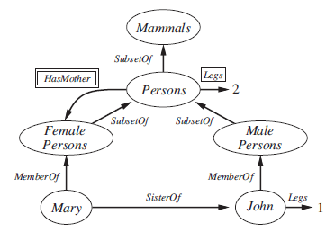

---

<!-- _class: columns-layout dense -->

# Logique du premier ordre (FOL)

- Modélise
  - Objets, Propriétés
  - Relations, Fonctions
- Quantificateurs:
  - Il existe x - x
  - Pour chaque x - x
- Sémantiques multiples
  - de base de données

**Exemple: investigation**

- Missile(x) ET Possède(Corée, x) => Vend(West, x ,Corée)
- Missile(x) => Arme(x)
- Enemy(x,America) => Hostile(x)
- Américain(x) ET Arme(y) ET Vend(x,y,z) ET Hostile(z) => Criminel(x)

---

<!-- _class: columns-layout dense -->

# Application: argumentation

**Code de conduite**

- Principes de conduite intellectuelle
  - Faillibilité
  - Recherche de la vérité
  - Clarté
  - Charge de la preuve
  - Charité
  - Structure, Pertinence, Acceptabilité, Suffisance, Réfutation
  - Suspension du jugement
  - Résolution

**Qu'est-ce qu'un argument?**

- Standards
  - procédural efficace
  - éthique important
- Une proposition (conclusion) supportée par
  - D'autres proposition (Prémisses)
  - Le raisonnement
- Argument =/= Opinion
- Déduction vs Induction
  - Déduction  nécessité logique
  - Induction  Corroboration
  - Prémisses particulières
  - Argument Moral  principe
  - Légal  loi, jurisprudence etc.
  - Esthétique  critère

---

<!-- _class: columns-layout dense -->

# Analyse rhétorique

**Un bon argument**

- Respecte 5 critères
  - Structure bien formée
  - Prémisse pertinentes
    - pour la vérité de la conclusion
  - Prémisses acceptables
    - par une personne raisonnable
  - Prémisses suffisantes
    - à démontrer la conclusion
  - Fournissant une réfutation effective
    - des critiques anticipées
- Renforcer un argument
  - Balayer ces 5 critères

**Un argument fallacieux**

- Viole l'un des critères
- Taxonomie
- Comment le dénoncer
  - Reconstruction standard
  - Contre-exemple absurde
  - Fair-play

<!-- notes: Ne pas passer trop de temps sur la taxonomie, passer sur le Jeu rapidement -->

---

<!-- _class: columns-layout dense -->

# Application: Planification

**Expression de problème**

- Langage formel
- But à atteindre
- Listes des opérations

**Approches**

- Exploration des états, plans
- Heuristiques ?
- Calcul situationnel
- Théorèmes en FOL
- Planification par contraintes
- Planification à Ordre partiel
- Décomposition hiérarchique

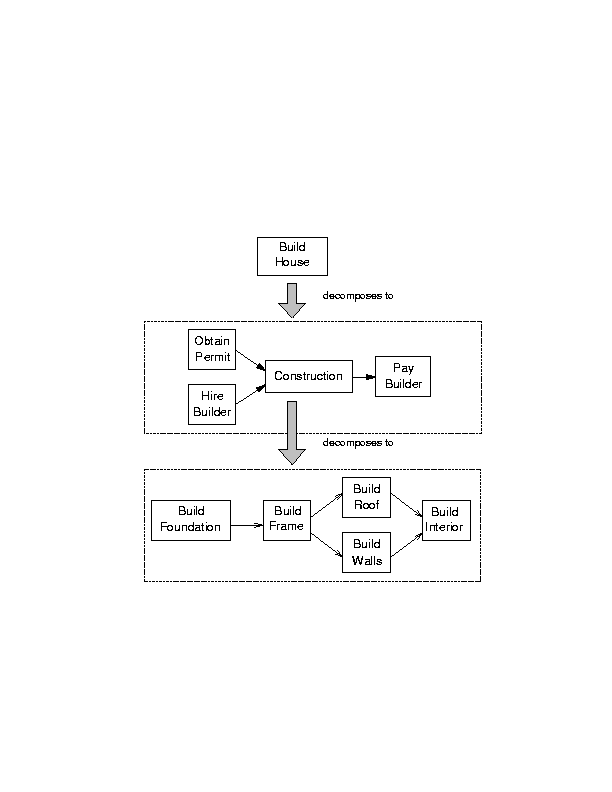
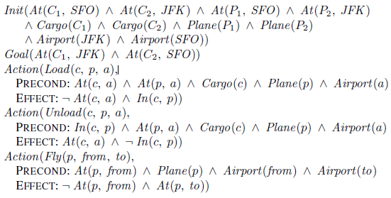
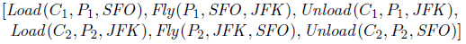
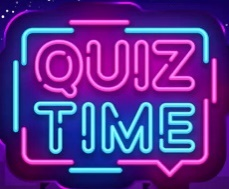

<!-- notes: Zapper -->

---

<!-- _class: columns-layout -->

# Autres Applications (1/2)

- Solveurs Modulo Théorie
  - SAT + Quantificateurs
  - + Théories arithmétiques
  - + Optimiseurs
- Ingénierie de connaissances
  - Triplets, Ontologies
  - Web sémantique
  - W3C
  - Linked Data

<!-- notes: Simplifier pour le public, Passer vite sur les formats de l'ingénierie de connaissance -->

<!-- Exemples : triplets RDF (sujet-predicat-objet), ontologies OWL, SPARQL -->

---

# Autres Applications (2/2)

- Systèmes à maintenance de vérité (TMS)
  - Révision des croyances
  - JTMS, ATMS: justice
  - Générateurs d'hypothèses
- Smart-contracts
  - Cryptographie
  - Blockchain
  - Non-divulgation

---
layout: image-right
image: ./images/img_050.png
---

<!-- notes: insister sur smart-contracts -->

<!-- Blockchain : registre distribue, consensus, execution automatique de contrats -->

---
layout: center
---

# Questions?

---

<!-- _class: section -->

# Intelligence probabiliste

- Quantification de l'incertitude
- Raisonnement probabiliste
- Prise de décision
- Théorie des jeux

---

<!-- _class: columns-layout -->

# Agir dans l'incertitude

**Le monde est incertain**

- Entrées incertaines
  - Données manquantes,  bruitées
  - Connaissance incertaine
  - Causalités complexes
  - Environnement stochastique
- Sorties incertaines
  - Abduction, induction
  - Inférence incomplète

**Agent fondé sur l'utilité**

- Raisonnement probabiliste
- Résultats probabilistes
- Alternatives
- Niveau de succès espéré

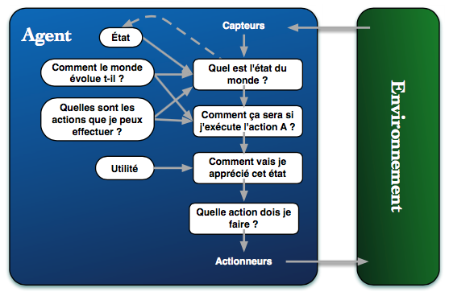

<!-- notes: Exemple Rainman -->

---

<!-- _class: columns-layout dense -->

# Probabilité

**Fondements**

- Les probabilités resument notre incertitude (paresse, ignorance)
- Probabilites subjectives : degre de croyance d'un agent
- Se mettent a jour avec les observations

**Règle de Bayes**

- Diagnostic
- P(Cause | Effet) = P(Effet | Cause) x P(Cause) / P(Effet)

**Programmation probabiliste**

- Réseau Bayésien naïf
  - Attributs indépendants
- Modèles graphiques
  - Indépendance conditionnelle
  - Facteurs de distributions continues

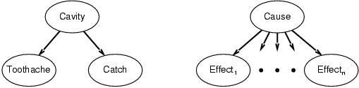

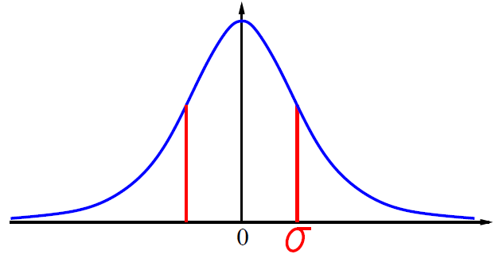

<!-- notes: Faire 1 slide avec le suivant (exemple météo, ne pas rentrer dans le détail Markov & co) -->

---

<!-- _class: columns-layout dense -->

# Réseaux bayésiens dynamiques

**Chaînes de Markov**

- Indépendance conditionnelle
- Passé / Futur
- Modèle de transition
  - Probabiliste
  - **Distribution** stationnaire
- Chaînes de Markov cachées
  - Observations bruitées

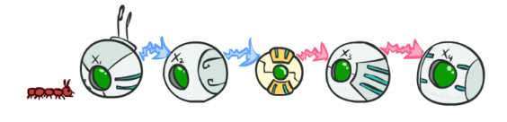
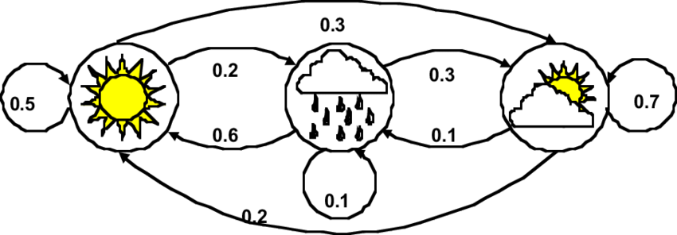

**Applications**

- Traitement du langage naturel
- Classification, Extraction
- Reconnaissance, Traduction
- Google 1.0: Page rank
- Suivi de trajectoire
- Météo, radars, économie etc.
- Filtres de Kalman
- Apprentissage

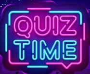

---

<!-- _class: columns-layout dense -->

# Prise de décision

- Théorie de la décision
  - Que faire?
  - Théorie des probabilités
  - Que croire ?
  - Théorie de l'utilité
  - Que vouloir ?
- Utilité de l'argent
  - Goût du risque ?
  - Prime
  - Utilité espérée
  - biaisée (malédiction)
  - + Humains pas rationnel
- Prise de décision simple
  - Réseaux de décision
- Décision complexe
  - Processus de Markov
  - Politique optimale

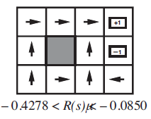

<!-- notes: Insister sur les exemples.Ordonnancement
Transitivité
Continuité
Substituabilité
Monotonie
Décomposabilité
Effet de certitude,
Régression fallacieuse,
évitement d'ambiguïté,
effet de cadrage
effet d'ancrage -->

---

<!-- _class: columns-layout -->

# Théorie des jeux (1/2)

**Environnement multi-agents**

- Analyse stratégique
- Interdépendances stratégiques
- Design d'agent
  - Quelle stratégie?
- Design de mécanisme
  - Quelles règles?

**Optimisation de stratégies**

- Solution = profil de stratégies
- Pures (déterministes)
- Mixtes (probabilistes)
- Utilité espérée

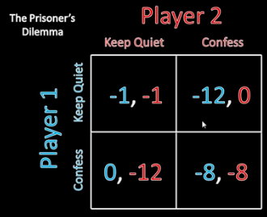

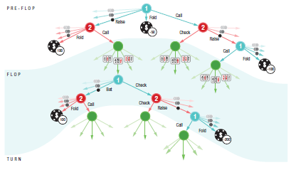

<!-- notes: Aller plus vite, se concentrer sur les exemples -->

---

<!-- _class: columns-layout -->

# Théorie des jeux (2/2)

**Jeux simultanés**

- Matrice de gains
- Dominance
- Equilibres de Nash
- Purs et mixtes (2n+1)
- Topologie

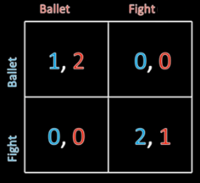

**Jeux séquentiels**

- Plusieurs manches
- Forme extensive
- Crédibilité
- Punitions, Menaces, Promesses
- Induction
  - avant/arrière

<!-- Forme extensive : arbre ou chaque noeud = decision, feuilles = gains -->

---

<!-- _class: columns-layout -->

# Extensions

**Algorithmes**

- Espaces infinis
- Hotelling
- Jeux Bayésiens
  - Information incomplète
  - Jeux de signalisation
- Jeux différentiels

**Equilibres approchés**

- ε-équilibres
- Minimisation de regret contrefactuel
- Cepheus
- Libratus
- Deepstack

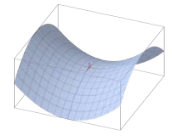
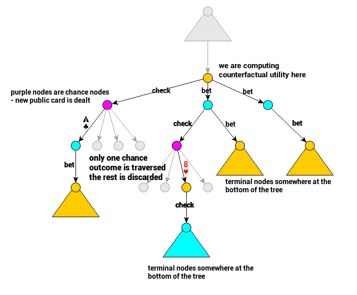

<!-- notes: Faire 1 slide des 3 avec Exemple de Bayrou -->

---

<!-- _class: columns-layout -->

# Conception de mécanismes

**Concepts**

- Théorie des jeux inverse
- Quelles bonnes règles ?
- Max d'une utilité globale?
- Principe de révélation
  - Mécanismes manipulables
  - Non-stratégiques

**Résultats**

- Enchères de Vickrey
- Tragédie des communs
- Taxe carbone
- Conditions byzantines
- Bitcoin
- Stratégies sociétales
  - Évolution de la confiance

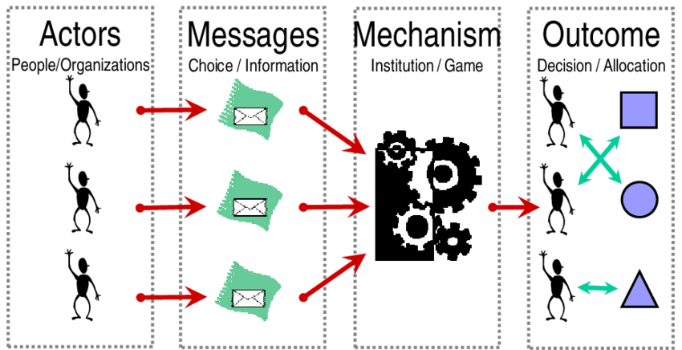
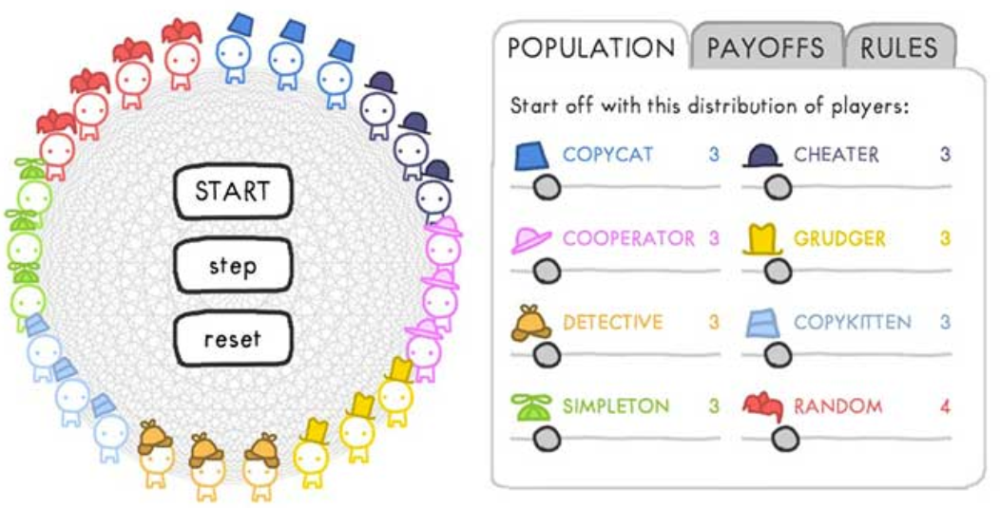

---

<!-- _class: columns-layout -->

# Décisions collectives

**Théorie du choix social**

- Théorie de la négociation
- Théorie des votes
- Résultats négatifs
  - Critère de Condorcet
  - Electeur médian

**Méthodes de Condorcet**

- Schulze
- Autres bon Scrutins
  - Vote par assentiment
  - Jugement majoritaire
  - Scrutin bipartipludique

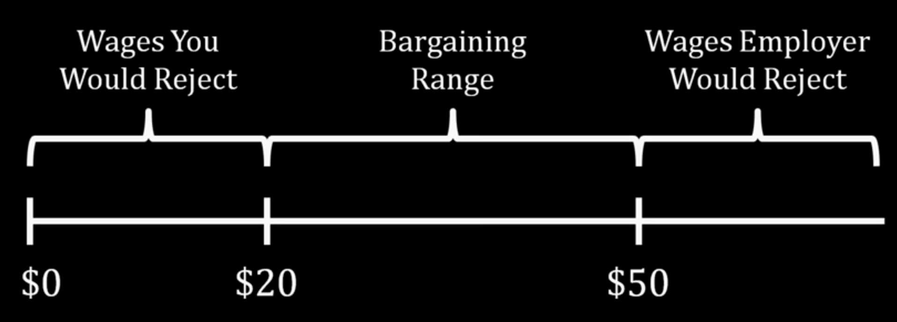

---

<!-- _class: section -->

# Quiz

- Présidentielles: vainqueur de Condorcet
- Intelligences

---
layout: center
---

# Questions?

---

<!-- _class: section -->

# Apprentissage

- Apprentissage supervisé
- Arbres de décision
- Deep learning
- Modèles non-paramétriques
- Apprentissage et connaissances
- Apprentissage par renforcement

---

<!-- _class: columns-layout -->

# Apprentissage

**Enjeux**

- Environnements inconnus
- Méthode de conception de systèmes
- Améliorer la prise de décision
- Les performances

**Structure d'agent**

- Modules
  - Performance
  - Apprentissage
  - Critique
  - Générateur de problème

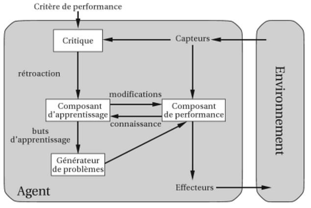

<!-- notes: En parler au début (chatpGPT & co), diminuer de moitié les slides -->

---

<!-- _class: columns-layout dense -->

# Caractéristiques (1/2)

**Composants d'apprentissage**

- Type d'apprentissage
  - Inductif
  - Déductif
- Type de feedback:
  - Supervisé: les réponses correctes
  - Non-supervisé: clusters
  - Par renforcement: récompenses

**Apprentissage inductif**

- Nature affectée par
  - Environnement / données
  - Connaissance a priori / modèles
  - Feedback pour apprendre

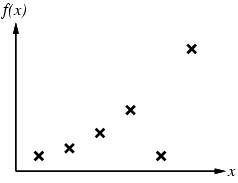
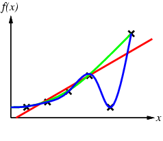

<!-- notes: Passer vite -->

---

<!-- _class: columns-layout -->

# Caractéristiques (2/2)

- On construit une hypothèse
  - h consistante avec les données
- Ensemble de sortie
  - Classification
  - Régression
- Rasoir d'Occam
  - Parcimonie
- Entraînement
- Validation
- **Méthodes**
  - d'ensemble
  - Boosting

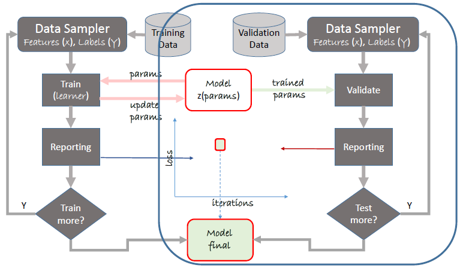

---

<!-- _class: columns-layout -->

# Arbres de décision

**Principe**

- Attributs  Décision
- A partir d'exemples

**Techniques**

- Ordre des attributs
- Gain entropique
- Compacité
- Elagage
- Régression
- Quantisation
- Random forest
- Ensemble

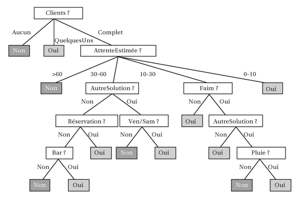
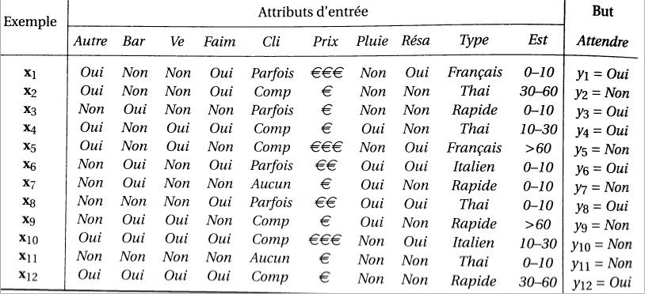
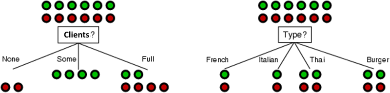
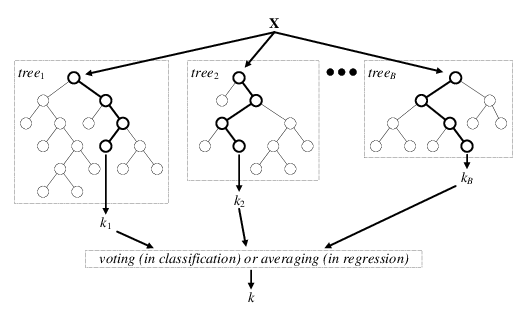

---

# Classification

- Utilisation de dimensions supérieures
- Classification linéaire

---
layout: image-right
image: ./images/img_089.png
---

---

<!-- _class: columns-layout -->

# Réseaux de neurones artificiels

- Inspiration biologique
- Neurone artificiel
  - Fonctions d'activation
- Multi-couches
  - Expressivité croissante

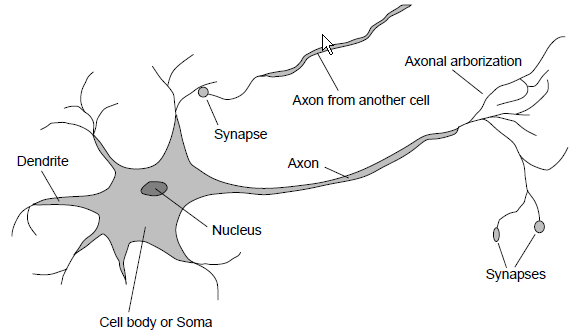

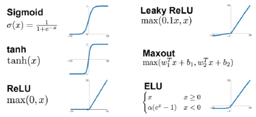

---

<!-- _class: columns-layout -->

# Apprentissage profond

- Réseaux profonds
  - Multicouche traditionnel classifier
- Hiérarchies naturelles
  - **Pixel, bord, teston, motif,**
    - partie, objet
  - **Caractère, mot, groupe,**
    - clause, phrase, histoire
- Réseaux convolués
  - Noyaux de convolution
  - Sous-échantillonnage

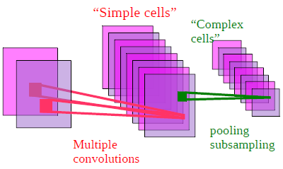

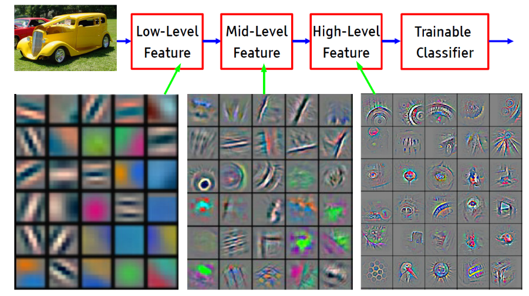

---

<!-- _class: columns-layout -->

# Extensions 2010+

- Réseaux récurrents
  - Mémoire à court terme
  - Réseaux LSTM
  - MAJ d'un état de cellule
- Réseaux résiduels
  - Réinjection des entrées
- GANs
  - Réseaux adversériaux

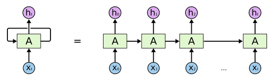
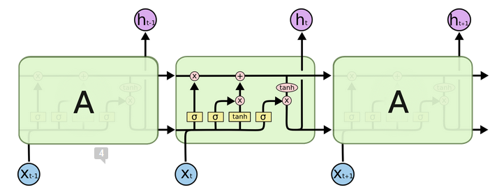
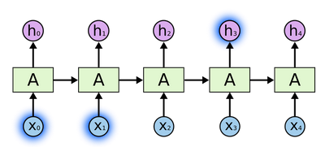

<!-- GANs : generateur vs discriminateur, portraits StyleGAN, deepfakes -->

---

<!-- _class: columns-layout dense -->

# Extensions 2015+

- Modèles Bayésiens
  - Régularisation
  - Ex: Auto-encodeurs Var.
- Graph Neural Networks
  - Généralisation géométrique
  - Agrégation de voisinage
- Réseaux attentionnels
  - Economie de ressources
  - Séquences
  - Transformers, Multi-têtes
- Semi-supervisé, Transfert
- LLMs : Bert, GPT

<!-- Transformer : encodeur-decodeur, self-attention multi-tetes, positional encoding -->

---

<!-- _class: columns-layout -->

# Extensions 2020+

**Modèles multimodaux**

- E.g Texte+Image
- Datasets, Encodeurs
- Rapprochement des plongements

**Modèles de diffusion**

- Prédiction d'un bruit
- Diffusion latente
- Autoencodeur Variationnel
- Conditionnement multimodal
- Mécanisme attentionnel

<!-- Diffusion : bruit gaussien progressif → apprentissage du debruitage inverse -->

---

<!-- _class: columns-layout -->

# Apprentissage non paramétrique

**Principes**

- Jusque là, paramétrique
- Arbres de décisions, NNs
- Ici, par les instances
- Les données servent à prédire

**Machines à vecteurs de support**

- K Plus proches voisins
- Noyaux de pondérations
- Séparateurs à marge maximale
- Astuce du noyau

---

<!-- _class: columns-layout dense -->

# Apprentissage et connaissances

- Utilisation de la connaissance
  - Passé + futur
  - Construction d'un énoncé en FOL
- Exploration: Version Space learning
- Apprentissage par explication
  - Ex: brochette
  - Explanation Based Learning
- Fondé sur la pertinence
  - Ex: langue du pays
  - Relevance Based learning
- Fondé sur des connaissances
  - Ex: Interne médical
  - Knowledge Based Inductive Learning
- Programmation logique inductive (Prolog)

---

<!-- _class: columns-layout dense -->

# Apprentissage par renforcement

- Pas d'exemple
  - Feedback = bon ou mauvais
- Processus de décision de Markov
  - Récompense à apprendre
  - Possibilité de Shaping
- 3 architectures
  - Basé sur l'utilité
  - Q-learning (utilité/action)
  - Agent réflex = apprentissage de politique
- 2 familles
  - Passif (politique fixée)
  - Actif  nécessité d'explorer
- Approximations
  - Modèles paramétriques
  - Deep Q-learning

---
layout: center
---

# Questions?

---

<!-- _class: section -->

# Langage naturel (NLP)

- Modèle du langage
- Communication
- Agents conversationnels (chatbots)

---

<!-- _class: columns-layout dense -->

# Modèles du langage

- N-grams
  - Modèles de Markov
  - Traitements
  - lissage, perplexité
- Utilisation
  - Classification, catégorisation
  - Langue, genre, spam
  - Analyse de sentiments
- Recherche d'information
  - Indexation
  - + traitement requêtes
  - + score  résultats

- Extraction d'information
  - Automates à états finis:
  - Regexs, Transducteurs
  - Modèles probabilistes
  - Extraction d'ontologie
  - Machine reading

---

<!-- _class: columns-layout dense -->

# Grammaires

**Caractéristiques**

- Communication
- Echange d'information
- Analyse du langage
  - Modèles de communication
  - = grammaires + sémantique
- Formalismes
  - Classes de Chomsky
  - Catégories = Part Of Speech

**Grammaires probabilistes**

- Sans contexte (PCFGs)
- Syntaxique, Apprentissages
- Grammaires augmentées
  - Avec contexte, Sémantiques
- Interpréteurs
  - Modèles sémantiques
  - Ambiguités, Modèles imbriqués

---

<!-- _class: columns-layout -->

# Speech/Text to Text/Speech

- Traduction automatisée
  - Modèles statistiques
- Reconnaissance de la parole
  - Modèles acoustiques + langage
- Modèles profonds
  - Réseaux récurrents / Transformers
  - Résumé, analyse syntaxique
  - Modèles sémantiques profonds

---

<!-- _class: columns-layout dense -->

# Agents conversationnels

- Agents algorithmiques couplé au NLP
  - Modèles de langage
  - Intentions = tâches
  - Entités = objets et propriétés
  - Instances = exemples
- Architecture
  - Connecteurs à des canaux
  - Contextes de dialogues
- Conception
  - Développement hors ligne
  - Actions, KBs
  - Modèles du langage
  - Bootstrap
  - Entraînement en ligne

---

<!-- _class: columns-layout dense -->

# Applications des chatbots

**Processus de création**

- Définition des objectifs
  - Fonctions, besoins etc.
- Définition du processus
  - Arborescence narrative
- Spécifications / Périmètre
- Identifier / rassembler les données
  - FAQ, DB, KB
- Budgétisation (10000 à 500K)
- Choix des canaux
  - Mobile, réseaux sociaux etc.
- Choix technologique
- Réalisation + entrainement
- Mise en production
- Amélioration

**Exemples**

- Hôtels et transports : SNCF
- Achats en ligne : Amazon
- Télécoms : Verizon
- Finance : Orange
- Médias : CNN
- Ami virtuel : Replika
- Support juridique interne : ADP

<!-- Chatbots modernes : ChatGPT (OpenAI), Claude (Anthropic), Gemini (Google) -->

---

# Intelligence conversationnelle

- **Quiz** : quelles formes d'intelligence sont mobilisees par un chatbot ?
  - Exploratoire : navigation dans l'arbre de dialogue
  - Symbolique : comprehension des intentions, raisonnement logique
  - Probabiliste : modèles de langage, prediction du mot suivant
  - Apprentissage : entrainement sur des corpus massifs, fine-tuning RLHF
- L'agent conversationnel combine toutes les intelligences du cours

---
layout: center
---

# Questions?

---

# Pour aller plus loin : Notebooks

Ce deck couvre tous les domaines de l'IA. Pour approfondir avec des exemples pratiques :

> **GenAI - IA Generative**
> `MyIA.AI.Notebooks/GenAI/`
> Transformers, diffusion models, LLMs, génération d'images

> **Search - Recherche et Optimisation**
> `MyIA.AI.Notebooks/Search/`
> Algorithmes genetiques, A*, optimisation locale

> **ML - Machine Learning**
> `MyIA.AI.Notebooks/ML/`
> ML.NET, arbres de decision, classification, regression

> **SymbolicAI - IA Symbolique**
> `MyIA.AI.Notebooks/SymbolicAI/`
> RDF, Z3 SMT, Tweety, Lean, ontologies, web semantique

> **Probas - Modeles Probabilistes**
> `MyIA.AI.Notebooks/Probas/`
> Infer.NET, réseaux bayesiens, inference probabiliste

> **GameTheory - Théorie des Jeux**
> `MyIA.AI.Notebooks/GameTheory/`
> OpenSpiel, equilibres de Nash, jeux strategiques

---

# Merci

Jean-Sylvain Boige
jsboige@myia.org
