

  <h1 class="text-7xl font-serif text-rose-800 leading-tight">Intelligence(s)</h1>

  

  
Une introduction à l'IA pour décideurs

  
Jean-Sylvain Boige

  
jsboige@myia.org — Telecom Bretagne — Cogs Brighton UK

  

    
    
    
  

---

# Sommaire

**Qu'est-ce que l'intelligence artificielle ?** 
Racines, histoire et état de l'art — structure des agents rationnels

**Intelligence exploratoire** 
Comment chercher la solution à un problème ?

**Intelligence symbolique** 
Comment utiliser le raisonnement et les mathématiques ?

**Intelligence probabiliste** 
Comment agir dans l'incertitude ?

**Apprentissage** 
Comment utiliser les données et l'expérience ?

**Application : le langage naturel** 
Chatbots, LLM, IA générative et agents

  

---
layout: section
---

# Intelligence artificielle

- Introduction
- Agents rationnels
- Intelligences

---

# Qu'est-ce que l'intelligence artificielle?

- Définitions multiples
- Notre angle :
  - « Agir de façon rationnelle »
- Conception d'agents

**Fondements**

- Philosophie
- Maths
- Économie
- Biologie
- Neurosciences
- Psychologie
- Informatique
- Théorie du contrôle
- Linguistique

---
layout: two-cols
---

# Développement (1/2)

**Histoire succincte**

- 1940-70 : Enthousiasme des débuts
  - Turing, Dartmouth, Lisp
  - Samuel, Newell & Simon
- 1970s : Complexité calculatoire
  - Réseaux de neurones en pause
  - Systèmes experts
- 1980s : L'IA devient une industrie
  - Robotique, vision
- 1990s : L'IA devient une science

::right::

**État de l'art**

- 1997 : Deep Blue (échecs)
- 2000s : Prouveurs, planification
- 2007 : Jeu de dames résolu
- 2010s : Explosion deep-learning
  - 2014 : GANs
  - 2016 : AlphaGo
- NLP : Transformers, LLMs

  
  

---

# Développement (2/2)

- **2000s** : Data mining, apprentissage bayésien, web sémantique, prouveurs automatiques
- **2010s** : Explosion du deep learning et du big data
  - 2014 : GANs (génération d'images), 2016 : AlphaGo (Go)
  - 2017 : Transformers ("Attention is All You Need")
  - 2018 : AlphaZero (échecs, Go, shogi sans connaissances humaines)
  - 2019 : Pluribus (poker), AlphaStar (Starcraft 2)
- **2020s** : LLMs et IA générative deviennent grand public
  - GPT-3 (2020), ChatGPT (2022), GPT-4 (2023), Claude 3 (2024)
  - Stable Diffusion, Midjourney, DALL-E : génération d'images
  - 2025 : agents IA autonomes, vibe coding, IA multimodale

> **Chronologie cle** : Turing (1950) → Dartmouth (1956) → Hiver IA (1974) → Deep Blue (1997) → AlphaGo (2016) → ChatGPT (2022) → Agents IA (2025)

---

# Dans la vie de tous les jours

- **Poste** : reconnaissance des adresses et tri automatique du courrier
- **Banque** : lecture des chèques, vérification des signatures, évaluation de crédits
- **Médecine** : diagnostic assiste, prescriptions, suivi et prévention
- **Service client** : synthèse/reconnaissance vocale, chatbots (ChatGPT, Claude)
- **Transport** : détection de plaques, conduite autonome (Tesla, Waymo)
- **Internet** : marketing personnalise, détection de spam et de fraude
- **Industrie** : conception, fabrication et exploitation assistées par IA
- **Image numérique** : détection de visages, mise au point, compression
- **Jeux** : personnages et adversaires intelligents (NPCs adaptatifs)

---

# Les agents

**Définition**

- L'agent rationnel
  - Entité qui perçoit par des capteurs
  - agit par des effecteurs.
- Dans un environnement
  - Fait la bonne action
  - Maximise son succès.
  - Pas omniscient
  - Réactif, proactif, interactif, autonome
- Limitations
  - ressources disponibles

---
layout: two-cols
---

# Conception d'agents

**Environnement de tache**

- Description PEAS : Performance, Environnement, Actionneurs, Senseurs

**Agent réflexe**

- Pas de mémoire, réagit aux percepts courants
- Regles condition → action (si obstacle, alors freiner)

::right::

---
layout: section
---

# Quiz

- Taxi autonome:
  - Description Peas
  - Intelligences

---

# Agent réflexe fondé sur un modèle

**Agent réflexe avec modèle**

- Fonctionnement interne
- État du monde
- Niveau de représentation

**Compromis**

- Flexibilité vs complexité

---

# Intelligences

- **Procédurale** : automates et algorithmes déterministes (instructions pas à pas)
- **Exploratoire** : recherche dans un espace d'états (parcours de graphes, A*)
- **Symbolique** : raisonnement logique, bases de connaissances, planification
- **Probabiliste** : gestion de l'incertitude, réseaux bayésiens, décision
- **Apprentissage** : amélioration par l'expérience (supervisé, renforcement, deep learning)

  
  

---
layout: section
---

# Questions?

---
layout: section
---

# Intelligence exploratoire

- Recherches non informée et informée
- Jeux
- Problèmes à satisfaction de contraintes

---
layout: two-cols
---

# Agent explorateur

**Agent fonde sur des buts**

- Passe du réactif au délibératif
- Planifie ses actions par exploration

::right::

**Résolution de problèmes**

- Objectif ?
- Actions ?
- Représentation ?

---
layout: two-cols
---

# Formulation de problèmes

**Itinéraire**

- État initial, test de but
- Transitions
- États, Actions
- Coût de chemin
- Solution = Séquence

::right::

**Abstractions**

- Assemblage robotique
- Problèmes jouets

---
layout: two-cols
---

# Arbre d'exploration

**Idée de base**

- Développement des états successeur
- **Choix des nœuds**
  - = Stratégie d'exploration

::right::

**Exemple: Énigme**

- Missionnaires et cannibales
  - Barque de 2 places
  - Jamais + de cannibales

---
layout: section
---

# Quiz

- Missionnaires et cannibales
- Intelligences

---
layout: two-cols
---

# Stratégies d'exploration (1/2)

Non informées

Informées

- En largeur
- En profondeur
- Bidirectionnelle
- Ex: Où sont mes clefs ?

- Évaluation des états
  - **Heuristique**
  - Estimation du coût restant
  - Ex: Distance à vol d'oiseau
- Par le meilleur d'abord
  - Exploration gloutonne
  - Algorithme A*
  - [Demo Pathfinding.js](#)

---
layout: two-cols
---

# Stratégies d'exploration (2/2)

- Si seule la solution compte
  - pas le chemin
  - Modification d'un seul état
- Paysage de l'espace des états
  - Optimisation d'une fonction
  - Escalade, descente de gradient

::right::

- Problèmes :
  - Bloqué sur un optimum local
- Solutions:
  - Recuit simulé
  - Ex: le carton de babioles
  - Exploration en faisceaux
  - Ex: Perdus en foret
  - Sélection naturelle = combinaison
  - Algorithmes génétiques

---
layout: two-cols
---

# Jeux

**Jeux vs Exploration**

- Arbre de jeu
- Environnements
  - multi-agents, concurrentiels
  - Classe la plus étudiées
  - Alternés, déterministes
  - A somme nulle (h1 = -h2)
  - A information parfaite
- Difficulté
  - Arbre d'exploration impraticable
  - Performance critique: temps
  - Stochastiques, information imparfaite
  - Libratus (poker), Starcraft 2

::right::

**Arbre Minimax**

- Actions joueurs Max et Min + utilité terminale

**Techniques**

- Minimax, Alpha-Beta
- Avec arrêt + évaluation heuristique
- Techniques probabilistes
- Expectiminimax
- Méthodes de Monte-Carlo

---
layout: two-cols
---

# Problèmes à satisfaction de contraintes

**Définition CSPs**

- Jusqu'ici: représentation atomique
- CSP = État factorisé
- État = variables sur des domaines
- Test de but = contraintes sur les variables
- Bonnes méthodes générales
- Meilleures que l'exploration standard
- Exemple
  - Coloration de carte

::right::

**Techniques**

- Exploration avec heuristiques
  - H1 ? H2 ? H3 ?
  - Ex: le coffre de voiture
- Inférence
  - Mise en cohérence des domaines
  - Ex: Sudoku
- Structure des problèmes
  - Sous-problèmes, Arbres
- Structure des valeurs
  - Symétrie (rupture de)

---
layout: section
---

# Questions?

---
layout: section
---

# Intelligence symbolique

- Logique propositionnelle
- Logique du premier ordre
- Agents fondés sur la connaissance
- Planification

---
layout: two-cols
---

# Représentation et logique

**Enoncés**

- Langage
- Syntaxe
- Sémantique
- Types de logiques

**Inférence**

- Propriétés
- correction, consistance, complétude

::right::

**Bases de connaissances**

**Raisonnement**

---

# Logique propositionnelle

- Syntaxe
- Sémantique
  - Tables de vérité
- Inférence logique
  - Règles cohérentes
  - Ex: Modus ponens
  - Preuve déductive
- Procédures
  - Chaînages
  - Résolution
  - DPLL, WalkSAT
- Solveurs SAT
  - Problèmes NP-complets

---
layout: two-cols
---

# Logique du premier ordre (FOL)

- Modélise
  - Objets, Propriétés
  - Relations, Fonctions
- Quantificateurs:
  - Il existe x - x
  - Pour chaque x - x
- Sémantiques multiples
  - de base de données

::right::

**Exemple: investigation**

- Missile(x) ET Possède(Corée, x) => Vend(West, x ,Corée)
- Missile(x) => Arme(x)
- Enemy(x,America) => Hostile(x)
- Américain(x) ET Arme(y) ET Vend(x,y,z) ET Hostile(z) => Criminel(x)

---
layout: two-cols
---

# Application: argumentation

**Code de conduite**

- Principes de conduite intellectuelle
  - Faillibilité
  - Recherche de la vérité
  - Clarté
  - Charge de la preuve
  - Charité
  - Structure, Pertinence, Acceptabilité, Suffisance, Réfutation
  - Suspension du jugement
  - Résolution

::right::

**Qu'est-ce qu'un argument?**

- Standards
  - procédural efficace
  - éthique important
- Une proposition (conclusion) supportée par
  - D'autres proposition (Prémisses)
  - Le raisonnement
- Argument =/= Opinion
- Déduction vs Induction
  - Déduction  nécessité logique
  - Induction  Corroboration
  - Prémisses particulières
  - Argument Moral  principe
  - Légal  loi, jurisprudence etc.
  - Esthétique  critère

---
layout: two-cols
---

# Analyse rhétorique

**Un bon argument**

- Respecte 5 critères
  - Structure bien formée
  - Prémisse pertinentes
    - pour la vérité de la conclusion
  - Prémisses acceptables
    - par une personne raisonnable
  - Prémisses suffisantes
    - à démontrer la conclusion
  - Fournissant une réfutation effective
    - des critiques anticipées
- Renforcer un argument
  - Balayer ces 5 critères

::right::

**Un argument fallacieux**

- Viole l'un des critères
- Taxonomie
- Comment le dénoncer
  - Reconstruction standard
  - Contre-exemple absurde
  - Fair-play

---

# Application: Planification

**Expression de problème**

- Langage formel
- But à atteindre
- Listes des opérations

**Approches**

- Exploration des états, plans
- Heuristiques ?
- Calcul situationnel
- Théorèmes en FOL
- Planification par contraintes
- Planification à Ordre partiel
- Décomposition hiérarchique

---

# Autres Applications (1/2)

- Solveurs Modulo Théorie
  - SAT + Quantificateurs
  - + Théories arithmétiques
  - + Optimiseurs
- Ingénierie de connaissances
  - Triplets, Ontologies
  - Web sémantique
  - W3C
  - Linked Data

<!-- Exemples : triplets RDF (sujet-predicat-objet), ontologies OWL, SPARQL -->
---

# Autres Applications (2/2)

- Systèmes à maintenance de vérité (TMS)
  - Révision des croyances
  - JTMS, ATMS: justice
  - Générateurs d'hypothèses
- Smart-contracts
  - Cryptographie
  - Blockchain
  - Non-divulgation

<!-- Image: images/img_050.png -->

<!-- Blockchain : registre distribué, consensus, exécution automatique de contrats -->

---
layout: section
---

# Questions?

---
layout: section
---

# Intelligence probabiliste

- Quantification de l'incertitude
- Raisonnement probabiliste
- Prise de décision
- Théorie des jeux

---
layout: two-cols
---

# Agir dans l'incertitude

**Le monde est incertain**

- Entrées incertaines
  - Données manquantes,  bruitées
  - Connaissance incertaine
  - Causalités complexes
  - Environnement stochastique
- Sorties incertaines
  - Abduction, induction
  - Inférence incomplète

::right::

**Agent fondé sur l'utilité**

- Raisonnement probabiliste
- Résultats probabilistes
- Alternatives
- Niveau de succès espéré

---
layout: two-cols
---

# Probabilité

**Fondements**

- Les probabilités résument notre incertitude (paresse, ignorance)
- Probabilités subjectives : degré de croyance d'un agent
- Se mettent a jour avec les observations

**Règle de Bayes**

- Diagnostic
- P(Cause | Effet) = P(Effet | Cause) x P(Cause) / P(Effet)

::right::

**Programmation probabiliste**

- Réseau Bayésien naïf
  - Attributs indépendants
- Modèles graphiques
  - Indépendance conditionnelle
  - Facteurs de distributions continues

---
layout: two-cols
---

# Réseaux bayésiens dynamiques

**Chaînes de Markov**

- Indépendance conditionnelle
- Passé / Futur
- Modèle de transition
  - Probabiliste
  - **Distribution** stationnaire
- Chaînes de Markov cachées
  - Observations bruitées

::right::

**Applications**

- Traitement du langage naturel
- Classification, Extraction
- Reconnaissance, Traduction
- Google 1.0: Page rank
- Suivi de trajectoire
- Météo, radars, économie etc.
- Filtres de Kalman
- Apprentissage

---

# Prise de décision

- Théorie de la décision
  - Que faire?
  - Théorie des probabilités
  - Que croire ?
  - Théorie de l'utilité
  - Que vouloir ?
- Utilité de l'argent
  - Goût du risque ?
  - Prime
  - Utilité espérée
  - biaisée (malédiction)
  - + Humains pas rationnel
- Prise de décision simple
  - Réseaux de décision
- Décision complexe
  - Processus de Markov
  - Politique optimale

---
layout: two-cols
---

# Théorie des jeux (1/2)

**Environnement multi-agents**

- Analyse stratégique
- Interdépendances stratégiques
- Design d'agent
  - Quelle stratégie?
- Design de mécanisme
  - Quelles règles?

::right::

**Optimisation de stratégies**

- Solution = profil de stratégies
- Pures (déterministes)
- Mixtes (probabilistes)
- Utilité espérée

---
layout: two-cols
---

# Théorie des jeux (2/2)

**Jeux simultanés**

- Matrice de gains
- Dominance
- Équilibres de Nash
- Purs et mixtes (2n+1)
- Topologie

::right::

**Jeux séquentiels**

- Plusieurs manches
- Forme extensive
- Crédibilité
- Punitions, Menaces, Promesses
- Induction
  - avant/arrière

<!-- Forme extensive : arbre ou chaque noeud = décision, feuilles = gains -->

---
layout: two-cols
---

# Extensions

**Algorithmes**

- Espaces infinis
- Hotelling
- Jeux Bayésiens
  - Information incomplète
  - Jeux de signalisation
- Jeux différentiels

::right::

**Équilibres approchés**

- ε-équilibres
- Minimisation de regret contrefactuel
- Cepheus
- Libratus
- Deepstack

---
layout: two-cols
---

# Conception de mécanismes

**Concepts**

- Théorie des jeux inverse
- Quelles bonnes règles ?
- Max d'une utilité globale?
- Principe de révélation
  - Mécanismes manipulables
  - Non-stratégiques

::right::

**Résultats**

- Enchères de Vickrey
- Tragédie des communs
- Taxe carbone
- Conditions byzantines
- Bitcoin
- Stratégies sociétales
  - Évolution de la confiance

---
layout: two-cols
---

# Décisions collectives

**Théorie du choix social**

- Théorie de la négociation
- Théorie des votes
- Résultats négatifs
  - Critère de Condorcet
  - Électeur médian

::right::

**Méthodes de Condorcet**

- Schulze
- Autres bon Scrutins
  - Vote par assentiment
  - Jugement majoritaire
  - Scrutin bipartipludique

---
layout: section
---

# Quiz

- Présidentielles: vainqueur de Condorcet
- Intelligences

---
layout: section
---

# Questions?

---
layout: section
---

# Apprentissage

- Apprentissage supervisé
- Arbres de décision
- Deep learning
- Modèles non-paramétriques
- Apprentissage et connaissances
- Apprentissage par renforcement

---
layout: two-cols
---

# Apprentissage

**Enjeux**

- Environnements inconnus
- Méthode de conception de systèmes
- Améliorer la prise de décision
- Les performances

::right::

**Structure d'agent**

- Modules
  - Performance
  - Apprentissage
  - Critique
  - Générateur de problème

---
layout: two-cols
---

# Caractéristiques (1/2)

**Composants d'apprentissage**

- Type d'apprentissage
  - Inductif
  - Déductif
- Type de feedback:
  - Supervisé: les réponses correctes
  - Non-supervisé: clusters
  - Par renforcement: récompenses

::right::

**Apprentissage inductif**

- Nature affectée par
  - Environnement / données
  - Connaissance a priori / modèles
  - Feedback pour apprendre

---

# Caractéristiques (2/2)

- On construit une hypothèse
  - h consistante avec les données
- Ensemble de sortie
  - Classification
  - Régression
- Rasoir d'Occam
  - Parcimonie
- Entraînement
- Validation
- **Méthodes**
  - d'ensemble
  - Boosting

---

# Arbres de décision

**Principe**

- Attributs  Décision
- A partir d'exemples

**Techniques**

- Ordre des attributs
- Gain entropique
- Compacité
- Élagage
- Régression
- Quantisation
- Random forest
- Ensemble

---

# Classification

- Utilisation de dimensions supérieures
- Classification linéaire

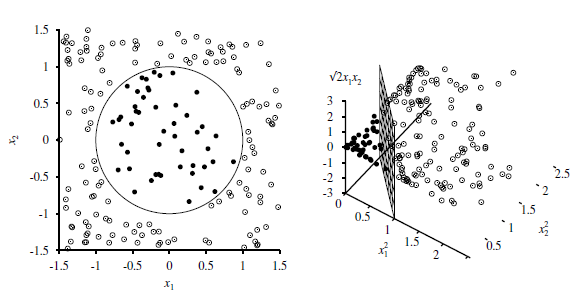

---

# Réseaux de neurones artificiels

- Inspiration biologique
- Neurone artificiel
  - Fonctions d'activation
- Multi-couches
  - Expressivité croissante

---

# Apprentissage profond

- Réseaux profonds
  - Multicouche traditionnel classifier
- Hiérarchies naturelles
  - **Pixel, bord, teston, motif,**
    - partie, objet
  - **Caractère, mot, groupe,**
    - clause, phrase, histoire
- Réseaux convolués
  - Noyaux de convolution
  - Sous-échantillonnage

---

# Extensions 2010+

- Réseaux récurrents
  - Mémoire à court terme
  - Réseaux LSTM
  - MAJ d'un état de cellule
- Réseaux résiduels (2015)
  - Réinjection des entrées
- GANs (2014)
  - Réseaux adversériaux

<!-- GANs : générateur vs discriminateur, portraits StyleGAN, deepfakes -->
---

# Extensions 2015+

- Modèles Bayésiens
  - Régularisation
  - Ex: Auto-encodeurs Var.
- Graph Neural Networks
  - Généralisation géométrique
  - Agrégation de voisinage
- Réseaux attentionnels
  - Économie de ressources
  - Séquences
  - Transformers, Multi-têtes (2017 : « Attention Is All You Need »)
- Semi-supervisé, Transfert
- LLMs : BERT (2018), GPT

<!-- Transformer : encodeur-decodeur, self-attention multi-tetes, positional encoding -->
---

# Extensions 2020+

**Modèles multimodaux**

- E.g Texte+Image
- Datasets, Encodeurs
- Rapprochement des plongements

**Modèles de diffusion**

- Prédiction d'un bruit (DDPM, 2020)
- Diffusion latente
- Autoencodeur Variationnel
- Conditionnement multimodal
- Mécanisme attentionnel

<!-- Diffusion : bruit gaussien progressif → apprentissage du debruitage inverse -->
---

# Apprentissage non paramétrique

**Principes**

- Jusque là, paramétrique
- Arbres de décisions, NNs
- Ici, par les instances
- Les données servent à prédire

**Machines à vecteurs de support**

- K Plus proches voisins
- Noyaux de pondérations
- Séparateurs à marge maximale
- Astuce du noyau

---

# Apprentissage et connaissances

- Utilisation de la connaissance
  - Passé + futur
  - Construction d'un énoncé en FOL
- Exploration: Version Space learning
- Apprentissage par explication
  - Ex: brochette
  - Explanation Based Learning
- Fondé sur la pertinence
  - Ex: langue du pays
  - Relevance Based learning
- Fondé sur des connaissances
  - Ex: Interne médical
  - Knowledge Based Inductive Learning
- Programmation logique inductive (Prolog)

---

# Apprentissage par renforcement

- Pas d'exemple
  - Feedback = bon ou mauvais
- Processus de décision de Markov
  - Récompense à apprendre
  - Possibilité de Shaping
- 3 architectures
  - Basé sur l'utilité
  - Q-learning (utilité/action)
  - Agent réflex = apprentissage de politique
- 2 familles
  - Passif (politique fixée)
  - Actif  nécessité d'explorer
- Approximations
  - Modèles paramétriques
  - Deep Q-learning

---
layout: section
---

# Questions?

---
layout: section
---

# Langage naturel (NLP)

- Modèle du langage
- Communication
- Agents conversationnels (chatbots)

---
layout: two-cols
---

# Modèles du langage

- N-grams
  - Modèles de Markov
  - Traitements
  - lissage, perplexité
- Utilisation
  - Classification, catégorisation
  - Langue, genre, spam
  - Analyse de sentiments
- Recherche d'information
  - Indexation
  - + traitement requêtes
  - + score  résultats

::right::

- Extraction d'information
  - Automates à états finis:
  - Regexs, Transducteurs
  - Modèles probabilistes
  - Extraction d'ontologie
  - Machine reading

---
layout: two-cols
---

# Grammaires

**Caractéristiques**

- Communication
- Echange d'information
- Analyse du langage
  - Modèles de communication
  - = grammaires + sémantique
- Formalismes
  - Classes de Chomsky
  - Catégories = Part Of Speech

::right::

**Grammaires probabilistes**

- Sans contexte (PCFGs)
- Syntaxique, Apprentissages
- Grammaires augmentées
  - Avec contexte, Sémantiques
- Interpréteurs
  - Modèles sémantiques
  - Ambiguités, Modèles imbriqués

---

# Speech/Text to Text/Speech

- Traduction automatisée
  - Modèles statistiques
- Reconnaissance de la parole
  - Modèles acoustiques + langage
- Modèles profonds
  - Réseaux récurrents / Transformers
  - Résumé, analyse syntaxique
  - Modèles sémantiques profonds

---

# Agents conversationnels

- Agents algorithmiques couplé au NLP
  - Modèles de langage
  - Intentions = tâches
  - Entités = objets et propriétés
  - Instances = exemples
- Architecture
  - Connecteurs à des canaux
  - Contextes de dialogues
- Conception
  - Développement hors ligne
  - Actions, KBs
  - Modèles du langage
  - Bootstrap
  - Entraînement en ligne

---
layout: two-cols
---

# Applications des chatbots

**Processus de création**

- Définition des objectifs
  - Fonctions, besoins etc.
- Définition du processus
  - Arborescence narrative
- Spécifications / Périmètre
- Identifier / rassembler les données
  - FAQ, DB, KB
- Budgétisation (10000 à 500K)
- Choix des canaux
  - Mobile, réseaux sociaux etc.
- Choix technologique
- Réalisation + entraînement
- Mise en production
- Amélioration

::right::

**Exemples**

- Hôtels et transports : SNCF
- Achats en ligne : Amazon
- Télécoms : Verizon
- Finance : Orange
- Médias : CNN
- Ami virtuel : Replika
- Support juridique interne : ADP

<!-- Chatbots modernes : ChatGPT (OpenAI), Claude (Anthropic), Gemini (Google) -->

---

# Intelligence conversationnelle

- **Quiz** : quelles formes d'intelligence sont mobilisées par un chatbot ?
  - Exploratoire : navigation dans l'arbre de dialogue
  - Symbolique : compréhension des intentions, raisonnement logique
  - Probabiliste : modèles de langage, prédiction du mot suivant
  - Apprentissage : entraînement sur des corpus massifs, fine-tuning RLHF
- L'agent conversationnel combine toutes les intelligences du cours

---
layout: section
---

# Questions?

---
layout: section
---

# IA générative & vibe coding

- 2022-2026 : la révolution des modèles de fondation
- LLMs, IA générative multimodale, agents et vibe coding
- Notre expérience : notebooks GenAI et stack self-hosted

---

# La révolution des modèles de fondation

**Le tournant : la « mise à l'échelle » (scaling)**

- Plus de données, plus de calcul, plus de paramètres
- Des capacités nouvelles émergent au-delà d'un seuil
  - Comprendre, traduire, résumer, écrire du code
- Ces modèles deviennent la base (« fondation ») de nombreuses applications

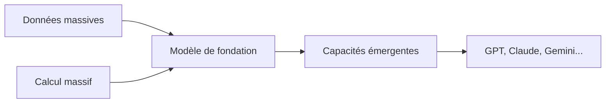
```mermaid
graph LR
    A[Données massives] --> C[Modèle de fondation]
    B[Calcul massif] --> C
    C --> D[Capacités émergentes]
    D --> E[GPT, Claude, Gemini...]
```

> Pour approfondir : notebooks `GenAI/Texte/`

---

# « Tokens » : l'unité que le modèle manipule

Un modèle ne lit ni des lettres, ni des mots : il lit des **tokens** — des fragments de texte fréquents, découpés statistiquement sur le corpus d'entraînement.

**Le découpage n'est pas le mot**

| Texte | Découpage |
|---|---|
| assurance | `assurance` |
| sinistralité | `sinistr` · `alité` |
| IARD | `I` · `ARD` |

Ordre de grandeur en français : <b>1 token ≈ 4 caractères ≈ 0,75 mot</b>.

**Pourquoi cela vous concerne**

- Le modèle ne fait qu'une chose : **prédire le token suivant**, un à la fois
- La **fenêtre de contexte** (ce qu'il peut « avoir sous les yeux ») se compte en tokens
- Le **prix** et la **latence** se facturent au token, en entrée comme en sortie
- Un mot rare, un nom propre ou un sigle métier coûte plus de tokens qu'un mot courant

> Conséquence de gestion : « combien de documents puis-je lui donner ? » et « combien cela coûte ? » sont **la même question**, posée en tokens.

---

# Du token au sens : les embeddings

Le **vocabulaire** et l'**espace de sens** sont deux choses différentes — c'est la confusion la plus fréquente, et la plus coûteuse à l'usage.

**Le vocabulaire : une liste**

- Une table d'environ **250 000 entrées** dans les modèles récents
- Un token n'y est **qu'un numéro** — c'est un espace de **dimension 1**
- Trop étroit pour le sens : « voler » y a **une seule** entrée, qu'il s'agisse de dérober ou de prendre l'air

**L'embedding : un espace fait pour le sens**

- **768 à 4 096 dimensions**, apprises à l'entraînement
- Chaque numéro y est projeté sur un **vecteur dense**
- Les homonymes s'y séparent, et l'on peut y calculer : *roi − homme + femme ≈ reine*
- C'est cet espace qu'indexent les **bases vectorielles** et la recherche sémantique (RAG)

> Dans un Transformer, on part de l'embedding du token nu — sa définition de dictionnaire — puis, couche après couche, l'attention croise ces vecteurs : les homonymes se lèvent d'abord, puis sujets et verbes s'associent, et le sens du récit se construit. Il n'est **jamais** la juxtaposition des définitions.

---

# L'avènement des Transformers

**Avant 2017** — le texte est lu séquentiellement (RNN, LSTM) : le début de la phrase s'estompe à mesure qu'on avance. Les longues dépendances se perdent.

**2017, « Attention is All You Need »** — chaque token regarde **tous les autres en même temps** et pondère ceux qui comptent pour lui.

**L'attention, sur un cas métier**

« Le <b class="text-rose-700">contrat</b> que l'assuré a signé après sa visite <b class="text-rose-700">est valable</b>. »

Pour accorder « est valable », le modèle doit rattacher le verbe à <b>contrat</b> — sept mots plus tôt — et non à <b>visite</b>, qui le précède immédiatement. L'attention lui permet de pointer directement le bon mot, quelle qu'en soit la distance.

**Les deux conséquences**

- **Portée** : les dépendances longues sont capturées, donc le sens tient sur un document entier
- **Parallélisme** : tous les tokens sont traités simultanément — donc sur GPU, donc **à grande échelle**

C'est ce second point qui a tout déclenché : l'architecture a rendu l'entraînement massif <i>économiquement possible</i>. Le « scaling » de la slide précédente n'est pas une trouvaille séparée — il est ce que les Transformers ont rendu praticable.

---

# LLMs & ChatGPT : l'IA grand public

- 2017 : Transformers (« Attention is All You Need ») — le fondement
- 2020 : GPT-3 — des capacités qui émergent à l'échelle
- 2022 : ChatGPT — l'IA conversationnelle grand public
- 2023-2026 : GPT-4/5, Claude, Gemini, modèles open-source

**Alignement par instruction**

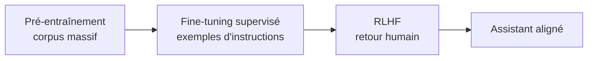
```mermaid
graph LR
    A[Pré-entraînement<br/>corpus massif] --> B[Fine-tuning supervisé<br/>exemples d'instructions]
    B --> C[RLHF<br/>retour humain]
    C --> D[Assistant aligné]
```

> ChatGPT a atteint 100 millions d'utilisateurs en 2 mois : l'IA devient un produit de masse

---

# IA générative multimodale

Un seul paradigme, plusieurs modalités — un modèle peut générer et comprendre différents types de contenus :

- **Texte** : rédaction, traduction, résumé, code (`GenAI/Texte/`)
- **Image** : génération et édition (`GenAI/Image/` — DALL-E, Qwen-Image-Edit, SDXL)
- **Audio** : synthèse vocale et transcription (`GenAI/Audio/` — Whisper, Kokoro, XTTS)
- **Vidéo** : génération et analyse (`GenAI/Video/` — Hunyuan, LTX, AnimateDiff)

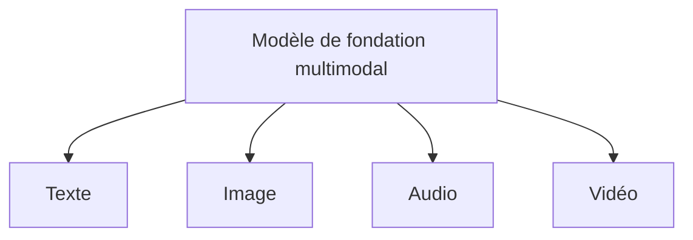
```mermaid
graph TD
    A[Modèle de fondation multimodal] --> B[Texte]
    A --> C[Image]
    A --> D[Audio]
    A --> E[Vidéo]
```

---

# Modèles de diffusion : générer une image

**Principe : apprendre à débruiter**

- Phase aller : on ajoute progressivement du bruit à une image
- Phase retour : le modèle apprend à retirer le bruit pas à pas
- À partir d'un bruit pur, il reconstruit une image cohérente
- Diffusion latente : opérer dans un espace compact (moins de calcul)

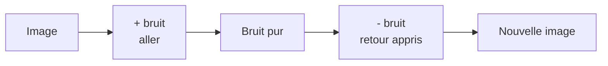
```mermaid
graph LR
    A[Image] --> B[+ bruit<br/>aller] --> C[Bruit pur]
    C --> D[- bruit<br/>retour appris] --> E[Nouvelle image]
```

> Les générateurs d'images (DALL-E, Stable Diffusion, Midjourney) reposent sur ce principe

---

# RAG : connecter un LLM à vos données

- Le LLM seul connaît ses données d'entraînement (fenêtre de connaissance figée)
- RAG = Retrieval Augmented Generation — « génération augmentée par la récupération »
  - Les documents sont indexés en vecteurs (embeddings)
  - À chaque question, on récupère les passages les plus pertinents
  - On les injecte dans le prompt, puis le LLM génère une réponse fondée
- Effets : réponses à jour, traçables, moins d'hallucinations

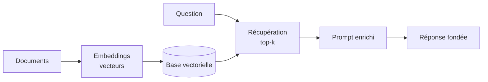
```mermaid
graph LR
    A[Documents] --> B[Embeddings<br/>vecteurs]
    B --> C[(Base vectorielle)]
    D[Question] --> E[Récupération<br/>top-k]
    C --> E
    E --> F[Prompt enrichi]
    F --> G[Réponse fondée]
```

> Notebook : `GenAI/RAG-et-Memoire-Semantique/`

---

# Agents IA : au-delà du chatbot

- Un agent = un LLM + des outils + une boucle de raisonnement
- Le modèle décide quand utiliser un outil (code, web, API, fichier)
- Boucle **ReAct** : Raisonner → Agir → Observer → Raisonner…

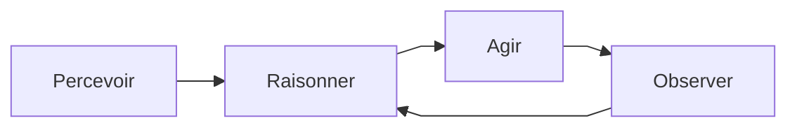
```mermaid
%%{init: {"flowchart": {"nodeSpacing": 30, "rankSpacing": 35, "curve": "linear"}, "themeVariables": {"fontSize": "14px"}}}%%
graph LR
    A[Percevoir] --> B[Raisonner]
    B --> C[Agir]
    C --> D[Observer]
    D --> B
```

- Cas d'usage : recherche web, exécution de code, orchestration de tâches
- Le chatbot devient un **agent actif** qui accomplit des tâches

> Notebooks : `GenAI/SemanticKernel/` (20 notebooks)

---

# Vibe coding : programmer par intention

- Terme popularisé par Andrej Karpathy (2025)
- On décrit ce que l'on veut **en langage naturel**, l'IA écrit le code
- Le développeur devient architecte et relecteur plutôt que dactylographe
- Limite : il faut savoir **relire et tester** ce que l'IA produit

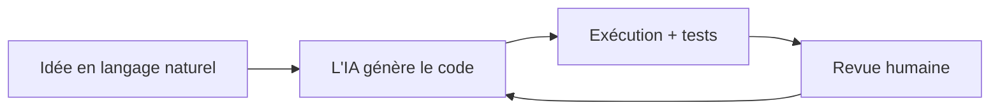
```mermaid
graph LR
    A[Idée en langage naturel] --> B[L'IA génère le code]
    B --> C[Exécution + tests]
    C --> D[Revue humaine]
    D --> B
```

> Curriculum : `GenAI/Vibe-Coding/`

---

# Vibe coding en pratique

- **Outils** : Claude Code, GitHub Copilot, Cursor, Windsurf
- **Bonnes pratiques**
  - `CLAUDE.md` : documenter le contexte et les règles du projet
  - Agents et skills spécialisés : déléguer les tâches répétitives
  - Itération serrée : petites tâches, vérification continue
- **Notre infrastructure** : un cluster d'agents (coordinateur + workers) qui
  explorent, produisent, reviewent et fusionnent des PRs

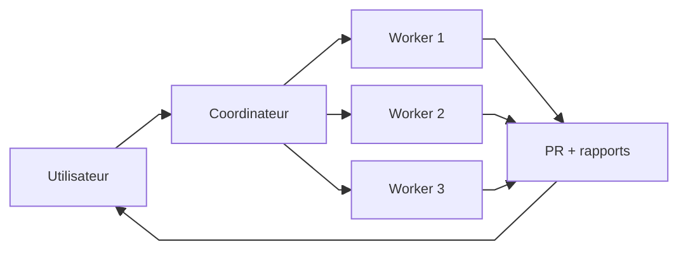
```mermaid
%%{init: {"flowchart": {"nodeSpacing": 14, "rankSpacing": 20, "curve": "linear"}, "themeVariables": {"fontSize": "11px"}}}%%
graph LR
    U[Utilisateur] --> C[Coordinateur]
    C --> W1[Worker 1]
    C --> W2[Worker 2]
    C --> W3[Worker 3]
    W1 --> R[PR + rapports]
    W2 --> R
    W3 --> R
    R --> U
```

Ce qui fait tenir l'ensemble n'est pas la puissance des modèles, mais la <b>structure</b> :
des rôles séparés, un périmètre écrit pour chacun, et une <b>revue obligatoire</b> avant
intégration. Les mêmes mécanismes qu'une organisation emploie pour déléguer sans perdre
le contrôle — et ils échouent ici pour les mêmes raisons : périmètre flou, revue de complaisance.

> Curriculum : `GenAI/Vibe-Coding/Claude-Code/`

---

# Adapter un modèle de fondation

- Un modèle de fondation est générique : on l'**adapte** à un domaine
- **Fine-tuning** : ré-entraînement supervisé sur des données spécialisées
- **LoRA** : n'adapter qu'un petit nombre de paramètres (économie de calcul)
- **Quantization** (INT4, FP8) : réduire la mémoire pour l'inférence
- **DPO / RLHF** : aligner le comportement sur des préférences humaines

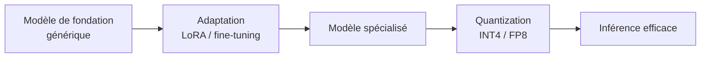
```mermaid
graph LR
    A[Modèle de fondation<br/>générique] --> B[Adaptation<br/>LoRA / fine-tuning]
    B --> C[Modèle spécialisé]
    C --> D[Quantization<br/>INT4 / FP8]
    D --> E[Inférence efficace]
```

> Notebooks : `GenAI/PostTraining/`, `GenAI/FineTuning/`

---

# Notre stack GenAI (self-hosted)

- Services Docker dédiés, orchestrés et validés sur nos machines
  - **ComfyUI** : workflows de génération d'images
  - **Qwen / Lumina / Z-Image** : modèles de fondation open-source
  - **Open-WebUI** : interface conversationnelle
- GPU avec allocation et idle management (quantization par service)
- La même stack alimente les notebooks `GenAI/{Image,Audio,Video}`

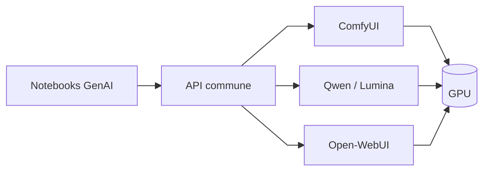
```mermaid
%%{init: {"flowchart": {"nodeSpacing": 25, "rankSpacing": 30, "curve": "linear"}, "themeVariables": {"fontSize": "13px"}}}%%
graph LR
    A[Notebooks GenAI] --> B[API commune]
    B --> C[ComfyUI]
    B --> D[Qwen / Lumina]
    B --> E[Open-WebUI]
    C --> F[(GPU)]
    D --> F
    E --> F
```

> Référence : `docs/genai/genai-services.md`

---

# Enjeux : hallucinations, alignement, régulation

- **Hallucinations** : un LLM peut affirmer avec assurance une chose fausse
  - Atténuation : RAG, vérification, raisonnement pas à pas
- **Alignement** : s'assurer que le modèle suit l'intention humaine
  - RLHF, DPO, garde-fous, supervision
- **Régulation** : l'AI Act européen encadre les usages à risque
  - Transparence, documentation, obligations pour l'IA généraliste
- **Sécurité** : les clés et secrets vivent dans des fichiers protégés,
  jamais dans le code, les prompts ou les sorties

> Un outil puissant appelle une utilisation **responsable**

---

# Pour aller plus loin : Notebooks

Ce deck couvre tous les domaines de l'IA. Pour approfondir avec des exemples pratiques :

> **GenAI - IA Générative**
> `MyIA.AI.Notebooks/GenAI/`
> Transformers, diffusion, LLMs, génération d'images, audio, vidéo
> `GenAI/Vibe-Coding/` : programmation par intention (Claude Code)

> **Search - Recherche et Optimisation**
> `MyIA.AI.Notebooks/Search/`
> Algorithmes génétiques, A*, optimisation locale

> **ML - Machine Learning**
> `MyIA.AI.Notebooks/ML/`
> ML.NET, arbres de décision, classification, régression

> **SymbolicAI - IA Symbolique**
> `MyIA.AI.Notebooks/SymbolicAI/`
> RDF, Z3 SMT, Tweety, Lean, ontologies, web sémantique

> **Probas - Modèles Probabilistes**
> `MyIA.AI.Notebooks/Probas/`
> Infer.NET, réseaux bayésiens, inférence probabiliste

> **GameTheory - Théorie des Jeux**
> `MyIA.AI.Notebooks/GameTheory/`
> OpenSpiel, équilibres de Nash, jeux stratégiques

---
layout: end
---

# Merci

Jean-Sylvain Boige
jsboige@myia.org
