

  <h1 class="text-7xl font-serif text-rose-800 leading-tight">Intelligence(s)</h1>

  

  
Une introduction à l'IA pour décideurs

  
Jean-Sylvain Boige

  
jsboige@myia.org — Telecom Bretagne — Cogs Brighton UK

  

    
    
    
  

---

# Sommaire

**Qu'est-ce que l'intelligence artificielle ?** 
Racines, histoire et état de l'art — structure des agents rationnels

**Intelligence exploratoire** 
Comment chercher la solution à un problème ?

**Intelligence symbolique** 
Comment utiliser le raisonnement et les mathématiques ?

  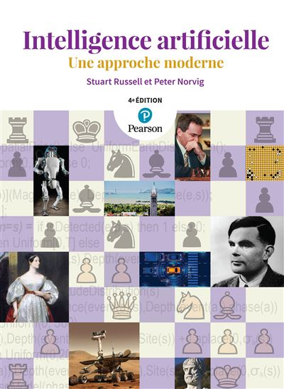

**Intelligence probabiliste** 
Comment agir dans l'incertitude ?

**Apprentissage** 
Comment utiliser les données et l'expérience ?

**Application : le langage naturel** 
Chatbots, LLM, IA générative et agents

---
layout: section
---

# Intelligence artificielle

- Introduction
- Agents rationnels
- Intelligences

---

# Qu'est-ce que l'intelligence artificielle?

- Définitions multiples
- Notre angle :
  - « Agir de façon rationnelle »
- Conception d'agents

**Fondements**

- Philosophie
- Maths
- Économie
- Biologie
- Neurosciences
- Psychologie
- Informatique
- Théorie du contrôle
- Linguistique

---

# Développement (1/2)

**Histoire succincte**

- 1940-70 : Enthousiasme des débuts
  - Turing, Dartmouth, Lisp
  - Samuel, Newell & Simon
- 1970s : Complexité calculatoire
  - Réseaux de neurones en pause
  - Systèmes experts
- 1980s : L'IA devient une industrie
  - Robotique, vision
- 1990s : L'IA devient une science

  
  

    
    
  

> **État de l'art** : voir la slide « Développement (2/2) » pour la chronologie moderne (1997 → 2025).

---

# Développement (2/2)

- **2000s** : Data mining, apprentissage bayésien, web sémantique, prouveurs automatiques
- **2010s** : Explosion du deep learning et du big data
  - 2014 : GANs (génération d'images), 2016 : AlphaGo (Go)
  - 2017 : Transformers ("Attention is All You Need")
  - 2018 : AlphaZero (échecs, Go, shogi sans connaissances humaines)
  - 2019 : Pluribus (poker), AlphaStar (Starcraft 2)
- **2020s** : LLMs et IA générative deviennent grand public
  - GPT-3 (2020), ChatGPT (2022), GPT-4 (2023), Claude 3 (2024), GPT-4o (2024), Claude 3.5 Sonnet (2024), Gemini 1.5/2 (2024-2025)
  - Stable Diffusion, Midjourney, DALL-E : génération d'images
  - 2025 : agents IA autonomes, vibe coding, IA multimodale

> **Chronologie cle** : Turing (1950) → Dartmouth (1956) → Hiver IA (1974) → Deep Blue (1997) → AlphaGo (2016) → ChatGPT (2022) → Agents IA (2025)

---

# Dans la vie de tous les jours

- **Poste** : reconnaissance des adresses et tri automatique du courrier
- **Banque** : lecture des chèques, vérification des signatures, évaluation de crédits
- **Médecine** : diagnostic assiste, prescriptions, suivi et prévention
- **Service client** : synthèse/reconnaissance vocale, chatbots (ChatGPT, Claude)
- **Transport** : détection de plaques, conduite autonome (Tesla, Waymo)
- **Internet** : marketing personnalise, détection de spam et de fraude
- **Industrie** : conception, fabrication et exploitation assistées par IA
- **Image numérique** : détection de visages, mise au point, compression
- **Jeux** : personnages et adversaires intelligents (NPCs adaptatifs)

  

---

# Les agents

**Définition**

- L'agent rationnel
  - Entité qui perçoit par des capteurs
  - agit par des effecteurs.
- Dans un environnement
  - Fait la bonne action
  - Maximise son succès.
  - Pas omniscient
  - Réactif, proactif, interactif, autonome
- Limitations
  - ressources disponibles

---

# Conception d'agents

**Environnement de tache**

- Description PEAS : Performance, Environnement, Actionneurs, Senseurs

**Agent réflexe**

- Pas de mémoire, réagit aux percepts courants
- Regles condition → action (si obstacle, alors freiner)

---
layout: section
---

# Quiz

- Taxi autonome:
  - Description Peas
  - Intelligences

---

# Agent réflexe fondé sur un modèle

**Agent réflexe avec modèle**

- Fonctionnement interne
- État du monde
- Niveau de représentation

**Compromis**

- Flexibilité vs complexité

---

# Intelligences

- **Procédurale** : automates et algorithmes déterministes (instructions pas à pas)
- **Exploratoire** : recherche dans un espace d'états (parcours de graphes, A*)
- **Symbolique** : raisonnement logique, bases de connaissances, planification
- **Probabiliste** : gestion de l'incertitude, réseaux bayésiens, décision
- **Apprentissage** : amélioration par l'expérience (supervisé, renforcement, deep learning)

  
  

---

# Décider seul, décider face à quelqu'un

### Théorie de la **décision**

L'incertitude vient de la **nature**. Elle ne vous veut rien.

- On maximise une **utilité espérée**
- L'objet cherché est un **optimum**
- Outils : probabilités, utilité, arbres de décision, processus markoviens
- Chez vous : prime pure, chargement de sécurité, aversion au risque

### Théorie des **jeux**

L'incertitude vient d'un **autre décideur**, qui optimise aussi — parfois contre vous.

- On cherche un **équilibre**, pas un optimum
- L'objet cherché est l'**équilibre de Nash**
- Outils : matrices de gains, minimax, information asymétrique, conception de mécanismes
- Chez vous : antisélection, aléa moral, signal, dépistage

**Le même livre fonde les deux** — von Neumann &amp; Morgenstern, 1944. La théorie des jeux *dérive* de la décision, mais elle en change l'objet : dès que l'autre choisit aussi, l'optimum s'évanouit et seul l'équilibre subsiste.

---

# Ce que la théorie des jeux ajoute — et ce qu'elle a donné à l'IA

### Des objets que la décision seule ne produit pas

- **Antisélection** — celui qui se sait mauvais risque s'assure en premier *(Akerlof, 1970)*
- **Aléa moral** — être couvert change le comportement de l'assuré
- **Signal et dépistage** — le contrat est construit pour *faire révéler* l'information cachée *(Spence 1973 ; Rothschild &amp; Stiglitz 1976, sur le marché de l'assurance)*
- **Jeux bayésiens** — décider quand on ignore le type de l'autre *(Harsanyi)*

### En intelligence artificielle

- **Minimax et élagage alpha-bêta** : le socle des programmes de jeu depuis les années 1950
- **Jeu contre soi-même** : le programme s'entraîne sans professeur en s'affrontant *(AlphaGo, AlphaZero)*
- **Apprentissage par renforcement multi-agent** : plusieurs agents apprennent en s'influençant
- **Enchères et conception de mécanismes** : ce qui régit la publicité en ligne

**Vos contrats sont déjà des mécanismes de jeu.** Franchise, bonus-malus, coassurance ne sont pas des paramètres tarifaires : ce sont des dispositifs d'incitation. La théorie des jeux est la discipline qui les conçoit.

---
layout: section
---

# Questions?

---
layout: section
---

# Intelligence exploratoire

- Recherches non informée et informée
- Jeux
- Problèmes à satisfaction de contraintes

---

# Agent explorateur

**Agent fonde sur des buts**

- Passe du réactif au délibératif
- Planifie ses actions par exploration

**Résolution de problèmes**

- Objectif ?
- Actions ?
- Représentation ?

---

# Formulation de problèmes

**Itinéraire**

- État initial, test de but
- Transitions
- États, Actions
- Coût de chemin
- Solution = Séquence

**Abstractions**

- Assemblage robotique
- Problèmes jouets

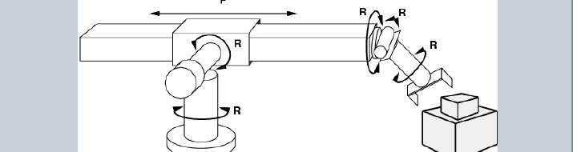

  
  

---

# Arbre d'exploration

Idée de base

Exemple : Énigme

- Développement des états successeur
- **Choix des nœuds**
  - = Stratégie d'exploration

**Exemple: Énigme**

- Missionnaires et cannibales
  - Barque de 2 places
  - Jamais + de cannibales

---
layout: section
---

# Quiz

- Missionnaires et cannibales
- Intelligences

---
layout: default
---

# Stratégies d'exploration (1/2)

Non informées

Informées

- En largeur
- En profondeur
- Bidirectionnelle
- Ex: Où sont mes clefs ?

- Évaluation des états
  - **Heuristique**
  - Estimation du coût restant
  - Ex: Distance à vol d'oiseau
- Par le meilleur d'abord
  - Exploration gloutonne
  - Algorithme A*
  - [Demo Pathfinding.js](https://qiao.github.io/PathFinding.js/visual/)

  
  

---

# Stratégies d'exploration (2/2)

- Si seule la solution compte
  - pas le chemin
  - Modification d'un seul état
- Paysage de l'espace des états
  - Optimisation d'une fonction
  - Escalade, descente de gradient

- Problèmes :
  - Bloqué sur un optimum local
- Solutions:
  - Recuit simulé
  - Ex: le carton de babioles
  - Exploration en faisceaux
  - Ex: Perdus en foret
  - Sélection naturelle = combinaison
  - Algorithmes génétiques

---

# Jeux

Jeux vs Exploration

Arbre Minimax

- Arbre de jeu
- Environnements
  - multi-agents, concurrentiels
  - Classe la plus étudiées
  - Alternés, déterministes
  - A somme nulle (h1 = -h2)
  - A information parfaite
- Difficulté
  - Arbre d'exploration impraticable
  - Performance critique: temps
  - Stochastiques, information imparfaite
  - Libratus (poker), Starcraft 2

**Techniques**

- Actions joueurs Max et Min + utilité terminale
- Minimax, Alpha-Beta
- Avec arrêt + évaluation heuristique
- Techniques probabilistes (Expectiminimax, Monte-Carlo)

  

---
layout: default
---

# Problèmes à satisfaction de contraintes

Définition CSPs

Techniques

- Jusqu'ici: représentation atomique
- CSP = État factorisé
- État = variables sur des domaines
- Test de but = contraintes sur les variables
- Bonnes méthodes générales
- Meilleures que l'exploration standard
- Exemple
  - Coloration de carte

- Exploration avec heuristiques
  - H1 ? H2 ? H3 ?
  - Ex: le coffre de voiture
- Inférence
  - Mise en cohérence des domaines
  - Ex: Sudoku
- Structure des problèmes
  - Sous-problèmes, Arbres
- Structure des valeurs
  - Symétrie (rupture de)

---
layout: section
---

# Questions?

---
layout: section
---

# Intelligence symbolique

- Logique propositionnelle
- Logique du premier ordre
- Agents fondés sur la connaissance
- Planification

---
layout: default
---

# Représentation et logique

**Enoncés**

- Langage
- Syntaxe
- Sémantique
- Types de logiques

**Inférence**

- Propriétés
- correction, consistance, complétude

**Bases de connaissances**

**Raisonnement**

---

# Logique propositionnelle

- Syntaxe
- Sémantique
  - Tables de vérité
- Inférence logique
  - Règles cohérentes
  - Ex: Modus ponens
  - Preuve déductive
- Procédures
  - Chaînages
  - Résolution
  - DPLL, WalkSAT
- Solveurs SAT
  - Problèmes NP-complets

---

# Logique du premier ordre (FOL)

- Modélise
  - Objets, Propriétés
  - Relations, Fonctions
- Quantificateurs:
  - Il existe x - x
  - Pour chaque x - x
- Sémantiques multiples
  - de base de données

**Exemple: investigation**

- Missile(x) ET Possède(Corée, x) => Vend(West, x ,Corée)
- Missile(x) => Arme(x)
- Enemy(x,America) => Hostile(x)
- Américain(x) ET Arme(y) ET Vend(x,y,z) ET Hostile(z) => Criminel(x)

---

# Application: argumentation

Code de conduite

Qu'est-ce qu'un argument ?

- Principes de conduite intellectuelle
  - Faillibilité
  - Recherche de la vérité
  - Clarté
  - Charge de la preuve
  - Charité
  - Structure, Pertinence, Acceptabilité, Suffisance, Réfutation
  - Suspension du jugement
  - Résolution

**Qu'est-ce qu'un argument?**

- Standards
  - procédural efficace
  - éthique important
- Une proposition (conclusion) supportée par
  - D'autres proposition (Prémisses)
  - Le raisonnement
- Argument =/= Opinion
- Déduction vs Induction
  - Déduction  nécessité logique
  - Induction  Corroboration
  - Prémisses particulières
  - Argument Moral  principe
  - Légal  loi, jurisprudence etc.
  - Esthétique  critère

---

# Analyse rhétorique

**Un bon argument**

- Respecte 5 critères
  - Structure bien formée
  - Prémisse pertinentes
    - pour la vérité de la conclusion
  - Prémisses acceptables
    - par une personne raisonnable
  - Prémisses suffisantes
    - à démontrer la conclusion
  - Fournissant une réfutation effective
    - des critiques anticipées
- Renforcer un argument
  - Balayer ces 5 critères

**Un argument fallacieux**

- Viole l'un des critères
- Taxonomie
- Comment le dénoncer
  - Reconstruction standard
  - Contre-exemple absurde
  - Fair-play

---

# Application: Planification

Expression de problème

Approches

- Langage formel
- But à atteindre
- Listes des opérations

- Exploration des états, plans
- Heuristiques ?
- Calcul situationnel
- Théorèmes en FOL
- Planification par contraintes
- Planification à Ordre partiel
- Décomposition hiérarchique

---

# Autres Applications (1/2)

- Solveurs Modulo Théorie
  - SAT + Quantificateurs
  - + Théories arithmétiques
  - + Optimiseurs
- Ingénierie de connaissances
  - Triplets, Ontologies
  - Web sémantique
  - W3C
  - Linked Data

<!-- Exemples : triplets RDF (sujet-predicat-objet), ontologies OWL, SPARQL -->
---

# Autres Applications (2/2)

- Systèmes à maintenance de vérité (TMS)
  - Révision des croyances
  - JTMS, ATMS: justice
  - Générateurs d'hypothèses
- Smart-contracts
  - Cryptographie
  - Blockchain
  - Non-divulgation

<!-- Image: images/img_050.png -->

<!-- Blockchain : registre distribué, consensus, exécution automatique de contrats -->

---
layout: section
---

# Questions?

---
layout: section
---

# Intelligence probabiliste

- Quantification de l'incertitude
- Raisonnement probabiliste
- Prise de décision
- Théorie des jeux

---

# Agir dans l'incertitude

**Le monde est incertain**

- Entrées incertaines
  - Données manquantes,  bruitées
  - Connaissance incertaine
  - Causalités complexes
  - Environnement stochastique
- Sorties incertaines
  - Abduction, induction
  - Inférence incomplète

**Agent fondé sur l'utilité**

- Raisonnement probabiliste
- Résultats probabilistes
- Alternatives
- Niveau de succès espéré

---

# Probabilité

**Fondements**

- Les probabilités résument notre incertitude (paresse, ignorance)
- Probabilités subjectives : degré de croyance d'un agent
- Se mettent a jour avec les observations

**Règle de Bayes**

- Diagnostic
- P(Cause | Effet) = P(Effet | Cause) x P(Cause) / P(Effet)

**Programmation probabiliste**

- Réseau Bayésien naïf
  - Attributs indépendants
- Modèles graphiques
  - Indépendance conditionnelle
  - Facteurs de distributions continues

---

# Réseaux bayésiens dynamiques

**Chaînes de Markov**

- Indépendance conditionnelle
- Passé / Futur
- Modèle de transition
  - Probabiliste
  - **Distribution** stationnaire
- Chaînes de Markov cachées
  - Observations bruitées

**Applications**

- Traitement du langage naturel
- Classification, Extraction
- Reconnaissance, Traduction
- Google 1.0: Page rank
- Suivi de trajectoire
- Météo, radars, économie etc.
- Filtres de Kalman
- Apprentissage

---

# Prise de décision

- Théorie de la décision
  - Que faire?
  - Théorie des probabilités
  - Que croire ?
  - Théorie de l'utilité
  - Que vouloir ?
- Utilité de l'argent
  - Goût du risque ?
  - Prime
  - Utilité espérée
  - biaisée (malédiction)
  - + Humains pas rationnel
- Prise de décision simple
  - Réseaux de décision
- Décision complexe
  - Processus de Markov
  - Politique optimale

---

# Théorie des jeux (1/2)

Environnement multi-agents

- Analyse stratégique
- Interdépendances stratégiques
- Design d'agent
  - Quelle stratégie?
- Design de mécanisme
  - Quelles règles?

Optimisation de stratégies

- Solution = profil de stratégies
- Pures (déterministes)
- Mixtes (probabilistes)
- Utilité espérée

---

# Théorie des jeux (2/2)

Jeux simultanés

- Matrice de gains
- Dominance
- Équilibres de Nash
- Purs et mixtes (2n+1)
- Topologie

Jeux séquentiels

- Plusieurs manches
- Forme extensive
- Crédibilité
- Punitions, Menaces, Promesses
- Induction
  - avant/arrière

<!-- Forme extensive : arbre ou chaque noeud = décision, feuilles = gains -->

  

---

# Extensions

**Algorithmes**

- Espaces infinis
- Hotelling
- Jeux Bayésiens
  - Information incomplète
  - Jeux de signalisation
- Jeux différentiels

**Équilibres approchés**

- ε-équilibres
- Minimisation de regret contrefactuel
- Cepheus
- Libratus
- Deepstack

---

# Conception de mécanismes

Concepts

- Théorie des jeux inverse
- Quelles bonnes règles ?
- Max d'une utilité globale?
- Principe de révélation
  - Mécanismes manipulables
  - Non-stratégiques

Résultats

- Enchères de Vickrey
- Tragédie des communs
- Taxe carbone
- Conditions byzantines
- Bitcoin
- Stratégies sociétales
  - Évolution de la confiance

---

# Décisions collectives

**Théorie du choix social**

- Théorie de la négociation
- Théorie des votes
- Résultats négatifs
  - Critère de Condorcet
  - Électeur médian

**Méthodes de Condorcet**

- Schulze
- Autres bon Scrutins
  - Vote par assentiment
  - Jugement majoritaire
  - Scrutin bipartipludique

---
layout: section
---

# Quiz

- Présidentielles: vainqueur de Condorcet
- Intelligences

---
layout: section
---

# Questions?

---
layout: section
---

# Apprentissage

- Apprentissage supervisé
- Arbres de décision
- Deep learning
- Modèles non-paramétriques
- Apprentissage et connaissances
- Apprentissage par renforcement

---

# Apprentissage

**Enjeux**

- Environnements inconnus
- Méthode de conception de systèmes
- Améliorer la prise de décision
- Les performances

**Structure d'agent**

- Modules
  - Performance
  - Apprentissage
  - Critique
  - Générateur de problème

---

# Caractéristiques (1/2)

**Composants d'apprentissage**

- Type d'apprentissage
  - Inductif
  - Déductif
- Type de feedback:
  - Supervisé: les réponses correctes
  - Non-supervisé: clusters
  - Par renforcement: récompenses

**Apprentissage inductif**

- Nature affectée par
  - Environnement / données
  - Connaissance a priori / modèles
  - Feedback pour apprendre

---

# Caractéristiques (2/2)

- On construit une hypothèse
  - h consistante avec les données
- Ensemble de sortie
  - Classification
  - Régression
- Rasoir d'Occam
  - Parcimonie
- Entraînement
- Validation
- **Méthodes**
  - d'ensemble
  - Boosting

---

# Arbres de décision

**Principe**

- Attributs  Décision
- A partir d'exemples

**Techniques**

- Ordre des attributs
- Gain entropique
- Compacité
- Élagage
- Régression
- Quantisation
- Random forest
- Ensemble

---

# Classification

- Utilisation de dimensions supérieures
- Classification linéaire

---

# Réseaux de neurones artificiels

- Inspiration biologique
- Neurone artificiel
  - Fonctions d'activation
- Multi-couches
  - Expressivité croissante

---

# Apprentissage profond

- Réseaux profonds
  - Multicouche traditionnel classifier
- Hiérarchies naturelles
  - **Pixel, bord, teston, motif,**
    - partie, objet
  - **Caractère, mot, groupe,**
    - clause, phrase, histoire
- Réseaux convolués
  - Noyaux de convolution
  - Sous-échantillonnage

---

# Extensions 2010+

- Réseaux récurrents
  - Mémoire à court terme
  - Réseaux LSTM
  - MAJ d'un état de cellule
- Réseaux résiduels (2015)
  - Réinjection des entrées
- GANs (2014)
  - Réseaux adversériaux

<!-- GANs : générateur vs discriminateur, portraits StyleGAN, deepfakes -->
---

# Extensions 2015+ — au-delà de la grille

- Modèles Bayésiens
  - Régularisation
  - Ex: Auto-encodeurs Var.
- Graph Neural Networks
  - Généralisation géométrique
  - Agrégation de voisinage

<!-- Auto-encodeurs variationnels : encodeur mu/sigma, echantillonnage, perte reconstruction + KL. GNN : donnees en graphe irregulier plutot qu'en grille, agregation de voisinage. -->
---

# Extensions 2015+ — attention et LLMs

- Réseaux attentionnels
  - Économie de ressources
  - Séquences
  - Transformers, Multi-têtes (2017 : « Attention Is All You Need »)
- Semi-supervisé, Transfert
- LLMs : BERT (2018), GPT-1 (2018)
  - GPT-2 (2019, zero-shot), GPT-3 (2020, in-context few-shot)
  - T5 (2019, text-to-text unifié)
- Modèles efficients (2020+)
  - Reformer, Longformer : attention linéaire ou par fenêtres
  - Mamba (2023) et State Space Models : complexité linéaire, alternative aux Transformers pour séquences longues
  - Hyena, RWKV : mélanges convolutifs et RNN-like pour le même usage

<!-- Transformer : encodeur-decodeur, self-attention multi-tetes, positional encoding. LLMs : GPT-2 (2019) zero-shot, GPT-3 (2020) in-context few-shot, T5 (2019) text-to-text unifie. Modeles efficients 2020+ : Reformer, Longformer. -->
---

# Extensions 2020+ — modèles multimodaux

**Modèles multimodaux**

- E.g Texte+Image
- Datasets, Encodeurs
- Rapprochement des plongements
  - CLIP (2021, OpenAI) : contraste texte-image sur 400 M de paires
  - ALIGN, Florence (2021-2022) : variantes industrielles
- Génération conditionnelle
  - DALL-E (2022, OpenAI), Imagen (2022, Google)
  - GPT-4V (2023), Gemini (2023) : compréhension multimodale

<!-- Multimodaux : CLIP (2021) contraste texte-image sur 400 M de paires, ALIGN / Florence, DALL-E (2022), Imagen (2022), GPT-4V / Gemini (2023). -->
---

# Extensions 2020+ — diffusion et alignement

**Modèles de diffusion**

- Prédiction d'un bruit (DDPM, Ho et al. 2020)
- Diffusion latente (LDM / Stable Diffusion, Rombach et al. 2021-2022)
  - Espace latent d'un autoencodeur variationnel pré-entraîné
  - Conditionnement texte (CLIP text encoder) + débruitage U-Net
- Conditionnement multimodal
- Mécanisme attentionnel (cross-attention Q/K/V)

**Alignement et produit grand public**

- RLHF (2022, InstructGPT) : affinage par retour humain
- ChatGPT (nov. 2022, OpenAI) : 100 M d'utilisateurs en 2 mois
- Générations suivantes : Llama 3 / 3.1 / 4 (2024-2025), DeepSeek-V3 (2024), Qwen2.5 (2024-2025), Gemma 2 (2024)
- Frontier multimodaux omni : GPT-4o (mai 2024), Claude 3.5 Sonnet (2024), Gemini 1.5 / 2 (2024-2025)
- Modèles open-weight : Llama 2 (2023), Mistral, Mixtral (MoE 2023-2024)

<!-- Diffusion latente (LDM / Stable Diffusion, Rombach 2021-2022) : bruit latent + U-Net + cross-attention. Alignement : RLHF (InstructGPT 2022), ChatGPT (nov 2022), Llama 2 / Mistral / Mixtral (2023-2024). Générations suivantes (2024-2025) : Llama 3 / 4, DeepSeek-V3, Qwen2.5, Gemma 2 ; frontier omni : GPT-4o, Claude 3.5 Sonnet, Gemini 1.5 / 2. -->
---

# Apprentissage non paramétrique

**Principes**

- Jusque là, paramétrique
- Arbres de décisions, NNs
- Ici, par les instances
- Les données servent à prédire

**Machines à vecteurs de support**

- K Plus proches voisins
- Noyaux de pondérations
- Séparateurs à marge maximale
- Astuce du noyau

---

# Apprentissage et connaissances

- Utilisation de la connaissance
  - Passé + futur
  - Construction d'un énoncé en FOL
- Exploration: Version Space learning
- Apprentissage par explication
  - Ex: brochette
  - Explanation Based Learning
- Fondé sur la pertinence
  - Ex: langue du pays
  - Relevance Based learning
- Fondé sur des connaissances
  - Ex: Interne médical
  - Knowledge Based Inductive Learning
- Programmation logique inductive (Prolog)

---

# Apprentissage par renforcement

- Pas d'exemple
  - Feedback = bon ou mauvais
- Processus de décision de Markov
  - Récompense à apprendre
  - Possibilité de Shaping
- 3 architectures
  - Basé sur l'utilité
  - Q-learning (utilité/action)
  - Agent réflex = apprentissage de politique
- 2 familles
  - Passif (politique fixée)
  - Actif  nécessité d'explorer
- Approximations
  - Modèles paramétriques
  - Deep Q-learning

---
layout: section
---

# Questions?

---
layout: section
---

# Langage naturel (NLP)

- Modèle du langage
- Communication
- Agents conversationnels (chatbots)

---

# Modèles du langage

- N-grams
  - Modèles de Markov
  - Traitements
  - lissage, perplexité
- Utilisation
  - Classification, catégorisation
  - Langue, genre, spam
  - Analyse de sentiments
- Recherche d'information
  - Indexation
  - + traitement requêtes
  - + score  résultats

- Extraction d'information
  - Automates à états finis:
  - Regexs, Transducteurs
  - Modèles probabilistes
  - Extraction d'ontologie
  - Machine reading

---

# NLP et NLU : la carte des tâches

Le <strong>NLU</strong> est un sous-ensemble du <strong>NLP</strong> : les tâches de la zone verte supposent une représentation du <em>sens</em>, celles de la zone bleue seule s'en passent.

---

# Grammaires

**Caractéristiques**

- Communication
- Echange d'information
- Analyse du langage
  - Modèles de communication
  - = grammaires + sémantique
- Formalismes
  - Classes de Chomsky
  - Catégories = Part Of Speech

**Grammaires probabilistes**

- Sans contexte (PCFGs)
- Syntaxique, Apprentissages
- Grammaires augmentées
  - Avec contexte, Sémantiques
- Interpréteurs
  - Modèles sémantiques
  - Ambiguités, Modèles imbriqués

---

# Speech/Text to Text/Speech

- Traduction automatisée
  - Modèles statistiques
- Reconnaissance de la parole
  - Modèles acoustiques + langage
- Modèles profonds
  - Réseaux récurrents / Transformers
  - Résumé, analyse syntaxique
  - Modèles sémantiques profonds

---

# Agents conversationnels

- Agents algorithmiques couplé au NLP
  - Modèles de langage
  - Intentions = tâches
  - Entités = objets et propriétés
  - Instances = exemples
- Architecture
  - Connecteurs à des canaux
  - Contextes de dialogues
- Conception
  - Développement hors ligne
  - Actions, KBs
  - Modèles du langage
  - Bootstrap
  - Entraînement en ligne

---

# Applications des chatbots

**Processus de création**

- Définition des objectifs
  - Fonctions, besoins etc.
- Définition du processus
  - Arborescence narrative
- Spécifications / Périmètre
- Identifier / rassembler les données
  - FAQ, DB, KB
- Budgétisation (10000 à 500K)
- Choix des canaux
  - Mobile, réseaux sociaux etc.
- Choix technologique
- Réalisation + entraînement
- Mise en production
- Amélioration

**Exemples**

- Hôtels et transports : SNCF
- Achats en ligne : Amazon
- Télécoms : Verizon
- Finance : Orange
- Médias : CNN
- Ami virtuel : Replika
- Support juridique interne : ADP

<!-- Chatbots modernes : ChatGPT (OpenAI), Claude (Anthropic), Gemini (Google) -->

---

# Intelligence conversationnelle

- **Quiz** : quelles formes d'intelligence sont mobilisées par un chatbot ?
  - Exploratoire : navigation dans l'arbre de dialogue
  - Symbolique : compréhension des intentions, raisonnement logique
  - Probabiliste : modèles de langage, prédiction du mot suivant
  - Apprentissage : entraînement sur des corpus massifs, fine-tuning RLHF
- L'agent conversationnel combine toutes les intelligences du cours

---
layout: section
---

# Questions?

---
layout: section
---

# IA générative & vibe coding

- 2022-2026 : la révolution des modèles de fondation
- LLMs, IA générative multimodale, agents et vibe coding
- Notre expérience : notebooks GenAI et stack self-hosted

---

# La révolution des modèles de fondation

**Le tournant : la « mise à l'échelle » (scaling)**

- Plus de données, plus de calcul, plus de paramètres
- Des capacités nouvelles émergent au-delà d'un seuil
  - Comprendre, traduire, résumer, écrire du code
- Ces modèles deviennent la base (« fondation ») de nombreuses applications

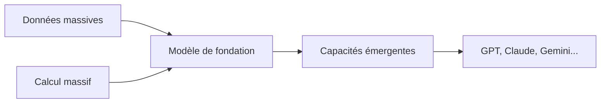
```mermaid
graph LR
    A[Données massives] --> C[Modèle de fondation]
    B[Calcul massif] --> C
    C --> D[Capacités émergentes]
    D --> E[GPT, Claude, Gemini...]
```

> Pour approfondir : notebooks `GenAI/Texte/`

---

# « Tokens » : l'unité que le modèle manipule

Un modèle ne lit ni des lettres, ni des mots : il lit des **tokens** — des fragments de texte fréquents, découpés statistiquement sur le corpus d'entraînement.

**Le découpage n'est pas le mot**

| Texte | Découpage |
|---|---|
| assurance | `assurance` |
| sinistralité | `sinistr` · `alité` |
| IARD | `I` · `ARD` |

Ordre de grandeur en français : <b>1 token ≈ 4 caractères ≈ 0,75 mot</b>.

**Pourquoi cela vous concerne**

- Le modèle ne fait qu'une chose : **prédire le token suivant**, un à la fois
- La **fenêtre de contexte** (ce qu'il peut « avoir sous les yeux ») se compte en tokens
- Le **prix** et la **latence** se facturent au token, en entrée comme en sortie
- Un mot rare, un nom propre ou un sigle métier coûte plus de tokens qu'un mot courant

> Conséquence de gestion : « combien de documents puis-je lui donner ? » et « combien cela coûte ? » sont **la même question**, posée en tokens.

---

# Du token au sens : les embeddings

Le **vocabulaire** et l'**espace de sens** sont deux choses différentes — c'est la confusion la plus fréquente, et la plus coûteuse à l'usage.

**Le vocabulaire : une liste**

- Une table d'environ **250 000 entrées** dans les modèles récents
- Un token n'y est **qu'un numéro** — c'est un espace de **dimension 1**
- Trop étroit pour le sens : « voler » y a **une seule** entrée, qu'il s'agisse de dérober ou de prendre l'air

**L'embedding : un espace fait pour le sens**

- **768 à 4 096 dimensions**, apprises à l'entraînement
- Chaque numéro y est projeté sur un **vecteur dense**
- Les homonymes s'y séparent, et l'on peut y calculer : *roi − homme + femme ≈ reine*
- C'est cet espace qu'indexent les **bases vectorielles** et la recherche sémantique (RAG)

> Dans un Transformer, on part de l'embedding du token nu — sa définition de dictionnaire — puis, couche après couche, l'attention croise ces vecteurs : les homonymes se lèvent d'abord, puis sujets et verbes s'associent, et le sens du récit se construit. Il n'est **jamais** la juxtaposition des définitions.

---

# L'avènement des Transformers

**Avant 2017** — le texte est lu séquentiellement (RNN, LSTM) : le début de la phrase s'estompe à mesure qu'on avance. Les longues dépendances se perdent.

**2017, « Attention is All You Need »** — chaque token regarde **tous les autres en même temps** et pondère ceux qui comptent pour lui.

**L'attention, sur un cas métier**

« Le <b class="text-rose-700">contrat</b> que l'assuré a signé après sa visite <b class="text-rose-700">est valable</b>. »

Pour accorder « est valable », le modèle doit rattacher le verbe à <b>contrat</b> — sept mots plus tôt — et non à <b>visite</b>, qui le précède immédiatement. L'attention lui permet de pointer directement le bon mot, quelle qu'en soit la distance.

**Les deux conséquences**

- **Portée** : les dépendances longues sont capturées, donc le sens tient sur un document entier
- **Parallélisme** : tous les tokens sont traités simultanément — donc sur GPU, donc **à grande échelle**

C'est ce second point qui a tout déclenché : l'architecture a rendu l'entraînement massif <i>économiquement possible</i>. Le « scaling » de la slide précédente n'est pas une trouvaille séparée — il est ce que les Transformers ont rendu praticable.

---

# LLMs & ChatGPT : l'IA grand public

- 2017 : Transformers (« Attention is All You Need ») — le fondement
- 2020 : GPT-3 — des capacités qui émergent à l'échelle
- 2022 : ChatGPT — l'IA conversationnelle grand public
- 2023-2026 : GPT-4/5, Claude, Gemini, modèles open-source

**Alignement par instruction**

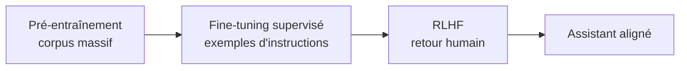
```mermaid
graph LR
    A[Pré-entraînement<br/>corpus massif] --> B[Fine-tuning supervisé<br/>exemples d'instructions]
    B --> C[RLHF<br/>retour humain]
    C --> D[Assistant aligné]
```

> ChatGPT a atteint 100 millions d'utilisateurs en 2 mois : l'IA devient un produit de masse

---

# IA générative multimodale

Un seul paradigme, plusieurs modalités — un modèle peut générer et comprendre différents types de contenus :

- **Texte** : rédaction, traduction, résumé, code (`GenAI/Texte/`)
- **Image** : génération et édition (`GenAI/Image/` — DALL-E, Qwen-Image-Edit, SDXL)
- **Audio** : synthèse vocale et transcription (`GenAI/Audio/` — Whisper, Kokoro, XTTS)
- **Vidéo** : génération et analyse (`GenAI/Video/` — Hunyuan, LTX, AnimateDiff)

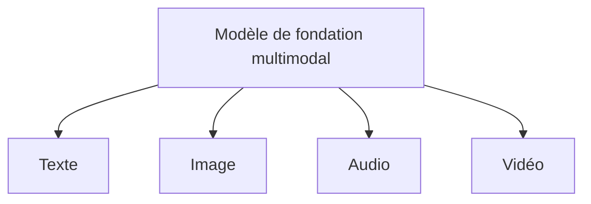
```mermaid
graph TD
    A[Modèle de fondation multimodal] --> B[Texte]
    A --> C[Image]
    A --> D[Audio]
    A --> E[Vidéo]
```

---

# Modèles de diffusion : générer une image

**Principe : apprendre à débruiter**

- Phase aller : on ajoute progressivement du bruit à une image
- Phase retour : le modèle apprend à retirer le bruit pas à pas
- À partir d'un bruit pur, il reconstruit une image cohérente
- Diffusion latente : opérer dans un espace compact (moins de calcul)

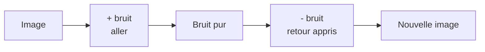
```mermaid
graph LR
    A[Image] --> B[+ bruit<br/>aller] --> C[Bruit pur]
    C --> D[- bruit<br/>retour appris] --> E[Nouvelle image]
```

> Les générateurs d'images (DALL-E, Stable Diffusion, Midjourney) reposent sur ce principe

---

# RAG : connecter un LLM à vos données

- Le LLM seul connaît ses données d'entraînement (fenêtre de connaissance figée)
- RAG = Retrieval Augmented Generation — « génération augmentée par la récupération »
  - Les documents sont indexés en vecteurs (embeddings)
  - À chaque question, on récupère les passages les plus pertinents
  - On les injecte dans le prompt, puis le LLM génère une réponse fondée
- Effets : réponses à jour, traçables, moins d'hallucinations

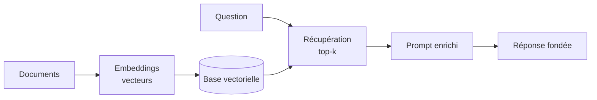
```mermaid
graph LR
    A[Documents] --> B[Embeddings<br/>vecteurs]
    B --> C[(Base vectorielle)]
    D[Question] --> E[Récupération<br/>top-k]
    C --> E
    E --> F[Prompt enrichi]
    F --> G[Réponse fondée]
```

> Notebook : `GenAI/RAG-et-Memoire-Semantique/`

---

# Agents IA : au-delà du chatbot

- Un agent = un LLM + des outils + une boucle de raisonnement
- Le modèle décide quand utiliser un outil (code, web, API, fichier)
- Boucle **ReAct** : Raisonner → Agir → Observer → Raisonner…

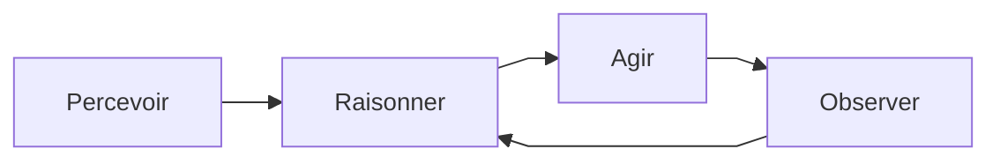
```mermaid
%%{init: {"flowchart": {"nodeSpacing": 30, "rankSpacing": 35, "curve": "linear"}, "themeVariables": {"fontSize": "14px"}}}%%
graph LR
    A[Percevoir] --> B[Raisonner]
    B --> C[Agir]
    C --> D[Observer]
    D --> B
```

- Cas d'usage : recherche web, exécution de code, orchestration de tâches
- Le chatbot devient un **agent actif** qui accomplit des tâches

> Notebooks : `GenAI/SemanticKernel/` (20 notebooks)

---

# Vibe coding : programmer par intention

- Terme popularisé par Andrej Karpathy (2025)
- On décrit ce que l'on veut **en langage naturel**, l'IA écrit le code
- Le développeur devient architecte et relecteur plutôt que dactylographe
- Limite : il faut savoir **relire et tester** ce que l'IA produit

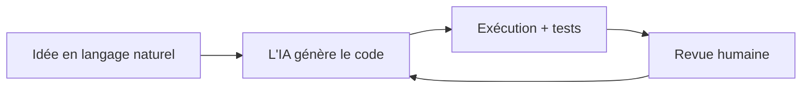
```mermaid
graph LR
    A[Idée en langage naturel] --> B[L'IA génère le code]
    B --> C[Exécution + tests]
    C --> D[Revue humaine]
    D --> B
```

> Curriculum : `GenAI/Vibe-Coding/`

---

# Vibe coding en pratique

- **Outils** : Claude Code, GitHub Copilot, Cursor, Windsurf
- **Bonnes pratiques**
  - `CLAUDE.md` : documenter le contexte et les règles du projet
  - Agents et skills spécialisés : déléguer les tâches répétitives
  - Itération serrée : petites tâches, vérification continue
- **Notre infrastructure** : un cluster d'agents (coordinateur + workers) qui
  explorent, produisent, reviewent et fusionnent des PRs

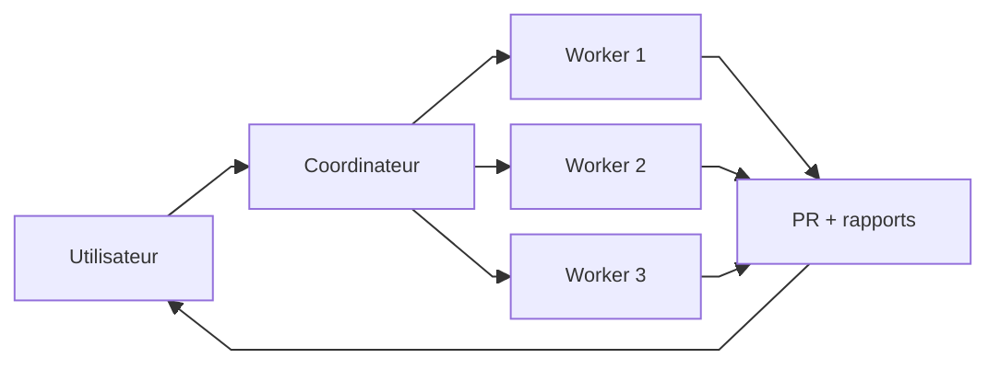
```mermaid
%%{init: {"flowchart": {"nodeSpacing": 14, "rankSpacing": 20, "curve": "linear"}, "themeVariables": {"fontSize": "11px"}}}%%
graph LR
    U[Utilisateur] --> C[Coordinateur]
    C --> W1[Worker 1]
    C --> W2[Worker 2]
    C --> W3[Worker 3]
    W1 --> R[PR + rapports]
    W2 --> R
    W3 --> R
    R --> U
```

Ce qui fait tenir l'ensemble n'est pas la puissance des modèles, mais la <b>structure</b> :
des rôles séparés, un périmètre écrit pour chacun, et une <b>revue obligatoire</b> avant
intégration. Les mêmes mécanismes qu'une organisation emploie pour déléguer sans perdre
le contrôle — et ils échouent ici pour les mêmes raisons : périmètre flou, revue de complaisance.

> Curriculum : `GenAI/Vibe-Coding/Claude-Code/`

---

# Adapter un modèle de fondation

- Un modèle de fondation est générique : on l'**adapte** à un domaine
- **Fine-tuning** : ré-entraînement supervisé sur des données spécialisées
- **LoRA** : n'adapter qu'un petit nombre de paramètres (économie de calcul)
- **Quantization** (INT4, FP8) : réduire la mémoire pour l'inférence
- **DPO / RLHF** : aligner le comportement sur des préférences humaines

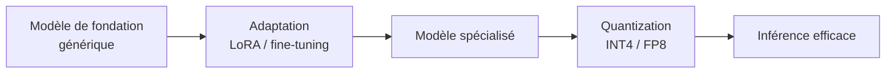
```mermaid
graph LR
    A[Modèle de fondation<br/>générique] --> B[Adaptation<br/>LoRA / fine-tuning]
    B --> C[Modèle spécialisé]
    C --> D[Quantization<br/>INT4 / FP8]
    D --> E[Inférence efficace]
```

> Notebooks : `GenAI/PostTraining/`, `GenAI/FineTuning/`

---

# Notre stack GenAI (self-hosted)

- Services Docker dédiés, orchestrés et validés sur nos machines
  - **ComfyUI** : workflows de génération d'images
  - **Qwen / Lumina / Z-Image** : modèles de fondation open-source
  - **Open-WebUI** : interface conversationnelle
- GPU avec allocation et idle management (quantization par service)
- La même stack alimente les notebooks `GenAI/{Image,Audio,Video}`

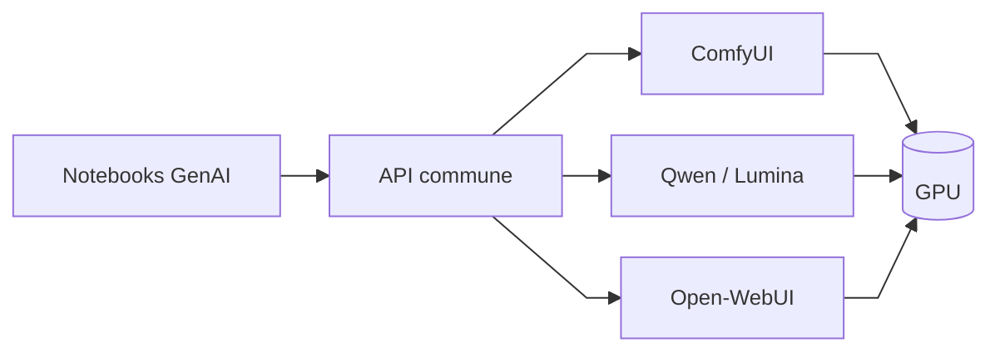
```mermaid
%%{init: {"flowchart": {"nodeSpacing": 25, "rankSpacing": 30, "curve": "linear"}, "themeVariables": {"fontSize": "13px"}}}%%
graph LR
    A[Notebooks GenAI] --> B[API commune]
    B --> C[ComfyUI]
    B --> D[Qwen / Lumina]
    B --> E[Open-WebUI]
    C --> F[(GPU)]
    D --> F
    E --> F
```

> Référence : `docs/genai/genai-services.md`

---
layout: section
---

# Retour d'expérience : une organisation d'agents

- Ce que change le passage de l'assistant à l'atelier
- L'organisation, les règles, les garde-fous
- Ce qui marche, ce qui ne marche pas

---

# De l'assistant à l'atelier

**L'assistant** : on pose une question, il répond. La valeur s'arrête quand on
ferme la fenêtre.

**L'atelier** : plusieurs agents travaillent en continu sur un dépôt, chacun
produit un livrable **relisable** (une *pull request*), un coordinateur relit et
intègre.

**Le dépôt, au 17 août 2026**

| | |
|---|---|
| Contributions intégrées | **9 192** |
| Commits | **11 383** |
| Notebooks pédagogiques | **1 040** |
| Machines hébergeant des agents | **5** |
| Postes de travail (« lanes ») | **10** |

**Le rythme récent**

| | |
|---|---|
| Contributions / 30 jours | **3 464** |
| Contributions / 7 jours | **885** |
| Contributions / 24 h | **181** |

> Toutes tailles confondues : du correctif d'une ligne à la preuve formelle.
> Le chiffre qui compte n'est pas le volume, c'est qu'**aucune n'entre sans
> relecture**.

---

# L'organisation, trait pour trait

Le parallèle avec une entreprise n'est pas une métaphore : ce sont les mêmes
problèmes, et ils se résolvent avec les mêmes objets.

| Dans l'atelier d'agents | Dans une organisation |
|---|---|
| Un **coordinateur** distribue le travail et intègre | Direction / chef de projet |
| Des **spécialistes** par domaine (21 profils) | Métiers |
| Une **file de travail** par poste, jamais vide | Plan de charge |
| Un **jeton de réservation** posé sur la tâche | « Qui fait quoi » — anti-doublon |
| Une **revue obligatoire** avant intégration | Contrôle, double signature |
| Des **règles écrites** plutôt que des consignes orales | Procédures |

Aucun de ces objets n'a été conçu pour l'IA : ce sont ceux d'une direction
des opérations, transposés tels quels.

---

# L'organisation, à l'échelle

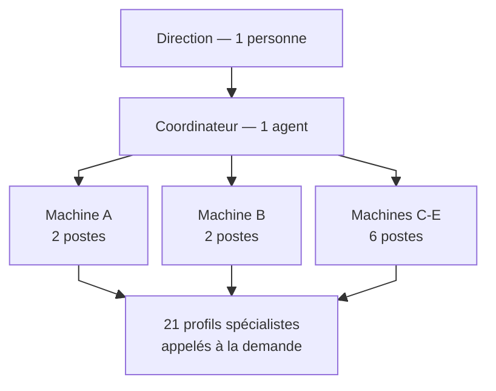
```mermaid
%%{init: {"flowchart": {"nodeSpacing": 12, "rankSpacing": 26, "curve": "linear"}, "themeVariables": {"fontSize": "12px"}}}%%
graph TD
    H["Direction — 1 personne"] --> C["Coordinateur — 1 agent"]
    C --> M1["Machine A<br/>2 postes"]
    C --> M2["Machine B<br/>2 postes"]
    C --> M3["Machines C-E<br/>6 postes"]
    M1 --> S["21 profils spécialistes<br/>appelés à la demande"]
    M2 --> S
    M3 --> S
```

| Niveau | Effectif | Disponibilité |
|---|---|---|
| Direction, arbitrage | **1 personne** | 1-2 h / jour |
| Coordination | **1 agent** | continue |
| Production | **10 postes** | continue |
| Spécialistes | **21 profils** | à la demande |

<b>5 machines</b>, 2 périmètres de travail chacune :
un poste = une machine × un périmètre.

Le chiffre à retenir n'est pas « 10 postes » : c'est le <b>rapport</b>. Une personne, une
à deux heures par jour d'arbitrage, tient une structure qui produit en continu. Ce n'est
pas un remplacement d'ETP — c'est un <b>changement de ce que fait l'ETP</b> : elle ne
produit plus, elle décide et elle relit.

---

# Quel agent, quel outil, pour quelle tâche

Un **seul** outil d'agent — *Claude Code*, celui déjà cité plus haut — décliné en **profils**.
Ce qui les distingue n'est pas le modèle : c'est le **jeu d'outils** que chacun reçoit.

| Profil | Les outils qu'il reçoit | Sa tâche |
|---|---|---|
| Exploration | lecture et recherche, **pas d'écriture** | Retrouver où vit une notion, sans rien modifier |
| Rédaction pédagogique | édition de *notebooks* | Écrire cours et exercices |
| Exécution | noyau Jupyter, Papermill | Faire tourner le cours et **capturer les sorties réelles** |
| Preuve formelle | Lean 4 / Lake | Vérifier un théorème, mesurer la dette de preuve |
| Entraînement | GPU, PyTorch, validation *walk-forward* | Entraîner et **falsifier** un modèle |
| Marchés | API QuantConnect | Lancer un *backtest*, relever Sharpe / drawdown |
| Génération d'images | ComfyUI + modèles auto-hébergés | Produire les illustrations du cours |
| Relecture visuelle | rendu de planches + vision | Vérifier qu'une planche ne déborde pas |
| Contrôle | tests, *build* — et le droit de **refuser** | Refuser ce qui ne passe pas |

Un agent n'est pas « une IA » : c'est un <b>périmètre écrit</b> plus un <b>jeu d'outils
restreint</b>. Celui qui explore n'a pas le droit d'écrire ; celui qui exécute n'a pas le
droit de fusionner. La séparation des pouvoirs y fait le même travail que dans une
organisation — et elle est <b>plus facile à tenir</b>, parce qu'elle est déclarée dans un
fichier plutôt que rappelée en réunion.

---

# Le circuit d'une contribution

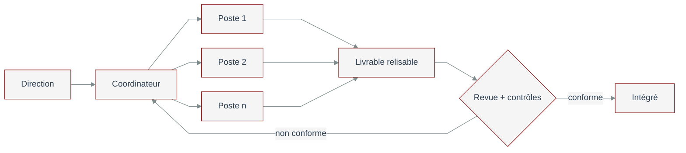
```mermaid
%%{init: {"theme": "base", "themeVariables": {"primaryColor": "#F5F5F5", "primaryTextColor": "#2C3E50", "primaryBorderColor": "#8B1A1A", "lineColor": "#7F8C8D", "fontSize": "15px", "fontFamily": "Segoe UI, Calibri, Arial, sans-serif"}, "flowchart": {"nodeSpacing": 26, "rankSpacing": 44, "curve": "linear"}}}%%
graph LR
    D[Direction] --> C[Coordinateur]
    C --> L1[Poste 1]
    C --> L2[Poste 2]
    C --> L3[Poste n]
    L1 --> P[Livrable relisable]
    L2 --> P
    L3 --> P
    P --> G{Revue + contrôles}
    G -->|conforme| M[Intégré]
    G -->|non conforme| C
```

Le **retour en arrière** est le trait décisif : une contribution non conforme
ne bloque personne, elle revient au poste qui l'a produite.

> Le jeton de réservation est né d'un incident : deux postes irréprochables ont
> livré **deux fois le même travail**. Ce n'était pas une faute d'exécution,
> c'était un **défaut de signal**.

---

# Écrire la règle plutôt que rappeler la consigne

Une leçon transposable telle quelle au management.

**Ce qui ne tient pas** : redire la consigne. Un agent — comme une équipe —
finit par contourner une règle qui n'est portée que par la vigilance.

**Ce qui tient** : un **organe** qui rend le manquement visible et bloquant.

**Exemples vécus**

- « Ne jamais intégrer une remarque non traitée » → un contrôle qui refuse
  l'intégration tant que la remarque n'a pas reçu **une phrase** de réponse
- « Varier le travail » → un compteur qui plafonne les tâches faciles
- « Ne pas se marcher dessus » → le jeton de réservation

**La formulation qui a émergé**

> Une règle non appliquée demande un **organe**,
> pas davantage de vigilance.

Et son corollaire, plus dur à admettre :

> Un commit poussé après une remarque ne la lève pas.
> Ce qui lève une remarque, c'est **une phrase**.

> Un harnais de règles écrit, chargé automatiquement à chaque session — la
> plupart immédiatement, certaines à la demande selon le contexte. La
> documentation qui n'est pas chargée n'existe pas.

---

# Les garde-fous : on ne fusionne pas sur parole

**93 contrôles automatiques** s'exécutent sur chaque contribution. Ils ne
vérifient pas l'intention, ils vérifient le **livrable** :

- le notebook s'exécute-t-il vraiment de bout en bout ?
- la preuve formelle compile-t-elle, sans trou masqué ?
- le résultat annoncé est-il reproductible sur plusieurs tirages ?
- la contribution fait-elle **ce que son titre annonce**, rien de plus ?

**Le revers, mesuré aujourd'hui même.** Le contrôle unique qui protège la
branche principale a, pendant plusieurs heures, bloqué **78 contributions
saines** : le mécanisme censé le débloquer publiait un second verdict sous le
**même nom**, et la plateforme exige que **tous** les verdicts homonymes soient
au vert. Le sauvetage ne pouvait qu'ajouter une façon d'échouer.

> Un garde-fou est un actif **et** un risque d'exploitation. Celui-ci a été
> diagnostiqué en une requête — parce qu'il était instrumenté. Sans mesure, il
> serait passé pour « la file d'attente est saturée », et on aurait attendu.

---

# Ce qui ne marche pas

Le retour d'expérience utile n'est pas la liste des réussites.

**1. L'affirmation confiante et fausse.** Un agent annonce volontiers « fait,
vérifié ». Le remède n'est pas la défiance, c'est l'**exigence de preuve
citée** : le numéro de ligne, la sortie de commande, le lien vers l'exécution.

**2. L'instrument qui répond « rien trouvé » quand il veut dire « je n'ai pas
regardé ».** Neuf fois en une seule session de travail, une mesure a rendu un
chiffre **plus petit et plus propre que la vérité** — donc rassurant. C'est le
mode de panne le plus dangereux, parce qu'il ne lève aucune alerte.

**3. La monoculture du facile.** Laissée libre, une équipe d'agents converge
vers les tâches courtes et sûres, et le travail de fond ne sort jamais. Il a
fallu un quota explicite.

**4. Le coût de coordination est réel.** Il croît plus vite que le nombre
d'agents. Au-delà d'une dizaine de postes, ce n'est plus l'IA qu'on optimise,
c'est l'organisation.

> Aucun de ces quatre points n'est propre à l'IA. Ce sont des pathologies
> d'organisation, que l'IA rend simplement **plus rapides**.

---

# Ce qu'un comité de direction peut en retenir

**1. Le gain n'est pas la génération, c'est le débit relu.** Produire du texte
ou du code est devenu gratuit ; ce qui reste cher, c'est de **savoir ce qu'on
peut intégrer**. Investir dans la relecture automatisée, pas dans la génération.

**2. La vérification doit être mécanique.** Tout ce qui repose sur la vigilance
d'une personne finit par céder sous le volume. Ce qui est vérifié par un
programme tient.

**3. Ce qui n'est pas mesuré n'est pas su.** Les deux incidents les plus coûteux
de ce projet ont été des mesures fausses, pas des décisions fausses.

**4. L'organisation est le facteur limitant, pas le modèle.** Les modèles
progressent seuls ; la distribution du travail, la non-duplication et le
contrôle qualité, non.

**5. Commencer par un périmètre où l'erreur est rattrapable.** Un dépôt de code
a une propriété rare : tout y est réversible et tracé. Peu de processus
d'entreprise offrent ce filet — c'est le premier critère de choix d'un pilote.

> Un atelier d'agents ne remplace pas une équipe. Il déplace le travail de
> l'exécution vers la **spécification** et le **contrôle** — les deux endroits où
> une direction a le plus à dire.

---

# Enjeux : hallucinations, alignement, régulation

- **Hallucinations** : un LLM peut affirmer avec assurance une chose fausse
  - Atténuation : RAG, vérification, raisonnement pas à pas
- **Alignement** : s'assurer que le modèle suit l'intention humaine
  - RLHF, DPO, garde-fous, supervision
- **Régulation** : l'AI Act européen encadre les usages à risque
  - Transparence, documentation, obligations pour l'IA généraliste
- **Sécurité** : les clés et secrets vivent dans des fichiers protégés,
  jamais dans le code, les prompts ou les sorties

> Un outil puissant appelle une utilisation **responsable**

---

# Ce qui est un vrai risque — et ce qui n'en est pas un

### Surestimé

- **Le remplacement.** Le goulot n'est pas la production, c'est la **relecture** — écrire dix fois plus réclame plus de relecteurs, pas moins.
- **L'autonomie du modèle.** Ni intention, ni mémoire entre deux appels. Le risque n'est pas qu'il décide : c'est qu'on le **laisse** décider sans vérifier.
- **L'hallucination comme fatalité.** Risque d'ingénierie, mesurable — atténué par le périmètre fermé, la source citée, la vérification.

### Sous-estimé

- **La fuite ordinaire.** Pas l'attaque : la pièce de dossier collée dans un service public gratuit. Premier risque réel, et **déjà là**.
- **La dépendance non arbitrée.** Un processus qui ne sait plus fonctionner sans le modèle — sans que personne l'ait décidé.
- **Le biais qui se durcit.** Appris sur l'historique, il reproduit la sélection passée. En souscription : discrimination indirecte, **opposable**.
- **L'absence de trace.** L'AI Act demande de documenter ; ce qui n'est pas tracé dès le pilote ne se reconstitue pas.

Le partage utile n'est pas « risqué / pas risqué » : c'est **rattrapable / irrattrapable**.

---

# Où la valeur se trouve — et où elle ne se trouve pas encore

### Mûr aujourd'hui
*l'erreur se voit, et se corrige*

- **Lire et structurer un document** : constat, pièce, conditions générales
- **Chercher dans un corpus fermé**, réponse rattachée à sa source
- **Pré-rédiger sous contrôle** : courrier, compte rendu, synthèse de dossier
- **Assister l'analyse** : code, données, exploration d'un portefeuille

### Pas encore
*l'erreur est silencieuse*

- **La décision autonome** sur un dossier
- **Le chiffre non vérifié.** Un modèle de langage ne calcule pas : il complète. Tarification et provisionnement passent par un **outil de calcul** qu'on appelle — jamais par le modèle lui-même.
- **Le jugement en zone grise**, là où la règle ne tranche pas et où c'est précisément le métier qui tranche

**L'IA ne remplace pas le métier : elle réorganise le travail autour de lui.** Une nuance, et elle compte devant des actuaires — elle n'automatise pas le **calcul**, elle automatise ce qui l'entoure.

---

# Pour aller plus loin : Notebooks

Ce deck couvre tous les domaines de l'IA. Pour approfondir avec des exemples pratiques :

> **GenAI - IA Générative**
> `MyIA.AI.Notebooks/GenAI/`
> Transformers, diffusion, LLMs, génération d'images, audio, vidéo
> `GenAI/Vibe-Coding/` : programmation par intention (Claude Code)

> **Search - Recherche et Optimisation**
> `MyIA.AI.Notebooks/Search/`
> Algorithmes génétiques, A*, optimisation locale

> **ML - Machine Learning**
> `MyIA.AI.Notebooks/ML/`
> ML.NET, arbres de décision, classification, régression

> **SymbolicAI - IA Symbolique**
> `MyIA.AI.Notebooks/SymbolicAI/`
> RDF, Z3 SMT, Tweety, Lean, ontologies, web sémantique

> **Probas - Modèles Probabilistes**
> `MyIA.AI.Notebooks/Probas/`
> Infer.NET, réseaux bayésiens, inférence probabiliste

> **GameTheory - Théorie des Jeux**
> `MyIA.AI.Notebooks/GameTheory/`
> OpenSpiel, équilibres de Nash, jeux stratégiques

---
layout: end
---

# Merci

Jean-Sylvain Boige
jsboige@myia.org
