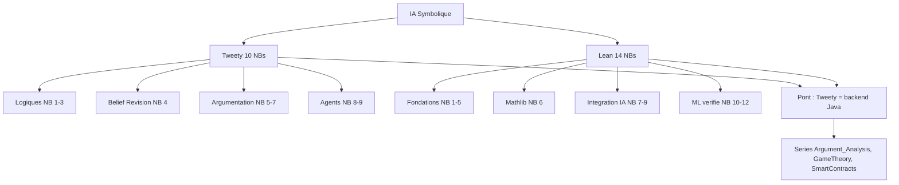

# IA Symbolique

Logiques formelles, argumentation, theorem proving, verification

**EPITA SCIA 2026** — Series SymbolicAI / Tweety + Lean

24 notebooks Jupyter • ~18h de contenu interactif

---
layout: section
---

# Introduction (10 min)

---

# Pourquoi l'IA symbolique en 2026 ?

**Renaissance de l'IA symbolique** : alors que les LLM dominent l'IA generative, l'IA symbolique reste **indispensable** pour :

- **Verification formelle** : preuves de correction (preuves Lean, SAT/SMT)
- **Garantie de comportement** : reseaux de neurones verifies (TorchLean)
- **Raisonnement explicable** : argumentation structuree (ASPIC+, ABA)
- **Theoremes mathematiques** : AlphaProof (DeepMind 2024), APOLLO (2025)
- **Decisions multi-agents** : votes, dialogues argumentatifs

**Convergence neural + symbolic** :
- LeanCopilot, AlphaProof : LLM **+** Lean prover
- LeanDojo (NeurIPS 2023) : RAG sur Mathlib
- APOLLO : 99.5% miniF2F

---

# Cartographie des 24 notebooks



**Total** : ~18 heures de contenu interactif (7h Tweety + 11h Lean).

---

# Plan de la presentation

| Partie | Duree | Contenu |
|--------|-------|---------|
| **I. TweetyProject** | 30 min | 10 notebooks Java/Python — argumentation et logiques |
| **II. Lean 4** | 40 min | 14 notebooks — verification formelle et integration IA |
| **III. Convergence** | 15 min | LLM + provers, ponts inter-series |
| **IV. Pratique** | 15 min | Quick start, parcours suggere, projets integrateurs |

**Approche** : passer de l'abstraction (logiques formelles) au concret (verification de reseaux de neurones, theoremes mathematiques).

---
layout: section
---

# I. TweetyProject (30 min)

---

# Qu'est-ce que TweetyProject ?

**TweetyProject** : bibliotheque Java open-source pour l'IA symbolique.

- **35 modules** couvrant logiques formelles et argumentation computationnelle
- Developpe a l'Universite de Hagen (Matthias Thimm et al.)
- Reference : [tweetyproject.org](https://tweetyproject.org/)

**Integration Python** via **JPype** :

```python
import jpype
jpype.startJVM(classpath=["libs/*"])
PlBeliefSet = jpype.JClass("org.tweetyproject.logics.pl.syntax.PlBeliefSet")
```

JDK 17 + 35 JARs telecharges automatiquement par le notebook de setup. Aucune installation systeme requise.

---

# Tweety — cartographie des notebooks

| # | Notebook | Theme | Duree |
|---|----------|-------|-------|
| 1 | Setup | JVM, JARs, outils externes | 20 min |
| 2 | Basic-Logics | Propositionnelle, FOL | 45 min |
| 3 | Advanced-Logics | DL, Modale, QBF, Conditionnelle | 40 min |
| 4 | Belief-Revision | MUS, MaxSAT, incoherence | 50 min |
| 5 | Abstract-Argumentation | Dung AF, semantiques, CF2 | 55 min |
| 6 | Structured-Argumentation | ASPIC+, DeLP, ABA, ASP | 60 min |
| 7a | Extended-Frameworks | ADF, Bipolar, WAF, SAF | 50 min |
| 7b | Ranking-Probabilistic | Ranking, probabiliste | 40 min |
| 8 | Agent-Dialogues | Dialogues, loteries | 35 min |
| 9 | Preferences | Vote, agregation | 30 min |

---

# Notebooks 2-3 — Logiques formelles

**Logique Propositionnelle (`logics.pl`)** :

```python
parser = PlParser()
kb = parser.parseBeliefBase("a && b\n!a || c")
reasoner = SatReasoner()
result = reasoner.query(kb, parser.parseFormula("c"))
```

**Logiques avancees** :

| Logique | Module | Solveur |
|---------|--------|---------|
| **DL** (Description) | `logics.dl` | HermiT, Pellet |
| **Modale** (ML) | `logics.ml` | SPASS-XDB |
| **QBF** | `logics.qbf` | DepQBF, CAQE |
| **FOL** | `logics.fol` | EProver |
| **Conditionnelle** | `logics.cl` | ranking-based |

---

# Notebook 4 — Revision AGM et MUS

**Postulats AGM** (Alchourron-Gardenfors-Makinson, 1985) :

| Operation | Notation | Effet |
|-----------|----------|-------|
| Expansion | K + α | Ajoute α sans verification |
| Contraction | K - α | Retire α et ses consequences |
| Revision | K * α | Integre α en maintenant la coherence |

**Diagnostic d'incoherence** :
- **MUS** : Minimal Unsatisfiable Subsets
- **MCS** : Minimal Correction Subsets
- **Dualite** : `MUS = hitting set minimal de MCS`

**Mesures** : `MI`, `eta`, `Contention`, `MUS-count`. Outils : MARCO (Z3), MaxSAT (PySAT).

---

# Notebook 5 — Frameworks de Dung

**Definition** : `AF = (A, R)` graphe oriente arguments + relation d'attaque.

**Semantiques** :

| Semantique | Definition |
|------------|------------|
| **Conflict-free** | Aucun argument n'attaque un autre dans le set |
| **Admissible** | Conflict-free + defend ses membres |
| **Complete** | Admissible + contient tous les arguments defendus |
| **Grounded** | Plus petite complete (skeptique) |
| **Preferred** | Maximale parmi les admissibles |
| **Stable** | Conflict-free + attaque tout le reste |
| **Semi-stable** | Preferred maximisant le range |
| **CF2** | Recursif sur SCC |

Reference : Dung, *"On the Acceptability of Arguments"*, AIJ 1995.

---

# Notebook 6 — Argumentation structuree

**ASPIC+** (Modgil & Prakken, 2014) : arguments comme arbres de derivation.

```python
theory = AspicArgumentationTheory(parser)
theory.addAxiom(formula)
theory.addRule(rule_d, premises, conclusion)
af = theory.asDungTheory()
```

**Frameworks complementaires** :
- **DeLP** (Garcia & Simari) : Defeasible Logic Programming
- **ABA** (Bondarenko et al.) : Assumption-Based Argumentation
- **ASP** via **Clingo** : metaprogrammation argumentation

```
% ASP : reachability
reach(X, X) :- node(X).
reach(X, Y) :- reach(X, Z), edge(Z, Y).
```

---

# Notebooks 7a-7b — Frameworks etendus

**Frameworks generalises** :

| Framework | Extension |
|-----------|-----------|
| **ADF** | Acceptance conditions arbitraires |
| **Bipolar** | Attack + Support |
| **Weighted (WAF)** | Poids sur les attaques |
| **SetAF** | Attaques collectives (sets → arg) |
| **Extended** | Attaques recursives |

**Ranking et probabilistic** (7b) :
- Ranking semantics : Categoriser, Burden, Discussion, h-Categorizer
- Probabilistic : constellation approach, epistemic approach

---

# Notebooks 8-9 — Agents et preferences

**Dialogues argumentatifs** (Walton & Krabbe, 1995) :
- **Persuasion** : convaincre
- **Negotiation** : trouver un accord
- **Information-seeking** : obtenir une donnee
- **Inquiry** : decouvrir la verite
- **Deliberation** : decider d'une action

**Theorie sociale du choix** :
- Theoreme d'Arrow (1951) : impossibilite
- Regles : Plurality, Borda, Condorcet, Copeland, STV
- Lien serie GameTheory : port Lean d'Arrow dans `social_choice_lean/`

---
layout: section
---

# II. Lean 4 (40 min)

---

# Qu'est-ce que Lean 4 ?

**Lean 4** : assistant de preuves et langage de programmation fonctionnel base sur la **theorie des types dependants**.

- Successeur de Lean 3, reecriture complete (2021)
- Auteur principal : Leonardo de Moura (Microsoft Research, AWS)
- Compile vers C, performance native
- Ecosysteme : **Mathlib4** (~1M+ lignes de math formelle)

**Pourquoi Lean 4 maintenant ?**
- 2023-2024 : Polynomial Freiman-Ruzsa, Liquid Tensor Experiment
- 2024-2025 : integration LLM (AlphaProof, LeanCopilot, LeanDojo)
- 2025-2026 : agents autonomes (APOLLO, Erdos problems)

Reference : de Moura & Ullrich, *"The Lean 4 Theorem Prover and Programming Language"* (CADE 2021).

---

# Lean — cartographie des notebooks

| # | Notebook | Theme | Duree |
|---|----------|-------|-------|
| 1 | Setup | elan, kernel Jupyter | 15 min |
| 2 | Dependent-Types | Calcul des Constructions | 35 min |
| 3 | Propositions-Proofs | Prop, Curry-Howard | 45 min |
| 4 | Quantifiers | forall, exists, egalite | 40 min |
| 5 | Tactics | apply/exact/intro/rw/simp | 50 min |
| 6 | Mathlib-Essentials | ring/linarith/omega | 45 min |
| 7 | LLM-Integration | LeanCopilot, AlphaProof | 50 min |
| 7b | Examples | Benchmarks miniF2F, proofnet | 40 min |
| 8 | Agentic-Proving | APOLLO, Erdos | 55 min |
| 9 | SK-Multi-Agents | Agent Framework | 45 min |
| 10 | LeanDojo | Tracing, Dojo interactif | 45 min |
| 11/11a | TorchLean | NN verifies, IBP, CROWN | 1h30-2h |
| 12 | Sensitivity-Theorem | Huang 2019, port Lean | 60 min |

---

# Modes d'execution suggeres

| Mode | Notebooks | Temps |
|------|-----------|-------|
| **Fondations** | 1-5 | ~3h |
| **Avec Mathlib** | 1-6 | ~3h45 |
| **Integration IA** | 1-7, 7b | ~5h |
| **Complet** | 1-12 | ~11h |

**Architecture pedagogique** :
- Notebooks **1-5** : bases sur PDF de reference (Avigad, *Theorem Proving in Lean 4*)
- Notebooks **6-12** : etat de l'art 2024-2026

---

# Notebooks 1-5 — Fondations

**Curry-Howard** : `Propositions ≅ Types`, `Preuves ≅ Programmes`.

```lean
-- And introduction
theorem and_comm (p q : Prop) : p ∧ q → q ∧ p :=
  fun ⟨hp, hq⟩ => ⟨hq, hp⟩

-- Universal
theorem forall_and (p q : α → Prop) :
    (∀ x, p x ∧ q x) ↔ (∀ x, p x) ∧ (∀ x, q x) :=
  ⟨fun h => ⟨fun x => (h x).1, fun x => (h x).2⟩,
   fun ⟨hp, hq⟩ x => ⟨hp x, hq x⟩⟩

-- Induction tactique
theorem zero_add (n : Nat) : 0 + n = n := by
  induction n with
  | zero => rfl
  | succ k ih => simp [Nat.add_succ, ih]
```

---

# Tactiques essentielles

| Tactique | Usage |
|----------|-------|
| `intro` | Introduit une hypothese |
| `exact` | Fournit un terme exact |
| `apply` | Applique un lemme (back-chaining) |
| `rw` | Reecrit avec une egalite |
| `simp` | Simplifie avec lemmes marques `@[simp]` |
| `omega` | Arithmetique lineaire Nat/Int |
| `linarith` | Ordres lineaires reels |
| `ring` | Anneaux commutatifs |
| `decide` | Decide une proposition decidable |

```lean
example (a b : Nat) (h : a = b) : a + 1 = b + 1 := by
  rw [h]
```

---

# Notebook 6 — Mathlib4

**Mathlib4** : ~1M+ lignes, ~150,000 theoremes.

```lean
import Mathlib

-- ring
example (a b : ℝ) : (a + b)^2 = a^2 + 2*a*b + b^2 := by ring

-- linarith
example (x y : ℝ) (h1 : x ≤ y) (h2 : y ≤ 5) : x ≤ 5 := by linarith

-- omega
example (n : Nat) : n + 0 = n ∧ n * 1 = n := by omega

-- polyrith (SMT-based)
example (a b : ℝ) : a^2 - b^2 = (a-b)*(a+b) := by polyrith
```

**Recherche** : **Loogle** (syntaxique), **Moogle** (semantique).

---

# Notebooks 7-9 — Integration IA

**LeanCopilot** : LLM in-editor.

```lean
import LeanCopilot

example (a b : Nat) : a + b = b + a := by
  suggest_tactics  -- LLM propose: exact Nat.add_comm a b
```

**AlphaProof** (DeepMind, 2024) : IMO 2024 silver-medal equivalent.

**APOLLO** (Yang et al., 2025) :
- Agent autonome multi-agents : Director / Tactician / Verifier / Critic
- 99.5% sur miniF2F (vs 85% AlphaProof)
- Problemes Erdos en cours de formalisation

**Microsoft Agent Framework** (Notebook 9) : orchestration sequentielle, concurrente, group chat, handoff.

---

# Notebooks 10-12 — ML verifie

**LeanDojo** (Yang et al., NeurIPS 2023) :

```python
from lean_dojo import LeanGitRepo, trace, Dojo

repo = LeanGitRepo("https://github.com/leanprover/mathlib4", "v4.x")
traced = trace(repo)

with Dojo(theorem) as dojo:
    state = dojo.init_state
    new_state, result = dojo.run_tac(state, "intro h")
```

**TorchLean** — verification de NN :

| Methode | Complexite | Precision |
|---------|------------|-----------|
| **IBP** (Interval Bound Propagation) | O(n) | Faible |
| **CROWN** (Linear Relaxation) | O(n^2) | Moyenne |
| **LiRPA** (per Activation) | O(n^2) | Eleve |
| **MILP** (exact) | NP-hard | Exact |

---

# Notebook 12 — Theoreme de sensibilite

**Huang (2019)** : reponse au probleme de sensibilite (ouvert depuis 1988).

> Pour toute fonction booleenne `f : {0,1}^n → {0,1}`, sensibilite `s(f)` et degre `deg(f)` sont polynomialement equivalents : `deg(f) ≤ s(f)^4`.

**Outils** :
- Hypercube `{0,1}^n`
- Signing matrix `A_n` (recursive, eigenvalues ±√n)
- Cauchy interlacing

**Port Lean 4** (en cours) :

```lean
-- sensitivity_lean/Sensitivity.lean
theorem sensitivity_theorem (n : ℕ) (f : (Fin n → Bool) → Bool) :
    deg f ≤ (s f) ^ 4 := by
  sorry  -- port Lean en cours
```

Reference : Huang, *Induced subgraphs of hypercubes and a proof of the Sensitivity Conjecture* (Ann. of Math., 2019).

---
layout: section
---

# III. Convergence neural + symbolic (15 min)

---

# Percees recentes (2024-2026)

| Annee | Systeme | Accomplissement |
|-------|---------|------------------|
| 2023 | **LeanDojo** | RAG ReProver, NeurIPS 2023 |
| 2024 | **AlphaProof** | IMO 2024 silver-medal |
| 2025 | **APOLLO** | 99.5% miniF2F |
| 2025 | **Erdos problems** | Projet de formalisation collective |
| 2025 | **TweetyProject 1.29** | arg.eaf (Epistemic AF) |
| 2025 | **MetaMath-Lean** | Cross-formalization |
| 2026 | **AlphaProof v2** | Gold-medal predicte |

**Mathematiques formelles 2025** :
- Polynomial Freiman-Ruzsa (Tao, Gowers et al., 2023)
- Liquid Tensor Experiment (Scholze, 2022)
- Sphere Packing 8D (Viazovska, en cours)

---

# Convergence : argumentation + theorem proving

**Tweety** (raisonnement argumentatif Java) :
- Logiques **PL, FOL, DL, Modale, QBF, CL**
- Frameworks **Dung, ASPIC+, ABA, ADF**
- Solveurs **Sat4j, MiniSAT, Lingeling**

**Lean 4** (verification formelle) :
- Tactiques **omega, linarith, ring, polyrith**
- **Mathlib4** (~150k theoremes)
- LLM in-editor : **LeanCopilot, AlphaProof**

**Convergence pratique** :
- Tweety encode des semantiques de Dung en ASP (Clingo)
- Lean **prouve** la correction des algorithmes argumentatifs
- LLMs (GPT-4o, Claude Opus) generent **+** verifient via les deux

---

# Ponts inter-series

| Serie | Connection avec Tweety + Lean |
|-------|--------------------------------|
| **Argument_Analysis** | Tweety = backend Java pour l'analyse de textes argumentatifs |
| **GameTheory** | Notebook 9 Tweety (vote) + `social_choice_lean/` (Arrow, Sen) |
| **SmartContracts** | Verification Solidity (Certora, SMTChecker) — meme stack SAT/SMT |
| **ML** | TorchLean (Lean 11/11a) : verification de NN entraines |
| **Search** | CSP : preuves de correction via Lean |
| **Planners** | Dialogues argumentatifs (Tweety 8) ↔ planification PDDL |

**Slides connexes** :
- S1 — Argumentation (Argumentum card game)
- S2 — IA exploratoire symbolique (contexte historique)
- S3 — Acculturation IA

---
layout: section
---

# IV. Pratique (15 min)

---

# Quick start — Tweety

```bash
# 1. Installer les packages Python
pip install jpype1 requests tqdm clingo z3-solver python-sat

# 2. Ouvrir le notebook de setup (auto-telecharge JDK + JARs)
cd MyIA.AI.Notebooks/SymbolicAI/Tweety
jupyter notebook Tweety-1-Setup.ipynb

# 3. Executer toutes les cellules, puis passer a Tweety-2
```

JDK 17 et 35 JARs telecharges automatiquement. Aucune installation systeme requise.

**Validation rapide** :

```bash
cd scripts
python verify_all_tweety.py --quick
python verify_all_tweety.py --check-env
```

---

# Quick start — Lean 4

```bash
# 1. elan + Lean 4
curl https://raw.githubusercontent.com/leanprover/elan/master/elan-init.sh -sSf | sh
elan default leanprover/lean4:stable

# 2. WSL (Windows) : conda + lean4_jupyter
wsl -d Ubuntu
conda create -n lean4-jupyter python=3.10
conda activate lean4-jupyter
pip install lean4_jupyter

# 3. Lancer le notebook 1
jupyter notebook MyIA.AI.Notebooks/SymbolicAI/Lean/Lean-1-Setup.ipynb
```

**Pour les notebooks LLM** (7-10) : configurer `.env` avec `OPENAI_API_KEY` ou `ANTHROPIC_API_KEY`.

**WSL obligatoire sous Windows** (cf [.claude/rules/wsl-kernels.md](../../.claude/rules/wsl-kernels.md)).

---

# Parcours suggere

**Decouverte (5h)** :
- Tweety 1 + 2 + 5 (logiques + Dung)
- Lean 1 + 2 + 3 + 5 (types + tactiques)

**Approfondissement (10h)** :
- Tweety 3 + 4 + 6 (logiques avancees + revision + ASPIC+)
- Lean 4 + 6 + 7 (quantificateurs + Mathlib + LLM)

**Specialisation IA (8h)** :
- Lean 8 + 9 + 10 (APOLLO + Multi-Agents + LeanDojo)
- Tweety 7a + 7b + 8 + 9 (extended + ranking + agents)

**Projet integrateur** :
- Choisir un theoreme classique (Cauchy-Schwarz, Borda paradox)
- Modeliser argumentativement (Tweety) **et** prouver formellement (Lean)
- Implementer un agent dialogique qui consulte Lean

---

# References academiques

**Tweety** :
- Dung (1995) — *Acceptability of Arguments*, AIJ
- Modgil & Prakken (2014) — ASPIC+
- AGM (1985) — *Logic of Theory Change*
- Brewka, Eiter & Truszczynski (2011) — ASP
- Besnard & Hunter (2008) — *Elements of Argumentation*
- Walton & Krabbe (1995) — typologie dialogues

**Lean** :
- de Moura & Ullrich (2021) — Lean 4 (CADE)
- Avigad (2024) — *Theorem Proving in Lean 4*
- Yang et al. (NeurIPS 2023) — LeanDojo
- First et al. (2024) — AlphaProof
- Song et al. (2025) — TorchLean IBP/CROWN/LiRPA
- Huang (2019) — Sensitivity theorem (Ann. of Math.)

---

# Outils et solveurs

**Tweety** :

| Outil | Usage | Telechargement |
|-------|-------|----------------|
| **Clingo** | ASP | Auto (Win/Linux) |
| **SPASS** | Modale | Auto Linux / inclus Windows |
| **EProver** | FOL | Inclus dans `ext_tools/` |
| **Z3** | SMT | `pip install z3-solver` |
| **PySAT** | SAT/MaxSAT | `pip install python-sat` |

**Lean** :

| Outil | Role |
|-------|------|
| **elan** | Gestionnaire de versions |
| **lake** | Build system |
| **mathlib4** | Bibliotheque mathematique |
| **LeanCopilot** | LLM in-editor |
| **LeanDojo** | RAG framework Python |
| **TorchLean** | NN verification |

---

# Ressources en ligne

**Tweety** :
- [tweetyproject.org](https://tweetyproject.org/)
- [API Doc](https://tweetyproject.org/api/)
- [GitHub](https://github.com/TweetyProjectTeam/TweetyProject)
- [JPype](https://jpype.readthedocs.io/)

**Lean** :
- [Theorem Proving in Lean 4](https://leanprover.github.io/theorem_proving_in_lean4/)
- [Mathlib4 Docs](https://leanprover-community.github.io/mathlib4_docs/)
- [Loogle](https://loogle.lean-lang.org/) — recherche syntaxique
- [Moogle](https://www.moogle.ai/) — recherche semantique
- [Lean Zulip](https://leanprover.zulipchat.com/)
- [Mathematics in Lean](https://leanprover-community.github.io/mathematics_in_lean/)

---
layout: center
---

# Questions ?

*De l'argumentation formelle aux mathematiques verifiees par IA*

**Vers une convergence neural + symbolic**
