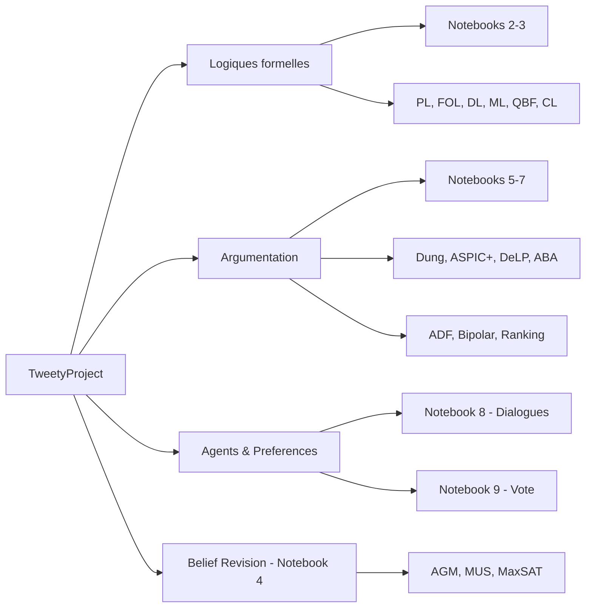

# TweetyProject

10 Notebooks Jupyter — Intelligence Artificielle Symbolique

**EPITA SCIA 2026** — Serie SymbolicAI / Tweety

Logiques formelles • Argumentation • Revision de croyances • Agents

---
layout: section
---

# Vue d'ensemble (10 min)

---

# Qu'est-ce que TweetyProject ?

**TweetyProject** : bibliotheque Java open-source pour l'IA symbolique.

- **35 modules** couvrant logiques formelles et argumentation computationnelle
- Developpe a l'Universite de Hagen (Matthias Thimm et al.)
- Reference : [tweetyproject.org](https://tweetyproject.org/)

**Integration Python** via **JPype** :

```python
import jpype
jpype.startJVM(classpath=["libs/*"])
PlBeliefSet = jpype.JClass("org.tweetyproject.logics.pl.syntax.PlBeliefSet")
```

JDK 17 + 35 JARs telecharges automatiquement par le notebook de setup.

---

# Cartographie de la serie

| # | Notebook | Theme | Duree |
|---|----------|-------|-------|
| 1 | Setup | Configuration JVM, JARs, outils externes | 20 min |
| 2 | Basic-Logics | Propositionnelle, FOL | 45 min |
| 3 | Advanced-Logics | DL, Modale, QBF, Conditionnelle | 40 min |
| 4 | Belief-Revision | CrMas, MUS, MaxSAT, incoherence | 50 min |
| 5 | Abstract-Argumentation | Dung AF, semantiques, CF2 | 55 min |
| 6 | Structured-Argumentation | ASPIC+, DeLP, ABA, ASP | 60 min |
| 7a | Extended-Frameworks | ADF, Bipolar, WAF, SAF, SetAF | 50 min |
| 7b | Ranking-Probabilistic | Ranking semantics, probabiliste | 40 min |
| 8 | Agent-Dialogues | Dialogues, loteries | 35 min |
| 9 | Preferences | Vote, agregation | 30 min |

**Total** : ~7 heures de contenu interactif.

---

# Trois grands axes



---
layout: section
---

# Notebook 1 — Setup (20 min)

---

# Notebook 1 — Configuration de l'environnement

**Objectifs :**
- Telecharger JDK 17 portable (Zulu) si absent
- Recuperer 35 JARs TweetyProject (Maven Central)
- Configurer JPype + classpath
- Telecharger outils externes (Clingo, SPASS, EProver)

**Verification :**

```python
from tweety_init import init_tweety
init_tweety()  # Demarre JVM + charge classpath
```

**Limitations connues** (Tweety 1.28/1.29) :
- CrMas/InformationObject : API refactorisee
- SimpleMlReasoner : bloque indefiniment (utiliser SPASS)
- ADF natif SAT : raisonnement incomplet
- FOL avec egalite : Heap space → utiliser EProver

---
layout: section
---

# Notebooks 2-3 — Logiques formelles (85 min)

---

# Notebook 2 — Logiques de base

**Logique Propositionnelle (`logics.pl`) :**

```python
parser = PlParser()
kb = parser.parseBeliefBase("a && b\n!a || c")
reasoner = SatReasoner()
result = reasoner.query(kb, parser.parseFormula("c"))  # True / False
```

**Logique du Premier Ordre (`logics.fol`) :**
- Signatures, predicats, variables, quantificateurs
- Raisonnement via EProver (resolution)
- Skolemization, normalisation prenex

**Concepts** :
- Tableaux semantiques, resolution
- SAT solvers (Sat4j, MiniSAT, Lingeling, Picosat)
- Mesures de satisfiabilite

---

# Notebook 3 — Logiques avancees

| Logique | Module | Solveur recommande |
|---------|--------|---------------------|
| **Description Logic** (DL) | `logics.dl` | HermiT, Pellet (via OWL API) |
| **Modale** (ML) | `logics.ml` | SPASS-XDB |
| **QBF** | `logics.qbf` | DepQBF, CAQE |
| **Conditionnelle** (CL) | `logics.cl` | ranking-based |

**Description Logic** : ALC, SHOIN, SROIQ (OWL DL).

**Logique Modale** : K, T, S4, S5 — operateurs □ et ◇.

**QBF** : ∃x ∀y φ(x, y) — extension de SAT au second ordre.

---
layout: section
---

# Notebook 4 — Revision de croyances (50 min)

---

# Operateurs AGM (Alchourron-Gardenfors-Makinson, 1985)

**Trois operations fondamentales :**

| Operation | Notation | Effet |
|-----------|----------|-------|
| Expansion | K + α | Ajoute α sans verification de coherence |
| Contraction | K - α | Retire α (et ses consequences) |
| Revision | K * α | Integre α en maintenant la coherence |

**Postulats AGM** : 6 postulats pour la revision (cloture, succes, inclusion, vacuite, coherence, extensionalite).

**Tweety** :

```python
RevisionOperator = jpype.JClass("org.tweetyproject.beliefdynamics.AbstractRevisionOperator")
op = LeviIdentity(contractionOp, expansionOp)
new_kb = op.revise(kb, formula)
```

---

# Diagnostic d'incoherence

**MUS** (Minimal Unsatisfiable Subsets) : plus petit ensemble incoherent.

**MCS** (Minimal Correction Subsets) : ce qu'il faut retirer pour restaurer la coherence.

**Dualite** : `MUS = hitting set minimal de MCS`.

**Mesures d'incoherence** :

| Mesure | Idee |
|--------|------|
| `MI` | Nombre d'atomes touches par des MUS |
| `eta` | Distance a la coherence (modeles partiels) |
| `Contention` | Nombre de paires contradictoires |
| `MUS-count` | Nombre de MUS distincts |

**Outils** : MARCO (Z3), MaxSAT (PySAT).

---
layout: section
---

# Notebook 5 — Argumentation abstraite (55 min)

---

# Frameworks de Dung (1995)

**Definition** : un Argumentation Framework est un graphe oriente `AF = (A, R)` ou :
- `A` est un ensemble d'arguments
- `R ⊆ A × A` est la relation d'attaque

**Exemple** :

```
a → b → c
↑       │
└───────┘
```

**Question fondamentale** : quels arguments peuvent etre **acceptes** ?

Reference : Dung, *"On the Acceptability of Arguments and its Fundamental Role in Nonmonotonic Reasoning, Logic Programming and n-Person Games"*, AIJ 1995.

---

# Semantiques de Dung

| Semantique | Definition informelle |
|------------|------------------------|
| **Conflict-free** | Aucun argument n'attaque un autre dans le set |
| **Admissible** | Conflict-free + defend tous ses membres |
| **Complete** | Admissible + contient tous les arguments defendus |
| **Grounded** | Plus petite complete (skeptique) |
| **Preferred** | Maximale parmi les admissibles |
| **Stable** | Conflict-free + attaque tout le reste |
| **Semi-stable** | Preferred maximisant le range |
| **CF2** | Recursif sur SCC (Strongly Connected Components) |

**Tweety** : `DungTheory`, `CompleteReasoner`, `GroundedReasoner`, etc.

---

# Algorithmique des semantiques

**Grounded** (P) :

```python
gr = GroundedReasoner()
extension = gr.getModel(af)  # ensemble unique
```

**Stable / Preferred** (NP / coNP) :
- Resolution via SAT encoding (Caminada, Verheij)
- Tweety utilise `Sat4jSolver` par defaut

**Comparaison** :
- Skeptique vs credulux acceptance
- Inclusion : `grounded ⊆ complete ⊆ preferred`
- `stable ⊆ preferred ⊆ semi-stable`

**Generation aleatoire** d'AFs (notebook 5) : test de scalabilite.

---
layout: section
---

# Notebook 6 — Argumentation structuree (60 min)

---

# ASPIC+ (Modgil & Prakken, 2014)

**Idee** : construire des arguments a partir de regles et de premisses.

**Composants** :
- Knowledge base : `K = K_n ∪ K_p` (axiomes vs ordinaires)
- Rules : `R_s` (strictes) et `R_d` (defaisables)
- Preference ordering sur K et R

**Arguments** : arbres de derivation.

**Attacks** : `undercut`, `rebut`, `undermine`.

**Tweety** :

```python
theory = AspicArgumentationTheory(parser)
theory.addAxiom(formula)
theory.addRule(rule_d, premises, conclusion)
af = theory.asDungTheory()  # reduction vers Dung
```

---

# DeLP et ABA

**Defeasible Logic Programming (DeLP)** :
- Logique de Horn defaisable
- Arguments = arbres de derivation backward-chaining
- Garcia & Simari (2004)

**Assumption-Based Argumentation (ABA)** :
- Bondarenko, Dung, Kowalski, Toni (1997)
- Arguments construits sur **assumptions** revocables
- Contrary mapping : `contrary(a) = b`

**Tweety** :

```python
parser = AbaParser()
theory = parser.parseBeliefBaseFromFile("theory.aba")
reasoner = SimpleAbaReasoner(semantics)
```

---

# Answer Set Programming (ASP)

**Clingo** : solveur ASP de Potassco.

**Programme ASP** :

```
% Reachability dans un graphe
reach(X, X) :- node(X).
reach(X, Y) :- reach(X, Z), edge(Z, Y).

% Negation par defaut
flies(X) :- bird(X), not abnormal(X).
abnormal(X) :- penguin(X).
```

**Tweety** : interface vers Clingo via `lp.asp.solver`.

**Cas d'usage** : metaprogrammation argumentation (codage des semantiques de Dung en ASP).

---
layout: section
---

# Notebooks 7a-7b — Frameworks etendus (90 min)

---

# Frameworks generalises (7a)

| Framework | Extension | Tweety module |
|-----------|-----------|----------------|
| **ADF** | Acceptance conditions arbitraires | `arg.adf` |
| **Bipolar** | Attack + Support | `arg.bipolar` |
| **Weighted (WAF)** | Poids sur les attaques | `arg.weighted` |
| **Social (SAF)** | Vote sur acceptance | `arg.social` |
| **SetAF** | Attaques collectives (sets → arg) | `arg.setaf` |
| **Extended** | Attaques recursives (attaque vers attaque) | `arg.extended` |

**ADF** (Abstract Dialectical Frameworks) :
- Brewka & Woltran (2010)
- Acceptance conditions : `acc(a) = b ∧ ¬c`
- Generalise Dung (rebut = NOT-attaque)

---

# Ranking et probabilistic (7b)

**Ranking semantics** : evaluer la **force** des arguments, pas juste in/out.

| Ranking | Idee |
|---------|------|
| **Categoriser** | Distance a la position skeptique |
| **Burden** | Charge propagee depuis les attaquants |
| **Discussion** | Profondeur des attaques contre-attaquees |
| **h-Categorizer** | Fixed-point sur scores |

**Argumentation probabiliste** :
- `P(a)` : probabilite d'acceptation
- Constellation approach (loi sur les sous-AFs)
- Epistemic approach (loi sur les arguments)

**Tweety** : `arg.rankings`, `arg.prob`.

---
layout: section
---

# Notebook 8 — Agents et dialogues (35 min)

---

# Dialogues argumentatifs

**Types de dialogues** (Walton & Krabbe, 1995) :

| Type | But |
|------|-----|
| **Persuasion** | Convaincre l'autre |
| **Negotiation** | Trouver un accord |
| **Information-seeking** | Obtenir une donnee |
| **Inquiry** | Decouvrir la verite |
| **Deliberation** | Decider d'une action |

**Tweety `agents.dialogues`** :

```python
agent1 = ArguingAgent(name="Alice", knowledge=kb1)
agent2 = ArguingAgent(name="Bob", knowledge=kb2)
dialogue = GroundedGameProtocol(agent1, agent2)
result = dialogue.execute()
```

---

# Jeux grounded et loteries

**ArguingAgent** : modele opposant (opposition modeling).

**Grounded games** : jeu a 2 joueurs ou la victoire correspond a l'acceptation grounded.

**Loteries argumentatives** (`agents.dialogues.lotteries`) :
- Distribution sur les arguments selectionnes
- Strategies mixtes (Nash equilibrium)
- Application : negociation sous incertitude

**Liens** :
- Theorie des jeux (GameTheory series)
- Mecanismes d'enchere argumentes

---
layout: section
---

# Notebook 9 — Preferences et vote (30 min)

---

# Theorie sociale du choix

**Probleme** : agreger des preferences individuelles en une preference collective.

**Regles de vote classiques** :

| Regle | Principe | Vulnerabilite |
|-------|----------|---------------|
| **Plurality** | Vainqueur = plus de premieres places | Manipulation strategique |
| **Borda** | Score = somme des rangs | Independance violee |
| **Condorcet** | Bat tous les autres en duel | Cycle de Condorcet possible |
| **Copeland** | Differentiel de victoires Condorcet | Tie-breaking |
| **STV** | Single Transferable Vote | Non-monotonicite |

**Theoreme d'Arrow** (1951) : aucune regle ne satisfait simultanement universalite, unanimite, IIA, non-dictature.

---

# Tweety `preferences`

```python
order1 = PreferenceOrder([("a","b"), ("b","c"), ("a","c")])
order2 = PreferenceOrder([("b","a"), ("a","c"), ("b","c")])
aggregator = BordaCount()
collective = aggregator.aggregate([order1, order2])
```

**Lien serie GameTheory** : le notebook 9 prefigure les concepts formalises dans `social_choice_lean/` (port Lean 4 d'Arrow, Sen, Voting).

**Pont avec EPITA SCIA** :
- Choix social = base de l'IA distribuee
- Mecanismes d'enchere, allocation de ressources
- Liens vers Bostrom, Russell (alignment des AIs)

---
layout: section
---

# Outils externes et ressources

---

# Solveurs et outils externes

| Outil | Usage | Telechargement |
|-------|-------|----------------|
| **Clingo** | ASP (Answer Set Programming) | Auto (Win/Linux) |
| **SPASS** | Logique Modale | Auto Linux / inclus Windows |
| **EProver** | FOL haute performance | Inclus dans `ext_tools/` |
| **Z3** | SMT solver, MARCO | `pip install z3-solver` |
| **PySAT** | SAT/MaxSAT moderne | `pip install python-sat` |
| **Native SAT** | Minisat, Lingeling, Picosat JNI | Inclus dans `libs/native/` |

**JDK 17** : Zulu portable, telecharge automatiquement.

**JARs Tweety** : 35 modules, Maven Central (~150 MB).

---

# Ponts avec les autres series

| Serie | Connection |
|-------|------------|
| **Argument_Analysis** | Tweety = backend Java pour l'analyse de textes argumentatifs |
| **Lean** | PL/FOL ↔ tactiques Lean ; SAT/SMT communs |
| **SmartContracts** | Verification formelle Solidity (Certora, SMTChecker) |
| **GameTheory** | Choix social (Arrow, Sen) ↔ notebook 9 et `social_choice_lean/` |
| **Planners** | Dialogues argumentatifs ↔ planification PDDL |

**Slides connexes** :
- S1 — Argumentation (Argumentum card game)
- S3 — Acculturation IA (contexte historique)
- S7 — Lean (verification formelle)

---

# References academiques

| Reference | Couverture |
|-----------|------------|
| Dung (1995), AIJ | Notebook 5 — semantiques de Dung |
| Modgil & Prakken (2014) | Notebook 6 — ASPIC+ |
| AGM (1985) | Notebook 4 — revision de croyances |
| Enderton (2001) | Notebooks 2-3 — logiques formelles |
| Besnard & Hunter (2008) | Notebooks 5-7 — argumentation |
| Brewka, Eiter & Truszczynski (2011) | Notebook 6 — ASP |
| Russell & Norvig, *AIMA* 4e ed. ch. 7-8 | Cadre general logique et SAT |
| Walton & Krabbe (1995) | Notebook 8 — typologie des dialogues |

---
layout: section
---

# Pratique

---

# Quick start

```bash
# 1. Installer les packages Python
pip install jpype1 requests tqdm clingo z3-solver python-sat

# 2. Ouvrir le notebook de setup
cd MyIA.AI.Notebooks/SymbolicAI/Tweety
jupyter notebook Tweety-1-Setup.ipynb

# 3. Executer toutes les cellules, puis passer a Tweety-2
```

**JDK 17 et 35 JARs** : telecharges automatiquement par le notebook de setup. Aucune installation systeme requise.

**Validation rapide** :

```bash
cd scripts
python verify_all_tweety.py --quick
python verify_all_tweety.py --check-env
```

---

# Parcours suggere

**Decouverte (2h)** : Setup + Basic-Logics + Abstract-Argumentation (1, 2, 5).

**Approfondissement (4h)** : ajouter Advanced-Logics + Belief-Revision + Structured-Argumentation (3, 4, 6).

**Specialisation (1h)** : Extended-Frameworks + Ranking-Probabilistic + Agent-Dialogues + Preferences (7a, 7b, 8, 9).

**Projet integrateur** :
- Choisir un cas d'usage (negociation, diagnostic medical, debat)
- Modeliser en ASPIC+ ou ABA
- Implementer un agent dialogique (notebook 8)
- Comparer semantiques (notebook 5)
- Validation experimentale (10+ scenarios)

---

# Ressources en ligne

- **TweetyProject** : [tweetyproject.org](https://tweetyproject.org/)
- **API Doc** : [tweetyproject.org/api](https://tweetyproject.org/api/)
- **GitHub** : [github.com/TweetyProjectTeam/TweetyProject](https://github.com/TweetyProjectTeam/TweetyProject)
- **JPype** : [jpype.readthedocs.io](https://jpype.readthedocs.io/)

**Communaute** :
- Mailing list TweetyProject
- COMMA conference (Computational Models of Argument)
- KR/IJCAI/AAAI tracks "Argumentation"

---
layout: center
---

# Questions ?

*Bon parcours dans la jungle de l'argumentation formelle !*
