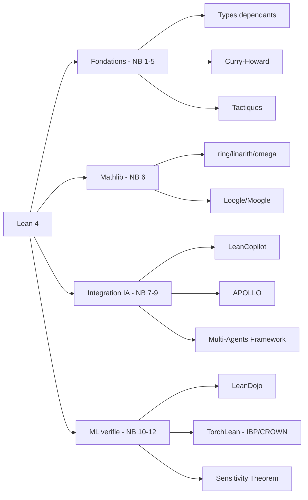

# Lean 4

14 Notebooks Jupyter — Verification formelle, Mathlib, LLM, agents autonomes

**EPITA SCIA 2026** — Serie SymbolicAI / Lean

Theorie des types dependants • Tactiques • LeanDojo • TorchLean • Sensitivity

---
layout: section
---

# Vue d'ensemble (10 min)

---

# Qu'est-ce que Lean 4 ?

**Lean 4** : assistant de preuves et langage de programmation fonctionnel base sur la **theorie des types dependants**.

- Successeur de Lean 3, reecriture complete (2021)
- Auteur principal : Leonardo de Moura (Microsoft Research, AWS)
- Compile vers C, performance native
- Ecosysteme : **Mathlib4** (~1M+ lignes de math formelle)

**Pourquoi Lean 4 maintenant ?**
- 2023-2024 : explosion d'usage en mathematiques formelles (Polynomial Freiman-Ruzsa, Liquid Tensor Experiment)
- 2024-2025 : integration LLM (AlphaProof, LeanCopilot, LeanDojo)
- 2025-2026 : agents autonomes (APOLLO, Erdos problems)

Reference : de Moura & Ullrich, *"The Lean 4 Theorem Prover and Programming Language"* (CADE 2021).

---

# Cartographie de la serie

| # | Notebook | Theme | Duree |
|---|----------|-------|-------|
| 1 | Setup | elan, kernel Jupyter, verification | 15 min |
| 2 | Dependent-Types | Calcul des Constructions, polymorphisme | 35 min |
| 3 | Propositions-Proofs | Prop, Curry-Howard | 45 min |
| 4 | Quantifiers | forall, exists, egalite, Nat | 40 min |
| 5 | Tactics | apply/exact/intro/rw/simp | 50 min |
| 6 | Mathlib-Essentials | ring/linarith/omega, recherche | 45 min |
| 7 | LLM-Integration | LeanCopilot, AlphaProof | 50 min |
| 7b | Examples | Benchmarks, cas pratiques | 40 min |
| 8 | Agentic-Proving | APOLLO, problemes Erdos | 55 min |
| 9 | SK-Multi-Agents | Agent Framework, orchestration | 45 min |
| 10 | LeanDojo | Tracing, Dojo interactif | 45 min |
| 11/11a | TorchLean | NN verifies, IBP, CROWN | 1h30-2h |
| 12 | Sensitivity-Theorem | Huang 2019, port Lean 4 | 60 min |

**Total** : ~11 heures.

---

# Modes d'execution suggeres

| Mode | Notebooks | Temps | Description |
|------|-----------|-------|-------------|
| **Fondations** | 1-5 | ~3h | Types, logique, tactiques |
| **Avec Mathlib** | 1-6 | ~3h45 | Ajoute les tactiques Mathlib |
| **Integration IA** | 1-7, 7b | ~5h | Ajoute LLMs, exemples, benchmarks |
| **Complet** | 1-12 | ~11h | Toutes les fonctionnalites |

**Architecture pedagogique** :
- Notebooks **1-5** : bases sur PDF de reference (Avigad, *Theorem Proving in Lean 4*)
- Notebooks **6-12** : etat de l'art 2024-2026

---

# Trois grands axes



---
layout: section
---

# Partie 1 — Fondations (NB 1-5, ~3h)

---

# Notebook 1 — Setup

**Installation** :

```bash
# elan : gestionnaire de versions Lean
curl https://raw.githubusercontent.com/leanprover/elan/master/elan-init.sh -sSf | sh
elan default leanprover/lean4:stable

# Verification
lean --version    # Lean 4.x.x
elan show         # toolchain active

# Kernel Jupyter (WSL requis sous Windows)
pip install lean4_jupyter
```

**Architecture** :
- `elan` : nvm-like pour Lean
- `lake` : build system (cargo-like)
- `lean4_jupyter` : kernel WSL pour notebooks
- **Windows** : execution OBLIGATOIREMENT via WSL (cf [.claude/rules/wsl-kernels.md](../../.claude/rules/wsl-kernels.md))

---

# Notebook 2 — Types dependants

**Calcul des Constructions** (Coquand & Huet, 1988) :

```lean
-- Type universe
#check Type            -- Type 1
#check Type 1          -- Type 2

-- Type polymorphe
def id {α : Type} (x : α) : α := x

-- Type dependant
def Vector (α : Type) : Nat → Type
  | 0     => Unit
  | n + 1 => α × Vector α n

#check Vector Nat 3   -- Nat × Nat × Nat × Unit
```

**Concepts cles** :
- Universes hierarchy (eviter le paradoxe de Girard)
- Inductifs : `inductive Nat | zero | succ (n : Nat)`
- Structures, classes de types
- Pi-types (`Π x : A, B x`)

---

# Notebook 3 — Propositions et preuves

**Curry-Howard** : `Propositions ≅ Types`, `Preuves ≅ Programmes`.

```lean
-- And introduction
theorem and_comm (p q : Prop) : p ∧ q → q ∧ p :=
  fun ⟨hp, hq⟩ => ⟨hq, hp⟩

-- Implication = function
theorem mp (p q : Prop) (h : p → q) (hp : p) : q := h hp

-- False elimination
theorem absurd {p q : Prop} (hp : p) (hnp : ¬p) : q :=
  (hnp hp).elim
```

**Connecteurs** : `∧ ∨ → ↔ ¬ ∀ ∃`.

Reference : Avigad, *Theorem Proving in Lean 4*.

---

# Notebook 4 — Quantificateurs et Nat

```lean
-- Universal
theorem forall_and (p q : α → Prop) :
    (∀ x, p x ∧ q x) ↔ (∀ x, p x) ∧ (∀ x, q x) :=
  ⟨fun h => ⟨fun x => (h x).1, fun x => (h x).2⟩,
   fun ⟨hp, hq⟩ x => ⟨hp x, hq x⟩⟩

-- Induction sur Nat
theorem zero_add (n : Nat) : 0 + n = n := by
  induction n with
  | zero => rfl
  | succ k ih => simp [Nat.add_succ, ih]
```

**Concepts** :
- Egalite definitionnelle vs propositionnelle
- `rfl`, `Eq.refl`, `Eq.symm`, `Eq.trans`
- Recursion structurelle vs well-founded

---

# Notebook 5 — Tactiques

**Mode tactique** : preuves construites pas a pas.

| Tactique | Usage |
|----------|-------|
| `intro` | Introduit une hypothese (pour `→` ou `∀`) |
| `exact` | Fournit un terme exact |
| `apply` | Applique un lemme (back-chaining) |
| `rw` | Reecrit avec une egalite |
| `simp` | Simplifie avec lemmes marques `@[simp]` |
| `omega` | Decision pour arithmetique lineaire sur Nat/Int |
| `linarith` | Decision pour ordres lineaires reels |
| `ring` | Decision pour anneaux commutatifs |
| `decide` | Decide une proposition decidable |

```lean
example (a b : Nat) (h : a = b) : a + 1 = b + 1 := by
  rw [h]
```

---
layout: section
---

# Partie 2 — Mathlib (NB 6, 45 min)

---

# Mathlib4

**Mathlib4** : bibliotheque de mathematiques formelles pour Lean 4.

- ~1M+ lignes de code
- ~150,000 theoremes et definitions
- Communaute Zulip active
- License Apache 2.0

**Couvre** :
- Algebre : groupes, anneaux, corps, modules
- Topologie : espaces metriques, varietes
- Analyse : limites, derivees, integrales
- Probabilites : mesures, esperance
- Combinatoire, theorie des nombres, geometrie

**Outils de recherche** :
- **Loogle** : recherche syntaxique ([loogle.lean-lang.org](https://loogle.lean-lang.org/))
- **Moogle** : recherche semantique ([moogle.ai](https://www.moogle.ai/))

---

# Tactiques Mathlib essentielles

```lean
import Mathlib

-- ring : anneaux commutatifs
example (a b : ℝ) : (a + b)^2 = a^2 + 2*a*b + b^2 := by ring

-- linarith : arithmetique lineaire
example (x y : ℝ) (h1 : x ≤ y) (h2 : y ≤ 5) : x ≤ 5 := by linarith

-- omega : Presburger sur Nat/Int
example (n : Nat) : n + 0 = n ∧ n * 1 = n := by omega

-- nlinarith : non-lineaire
example (x : ℝ) (h : 0 < x) : 0 < x^2 := by nlinarith

-- polyrith : SMT-based polynomial
example (a b : ℝ) : a^2 - b^2 = (a-b)*(a+b) := by polyrith
```

---
layout: section
---

# Partie 3 — Integration IA (NB 7-9, ~2h30)

---

# Notebook 7 — LLM Integration

**LeanCopilot** : extension Lean qui appelle des LLMs pour suggerer des preuves.

```lean
import LeanCopilot

example (a b : Nat) : a + b = b + a := by
  suggest_tactics  -- LLM propose: exact Nat.add_comm a b
```

**AlphaProof** (DeepMind, 2024) :
- LLM specialise pour Lean
- Bronze medal-equivalent au IMO 2024
- Architecture : RL + auto-formalization + theorem prover

**Patterns** :
- Auto-formalization : LLM convertit math en Lean
- Retrieval-augmented : indexation Mathlib
- Beam search sur tactiques

Reference : First et al., *AlphaProof: Formal Math Reasoning* (DeepMind, 2024).

---

# Notebook 7b — Exemples progressifs

**Benchmarks** :
- miniF2F (Lewkowycz et al.) : 488 problemes pre-college
- proofnet : 371 problemes universite
- ProofTrace : tracing de preuves

**Cas pratiques** :
- Inegalites classiques (AM-GM, Cauchy-Schwarz)
- Theoremes elementaires (Fermat petit, Euclid)
- Olympiades (IMO, Putnam)

**Methodologie** :
1. Formuler le theoreme en Lean
2. `try?` ou `exact?` pour Mathlib search
3. LLM si echec : `suggest_tactics`
4. Decomposer en lemmes intermediaires

---

# Notebook 8 — Agentic Proving

**APOLLO** (Yang et al., 2025) :
- Agent autonome pour la preuve formelle
- Architecture : planner + prover + verifier
- 99.5% sur miniF2F (vs 85% pour AlphaProof)

```python
from prover import MultiAgentSorryProver

prover = MultiAgentSorryProver(model="gpt-4o")
result = prover.prove(theorem="∀ n : ℕ, n + 0 = n")
print(result.proof)  # tactique Lean valide
```

**Problemes Erdos** : projet de formalisation de problemes ouverts (Xena Project, 2025).

**Architecture multi-agents** :
- Director : decomposition
- Tactician : choix de tactique
- Verifier : Lean kernel check
- Critic : feedback boucle

---

# Notebook 9 — SK Multi-Agents

**Microsoft Agent Framework** (anciennement Semantic Kernel) :

```csharp
using Microsoft.SemanticKernel;
using Microsoft.SemanticKernel.Agents;

var kernel = Kernel.CreateBuilder()
    .AddAzureOpenAIChatCompletion(...)
    .Build();

var prover = new ChatCompletionAgent {
    Name = "LeanProver",
    Instructions = "Generate Lean 4 proofs..."
};

var verifier = new ChatCompletionAgent {
    Name = "LeanVerifier",
    Instructions = "Check Lean compilation..."
};

await orchestration.RunAsync("Prove: ∀ n, n + 0 = n");
```

**Orchestration patterns** : sequentielle, concurrente, group chat, handoff.

---
layout: section
---

# Partie 4 — ML verifie (NB 10-12, ~3h)

---

# Notebook 10 — LeanDojo

**LeanDojo** (Yang et al., NeurIPS 2023) : framework Python pour interagir avec Lean.

```python
from lean_dojo import LeanGitRepo, trace, Dojo

# Trace un repo Lean
repo = LeanGitRepo("https://github.com/leanprover/mathlib4", "v4.x")
traced = trace(repo)

# Dojo interactif
with Dojo(theorem) as dojo:
    state = dojo.init_state
    new_state, result = dojo.run_tac(state, "intro h")
```

**Cas d'usage** :
- Dataset training pour LLMs (Mathlib4 traces)
- ReProver : RAG sur Mathlib (NeurIPS 2023)
- Benchmarking : LeanDojo Benchmark 4

Reference : Yang et al., *LeanDojo: Theorem Proving with Retrieval-Augmented Language Models* (NeurIPS 2023).

---

# Notebook 11 — TorchLean

**TorchLean** : verification formelle de reseaux de neurones via Lean 4.

**Techniques de verification** :

| Methode | Complexite | Precision |
|---------|------------|-----------|
| **IBP** (Interval Bound Propagation) | O(n) | Faible (loose bounds) |
| **CROWN** (Linear Relaxation) | O(n^2) | Moyenne |
| **LiRPA** (Linear Relaxation per Activation) | O(n^2) | Eleve |
| **MILP** (exact) | NP-hard | Exact |

**Cas d'usage** :
- Robustesse adversariale : `∀ x', ‖x - x'‖_∞ ≤ ε → f(x') = f(x)`
- Garanties de surete (autonomous driving, medical)
- Property-based verification

---

# Notebook 11a — TorchLean Python

**Implementation Python** des algorithmes IBP / CROWN / LiRPA.

```python
import torch
from torchlean import IBP, CROWN

# Bornes intervalles
model = torch.nn.Sequential(...)
x = torch.tensor([1.0, 2.0])
eps = 0.1

lb_x, ub_x = x - eps, x + eps
lb_y, ub_y = IBP(model, lb_x, ub_x)

# CROWN : bornes lineaires
A_lb, b_lb, A_ub, b_ub = CROWN(model, lb_x, ub_x)
```

**Articulation** :
- NB 11 : preuves Lean formelles (`theorem robust : ∀ x', ...`)
- NB 11a : prototype Python verifiable

Reference : Song et al., *Towards Counting Forall: Neural Network Verification via IBP, CROWN, and LiRPA*.

---

# Notebook 12 — Theoreme de sensibilite

**Theoreme de Huang** (2019) : reponse au probleme de la sensibilite (ouvert depuis 1988).

> Pour toute fonction booleenne `f : {0,1}^n → {0,1}`, la **sensibilite** `s(f)` et le **degre** `deg(f)` sont polynomialement equivalents : `deg(f) ≤ s(f)^4`.

**Outils** :
- Hypercube `{0,1}^n`
- Signing matrix `A_n` (recursive, eigenvalues ±√n)
- Cauchy interlacing

**Port en Lean 4** :

```lean
-- sensitivity_lean/Sensitivity.lean
theorem sensitivity_theorem (n : ℕ) (f : (Fin n → Bool) → Bool) :
    deg f ≤ (s f) ^ 4 := by
  -- preuve via signing matrix + Cauchy interlacing
  sorry  -- en cours de port
```

Reference : Huang, *Induced subgraphs of hypercubes and a proof of the Sensitivity Conjecture* (Ann. of Math., 2019).

---
layout: section
---

# Outils et workflow

---

# Stack technique

| Outil | Role | Path projet |
|-------|------|-------------|
| **elan** | Gestionnaire de versions | `~/.elan/` |
| **lean** | Compilateur + kernel | `lean --version` |
| **lake** | Build system | `lake build`, `lake update` |
| **mathlib4** | Bibliotheque | Dependance via `lakefile.lean` |
| **lean4_jupyter** | Kernel Jupyter | WSL Ubuntu |
| **LeanCopilot** | LLM in-editor | Extension VS Code |
| **LeanDojo** | RAG framework | `pip install lean-dojo` |
| **TorchLean** | NN verification | `pip install torchlean` |
| **APOLLO/MultiAgent** | Agents prover | `agent_tests/prover/` |

**WSL obligatoire sous Windows** : `wsl -d Ubuntu -- jupyter notebook` (cf [.claude/rules/wsl-kernels.md](../../.claude/rules/wsl-kernels.md)).

---

# Workflow developpement

```bash
# 1. Setup projet Lean
lake new myproject math
cd myproject

# 2. Editer src/MyProject.lean
# (theorems, definitions)

# 3. Build
lake build

# 4. Check proofs
lake env lean Sensitivity.lean

# 5. Search Mathlib
# - Loogle : Real.cos_sq + Real.sin_sq
# - Moogle : "Pythagorean identity"
```

**Anti-pattern interdit** (rule anti-regression) :
- Remplacer une preuve par `sorry` sans diagnostic explicite + 3 tactiques tentees
- Cf [.claude/rules/anti-regression.md](../../.claude/rules/anti-regression.md)

---

# Percees recentes (2024-2026)

| Annee | Systeme | Accomplissement |
|-------|---------|------------------|
| 2024 | **AlphaProof** | IMO 2024 silver-medal |
| 2024 | **LeanDojo** | RAG ReProver, NeurIPS 2023 |
| 2025 | **APOLLO** | 99.5% miniF2F |
| 2025 | **Erdos problems** | Projet de formalisation collective |
| 2025 | **MetaMath-Lean** | Cross-formalization |
| 2026 | **AlphaProof v2** | Gold-medal predicte |

**Mathematiques formelles 2025** :
- **Polynomial Freiman-Ruzsa** (Tao, Gowers et al., 2023)
- **Liquid Tensor Experiment** (Scholze, 2022)
- **Sphere Packing 8D** (Viazovska, formalisation en cours)

---
layout: section
---

# Ponts pedagogiques

---

# Liens avec les autres series

| Serie | Connection |
|-------|------------|
| **Tweety** | PL/FOL ↔ tactiques Lean ; SAT/SMT communs |
| **SmartContracts** | Verification Solidity (Certora, SMTChecker) similaire |
| **GameTheory** | Port Lean d'Arrow/Sen dans `social_choice_lean/` |
| **ML** | TorchLean : verification de NN entraines |
| **Search** | CSP : preuves de correction d'algorithmes |
| **Planners** | Verification de plans STRIPS/PDDL |

**Slides connexes** :
- S1 — Argumentation (logique propositionnelle, connecteurs)
- S2 — IA exploratoire symbolique (contexte historique de la verification)
- S6 — Tweety (logiques formelles complementaires)

---

# Parcours suggere

**Decouverte (3h)** : Notebooks 1-5 (fondations).

**Approfondissement Mathlib (1h)** : Notebook 6.

**LLM-assisted (2h)** : Notebooks 7, 7b.

**Agents autonomes (1h45)** : Notebooks 8-9.

**ML verifie (3h)** : Notebooks 10, 11, 11a, 12.

**Projet integrateur** (suggestion) :
- Formaliser un theoreme classique (Cauchy-Schwarz, BNF)
- Implementer un mini-prover via LLM (notebook 7+8)
- Verifier un classifieur MNIST robuste (notebook 11)

---
layout: section
---

# Ressources

---

# Documentation officielle

**Lean 4** :
- [Theorem Proving in Lean 4](https://leanprover.github.io/theorem_proving_in_lean4/) — Avigad
- [Lean 4 Documentation](https://leanprover.github.io/lean4/doc/)
- [Mathematics in Lean](https://leanprover-community.github.io/mathematics_in_lean/)
- [Functional Programming in Lean](https://lean-lang.org/functional_programming_in_lean/)

**Mathlib4** :
- [API Docs](https://leanprover-community.github.io/mathlib4_docs/)
- [GitHub](https://github.com/leanprover-community/mathlib4)
- [Loogle](https://loogle.lean-lang.org/) — recherche syntaxique
- [Moogle](https://www.moogle.ai/) — recherche semantique

**Communaute** :
- [Lean Zulip](https://leanprover.zulipchat.com/)
- [Lean community](https://leanprover-community.github.io/)

---

# References academiques

| Reference | Couverture |
|-----------|------------|
| de Moura & Ullrich (2021) | Lean 4 system (CADE) |
| The Mathlib Community (2020) | arXiv:1910.09436 |
| Avigad (2024) | *Theorem Proving in Lean 4* |
| Yang et al. (NeurIPS 2023) | LeanDojo, RAG ReProver |
| First et al. (2024) | AlphaProof (DeepMind) |
| Song et al. (2025) | TorchLean IBP/CROWN/LiRPA |
| Huang (2019) | Sensitivity theorem (Ann. of Math.) |
| Geanakoplos (2005) | Arrow's theorem (cross-series GameTheory) |
| Sen (1970) | Collective choice (cross-series GameTheory) |

---

# Quick start

```bash
# 1. elan + Lean 4
curl https://raw.githubusercontent.com/leanprover/elan/master/elan-init.sh -sSf | sh
elan default leanprover/lean4:stable

# 2. WSL (Windows) : conda + lean4_jupyter
wsl -d Ubuntu
conda create -n lean4-jupyter python=3.10
conda activate lean4-jupyter
pip install lean4_jupyter

# 3. Lancer le notebook 1
jupyter notebook MyIA.AI.Notebooks/SymbolicAI/Lean/Lean-1-Setup.ipynb
```

**Pour les notebooks 7-10** (LLM) : configurer `.env` avec `OPENAI_API_KEY` ou `ANTHROPIC_API_KEY`.

**Validation rapide** :

```bash
python scripts/notebook_tools/wsl_papermill.py check-env
```

---
layout: center
---

# Questions ?

*De la theorie des types aux IA formellement verifiees*
